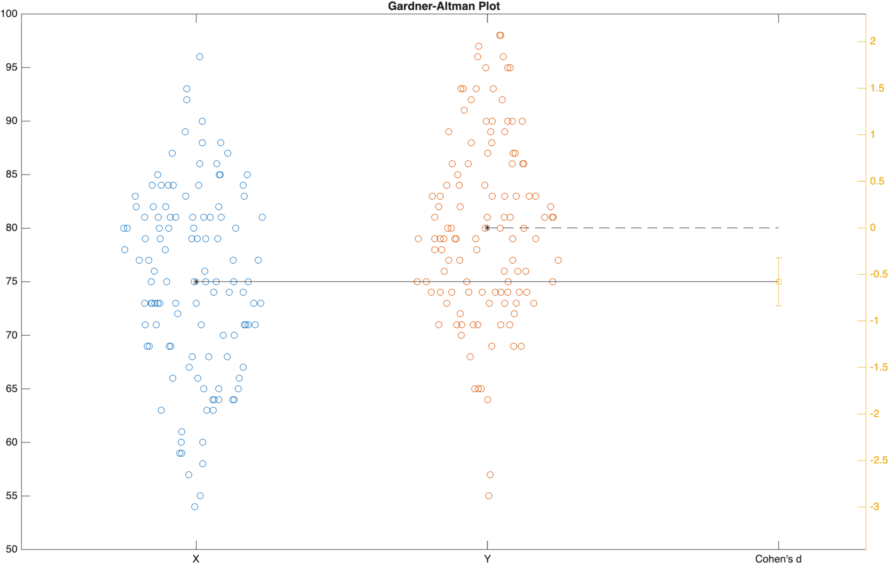
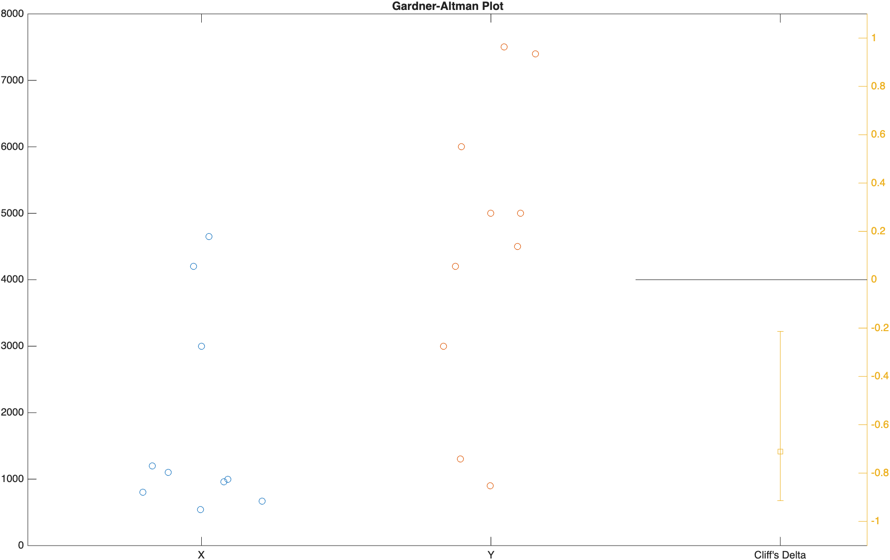

# Effect Size

!!! quote "Statistical significance is the least interesting thing about the results. You should describe the results in terms of measures of magnitude – not just, does a treatment affect people, but how much does it affect them."

    — Gene V. Glass

**Overview of Topics Covered**

- Statistical vs Practical Significance
- Effect Size for Parametric Data (Cohen's d)
- Effect Size for Nonparametric Data (Cliff's Delta)
- Visualizing Effect Size

## Useful Resources

- :material-web: [Wikipedia: Effect size](https://en.wikipedia.org/wiki/Effect_size){target="_blank"}
- :material-web: [Wikipedia: Cliff's delta](https://en.wikipedia.org/wiki/Effect_size#Effect_sizes_in_nonparametric_tests){target="_blank"}
- [MATLAB Documentation: meanEffectSize](https://www.mathworks.com/help/stats/meaneffectsize.html){target="_blank"}
- [MATLAB Documentation: gardnerAltmanPlot](https://www.mathworks.com/help/stats/gardneraltmanplot.html){target="_blank"}

## Statistical vs Practical Significance

In the [previous module](HypTesting.md), we used p-values to decide whether two samples were *significantly* different. But a low p-value only tells you that a difference *probably* isn't due to random chance—it says nothing about whether that difference is big enough to actually matter.

Here's the catch: p-values are extremely sensitive to sample size. Given a large enough sample, even a trivial, practically meaningless difference will eventually become "statistically significant" (`p < 0.05`). Imagine a new studying technique that improves exam scores by an average of `0.1` points out of `100`. That's not a difference anyone would care about in the real world, but with a large enough sample of students, a t-test could easily report that difference as statistically significant.

This is where **effect size** comes in. Effect size quantifies *how big* a difference is, independent of sample size. It's the difference between a statistician saying "yes, that's a real difference" (p-value) and "yes, and here's how much it actually matters" (effect size).

!!! note "Statistical Significance vs Effect Size"
    - **Statistical Significance (p-value)**: How *likely* is it that this difference happened by chance?
    - **Effect Size**: How *big* is the difference, regardless of sample size?

    A result can be statistically significant with a tiny effect size (a huge sample detecting a trivial difference), or practically important with a large effect size that fails to reach statistical significance (a small, underpowered sample). Good scientific reporting includes both.

## Effect Size for Parametric Data

For normally-distributed data—the same kind of data you'd feed into a t-test (see [Hypothesis Testing](HypTesting.md))—the standard effect size measure is **Cohen's d**. Cohen's d expresses the difference between two means in units of standard deviation, which makes it comparable across studies that use completely different measurement scales.

$$d = \frac{\bar{x}_1 - \bar{x}_2}{s_{pooled}}$$

A `d` of `1.0` means the two group means are a full standard deviation apart. A `d` of `0` means the means are identical.

MATLAB's [**`meanEffectSize`**](https://www.mathworks.com/help/stats/meaneffectsize.html){target="_blank"} function calculates Cohen's d (and several other effect size measures) directly, along with a confidence interval.

Let's revisit the exam grades from the [Hypothesis Testing](HypTesting.md) module. Recall that Exam 1 and Exam 4 were *not* significantly different (`p=0.98`):

```matlab linenums="1" title="Load example data"
load examgrades.mat % load fake dataset grades
x1 = grades(:,1); % extract exam 1 grades
x4 = grades(:,4); % extract exam 4 grades
```

```matlab linenums="1" title="Cohen's d for Exam 1 vs Exam 4"
Effect = meanEffectSize(x1,x4,Effect="cohen")
```

```matlab title="result"
Effect =

  1×2 table

                 Effect      ConfidenceIntervals 
               __________    ____________________

    CohensD    -0.0028774    -0.25511     0.24936
```

…Unsurprisingly, Cohen's d here is essentially `0`. The samples aren't just "not significantly different"—they're not practically different either. Both the p-value and the effect size agree.

Now let's compare Exam 1 to the *curved* version of Exam 4 (where we added 5 points to every score), which we found *was* significantly different (`p=0.000011`):

```matlab linenums="1" title="Cohen's d for Exam 1 vs curved Exam 4"
modX4 = x4+5; % curve exam 4 grades by 5 points
EffectCurved = meanEffectSize(x1,modX4,Effect="cohen")
```

```matlab title="result"
EffectCurved =

  1×2 table

                Effect     ConfidenceIntervals
               ________    ___________________

    CohensD    -0.57836    -0.8353    -0.32025
```

…Here, Cohen's d is `-0.58`, which—as you'll see in the interpretation table below—counts as a **medium** effect. So not only is the curved Exam 4 significantly higher than Exam 1, the difference is also large enough to be practically meaningful, not just statistically detectable.

!!! abstract "Interpreting Cohen's d"
    Cohen (1988) suggested the following rough guidelines for interpreting the magnitude of `d`. These are just conventions, not hard rules—the "right" effect size always depends on your field and what's actually at stake.

    | \|d\| | Interpretation |
    |------|----------------|
    | ~0.2 | Small effect |
    | ~0.5 | Medium effect |
    | ~0.8 | Large effect |

### Paired Data

Just like [**`ttest`**](HypTesting.md#paired-t-tests) has a paired counterpart to **`ttest2`**, **`meanEffectSize`** accepts a `Paired` option for samples that aren't independent (like the same 120 students taking both Exam 1 and Exam 4):

```matlab linenums="1" title="Paired Cohen's d for Exam 1 vs Exam 4"
EffectPaired = meanEffectSize(x1,x4,Effect="cohen",Paired=true)
```

```matlab title="result"
EffectPaired =

  1×2 table

                 Effect      ConfidenceIntervals 
               __________    ____________________

    CohensD    -0.0028683    -0.20221     0.19641
```

…The result is nearly identical here (as expected, since Exam 1 and Exam 4 really aren't different), but notice the confidence interval is narrower than the unpaired version above—pairing accounts for the natural variability between individual students, giving you a more precise estimate of the effect.

## Effect Size for Nonparametric Data

For non-normal data—the kind you'd test with a Mann-Whitney U test (see [Testing Non-normal Data](HypTesting.md#testing-non-normal-data))—Cohen's d isn't appropriate, since it assumes normally-distributed data. Instead, you can use **Cliff's Delta**, a rank-based effect size that doesn't assume any particular distribution.

Cliff's Delta ranges from `-1` to `1` and represents the probability that a randomly chosen value from one group is greater than a randomly chosen value from the other group, minus the probability of the reverse. A value of `0` means complete overlap between the groups; a value of `±1` means the groups don't overlap at all.

Let's revisit the Viral Load data from the [Mann-Whitney U Test](HypTesting.md#mann-whitney-u-test) example, where we found the Treated and Untreated groups were significantly different (`p=0.008`):

```matlab linenums="1" title="Cliff's Delta for Treated vs Untreated Viral Load"
x = T.ViralLoad(T.Treatment=="Treated");
y = T.ViralLoad(T.Treatment=="Untreated");
EffectCliff = meanEffectSize(x,y,Effect="cliff")
```

```matlab title="result"
EffectCliff =

  1×2 table

                   Effect    ConfidenceIntervals 
                   ______    ____________________

    CliffsDelta    -0.71     -0.91507     -0.2132
```

…A Cliff's Delta of `-0.71` is a large effect (see the guidelines below), meaning there's very little overlap between the Treated and Untreated viral loads. This backs up what the Mann-Whitney test told us, and adds the crucial "how much" that the p-value alone can't provide.

!!! abstract "Interpreting Cliff's Delta"
    Commonly cited thresholds (Romano et al., 2006) for the magnitude of Cliff's Delta:

    | \|δ\| | Interpretation |
    |------|----------------|
    | < 0.147 | Negligible effect |
    | 0.147 – 0.33 | Small effect |
    | 0.33 – 0.474 | Medium effect |
    | ≥ 0.474 | Large effect |

## Visualizing Effect Size

Numbers in a table are useful, but a picture is often more persuasive. The function [**`gardnerAltmanPlot`**](https://www.mathworks.com/help/stats/gardneraltmanplot.html){target="_blank"} plots the raw data from both groups side-by-side, alongside the effect size and its confidence interval, all in one figure.

```matlab linenums="1" title="Gardner-Altman plot for Exam 1 vs curved Exam 4"
figure(Visible="on")
gardnerAltmanPlot(x1,modX4,Effect="cohen")
```

{ width="500"}

>On the left, the raw data for both groups is plotted (with the means connected by a line). On the right, the effect size (Cohen's d) is plotted with its confidence interval. If the confidence interval doesn't cross zero, the effect is significant—but more importantly, you can see at a glance just how large that effect actually is.

The same function works with Cliff's Delta for nonparametric comparisons:

```matlab linenums="1" title="Gardner-Altman plot for Treated vs Untreated Viral Load"
figure(Visible="on")
gardnerAltmanPlot(x,y,Effect="cliff")
```

{ width="500"}

## Reporting Effect Size

When you report the results of a hypothesis test, it's good practice to report the effect size alongside the p-value, not instead of it. Something like the following:

```matlab linenums="1" title="Formatting the report"
s = sprintf('Modified Exam 4 scores were significantly higher than Exam 1 scores, ');
s = sprintf('%s%1.2f ± %1.2f" vs %1.2f ± %1.2f" (M±SD), respectively,\n', s, mean(x1), std(x1),mean(modX4), std(modX4));
s = sprintf('%st(238) = -4.49, p < .0001, Cohen''s d = %1.2f.', s, EffectCurved.Effect);
disp(s)
```

```matlab title="result"
Modified Exam 4 scores were significantly higher than Exam 1 scores, 75.01 ± 8.72" vs 80.03 ± 8.60" (M±SD), respectively,
t(238) = -4.49, p < .0001, Cohen's d = -0.58.
```

…Notice that we now report both the p-value *and* the effect size—giving the reader both halves of the story: "this difference is real" and "this is how much it matters."

## Challenge

??? question "Effect Size for Exam 2 vs Exam 3"

    === "Question"

        In the [Hypothesis Testing challenge](HypTesting.md#challenge), we found that Exam 2 and Exam 3 were not significantly different (`h=0`, `p=1`).

        1. Calculate Cohen's d for Exam 2 vs Exam 3.
        2. Based on the effect size (not just the p-value), how would you describe the practical difference between these two exams?

    === "Answer"

        ```matlab linenums="1"
        x2 = grades(:,2);
        x3 = grades(:,3);
        Effect23 = meanEffectSize(x2,x3,Effect="cohen")
        ```

        ```matlab title="result"
        Effect23 =

          1×2 table

                       Effect    ConfidenceIntervals 
                       ______    ____________________

            CohensD      0       -0.25223     0.25223
        ```

        Cohen's d is exactly `0`. Combined with `p=1` from the earlier challenge, this is about as clear a "no difference" as you'll ever see—not only is there no statistically significant difference, there's no practical difference either. The two lines of evidence agree completely.

