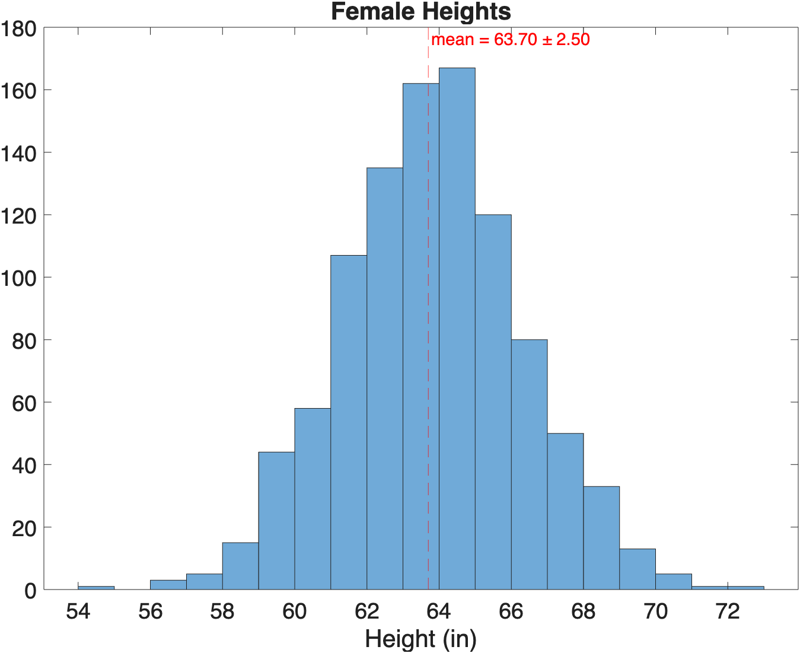

# Populations, Samples, and Distributions

As we muddle through data analysis, we will also be muddling through some basic concepts in statistics. Here are some concepts and terminology you should know.

!!! quote

    "There are three kinds of Lies: Lies, Damned Lies, and Statistics." — Benjamin Disraeli.

## Useful Resources

- [Investopedia Analysis Tools](https://www.investopedia.com/tools-for-fundamental-analysis-4689755)
  - [Populations](https://www.investopedia.com/terms/p/population.asp)
  - [Normal Distribution](https://www.investopedia.com/terms/n/normaldistribution.asp#:~:text=The%20Bottom%20Line-,Normal%20distribution%2C%20also%20known%20as%20the%20Gaussian%20distribution%2C%20is%20a,defined%20by%20the%20standard%20deviation.)
- [Psych Explained YouTube series](https://www.youtube.com/@PsychExplained)
  - [Random Sampling](https://www.youtube.com/watch?v=r-rFO_2NsgI&list=PL_pCzdGjrXUXiNIaoUNjjxZ4sAu8ypV-y&index=6)

## Populations and Samples

- **Population (N)**: the complete set of items or events that share a common attribute, from which data can be gathered and analyzed. Whatever it is that you want to know about.
- **Sample (n)**: a subset of the Population
  - **Non-probablity Sampling:** A sample from what's available, what was convenient to collect
  - **Random Sampling:** Samples selected based on randomized technique designed on increase the validity (or representativeness) of the sample

{ width="550"}

>**Examples of Populations vs samples.** Populations (in pink) can be All US Citizens, all Adult US citizens, or even just adult citizens in the state of Colorado. Samples (in yellow) would be subsets of whatever you define as your population.

## External Validity

The key to a good sample is that it is representative of the entire population. For example, if your population is 50% women, than your sample should be 50% women.

External Validity is a just a fancy term for defining how representation your sample is of the population.

- **High external validity**: Your sample is representative
- **Low external validity:** not so much. Your sample may have some bias or is too small (and maybe has a large number of outliers)

{ width="350"}

>With a representative sample that has high external validity, you can make inferences (or predictions) about the population at large.

## The Bell Curve is Normal

{ width="250"}

When you measure things, like humans, you will find that their parts vary: height, weight, foot size, the spacing between the eyes. These parts all use the same template, but vary in dimension. If you take a lot of these measurements (i.e. a large sample), and plot the measurements as a histogram, you often get a bell-shaped histogram. In fact, the bell curve shape was so common, they called it a "Normal" curve (or, if you're boring, a Gaussian curve, after the [wrong mathematician](https://en.wikipedia.org/wiki/Abraham_de_Moivre) Johann Carl Friedrich Gauss).

For example, if you measure the heights of a bunch of women, you get a histogram that looks something like this:

{ width="450"}

>**Histogram of Female Heights**. Sure looks like a bell curve.

??? example "Generating Normal Data for the Histogram"

    Note, no women were actually measured in the creation of the above histogram. Instead, we used the random number generator **`randn`** in the following code 

    ```matlab
    mu = 63.7; % mean height of women as reported on google
    sigma = 2.5; % standard deviation
    heights = sigma.*randn(1000,1)+mu; % generate random numbers with mean mu and std sigma
    histogram(heights) % plot histogram
    xline(mu,'--r','mean')
    title(sprintf("Average Female Height = %1.2f±%1.2f",mu,sigma))
    xlabel("Height (in)")
    ```

### The Empirical Power of the Bell Curve

*Well, ok, I guess that's interesting, but how does that help me in the real world?*

Well, the bell curve is so powerful because we can use math to transform it into a normal probability density function that gives us the probability of any value in reference to the mean and standard deviation, as shown in this figure:

{ width="550"}

>**Normal Probability Distribution Function**. µ - the mean, 𝜎 - the standard deviation (SD). Adding up the area under the curve gives you the percentage of measurements that fall in that range. For all normal distributions, 68.3% of the observations will appear within plus or minus one standard deviation of the mean; 95.4% will fall within +/- two standard deviations; and 99.7% within +/- three standard deviations. This fact is sometimes called the **"empirical rule"**, because people (math nerds) saw this phenomenon happen over and over. Read more about [PDFs on Wikipedia](https://en.wikipedia.org/wiki/Probability_density_function).

So, for the heights of females discussed above, 68% of all heights fall between -1SD and +1SD, and 95% of heights fall between -2SD and +2SD. You can also say that a female height that falls outside three SD from the mean, e.g. a woman who's height is 5'11" (or 71.2"), would be a rare occurrence, vernacularly known as being "really tall".

{ width="500"}

*Not sure this helps me in the real world, but ok.*

## Hypothesis Testing

Statistics does not tell us whether we are right. It tells us the chances of being wrong.

When we repeat an experiment, we almost never get exactly the same results. Instead, repeated measurements span a range of values due to biological variability and precision limits of measuring equipment. But if results are different each time, how do we determine whether a measurement is truly different or just randomly different?

Hypothesis testing is used to determine the probability of whether a group of measurements is truly different different or not. When performing hypothesis testing, you first set up a null hypothesis, which means there is no difference between samples. The alternative hypothesis is that there is a difference.

## Parametric Testing

A parametric test assumes that the data comes from a population that can be adequately modeled by a probability distribution (like a Normal Curve).
Hypothesis Testing that use t-tests and normal curves are a type of Parametric Testing. This involves Most often this involves calculating a mean and a standard deviation and performing a t-test.

!!! note "Key Characteristics of a Parametric test"
    - They assume a normal distribution for the data.
    - They are best used when the sample size is greater than 30
    - They are very powerful when used correctly

### T-tests and P-values

A  common form of hypothesis testing uses a **t-test**. T-tests rely on normal distributions. The output of a t-test is a p-value, which is a quantification of probability that your result is due to solely to chance. The lower the p-value, the more unlikely your result is due to chance (but there is still a chance!).

```matlab linenums="1" title="A two-sample t-test in MATLAB"
[h,p] = ttest2(x,y)
```

- **h**: either 0 or 1. If 1, then the t-test rejects then null hypothesis that the two samples come from the same distribution (that is, the samples are consider significantly different).
- **p**: The p-value. p-values range from 0 to 1.  Less than 0.05 is commonly considered significant

[How to properly report a t-test in APA style.](https://www.socscistatistics.com/tutorials/ttest/default.aspx)

### Control vs Experimental groups

One of the most fundamental experimental designs is to compare a control group with an independent group that has been subjected to some intervention. This design is called two-independent group.

