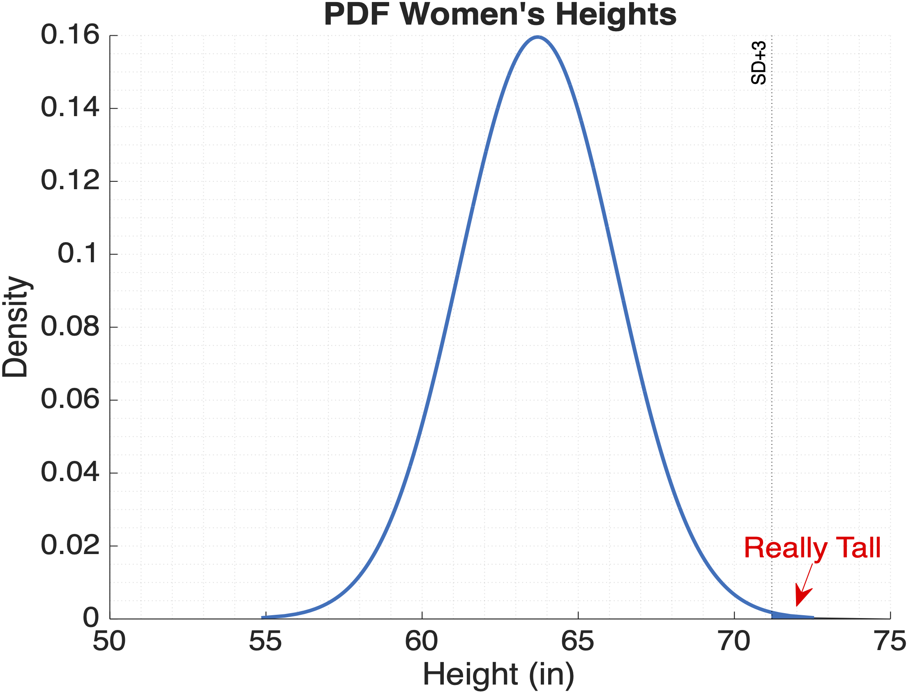

# Sampling and Distributions

!!! quote "There are three kinds of Lies: Lies, Damned Lies, and Statistics."

    — Benjamin Disraeli (probably).

As we muddle through data analysis, we will also be muddling through some basic concepts in statistics. Here we cover arcane topics such as:

- Population vs Sample
- Normal Curves
  
## Useful Stats Resources

- :material-web: [Investopedia Analysis Tools](https://www.investopedia.com/tools-for-fundamental-analysis-4689755){target="_blank"}
- :material-web: [Psych Explained YouTube series](https://www.youtube.com/@PsychExplained){target="_blank"}
- :material-web: [MATLAB Statistics Onramp](https://matlabacademy.mathworks.com/details/statistics-onramp/orst)

## Populations and Samples

When collecting data, it's good to know the data's provenance:

- Where did this data come from?
- How Representative is this Data?

:material-web: **Reference:** [Investopedia - Populations](https://www.investopedia.com/terms/p/population.asp){ target="_blank" }

### Important Terminology

- **Population (N)**: the complete set of items or events that share a common attribute, from which data can be gathered and analyzed. Whatever it is that you want to know about. Note the big "N" here. Measuring the entire population is usually not practical due to its size, cost, or logistical challenges.
- **Sample (n)**: a subset of the Population. Note the little "n" here. This is typically what you measure.
  - **Non-probability Sampling:** A sample from what's available, what was convenient to collect. Great for starter data, but may not be representative
  - **Random Sampling:** Samples selected using a randomized technique designed to increase the validity (or representativeness) of the sample

{ width="550"}

>**Examples of Populations vs samples.** Populations (in pink) can be All US Citizens, all Adult US citizens, or even just adult citizens in the state of Colorado. Samples (in yellow) would be subsets of whatever you define as your population.

:material-web: [Adapted from Psych Explained: Random Sampling](https://www.youtube.com/watch?v=r-rFO_2NsgI&list=PL_pCzdGjrXUXiNIaoUNjjxZ4sAu8ypV-y&index=6){target="_blank"}

#### Groups

Often we break our samples down into different categories, or groups. Very often, you will read about the Control Group or the Experimental Group. The Control group is typically the unmodified group, while the Experimental group has been treated in some fashion (sometimes called the Treatment Group).

So, for example, we could break our CO Citizens Samples down into two groups as follows:

- **Control Group**: those who have never tried marijuana before
- **Experimental group**: those who use marijuana daily

And then we measure something else, like response time, and use statistics to determine if there is a difference in response time between the groups.

### External Validity

*External what?*

External Validity is a just a fancy term for defining how representative your sample (n) is of the population (N).

The key to a good sample is that it is representative of the entire population. For example, if your population is 50% women, then your sample should be 50% women.

- **High external validity**: Your sample is representative
- **Low external validity**: not so much. Your sample may have some bias or is too small (and maybe has a large number of outliers)

{ width="350"}

>With a representative sample that has high external validity, you can make inferences (or predictions) about the population at large.

## The Bell Curve is Normal

{ width="250"}

When you measure things, like humans, you will find that their parts vary: height, weight, foot size, the spacing between the eyes (I'm looking at you, Anna Taylor Joy). But each of these measurements won't vary *too* greatly between humans—they tend to fall with a certain range. If you take a large enough sample (>30) and plot the measurements as a histogram, you should get a histogram that looks something like this:

{ width="450"}

>**Histogram of Female Heights**. In this sample of 1000 women, the average height was 63.2 and the standard deviation was 0.25.  Notice how the most frequent heights are clustered around the mean in the center of the histogram. Also notice we don't have any 50" or 80" women (4'2" or 6'7") in our sample.

??? example "Generating Normal Data for the above Histogram"

    No women were actually measured for the creation of the above histogram. Instead, we used the random number generator **`randn`** in the following code.

    ```matlab
    mu = 63.7; % mean height of women as reported on google
    sigma = 2.5; % standard deviation
    heights = sigma.*randn(1000,1)+mu; % generate random numbers with mean mu and std sigma
    histogram(heights) % plot histogram
    xline(mu,'--r','mean')
    title(sprintf("Average Female Height = %1.2f±%1.2f",mu,sigma))
    xlabel("Height (in)")
    ```

If you fit a curve to this histogram, you get a bell-shaped curve.

{ width="450"}

In fact, this bell-shaped curve  was so common, they called it a "Normal" curve (1).
{ .annotate }

1. Or, if you're boring, a "Gaussian" curve, after the [wrong mathematician](https://en.wikipedia.org/wiki/Abraham_de_Moivre){target="_blank"} Johann Gauss.

!!! abstract "Anatomy of a Normal Curve"
    A normal curve is determined by two components:

    1. **The Mean**: which determines the center of the curve.
    2. **The Standard Deviation (SD)**: which determines the width of the curve
   
    In a Normal Curve, the **Mean, Median, and Mode are all equal**.

    :material-web: [Investopedia: Normal Distribution](https://www.investopedia.com/terms/n/normaldistribution.asp){target="_blank"}

### The Empirical Power of the Bell Curve

*I guess that's interesting, but how does that help me in the real world?*

The bell curve is so powerful because it allows us to calculate the probability of any value in reference to the mean and standard deviation. This something is called a **Normal Probability Density Function (PDF)**—a fancy term for the math function that creates the normal curve.

!!! note "Key points about the Probability Density Function (PDF)"
      - It is a mathematical function that generates the normal curve.
      - It describes the likelihood of a value occurring within a specific range.
      - The area under the curve represents the total probability, which equals 1.

{ width="550"}

>**The Normal Probability Distribution Function can predict frequency**. **µ**: the mean, **𝜎**: the standard deviation. Adding up the area under the curve gives you the percentage of measurements that fall in that range. For all normal distributions, 68.3% of the observations will appear within plus or minus one standard deviation of the mean; 95.4% will fall within +/- two standard deviations; and 99.7% within +/- three standard deviations. This fact is sometimes called the **"empirical rule"**, because people (math nerds) saw this phenomenon happen over and over. Read more about [PDFs here](https://en.wikipedia.org/wiki/Probability_density_function){target="_blank"} if you are looking for a good soporific.

So, for the heights of females, 68% of all heights would fall between -1SD and +1SD, and 95% of heights fall between -2SD and +2SD. We can use these facts to predict the likelihood of any height. For example, a height of 64" would be pretty likely as most female heights fall in that range. And a female height that falls outside three SD from the mean, such as 71.2", would be fairly unlikely. In the population of women, there are relatively few women with a height of 5'11" or greater—a condition vernacularly known as being "really tall".

{ width="400"}

*Not sure this helps me in the real world, but ok.*

### Seeing normality

When analyzing data, it is important to first visualize that data to get a good idea of its distribution. When you do so, look for symmetry in the distribution plot. This is often an indicator of normality.

Consider the following comparison of a box plot vs the histogram of the height data:

{ width="450"}

>Here we have the same female height data plotted as a both a box plot and a histogram. We have turned the histogram on its side for easier comparison. In the histogram, the bars are symmetrically arrayed on either side of the mean (dotted red lin). In the box plot, the mean (middle blue line) is in the center of the interquartile range (IQR) box, or the middle 50% of the data. Also, the whiskers extend to an equal extent on either side of the IQR. Notice in the bar plot how the mean and the median are equal.

??? example "Code to Plot Box Chart and Histogram"

    ```matlab linenums="1"
    figure(Visible="on")
    tiledlayout("horizontal","TileSpacing","compact")

    nexttile % bar plot
    hb = boxchart(heights); % box plot
    yline(mu,'r:','label','mean');
    ylabel("Height (in)")
    title("Box plot")
    ylim([55 75]) % y limits
    hb.Parent.XAxis.Visible='off'; % turn off x-axis
    grid minor % turn on grid

    nexttile % histogram
    histogram(heights,Orientation="horizontal") % histogram
    hy = yline(mu,'r:');
    title("Histogram")
    ylim([55 75])

    sgtitle("Female Heights",fontsize=18)
    ```

!!! note "Box Plots vs Normal Curves"

    Box plots summarize the data differently then PDFs. A box plot breaks down the distribution by quartiles, while PDFs use the mean and standard deviation.

    { width="450"}
    >IQR = interquartile range. The length of a whisker is typically 1.5 times the IQR.

    [Wikipedia: Interquartile Range](https://en.wikipedia.org/wiki/Interquartile_range){target="_blank"}

A similar symmetry around the mean can be seen in swarm and violin plots.

{ width="450"}

>Swarm and violin charts of the female heights. Notice that the fattest parts of the plots are centered around the median. This is where the majority of the data is concentrated.

??? example "Code to Plot Swarm and violin plots"

    ```matlab linenums="1"
    figure(Visible="on")
    tiledlayout("horizontal")

    nexttile % swarm chart
    mmBoxSwarm([],heights); % overlay box and swarm charts
    ylim([55 75]) % set y limits
    title("Swarm")
    grid minor 

    nexttile % violin chart
    hc = mmBoxSwarm([],heights,"PlotType",'violin'); % overlay box and violin
    ylim([55 75]) % set y limits
    title("Violin")
    grid minor

    sgtitle("Female Heights",fontsize=18)
    ```

### Size matters for Normality

Sample size is an important consideration for data processing. Generally, larger sample sizes offer more reliable results, but practical considerations like cost and time may limit how large a sample may be. A [sample of size greater than `30`](https://pmc.ncbi.nlm.nih.gov/articles/PMC3915399/) is often considered to be a good target to for a normal distribution.

As shown below, low sample size can be susceptible to large random effects. Even if a sample comes from a large, normally distributed population (like the heights of all Women), you likely won't get a normal distribution in the sample if your sample size is too small.

{ width="650"}

>Here we plot a histogram of a female heights with an increasing sample size (n). We don't really see a normal distribution until `n=30`

??? example "Code to generate the above tiled histogram figure"

    ```matlab linenums="1"
    female.mu = 63.7;
    female.sigma = 2.5;

    for n=[5 10 20 25 30 100]

    female.height = female.sigma * randn(n,1) + female.mu;
    
    nexttile 
    histfit(female.height,10); % histogram with normal curve
    colororder("glow12") % set the color palette to glow12
    title(sprintf('n = %d',n)) % add sample size to the title
    xlim([40 80]) % set the x limits for better comparison
    end
    ```

## Skewed Distributions

There are, of course, other types of data distributions. A unimodal [skewed distribution](https://en.wikipedia.org/wiki/Skewness){target="_blank"} has an asymmetry in the distribution. For example, consider the following:

{ width="450"}

>**Left Skewed Data.** In this histogram, the high frequency data is piled up high on right side of the plot, while much of the low frequency data is spread across the left side of the plot. This low frequency data is sometimes called the tail of the plot. Such a distribution of the data is considered to be **Skewed Left** because the tail is to the left of the high frequency data.

Notice that the histogram is not well fit by a normal curve (orange curve) — there's a big hump on the right and a long tail on the left. By comparison, the following data is skewed right…

{ width="450"}

>**Right Skewed data.** Here, the tail is to the right of the highest frequency data.

### Skewed Mean vs Median

In Normal data, the mean and median are equal. In skewed data, they are not.

{ width="450"}

Notice in both datasets that the median value is closer to the highest frequency value (mode) than the mean value. So, for skewed data, you often report the median because it is more representative of the data.

??? example "Code to generate Histogram Plots"

    ```matlab linenums="1" title="Generating and Displaying skewed data"
    % Generate Data
    rng default  % For reproducibility of random numbers
    left.x = [normrnd(4,1,1,100),normrnd(6,0.5,1,200)]; % left skewed data
    left.mean = mean(left.x); % calc left mean
    left.median = median(left.x); % calc left median

    right.x = wblrnd(6,1,300,1); % create right skewed data
    right.mean = mean(right.x); % calc right mean
    right.median = median(right.x); % calc right median

    % Plot Data
    figure(Visible="on")
    tiledlayout("horizontal")

    nexttile % Plot Left Skewed Data
    hh = histogram(left.x, FaceAlpha=0.15); % histogram left data
    hh.FaceAlpha = 0.25; % box transparency
    hh.EdgeAlpha = 0.25; % edge transparency
    title("Left Skewed")

    hold on % add left vertical lines
    xline(left.mean,'k-',LineWidth=1,Alpha=1) % plot left mean vert line
    xline(left.median,'r:',LineWidth=1.5) % plot left median vert line

    nexttile % Plot Right Skewed Data
    hh = histogram(right.x); % histogram right
    hh.FaceAlpha = 0.25; % box transparency
    hh.EdgeAlpha = 0.25; % edge transparency

    hold on % add right vertical lines
    xline(right.mean,'k-',LineWidth=1,Alpha=1) % plot right mean vert line
    xline(right.median,'r:',LineWidth=1.5) % plot right median vert line
    title('Right Skewed')
    legend('data','mean','median') % add legend
    ```

    Some of this code adapted from the [Mathworks Exploratory Stats documentation](https://www.mathworks.com/help/stats/exploratory-analysis-of-data.html).

### Visualizing Skewed Data in Distribution plots

To spot skewed data, look for asymmetry in the plots.  Here we plot our skewed data as box plots.

{ width="450"}

> Notice for both plots, how the median is off-centered in the interquartile box.  The open-face blue circles indicate the outlier data, which are found in the tails of the skewed distributions. There is also an asymmetry in the extent of the whiskers on either sides of the boxes.

??? example "Code to generate Box Plots"

    ```matlab linenums="1"
    figure(Visible="on")
    tiledlayout("horizontal")

    nexttile % plot left skewed data
    hb = boxchart(left.x); % box plot  
    hb.Parent.XAxis.Visible='off'; % hide x-axis
    grid on % turn on grid

    title("Left Skewed")

    nexttile % plot right skewed data
    hb = boxchart(right.x); % box plot
    hb.Parent.XAxis.Visible='off'; % turn off x-axis
    grid on % turn on grid

    title("Right Skewed")
    ```

And here is the same data as a swarm chart overlaid on a box plot…

{ width="450"}

>Swarm charts add jitter along the x-axis to highlight density so that the fattest (or widest) parts of the plot have the most data points and clustered around the median. As you can see in these plots, fat regions will be off-centered for a skewed dataset.

??? example "Code to generate Swarm Charts"

    ```matlab linenums="1"
    figure(Visible="on")
    tiledlayout("horizontal")

    nexttile % plot Left Skewed
    hold on
    swarmchart(ones(1,numel(left.x)),left.x,'filled',MarkerFaceAlpha=0.5) % swarm
    hb = boxchart(ones(1,numel(left.x)),left.x,BoxFaceColor='k',BoxFaceAlpha=0.1); % box
    hb.Parent.XAxis.Visible='off';
    grid on

    title("Left Skewed")

    nexttile % plot Right skewed
    hold on
    swarmchart(ones(1,300),right.x,'filled',MarkerFaceAlpha=0.5) % swarm
    hb = boxchart(ones(1,300),right.x,BoxFaceColor='k',BoxFaceAlpha=0.1); % box
    hb.Parent.XAxis.Visible='off';
    grid on

    title("Right Skewed")
    ```

The shapes of a swarm and violin chart are basically the same since they both use the same density function to determine the extent of the jitter along the x-axis.

{ width="450"}

>Here we overlay a violin plot on the scatter plot to highlight the similarity in their shapes.

??? example "Code to Generate the Violin Charts"

    ```matlab linenums="1"
    figure(Visible="on")
    tiledlayout("horizontal")

    nexttile % Plot Left Skewed Data
    hold on
    swarmchart(ones(1,numel(left.x)),left.x,'filled',MarkerFaceAlpha=0.5) % swarm
    hb = violinplot(ones(1,numel(left.x)),left.x); % violin
    hb.Parent.XAxis.Visible='off';
    grid on
    title("Left Skewed")

    nexttile % Plot Right Skewed Data
    hold on
    swarmchart(ones(1,300),right.x,'filled',MarkerFaceAlpha=0.5) % swarm
    hb = violinplot(ones(1,300),right.x); % violin
    hb.Parent.XAxis.Visible='off';
    grid on

    title("Right Skewed")
    ```

## Distributions all the way down

There are a lot more distributions beyond the scope of this guide. Search for 'probability distributions' if you're interested.

<!-- 
{ width="650"}

>borrowed from ["Probability Theory & Statistics - Probability Distributions"](https://www.johnrobininston.com/distributions/){target="_blank"} -->

