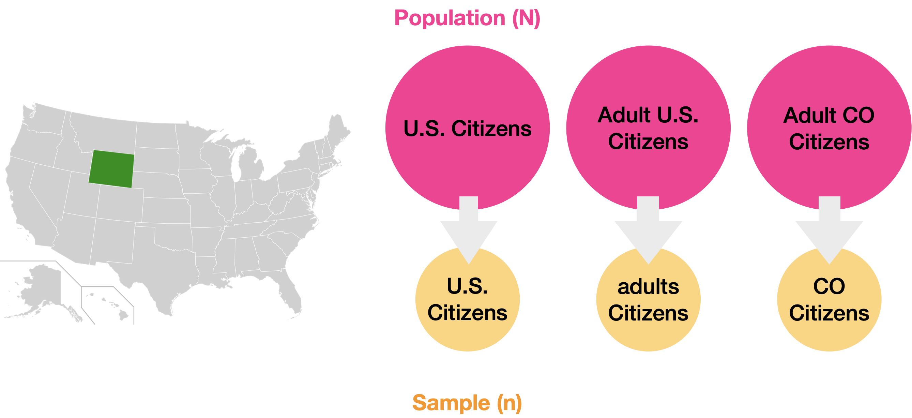
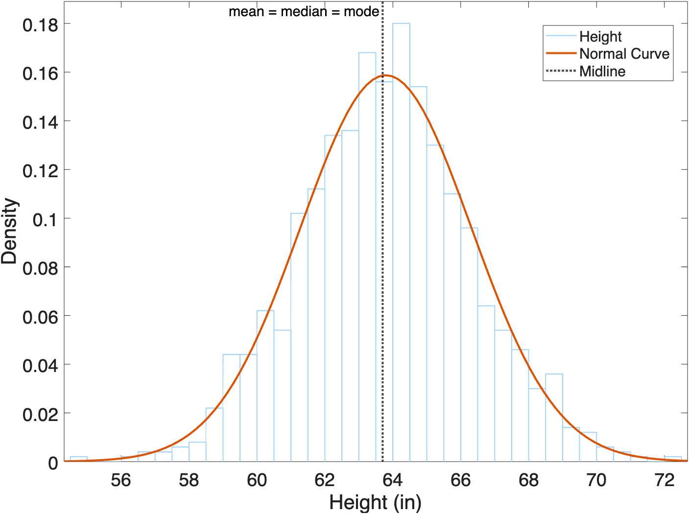

# Muddling through Hypothesis testing

!!! quote "On Statistics"

    "There are three kinds of Lies: Lies, Damned Lies, and Statistics." — Benjamin Disraeli (maybe).

As we muddle through data analysis, we will also be muddling through some basic concepts in statistics. Here we cover arcane topics such as:

- Population vs Sample
- Normal Curves
- Hypothesis Testing
  - Parametric vs Nonparametric Testing

## Useful Stats Resources

- :material-web: [Investopedia Analysis Tools](https://www.investopedia.com/tools-for-fundamental-analysis-4689755){target="_blank"}
- :material-web: [Psych Explained YouTube series](https://www.youtube.com/@PsychExplained){target="_blank"}

## Populations and Samples

When collecting data, it's good to know the data's provenance:

- Where did this data come from?
- How Representative is this Data?

:material-web: **Reference:** [Investopedia - Populations](https://www.investopedia.com/terms/p/population.asp){ target="_blank" }

### Important Terminology

- **Population (N)**: the complete set of items or events that share a common attribute, from which data can be gathered and analyzed. Whatever it is that you want to know about. Note the big "N" here. Measuring the entire population is usually not practical due to its size, cost, or logistical challenges.
- **Sample (n)**: a subset of the Population. Note the little "n" here. This is typically what you measure.
  - **Non-probability Sampling:** A sample from what's available, what was convenient to collect. Great for starter data, but may not be representative
  - **Random Sampling:** Samples selected using a randomized technique designed to increase the validity (or representativeness) of the sample

{ width="550"}

>**Examples of Populations vs samples.** Populations (in pink) can be All US Citizens, all Adult US citizens, or even just adult citizens in the state of Colorado. Samples (in yellow) would be subsets of whatever you define as your population.

:material-web: [Adapted from Psych Explained: Random Sampling](https://www.youtube.com/watch?v=r-rFO_2NsgI&list=PL_pCzdGjrXUXiNIaoUNjjxZ4sAu8ypV-y&index=6){target="_blank"}

#### Groups

Often we break our samples down into different categories, or groups. Very often, you will read about the Control Group or the Experimental Group. The Control group is typically the unmodified group, while the Experimental group has been treated in some fashion (sometimes called the Treatment Group).

So, for example, we could break our CO Citizens Samples down into two groups as follows:

- **Control Group**: those who have never tried marijuana before
- **Experimental group**: those who use marijuana daily

And then we measure something else, like response time, and use statistics to determine if there is a difference in response time between the groups.

### External Validity

*External what?*

External Validity is a just a fancy term for defining how representative your sample (n) is of the population (N).

The key to a good sample is that it is representative of the entire population. For example, if your population is 50% women, then your sample should be 50% women.

- **High external validity**: Your sample is representative
- **Low external validity**: not so much. Your sample may have some bias or is too small (and maybe has a large number of outliers)

{ width="350"}

>With a representative sample that has high external validity, you can make inferences (or predictions) about the population at large.

## The Bell Curve is Normal

{ width="250"}

When you measure things, like humans, you will find that their parts vary: height, weight, foot size, the spacing between the eyes (I'm looking at you, Anna Taylor Joy). But each of these measurements won't vary *too* greatly between humans—they tend to fall with a certain range. If you take a large enough sample and plot the measurements as a histogram, you should get a histogram that looks something like this:

{ width="450"}

>**Histogram of Female Heights**. This is a histogram of the heights from a bunch of women (n=1000). In this sample, the average height was 63.2 and the standard deviation was 0.25. Notice how the most frequent heights are clustered around the mean in the center of the histogram. Also notice we don't have any 50" or 80" women (4'2" or 6'7") in our sample.

??? example "Generating Normal Data for the above Histogram"

    Note, no women were actually measured in the creation of the above histogram. Instead, we used the random number generator **`randn`** in the following code.

    ```matlab
    mu = 63.7; % mean height of women as reported on google
    sigma = 2.5; % standard deviation
    heights = sigma.*randn(1000,1)+mu; % generate random numbers with mean mu and std sigma
    histogram(heights) % plot histogram
    xline(mu,'--r','mean')
    title(sprintf("Average Female Height = %1.2f±%1.2f",mu,sigma))
    xlabel("Height (in)")
    ```

If you fit a curve to this histogram, you get a bell-shaped curve.

{ width="450"}

In fact, this bell-shaped curve  was so common, they called it a "Normal" curve (1).
{ .annotate }

1. Or, if you're boring, a "Gaussian" curve, after the [wrong mathematician](https://en.wikipedia.org/wiki/Abraham_de_Moivre){target="_blank"} Johann Gauss.

!!! abstract "Anatomy of a Normal Curve"
    A normal curve is determined by two components:

    1. **The Mean**: which determines the center of the curve.
    2. **The Standard Deviation (SD)**: which determines the width of the curve

    In a Normal Curve, the Mean, Median, and Mode are all equal.

    :material-web: [Investopedia: Normal Distribution](https://www.investopedia.com/terms/n/normaldistribution.asp){target="_blank"}

### The Empirical Power of the Bell Curve

*I guess that's interesting, but how does that help me in the real world?*

The bell curve is so powerful because it allows us to calculate the probability of any value in reference to the mean and standard deviation. This something is called a **Normal Probability Density function (PDF)**—a fancy term for the math function that creates the normal curve.

!!! note "Key points about the PDF"
      - It is a mathematical function that generates the normal curve.
      - It describes the likelihood of a value occurring within a specific range.
      - The area under the curve represents the total probability, which equals 1.

{ width="550"}

>**The Normal Probability Distribution Function can predict frequency**. **µ**: the mean, **𝜎**: the standard deviation. Adding up the area under the curve gives you the percentage of measurements that fall in that range. For all normal distributions, 68.3% of the observations will appear within plus or minus one standard deviation of the mean; 95.4% will fall within +/- two standard deviations; and 99.7% within +/- three standard deviations. This fact is sometimes called the **"empirical rule"**, because people (math nerds) saw this phenomenon happen over and over. Read more about [PDFs here](https://en.wikipedia.org/wiki/Probability_density_function){target="_blank"} if you are looking for a good soporific.

So, for the heights of females, 68% of all heights would fall between -1SD and +1SD, and 95% of heights fall between -2SD and +2SD. We can use these facts to predict the likelihood of any height. For example, a height of 64" would be pretty likely as most female heights fall in that range. And a female height that falls outside three SD from the mean, such as 71.2", would be fairly unlikely. In the population of women, there are relatively few women with a height of 5'11" or greater—a condition vernacularly known as being "really tall".

{ width="400"}

*Not sure this helps me in the real world, but ok.*

## Hypothesis Testing

Statistics do not tell us whether we are right. It tells us the chances of being wrong. When we repeat an experiment, we almost never get exactly the same results. Instead, repeated measurements span a range of values due to biological variability and the precision limits of measuring equipment. But if our measurements are going to be different each time, how do we determine whether a measurement in a given sample is truly different or just randomly different?

Answer: we use statistics. Specifically, we use **hypothesis testing** to determine *how likely* two samples are different: it's a probabilities outcome, not a definite YES/NO result.

Hypothesis testing involves making assumptions: either there IS or there IS NOT a statistical difference between the samples. The default assumption assumes no difference—this is the Null Hypothesis. The alternative is the opposite and is called the Alternative Hypothesis. This is usually what you are testing for.

!!! note "Null vs Alternative Hypothesis"

    - **Null Hypothesis ($H_o$)**: No difference between the two samples being compared
    - **Alternative Hypothesis ($H_1$)**: There is a difference between the samples

### Control vs Experimental Groups

One of the most fundamental experimental designs used when Hypothesis Testing is to compare a control group with an independent group that has been subjected to some intervention. This design is called two-independent group.

For these types of experiments, the Null hypothesis is "There is no difference between the control and experimental group" or "Your elixir didn't do anything — I'm still not the fairest of them all". The Alternative Hypothesis is that there is a difference between the groups.

### p-values

To decide whether to accept the Null or Aternative Hypothesis, you create a probability cut-off or **p-value**(1).
{ .annotate}

1. or "Alpha Level of Significance" if you're a stats book.

The most common p-value used is `0.05`, or `5%`. With a `0.05` p-value, we assume two samples are just random variations from the same population (Null Hypothesis), *unless* that variation would only happen in 5% of the cases or fewer. If the calculated p-value of the sample difference is smaller than `0.05`, then we reject the Null Hypothesis and accept the Alternative Hypothesis. If we accept the Alternative Hypothesis, we also accept the possibility that we may be wrong in 5% of the cases. That is, the probability that the samples are the same is roughly 5% (or lower), even though we rejected the Null Hypothesis.

{ width="450"}

!!! warning "Correcting p-values"
    If you are thinking that `5%` is actually not that unlikely, then you would be right. Five out of a hundred times is also one out of twenty times and that happens more often than you would think. If you are doing a lot of hypotheses testing, then you may need to adjust your p-value to take this into consideration. For example, if you are testing twenty different things using a `0.05` p-value, one of things you are testing may just randomly fall below the p-value criteria because thats how randomness works. There are many ways to adjust the p-value depending on the number of sample comparisons, including the [Bonferonni correction](https://en.wikipedia.org/wiki/Bonferroni_correction){target="_blank"} or the [False Discovery Rate](https://en.wikipedia.org/wiki/False_discovery_rate){target="_blank"}. Talk to a Doctor if you feel you need to correct your p-value.

### The dark side of the p-value

The danger with p-values is the temptation to use a seductively low p-value as definitive proof of the alternative hypothesis. The p-value doesn't actually do that.  Imagine that you have a coin that you suspect is weighted toward heads. Your null hypothesis is that the coin is fair. You flip it 100 times and get more heads than tails. The p-value won’t tell you whether the coin is fair, but it will tell you the probability that you’d get at least as many heads as you did if the coin was fair. That’s it — nothing more. Believing that a low p-value definitively tells you that the coin is unfair is known as the [prosecutor's fallacy](https://en.wikipedia.org/wiki/Base_rate_fallacy){target="_blank"}. (1)
{ .annotate}

1. Adapted from: [FiveThirtyEight - Not Even Scientists Can Easily Explain P-values](https://fivethirtyeight.com/features/not-even-scientists-can-easily-explain-p-values/){target="_blank"}

And remember, this whole process is based on making assumptions. If your hypothesis was pretty unlikely to start with, getting a p-value of 0.05 or even 0.01, doesn't necessarily prove the hypothesis (e.g. covid vaccination is ineffective), it simply reports the probabilities of getting the results that you got, and that perhaps your hypothesis deserves another look. (1)
{ .annotate}

1. Adapted from: [Nuzzo, R. Scientific method: Statistical errors. Nature 506, 150–152 (2014)](https://doi.org/10.1038/506150a){target="_blank"}

!!! note "The Prosecutor's Fallacy"

    The danger of hypothesis testing is sometimes you can get really low p-values, even when the real effect has a very low probability. Say you want to test the effectiveness of the COVID-19 vaccine. One way to test its effectiveness might be to simply compare the number of vaccinated and unvaccinated people who are hospitalized with COVID-19. Using hypothesis testing, you likely will find a significantly larger number of people who were vaccinated and hospitalized. Based on this result, and a low p-value, you may be tempted to conclude that the vaccine is ineffective and somehow makes you more susceptive to being hospitalized. However, as the diagram below illustrates, this fails to take into consideration the large difference in the total number of people who are vaccinated vs those who are unvaccinated. In this exaggerated example, we have far more vaccinated people (in pink) vs unvaccinated people (in green): 100 to 10. So, 10 times more people are vaccinated than unvaccinated. Since there are so few unvaccinated people, even if a high percentage of these people get sick, you still get a small number of people. In this example,  50% of the 10 unvaccinated people got hospitalized, so you get 5 people hospitalized. By comparison, since the number of vaccinated people is much higher, even a small percentage of this populate will result in a larger number. In this example, just 10% of the vaccinated people were hospitalized, which is 10 people — twice as many as the unvaccinated people who were hospitalized. So, even though its a much smaller percentage of the total population, you get twice as many vaccinated people than unvaccinated people hospitalized in this exaggerated example. The reality was more subtle than this, but still striking. We know the vaccine effectiveness range is roughly 90-95%, meaning if 100 unvaccinated people get hospitalized, 5 vaccinated people would be hospitalized. Considering the larger percentage of people who got vaccinated during the pandemic (in the 80% range), it was highly probable there would be more vaccinated than unvaccinated people that were hospitalized ([and this actually happened](https://web.archive.org/web/20230126022307/https://doh.wa.gov/sites/default/files/2022-02/421-010-CasesInNotFullyVaccinated.pdf){target="_blank"}). Again, it is simply a numbers game.
    
    { width="650"}

    Adapted from: [Base Rate Fallacy with Vaccines](https://commons.wikimedia.org/wiki/File:Base_rate_fallacy_with_vaccines.svg)
    
### Hypothesis Testing in MATLAB

Hypothesis testing isn't always just testing whether samples are different. You can also test if samples are normally distributed or if the samples have equal variance.  MATLAB has many different functions that perform different types of hypothesis testing, including:

1. [**`adtest`**](https://www.mathworks.com/help/stats/adtest.html) - Anderson Darling test for normality
2. **`vartest2`** - F-test for equal variance
3. [**`ttest2`**](https://www.mathworks.com/help/stats/ttest2.html) - Two Sample t-test

While the inputs vary, the outputs from all these functions (at least the first 2 outputs), take the following form:

- **h**: a boolean. If 1, then the test rejects then null hypothesis.
- **p**: The p-value. p-values range from 0 to 1.  Less than 0.05 is often considered significantly different.

You can find the Null Hypothesis in the MATLAB documentation, but sometimes its a little confusing.

### Testing Normal Data

!!! abstract "aka Parametric Testing"

A common hypothesis test for normally-distributed data is the [Student's t-test](https://en.wikipedia.org/wiki/Student%27s_t-test){target="_blank"}, a test originally devised to ensure [Guinness beer stayed delicious](https://www.physoc.org/magazine-articles/the-strange-origins-of-the-students-t-test/){target="_blank"}. Because t-tests rely on the data having a probability distribution that can be mathematically modeled, like a Normal Curve, this type of testing is also called a [Parametric Test](https://en.wikipedia.org/wiki/Parametric_statistics){target="_blank"}.

!!! note "Key Characteristics of a Parametric test"
    - They assume a normal distribution and equal variance for the data.
    - They are best used when the sample size is greater than 30
    - They are very powerful when used correctly

The **t-test** assumes that the data comes from a population having both a **Normal Distribution** and **Equal Variance** (same variance for both samples). So, before performing a t-test, you should test your samples for these properties.

For this example, we will use fake test scores that are included with MATLAB. Specifically from this dataset, we will test the following hypothesis for Exams 1 and  4:

- Null Hypothesis: the Exam Scores are the same
- Alternative Hypothesis: the Exam scores are different

```matlab linenums="1" title="Load example data and plot as histogram"
load examgrades.mat % load example dataset grades

x1 = grades(:,1); % extract exam 1 grades
x4 = grades(:,4); % extract exam 4 grades

figure(Visible="on");
histogram(x1) % exam 1 grades
hold on 
histogram(x4) % exam 4 grades
legend("Exam 1","Exam 4")
```

{ width="400"}
>Loading the `examgrades.mat` file returns a numeric 120X5 matrix as the variable `grades`. This matrix contains exam scores ranging from 0 to 100. The scores for a given exam are organized by column, so column 1 contains Exam 1 scores, column 2 contains Exam 2 scores, etc. There are 5 different exams (columns) and 120 students (rows). Plotted here is a histogram of the scores from Exam 1 (blue) and 4 (orange). The distribution of scores appears to be normal for both exams.

#### Testing for Normality

To test if your samples have a normal distribution, you can use the Anderson Darling test with the MATLAB function [**`adtest`**](https://www.mathworks.com/help/stats/adtest.html)(1).
{ .annotate}

1. There are other tests for normality. This is just one that comes with MATLAB.

As indicated in the documentation, **`adtest`** uses the following hypotheses:

1. **Null Hypothesis:** the data comes from a population with normal distribution
2. **Alternative Hypothesis:** the data does not come from a population with a normal distribution.

In the following example, we test the Exam 1 and Exam 4 scores for normality.

```matlab linenums="1" title="Testing for Normality using the Anderson Darling test"
[h1,p1] = adtest(x1) %  Anderson Darling test for Exam 1
[h4,p4] = adtest(x4) %  Anderson Darling test for Exam 4
```

```matlab
h1 =
  logical
    0
   
p1 = 
    0.18539

h4 =
  logical
    0

p4 = 
    0.15005
```

…Since `h1=0` and `p1 > 0.05`, you fail to reject the Null Hypothesis for *`x1`* (Exam 1), meaning you accept the alternative hypothesis that the Exam 1 grades have a normal distribution and you can use them in a t-test. We get the same result for *`x4`*, the Exam 4 grades. So, the samples are normal. On to the next step.

#### Testing for Equal Variance

In addition to having a normal distribution, your data should also have equal variance for t-tests. To test for equal variance, you can use [**vartest2**](https://www.mathworks.com/help/stats/vartest2.html){target="_blank"}. As in the **adtest**, the Null Hypothesis is that the samples have Equal Variance.

As you can see The syntax is  similar, except that you plug both *`x`* and *`y`* into the function call:

```matlab linenums="1" title="Testing for Equal Variance using an F-test"
[hv,pv] = vartest2(x,y)
```

```matlab
hv = 
    0

pv = 
    0.88118
```

…Again, since *`hv=0`* and *`pv > 0.05`*, we fail to reject the null hypothesis, meaning the Exam Scores have equal variance and can be used in a t-test.

#### t-testing

Finally, having confirmed Normality and Equal Variance, we are ready to perform our t-test. In this example, we have two samples, so we will use the two-sample t-test function [**`ttest2`**](https://www.mathworks.com/help/stats/ttest2.html).

Hypotheses for the two-sample t-test:

- **Null Hypothesis**: the two samples have the same mean
- **Alternative Hypothesis**: the two samples have significantly different means.

As you can see below, the syntax is very similar to the other tests, although here we add a couple of extra optional outputs:

```matlab linenums="1" title="Testing if samples are significant different using a t-test"
[h,p] = ttest2(x1,x4) % are Exam 1 and 4 statistically different?
```

```matlab
h = 
    0
p = 
      0.98218
ci = 2×1
      -2.2277
       2.1777
stats = struct with fields:
    tstat: -0.022359
       df: 238
       sd: 8.6609
```

…Here, *`h=0`* and *`p > 0.05`* means that x1 and x4 are likely samples with the same means, meaning that Exam 1 and Exam 4 are not significantly different. *`ci`* indicates the 95% confidence interval, while the *`stats`* structure includes details about the t-test for the stats nerds in the audience. You also use this information when you report the results (see below)

If we review the normal curves used for the t-tests, we can see they are virtually identical, which is why the t-test calculated such a high p-value and failed to reject the Null Hypothesis.

{ width="400"}
>**Normal curves fitted to the histograms of Exam scores are nearly identical**. Mean of Exam 1 = 75±8.7, Mean of Exam 4 = 75±8.6. , we in fact see that they are very similar.

??? example "Code to create Normal Curve Plots in the figure above"

    ```matlab linenums="1" title="Fit Data and Plot the PDF"
    pd1 = fitdist(x1,'Normal'); % fit a Normal curve to Exam 1 scores
    x = linspace(45,100); % create range of values that matches the range of scores
    y1 = pdf(pd1,x); % interpolate the probability of each score in x based on the normal curve for Exam 1

    pd2 = fitdist(x4, 'Normal'); % fit a Normal curve to Exam 1 scores
    y2 = pdf(pd2,x); % interpolate the probability of each score in x based on the normal curve for Exam 4

    figure(Visible="on"); % plot the results as line plots
    plot(x,y1,'-',LineWidth=2) 
    hold on
    plot(x,y2,'-', LineWidth=2)
    xlim([44 105])

    RGB = orderedcolors("gem"); % get figure colors

    xline(pd1.mu,'k:','mean 1','LabelHorizontalAlignment','left','LabelVerticalAlignment','bottom','DisplayName','mean 1','Color',RGB(1,:))
    xline(pd2.mu,'k:','mean 4','LabelHorizontalAlignment','right','LabelVerticalAlignment','bottom','DisplayName','mean 4','Color',RGB(2,:))
    lgd = legend("Exam 1","Exam 4")
    ```

If we curve Exam 4 by adding 5 points to all scores, we get a significantly different outcome with the t-test:

```matlab linenums="1" title="t-test of Exam 1 vs curved Exam 4"
modX4 = x4+5; % curve exam 4 grades by 5 points
[h,p] = ttest2(x1,modX4); % t-test
text(50,.04,sprintf('p=%1.1e',p)) % add p to axes
```

```matlab title="t-test results"
h = 
    1
p = 
    1.0908e-05
ci = 2×1
      -7.2277
      -2.8223
stats = struct with fields:
    tstat: -4.4941
       df: 238
       sd: 8.6609
```

{ width="450"}

>**Normal Curves of Exam 1 and modified Exam 4** Now the Exam Scores are significantly different with the mean of the modified Exam 4 equal to `80±8.6` and the p-value calculated by the t-test to be a really small `p=0.000011`.

??? example "Code to curve Exam 4 grades, refit data, and replot"

    ```matlab linenums="1" title="t-test Comparing Exam 1 to a curved Exam 4"
    pd3 = fitdist(x4+5,'Normal'); % Curve Exam 4 scores by 5 points and then fit normal curve
    y3 = pdf(pd3,x); % interpolate y values from Probability Density Function

    figure; % plot curves
    plot(x,y1,'-',LineWidth=2) 
    hold on
    plot(x,y3,'-', LineWidth=2)
    xline(pd1.mu,'k:','mean 1','LabelHorizontalAlignment','left','LabelVerticalAlignment','bottom','DisplayName','mean 1','Color',(H(1)))
    xline(pd3.mu,'k:','mean 4','LabelHorizontalAlignment','right','LabelVerticalAlignment','bottom','DisplayName','mean 4','Color',H(2))
    legend("Exam 1","Exam 4")
    xlim([44 105])
    text(50,.04,sprintf('p=%1.1e',p)) % add p to axes
    ```

When you report the results of a t-test, you typically report the mean, the standard deviation and the outcome of the test, as follows:

```matlab linenums="1" title="Formatting the report"
s = sprintf('Modified Exam 4 scores were significantly higher than Exam 1 scores, ');
s = sprintf('%s%1.2f ± %1.2f" vs %1.2f ± %1.2f" (M±SD), respectively,\n', s, mean(x1), std(x1),mean(x4+5), std(x4+5));
s = sprintf('%st(%d) = %1.2f, p < .0001.', s,stats.df, stats.tstat);
disp(s)
```

>Modified Exam 4 scores were significantly higher than Exam 1 scores, 75.01 ± 8.72" vs 80.03 ± 8.60" (M±SD), respectively, t(238) = -4.49, p < .0001.


…Notice that we include data from the `stats` variable as part of the reported t-test outcome.

[How to properly report a t-test in APA style.](https://www.socscistatistics.com/tutorials/ttest/default.aspx)

### Testing Non-normal data

!!! note "aka Nonparametric Testing"

Ok, so what if your data is not Normal? What if you have a small sample size with a bit of a skew. Nonparametric means that mathematically modeling is not used to generate the statistics.

Consider the following made up data:

```matlab linenums="1" title="Create Non-normal Data and plot"
ViralLoad = [3000 1100 800 540 670 1000 960 1200 4650 4200 5000 4200 1300 900 7400 4500 7500 3001 4999 6000]';
Treatment = categorical([repmat("Treated",10, 1); repmat("Untreated",10, 1)]);
T = table(ViralLoad,Treatment);
```

Here, we have a value called "Viral Load" and two categories: "Treated" and "Untreated". Importantly, there are only 10 data points per group (n=20). So, this is a rather underpowered study (sample size smaller than 30). Presumably a high viral load would be bad, but again, this is all made up. If we plot our data, we get distribution patterns as follows:

{ width="450"}

>**Distribution of Viral Load.** The histogram for both samples indicates a non-normal distribution of the data. In the box plots, the median value is not centered inside the interquartile range box—it's closer to 25th . This offset indicates that the data is skewed.

??? example "Code to generate above plots"

    ```matlab linenums="1" title="Plot histogram and boxplots"
    figure;
    tiledlayout("horizontal")
    x = T.ViralLoad(T.Treatment=="Treated");
    y = T.ViralLoad(T.Treatment=="Untreated");

    nexttile
    histogram(x,10,FaceAlpha=0.35)
    hold on
    histogram(y,30,FaceAlpha=0.25)
    legend("Treated","Untreated")
    xlabel("Viral Load")

    nexttile
    hold on

    swarmchart(T,"Treatment","ViralLoad","filled",MarkerFaceColor='k',MarkerFaceAlpha=0.75)

    colors = orderedcolors("gem"); % default color scheme
    colororder(gca,colors([1 1 2],:)); % match color order in histogram (swarmchart messes up order)
    boxchart(T.Treatment,T.ViralLoad,"GroupByColor",T.Treatment,"ColorGroupLayout","overlaid")

    sgtitle("Non-normal Distribution")
    ```

If we test if data is Normally distributed using the **`adtest`**:

```matlab linenums="1" title="Test data for Normalacy"
[h,p] = adtest(T.ViralLoad)
```

```matlab
h = logical
   1
p = 
     0.018987
```

…Since `p<.05`, the data is not normal and you should use a non-parametric test, like the Mann-Whitney U test…

#### Mann-Whitney U Test

!!! abstract "Equivalent to a t-test, but for non-normal data"

If your data is not normal, but you still want to know if your samples are statistically different, then you run a Mann-Whitney U Test (also known as a rank sum test). The Mann-Whitney test doesn't have all the bells and whistles of a t-test, but it can get the job done in a pinch.

!!! note "Key assumptions for a Mann-Whitney U Test"
    - This test is based on ranking observations, so the variable being compared between the two groups must be continuous (e.g., age, weight, height, heart rate).
    - The data are assumed to have a non-Normal or skewed distribution.
    - While normality is not assumed, the data in both groups should have a similar shape (distribution).
    - The data should come from two randomly selected independent samples (no relationship between groups). If samples are paired (e.g., repeated measures from the same participants), use a paired samples t-test.
    - Each group should have a sufficient sample size, typically more than 5 observations per group.

The function for a Mann Whitney is called **`ranksum`**. The syntax is as follows:

```matlab linenums="1" title="Mann Whitney U-test of Treated vs Untreated Viral Loads"
x = T.ViralLoad(T.Treatment=="Treated");
y = T.ViralLoad(T.Treatment=="Untreated"); 

[p,h, stats] = ranksum(x,y) % mann-whitney test
```

```matlab title="test results"
p = 
     0.028306
h = logical
   1
stats = struct with fields:
       zval: -2.193
    ranksum: 75.5
```

…Since `p<0.05`, then we reject the Null Hypothesis and accept the Alternative Hypothesis that groups are different.

When you report results using a Non-parametric test, you should report the median and interquartile range of values (instead of the mean and standard deviation). Something like the following:

```matlab
groupsummary(T,"Treatment",["median","range"]);

s = sprintf('The treated group had a significantly lower viral load than the untreated group,\n');
s = sprintf('%smedian=%1.2f vs %1.2f, respectively,',s,  median(x), median(y));
fprintf('%s as indicated by a Mann-Whitney U-test, U(Nleft=%d, Nright=%d)=%1.2f,z=%1.2f, p=%0.3f.',...
    s,...
    numel(x),...
    numel(y),...
    stats.ranksum,...
    stats.zval, ...
    p)
```

```matlab
The treated group had a significantly lower viral load than the untreated group,
median=1050.00 vs 3375.00, respectively, as indicated by a Mann-Whitney U-test, U(Nleft=10, Nright=10)=75.50,z=-2.19, p=0.028.
```


You can find an example on how to report the results from Mann-Whitney U tests [here](https://guides.library.lincoln.ac.uk/c.php?g=110730&p=4638042).


<!-- 
### Parametric Testing

So, how do you determine that one group is different from another? You use a statistical test. The most common test you probably have heard of is a **t-test**. A t-test is a way to compare the means between two groups. For example, say you have two groups of humans, male humans and female humans, and you want to tell if they're heights are different

Since heights are normally distributed, you don't even need all the measurements, you just need the mean and standard deviation, which we can google, since heights are a well documented metric

 If you plot the heights of these groups as Normal Curves, 

A parametric test assumes that the data comes from a population that can be adequately modeled by a probability distribution (like a Normal Curve).
Hypothesis Testing that use t-tests and normal curves are a type of Parametric Testing. This involves Most often this involves calculating a mean and a standard deviation and performing a t-test.

### T-tests and P-values

A  common form of hypothesis testing uses a **t-test**. T-tests rely on normal distributions. The output of a t-test is a p-value, which is a quantification of probability that your result is due to solely to chance. The lower the p-value, the more unlikely your result is due to chance (but there is still a chance!).

determining the likelihood of the Alternative Hypothesis, typically by setting up a probability cut-off, called a p-value. The most common p-value used is 0.05, or 5%. In stats-speak, this is  Essentially, what you are saying is the samples are *likely* not the same if the probability of them *actually* being the same would only happen 5 out of 100 times (1 out of 20). Remember, when you randomly sample a population, you will get random variations in your measurements.

If we set the significance to 0.05, this means that we reject the null hypothesis if the average female height falls below a region of the male height normal curve that is only 5% likely. This is known as a left-tailed test because we want to know if the mean for females is less than the mean for males.
-->