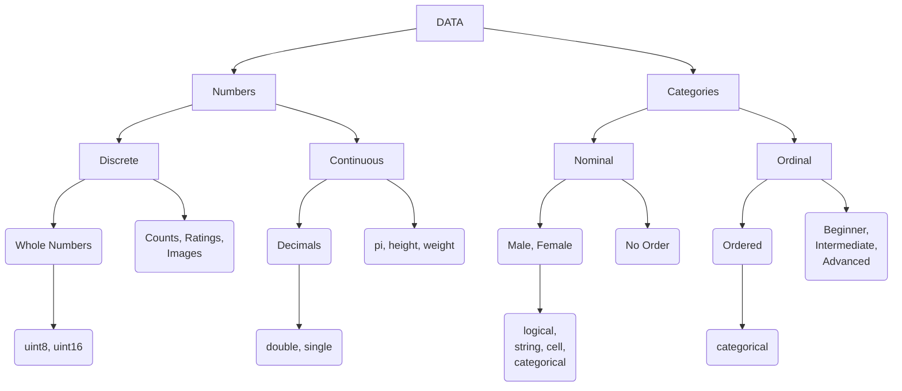

# Data Types for Stats (and MATLAB categorical arrays)

In the stats world, there are two types of data: Quantitative and Qualitative

1. **Quantitative**. Also known as Numeric or "Number", these data are used to count or measure something. Their values are stored in the numeric classes of MATLAB (double, uint8).
2.  **Qualitative**. Also known as Categorical or "Word", these data are used to describe something using a label like Male or Female, or Good or Bad. These data take the form of booleans (true or false) or character or word data and are stored in MATLAB classes like logical, string,  or [categorical arrays (see below)](#categorical-arrays).

Each category can be further broken down into sub-categories. Numeric categories can be **continuous** (like a measurement) or **discrete** (like a rating). Categorical categories can be **unordered** (like Sex) or **ordered** (like ranking: Beginner, Intermediate, or Advanced).

Different MATLAB variable classes are used to store these different types of data:



## Categorical Arrays

To handle Qualitative Data, MATLAB created the [`categorical`](https://www.mathworks.com/help/matlab/categorical-arrays.html) variable type. Categorical arrays operate similar to string arrays, but they have built-in functions for statistical uses.

Consider the following string array.

```matlab linenums="1" title="Create String array"
sex = ["Male" "Male" "Female" "Female" "Male" "Female"] % create string array
```

```matlab
sex = 

  1×6 string array

    "Male"    "Male"    "Female"    "Female"    "Male"    "Female"
```

We can easily convert this string array into a categorical array using the function **`categorical`**

```matlab
sex = categorical(sex) % typecast to categorical
```

…Here we just overwrite the string array with its categorical version

```matlab
sex = 

  1×6 categorical array

     Male      Male      Female      Female      Male      Female 
```

And that's it. *`sex`* is now a categorical array. You can do a lot of the same things with a categorical array that you can do with a string array

```matlab linenums="1" title="Create logical array from a categorical array"
la = sex == "Male" % logical array
```

```matlab
la =

  1×6 logical array

   1   1   0   0   1   0
```

…Here we create a logical array from the relation operation "sex is equal to Male"

Categorical also has a lot of built-in functions, designed to make data analysis easier. The function **`categories`** returns the categories (or group names) in a categorical array

```matlab linenums="1" title="Get Categories"
categories(sex) % return categories
```

```matlab
ans =

  2×1 cell array

    {'Female'}
    {'Male'  }
```

…There are two categories: Female and Male

And you can use the function **summary** to report the count of each category in the array

```matlab linenums="1" title="Summary"
summary(sex) % rturns category count
     Female      Male 
     3           3    
```

### Creating Ordinal Data

If you have ordinal data, you still use the  **`categorical`** function, but with a couple of additional inputs.

```matlab linenums="1" title="Create Ordinal Categorical Array"
level = ["Advanced" "Advanced" "Beginner" "Intermediate" "Advanced" "Beginner"] % create string
level = categorical(level,{'Beginner','Intermediate','Advanced'},Ordinal=true) % typecast to ordinal
```

…Here, the second input into **`categorical`** is the category names in the order that you want. The third input sets Ordinal to true.

And we get an ordinal categorical array that looks very similar to just a categorical array.

```matlab
level = 

  1×6 categorical array

     Advanced      Advanced      Beginner    Intermediate  Advanced      Beginner     
```

The main differences is that when you call a function like  **`summary`**…

```matlab
summary(level)
```

```matlab
     Beginner      Intermediate      Advanced 
     2             1                 3       
```

…the results are reported in the order of the ordinal categories (and not in alphabetical order)

### Transforming Numeric Data into Qualitative Data

Sometimes the raw data comes in as numeric, when what you actually want is categorical.

Consider the following numeric array

```matlab
ratings = [3 3 2 1 3 2 1 1 1 2]
```

These numbers actually represent three different categories

1. Terrible
2. Meh
3. Awesome

To replace the numbers with the category labels, you enter the following into **`categorical`**:

```matlab
ratings = categorical(ratings,[1 2 3],{'Terrible','Meh','Awesome'},Ordinal=true)
```

…notice here that the second input is the rating categories as numbers, while the third input is the ratings categories as labels. The fourth input turns Ordinal on.

And you get…

```matlab
ratings = 

  1×10 categorical array

  Columns 1 through 5

     Awesome      Awesome      Meh      Terrible      Awesome 

  Columns 6 through 10

     Meh      Terrible      Terrible      Terrible      Meh 
```

…a categorical array with all the correct categories included.

And these categories show up in the summary:

```matlab
summary(ratings)
     Terrible      Meh      Awesome 
     4             3        3   
```
