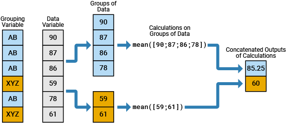
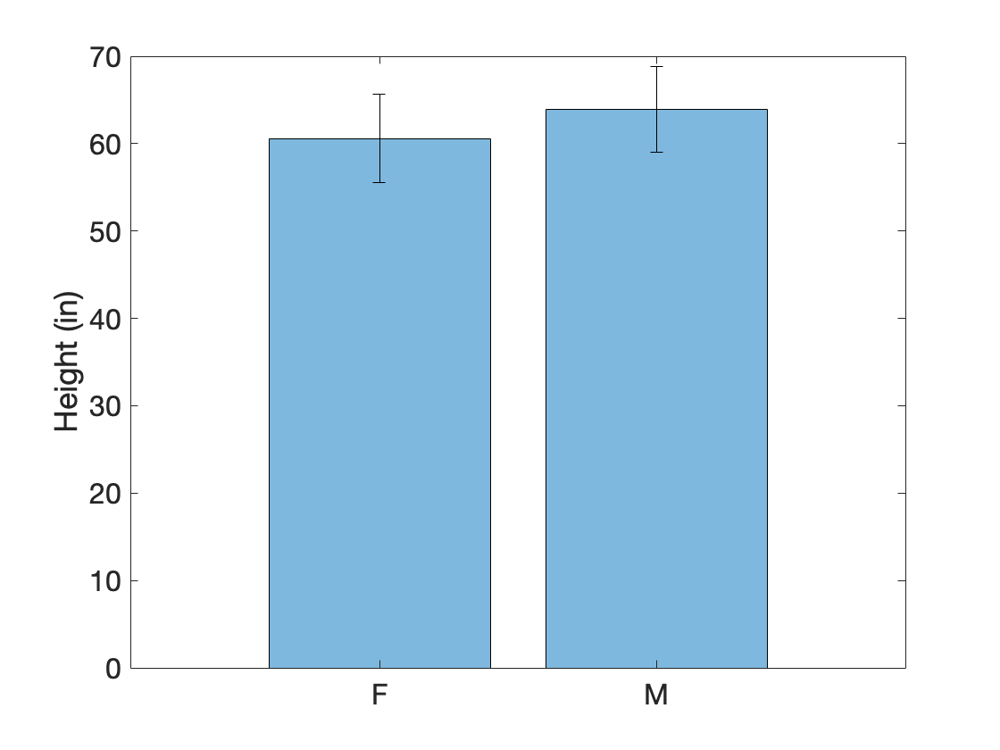
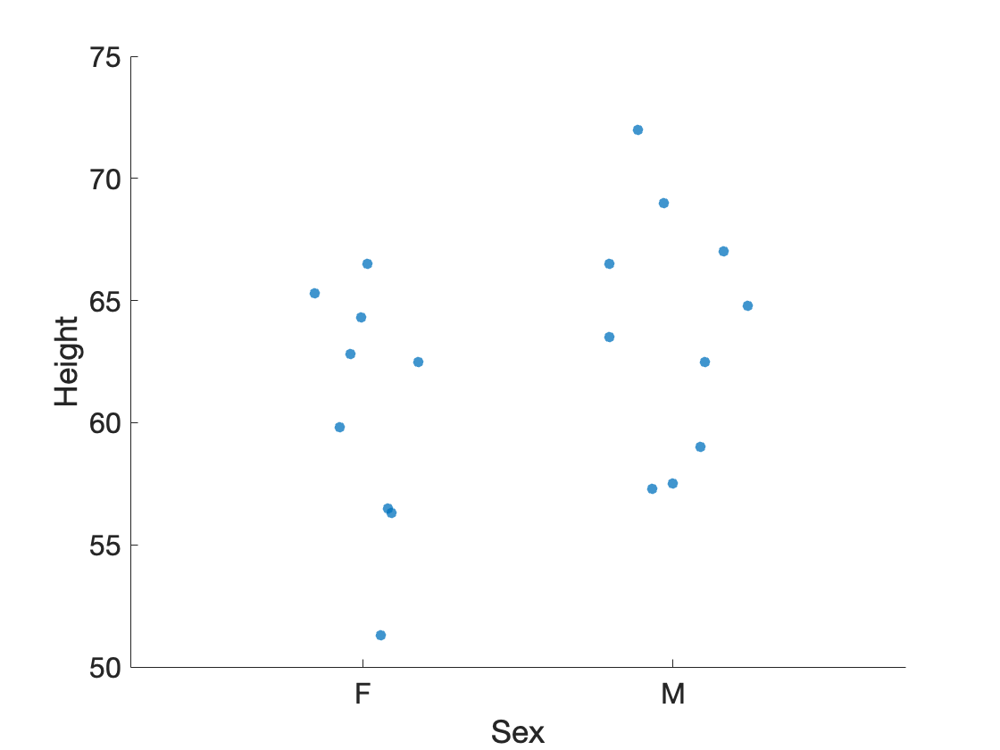
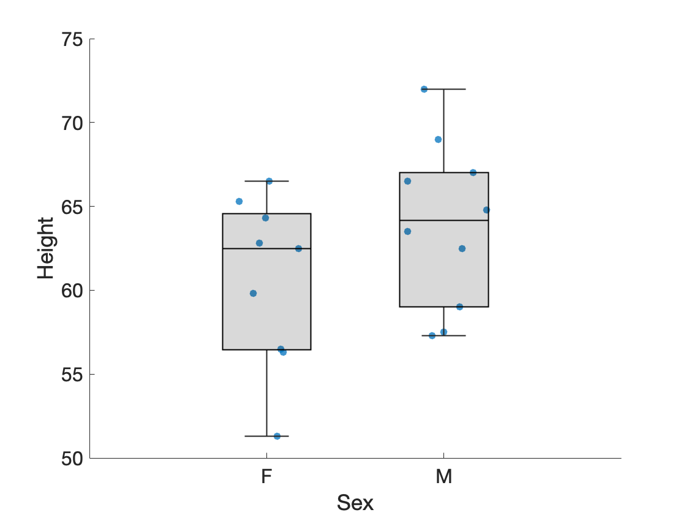
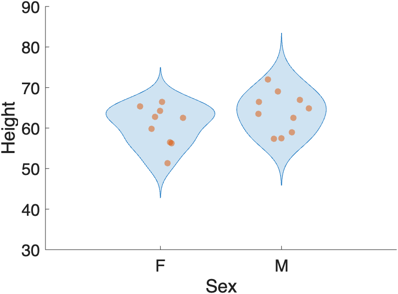
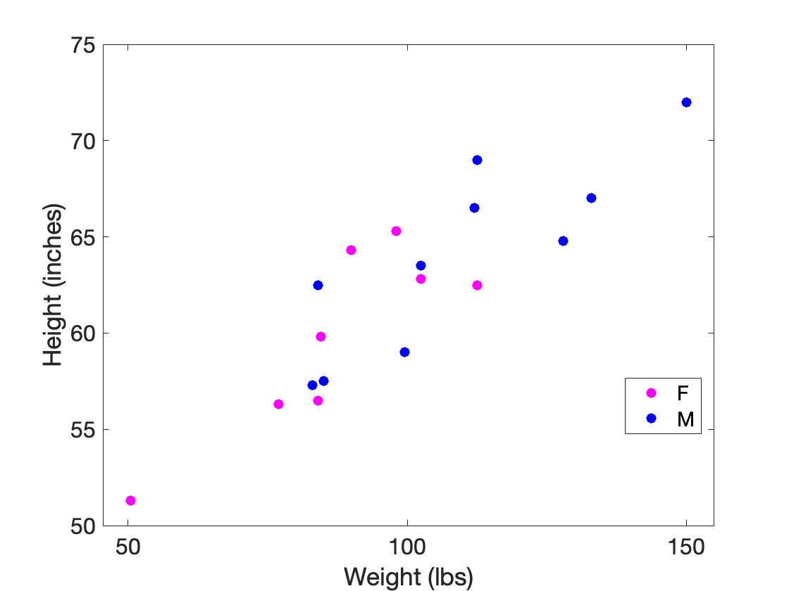
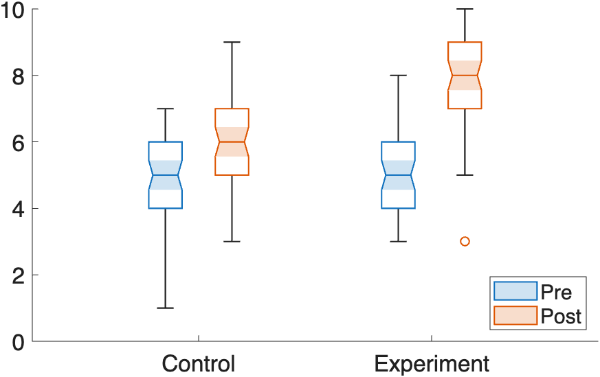
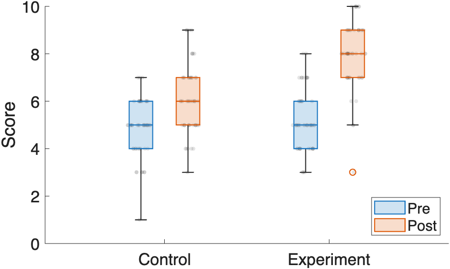

# Group Statistics

Group statistics are statistics performed on subsets, or groups, of a dataset. This allows us to compare results across the groups. For example, we may want to compare the means of the female observations to the male observations.

When performing group statistics in MATLAB, it is often much easier to organize the data into a [tidy spreadsheet](tidyData.md), where each column contains a different variable in the dataset (like sex, height or weight), and each row contains an observation (like the sex, height, and weight of a given individual).

For a refresher on the distinction between quantitative and qualitative data—and why it matters when choosing a grouping variable or a plot type—see [Data Types](dataTypes.md).

## Overview

The table below summarizes the plot types covered in this page — what each one shows, when to use it, and the primary MATLAB function.

| Plot Type | What It Shows | Best Used When | Function |
|-----------|---------------|----------------|----------|
| **Bar** | Group means with error bars | Comparing summary statistics across a small number of groups | `bar` + `errorbar` |
| **Swarm** | Every individual data point | You want to reveal the full distribution and sample size | `swarmchart` |
| **Box** | Median, quartiles, and outliers | Comparing spread and central tendency across groups | `boxchart` |
| **Violin** | Distribution shape (kernel density) + box plot | Groups have complex or multimodal distributions | `violinplot` |
| **Scatter** | Relationship between two quantitative variables, colored by group | Exploring correlations between variables across groups | `gscatter`* |

*`gscatter` requires the **Statistics and Machine Learning Toolbox**.

!!! tip "Combining Plot Types"
    Overlaying a swarm chart on a box or violin plot is a best-of-both-worlds approach: the box summarizes the distribution while the swarm shows every data point. Use `hold on` to layer them.

### Useful Functions

- [groupcounts](https://www.mathworks.com/help/matlab/ref/double.groupcounts.html){target="_blank"} - counts instances of a group

- [groupsummary](https://www.mathworks.com/help/matlab/ref/double.groupsummary.html){target="_blank"} - calculates group statistics

### Useful Resources

- [Perform Calculations by Group](https://www.mathworks.com/help/matlab/matlab_prog/perform-calculations-by-group-in-table.html){target="_blank"}

## Grouping Variables

A grouping variable is a variable that helps group the observations (e.g. the rows).



>In the above image, there are 2 groups, AB and XYZ. The data from the data variable column (in gray) is broken down into these two groups before processing.

### Load Example Data

I have saved a csv file of some tabular data in a secret online location. You can download this data using the following MATLAB code:

```matlab linenums="1" title="Load Data"
url = 'https://raw.githubusercontent.com/salcedoe/MtMdocs/refs/heads/main/docs/dataProcessing/class.csv';
T = readtable(url);
T.Name = string(T.Name); % typecast to string
T.Sex = categorical(T.Sex); % typecast to categorical
```

…after loading the data, we typecast the Name column to a **`string`** and the Sex column to a **`categorical`** array. Type casting to a categorical array will make calculating the statistics and visualizing the data easier

Our data table, `T`, contains metrics from a group of adolescents.

```matlab
T =

  19×5 table

      Name       Sex    Age    Height    Weight
    _________    ___    ___    ______    ______

    "Alfred"      M     14        69     112.5 
    "Alice"       F     13      56.5        84 
    "Barbara"     F     13      65.3        98 
    "Carol"       F     14      62.8     102.5 
    "Henry"       M     14      63.5     102.5 
    "James"       M     12      57.3        83 
    "Jane"        F     12      59.8      84.5 
    "Janet"       F     15      62.5     112.5 
    "Jeffrey"     M     13      62.5        84 
    "John"        M     12        59      99.5 
    "Joyce"       F     11      51.3      50.5 
    "Judy"        F     14      64.3        90 
    "Louise"      F     12      56.3        77 
    "Mary"        F     15      66.5       112 
    "Philip"      M     16        72       150 
    "Robert"      M     12      64.8       128 
    "Ronald"      M     15        67       133 
    "Thomas"      M     11      57.5        85 
    "William"     M     15      66.5       112 
```

…Remember, the columns contain the **variables**, so we have five variables: `Name`, `Sex`, `Age`, `Height`, and `Weight`. The rows contain the **observations**, so we have `19` observations. Row `1` contains all of the observed metrics from `Alfred`, whereas row `19` contains all the observed metrics from `William`.

This table has both Quantitative and Qualitative data. The Quantitative data columns are `Age`, `Height`, and `Weight`, whereas the Qualitative data columns are `Name` and `Sex`.

## Calculating Stats by Group

In our analysis, we want to calculate stats like mean and standard deviation of the Quantitative data (e.g. mean height), but we want to group those statistics using the Qualitative data (e.g. mean female weight). So, we need to use the `Sex` column as the grouping variable.

The function **`groupcounts`** returns the number of group elements in a categorical array:

```matlab linenums="1" title="groupcounts"
groupcounts(T,"Sex")
```

```matlab
ans =

  2×3 table

    Sex    GroupCount    Percent
    ___    __________    _______

     F          9        47.368 
     M         10        52.632 
```

…Our data has one more male than female.

The function **`groupsummary`** calculates group statistics in one fell swoop:

```matlab linenums="1" title="Group summary for Height"
s = groupsummary(T,"Sex",["mean" "std"],"Height")
```

The inputs into **`groupsummary`** are as follows:

1. Table Variable - `T`
2. Grouping Variable - "Sex" (notice we input just the name of the variable, not the whole column of data)
3. String array of the stats to be performed: "mean" and "standard deviation"
4. Variable to calculate stats on - "Height"

And we get our stats nicely packaged in a new table, *s*.

```matlab
s =

  2×4 table

    Sex    GroupCount    mean_Height    std_Height
    ___    __________    ___________    __________

     F          9          60.589         5.0183  
     M         10           63.91         4.9379  
```

…Each row in the table contains the stats from one of the groups in the grouping variable ("F" or "M"). Notice the table *s* includes the variables "mean_Height" and "std_Height". The applied stats function has been embedded into the name of the column.

We can run the statistics on multiple variables by inputting a string array of variable names in the last input. The following call to `groupsummary` calculates the mean and standard deviation for both the "Height" and "Weight" columns in `T`

```matlab linenums="1" title="Group summary for Height and Weight"
s = groupsummary(T,"Sex",["mean" "std"],["Height", "Weight"])
```

```matlab
s =

  2×6 table

    Sex    GroupCount    mean_Height    std_Height    mean_Weight    std_Weight
    ___    __________    ___________    __________    ___________    __________

     F          9          60.589         5.0183        90.111         19.384  
     M         10           63.91         4.9379        108.95         22.727 
```

…and now we have two additional variables in our stats table: mean_Weight and std_Weight.

### Using a Custom Function

**`groupsummary`** isn't limited to built-in stat names like `"mean"` or `"std"`. You can also pass a function handle to calculate a custom statistic. For example, to calculate the range (max − min) of Height for each Sex:

```matlab linenums="1" title="Group summary with a custom function"
groupsummary(T,"Sex",@range,"Height")
```

```matlab title="result"
ans =

  2×3 table

    Sex    GroupCount    fun1_Height
    ___    __________    ___________

     F          9           15.2    
     M         10           14.7    
```

…Since we didn't give **`groupsummary`** a name for our custom statistic, it names the resulting column generically: `fun1_Height`.

!!! tip "See Also"
    `groupsummary` isn't the only way to compute grouped statistics in MATLAB. The [Tables](../matlabBasics/Tables.md#applying-functions-to-variables) page covers **`varfun`** with `'GroupingVariables'`, an alternate approach worth knowing.

## Visualizing the Group Stats

### Bar Plots

Along with calculating the group statistics, we often want to visualize the results. A bar plot with error bars can be used to visualize mean and standard deviation.

Here, we plot the data from the table `s` that we generated using `groupsummary`:

```matlab
% set data
x = s.Sex; % grouping variable
y = s.mean_Height; % stat to plot
e = s.std_Height; % error 

% plot data
figure
bar(x,y,FaceAlpha=0.5);

hold on
errorbar(x,y,e,'k',LineStyle="none")
ylabel('Height (in)')
```

…Notice the **`errorbar`** is a separate function from **`bar`**. Thus, we need to call `hold on` to ensure that the error bar doesn't overwrite the bar. Also, **`errorbar`** requires at minimum three inputs: the grouping variable, the mean data (height of the bar), and the standard deviation (height of the error bar). **`bar`** only needs the grouping variable and the mean data.

{ width="450"}

### Swarm Chart

Also known as a beeswarm chart, these types of visualizations plot every single data point in a cluster, or swarm, of points. These are very useful types of plots to display the true distribution of the data. They are also useful in conjunction with box or violin plots (see below).

Many plotting functions accept grouping variables to sort plots by group.

```matlab linenums="1" title="Swarm chart of male and female heights"
figure(Visible="on")
hs = swarmchart(T,"Sex","Height","filled",MarkerFaceAlpha=0.75,XJitterWidth=0.5)
```

{ width="400"}

>Here we plot a swarm chart in which we separate the male and female heights. Each dot represents one observation. Male heights trend slightly higher than female heights.

### Box Plots

Similarly, we can create box plots organized by groups using the **`boxchart`** function. Here we overlay the box plots onto the swarm charts.

```matlab linenums="1" title="Box Plot with Swarm Chart overlay"
hold on % overlay plot
boxchart(T,"Sex","Height","BoxFaceColor",'k',"BoxFaceAlpha",0.15)
```

{ width="450"}

>Both **`boxchart`** and **`swarmchart`** accept the table *T* followed by string variable names to specify the grouping variable and the data variable to plot.

### Violin Plots

A violin plot combines the features of a box plot with a kernel density plot, showing the distribution of the data.

```matlab linenums="1" title="Violin plot with Swarm Chart overlay"
violinplot(T,"Sex", "Height")
hold on
swarmchart(T, "Sex", "Height","filled",MarkerFaceAlpha=0.5,XJitterWidth=0.5) % overlay swarm chart
```

{ width="450"}

…Notice the bulge in the violin plots indicates the highest concentration of data points.

### Scatter

The function **`gscatter`**, included with the Statistics and Machine Learning Toolbox, plots grouped data in different colors:

```matlab linenums="1"
figure
gscatter(T.Weight,T.Height,T.Sex,'mb',[],25)
ylabel('Height (inches)')
xlabel('Weight (lbs)')
```

…notice again that here we input the column data (Weight, Height, Sex) from *T* using dot notation. We also include a couple extra inputs: `'mb'` - indicates the two group colors to use, magenta and blue. `25` - indicates the size of the dot.

{ width="450"}

>This scatter plot indicates that Height and Weight are positively correlated for both males and females. Notice that the function **`gscatter`** automatically includes a legend in the plot.

## Multiple Grouping Variables

Data can have multiple groups. Consider the following data:

```matlab linenums="1" title="Load table"
url = 'https://raw.githubusercontent.com/salcedoe/MtMdocs/refs/heads/main/docs/dataProcessing/quiz-multi-groups.csv';
T = readtable(url);
T.Quiz = categorical(T.Quiz, {'Pre','Post'}); % typecast to categorical, Pre before Post
T.Treatment = categorical(T.Treatment, {'Control','Experiment'}); % typecast to categorical, Control before Experiment
```

```matlab
T =

  200×3 table

    Quiz    Treatment     Score
    ____    __________    _____

    Pre     Control         5  
    Pre     Control         3  

    :          :           :  

    Post    Experiment      7  
    Post    Experiment      7  
```

In this table of invented quiz scores, there are two grouping variables: "Quiz" and "Treatment".

The "Quiz" variable has two levels, `Pre` and `Post`, which indicate when the quiz was taken:

- `Pre`: taken before the experiment started (a baseline score)
- `Post`: taken after the experiment was completed (the treatment score)

The "Treatment" variable also has two levels, `Control` and `Experiment`, which indicate whether or not a student received an intervention (like a new educational module):

- `Control`: no intervention
- `Experiment`: intervention received

### Group Summary using Multiple Groups

We can use multiple groups in `groupsummary` by simply inputting the group names as a string array into the second input:

```matlab linenums="1" title="Group Summary with Multiple Groups"
stats = groupsummary(T, ["Quiz","Treatment"], ["mean" "std"], "Score")
```

```matlab
stats =

  4×5 table

    Quiz    Treatment     GroupCount    mean_Score    std_Score
    ____    __________    __________    __________    _________

    Pre     Control           50           4.86        1.2124  
    Pre     Experiment        50           5.22        1.2664  
    Post    Control           50            6.1        1.4604  
    Post    Experiment        50           8.02        1.4356  
```

>The output, `stats`, now has a row for each combination of the grouping variables, e.g. "Pre-Control", "Pre-Experiment", etc.

### Visualizing Multiple Groups

We can visualize multiple grouping variables using `boxchart` through a combination of sorting along the x-axis and color, as follows:

```matlab linenums="1" title="Box Chart with multiple groupings"
figure;
boxchart(T.Treatment,... % First Grouping (along x-axis)
         T.Score, ... 
         GroupByColor = T.Quiz, ... % Second grouping by color
         Notch="on"); % turn notch on
ylim([0 10])
legend(categories(T.Quiz),Location="southeast")
```

{ width="450"}

>In this box chart, we group the data first by Treatment — visible along the x-axis, where `Control` is plotted first, followed by `Experiment`. We then group by Quiz type using the `GroupByColor` input: Pre-quiz scores appear in blue, Post-quiz scores in orange.

!!! info "Box Plot Notches"
    Setting `Notch="on"` in `boxchart` adds a notch (indentation) on each side of a box plot around the median. Notches represent a 95% confidence interval around the median. If the notches of two boxes **do not overlap**, the medians are approximately significantly different at the 0.05 level.

    Based on the notches, the Pre-quiz scores (blue) do not differ significantly between groups, but the Post-quiz scores (orange) do — and within each group, Pre- and Post-quiz scores are also significantly different from each other.

### Overlay swarm charts

The `swarmchart` function does not support the `GroupByColor` option, so we can't simply call `swarmchart(T.Treatment, T.Score, GroupByColor=T.Quiz)` the way we did with `boxchart`. Instead, we need to manually plot each group as a separate `swarmchart` call.

The challenge is that `boxchart` with `GroupByColor` doesn't plot each group at the exact x-axis tick positions — it offsets them slightly to either side. If we plotted the swarm charts at the raw `Control`/`Experiment` positions, they would land in the wrong place. To get the correct x-positions, we capture the `boxchart` output as a handle (`hbc`). This handle stores an array of objects — one per color group — each containing the x- and y-data already sorted and positioned. We extract those coordinates and use them directly in `swarmchart`, adding a small additional offset so the swarm dots sit on top of their corresponding box.

```matlab linenums="1" title="Overlay swarmchart on box plots"
figure;

% create boxplot
hbc = boxchart(T.Treatment, T.Score,GroupByColor = T.Quiz,Notch="off");
ylim([0 10])
ylabel('Score')

% plot data points
hold on
offset = 0.15; % offsets x-position of data points
sz = 15; % marker size
xjw = 0.15; % jitter width
mfa = 0.1; % marker face alpha

% plot pre-quiz data as a swarm chart
x = single(hbc(1).XData)-offset; % get x data from hbc(1) and subtract offset
y = hbc(1).YData; % get y-data from hbc(1)
swarmchart(x,y,sz,'filled', ...
    XJitter='density',...
    XJitterWidth=xjw, ...
    MarkerFaceColor='k',...
    MarkerFaceAlpha=mfa)

% plot post-quiz data as a swarm chart
x = single(hbc(2).XData)+offset; % get x data from hbc(2) and add offset
y = hbc(2).YData; % get y-data from hbc(2)
swarmchart(x,y,sz,'filled', ...
    XJitterWidth=xjw, ...
    MarkerFaceColor='k',...
    MarkerFaceAlpha=mfa)

% move scatter plots to the back layer (under box plots)
ax = gca;
chH = ax.Children; 
ax.Children = flipud(chH);

% add legend
legend(hbc, categories(T.Quiz),Location="southeast") % input boxchart handle to only add a legend for those plots
```

{ width="450"}

>Notice that the box plots are not plotted along the x-axis right at `Control` and `Experiment`, but are offset to either side of those tick marks. By adding an offset to the swarm plot position along the x-axis, we can properly overlay the swarm plots on their corresponding box plots.

## Challenge

??? question "Group Statistics and Visualization"

    === "Question"

        Using the table *`T`* from the "Load Example Data" section above:

        1. Use **`groupsummary`** to calculate the mean and standard deviation of `Weight`, grouped by `Sex`.
        2. Create a box chart of `Weight` grouped by `Sex`.

    === "Answer"

        ```matlab linenums="1"
        groupsummary(T,"Sex",["mean" "std"],"Weight")
        ```

        ```matlab title="result"
        ans =

          2×4 table

            Sex    GroupCount    mean_Weight    std_Weight
            ___    __________    ___________    __________

             F          9          90.111         19.384  
             M         10          108.95         22.727  
        ```

        ```matlab linenums="1"
        figure
        boxchart(T,"Sex","Weight")
        ylabel('Weight (lbs)')
        ```

        On average, males weigh about 19 lbs more than females in this dataset, and also show slightly more variability (higher standard deviation).
