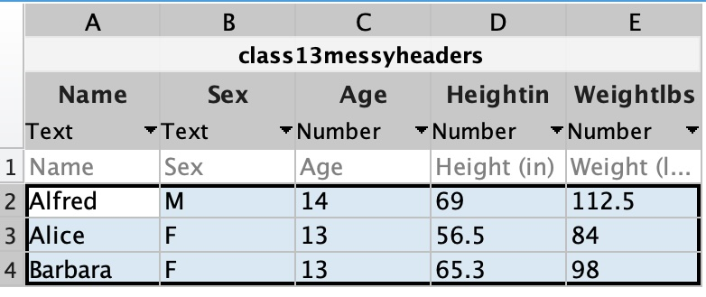
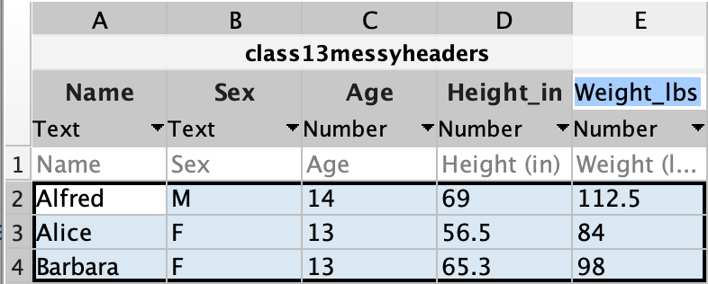

# Data Wrangling

{width=600px}

Data comes in many forms and often these forms are messy. Part of data wrangling involves organizing and cleaning up this data in a fashion that makes it easier to analyze. Usually, the first step in data analysis is to organize the data in a *tidy* fashion—a concept popularized for the R programming language but applicable to all data analysis.

:material-web: Read more about [tidy data](https://vita.had.co.nz/papers/tidy-data.pdf){target="_blank"} in the linked PDF.

## What is Tidy Data?

Tidy data is data organized in a table as follows:

1. Each row corresponds to a single observation
2. Each variable is a column
3. Each element in a table contains a single value

{ width="550"}

Consider the following messy data:

<div class="grid cards" markdown>

| Subject 1 |        |
| --------- | ------ |
| Name      | Alfred |
| Sex       | M      |
| Age       | 14     |
| Height    | 69     |
| Weight    | 112.5  |

|Subject 2 | |
| --- | --- |
|Name | Alice|
|Sex | F|
|Age | 13 |
|Height| 56.5|
|Weight |84|

|Subject 3 | |
| --- | --- |
|Name | Barbara|
|Sex | F|
|Age | 13 |
|Height| 65.3|
|Weight |98|

</div>

While this organization is relatively easy to read and understand (for a human), it is not considered tidy data because the variables are not organized in columns and the values are spread across three tables. This messy data organization makes it difficult to analyze the data.

The tidy way to organize this data would be as  follows:

{{ read_csv('class1-3.csv') }}

Notice there are five variables (5 columns: Name, Sex, Age, Height, Weight) and three observations (three rows).

## MATLAB Table

Here is that same data imported into a MATLAB table variable:

```matlab
T =

  3×5 table

      Name       Sex    Age    Height    Weight
    _________    ___    ___    ______    ______

    "Alfred"     "M"    14        69     112.5 
    "Alice"      "F"    13      56.5        84 
    "Barbara"    "F"    13      65.3        98 
```

Notice how this mirrors the tidy data rules: each variable (Name, Sex, Age, Height, Weight) becomes its own column, and each subject becomes its own row.

??? example "Code to build this tidy table"

    You can build this tidy table yourself directly in MATLAB, by collecting each variable across all three subjects into its own vector and then combining them with the **`table`** function:

    ```matlab linenums="1" title="Build a Tidy Table from the Messy Subject Data"
    Name = ["Alfred"; "Alice"; "Barbara"];
    Sex = ["M"; "F"; "F"];
    Age = [14; 13; 13];
    Height = [69; 56.5; 65.3];
    Weight = [112.5; 84; 98];
    T = table(Name,Sex,Age,Height,Weight)
    ```

    …this produces the exact same tidy table shown above.

We can inspect the properties of a MATLAB table using the properties field:

```matlab linenums="1" title="Get Table Properties"
T.Properties
```

```matlab
ans = 

  TableProperties with properties:

             Description: ''
                UserData: []
          DimensionNames: {'Row'  'Variables'}
           VariableNames: {1×5 cell}
           VariableTypes: [1×5 string]
    VariableDescriptions: {}
           VariableUnits: {}
      VariableContinuity: []
                RowNames: {}
        CustomProperties: No custom properties are set.
      Use addprop and rmprop to modify CustomProperties.
```

>Notice that the column names in a MATLAB table are called variable names.

Since the data is now tidy, we can easily calculate average height by simply indexing out the Height variable, as follows:

```matlab linenums="1" title="Calculate Mean Height"
mean(T.Height)
```

```matlab title="result"
ans =

         63.6
```

Or, we can get summary data for all of the Variables (columns) using the **`summary`** function:

```matlab
summary(T)
```

```matlab title="Output from Summary"
T: 3×5 table

Variables:

    Name: string
    Sex: string
    Age: double
    Height: double
    Weight: double

Statistics for applicable variables:

              NumMissing      Min        Median        Max          Mean           Std    

    Name          0                                                                       
    Sex           0                                                                       
    Age           0             13          13           14        13.333        0.57735  
    Height        0           56.5        65.3           69          63.6         6.4211  
    Weight        0             84          98        112.5        98.167         14.251  
```

!!! tip "See Also"
    This page just scratches the surface of MATLAB tables. For a deeper look at creating, indexing, and manipulating tables, see the [Tables](../matlabBasics/Tables.md) page.

## Reshaping Wide Data into Tidy Data

Not all untidy data looks like the "three separate subject tables" example above. A very common form of untidiness is *wide* data, where column headers are actually values of a variable, rather than variable names themselves.

Consider the following table, which records two test scores for three students:

```matlab linenums="1" title="Wide (Untidy) Data"
Name = ["Alfred"; "Alice"; "Barbara"];
Test1 = [85; 78; 92];
Test2 = [90; 88; 95];
Wide = table(Name,Test1,Test2)
```

```matlab title="result"
Wide =

  3×3 table

      Name       Test1    Test2
    _________    _____    _____

    "Alfred"      85       90  
    "Alice"       78       88  
    "Barbara"     92       95  
```

This isn't tidy: "Test1" and "Test2" aren't really two different *variables*—they're two values of a single variable, "Test". The tidy version of this table should have one column for the test name and one column for the score.

The function **`stack`** reshapes wide data like this into tidy, "long" format:

```matlab linenums="1" title="Reshape with stack"
Tidy = stack(Wide,{'Test1','Test2'},'NewDataVariableName','Score','IndexVariableName','Test')
```

```matlab title="result"
Tidy =

  6×3 table

      Name       Test     Score
    _________    _____    _____

    "Alfred"     Test1     85  
    "Alfred"     Test2     90  
    "Alice"      Test1     78  
    "Alice"      Test2     88  
    "Barbara"    Test1     92  
    "Barbara"    Test2     95  
```

…Notice that *`Tidy`* now has 6 rows instead of 3—one row per Name/Test combination—and every variable is properly its own column. This is the tidy version of the original wide table.

If you ever need to go the other direction (say, to prepare data for a specific plot or report), the function **`unstack`** reverses this process:

```matlab linenums="1" title="Reshape back with unstack"
unstack(Tidy,'Score','Test')
```

```matlab title="result"
ans =

  3×3 table

      Name       Test1    Test2
    _________    _____    _____

    "Alfred"      85       90  
    "Alice"       78       88  
    "Barbara"     92       95  
```

## Data Clean-up

When importing data, it is important to have standardized column headers with names that can be used as MATLAB variables. So, your column headers should avoid special characters like spaces, parentheses, or asterisks.

For example, the following headers would not work as tidy headers.

``` title="Messy Column Headers"
Name	Sex	Age	Height (in)	Weight (lbs)
```

> These column headers are messy because two of the columns contain parentheses and spaces.

The [MATLAB data import tool](https://www.mathworks.com/help/matlab/ref/importtool.html) automatically handles these messy header names. The following is the window brought up after clicking on the data import button (Home tab, in the Variable section) and selecting a csv file with the above messy headers.

{ width="350"}

>Notice that the parentheses and spaces have been dropped from the Height and Weight column names. This, however, makes the column headers harder to read.

You can edit the column names directly by double-clicking on the column name. An easier way to read the columns with the units intact would be to include underscores, as follows:

{ width="350"}

After import, the table would look like the following:

```matlab
T =

  3×5 table

      Name       Sex    Age    Height_in    Weight_lbs
    _________    ___    ___    _________    __________

    "Alfred"     "M"    14         69         112.5   
    "Alice"      "F"    13       56.5            84   
    "Barbara"    "F"    13       65.3            98   
```

If you'd rather handle this programmatically instead of through the Import Tool, the function **`readtable`** does the exact same header clean-up automatically by default. You can control this behavior with the `'VariableNamingRule'` option:

```matlab linenums="1" title="Programmatic Header Clean-up"
T = readtable('mydata.csv','VariableNamingRule','modify') % default: clean up messy headers
T = readtable('mydata.csv','VariableNamingRule','preserve') % keep original headers exactly
```

…`'modify'` is the default and behaves just like the Import Tool, while `'preserve'` keeps your original headers exactly as-is, even if they contain spaces or other characters that aren't valid MATLAB variable names.

## Challenge

??? question "Reshape and Tidy a Wide Table"

    === "Question"

        Consider the following wide-format table of test scores:

        ```matlab
        Name = ["Bob"; "Carl"; "Diana"];
        Test1_Score = [72; 95; 88];
        Test2_Score = [80; 91; 85];
        Wide = table(Name,Test1_Score,Test2_Score)
        ```

        1. Is this table tidy? Why or why not?
        2. Use the **`stack`** function to reshape *`Wide`* into a tidy table with three columns: Name, Test, and Score.

    === "Answer"

        1. No—"Test1_Score" and "Test2_Score" aren't really two separate variables. They're two values of a single variable ("Test"), so the column headers themselves are values, not variable names.

        2. 
        ```matlab linenums="1"
        Tidy = stack(Wide,{'Test1_Score','Test2_Score'},'NewDataVariableName','Score','IndexVariableName','Test')
        ```

        ```matlab title="result"
        Tidy =

          6×3 table

             Name         Test        Score
            _______    ___________    _____

            "Bob"      Test1_Score     72  
            "Bob"      Test2_Score     80  
            "Carl"     Test1_Score     95  
            "Carl"     Test2_Score     91  
            "Diana"    Test1_Score     88  
            "Diana"    Test2_Score     85  
        ```
