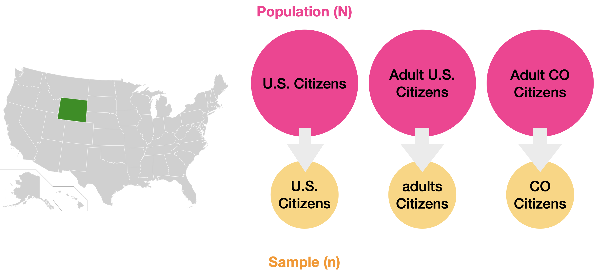

# Populations, Samples, and Distributions

As we muddle through MATLAB and data analysis, we will also be muddling through some basic concepts in statistics. Here are some concepts and terminology you should know.

## Populations and Samples

- **Population (N)**: the complete set of items or events that share a common attribute, from which data can be gathered and analyzed. Whatever it is that you want to know about.
- **Sample (n)**: a subset of the Population
  - **Non-probablity Sampling:** A sample from what's available, what was convenient to collect
  - **Random Sampling:** Samples selected based on randomized technique designed on increase the validity (or representativeness) of the sample

{ width="550"}

>**Examples of Populations vs samples.** Populations (in pink) can be All US Citizens, all Adult US citizens, or even just adult citizens in the state of Colorado. Samples (in yellow) would be subsets of whatever you define as your population.

## External Validity

The key to a good sample is that it is representative of the entire population. For example, if your population is 50% women, than your sample should be 50% women.

External Validity is a just a fancy term for defining how representation your sample is of the population.

- **High external validity**: Your sample is representative
- **Low external validity:** not so much. Your sample may have some bias or is too small (and maybe has a large number of outliers)

{ width="350"}

>With a representative sample that has high external validity, you can make inferences (or predictions) about the population at large.

## Distributions

A Normal distribution, also known as the Gaussian distribution, is a probability distribution that appears as a "bell curve" when graphed. The normal distribution describes a symmetrical plot of data around its mean value, where the width of the curve is defined by the standard deviation.

### Empirical Data

For all normal distributions, 68.2% of the observations will appear within plus or minus one standard deviation of the mean; 95.4% will fall within +/- two standard deviations; and 99.7% within +/- three standard deviations.

This fact is sometimes called the "empirical rule," a heuristic that describes where most of the data in a normal distribution will appear. Data falling outside three standard deviations ("3-sigma") would signify rare occurrences.

{ width="650"}

## Hypothesis Testing

Statistics does not tell us whether we are right. It tells us the chances of being wrong.

When we repeat an experiment  we almost never get exactly the same results. Instead, repeated measurements span a range of values due to biological variability and precision limits of measuring equipment. But if results are different each time, how do we determine whether a measurement is truly different or just randomly different?

Hypothesis testing is used to determine the probability of whether a group of measurements is truly different different or not. When performing hypothesis testing, you first set up a null hypothesis, which means there is no difference between samples. The alternative hypothesis is that there is a difference.

## Parametric Testing

A parametric test assumes that the data comes from a population that can be adequately modeled by a probability distribution (like a Normal Curve).
Hypothesis Testing that use t-tests and normal curves are a type of Parametric Testing. This involves Most often this involves calculating a mean and a standard deviation and performing a t-test.

!!! note Key Characteristics of a Parametric test
    - They assume a normal distribution for the data.
    - They are best used when the sample size is greater than 30
    - They are very powerful when used correctly

### T-tests and P-values

A  common form of hypothesis testing uses a **t-test**. T-tests rely on normal distributions. The output of a t-test is a p-value, which is a quantification of probability that your result is due to solely to chance. The lower the p-value, the more unlikely your result is due to chance (but there is still a chance!).

```matlab linenums="1" title="A two-sample t-test in MATLAB"
[h,p] = ttest2(x,y)
```

- **h**: either 0 or 1. If 1, then the t-test rejects then null hypothesis that the two samples come from the same distribution (that is, the samples are consider significantly different).
- **p**: The p-value. p-values range from 0 to 1.  Less than 0.05 is commonly considered significant

[How to properly report a t-test in APA style.](https://www.socscistatistics.com/tutorials/ttest/default.aspx)

### Control vs Experimental groups

One of the most fundamental experimental designs is to compare a control group with an independent group that has been subjected to some intervention. This design is called two-independent group.

## Useful Resources

- [Investopedia Analysis Tools](https://www.investopedia.com/tools-for-fundamental-analysis-4689755)
  - [Populations](https://www.investopedia.com/terms/p/population.asp)
  - [Normal Distribution](https://www.investopedia.com/terms/n/normaldistribution.asp#:~:text=The%20Bottom%20Line-,Normal%20distribution%2C%20also%20known%20as%20the%20Gaussian%20distribution%2C%20is%20a,defined%20by%20the%20standard%20deviation.)
- [Psych Explained YouTube series](https://www.youtube.com/@PsychExplained)
  - [Random Sampling](https://www.youtube.com/watch?v=r-rFO_2NsgI&list=PL_pCzdGjrXUXiNIaoUNjjxZ4sAu8ypV-y&index=6)
  