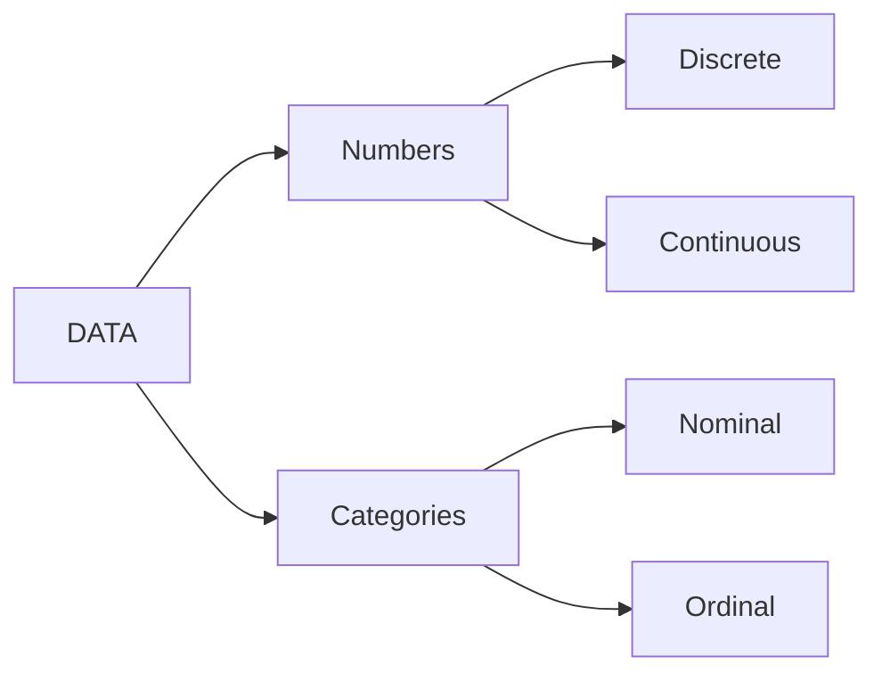

# Types of Data in being wrangled

The Data can be broken down into two major Groups:

1. Quantitative (Numeric)
2. Qualitative (Categorical)

## Quantitative Data

Numeric data can be broken down into two categories

| **Continuous** | **Discrete** |
| --- | --- |
|• Think numbers with decimal points | • Think Whole numbers |
|•  pi, height, weight | • number of students, number of subjects |
|•  **`double`**, **`single`** | • **`uint8`** **`uint16`** |

**MATLAB variable types**: We typically store these different numeric categories using the different  MATLAB numeric classes for floating point (**`double`**) or integer (**`uint8`**) values.

## Qualitative Data

Qualitative data includes any data that can easily be grouped. Often this data takes the form of character or word data, which used to define categories. That is why this data is called Categorical data. That being said, even numeric data can be considered qualitative data, if the number represents categories, like 1="bad" and 2 = "good".

Categorical data can also be broken down into two categories

| **Nominal** | **Ordinal** |
| --- | --- |
|• No Implicit Order | • Implicit Order |
|• e.g. Sex categories: Male, Female | • e.g. Skill Levels: "Beginner", "Intermediate", "Expert" |

**MATLAB variable types**: **`strings`**, **`cells`**, or   [**`categorical`**](https://www.mathworks.com/help/matlab/categorical-arrays.html) variable types.