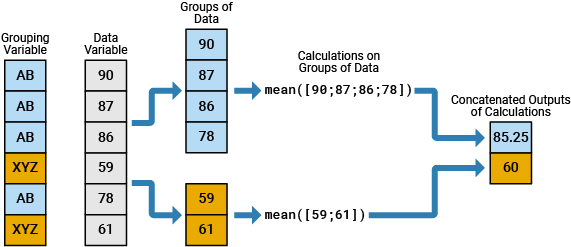
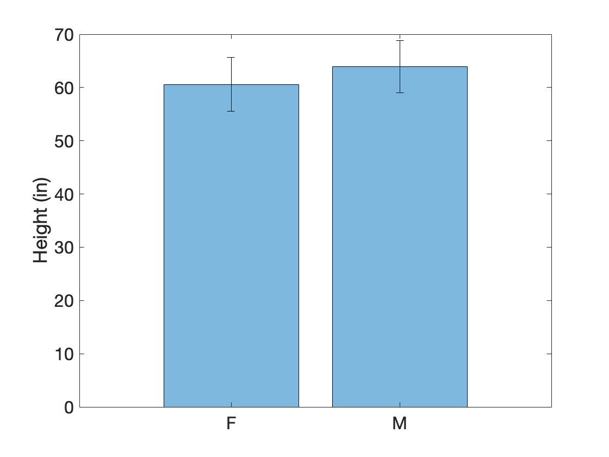
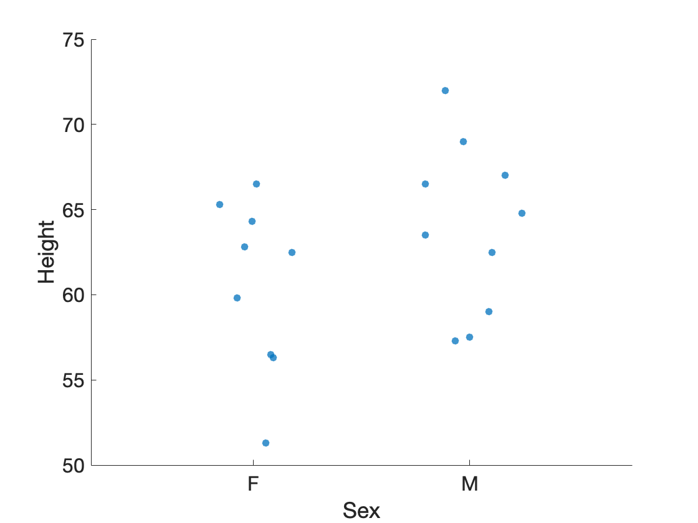

# Group Statistics

Once we have our data tidied, then we can get into the business of analyzing the data.

## Overview

### Useful Resources

- [Perform Calculations by Group](https://www.mathworks.com/help/matlab/matlab_prog/perform-calculations-by-group-in-table.html)

### Useful Functions

- [groupsummary](https://www.mathworks.com/help/matlab/ref/double.groupsummary.html)
- [groupcounts](https://www.mathworks.com/help/matlab/ref/double.groupcounts.html)

## Load the Data

First, we need to load the data. I have saved a csv file of some data in a secret online location

```matlab linenums="1" title="Load "
url = 'https://saldenest.s3-us-west-2.amazonaws.com/MATLAB_fundamentals/class.csv';
T = readtable(url);
T.Name = string(T.Name); % typecast to string
T.Sex = categorical(T.Sex) % typecast to categorical
```
…after loading the data, we typecast the Name Column to a string and the sex column to a categorical array. And we get the following

```matlab
T =

  19×5 table

      Name       Sex    Age    Height    Weight
    _________    ___    ___    ______    ______

    "Alfred"      M     14        69     112.5 
    "Alice"       F     13      56.5        84 
    "Barbara"     F     13      65.3        98 
    "Carol"       F     14      62.8     102.5 
    "Henry"       M     14      63.5     102.5 
    "James"       M     12      57.3        83 
    "Jane"        F     12      59.8      84.5 
    "Janet"       F     15      62.5     112.5 
    "Jeffrey"     M     13      62.5        84 
    "John"        M     12        59      99.5 
    "Joyce"       F     11      51.3      50.5 
    "Judy"        F     14      64.3        90 
    "Louise"      F     12      56.3        77 
    "Mary"        F     15      66.5       112 
    "Philip"      M     16        72       150 
    "Robert"      M     12      64.8       128 
    "Ronald"      M     15        67       133 
    "Thomas"      M     11      57.5        85 
    "William"     M     15      66.5       112 
```

In this table, the columns contain the **variables**, so we have five variables: Name, Sex, Age, Height, and Weight. The rows contain the **observations**, so we have 20 observations. Row 1 contains all of the observed metrics from Alfred and and row 20 contains all the observed metrics from William. This appears to a table of metrics from a group of young students. 

## Grouping Variables

In our table we have both Quantitative and Qualitative data. The Quantitative data columns are Age, Height, and Weight, whereas the Qualitative Data Columns are Name and Sex.

So in our analysis, we will calculate stats like mean and standard deviation of the Quantitative data (e.g. mean height), and we will group those statistics using the Qualitative data (e.g. mean female weight).

A grouping variable is a variable that helps group the observations (e.g. the rows).



>In the above image, there are 2 groups, AB and XYZ. The data from the data variable column (in gray) is broken down into these two groups before processing

 In our table, the Sex column contains a categorical array with two categories: M or F. In our stats, when we calculate stats like mean height or weight, we want to first group all the male rows together and calculate those stats, and then group  the female rows together and calculate those stats.

## Calculating Stats by group

The function **`groupcounts`** returns the number of group elements in a categorical array

```matlab linenums="1" title="groupcounts"
groupcounts(T,"Sex")
```

```matlab
ans =

  2×3 table

    Sex    GroupCount    Percent
    ___    __________    _______

     F          9        47.368 
     M         10        52.632 
```

…Our data has one more male than female.

The function **groupsummary** calculates group statistics in one fell swoop:

```matlab linenums="1" title="Group summary for Height"
s = groupsummary(T,"Sex",["mean" "std"],"Height")
```

…Notice that we input the whole table into **groupsummary** as the first input (T). Then we indicate which variable to use as a grouping variable ("Sex"). Then we indicate the stats we want to run ("mean" and "std"). Finally, we indicate which variable we want the stats to be calculated on ("Height").

And we get our stats nicely packaged in a new table, *s*.

```matlab
s =

  2×4 table

    Sex    GroupCount    mean_Height    std_Height
    ___    __________    ___________    __________

     F          9          60.589         5.0183  
     M         10           63.91         4.9379  
```

…Notice in the table *s*, the variables now include "mean_Height" and "std_Height"

We can even run the stats on multiple variables, simply by change the last input:

```matlab linenums="1" title="Group summary for Height and Weight"
s = groupsummary(T,"Sex",["mean" "std"],["Height", "Weight"])
```

```matlab
s =

  2×6 table

    Sex    GroupCount    mean_Height    std_Height    mean_Weight    std_Weight
    ___    __________    ___________    __________    ___________    __________

     F          9          60.589         5.0183        90.111         19.384  
     M         10           63.91         4.9379        108.95         22.727 
```

…And now we have two addition variables in our stats table: mean_Weight and std_Weight.

## Visualizing the Group Stats

### Bar Plots

Once we have calculated the group statistics, we can plot the data from *s* as a bar plot with error bars

```matlab
% set data
x = s.Sex; % grouping variable
y = s.mean_Height; % stat to plot
e = s.std_Height; % error 

% plot data
figure
bar(x,y,FaceAlpha=0.5);

hold on
errorbar(x,y,e,'k',LineStyle="none")
ylabel('Height (in)')
```

…Notice the **`errorbar`** is a separate function from **`bar`**. Thus, we need to turn `hold on` to ensure that the error bar doesn't overwrite the bar. Also, **`errorbar`** requires at minimum three inputs: the grouping variable, the mean data (height of the bar), and the standard deviation (height of the error bar). **`bar`** only needs the grouping variable and the mean data.  

{ width="450"}

### swarmchart

Many plotting functions accept grouping variables to sort plots by group.

```matlab linenums="1" title="Swarm chart of male and female heights"
figure(Visible="on")
hs = swarmchart(T,"Sex","Height","filled",MarkerFaceAlpha=0.75,XJitterWidth=0.5)
```

{ width="400"}

>Here we plot a swarm chart in which we separate the male and female heights. Each dot represents one observation. Male heights trend slightly higher than female heights.

### Box Plots

Similarly, we can create box plots organized by groups using the **boxchart** function.

Here we overlay the box plots onto the swarm charts by turning `hold on`

```matlab
hold on % overlay plot
boxchart(T.Sex,T.Height,"BoxFaceColor",'k',"BoxFaceAlpha",0.15)
```

{ width="450"}

>Notice the difference in the two function calls. For **`boxchart`**, we using dot notation to index out the Sex and Height data. For **`swarmchart`** we inputted the table, *T*, and then indicated which variable names to plot or use as a grouping variable.

### Scatter

The function **gscatter**, included with the Statistics and Machine Learning toolbox, plots grouped data in different colors,

```matlab linenums="1"
figure
gscatter(T.Weight,T.Height,T.Sex,'mb',[],25)
ylabel('Height (inches)')
xlabel('Weight (lbs)')
```

…notice again that here we input the column data (Weight, Height, Sex) from *T* using dot notation. We also include a couple extra inputs: `'mb'` - indicates the two group colors to use, magenta and blue. `25` - indicates the size of the dot.

{ width="450"}
>Height and Weight are positively correlated. Notice that **`gscatter`** automatically includes a legend in the plot.
