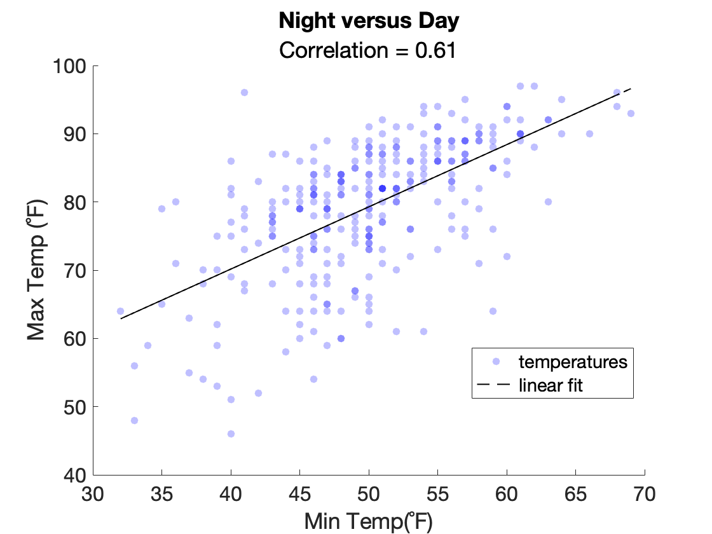

## Resources

The following site is an excellent resource for reviewing different plot types and for determining when and how you should use them:

- [Story Telling with Data](https://www.storytellingwithdata.com/chart-guide)

Not sure whether you should use a bar chart or a box plot? Check out these articles:

- [Bar charts and box plots](https://www.nature.com/articles/nmeth.2807.pdf): this article in Neuron nicely summarizes when you should use a bar plot and when you should use a box plot. 
- [Box Plots v Bar Plots](https://pagepiccinini.com/2016/02/23/boxplots-vs-barplots/): this author falls strongly in the box plot camp

Interested in learning more about Beeswarm charts? Read these articles:
- [Boxplot Alternatives](https://www.datascienceblog.net/post/data-visualization/boxplot_alternatives/)
- [Better Data Visualization Using Beeswarm Charts](https://towardsdatascience.com/better-data-visualization-using-beeswarm-chart-bb46a229c56b)

## Adding Regression lines to Scatter Plots

Recall that a scatter plot allows you to visualize the relationship between two variables.

For example, the following shows the relationship between maximum and minimum temperatures on a given day in September over 10 years:

```matlab linenums="1" title="Scatter Plot of Min vs Max temps"
figure
x = T.MinTemperatureF;
y = T.MaxTemperatureF;
hs = scatter(x, y,[],'blue','filled',MarkerFaceAlpha=0.25); % default size, blue, filled, transparency of 0.25
xlabel('Min Temp(˚F)')
ylabel('Max Temp (˚F)')
title('Minimum vs Maximum temps in September')
```

{ width="400"}

>Note, since we turned on the transparency of the dots, we get different shaded dots. The darker shaded blue dots indicate that there is more than one dot at that location.

The rising trend of the scatter plot  suggests the temperatures are correlated. But are they correlated?

We can calculate the correlation between the two variables using the function **`corr`**, as follows:

```matlab linenums="1" title="Correlation between Min and Max Temps"
c = corr(x,y)
```

```matlab title="result"
c =

      0.61158
```

…And we get a correlation of 0.61. Since the value is positive, then our data is positively correlated. Since the value is greater than 0.5 but less than 0.7, our data can be considered "mildly correlated".

Since our data is mildly correlated, we can calculate the linear regression of the data.  Linear regression is a model that we can use to predict one variable from the other. For example, given a minimum temperature, we could use the linear regression to predicate what the maximum temperature would be. It might not be a great prediction (since the data is only mildly correlated), but its a start. And once we calculate the linear regression we can plot a visualization of the model as a line overlaid on the scatter plot.

We calculate the linear regression as follows:

```matlab linenums="1" title="Calculate Linear Regression"
% calculate linear regression
p = polyfit(x,y,1); % simple linear regression
f = polyval(p,x); % calculate Max temps based on min temps from line

% add regression line to plot
hold on % turn on hold
plot(x,f,'--k',"LineWidth",1)
legend({'temperatures','linear fit'},"Location","best") % add legend
title('Night and Day', sprintf('Correlation = %1.2f',c)) % add a subtitle by adding a second input to title
```

{ width="400"}

>Notice that the regression line goes through the middle of the cloud and trends upwards. Dots that are closest to the line are best predicted by the model. Dots further away from the line are less well predicted. Warmer temperatures seem to be better predicted than cooler temperatures.


## Plotting Using Grouping Variables

Up to this point, we have been plotting entire columns of data. Sometimes though we need to separate the data in a column into distinct groups. We can group this data using grouping variables.

Consider the following columns in our dataset

```matlab
T.MDT = datetime(T.MDT); % good for time data
T.Events = categorical(T.Events); % good for statistical organization
T.Events = addcats(T.Events,'none'); % add a category of none
T.Events(isundefined(T.Events)) = 'none'; % set all undefined events to the category of none
categories(T.Events) % list the categories found in events
```


Consider for example our events column.


Using grouping variables, we can group the different rows of the table into different categories, isolating these subsets of data. Notice that in our table we have columns of numbers, such as temperature, dewpoint, humidity, and windspeed, and columns of identification, such as date (MDT) and event (e.g., rain, snow, etc.). The identifying data are also known as grouping variables and can be used to group rows into different categories.
These grouping variables are more useful when you typecast them to certain variable types, like datetime and categorical


### Bar Example 1: Bar Plot event counts

#### Bar Example 1: Clean up the data and group

The "Events" column of **`T`** contains categorical data---data that can easily be divided into groups.

To simplify plotting this data, we are going to convert this column to a categorical class:

```matlab linenums="1" title="Convert Events column to a categorical array"
T.Events = categorical(T.Events)
```

```matlab title="Contents of Event column"
ans = 

  30×1 categorical array

     <undefined> 
     <undefined> 
     <undefined> 
     Rain-Thunderstorm 
     Rain-Thunderstorm 
     ⋮
```

…As you can see, many rows contain the term `<undefined>`, while some contain an event, like 'Rain-Thunderstorm'.

For our purposes, we'll use `<undefined>` as an indicator that there was no weather event and we'll call this event `'none'`. We can convert `<undefined>` to `'none'` in the array as follows:

```matlab linenums="1" title="Replace undefined data"
T.Events(isundefined(T.Events)) = ('none') % replace all undefined data with 'none'
```

```matlab title="result"

  30×1 categorical array

     none 
     none 
     none 
     Rain-Thunderstorm 
     Rain-Thunderstorm 
```

#### Bar Example 1: Count Events

To plot our bar plot, we first need to count up the number of each event (or group). The function **`groupsummary`** simplifies this nicely:

```matlab linenums="1"
s = groupsummary(T,"Events")
```

```matlab title="result"
s =

  6×2 table

           Events            GroupCount
    _____________________    __________

    Fog                           1    
    Fog-Rain                      2    
    Fog-Rain-Thunderstorm         2    
    Rain                          4    
    Rain-Thunderstorm             7    
    none                         14    
```

…**`groupsummary`** returns a table, *`s`*, with the data that we need for the next step. And importantly, this data is already sorted by count.


#### Bar Example 1: Plot Event Counts

Now we are ready to plot our data. The following code creates a bar plot and adds a title, an x- and a y-label. It also changes the transparency of the bars, so you get a nicer shade of blue.

```matlab linenums="1" title="Plot Event Counts as a Bar Plot"
x = s.Events;
y = s.GroupCount;

hb = bar(x,y); % notice the two inputs

hb.FaceAlpha = 0.5; % increase transparency of plot (nicer shade of blue)

% axis formatting
ylabel("Number of days")
xlabel("Weather Event","FontWeight","bold")
title("Denver - September 2013")
ylim([0 17]) % increase the limits on the y-axis
```

…Notice since *`x`* is a categorical array, we got the event labels at the bottom of the bar plot. (1)
{.annotate}

1. The function **`bar`** does not accept a string or a cell array as an input for *`x`* — it has to be a categorical array for this to work.

![Bar Plot Event Counts][bar-ev-count]{width=450px}

>Notice in this bar plot, that the counts of the events have been sorted from fewest to most. This makes the data much easier to interpret. On the left, we se that there were very few days of fog, while on the right, we see that on a majority of days, nothing of note happened ('none').

[bar-ev-count]:images/bar-event-counts.png

### Example 2: Horizontal Bar Plot

The function **`barh`** operates exactly like **`bar`**, but produces horizontal bars, as follows:

```matlab linenums="1"
hb = barh(x,y);

hb.FaceAlpha = 0.5; % increase transparency of plot

% axis formatting
xlabel("Number of days")
ylabel("Weather Event","FontWeight","bold")
title("Denver - September 2013")
% ylim([0 17]) % increase the limits on the y-axis
xlim([0 15])
```

![Horizontal Bar Plot][bar-ev-count-sorted-hz]{width=450px}

[bar-ev-count-sorted-hz]:images/bar-event-counts-hz.png  

…And now our bar plot is horizontal. Notice that we had to input the correct data in the correct labeling functions and we had to use **`xlim`** instead of **`ylim`**: