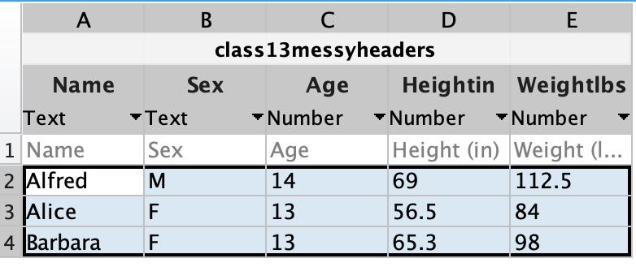
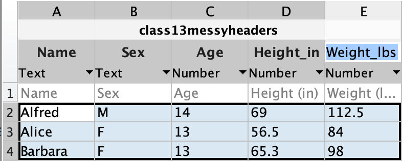

# Tidy Data

{width=300px}

Data comes in many forms and often these forms are messy. Part of data wrangling involves organizing and cleaning up this data in a fashion that makes it easier to analyze. Usually, the first step is to organize the data into a table in a *tidy* fashion.

## What is Tidy Data?

Tidy data is data organized in a table as follows:

1. each row corresponds to an observation
2. each variable is a column
3. each type of observation is in a different table

{ width="550"}

Consider the following messy data:

<div class="grid cards" markdown>

| Subject 1 |        |
| --------- | ------ |
| Name      | Alfred |
| Sex       | M      |
| Age       | 14     |
| Height    | 69     |
| Weight    | 112.5  |

|Subject 2 | |
| --- | --- |
|Name | Alice|
|Sex | F|
|Age | 13 |
|Height| 56.5|
|Weight |84|

|Subject 3 | |
| --- | --- |
|Name | Barbara|
|Sex | F|
|Age | 13 |
|Height| 65.3|
|Weight |98|

</div>

While this organization is relatively easy to read and understand (for a human), it is not considered tidy data because the variables are not organized in columns, which makes it difficult to analyze the data.

The tidy way to organize this data would be as  follows:

{{ read_csv('class1-3.csv') }}

Notice here that each subject (or observation) is a row, and we have five Variables: Name, Sex, Age, Height, Weight.

In this form, we can easily perform stats on the variables

## MATLAB Table

Here is that same data imported into a MATLAB table variable:

```matlab
T =

  3×5 table

      Name       Sex    Age    Height    Weight
    _________    ___    ___    ______    ______

    "Alfred"     "M"    14        69     112.5 
    "Alice"      "F"    13      56.5        84 
    "Barbara"    "F"    13      65.3        98 
```

We can inspect the properties of a MATLAB using the properties field:

```matlab linenums="1" title="Get Table Properties"
T.Properties
```

```matlab
ans = 

  TableProperties with properties:

             Description: ''
                UserData: []
          DimensionNames: {'Row'  'Variables'}
           VariableNames: {'Name'  'Sex'  'Age'  'Height'  'Weight'}
    VariableDescriptions: {}
           VariableUnits: {}
      VariableContinuity: []
                RowNames: {}
```

Notice that the column names in a MATLAB table are Called Variable Names.

If we want the average height, we would simply index out the Height variable, as follows:

```matlab linenums="1" title="Calculate Mean Height"
mean(T.Height)
```

```matlab title="result"
ans =

         63.6
```

Or, we can get summary data for all of the Variables (columns) using the summary function:

```matlab
summary(T)
```

```matlab title="Output from Summary"
Variables:

    Name: 3×1 string

    Sex: 3×1 string

    Age: 3×1 double

        Values:

            Min          13   
            Median       13   
            Max          14   

    Height: 3×1 double

        Values:

            Min         56.5  
            Median      65.3  
            Max           69  

    Weight: 3×1 double

        Values:

            Min           84  
            Median        98  
            Max        112.5  
```

## Data Clean-up

When importing data, it is important to have standardized column headers with names that can be used as MATLAB variables. So, your column headers should have no spaces or characters like spaces, parentheses, or asterisks.

For example, the following headers would not work as tidy headers

``` title="Messy Column Headers"
Name	Sex	Age	Height (in)	Weight (lbs)
```

> These column headers are messy because two of the columns contain parentheses and spaces.

The [MATLAB data import tool](https://www.mathworks.com/help/matlab/ref/importtool.html) automatically handles these messy header names. The following is the window brought up after clicking on the data import button (Home tab, in the Variable section) and selecting a csv file with above messy headers

{ width="350"}

>Notice that the parentheses and spaces have been dropped from the Height and Weight Column Names. This, however, makes the column headers harder to read.

You can edit the Column Names directly by double-clicking on the Column name. An easier way to read the columns with the units intact would be to include underscores, as follows:

{ width="350"}

After import, the table would look like the following:

```matlab
T =

  3×5 table

      Name       Sex    Age    Height_in    Weight_lbs
    _________    ___    ___    _________    __________

    "Alfred"     "M"    14         69         112.5   
    "Alice"      "F"    13       56.5            84   
    "Barbara"    "F"    13       65.3            98   
```