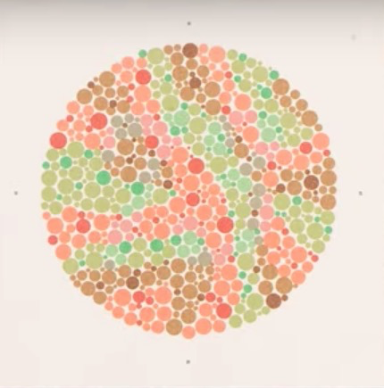
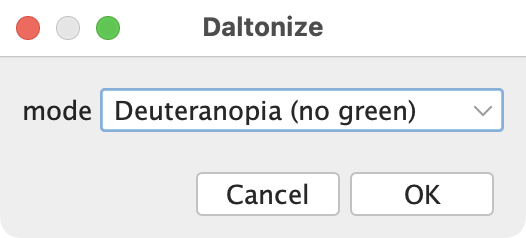

Color Blind Simulation

This image contains a hidden numeric value that is only visible if you are colorblind

{ width="250"}

To see the value, open the image in Fiji

Select the `Image:Color:Simulate Color Blindness` menu item

In the "Daltonize" dialog window that comes up, Choose "Deuteranopia (no green)" mode

{ width="250"}

And select OK.

If you have deuteranopia, a specific type of red-green colorblindness, you can probably see a "73" written in the colorful image above. Bask in this example of your genetic difference being a strength, not a hindrance.

If you have protanopia, you might see a crooked "23" instead, but that's probably due to the ambiguity that comes with working with little colored circles.

What value do you see?