# Color Segmentation

!!! abstract "Letting the pixels do the talking"

## Overview

**Segmentation** means separating the pixels you care about from everything else. The result is a **mask**: a logical array that is `TRUE` at every pixel belonging to your object, and `FALSE` everywhere else. Up to now, we've segmented objects using intensity alone. But color carries a lot of information that a single grayscale value throws away, and that extra information can make segmentation easier—or, as we'll see, more misleading if you don't understand what it's actually measuring.

In this module, we segment color images three different ways: interactively with MATLAB apps, programmatically with a single color-based threshold, and programmatically across several colors at once. Along the way, we validate our masks against a hand-drawn ground truth, separate touching objects, and deliberately break our own methods to understand their limits.

This module is broken down into the following sections:

### Things you should know

- Explain the difference between a class-label image and an object mask
- Use the **Color Thresholder** app to prototype a color-based segmentation
- Use the **Jaccard** and **Dice** coefficients to quantify how well a mask matches a ground truth
- Use **`graythresh`** and **`imbinarize`** to threshold a single color channel adaptively
- Explain the difference between a *reproducible* method and a *generalizable* one
- Use **`multithresh`** and **`imquantize`** to divide one channel into several value ranges
- Use **`imsegkmeans`** to cluster pixels by color in a multi-dimensional color space
- Identify the dominant color cluster inside a segmented object

### Key Terminology you should know

- **Mask**: a logical array that is `TRUE` at pixels belonging to an object, `FALSE` elsewhere
- **Reproducibility**: whether a procedure gives the same result when repeated
- **Generalizability**: whether a procedure still works on new images acquired under different conditions
- **Class-label image**: an image where each pixel is assigned an integer describing which *value range* (not which *object*) it belongs to
- **Heuristic**: a convenient rule that works because of something you know about a specific problem, with no guarantee it generalizes
- **Cluster**: a group of pixels that are close together in color space

### Key Functions

- [colorThresholder](https://www.mathworks.com/help/images/ref/colorthresholder-app.html): Interactively segment an image by color
- [imageSegmenter](https://www.mathworks.com/help/images/ref/imagesegmenter-app.html): Interactively segment an image, including with the Segment Anything Model (SAM)
- [jaccard](https://www.mathworks.com/help/images/ref/jaccard.html) and [dice](https://www.mathworks.com/help/images/ref/dice.html): Measure the similarity between two masks
- [graythresh](https://www.mathworks.com/help/images/ref/graythresh.html): Compute a global threshold using Otsu's method
- [multithresh](https://www.mathworks.com/help/images/ref/multithresh.html): Compute multiple thresholds for an image
- [imquantize](https://www.mathworks.com/help/images/ref/imquantize.html): Quantize an image using specified thresholds
- [imsegkmeans](https://www.mathworks.com/help/images/ref/imsegkmeans.html): Segment an image into clusters using k-means clustering

---

## Thresholding by Color with Apps

The **Color Thresholder** app is a quick way to explore how different color models separate the colors in an image.

Consider this image of a (rather large) cube:

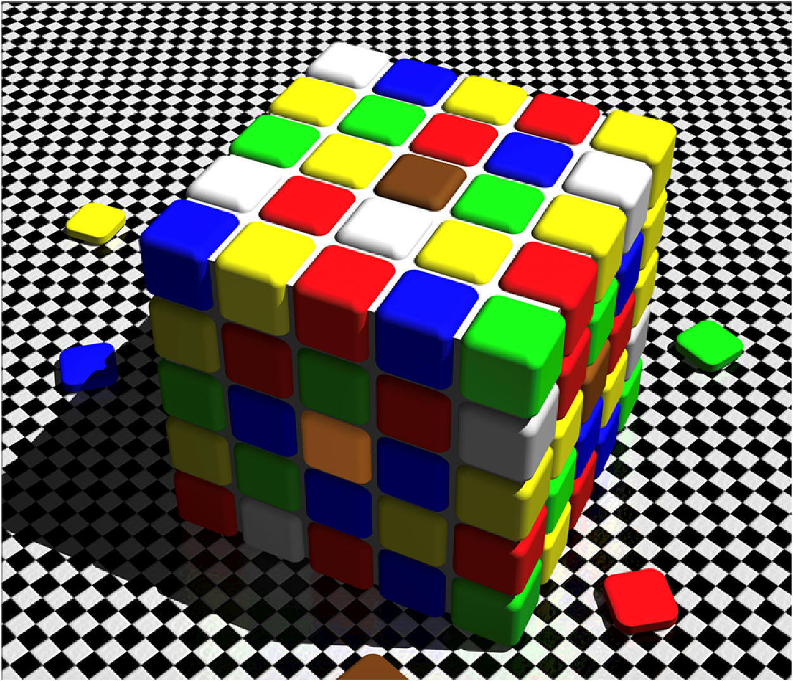{ width="450"}

Launching **`colorThresholder`** on this image, and trying the RGB, HSV, and L\*a\*b\* color models in turn, reveals something surprising: no matter which color model you pick, you cannot separate the "brown" tile near the top from the "orange" tile on the front face—they occupy nearly identical pixel values in every color model. They only *look* different to you because your visual system is correcting for the shadow falling across the cube. The thresholding tools only see the numbers, and the numbers are the same:

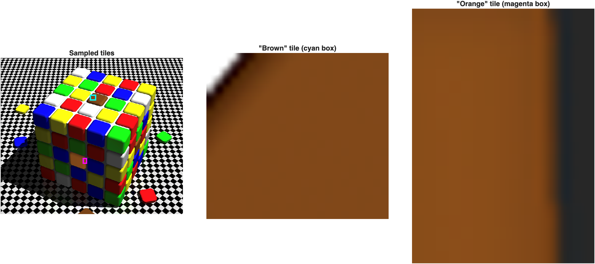{ width="650"}

>Sampling a small patch from each tile confirms it numerically: the "brown" tile averages RGB `[127 73 29]`, and the "orange" tile averages `[112 66 28]`—nearly identical, well within the kind of variation you'd see from JPEG compression and surface shading alone. Keep this in mind for the rest of this module: what looks obviously separable to your eye is not always separable in the pixel data.

### Prototyping a Segmentation

For a more typical task, let's try to capture and count strawberries:

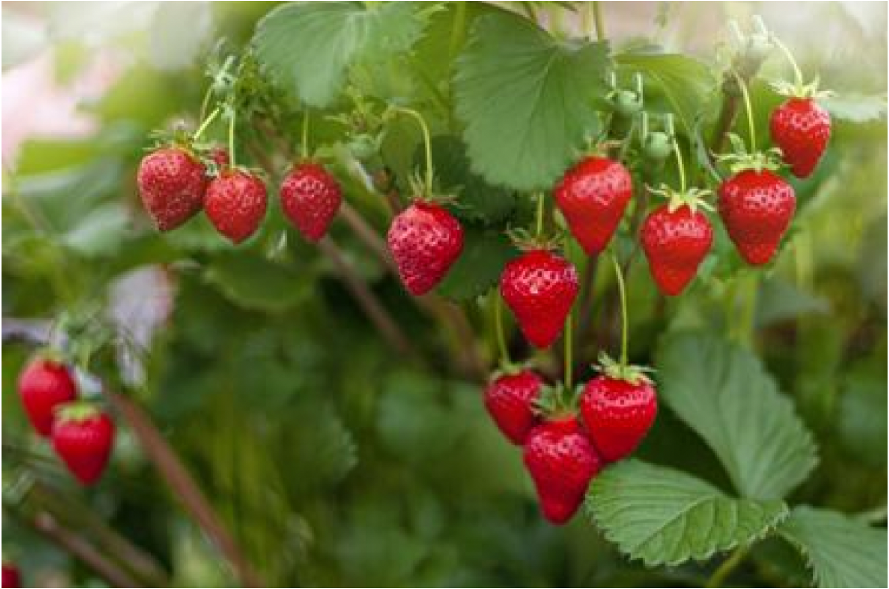{ width="550"}

The usual workflow is to prototype a segmentation by hand in **`colorThresholder`**—trying different color models, dragging sliders, and lassoing the object—before committing anything to code. Here are three masks produced this way, one per color model:

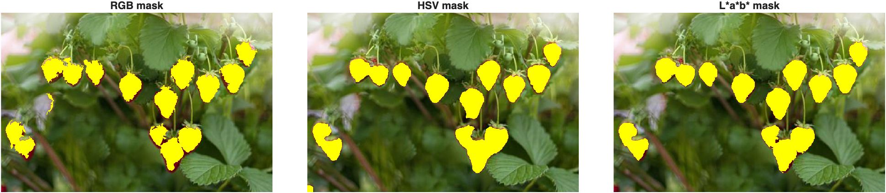{ width="650"}

>All three capture the strawberries reasonably well here, though in practice you'll often see the **L\*a\*b\*** mask hold up best, since its a\* channel (green ↔ red) tends to separate ripe fruit from foliage more cleanly than any single RGB or HSV channel. Small differences in noise and coverage between the three are typical—which model wins depends on the image.

!!! tip "Exporting your own segmentation function"

    Once you're happy with a threshold in **`colorThresholder`**, hold down the **Export** button and choose **Export Function**. MATLAB generates a ready-to-use function that converts an image to your chosen color space and applies the exact slider ranges you selected on each channel—so the next image you throw at it gets the same, repeatable treatment.

### Segment Anything (SAM)

The **Image Segmenter** app (not the Color Thresholder) also offers a very different approach: the **Segment Anything Model (SAM)**, a machine learning model trained on millions of images, accessible by clicking **Segment Anything** and then clicking directly on the objects you want. Launch it with **`imageSegmenter`**.

### Comparing Masks Against a Ground Truth

How do you know which mask is actually best? Ideally, you compare each one against a **ground truth**: a mask a human has carefully drawn by hand.

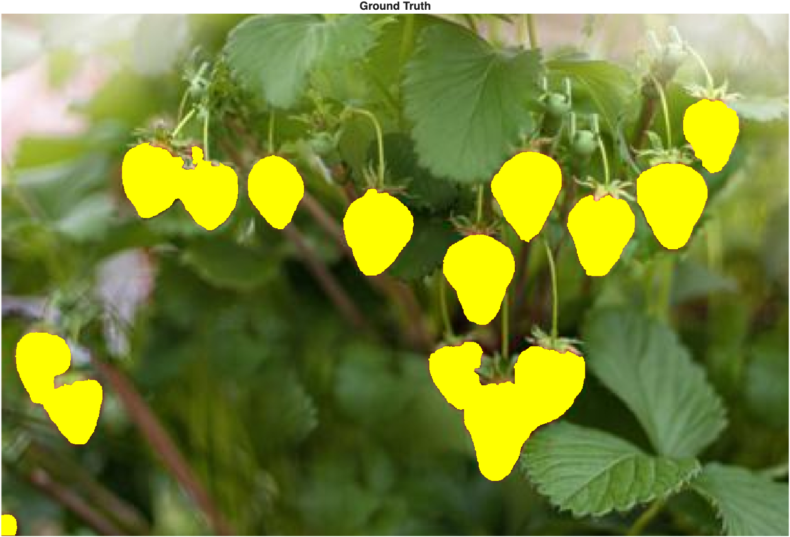{ width="450"}

The **Jaccard** and **Dice** coefficients both quantify how similar two masks are, on a scale from 0 to 1:

- **Jaccard** (intersection over union): the size of the overlap divided by the size of the union
- **Dice**: twice the overlap, divided by the sum of the two mask areas (always a bit more generous than Jaccard for the same pair of masks)

Comparing our RGB, HSV, L\*a\*b\*, and SAM masks against the ground truth:

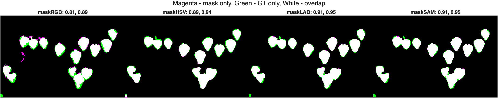{ width="650"}

| Mask | Jaccard | Dice |
| --- | ---: | ---: |
| RGB | 0.807 | 0.893 |
| HSV | 0.892 | 0.943 |
| L\*a\*b\* | 0.907 | 0.951 |
| SAM | 0.907 | 0.951 |

>In this particular comparison, the SAM mask and the L\*a\*b\* mask score identically—not because SAM failed, but because the SAM mask used here is a saved backup (for anyone without GPU access or the SAM download), and it happens to have been generated from the same L\*a\*b\* threshold. The scores still make the broader point: in these pseudocolored overlays, magenta marks pixels the candidate mask found but the ground truth didn't, green marks pixels the ground truth found but the candidate missed, and white marks agreement. More white and less color means a better match—and that's exactly the trend from RGB through L\*a\*b\*.

### Separating Touching Objects

Masks that lump multiple touching objects into one blob will undercount them. Before separating anything, clean up small noise and holes:

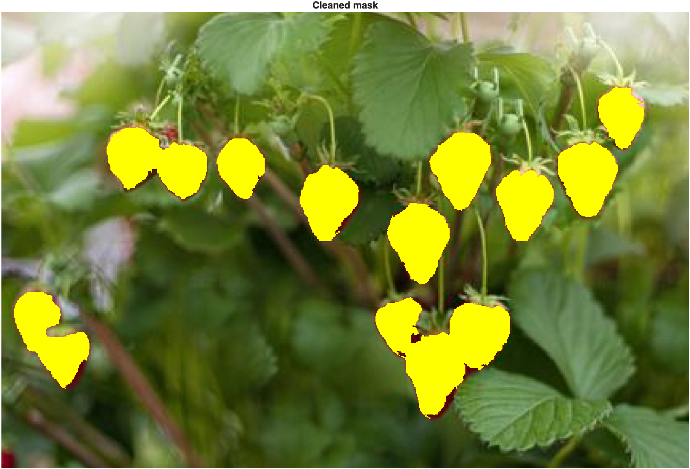{ width="550"}

Then apply the **watershed transform**, which can detach regions that are only barely touching. The course function **`mmGetWatershed`** automates the usual multi-step watershed recipe. Its `ShowSteps` option visualizes what's happening under the hood: the distance transform (left), the watershed regions with their seed points overlaid (middle), and the mask before and after separation (right):

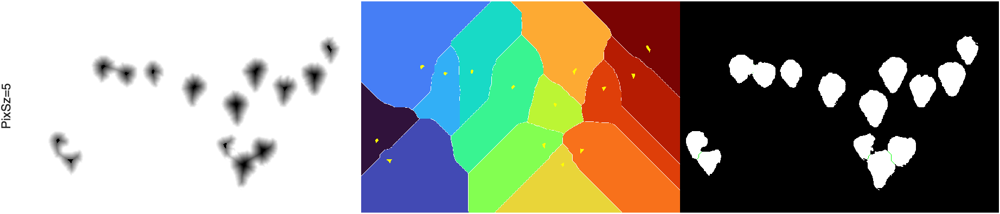{ width="650"}

```matlab linenums="1" title="Clean, separate, and count"
maskClean = bwareaopen(mask,50);     % remove small noise
maskClean = imfill(maskClean,'holes');       % fill holes inside each object
maskClean = imclearborder(maskClean);        % remove objects touching the edge

watershedMask = mmGetWatershed(maskClean,5); % separate touching objects

rp = regionprops('table',watershedMask,"basic");
height(rp) % count the separated objects
```

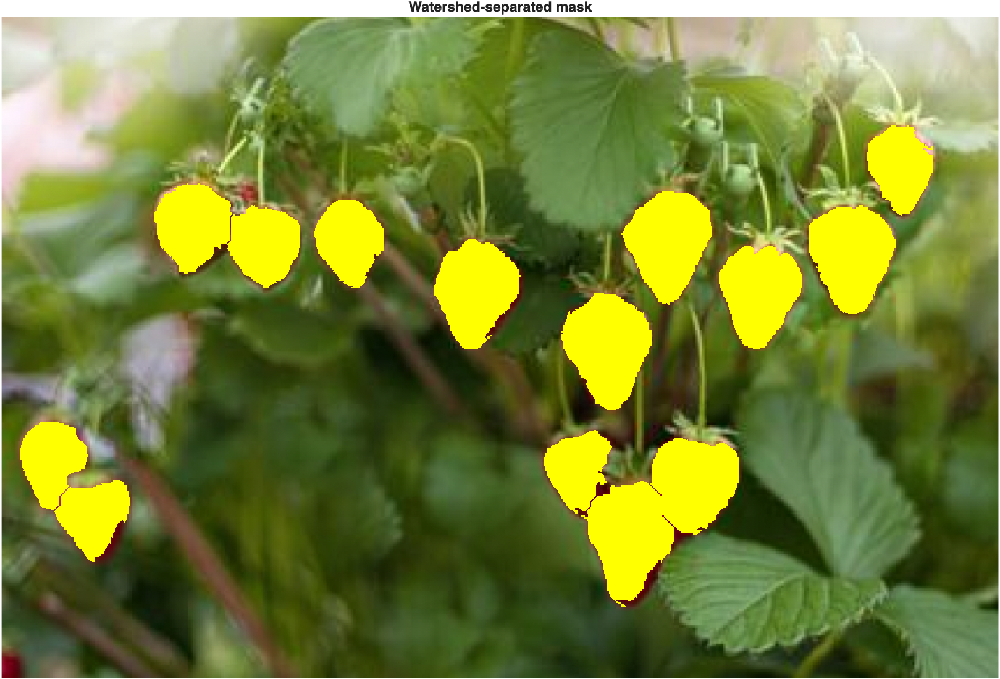{ width="550"}

>**`imclearborder`** removed one small strawberry in the corner because it touches the edge of the frame—standard practice when *measuring* objects (a strawberry half out of frame gives a bad area measurement), but a real trade-off if you're *counting*: you just threw away a real strawberry.

Counting the separated regions and labeling them confirms the result:

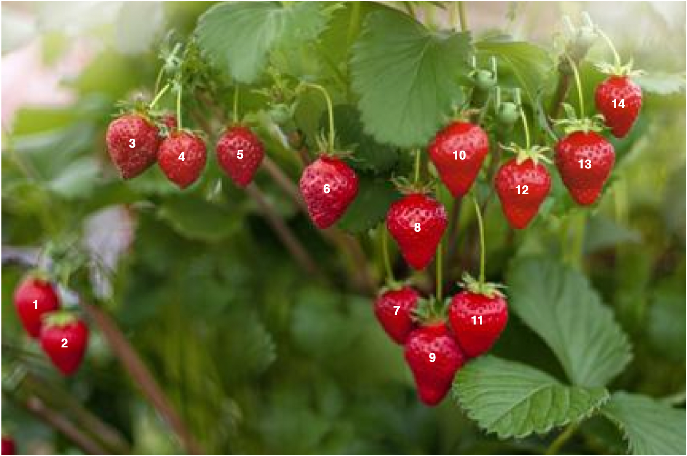{ width="650"}

>Fourteen strawberries, correctly separated and numbered. Counting connected components is easy; deciding which components represent meaningful objects—and whether any were lost or incorrectly split along the way—requires looking at the result.

## Programmatic Color Segmentation in L\*a\*b\*

Clicking through an app works for a handful of images, but it doesn't scale to hundreds. A programmatic approach replaces the clicks with a repeatable rule based on image data. That makes the analysis **reproducible**—but not automatically **generalizable**. A method can give the same answer every time and still fail on a new image with different lighting, colors, or backgrounds. This section builds a rule, validates it, scales it up, and then deliberately gives it an image designed to break it.

### Finding the Right Channel

L\*a\*b\* separates lightness from color, and the two color axes (a\*: green ↔ red; b\*: blue ↔ yellow) are stored independently. For red strawberries against green foliage, the a\* channel is our best bet:

```matlab linenums="1" title="Convert to L*a*b* and inspect the channels"
p.rgb = imread('strawberries.png');
p.lab = rgb2lab(p.rgb);

tiledlayout(2,3,'TileSpacing','compact','Padding','compact')
titles = ["L* (lightness)", "a* (green to red)", "b* (blue to yellow)"];

for n = 1:3
    nexttile(n)
    imshow(p.lab(:,:,n),[]) % rescale each channel independently for display
    title(titles(n))

    nexttile(n+3)
    histogram(p.lab(:,:,n),50)
    xlabel('Channel value')
    ylabel('Pixels')
end
```

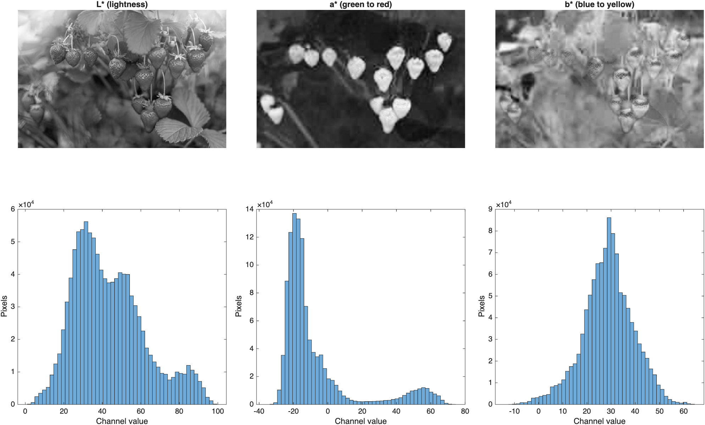{ width="650"}

>The strawberries pop in the a\* plane: foliage sits at lower, more negative a\* values, while ripe strawberries sit at higher, positive values. The a\* histogram is roughly bimodal, suggesting that a single threshold can separate the two color groups. Remember: the exact a\* range depends on the colors in *this* image—it isn't a fixed, universal cutoff.

### Letting Otsu Pick the Threshold

**`graythresh`** calculates Otsu's threshold—the value that splits a histogram into two groups while minimizing the variation within each group—plus an effectiveness metric describing how well that split worked. Since `graythresh` and `imbinarize` expect values between 0 and 1, we rescale the raw a\* plane first:

```matlab linenums="1" title="Otsu threshold on the a* plane"
p.a = p.lab(:,:,2);
p.aNorm = rescale(p.a); % rescale a* to the range 0-1

[p.aLevel,p.otsuEffectiveness] = graythresh(p.aNorm);

aMin = min(p.a,[],'all');
aMax = max(p.a,[],'all');
p.aThresh = p.aLevel*(aMax-aMin) + aMin; % convert back to the raw a* scale
```

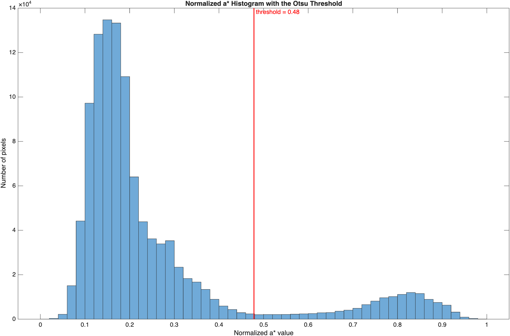{ width="550"}

>The threshold (0.48 normalized, equivalent to a raw a\* value of 17.1) lands right in the valley between the two groups, with an Otsu effectiveness of 0.845. This cutoff was calculated from the image data—not hand-picked—which makes the procedure repeatable.

Binarizing, cleaning up noise, and running the watershed produces the full pipeline in one view:

```matlab linenums="1" title="Full a*-plane segmentation pipeline"
p.aMaskNorm = imbinarize(p.aNorm,p.aLevel);

p.aMaskClean = bwareaopen(p.aMaskNorm,200); % 200 px is appropriate for this image's resolution
p.aMaskClean = imclearborder(p.aMaskClean);

p.aWatershed = mmGetWatershed(p.aMaskClean,5);

tiledlayout("flow","TileSpacing","none","Padding","tight")
fieldsToShow = ["rgb" "aNorm" "aMaskNorm" "aMaskClean" "aWatershed"];
for fieldName = fieldsToShow
    nexttile
    imshow(p.(fieldName))
    title(fieldName,'Interpreter','none')
end
```

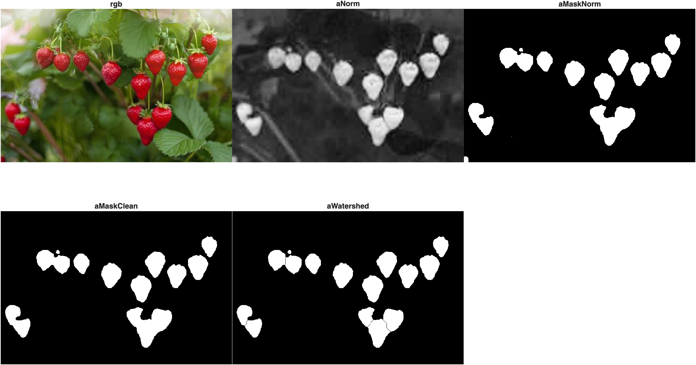{ width="650"}

>**Important:** pixel-area cutoffs like the 200 used here depend on image resolution and object size. If the magnification or resolution changes, the same cutoff may no longer be appropriate.

### How Does It Compare?

One threshold on one channel did much of what previously required all that clicking. Against the same ground truth used earlier:

```matlab linenums="1" title="Validate against the ground truth"
load('strawberry-mask-ground-truth.mat','maskGT');
fprintf('Jaccard: %.3f\n', jaccard(maskGT, p.aMaskClean));
fprintf('Dice:    %.3f\n', dice(maskGT, p.aMaskClean));
```

```matlab title="result"
Jaccard: 0.929
Dice:    0.963
```

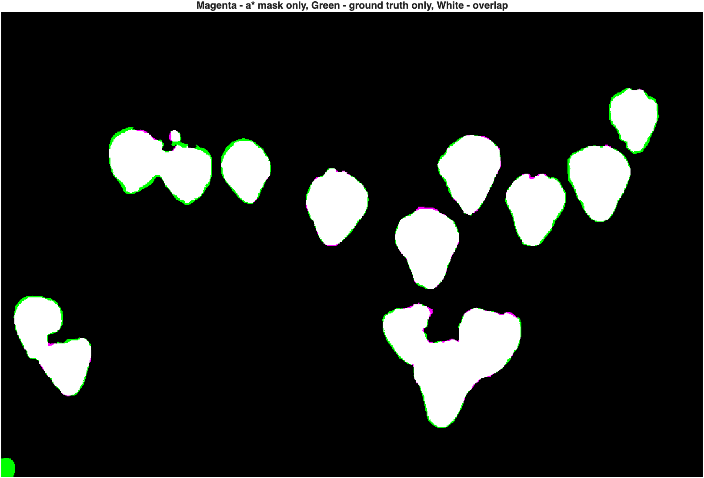{ width="550"}

>This single, reproducible threshold actually scores *higher* than every mask produced by hand-clicking in the Color Thresholder app, including the SAM result. But be clear about what this does and doesn't mean: MATLAB has **not learned what a strawberry is**. It has simply identified pixels that fall on one side of a color threshold—for *this* image.

Counting the separated regions with **`regionprops`** turns up a subtlety worth watching for:

```matlab linenums="1" title="Count blobs, then filter by size"
rp = regionprops('table',p.aWatershed,'basic');
fprintf('Blobs found: %d\n',height(rp));
fprintf('Blobs larger than 2000 px: %d\n',sum(rp.Area > 2000));
```

```matlab title="result"
Blobs found: 15
Blobs larger than 2000 px: 14
```

>Fifteen blobs, but only fourteen strawberries by eye—one is a noise speck (363 px) that survived cleanup. Counting connected components is easy; deciding which ones represent meaningful objects requires an additional criterion like an area filter, and some validation.

### Does It Scale?

Let's test the same rule on two new strawberry photos with different lighting, fruit sizes, and ripeness. We store all the images in a **structure array**, `p(1)`, `p(2)`, `p(3)`, so the same loop can process every one:

```matlab linenums="1" title="Apply the same pipeline to new images"
p(2).name = 'strawberries2.jpeg';
p(3).name = 'strawberries3.jpeg';

for n = 2:3
    p(n).rgb = imread(p(n).name);
    p(n).lab = rgb2lab(p(n).rgb);
    p(n).a = p(n).lab(:,:,2);
    p(n).aNorm = rescale(p(n).a);
    [p(n).aLevel,p(n).otsuEffectiveness] = graythresh(p(n).aNorm);

    aMin = min(p(n).a,[],'all');
    aMax = max(p(n).a,[],'all');
    p(n).aThresh = p(n).aLevel*(aMax-aMin) + aMin;

    p(n).aMaskNorm = imbinarize(p(n).aNorm,p(n).aLevel);
end
```

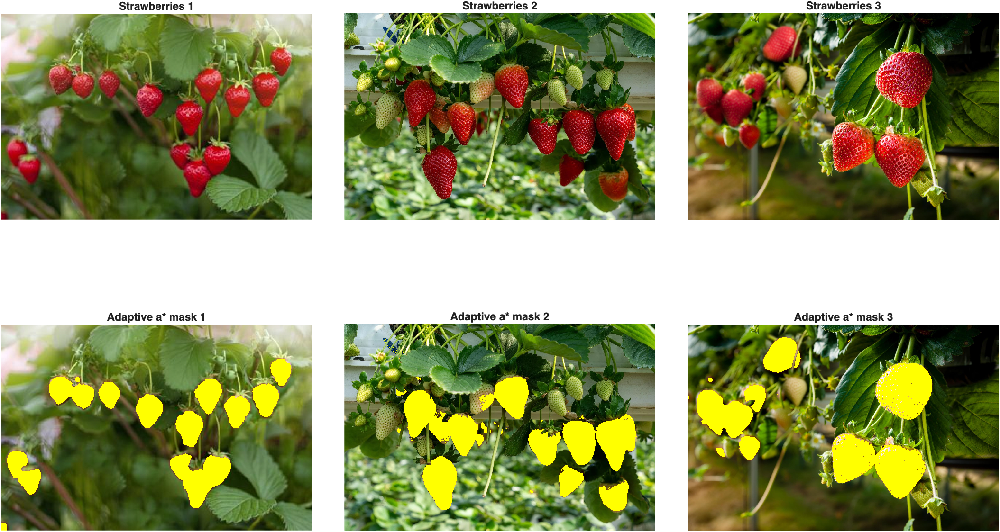{ width="650"}

>The approach identifies the **ripe red** fruit, not every object that happens to be a strawberry—notice the pale, unripe berries in images 2 and 3 are correctly left unmasked, since they blend with the foliage in the a\* channel. That's not an algorithmic mistake; it reveals what the rule actually means: we didn't build a general "strawberry detector." We built a detector for pixels that are relatively red-ward *within each image*.

### Breaking Our Own Method on Purpose

Now for the real test: the color-illusion strawberries. They look red to your eye, but their pixel data is strongly shifted away from red. Ideally, our "find red pixels" rule should find nothing here.

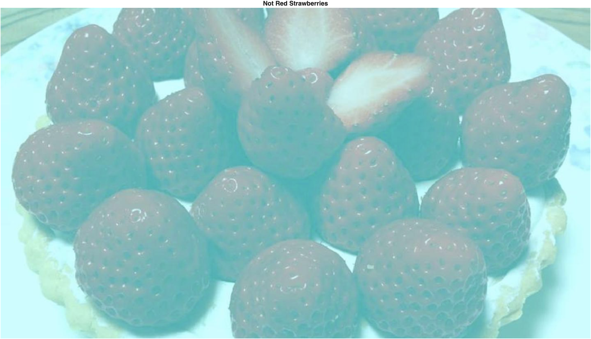{ width="400"}

First, a simple sanity check in plain RGB terms:

```matlab linenums="1" title="Check for true red pixels"
R = p(4).rgb(:,:,1);
G = p(4).rgb(:,:,2);
B = p(4).rgb(:,:,3);
redDominantFraction = mean(R > G & R > B,'all');
fprintf('Pixels where red is the strongest RGB channel: %.1f%%\n',100*redDominantFraction);
```

```matlab title="result"
Pixels where red is the strongest RGB channel: 0.0%
```

Zero percent. Now let's run the exact same adaptive a\*-threshold pipeline anyway:

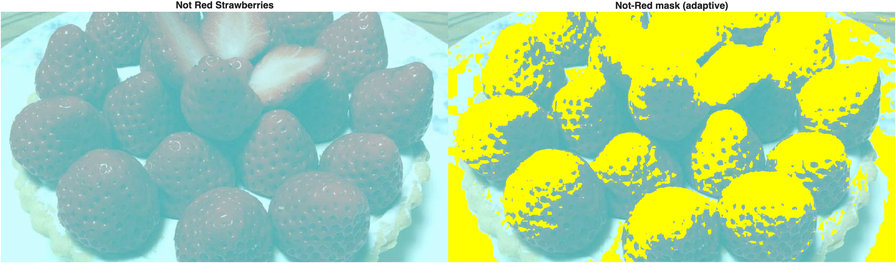{ width="650"}

>That's unexpected—we get a substantial mask even though there is reportedly no red in this image, and it only captures parts of each strawberry rather than the whole thing. So what's going on?

Plotting the raw a\* histograms for all four images side by side with their Otsu thresholds marked tells the story:

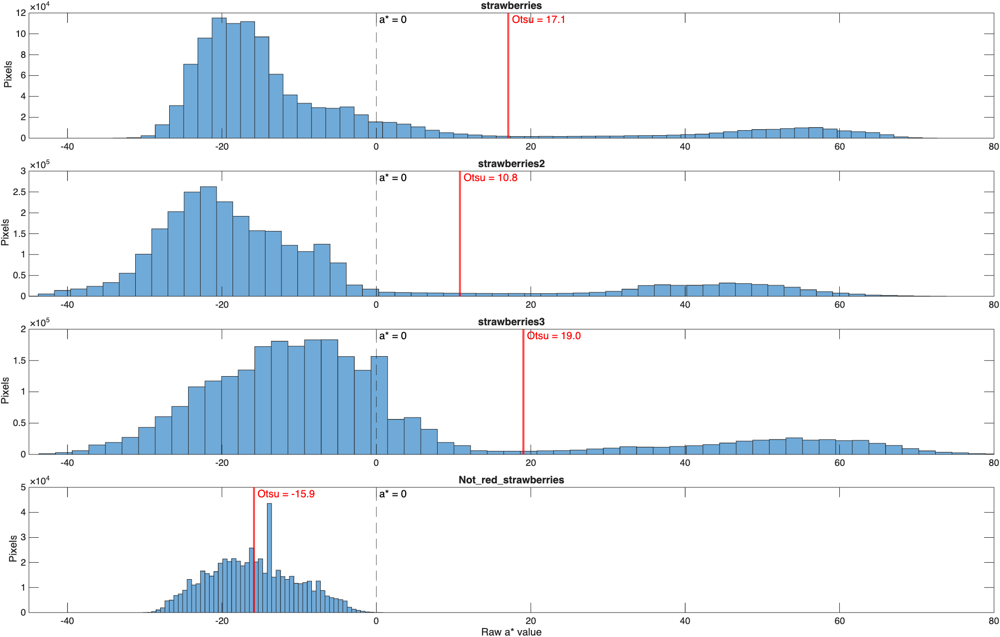{ width="650"}

```matlab title="result"
Original strawberry a* range: -35.4 to 74.3
"Not red" image a* range: -31.7 to 2.5
```

>The three real strawberry photos all have clearly bimodal a\* distributions with **positive** Otsu thresholds. The not-red image has a unimodal distribution sitting almost entirely on the green side of zero, with a **negative** threshold (-15.9). Otsu doesn't know what red is, and it doesn't know what a strawberry is—it just finds the best mathematical split in whatever data it's given, whether or not two meaningful classes actually exist. Worse, because we rescale each image independently with `rescale`, a normalized value of 0.8 doesn't represent the same physical color in two different photographs.

To see the difference concretely, compare the adaptive, per-image threshold against a **fixed** threshold carried over from the first (real) strawberry image:

```matlab linenums="1" title="Adaptive versus fixed threshold"
fixedAThresh = p(1).aThresh; % the raw a* threshold learned from strawberries.png
p(4).fixedMask = p(4).a > fixedAThresh;
fprintf('Pixels in the fixed-threshold mask: %d\n', sum(p(4).fixedMask(:)));
```

```matlab title="result"
Pixels in the fixed-threshold mask: 0
```

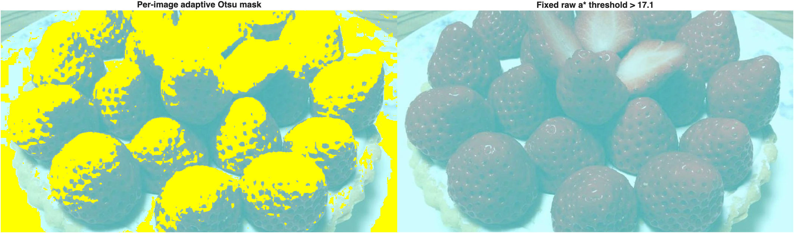{ width="650"}

>Zero pixels. The two approaches answer genuinely different questions: **adaptive Otsu after per-image rescaling** finds the higher-a\* group *relative to each individual image*, while a **fixed raw threshold** applies the same absolute color criterion to every image—and is far less forgiving of illusions, lighting shifts, or camera differences. Neither is automatically "better"; you have to decide which behavior you actually want, and validate that choice on more than one image.

### What Did We Actually Learn?

- A segmentation algorithm finds **numerical classes**, not semantic objects.
- Reproducible code is not necessarily generalizable code.
- Per-image normalization is useful for adaptive segmentation, but it removes the absolute meaning of the original channel values.
- A threshold should be validated on images beyond the one used to develop it.
- Area cutoffs and similar parameters can depend on acquisition scale and resolution.

A segmentation algorithm will usually give you an answer if you ask it a numerical question. Your job is to make sure the numerical question corresponds to the physical question you actually care about.

## Segmenting Multiple Colors at Once

A single a\*-channel threshold works nicely for two colors. But what about an image with **six** distinct candy colors, plus a non-uniform table?

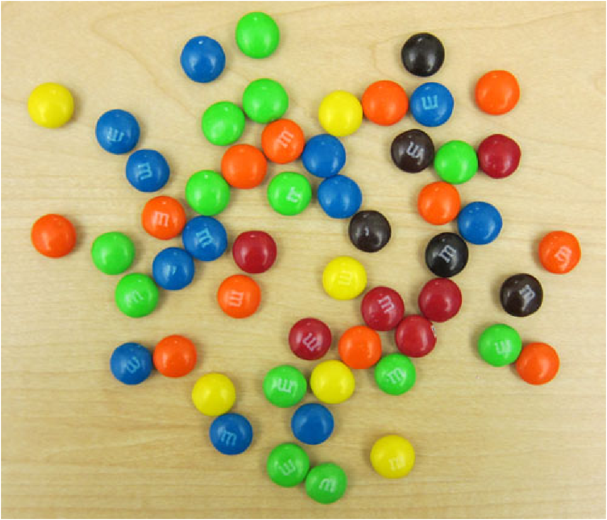{ width="500"}

```matlab linenums="1" title="Convert to L*a*b* and inspect the channels"
p.rgb = imread('https://blogs.mathworks.com/images/steve/2010/mms.jpg');
p.lab = rgb2lab(p.rgb);

tiledlayout(2,3,"TileSpacing","tight")
titles = ["L (lightness)", "a (green-red)", "b (yellow-blue)"];
for n=1:3
    nexttile(n);
    imshow(p.lab(:,:,n),[])
    title(titles(n));

    nexttile(n+3)
    histogram(p.lab(:,:,n))
end
```

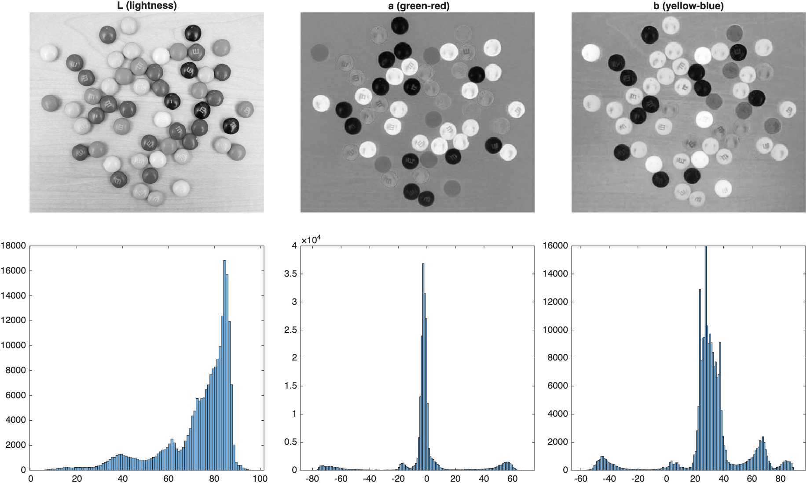{ width="650"}

>The interiors of many candies look fairly uniform in a\* and b\*, but some colors separate more clearly along one axis than the other—and both histograms show several distinct groups of values, not just two. A single threshold won't cut it here. We'll try two strategies: treating a\* and b\* **independently**, and treating a pixel's color as a single **point** in the combined a\*b\* plane.

### Method 1: Multilevel Thresholding

**`multithresh`** generalizes Otsu's method to find several thresholds at once. Three thresholds divide a channel into four value ranges:

```matlab linenums="1" title="Multi-level threshold the a* channel"
a.plane = p.lab(:,:,2);
a.thresh = multithresh(a.plane,3) % three thresholds -> four classes
```

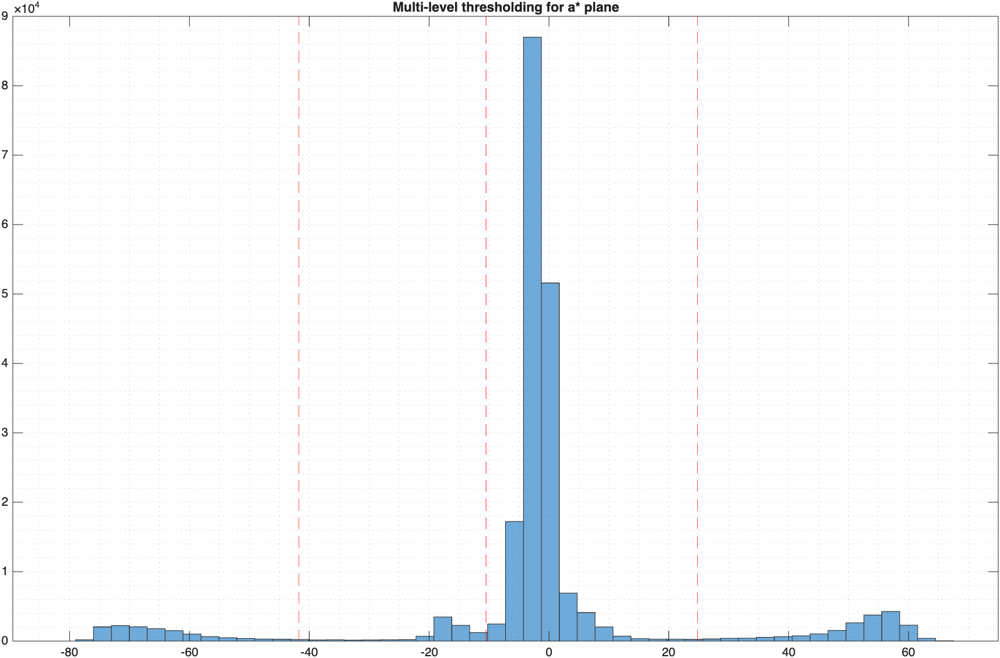{ width="550"}

**`imquantize`** then assigns every pixel to one of those four ranges, producing a **class-label image**:

```matlab linenums="1" title="Convert ranges into class labels"
a.label = imquantize(a.plane,a.thresh);
```

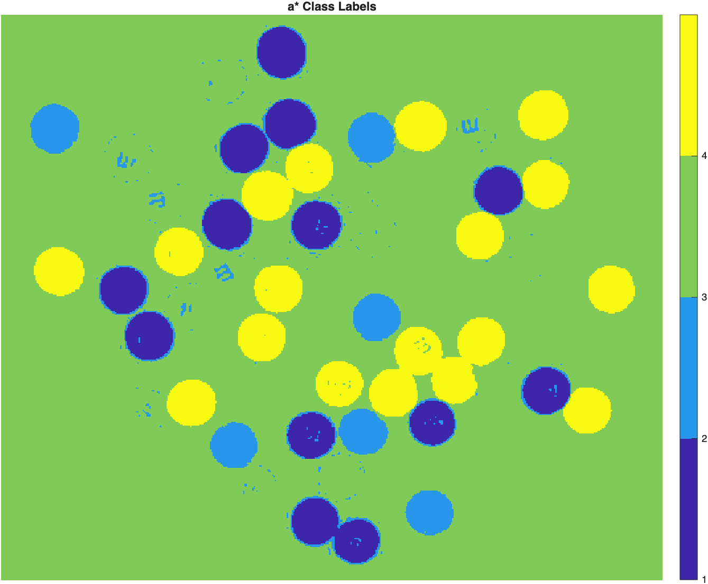{ width="550"}

>Each integer in `a.label` tells us *which a\* range* a pixel belongs to—not which object. Two candies on opposite sides of the image with similar a\* values would get the same label. The colors in this display come from a lookup table used purely to distinguish the four numeric classes; a green-looking region here doesn't mean those pixels are physically green in the original image.

In this image, the table happens to occupy more pixels than any single candy color—a convenient, image-specific **heuristic** for identifying the background:

```matlab linenums="1" title="Identify the background by area"
rpA = regionprops('table',a.label,'area');
[~,a.background] = max(rpA.Area); % the label with the most total area

a.mask = a.label ~= a.background; % everything that is NOT background
a.mask = bwareaopen(a.mask,250);
a.mask = imclose(a.mask,strel("diamond",1));
```

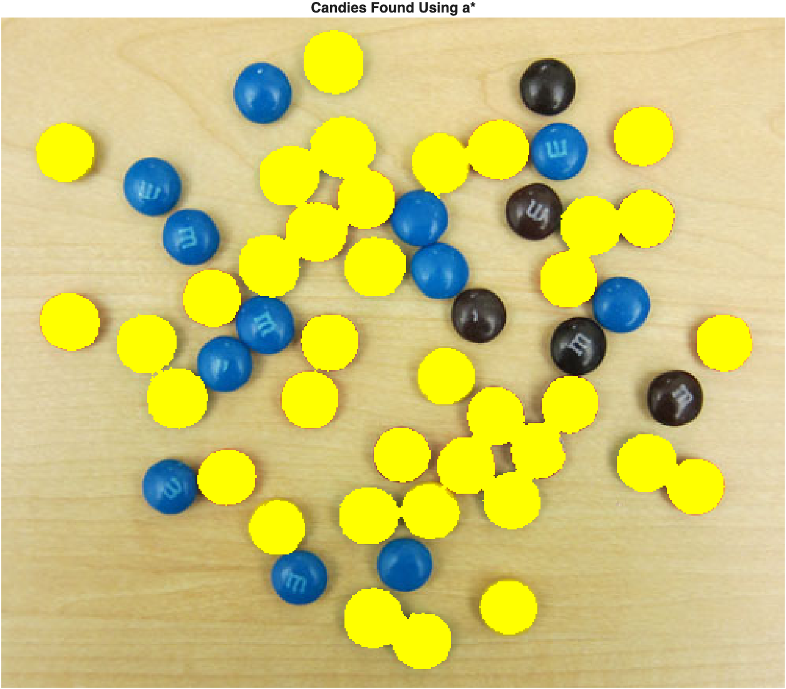{ width="550"}

>The a\* channel captures most candy colors, but misses the blue and brown candies—they don't stand out from the table along the green–red axis. Repeating the identical process on the **b\*** channel (blue ↔ yellow) instead:

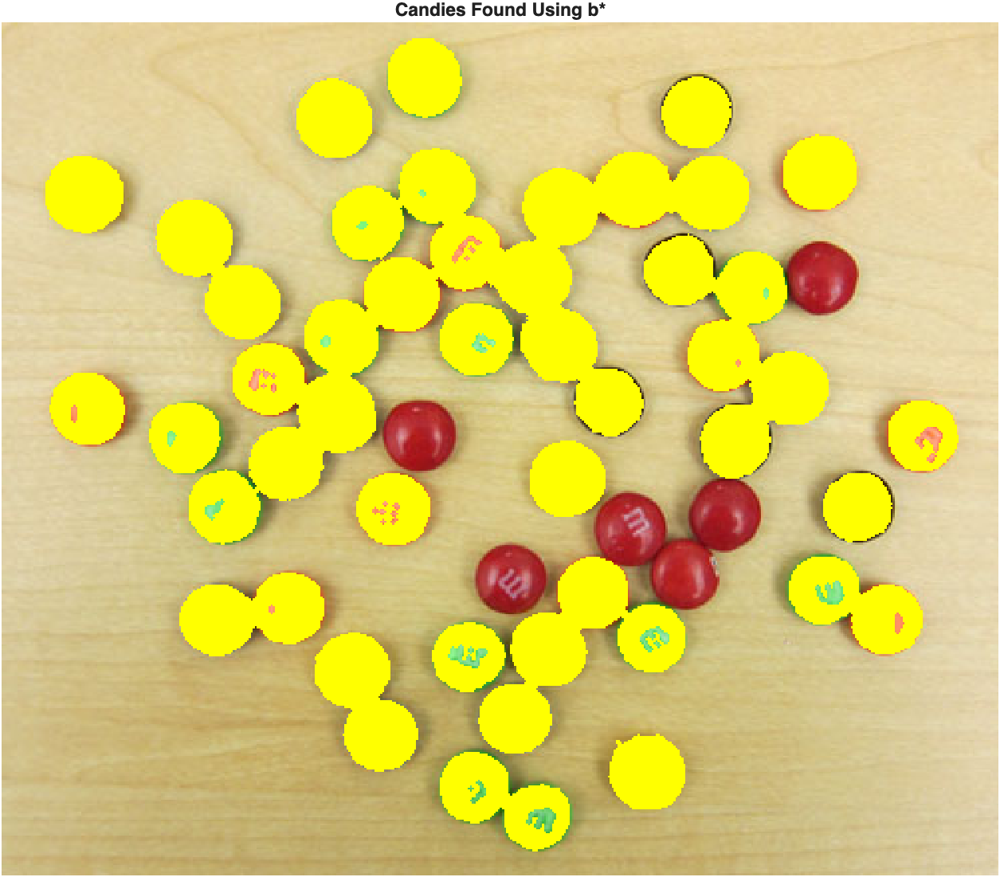{ width="550"}

>The b\* channel finds the colors that a\* missed, but it in turn struggles with the reds. Each channel describes a different color direction, so a color that blends into the table along one axis can be much easier to separate along the other.

Combining the two masks with a logical OR picks up the best of both:

```matlab linenums="1" title="Combine, dilate, and separate"
p.abMask = a.mask | b.mask;
p.abMask = imdilate(p.abMask,strel("diamond",1)); % slightly expand the mask
p.abMask = mmGetWatershed(p.abMask,5);
```

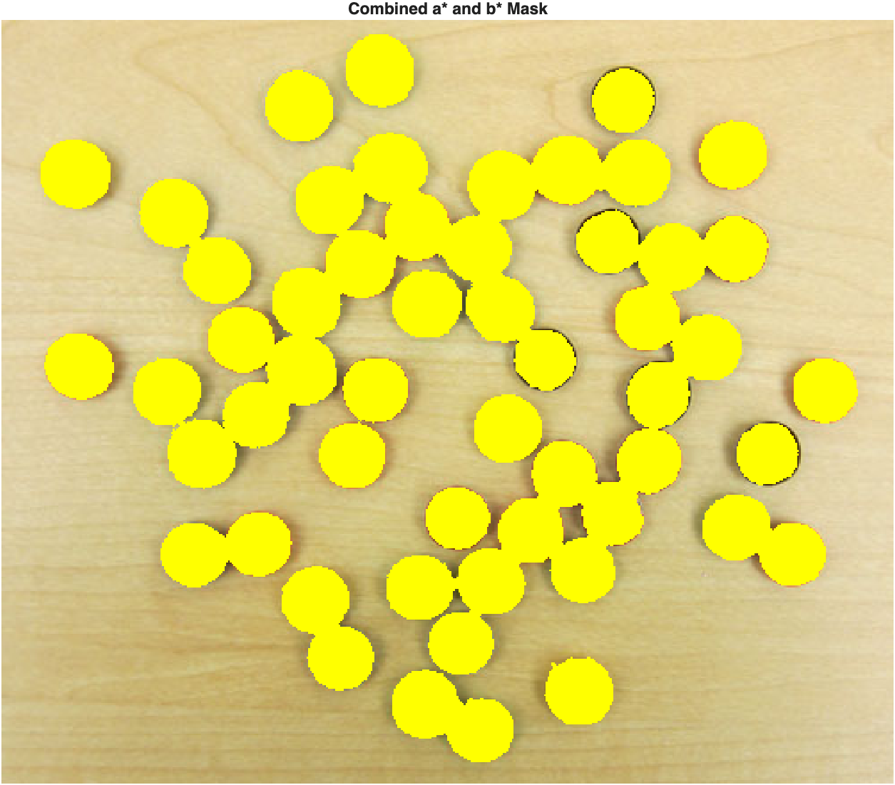{ width="550"}

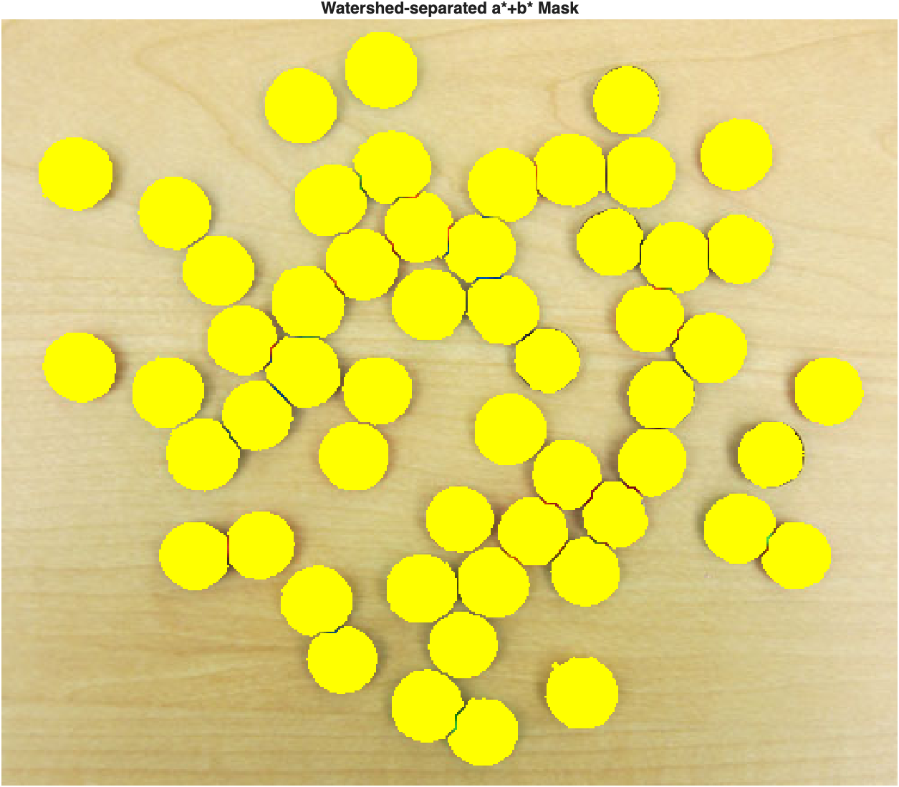{ width="550"}

```matlab title="result"
Number of candies found by Method 1: 54
```

>**What's the limitation?** We're still treating a\* and b\* **independently**. But a color is really described by the *combination* of both coordinates at once—which suggests a different idea: instead of asking where a pixel falls on one axis at a time, what if we ask where it falls in the entire a\*b\* plane?

### Method 2: K-Means Clustering in the a\*b\* Plane

Every pixel has two color coordinates, $(a^*, b^*)$, so it can be plotted as a single point in a two-dimensional color space:

```matlab linenums="1" title="Visualize pixels in a*b* space"
p.ab = p.lab(:,:,2:3);
abPoints = reshape(p.ab,[],2); % one row per pixel
sample = 1:20:size(abPoints,1); % plot every 20th pixel

scatter(abPoints(sample,1),abPoints(sample,2),6,"filled")
xlabel("a*"); ylabel("b*")
title("Pixels in a*b* Color Space")
axis equal
```

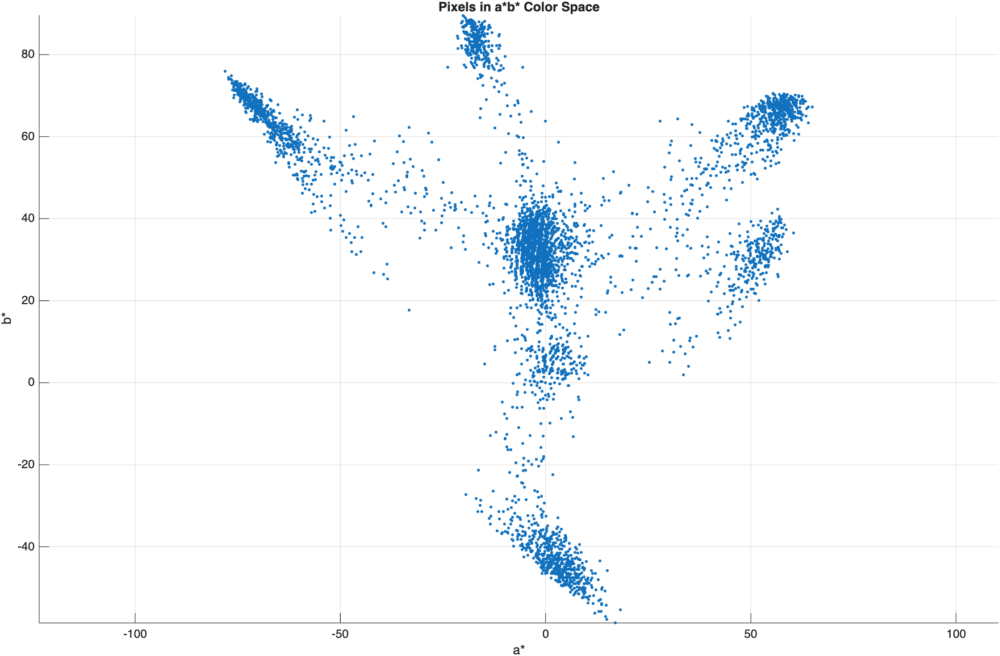{ width="500"}

>Distinct arms radiate outward from a dense central cluster (the table). If groups of similarly colored pixels form clusters like this, we can ask the computer to separate them automatically with **k-means clustering**.

K-means repeatedly places cluster centers, assigns each pixel to its nearest center, and moves the centers toward their assigned pixels, until the assignments stop changing. It does **not** choose the number of clusters for you—you have to pick that in advance. There are six visible candy colors, but the table's lighting varies enough that it tends to split across more than one cluster, so we ask for eight:

```matlab linenums="1" title="Cluster pixels by color"
p.ab = im2single(p.ab); % imsegkmeans expects single or double
nColors = 8;
p.kLabel = imsegkmeans(p.ab,nColors,'NumAttempts',3); % try several starting points, keep the best
```

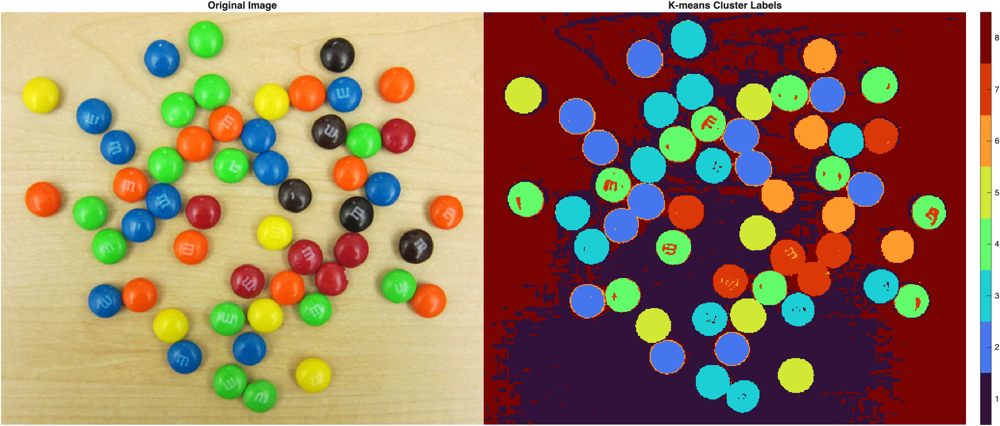{ width="650"}

>Each candy color is largely assigned to its own distinct cluster, and the table—whose appearance varies across the image—is split across more than one. Cluster numbers are **arbitrary**: cluster 4 doesn't inherently mean "yellow," it just means "the pixels k-means happened to group together as cluster 4" in this particular run.

The same area heuristic used for the M&Ms' a\* classes also works for identifying the background clusters here, since the table again occupies the most total area, split across two clusters:

```matlab linenums="1" title="Identify background clusters, then build a mask"
rp = regionprops('table',p.kLabel,'Area');
[~,idx] = maxk(rp.Area,2); % the two largest-area clusters

p.kMask = ~ismember(p.kLabel,idx); % true for every cluster EXCEPT the two largest
```

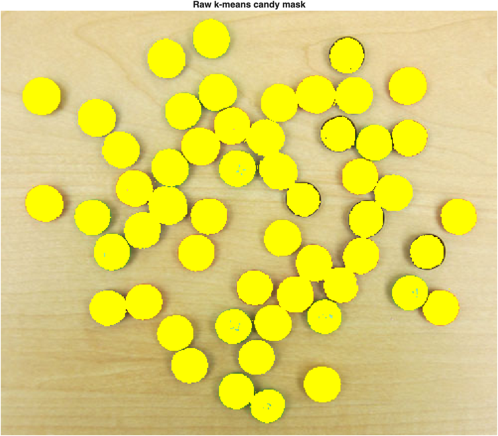{ width="550"}

```matlab linenums="1" title="Clean the mask"
p.kMask = imfill(p.kMask,'holes');
p.kMask = bwareaopen(p.kMask,200);
p.kMask = bwmorph(p.kMask,'thicken');
p.kMask = mmGetWatershed(p.kMask,5);
```

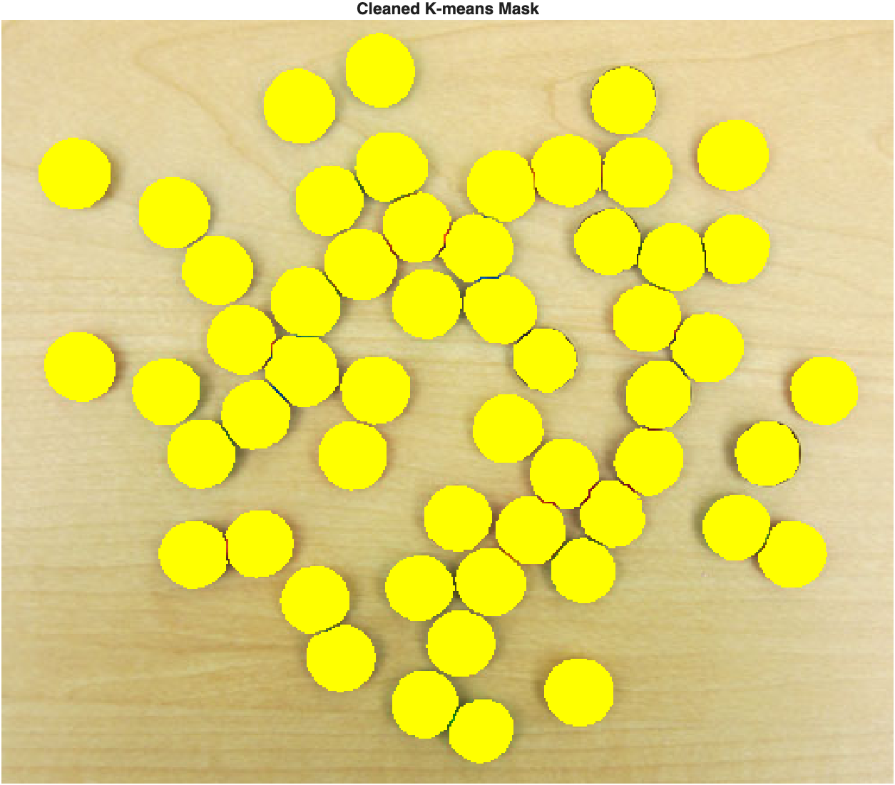{ width="550"}

>Just like the a\*-plane mask earlier, the raw cluster-based mask has small gaps and noise around the reflective highlights on each candy, which the usual `imfill`/`bwareaopen`/`bwmorph` cleanup takes care of.

```matlab title="result"
Number of candies found by Method 2 (k-means): 54
```

Finally, we can identify the dominant cluster *inside* each separated candy using the **mode** of its pixel labels:

```matlab linenums="1" title="Label each candy with its dominant cluster"
rp = regionprops('table',p.kMask,p.kLabel,["Centroid","Area","PixelValues"]);
rp.Label = cellfun(@mode,rp.PixelValues); % the most common cluster label in each candy
```

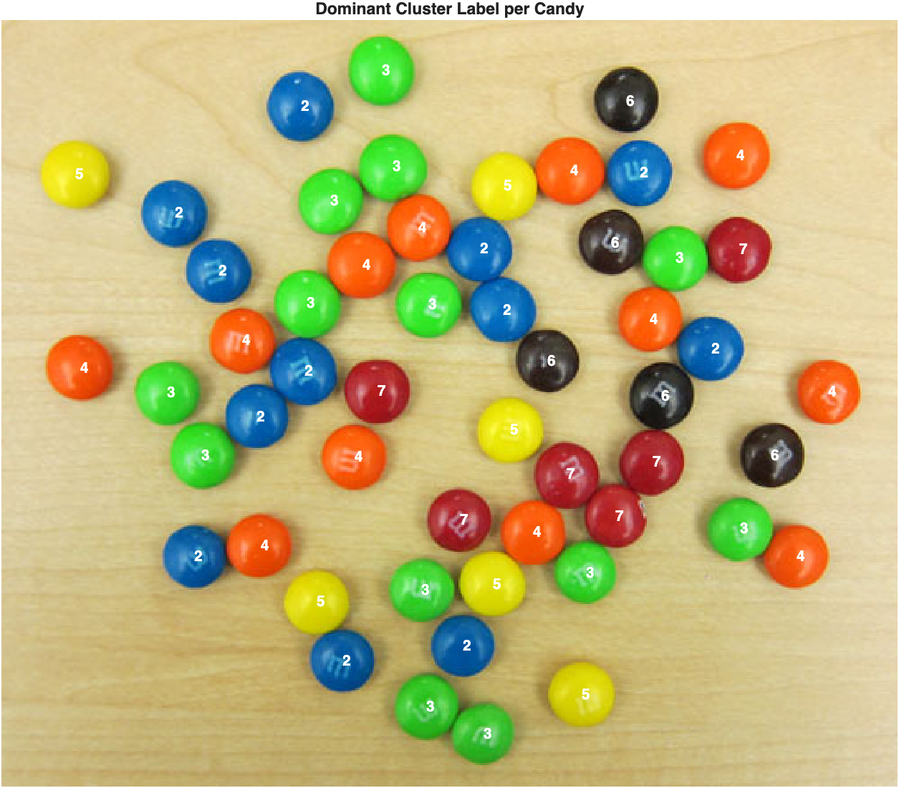{ width="650"}

>Candies with the same real-world color generally end up with the same cluster number—but that number is still just an arbitrary label. To make the result readable, we can map those numbers to actual color names for this particular run:

```matlab linenums="1" title="Map cluster numbers to color names"
rp.Color = categorical(rp.Label,2:7,{'blue','green','orange','yellow','brown','red'});
```

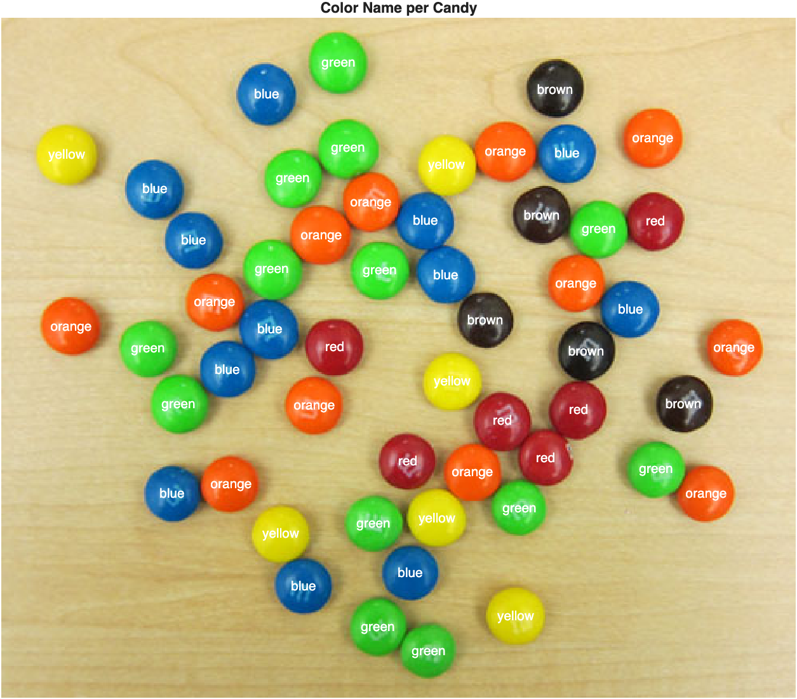{ width="650"}

>Every label matches its candy's real color—k-means found the same underlying color groups that a human would, even though it has no concept of "red" or "blue." Note that the mapping from cluster numbers to color names (`2:7` → `blue, green, ...`) is specific to *this* clustering run; a different image, or even the same image clustered again, could reorder the cluster numbers.

### Comparing the Two Methods

| Method | How it treats color | Strength | Limitation |
| --- | --- | --- | --- |
| Multilevel thresholding | Separates a\* and b\* independently | Simple and easy to inspect | Ignores the joint relationship between the two color coordinates |
| K-means | Treats each pixel as a point in a\*b\* space | Uses both color coordinates at once | Requires choosing the number of clusters; produces arbitrary cluster numbers |

Thresholding asks: *where does this pixel fall along one axis?* K-means asks: *which cluster center is this pixel closest to, in two-dimensional color space?* That's why k-means tends to shine when several colors need to be separated at the same time.

## Challenge

??? question "How well do the two M&M methods actually agree?"

    === "Question"

        Both Method 1 (combined a\*/b\* thresholds) and Method 2 (k-means) produced a final, watershed-separated candy mask—`p.abMask` and `p.kMask`. Without a hand-drawn ground truth for this image, how could you still get a sense of how much the two methods agree with *each other*? Try it, and also compare how many candies each one found.

    === "Answer"

        The same **Jaccard** and **Dice** coefficients used earlier to compare against a ground truth work just as well to compare two masks against each other:

        ```matlab linenums="1" title="Compare Method 1 and Method 2 directly"
        m1 = p.abMask > 0;
        m2 = p.kMask > 0;

        fprintf('Jaccard: %.3f\n', jaccard(m1,m2));
        fprintf('Dice:    %.3f\n', dice(m1,m2));
        ```

        ```matlab title="result"
        Jaccard: 0.956
        Dice:    0.978
        ```

        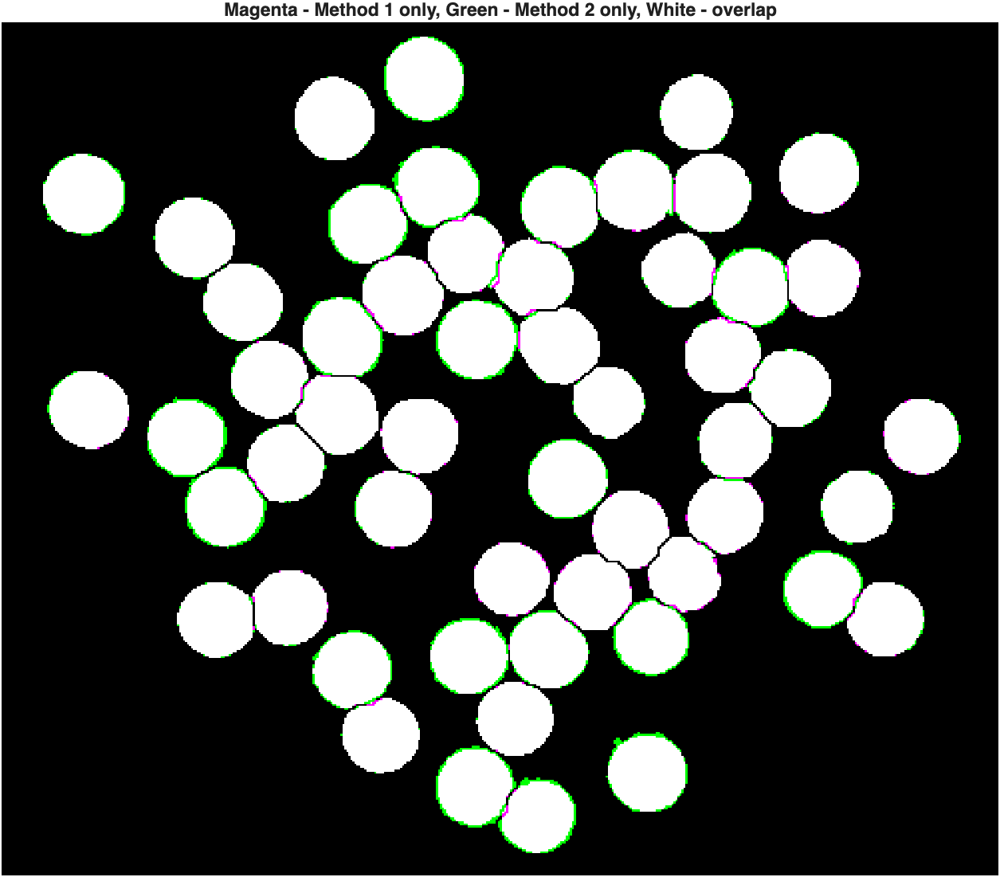{ width="550"}

        Both methods also found exactly **54** candies. High agreement between two very different approaches—one that treats color axes independently, one that clusters in a joint color space—is a reassuring sign that both are picking up on a real, consistent signal in the image rather than an artifact of either method.

Congratulations, you have made it to the end! 🍓
