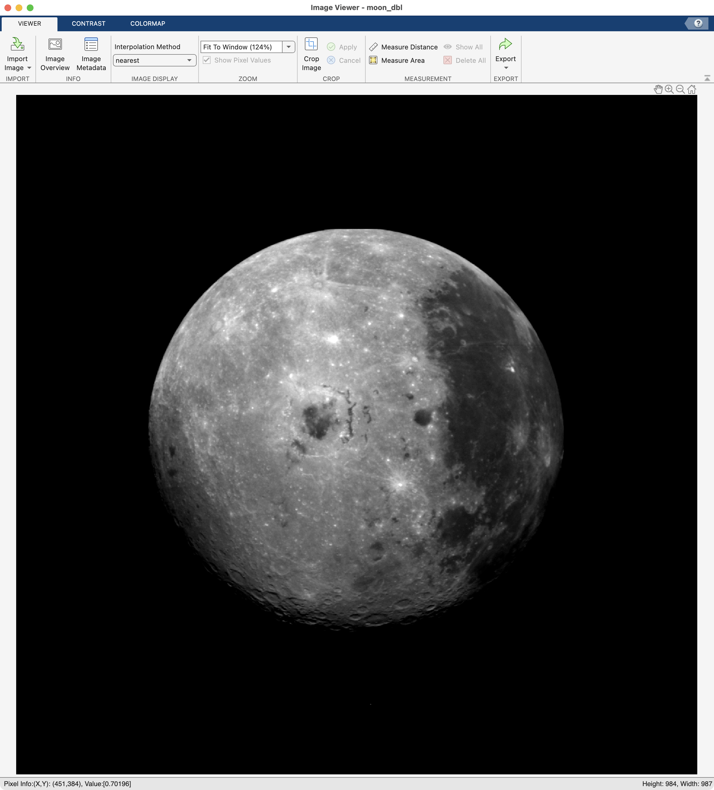

# Image Enhancement

!!! abstract "like snapchat or instagram filtering, but for work"

## Overview

📸 Image enhancement is the process of adjusting digital images to improve their appearance or to prepare for further image analysis. For example, you can enhance contrast, remove noise, sharpen, or brighten an image.

In this module, we explore low level image processing: displaying an image's histograms and modifying the image's pixel intensities, both globally and locally.

### Learning Objectives

After completing this module, you should be able to:

- Display the histogram of an image
- Use a histogram to determine whether an image is properly exposed
- Adjust contrast by manipulating the image's histogram
- Describe how neighborhood processing works
- Use filters to adjust an image's appearance

### Relevant Documentation

- [image filtering](https://www.mathworks.com/help/images/linear-filtering.html')

- [contrast adjustment](https://www.mathworks.com/help/images/contrast-adjustment.html')

- [neighbor operations](https://www.mathworks.com/help/images/sliding-neighborhood-operations.html')

### Important Functions you should know

- [imhist](https://www.mathworks.com/help/images/ref/imhist.html'): Histogram of image data

- [imcomplement](https://www.mathworks.com/help/images/ref/imcomplement.html'): Complement image (like a digital negative)

- [imadjust](https://www.mathworks.com/help/images/ref/imadjust.html'): Adjust image intensity values or colormap by adjusting pixel distributions

- [histeq](https://www.mathworks.com/help/images/ref/histeq.html'): Enhance contrast using histogram equalization

- [adapthisteq](https://www.mathworks.com/help/images/ref/adapthisteq.html'): Contrast-limited adaptive histogram equalization (CLAHE)

### Terminology you should know

- **Histogram**: a graphical representation of the distribution of pixel intensities.  

- **Intensity Transformation**: altering an image by adjusting the pixel values (intensity)

- **Complement**: the digital negative of an image

- **Neighborhood Processing**: modifying a single pixel at a time based on the intensities of its neighboring pixels.
- **Kernel**: a small matrix used in neighboring processing to modify the values of single pixels ([wikipedia link](https://en.wikipedia.org/wiki/Kernel_(image_processing)))

## Histograms

An image histogram is a graphical representation of the distribution of pixel intensities in a given image. Histograms on their own can give you useful information about your image.

Consider the following three images of the same scene:

{ width="450"}

>**LEFT PANEL**. In the underexposed image, the distribution of pixel intensity is shifted to the left, meaning most pixels have a very low intensity. **MIDDLE PANEL** In the correct exposure, the pixel intensities are distributed through the entire dynamic range of the image, meaning there is a nice distribution of pixel intensities throughout the image. **RIGHT PANEL.** In the overexposed image, the distribution of pixel intensities is shifted to the right, meaning more pixels have higher intensities (and very few have low intensities).

---

### Displaying the Histogram

The function **`imhist`** automatically generates a histogram from an image and plots the histogram along with a grayscale bar. Here we use **`subplot`**, **`imshow`**, and **`imhist`** functions to display the image and its histogram side by side. In this example, we need to use **`subplot`** to tile the figure because **`nexttile`** doesn't work nicely with **`imhist`**. (The folks at MATLAB tell me they are working on it, but that was a few years ago now).

```matlab linenums="1" title="Display Histogram of moon2"
moon2 = imread('https://saldenest.s3.amazonaws.com/MATLAB_images/moon2.tif'); % read image from a secret, remote location

rows = 1; % set the number of rows needed
cols = 2; % set the number of columns needed

subplot(rows,cols,1); % create the first tile
imshow(moon2); % display the moon

subplot(rows, cols,2); % create the second tile
imhist(moon2); % creates the histogram plot
ylim([0 5000]); % zoom in on the y-axis to better display the shape of the histogram
```

{ width="550"}

>**The Moon and its Histogram. Left.** Image of the dark side of the moon. **Right.** Histogram of the moon image. X-axis: pixel count. Y-axis: frequency. Gradient bar along the x-axis indicates mapped shade of gray that corresponds to the pixel intensity. Zero is black, 255 is white. Note: we have modified the default display of the histogram by capping the y-limits at 5000. The large amount of black (or zero) pixels completely overshadowed the rest of the histogram (see as the tallest bin on the left side of the histogram )

## Image Contrast

The appearance of an image can be markedly altered simply by adjusting the distribution of pixel (intensity) values. There are many tools in MATLAB that can remap intensity values.

### Manually Adjust Contrast

You can use the **`imageViewer`** app to manually adjust contrast. First, let's open the 'moon' image with **`imtool`**.

```matlab
imageViewer(moon2)
```

<!-- { width="450"} -->

Next, in the imageViewer app, click on the contrast tab to bring up the contrast toolbar.

{ width="450"}

Click on the "Interative Histogram" button and you should see the following:

{ width="450"}

>Now we have an interactive histogram displayed below the image of the moon. Although not easily seen, there are gray bars in this histogram. The most obvious bar is the one on the far left that represents all of the zeros in the image. The rest of the bars are little black bumps at the bottom of the histogram. The reason that the histogram looks like this is that the zero pixels represent more than half of all of the pixels in the image and the frequency of the pixels larger than 0 is dwarfed in comparison.

Overlaid atop the histogram is a white box bookended by two blue handles. This white rectangle is the "window" that is referred to in the "Window Bounds" section of the contrast toolbar.

To change the distribution of pixel intensities, you drag the blue handles. Notice as you do so that the Min, Max, Width and Center values in the Window Bounds section of the toolbar change. As you move the handles closer together, you are making the width of the window narrower, and vice versa. You are also changing the distribution of pixel intensities so that they fall inside that window. Any intensities outside of the window are clipped either to the minimum or maximum intensity (black or white in this case).

For example, here we have dragged the right blue handle to the left:

{ width="450"}

>Our window has now changed to have a width of 128 and a center of 64. Any values greater than 128 are now treated as max intensities, which is why the moon looks so washed out and overexposed.

If you hover over the middle of the histogram window (white box bookended by the blue handles), your cursor will turn into a 4-way arrow and you can drag the  window to the left or right. Try it now and drag the window over to the right side of the histogram so that the maximum intensity is 255 and the minimum intensity is 128.

??? question "What will happen to the image if you drag the histogram window to the right?"

    The moon will appear much dimmer as all pixels that fall below 128 will be clipped to black

    { width="450"}

If you don't like the changes, simple click on the "Undo Changes" button and the window will be restored to its original width and the image will look like when it was originally loaded.

### Programmatically Adjust Contrast

Instead of playing around with histogram windows to manually adjust contrast, you can apply functions to images that automatically adjust the contrast for you.

#### Linear Contrast

One way to adjust the contrast is linear scale (stretch) the distribution of pixel intensities so that they cover the full dynamic range of the image. This basically means that the brightest pixels in the adjusted image will have a value of 255 and the dimmest pixels have a value of 0.

Consider the following:

```matlab
figure;
rows = 2; cols = 2;
img = {moon2, imadjust(moon2)}; % package the original and adjusted image into a 1x2 cell
titles = ["original","adjusted"]; % 1x2 string with the titles to be used

for n=1:2
    subplot(rows, cols, n)
    imshow(img{n}) % indexes out the image on each iteration of the loop
    title(titles{n},'FontSize',18) % indexes out title on each iteration
    
    subplot(rows, cols, n+cols)
    imhist(img{n})
    xlim([-5 260]) % adjust the x-axis to just outside range of pixel intensities
    ylim([0 5e3]) % adjust y-axis to highlight the intensity frequency outside of the background
end
```

{ width="550"}

>As you can see, **`imadjust`** *s t r e t c h e s* the distribution of pixel intensities so that 1% of the data is saturated at low and high intensities of the image. If you look carefully at the histograms, there is now a vertical line at the far right of the plot. This line represents the bin of saturated pixels on the bright end. There is also a line on the left side, which represents the bin of clamped pixels on the dark end. Also notice how the adjusted moon has more patches of bright white as compared to the original.

### Non-linear Contrast

As opposed to linearly correcting the distribution, we can also adjust the distribution using a curve.

{ width="450"}

>As you can see here, a gamma setting < 1 raises the intensities of low-intensity pixels, so that the end result is an overall brighter image. By contrast, a gamma > 1 lowers the intensities of low intensity pixels, resulting in an overall dimmer image. A gamma of 1 does not affect the histogram distribution at all.

by adding some additional inputs into  

We can use **`imadjust`**  to modify the histogram in a non-linear fashion. This is known as "gamma". The gamma setting adds a curve to the histogram distribution as follows:

```matlab title="imadjust inputs for gamma"
img_adj = imadjust(img, [low_in high_in], [low_out high_out], gamma)
```
To visualize these effects, we will apply incrementing amounts of gamma to the picture of the moon, as follows:

```matlab linenums="1" title="Apply gamma to moon2"
figure;
rows = 2; cols = 3;
gamma = 0.25; % start with a gamma of 0.25

for n=1:3
    moon_adj = imadjust(moon,[],[],gamma); % notice the two empty inputs before gamma
    
    % plot image
    subplot(rows,cols,n)
    imshow(moon_adj)
    title(sprintf('Gamma - %0.2f', gamma))
    
    % plot histogram
    subplot(rows,cols,n+cols)
    imhist(moon_adj)
    xlim([-10 265])
    ylim([0 5e3]) 
    gamma = gamma+0.75; % increase gamma by 0.75 on each iteration
end
```

{ width="550"}

>Notice the asymmetrical shifting of the histogram towards the intensity poles. For gamma values below 1, the histogram distribution shifts towards the maximum pixel intensity (255). In contrast, for gammas greater than 1, the histogram distribution shifts towards zero. Also notice that the effect is primarily on the appearance of the moon. With a low Gamma setting, the moon surface loses contrast, but still has high contrast compared to space. With a high gamma setting, the shadows in on the moon's surface begin to blend in with the space.

## Image Complement

The complement is the process of inverting an image. Maximum Intensity Values are inverted to minimum intensity values and vice versa. The function **`imcomplement`** automates this process. The following code compares the complement to the original image:

```matlab linenums="1" title="Apply Complement to moon2"
figure;
rows = 2; cols = 2;
img = {moon2; imcomplement(moon2)}; % Package image and its complement into a 1X2 cell array
title_str = ["original","complement"]; 
for n=1:numel(img) % run for number of elements in img
    subplot(rows,cols,n);
    imshow(img{n}); % display image
    title(title_str{n})
    
    subplot(rows,cols,n+cols);
    imhist(img{n}); % display histogram
    xlim([-5 260]) 
    ylim([0 5e3]) % crop histogram display to better visualize distribution
end
```

{ width="550"}

>Notice how the histograms for the two images are mirrored horizontally. Also notice that the colormap is the same for both images. Here, the actual pixel intensities of the image change, not the colormap. To emphasize the reflected shapes of the histograms, we cropped the y-axis and expanded the x-axis using **`xlim`** and **`ylim`**

## Neighborhood / Block Processing

In the previous examples, we enhanced the image by globally modifying all pixel intensities across the dynamic range of the image. In some cases, such global transformations can inadvertently saturate local intensity variations and mask finer details. To avoid this, you can use Neighborhood (or Block) Processing. A Neighborhood processing operation processes a single pixel at a time, and modifies that pixel intensity based on the intensities of its neighboring pixels.

A neighborhood (or block) is simply a small piece of the entire image. Block processing, therefore, operates on a small block of the image, one block at a time, until the entire image has been processed. In this type of processing, only the center pixel in the block is actually modified and that modification is based on the immediately surrounding pixels.

Neighborhood processing is also referred to as a filter---as in applying a filter to an image.

The most common type of filtering involves averaging the adjacent pixels in a matrix and then replacing the center pixel intensity with the average intensity.

{ width="250"}

>**Illustration of an average filter**. The value of the central pixel is replaced with the average value of the surrounding 8 pixels

The process is then repeated for all pixels in the image. Ultimately, this process blurs the image, but it can also smooth out noise.

{ width="350"}

### Predefined Filters

The specific block used in a given filter is called a kernel. A kernel (or mask or filter) is essentially a small matrix populated with numbers that can be used to apply mathematical operations to the neighborhood pixels. Different kernels have different sizes and can be used to apply different types of math to the pixels.

[Predefined Filters]: http://www.mathworks.com/help/images/linear-filtering.html

[neighborhood]: http://www.mathworks.com/help/images/performing-sliding-neighborhood-operations.html#brcu16c

The function **`imsharpen`**  uses an unsharp masking filter to make edges and fine detail in the image more crisp. The function **`imgaussfilt`** blurs the image based on a gaussian distribution. The following code applies both filters to a somewhat blurry image of our moon

```matlab linenums="1" title="Apply filters to image"
blurry_moon = imread('https://saldenest.s3.amazonaws.com/MATLAB_images/Filter_blurry_moon.png'); % read image from secret remote location
tiledlayout(1,3,"TileSpacing","compact","Padding","compact")

figure

nexttile
imshow(blurry_moon) % display image
title('Original','FontSize',18)

nexttile
imshow(imsharpen(blurry_moon,"Amount",3)) % display sharpened image
title('Unsharp Mask - Amount 3','FontSize',18)

nexttile
imshow(imgaussfilt(blurry_moon,3)) % display blurred image
title('Gaussian Blur - Sigma 3','FontSize',18)
```

{ width="550"}

There are many standard filters that you can find in digital image processing software. Review the [**image filtering documentation page**](https://www.mathworks.com/help/images/linear-filtering.html') for more information.

### Contrast-limited adaptive histogram equalization

The **`adapthisteq`** function uses neighborhood processing to adjust the image histogram of an image block by block (instead of the entire image histogram at once). This process is often abbreviated as CLAHE (Contrast-limited adaptive histogram equalization)

The following code compares the image of the moon to CLAHE to imadjust:

```matlab linenums="1" title="Apply CLAHE to moon2"
figure;
rows = 2; cols = 3;
img = {moon2, adapthisteq(moon,'Distribution','uniform'), imadjust(moon)};
title_str = ["original", "adapthisteq", "imadjust"];

for n=1:cols
    subplot(rows, cols, n);
    imshow(img{n});
    title(title_str{n},'FontSize',18)
    
    subplot(rows, cols, n+cols)
    imhist(img{n})
    xlim([-5 260])
    ylim([0 5e3])
end
```

{ width="650"}

>**Comparison of imadjust to adapthisteq**. The **`imadjust`** histogram is spread to cover the entire dynamic range of the image. In contrast, the **`adapthisteq`** histogram maintains a similar distribution shape to the original image, but it has been smoothed. In the images,  local variations in the CLAHE image are greatly exaggerated, especially compared to **`imadjust`** image.

Congratulations, you have made to the end! 📸
