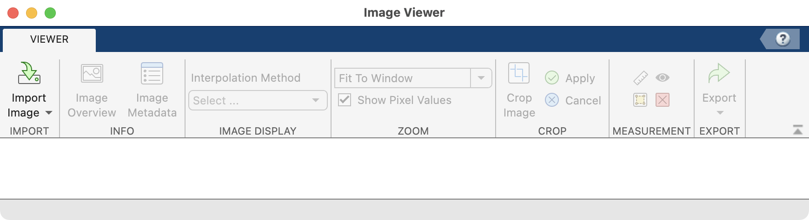
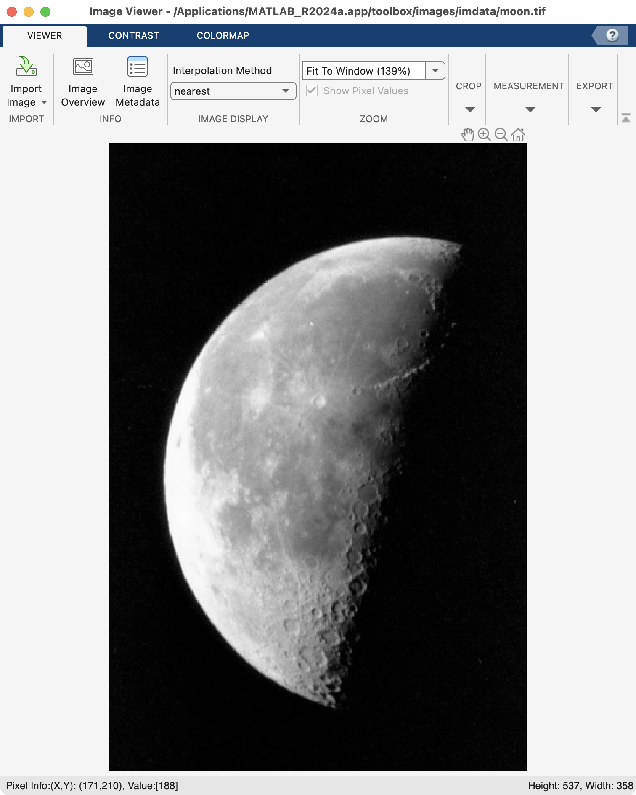
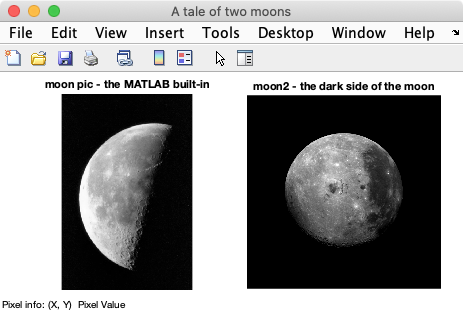
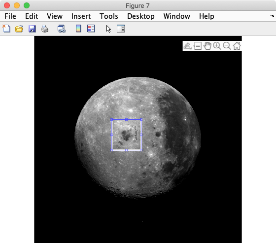
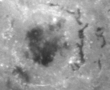
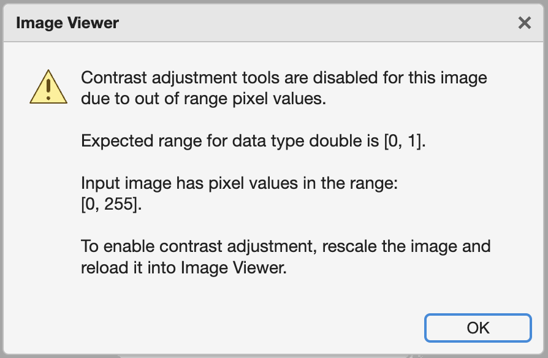
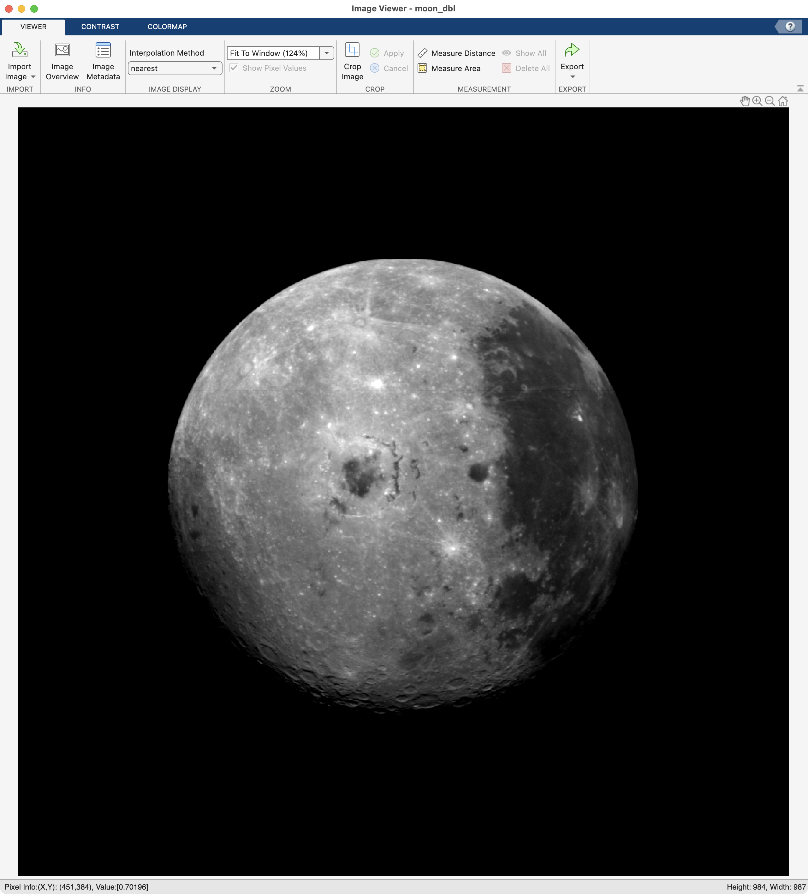

# Grayscale Images

*You know, like pictures and stuff, but with no color.*

## Overview

📰 NEWS FLASH: Images are just matrices. As such, images have elements with coordinates (rows and columns) and numeric values. The coordinates of the elements represent a location in the image, while the numeric value represents intensity (or luminance)—how bright that pixel should be. In the following example, we have two luminance values: black and white. These luminance values are stored as 1's and 0's.

![][bitmap smiley]{width=600px}

[bitmap smiley]: images/bitmap-smiley.png 

Since images are just numeric matrices, we can easily leverage the full power of MATLAB for image processing.

In this module, we will explore the properties of intensity (or grayscale) images, which are images that contain only one pixel value per image location and typically represent shades of gray or just one color.

### Things You Should Know

By the end of this module, you should be able to:

- open an image in MATLAB

- manipulate the basic properties of an image

- typecast an array so that it can be properly displayed in MATLAB

- normalize an image to improve contrast

- Define all of the [Key Terminology]

- use all of the listed [Key Functions]

- Change the colormap of a grayscale image

### Relevant MATLAB Documentation

- [MATLAB Images Overview](https://www.mathworks.com/help/matlab/graphics-images.html)

- [Image Types](https://www.mathworks.com/help/matlab/creating_plots/image-types.html)

- [Image Processing Toolbox](https://www.mathworks.com/products/image-processing.html)

- [Image Processing Toolbox Examples](https://www.mathworks.com/help/images/examples.html?s_tid=CRUX_topnav)

### Key Functions

- [**`mat2gray`**](https://www.mathworks.com/help/images/ref/mat2gray.html) - converts a numeric matrix to a grayscale image array by normalizing the pixel intensity values to range from 0 to 1. Always returns a class double. 

- [**`colormap`**](https://www.mathworks.com/help/matlab/ref/colormap.html) - sets current color map (look-up table)

- [**`double`**](https://www.mathworks.com/help/matlab/ref/double.html) - typecasts an array to a double class

- [**`uint8`**](https://www.mathworks.com/help/matlab/ref/uint8.html) - typecasts an array to an unsigned 8-bit integer class

- [**`uint16`**](https://www.mathworks.com/help/matlab/ref/uint16.html) - typecasts an array to an unsigned 16-bit integer class

#### Image Processing Toolbox Functions

*Notice that these functions start with the prefix* "im":

- [**`imageViewer`**](https://www.mathworks.com/help/images/ref/imageviewer-app.html) - image viewer app

- [**`imread`**](https://www.mathworks.com/help/matlab/ref/imread.html') - reads in image files and returns a matrix

- [**`imshow`**](https://www.mathworks.com/help/matlab/ref/imshow.html') - displays images in a figure

- [**`imshowpair`**](https://www.mathworks.com/help/images/ref/imshowpair.html') - overlays images or displays side by side to compare differences

- [**`im2double`**](https://www.mathworks.com/help/matlab/ref/im2double.html') - converts an image to double precision ranging from 0 to 1 (but without normalizing the values first)

### Key Terminology you should know

- **Pixel:** Picture element: the smallest addressable element in a rasterized, bitmapped digital image. Considered to be a point sample of an image. Has x- and y- coordinates and a discretized value to indicate intensity or color.

- **Bit depth:** the number bits used to indicate the color of a single pixel in a bitmapped image

- **Dimensions:** The height and width (in pixel count) of an image

- **Colormap / Look-up table (LUT):** A table or array that maps pixel values to color intensities. For example 0 = black, and 255 = white

- **Metadata:** included information about an image, such as its dimension, bit depth, acquisition parameters, etc.

## Reading images

You can programmatically read images into MATLAB using the function **`imread`**, which takes a file path (or URL) as an input and returns a numeric array.

For this example, we will read one of MATLAB's built-in images (moon.tif):

```matlab linenums="1" title="Read in Image"
img = imread('moon.tif');
```

…Since MATLAB already knows about the "moon.tif" image and it's location, we just have to enter the file name.

!!! warning "WARNING: Do not forget the **semi-colon** at the end of the **`imread`** command to suppress output or you will see a lot of numbers populate the command window."

After the **`imread`** function call, examine the *`img`* variable's properties in the workspace:

![][img-moon-workspace]{width=600px}

[img-moon-workspace]: images/moon-workspace-properties.png

…*`img`* is a numeric variable—an unsigned, 8-bit variable.

So, how is this an image? Read on to find out...

## Images are Matrices

Once loaded, image variables work like any other numeric matrices. For example, you can get the number of rows and columns of an image variable using the function **`size`**, as follows:

```matlab linenums="1" title="Get Dimensions"
[rows, cols] = size(img)
```

```matlab title="result"
rows =

   537

cols =

   358
```

…So we have a numeric matrix with 537 rows and 358 columns. In image terms, the width is 358 pixels and the height is 537 pixels.

You can perform math on an image matrix, just like you can with any other numeric variable. Here we calculate the maximum intensity value of the image using the function **`max`**:

```matlab linenums="1" title="Max of img"
max(img(:))
```

```matlab title="result"
ans =

  255
```

…A maximum of 255 matches the maximum potential vale of an unsigned 8-bit variable. Here we indexed *`img`* using `(:)`. This syntax ensures that you get just one value returned from **`max`**, instead of getting a maximum value from each column in the matrix.

### Challenge: Images are matrices

??? question "Question: What do you predict the minimum pixel intensity of the image to be? Use the function **`min`** to test your prediction."

      Since this image is an unsigned 8-bit variable `uint8`, the minimum possible value is `0`. You can see this in the workspace as well.

## Image Properties

Every image stores data in a hidden header field known as the image's metadata. The metadata describes the properties of the image, such as its dimensions, bit depth, acquisition parameters, etc.

The function **`imfinfo`** reads this metadata and returns a structure:

```matlab linenums="1"  title="Get metadata"
img_meta = imfinfo('moon.tif');
```

```matlab title="result"
img_meta = 

  struct with fields:

                     Filename: '/Applications/MATLAB_R2018a.app/toolbox/images/imdata/moon.tif'
                  FileModDate: '13-Apr-2015 13:23:13'
                     FileSize: 184388
                       Format: 'tif'
                FormatVersion: []
                        Width: 358
                       Height: 537
                     BitDepth: 8
                    ColorType: 'grayscale'
                    ⋮
```

…As you can see, *`img_meta`*, is a MATLAB structure with multiple fields such as, 'Filename','FileSize', 'BitDepth', 'Width', 'Height', etc. And yep, it's an 8-bit image.

!!! note "**Width** and **Height** corresponds to the number of **columns** and **rows**, respectively, in the *`img`* variable."

## Displaying images

### Built-in Image Viewer

**`imageViewer`** is the basic image viewer app that is included in the MATLAB Image Processing toolbox. (1)
{.annotate}

1. imageViewer is only recently developed app in MATLAB. The previous image viewer tool was called **`imtool`**. This tool has similar functionality to imageViewer but looks and operates a little differently. Refer to the MATLAB documentation for more information

You can launch **`imageViewer`** from the Apps tab. Click on the Image Viewer icon:

![][Image Viewer Icon]{width=75px}

[Image Viewer Icon]: images/imageViewerIcon.png

Or, you can run **`imageViewer`** from the command window. Simply type:

```matlab linenums="1" title="Launch imageViewer"
imageViewer
```

In either case, MATLAB will return a window that looks like this:

{ width="450"}

To open images, you can click on the "Import Image" icon.

Or, you can call **`imageViewer`**  from the command window and input a image file path:

```matlab linenums="1"
imageViewer('moon.tif')
```

Or, since we have have already loaded the moon image into the workspace as variable *`img`*, we can input the variable name, as follows:

```matlab linenums="1"
imageViewer(img)
```

Either way, you should see the following image in **`imageViewer`**:

{ width="400"}

…Notice that the window now has three tabs: "Viewer", "Contrast", and "Colormap".

The bottom left-hand corner of the image viewer displays a live update of pixel information:

```matlab
Pixel Info: (X,Y) intensity
```

…This information is relevant to the current pixel being pointed at by the mouse pointer. As you move the pointer around the image to point at different pixels, this info will update the X,Y coordinates and the intensity value of the pixel currently being pointed at.

The bottom right corner displays the dimensions of the image:

```matlab
Height: 537, Width: 358
```

- Height = number of rows
- Width = number of columns

#### imageViewer Tools

The **`imageViewer`** app has a variety of built-in tools that you can use to explore and modify the properties of the displayed image.

You can review the functionality of the viewer [here.](https://www.mathworks.com/help/images/interact-with-images-using-image-viewer-app.html)

Take a moment to familiarize yourself with the **imageViewer** tools and explore their operations.

#### Useful imtool Syntax

Before we move on, let's tidy up a bit. If you have opened many **`imageViewer`** windows, you can close them all with the following syntax:

```matlab linenums="1" title="Close All imageViewer Windows"
imageViewer close
```

### Image Display Function (imshow)

Often you don't always need all of the bells and whistles of the **`imageViewer`** app. When you simply want to display your image, you can use the function **`imshow`**.

```matlab linenums="1" title="Display Image"
imshow(img)
```

![][img-moon-imshow]{width=400px}

[img-moon-imshow]: images/moon_imshow.png

…Notice that the image is displayed in a normal figure window (like a plot).

#### Displaying multiple images or plots (in one figure)

**`imshow`** becomes really useful when you want to display more than one image in a single figure—or an image and a plot.

First, let's open another image. I have stored another picture on the internets for our enjoyment. As you can see in the syntax below, **`imread`** accept URLs as file locators, so this code will download the image from my cloud drive:

```matlab linenums="1" title="Import moon2 from the internets"
URL = 'https://saldenest.s3.amazonaws.com/MATLAB_images/moon2.tif';
moon2 = imread(URL);
imshow(moon2)
```

Now we have two image variables in the workspace: *`img`* and `moon2`. To display them side by side, we simply combine the use of **`tiledlayout`**, **`nexttile`**,  and **`imshow`** as follows:

```matlab linenums="1" title="Tile Images"
figure ('Name','A tale of two moons');
tiledlayout(1,2,'TileSpacing',"none",'Padding',"compact")

nexttile % first tile
imshow(img)
title('moon pic - the MATLAB built-in')

nexttile % second tile
imshow(moon2)
title('moon2 - the dark side of the moon')
impixelinfo
```

{ width="400" }

…Here the use of **`tiledlayout`** with the paired inputs of ('TileSpacing', "none", 'Padding', "compact") allowed us to minimize the spacing around the two images.

#### Interactive Display Tools (impixelinfo)

If you need a little more functionality than what is provided by **`imshow`**, you can add your own display tools (similar to the ones found in **`imageViewer`**) using the [interactive tools](https://www.mathworks.com/help/images/building-guis-with-modular-interactive-tools.html') included in the Image Processing toolbox.

For example, in the code block above, we used the function **`impixelinfo`** to add a pixel browser to the bottom left corner of the figure window so you can browse the pixel information of the image just like you could in **`imageViewer`**:

```matlab
Pixel Info(X,Y) Pixel Value
```

## Cropping Images

Cropping is just like indexing a matrix. You can **index** an image variable just like any numeric variable because an image variable *is* a numeric variable.

For this example,  we will crop the image of the dark side of the moon, *`moon2`*. Display the image using the **`imtool`** app

```matlab
imageViewer(moon2)
```

You should now see the following picture of the moon in MATLAB:

![Far Side of the moon - http://photojournal.jpl.nasa.gov/tiff/PIA00225.tif][img-moon2]{width=250px}

[img-moon2]: images/moon2.png

If you inspect the image metadata you will see that this image has different dimensions from the previous image.

![][img-moon2-attributes]{ width=300px}

[img-moon2-attributes]:images/moon2-attributes.png

…Its width and height are 987 and 984, respectively.

### Selecting x,y coordinates

In **`imageViewer`**, move the pointer around the image to orient yourself to the rows and columns of the image.

!!! note "Pixel coordinates vs ROW, COL indices"
      In the MATLAB image tools, like **`imageViewer`**, pixel coordinates are listed by their X,Y coordinates, not their ROW, COL indices. In XY coordinates, X corresponds to the column index and Y corresponds to the row index. This means that first number listed inside the parenthesis indicates the column index while the second number indicates the row index — the reverse of  MATLAB indexing. Also notice that the XY coordinate of 0,0 refers the the top left corner of the image, instead of the bottom left corner of most plots.

To convert to row, column indices, make sure that you use the X values as your columns indices and your Y values as your row indices. For example, the off-center crater in the moon image has the following row, column indices:

```matlab
crater = moon2(417:529, 384:520); % index out crate
imageViewer(crater)
```

![][img_crater]{ width=250px }

[img_crater]: images/moon2_crater.png

Similarly, you can slice out a column of image data and display using the syntax to index "all" rows, as follows:

```matlab linenums="1" title="Index out a Column of Image data"
crater_col = moon2(:,384:520)
imageViewer(crater_col)
```

![][img_crater_col]{width=50px}

[img_crater_col]: images/moon2_crater_col.png

### Crop Function

To simplify cropping, the MATLAB Imaging Toolbox includes a crop tool. The function is called **`imcrop`**. There is also a crop button in the **`imageViewer`** toolbar that does the same thing.

Here is the syntax to call the crop tool:

```matlab linenums="1" title="Crop Tool"
figure; % create an empty figure
[moon2_crop, rect] = imcrop(moon2); % crop function
imshow(moon2_crop) % show new cropped image
```

After you execute the above commands, a window will appear displaying the image *`moon2`*. Your mouse pointer will turn into cross-hairs. Drag the cross-hairs over the image to capture the part of the image you would like to crop.  Then double-click inside the box you created.

<div class="grid cards" markdown>

-   { width="300"}

-   { width="250"}

</div>

After double-clicking, a new variable will appear in the workspace called *`moon2_crop`*. This is the cropped version of *`moon2`*. Notice that crater variable has smaller dimensions than *`moon2`*.

## Common Image Classes

Images are imported into MATLAB as numeric variables. To properly display images, you need a good understanding of the range of pixels found in the image (the bit depth) and the range of values possible in the numeric class. Remember, integer classes, like **`uint8`** have a maximum value of 255. This can a little confusing when the bit depth of the image does not match the bit depth of the numeric class.

### Integer Class

**Grayscale images** are often stored as unsigned integers to save hard disk space. This means that the pixel values in these images are stored as integers and they have a set maximum value (like 255 or 4095).

The following table lists the typical integer classes used for images of different bit depths.

| MATLAB Class | bit depth | Pixel Range |  Class Range |
|  ------ | ------ | ------ | ------ |
| uint8 | 8-bit | 0-255 |  0-255 |  
| uint16 | 12-bit | 0-4095 | 0-65,535 |  
| uint16 | 16-bit | 0-65,535 |  0-65,535 |  

For example, take the *`moon2`* variable that we created using **`imread`**. As you can see in the workspace, the class of *`moon2`* is **uint8**, which likely means that it is an 8-bit image (and has a pixel range of 0-255).

Also, if you hover over the image in **`imageViewer`** you will notice that the pixel intensity varies between 0 and 255.  

!!! note "A word on Bit Depth and Numeric Classes

      In the table above, notice that we use the same numeric class, **`uint16`**, for both 12-bit and 16-bit images. While images may be captured at bit depths such as 12-bit, numeric variables can never be 12-bit due to the way computer memory is chunked into bytes (8 bits). So, you can only have a variable that is 8-bit or 16-bit and nothing in between. This can cause display issues in  MATLAB (and other image processing applications) if you don't adjust the image dynamic range to match to the numeric variable's dynamic. More on this later.

### Logical Class

The most basic raster image is a **binary** image, which is comprised of all ones or zeros pixels, (or , trues or falses). The MATLAB class used for binary images is *logical*. We can easily create a binary image by typecasting (1) into a **logical** class.
{ .annotate}

1.**Typecasting** coverts a variable from one data type to another. Typecasting is critical for the proper display of scientific images due to the way that these images are stored and (*sometimes*) improperly imported. *`moon2`*.

```matlab linenums="1" title="Typecast to logical"
binary_moon2 = logical(moon2)
imageViewer(binary_moon2)
```

As you can see by scrubbing around the imageViewer...

![][img-moon2-binary]{width=400px}

[img-moon2-binary]: images/moon2-imgVwr-binary.png

…The binary image only contains `true` or `false`. Notice that there is no contrast tab button as this function is not relevant for binary images. Also notice that the image is listed as a 'logical' DataType in the **`imageViewer`** metadata panel.

![][img-moon2-binary-info]{width=200px}

[img-moon2-binary-info]: images/moon2-binary-imgVwr-meta.png

### Floating-Point Class

MATLAB images can also be stored in floating point classes, such as **double** or **single**. This is especially useful for performing mathematical operations on images or for adjusting the dynamic range of an image to match the dynamic range of the numeric class. 

If you convert an image to a floating-point class, then all the pixel values in that image **must** range from 0 to 1 to be displayed properly in MATLAB.

| MATLAB Class | Pixel Intensity Range | Class Range |  
|  ------ | ------ | ------ |
| single | 0 - 1 | 0-2^24 |  
| double | 0 - 1 | 0-2^53 |  

You can use the MATLAB function **`double`** to typecast *`moon2`* to a floating point class as follows:

```matlab linenums="1" title="Typecast to Double"
moon2_dbl = double(moon2); 
```

…And the variable *`moon2_dbl`* is listed as a "double" class in the workspace. 

But when we try to display *`moon2_dbl`* using **`imageViewer`**:

```matlab linenums="1"
imageViewer(moon2_dbl)
```

…We are confronted with the following range warning

{ width="300"}

This warning is telling us that the range of in the *`moon2_dbl`* variable (0-255) do not match the expected range, which should be from 0-1.

If we go ahead and click "OK", then we see the following:

![][img]{width=350px}

[img]:images/moon2-double-imgVwr.png

…Hmm, the image looks like a **binary image**, but is listed as an "intensity" or grayscale image in Image Information window:

![][imgVwr_meta_dlb]{width=200px}

[imgVwr_meta_dlb]:images/moon2-double-imgVwr-meta.png 

…Also, notice that if you move the cursor around the image, you can see that the original pixel values are maintained in the image as reported in the Pixel Info display at the bottom of the window

So, the image still has a range of pixel intensities (and thus contrast), but MATLAB does not display it properly. What gives? Well, as MATLAB warned when we opened the window, a variable with a numeric class of "double" should have a range of values that fall between 0 and 1. ANY pixel values above 1 are displayed as the maximum intensity (or in this case, white).

To properly covert *`moon2`* to a **double**, you can use the MATLAB function **`im2double`** (which is included with the Image Processing toolbox).

```matlab linenums="1" title="Properly typecast to double"
moon2_dbl = im2double(moon2);
imageViewer(moon2_dbl)
```

{ width="400"}

…and now we see the moon in its all its glory, properly displayed in 256 shades of gray. We also have the restoration of the Contrast tab at the top of the window. Notice that the pixel values in the Pixel Info display are now displayed as fractions that all fall between 0.00 and 1.00.

## Saving Images

Saving an image to your hard drive is fairly straightforward: use the functions **`imwrite`** and **`uiputfile`**.

The following code prompts you to save the image of the moon to your computer. Choose a folder (such as the MATLAB folder) when prompted to save the image.

```matlab
[file_name, folder_name] = uiputfile('moon2.tif')
image_path = fullfile(folder_name,file_name)
imwrite(moon2, image_path)
```

Notice that **`uiputfile`** allows you to create a file name and location for the file. Otherwise the syntax is very similar to reading files.

**END**

Congratulations, you've made it to the end. Way to hang in there. 📰
