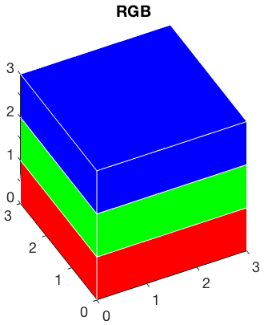
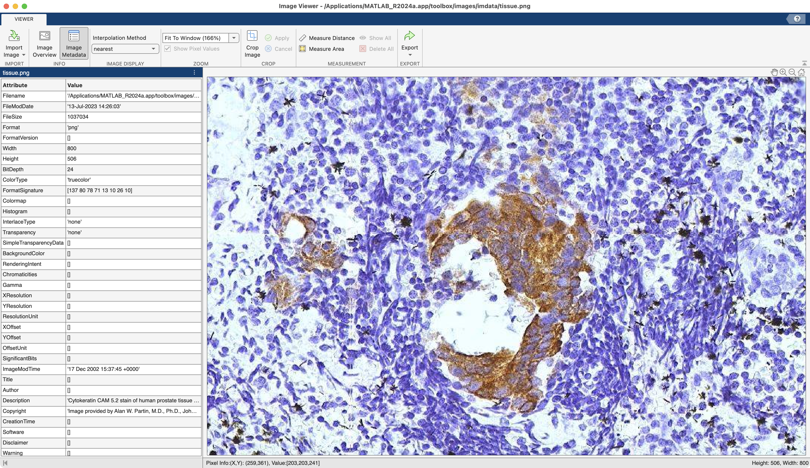
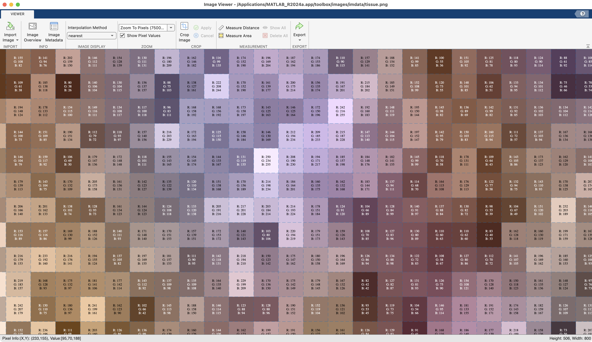
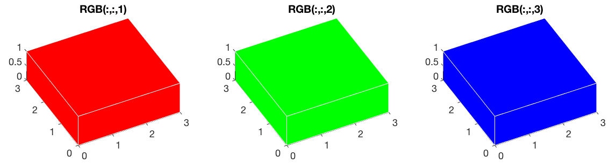
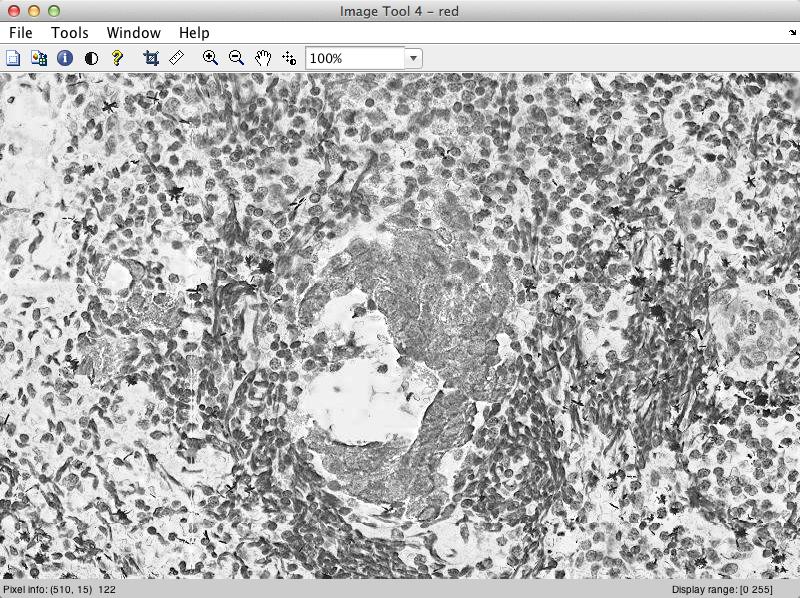
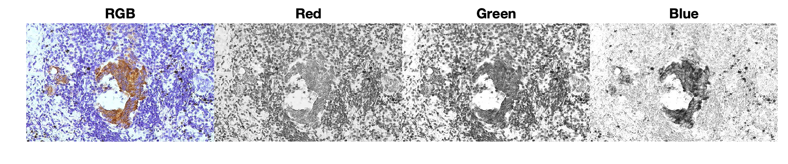
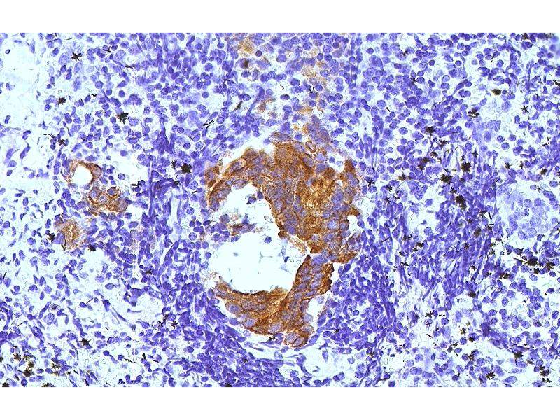
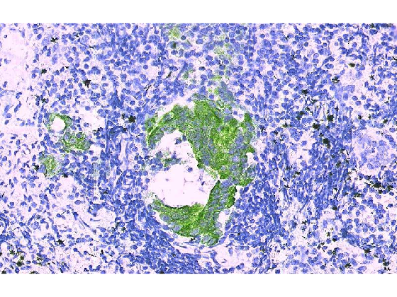

# RGB Images

!!! abstract "For seeing colors and stuff"

## Overview

Color images are known as RGB or truecolor images. These images have three pixel intensity values per pixel position. In MATLAB, this information is organized as a three-dimensional array, where the first plane in the third dimension represents the red pixel intensities, the second plane represents the green pixel intensities, and the third plane represents the blue pixel intensities. In this module we will explore opening, displaying, and modifying RGB images.

This module is broken down into the following sections:

### Things you should know

- Describe the difference between a true-color image and a grayscale image
- Define a colormap and differentiate an RGB image with a grayscale image and a colormap
- Load an RGB image into the MATLAB workspace
- Index an RGB image to extract its component channels
- List the channel order in an RGB image (eg. plane one is always the red channel, etc. )
- Define an RGB triplet and explain how the triplet represents color

### Key Terminology you should know

- RGB: a color model that uses three color values, Red, Green, and Blue, to encode all colors visible to human vision
- truecolor: 24-bit color
- Channels: color specific layers in an image
- 24-bit: An image with three channels, 8-bits each

### Key Functions

- [cat](https://www.mathworks.com/help/matlab/ref/double.cat.html)
- [imread](https://www.mathworks.com/help/matlab/ref/imread.html)
- [impixelinfo](https://www.mathworks.com/help/images/ref/impixelinfo.html)
- [circshift](https://www.mathworks.com/help/matlab/ref/circshift.html)

## RGB images are 3D

In contrast to **binary** or **grayscale** images, **RGB** (or truecolor) images are 3D arrays (think cube, or cuboid).  Each channel in an RGB image is stored as plane.

{ width="250"}

>**Illustration of a 3D array.** Red slice = first channel, Green = second channel, and Blue = third channel

For RGB images, the order of the channels is always the same:

- The first plane ( index 1 in the 3rd dimension) is **always** the **red** channel
- The second plane (index 2) is always the **green** channel
- The third plane (index 3) is always the **blue** channel

## Loading an RGB image

We can use **`imread`** to load an RGB image into MATLAB, just like we can with grayscale images.

Here we load one of the example images that comes with MATLAB:

```matlab linenums="1" title="Read tissue iamge"
RGB = imread('tissue.png');
```

```matlab title="whos output"
Name        Size                 Bytes  Class    Attributes

  RGB       506x800x3            1214400  uint8    
```

Note the dimensions of the image that you just read in: ```506X508X3```. These dimensions match the dimensions we noted in **imageViewer**.

## Displaying an RGB image

Even though RGB images are stored in 3D, they are displayed in 2D, like other images.

```matlab linenums="1" title="Display RGB image"
imageViewer('tissue.png')
```

{ width="750"}

>Here, we show the image 'tissue.png' along with its metadata. Notice the Image type is listed as `truecolor`,  the bitdepth is 24 bit. Also notice that the "Pixel Info" indicator now shows three intensity values ([203 203 241] in this case) instead of just one. And there is no contrast tab (those are only available for grayscale images)

When we zoom to pixels (in the Zoom section), each pixel has three color values, R, G, and B

{ width="750"}

### Challenge Questions

??? question "Q1: What are the dimensions of this image?"

    506 X 800 X 3 (506 rows, 800 columns, 3 'planes')

??? question "Q2: Based on the class of the variable, what is the maximum pixel intensity that you would expect to find in this image? What single line of MATLAB code could you write to test this?"

    Max Intensity of 255 per channel

    ```matlab linenums="1" title="Max across all Channels"
    max(RGB(:))
    ```

    ```matlab
    ans = 
        255
    ```

??? question "Q3: What happens if you forget the 'all elements' indexing syntax ( : ) ?"

    For each channel, you get the max of each column (800 columns). So, the end result is a 3D vector—3  1X800 vectors stacked on top of each other.

## Indexing RGB Images

To index an entire plane from a 3D array, you need three indices: (`row,column,plane`)

{ width="550"}


Here we index out the RED Channel (index 1) and assign it to the variable *`red`*

```matlab linenums="1" title="Index out Channel 1"
red = RGB(:,:,1);
```

…This indexing syntax means "all rows, all columns, 1st plane" from the RGB 3D array

Once indexed out, each 2D array is treated like a grayscale image.

We can display the channel, using **`imshow`**

```matlab linenums="1" title="Display Channel"
imshow(red) % display channel
impixelinfo % add pixel info tool
imdisplayrange % display the intensity range in the bottom right corner
```

{ width="450"}

> **Display of Red Channel.** Notice that the red variable is displayed as if it were an 8-bit, grayscale image, which technically it is. You only get an RGB truecolor image when you have three intensity values for each pixel.

### Plot all of the channels

Here we use a FOR LOOP to display all of the channels in the RGB image. Notice that we display the RGB image before we start the FOR LOOP.

```matlab
figure % new figure
tiledlayout("horizontal","TileSpacing","none","Padding","tight") % set tile layout

nexttile % create new tile
imshow(RGB) % display the RGB image
title("RGB") % title

chs = ["Red" "Green" "Blue"]; % string array for channel titles
for n=1:3 % run three times to display the channels
    channel = RGB(:,:,n); % index out each channel

    nexttile % create a new tile
    imshow(channel) % display the current channel
    title(chs(n)) % title the current channel
end
```

{ width="650"}

## Build an RGB Image From its Channels

To build an RGB image, you simply need to recreate the 3D array. Use the **`cat`** function to easily concatenate in the third dimension.

```matlab
figure; 
rgb2 = cat(3, red, green, blue)
imshow(rgb2)
```

{ width="250"}

### Swapping Channels

What happens when you swap the channels---that is, build the RGB image with channel order mixed up:

```matlab
figure; 
rgb2 = cat(3, green, red, blue) % swap channel order
imshow(rgb2)
```

{ width="250"}

>If you swap the channel order, you change the colors, sometimes in unexpected ways!
