# RGB Enhancement

!!! abstract "Untangling color, one channel at a time"

## Overview

The contrast-enhancement techniques we learned for grayscale images can also help us enhance color images, but RGB images add a wrinkle. **`imadjust`** can operate directly on the red, green, and blue channels, while grayscale techniques such as **`histeq`** and **`adapthisteq`** require us to first isolate an intensity or lightness component. Because color in RGB is represented by combinations of red, green, and blue, changing these channels independently can affect both the **color** and the **brightness** of an image.

A central idea in this module is that **the best representation depends on what you want to change**. If you want to adjust RGB intensities directly, work in RGB. If you want to change colorfulness while leaving hue alone, HSV gives you a separate saturation channel. If you want to enhance lightness while leaving chromatic information unchanged, L\*a\*b\* gives you a separate lightness channel.

!!! tip "Choose a representation that isolates the property you want to change"

    - **RGB**: useful for direct channel-by-channel intensity adjustment
    - **HSV**: separates **hue, saturation, and value**, making colorfulness easy to manipulate
    - **L\*a\*b\***: separates **lightness from chromatic information**, making lightness-based contrast enhancement easier

Rather than treating color-model conversion as an extra step, think of it as choosing a coordinate system that makes the image property you care about easier to manipulate.

This module is broken down into the following sections:

### Things you should know

- Explain why grayscale contrast techniques don't translate directly to RGB images
- Use **`imadjust`** to stretch each RGB channel independently
- Convert an RGB image to grayscale using **`im2gray`**
- Convert between the RGB and HSV color models, and explain what Hue, Saturation, and Value represent
- Modify the Saturation or Value channel to change how vivid or bright an image looks without directly changing its hue
- Use hue-based thresholding to selectively recolor part of an image
- Convert between the RGB and L\*a\*b\* color models, and explain why the L\* channel is useful for contrast enhancement
- Enhance a color image's contrast while minimizing color shifts by adjusting only the L\* channel

### Key Terminology you should know

- **Color Model**: a mathematical way of representing color as a set of numbers (like the three channels of RGB, or the three channels of HSV)
- **Hue (H)**: the type of color—red, green, blue, yellow, and so on
- **Saturation (S)**: how vivid or colorful a pixel is
- **Value (V)**: a measure that roughly corresponds to brightness
- **L\*a\*b\***: a color model that separates lightness (L\*) from two chromatic channels (a\* and b\*)

### Key Functions

- [imadjust](https://www.mathworks.com/help/images/ref/imadjust.html): Adjust image intensity values, per-channel if needed
- [stretchlim](https://www.mathworks.com/help/images/ref/stretchlim.html): Find limits to contrast stretch an image
- [im2gray](https://www.mathworks.com/help/images/ref/im2gray.html): Convert an RGB image to grayscale
- [rgb2hsv](https://www.mathworks.com/help/matlab/ref/rgb2hsv.html) and [hsv2rgb](https://www.mathworks.com/help/matlab/ref/hsv2rgb.html): Convert between RGB and HSV color models
- [rgb2lab](https://www.mathworks.com/help/images/ref/rgb2lab.html) and [lab2rgb](https://www.mathworks.com/help/images/ref/lab2rgb.html): Convert between RGB and L\*a\*b\* color models

---

## The Trouble with RGB Channels

In an RGB image, color is represented by the amount of red, green, and blue at each pixel. This can make enhancement tricky, because the three channels are intertwined—changing one can affect both the color and the brightness of the image at the same time.

Consider the following washed-out image of Ho Chi Minh City:

```matlab linenums="1" title="Load washed out image"
mmSetUnitDataFolder(2)
p.rgb = imread("Ho_Chi_Minh_City_Tet_Decorations,_washed-out.jpg"); % load into structure

figure
imshow(p.rgb)
```

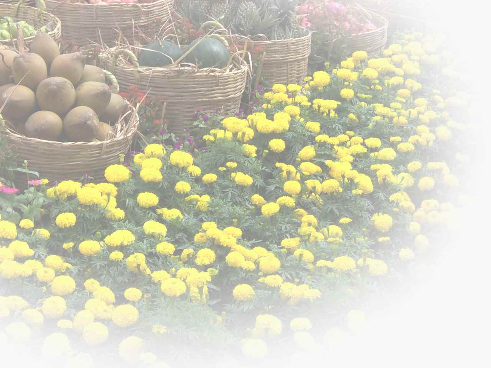{ width="350"}

We can use the course function **`mmHistColor`** to overlay the histograms of the three channels on top of each other.

```matlab linenums="1" title="Overlay the RGB channel histograms"
figure
mmHistColor(p.rgb,'stem') % display as stem plot
ylim([0 4e4]) % crop extreme frequency counts
```

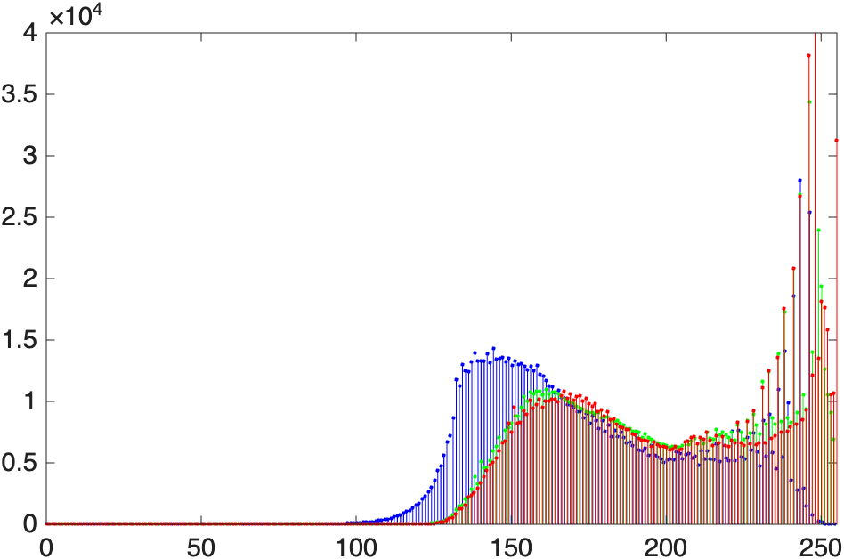{ width="550"}

>Notice how the histograms for all three channels are shifted to the right. This helps explain the image's bright, washed-out appearance.

## Contrast Correction using imadjust

We previously used **`imadjust`** to fix intensity distribution issues and correct grayscale images.

For an RGB image, **`imadjust`** becomes a little more complicated if we want to adjust each color channel independently. Instead of one pair of intensity limits, we can provide a 2×3 matrix containing separate limits for the red, green, and blue channels. We can even specify a different gamma value for each channel:

```matlab title="imadjust inputs for RGB, per-channel"
img_adj = imadjust(img, [low_in_R low_in_G low_in_B; high_in_R high_in_G high_in_B], ...
    [low_out_R low_out_G low_out_B; high_out_R high_out_G high_out_B], ...
    [gamma_R gamma_G gamma_B]);
```

### Stretchlim

**`stretchlim`** helps automatically determine useful input limits for `imadjust`. By default, it finds lower and upper limits that exclude the darkest 1% and brightest 1% of pixels. For an RGB image, it calculates these limits independently for the red, green, and blue channels and returns a 2×3 matrix. Rather than stretching the image itself, `stretchlim` identifies the range of values to stretch; **`imadjust`** performs the actual remapping.

Here, we pass our washed-out image to `stretchlim`, and then pass those limits to `imadjust`:

```matlab linenums="1" title="Auto-stretch each channel"
p.lowhigh = stretchlim(p.rgb);
p.lowhigh % inspect the 2-by-3 matrix of RGB input limits
p.rgba = imadjust(p.rgb,p.lowhigh,[]);
imshowpair(p.rgb,p.rgba,'montage')
```

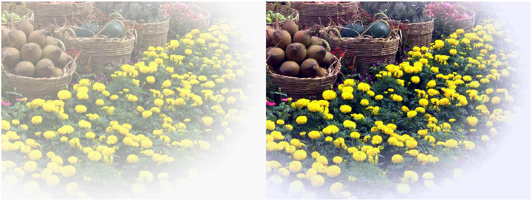{ width="850"}

>The adjusted image on the right uses more of the available intensity range, so the contrast is stronger and the image looks less washed out.

We can see what has changed if we inspect the histogram:

```matlab linenums="1" title="Display histogram of corrected image"
figure;
mmHistColor(p.rgba,'stem')
ylim([0 4e4])
```

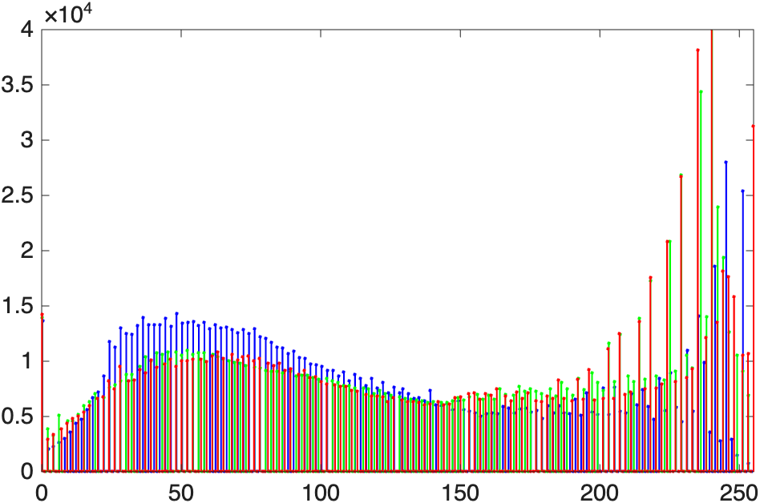{ width="450"}
>The channel intensities are now spread more broadly across the available range.

!!! tip "Finding the right numbers with ImageAdjuster"

    Guessing at six intensity limits and three gamma values by hand is tedious. The free **ImageAdjuster** app (by Brett Shoelson, available from the Add-On Explorer) lets you drag sliders for each channel and preview the result live. When you're happy with the adjustment, it prints the exact **`imadjust`** call—ready to paste into your own code.

## Converting to Grayscale

Sometimes you want—or need—to work with a grayscale image instead of a color one. The function **`im2gray`** converts an RGB image to grayscale. Here's a colorful image of the basilica that we will convert to grayscale:

```matlab linenums="1" title="Convert to grayscale"
mmSetUnitDataFolder(2)
p.rgb = imread('basilica-low-light-reduced.jpg');
p.gray = im2gray(p.rgb);

figure;
mmTightTiledLayout % no spacing, tight padding
for n=["rgb" "gray"]
nexttile
imshow(p.(n))
title(n)
end
```

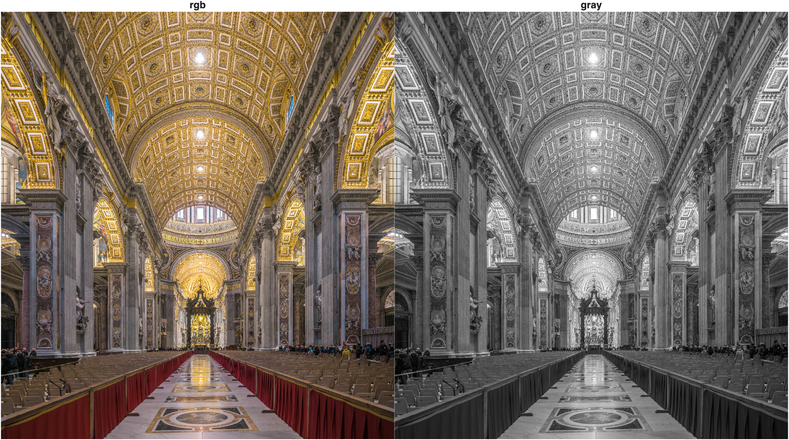{ width="650"}

>Now the image is grayscale. For images with the same width, height, and data type, an RGB array requires roughly three times the memory of its grayscale counterpart because it stores three values per pixel instead of one.

## Enhancing Color Images with Different Color Models

RGB is great for storing and displaying color information, but it isn't always the easiest representation for *editing* a particular visual property. A useful strategy is to ask: **what property do I want to change, and which color model isolates that property most cleanly?** We can then convert the image into that color model, modify the relevant channel, and convert back to RGB for display.

### The HSV Color Model

The **HSV** color model represents color using three components:

- **Hue (H)**: the type of color, such as red, green, blue, or yellow
- **Saturation (S)**: how vivid or colorful the pixel is
- **Value (V)**: roughly corresponds to brightness; mathematically, it is the largest RGB component at each pixel

Instead of asking "how much red, green, and blue should I change?", HSV lets us ask more natural questions: *What if I make the colors more vivid without changing their brightness? Can I brighten the image without changing its hue?*

This is a prime example of our central strategy: **choose a representation that isolates the property you want to change**. In HSV, saturation is its own channel, so we can change colorfulness without directly changing hue.

Consider the following image of a swimmer:

```matlab linenums="1" title="Load the swimmer image"
mmSetUnitDataFolder(2)
p.rgb = imread('swimmer1.jpg'); % load image into structure p
imshow(p.rgb)
```

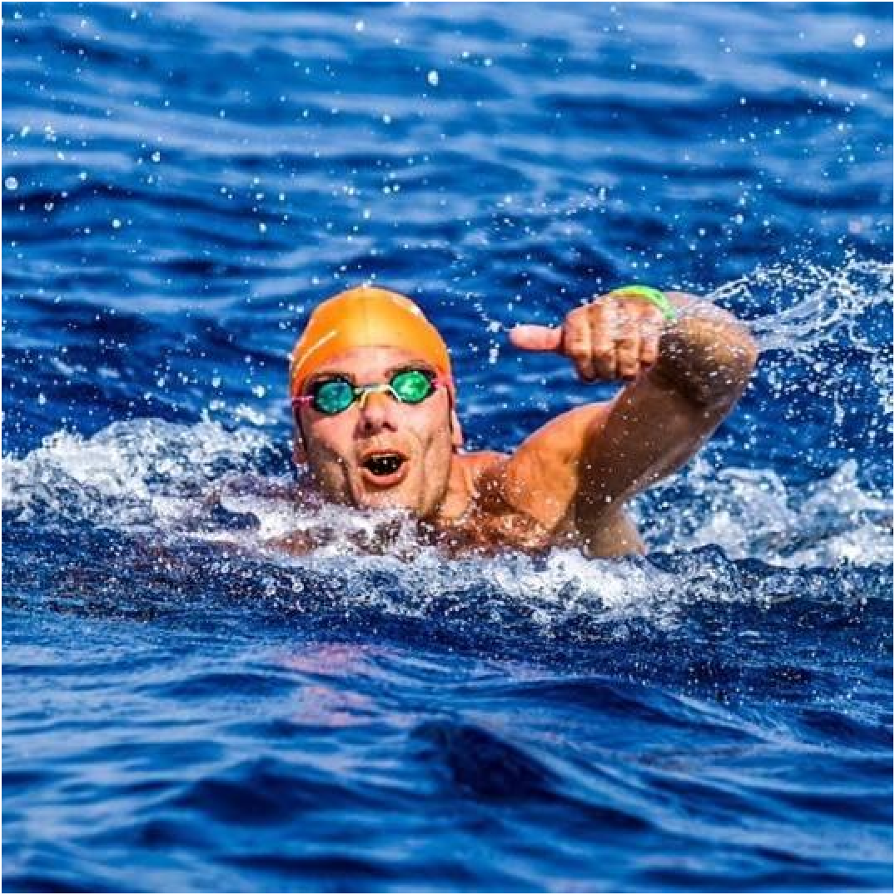{ width="450"}

We can convert it to HSV using `rgb2hsv`:

```matlab linenums="1" title="Convert to HSV"
p.hsv = rgb2hsv(p.rgb);
```

Now we have a second "image" with three channels. But as we can see in the figure below, these channels contain vastly different information:

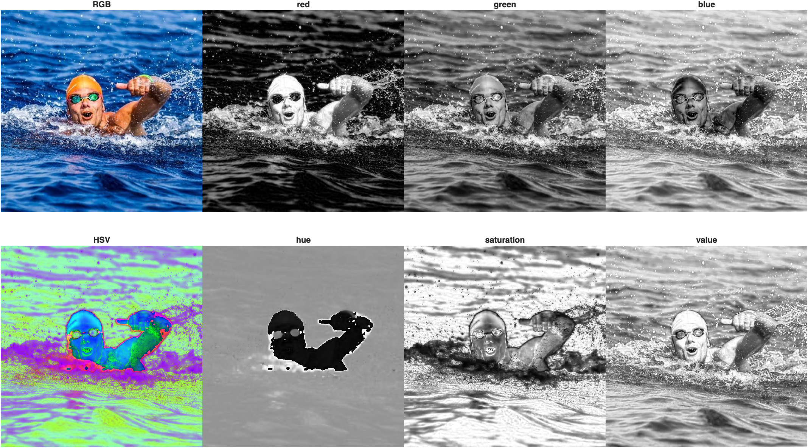{ width="650"}

>**Top row**: RGB and its channels. **Bottom Row**: HSV and its "channels". Since the HSV image is not an RGB image, it does not display properly. But examining the channels in the HSV image can give you some indication of the information contained in each channel. Notice how cleanly the swimmer separates from the water in the *hue* channel because he has far different values than much of his surroundings. Also, the value channel almost looks a grayscale version of the RGB image, a good indicator of brightness in the image.

??? example "Code used to generate figure above"

    ```matlab linenums="1" title="Compare RGB and HSV channels"
    tiledlayout(2,4,"TileSpacing","none","Padding","tight")
    cols = 4;

    nexttile(1)
    imshow(p.rgb)
    title('RGB')
    nexttile(1+cols);
    imshow(hsv2rgb(p.hsv))
    title('HSV → RGB')

    rgb_titles = {'red', 'green', 'blue'};
    hsv_titles = {'hue', 'saturation', 'value'};
    ch_idx = 1;
    for n = 2:cols
        nexttile(n);
        imshow(p.rgb(:,:,ch_idx))
        title(rgb_titles{ch_idx});

        nexttile(n+cols)
        imshow(p.hsv(:,:,ch_idx))
        title(hsv_titles{ch_idx})

        ch_idx = ch_idx + 1;
    end
    ```

#### Change Saturation

Saturation controls how vivid the colors are. Multiplying the saturation channel by a factor makes the colors less vivid (< 1) or more vivid (> 1):

```matlab linenums="1" title="Reduce saturation"
p.hsv = rgb2hsv(p.rgb);
p.S = p.hsv(:,:,2); % extract the saturation channel

saturation_factor = 0.4;
p.S = p.S * saturation_factor;
p.hsv(:,:,2) = p.S; % put the modified channel back
p.rgbS = hsv2rgb(p.hsv); % convert back to RGB

imshowpair(p.rgb,p.rgbS,'montage')
```

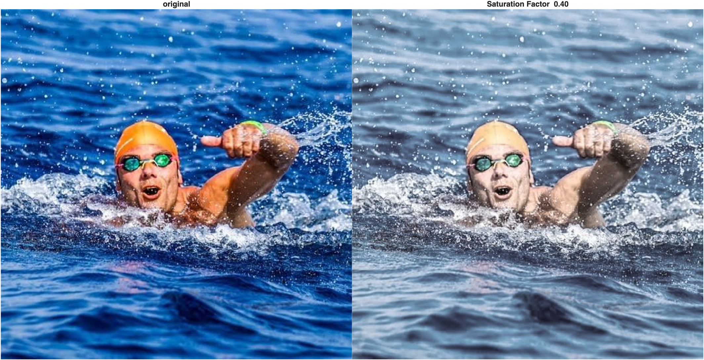{ width="650"}

#### Change Value

Value roughly corresponds to brightness. We can darken or brighten an image by scaling the value channel:

```matlab linenums="1" title="Reduce brightness"
p.hsv = rgb2hsv(p.rgb);
p.V = p.hsv(:,:,3); % extract the value channel

value_factor = 0.3;
p.V = p.V * value_factor;
p.hsv(:,:,3) = p.V;
p.rgbV = hsv2rgb(p.hsv);

imshowpair(p.rgb,p.rgbV,'montage')
```

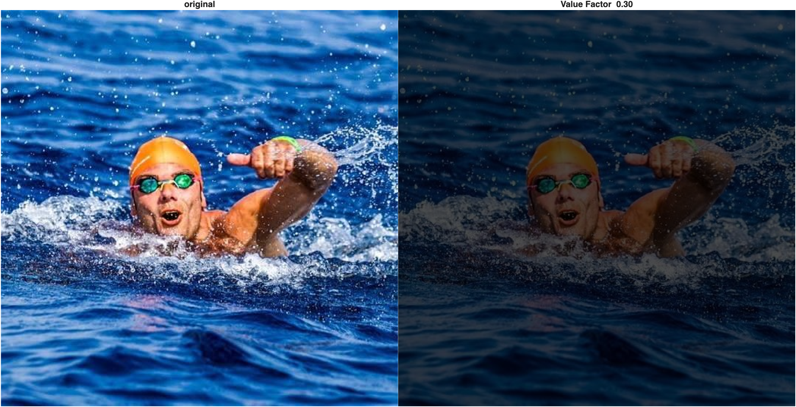{ width="650"}

>Note that a value of 0 is black, regardless of hue or saturation.

#### Color Swapping

We can also use the hue channel to replace colors in an image. First, let's look at the distribution of hues:

```matlab linenums="1" title="Histogram of the hue channel"
subplot(1,2,1)
imshow(p.rgb)

subplot(1,2,2)
hues = im2uint8(p.hsv(:,:,1)); % convert hue values to match the HSV colorbar
imhist(hues,hsv) % use the HSV colormap
```

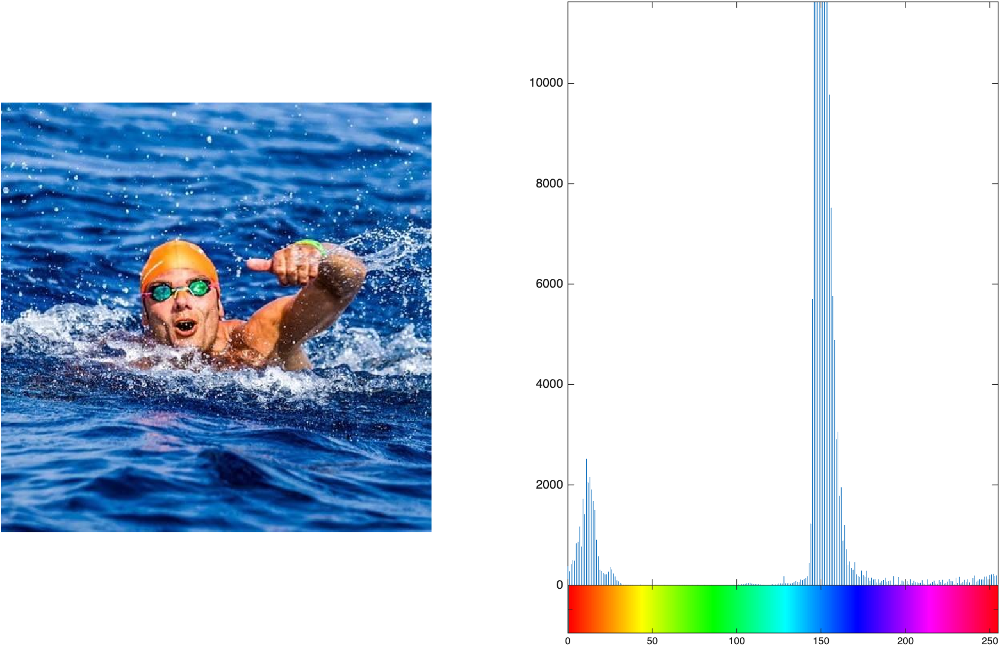{ width="650"}

>This image is mostly blues and reds. Notice that the water's hue values are larger than the swimmer's—that separation makes this a good candidate for color replacement.

To replace the ocean's color, we can create a logical mask from the hue channel and assign it a new hue value. For this particular image, the water occupies much of the image and falls within a convenient range of relatively high hue values, so the mean hue provides a simple image-specific threshold:

```matlab linenums="1" title="Replace the water's hue"
p.hsv = rgb2hsv(p.rgb);

Hue_value = 1; % the new hue to assign

p.H = p.hsv(:,:,1); % extract the hue channel
p.Hmean = mean2(p.H); % mean hue across the whole image
p.H(p.H > p.Hmean) = Hue_value; % replace values above the mean
p.hsv(:,:,1) = p.H;

p.rgbH = hsv2rgb(p.hsv); % color-swapped image
imshowpair(p.rgb,p.rgbH,'montage')
```

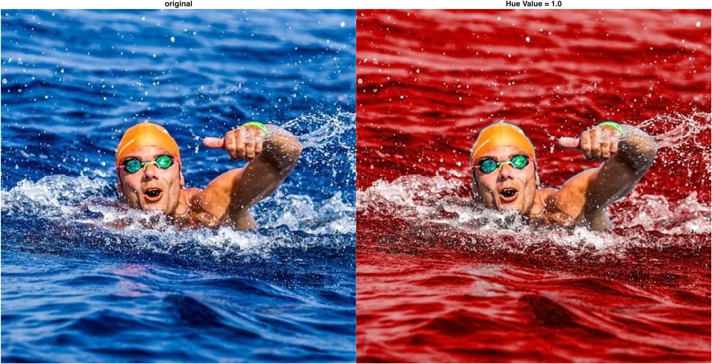{ width="650"}

>This kind of selective recoloring would be difficult to pull off directly in RGB space, where hue isn't its own channel. Also notice that hue values of 0 and 1 produce the same result because HSV wraps around like a color wheel—0 and 1 are the same shade of red. Because hue is circular, an ordinary arithmetic mean is **not** a general way to calculate an average hue; it simply works as a convenient threshold for this particular image.

### The L\*a\*b\* Color Model

HSV is useful when we want to work directly with hue or saturation, but its value channel does not completely isolate perceived lightness from color. When the goal is **contrast enhancement**, we can choose a representation that separates lightness more directly from chromatic information.

The **L\*a\*b\*** color model represents lightness in the L\* channel and chromatic information in the a\* (green–red) and b\* (blue–yellow) channels. This lets us modify L\* while leaving the a\* and b\* values unchanged, making L\*a\*b\* a useful choice for lightness-based contrast enhancement with fewer unintended color shifts.

Consider this dimly lit photo:

```matlab linenums="1" title="Load a low-light image"
p.rgb = imread("lowlight_1.jpg");
imshow(p.rgb)
```

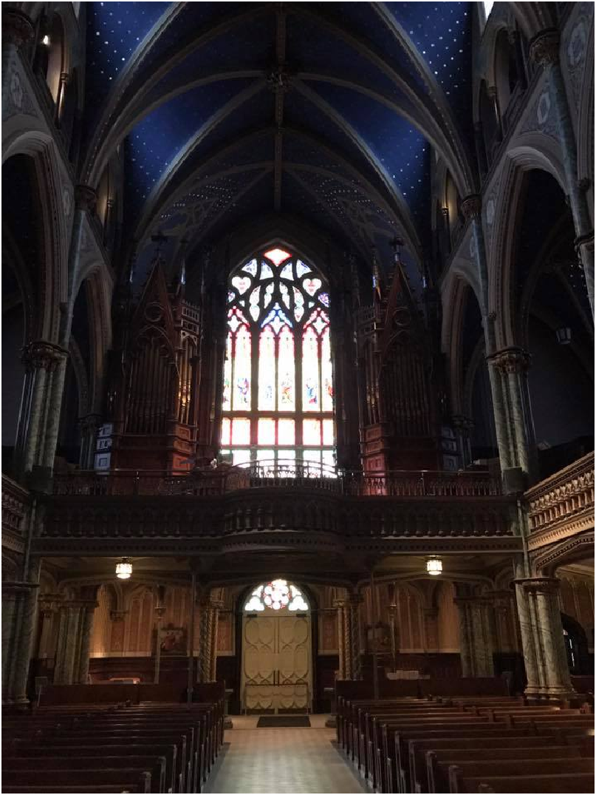{ width="350"}

Convert it to L\*a\*b\* and look at each channel, along with its histogram:

```matlab linenums="1" title="Convert to L*a*b* and display channels"
p.lab = rgb2lab(p.rgb);

tiledlayout(2,3);
p.titles = ["L* (lightness)", "a* (green-red)", "b* (blue-yellow)"];

for n=1:3
    nexttile(n);
    imshow(p.lab(:,:,n),[]) % empty brackets auto-adjust contrast
    title(p.titles(n));

    nexttile(n+3)
    histogram(p.lab(:,:,n))
end
```

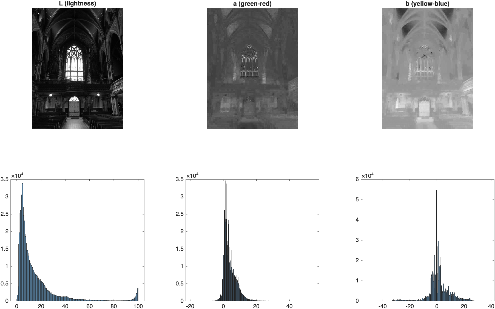{ width="650"}

>The L\* plane looks like a black-and-white image, but darker, and its histogram is heavily concentrated toward low values, confirming that most of the image has low lightness. Notice the range of values: L\* runs from 0 to 100, while a\* and b\* can be negative or positive. This is no longer an RGB image; it's an L\*a\*b\* image, and MATLAB's image functions expect it to be handled a little differently.

To enhance contrast while leaving the chromatic channels unchanged, we work on the L\* plane alone. First, scale it from its native 0–100 range down to 0–1 so we can treat it like an ordinary grayscale image. Again, the strategy is the same: **isolate the property you want to change, modify that property, then recombine the image**.

```matlab linenums="1" title="Compare contrast techniques on the L* plane"
p.Lscale = p.lab(:,:,1)/100; % normalize L* to the range 0 to 1

tiledlayout("horizontal","TileSpacing","none","Padding","tight")

nexttile;
imshow(p.Lscale);
title('Original L*');

nexttile
p.imadjustL = imadjust(p.Lscale,stretchlim(p.Lscale),[]);
imshow(p.imadjustL)
title('Adjust Intensity');

nexttile;
p.histeqL = histeq(p.Lscale);
imshow(p.histeqL);
title('Histogram Eq');

nexttile;
p.adaptiveL = adapthisteq(p.Lscale);
imshow(p.adaptiveL);
title('Adaptive Histogram Eq');
```

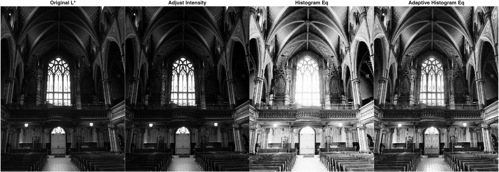{ width="650"}

>The three methods redistribute lightness differently. `imadjust` performs a global contrast stretch, `histeq` redistributes the global histogram, and `adapthisteq` works locally. Which result is most useful depends on the image and the goal.

To bring a corrected L\* plane back into a full-color image, we: (1) scale it back to the 0–100 range, (2) insert it back into the L\*a\*b\* image in place of the original L\* plane, and (3) convert the whole L\*a\*b\* image back to RGB.

```matlab linenums="1" title="Recombine each corrected L* plane into a color image"
p.imadjustIMG = p.lab;
p.imadjustIMG(:,:,1) = p.imadjustL * 100;
p.imadjustIMG = lab2rgb(p.imadjustIMG);

p.histeqIMG = p.lab;
p.histeqIMG(:,:,1) = p.histeqL * 100;
p.histeqIMG = lab2rgb(p.histeqIMG);

p.adaptiveIMG = p.lab;
p.adaptiveIMG(:,:,1) = p.adaptiveL * 100;
p.adaptiveIMG = lab2rgb(p.adaptiveIMG);

tiledlayout("horizontal","TileSpacing","none","Padding","tight")
nexttile
imshow(p.rgb)
title("original")
nexttile
imshow(p.imadjustIMG)
title("Intensity adjust")
nexttile
imshow(p.histeqIMG)
title("Histogram equalization")
nexttile
imshow(p.adaptiveIMG)
title("Adaptive Histogram Eq")
```

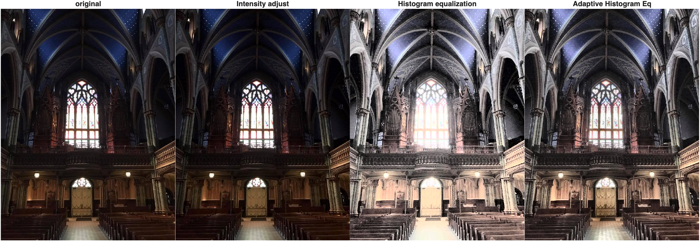{ width="650"}

>All three corrections change lightness while leaving the original a\* and b\* channels unchanged, which greatly reduces the color shifts that can occur when RGB channels are adjusted independently. Compare this with equalizing the red, green, and blue channels separately: each channel could be remapped differently, altering the color balance as well as the contrast.

At this point, the larger pattern should be clear: **RGB, HSV, and L\*a\*b\* are different representations of the same color image, but each makes different image properties easier to manipulate.** Choose the representation that best isolates the feature you want to change.

Congratulations, you have made it to the end! 🎨
