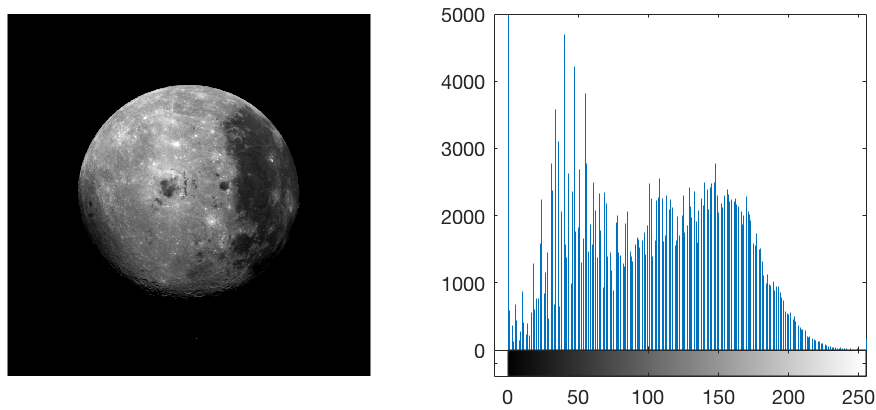
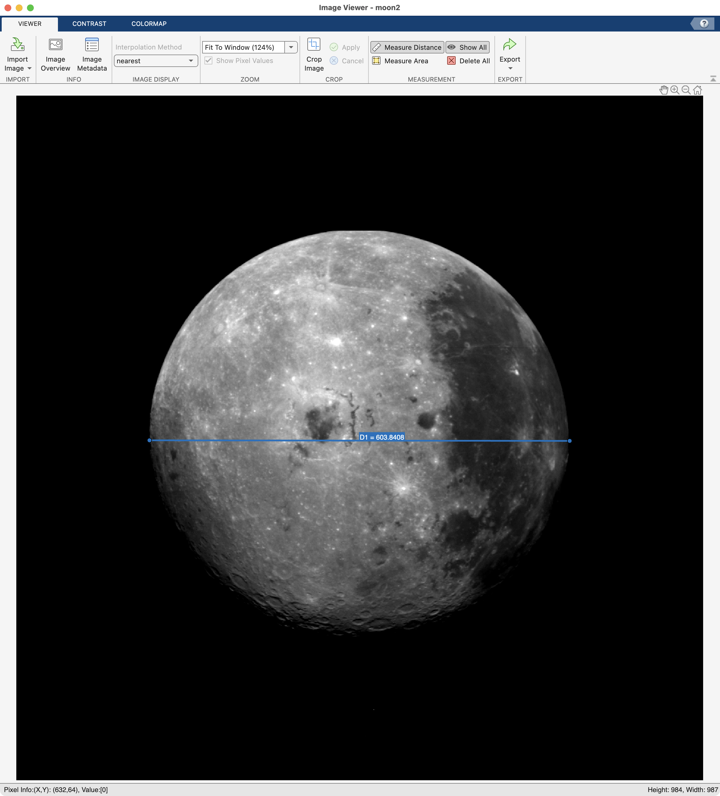

# Region Processing

!!! abstract "For counting and measuring stuff"

## Overview

Ok. Great. We have [segmented the moon](ImageSegmentation.md) and [cleaned up the mask](ImageSegmentationCleanup.md), so… now what? Well, now, lots of stuff. For example, you can use that mask to make calculations, such as the area or diameter of the mask. Or you can use the mask to restrict image processing to the corresponding regions in the image.  

### Things you should know

You should know how to:

- Calculate quantities, such as area and length, using image masks and simple mathematical operations

- Convert calculated quantities into real-world measurements

- Calculate the region properties of connected components using the Image Region Analyzer tool or the **`regionprops`** function

### Important Terminology

- **Region Properties**: The properties of said regions. Examples include area, count, roundness, etc.

### Stuff you should read

- [Region and Image Properties](https://www.mathworks.com/help/images/pixel-values-and-image-statistics.html')

### Functions you should know

- [regionprops](https://www.mathworks.com/help/images/ref/regionprops.html') - Measure properties of image regions

## Local Processing

Say we wanted to increase the brightness of the moon. For reference, here is our moon and it's histogram. You can find the code for loading the moon [here.](ImageEnhancement.md/#displaying-the-histogram):

{ width="550"}

>Original moon2 and its histogram

Since all images are just numeric matrices, the simplest way to brighten an image is to add 50 to all pixels, as follows

```matlab linenums="1" title="Brighten Image"
moon2 = imread('https://saldenest.s3.amazonaws.com/MATLAB_images/moon2.tif'); % load moon2
moon_bright = moon2 + 50; % brighten image

% display results
subplot(1,2,1); % create new tile
imshow(moon_bright) % display image

subplot(1,2,2); % create new tile
imhist(moon_bright) % display histogram
xlim([-5 260]) % adjust X- limits
ylim([0 7e3]) % adjust Y- limits of the histogram
```

![][img_bright_all]{width=700px}

[img_bright_all]: images/moon2-all-bright-hist.png

>And the moon is brighter, but so is space, which is now an unsatisfyingly dull gray. When we examine the  histogram, we see that we have simply shifted the distribution of pixels to the right and introduced a significant number of saturated pixels, thereby reducing the overall contrast in the image. Remember, this is an 8-bit image, so the maximum intensity any one pixel can have is 255.

To avoid changing the brightness of space, we can use our moon mask as a logical index to restrict the brightening of pixels to just those pixels found in the moon. Remember, we created our moon mask [here](ImageSegmentationCleanup.md/#morph-ops-example) and stored the final cleaned-up mask in *`p.sm_nz`*.

```matlab
% set image and mask
moon_bright = moon2; % copy moon image;
moon_mask = p.sm_nz; % copy final mask from clean-up steps

% brighten image
moon_bright(moon_mask) = moon_bright(moon_mask) + 50; % brighten moon by 50 (1)

% display results
imshowpair(moon_bright, moon2,'montage') % display side-by-side
title('Brightened | Original')
```

  1. :material-lightbulb-outline: Notice the use of recursive assignment here: On both sides of the equal sign we have `moon_bright(moon_mask)`. This means to only brighten those pixels that fall inside the moon and then overwrite those values with the brightened ones.

![Montage of Moon vs Brightened Moon][img-moon2-bright-v-orig]{width=500px}

>Using *`moon_mask`* as a logical index on the grayscale image *`moon_bright`* allows us to add 50 to only those pixels found inside the mask (and nowhere else). Notice that space has remained a satisfyingly dark black.

[img-moon2-bright-v-orig]: images/moon2-brightened-v-original.png

We can also see the effect of just brightening the moon pixels by comparing the histograms:

![Histogram of brightened image][img-hist-bright-v-orig]{width=800px}

>Here you can see that the space pixel bin remains locked at 0 for both histograms, while in the brightened histogram, the moon pixels have been shifted to the right, brightening the moon. Also notice that in the brightened image there are now a significant number of pixels that have been saturated to the maximum pixel intensity of 255. These pixels appear as bright white in the brightened image. It is usually not best practice to saturate a large portion of your pixels and the brightened image does look worse than the original image, but fine for demonstration purposes.

[img-hist-bright-v-orig]: images/moon2-hist-brightened-v-original.png

#### Challenge - Brighten up That Space

=== "Question"

      Using the same moon mask from the example above, how would you brighten just the space pixels and not moon pixels, as shown below? Recall that in the original image the space pixels all had a value of 0. Review the histogram.  can you guess what intensity value the space pixels should be set to?

=== "Answer"

      ```matlab
      space_bright = moon2; % copy moon image
      space_bright(~moon_mask) = 100; % set all NON-MOON pixels (aka SPACE pixels) to 100

      % display the results
      subplot(1,2,1);
      imshow(space_bright) % show brightened space image
      
      subplot(1,2,2);
      imhist(space_bright) % show histogram
      xlim([-5 260]) % adjust X- 
      ylim([0 7e3]) % and Y- limits of the histogram
      ```

      …As you can see from the code, we set the space pixel intensity values all to 100. Remember, "~" means LOGICAL NOT, which basically converts all **TRUE**s to **FALSE**s, and vice versa in the binary image. 

![][img_background]{width=600px}

[img_background]: images/moon2-hist-space-bright.png

---

## Size Measurements

We can also use masks to make measurements. Recall, each pixel in an image represents the sampling of a location in space. Think tiny little boxes. As such, each pixel has a set width and length and, of course, an area. The length and width of each pixel is 1 and the area is also 1 (1x1 = 1 pixel$^2$). So measuring objects typically consists of counting pixels (and even fractions of pixels).

For example, we can easily calculate the area of the moon mask by counting the number of pixels inside the mask. Since  *`moon_mask`*  is a logical array that contains only logical 1's and 0's, all you need to do add up all of the ones. MATLAB does this automatically for you when use the function **`sum`**:

```matlab linenums="1" title="Calculate the area of the mask"
moon_area = sum(moon_mask(:)) % Add up all of the TRUES
```

```matlab title="area in pixels"
moon_area =

      273495 % area in pixels
```

…The value returned is the area in pixels$^2$

### Real World measurements

But what if we want to know our value in real-world measurements, like square miles (or square kilometers if you're un-American and have a fetish for reasonably spaced metrics).

For that, we need to know the dimensions of the pixels, length and width, in miles. Often this type of information is included in the metadata of the image, but sadly our image did not provide such data. In such a situation, we need to compare our measurement to a known measurement, like the actual diameter of the Moon in miles.

Once we have such a measurement, we can then easily figure out how big our pixels are in real-world measurements using the following steps

1. Calculate the diameter of the Moon in pixels
2. Get the actually diameter of the Moon in miles
3. Divide the number of miles by the number of pixels to get the miles/pixel ratio in our image.

So, how do we determine the diameter of the Moon in pixels? Well, we could just draw a line on the moon, using the **`imageViewer** app.

{ width="550"}

>As shown here, Image Viewer has a "Measure Distance" tool, which we can use to measure distances in pixel on an image. Here, we measure the diameter of the moon to be 603.84 pixels (blue line).

However, this method requires a precise placement of the line on the image. Another, more robust method that doesn't require user input would be to calculate the diameter from the area. Since the profile of the Moon is basically a circle, we calculate the diameter use some simple Euclidean Geometry and the rearranging of terms, as follows:

1. $A=\pi \cdot r^2$ *- Area of a circle*
2. $r = \sqrt{A / π}$ *- radius from the area*
3. $d = 2 \cdot \sqrt{A / π}$ *- diameter is 2x the radius*

 Now we can calculate the diameter (in pixels) using the moon area that we calculated above:

```matlab linenums="1" title="Get Moon Diameter from Area"
moon_diameter = 2 * sqrt(moon_area / pi) % diameter in pixels
```

```matlab
moon_diameter =

       590.11 % pixels
```

…And we get a value that is slightly smaller than the value we measured using the Measure Distance tool, but within reason.

Next, we need the diameter of the moon in actual miles. Luckily we have [google](https://www.google.com/search?num=100&client=safari&rls=en&q=what+is+the+diameter+of+the+moon&oq=What+is+t&gs_l=serp.3.0.35i39k1j0l3j0i20k1j0l5.24041.24904.0.26041.9.8.0.0.0.0.149.803.6j2.8.0....0...1c.1.64.serp..1.8.802...0i131k1j0i67k1j0i3k1.29ClCq5hfGE), which tells us that the diameter of the moon is `2,159` miles. Sounds big. That's basically the distance between Denver and Miami.

Finally, we can calculate the size of a pixel, as follows:

```matlab linenums="1" title="Calculate Miles Per Pixel"
moon_pixel = 2159 / moon_diameter
```

```matlab
moon_pixel =
   3.6587
```

…Thus, each pixel in the moon image is 3.67 miles per side (width and height), assuming square pixels.

Now we can calculate the area of the moon mask in square miles:

```matlab linenums="1" title="Calc Area in Square Miles"
calc_area = moon_area*moon_pixel^2
```

```matlab
calc_area =

   3.6610e+06
```

…Which means that the cross-sectional area of the surface of the moon (the largest slice through the moon) is approximately 3.7 million square miles. That's real big.

### Intensity Measurements

Using the mask of the moon we can also calculate intensities metrics from the original image, such mean intensity:

If we use the mask as logical index, we get the pixel values from inside the Moon. If we average those values, we get the mean intensity inside the moon

```matlab linenums="1" title="Mean Intensity of Moon"
moon_pixel_intensities = moon2(moon_mask); % pixel intensities inside moon
avg_moon_pixel_intensities = mean(moon_pixel_intensities) % calculate mean intensity of the moon pixels
```

```matlab
avg_moon_pixel_intensities =

  106.2709
```

Compare this to the overall average intensity of the image.

```matlab linenums="1" title="Mean Intensity of Image"
img_pixel_intensities = moon2(:) % all pixels (1)
avg_img_pixel_intensities = mean(img_pixel_intensities)  % calculate mean intensity of all of the pixels
```

   1. :material-lightbulb-on-outline: Remember, `(:)` means all elements

```matlab
avg_img_pixel_intensities = 

   29.9287
```

…The average of the image is far lower than the average of the moon, because the image includes a high number of space pixels with an intensity of `0`.

##### Challenge - Intensity Measurements

??? question "How would you calculate the range, min, and max pixel intensity of the moon pixels?"

      ```matlab linenums="1" title="Calculate Range"
      range(moon2(moon_mask)) % range
      ```

      ```matlab
      ans =

      uint8

         255
      ```

      ```matlab linenums="1" title="Calculate Minimum"
      min(moon2(moon_mask)) % minimum
      ```

      ```matlab
      ans =

      uint8

         0
      ```

      ```matlab linenums="1" title="Calculate Max"
      max(moon2(moon_mask)) % maximum
      ```

      ```matlab
      ans =

      uint8

         255
      ```

#### Regional Processing Functions

The function **`regionprops`** simplifies the process of calculating region properties. With one simple function call, you can quickly calculate an entire series of properties:

```matlab linenums="1" title="Calculate all the Region Properties"
regionprops(moon_mask, 'all')
```

```matlab
ans = 

  struct with fields:

                   Area: 273495
               Centroid: [493.4251 483.4057]
            BoundingBox: [191.5000 194.5000 603 584]
            SubarrayIdx: {[1×584 double]  [1×603 double]}
        MajorAxisLength: 600.7383
        MinorAxisLength: 579.7442
           Eccentricity: 0.2621
            Orientation: -6.8450
             ConvexHull: [400×2 double]
            ConvexImage: [584×603 logical]
             ConvexArea: 276330
            Circularity: 0.7914
                  Image: [584×603 logical]
            FilledImage: [584×603 logical]
             FilledArea: 273495
            EulerNumber: 1
                Extrema: [8×2 double]
          EquivDiameter: 590.1056
               Solidity: 0.9897
                 Extent: 0.7766
           PixelIdxList: [273495×1 double]
              PixelList: [273495×2 double]
              Perimeter: 2.0840e+03
           PerimeterOld: 2.2039e+03
       MaxFeretDiameter: 605.7169
          MaxFeretAngle: -173.6494
    MaxFeretCoordinates: [2×2 double]
       MinFeretDiameter: 584
          MinFeretAngle: -90
    MinFeretCoordinates: [2×2 double]
```

But wait, there's more. If you also want to calculate the intensity properties from the original image, input the image as the second input:

```matlab linenums="1" title="Calculate Intensity values"
regionprops(moon_mask,moon2, {'MaxIntensity','MeanIntensity','MinIntensity','WeightedCentroid'})
```

```matlab
ans = 

  struct with fields:

    WeightedCentroid: [461.4839 441.1727]
       MeanIntensity: 106.2709
        MinIntensity: 0
        MaxIntensity: 255
```

…weight centroid uses intensity as an additional input to calculate the center of the mask.

Review the [regionprops documentation](https://www.mathworks.com/help/images/ref/regionprops.html#buoixjn-3') for more information.
