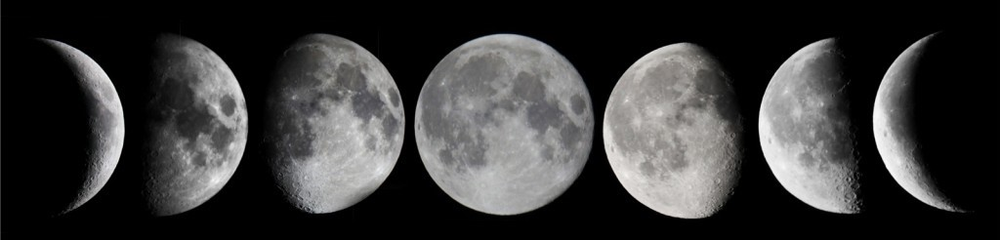

# Segmentation and Region Processing

!!! abstract "For Finding Stuff in Your Images and measuring them"

{ width="550"}

## Overview

Sometimes you only need to process just part (or parts) of an image. Or, you need identify objects inside an image. To do these things, you need to label the image as having important and unimportant parts. This labeling is known as segmentation and these smaller parts are often referred to as regions (or blobs or connected components). These regions are often stored as logical arrays that are the same size as the image being processed. In this logical array, which are often called binary images or masks, the regions to be processed will be represented as a cluster of 1's.

In this module, we will learn how to segment an image into regions, how to create a mask from those regions, and how to analyze the properties of those masks or how to use those masks for regional processing.

### Things you should know

By the end of this module you should be able to:

- Manually segment an image

- Create a mask of an image using threshold values

### Terminology you should be able to use

- **Image Segmentation**: the process of partitioning an image into parts or regions
- **Binarization**: the process of creating a binary image by binning the original image's intensity values based a histogram threshold value. The most common binarization operation results in two bins: a positives bin for intensity values above the threshold and a negatives bin for intensity values that fall below the threshold.
- **Connected components**: connected clusters of pixels in an image
- **Otsu's Method**: A popular algorithm used to come up with the threshold value for binarization from an image's histogram
- **Region**: aka **Neighborhood** aka **Connected Components** aka **Blobs**: areas of significance in an image. In a binary image, these regions are essentially contiguous **TRUEs** surrounded by **FALSEs**.
- **ROI**: region of interest, a part of an image captured by a drawing tool such as the ellipse tool or the polygon tool
- **Mask**: a binary image with the same dimensions as a grayscale image, but which has **`TRUEs`** in the locations corresponding to regions of interest and **`FALSEs`** everywhere else.

### Relevant MATLAB Stuff you should read

- [Image segmenter app](https://www.mathworks.com/help/images/Segment-an-Image-Using-Thresholding.html')

- [ROI based processing](https://www.mathworks.com/help/images/roi-based-processing.html?s_tid=CRUX_lftnav')

- [Image segmentation](https://www.mathworks.com/help/images/image-segmentation.html')

### Important Functions you should know

- [drawcircle](https://www.mathworks.com/help/images/ref/drawcircle.html') - Create customizable circular ROI
- [graythresh](https://www.mathworks.com/help/images/ref/graythresh.html') - Global image threshold using Otsu's method (input image)
- [otsuthresh](https://www.mathworks.com/help/images/ref/otsuthresh.html) - Global histogram threshold using Otsu's method (input histogram)
- [imbinarize](https://www.mathworks.com/help/images/ref/imbinarize.html') - Binarize 2-D grayscale images thresholding

## Segmentation

Segmentation is the process of selecting and labeling regions in an image. Each region represents a span of connected pixels and you can have more than one region. Segmentation is often used to identify objects in image and capture relevant metrics such as area and average pixel intensity of the object.

Consider the following image of the moon:

![Moon annotated][moon2_annotated]{width=250px}

>This image can clearly be segmented into two parts: pixels that are in Space and pixels that are on the Moon.

[moon2_annotated]: images/moon2_annotated.png

---

### Manual Segmentation

Often the most straightforward way to segment an image (and the most time-consuming) is to manually outline the region of interest. A manual outline is typically called a **Region-of-Interest** or **ROI**.

MATLAB includes a collection of ROI tools with differing shapes that you can use to manually segment images, as described in the [ROI-based processing documentation.](https://www.mathworks.com/help/images/roi-based-processing.html?s_tid=CRUX_lftnav')  Shape options include circles, ellipses, polygons, lines, and others.

The following example code activates the Circle ROI tool, allowing you to draw a circle around the moon and create your very first ROI. Here we use the function **`drawcircle`**, which activates the ROI tool and returns a handle to the ROI, called simply *`roi`*.

```matlab linenums="1"
moon2 = imread('https://saldenest.s3.amazonaws.com/MATLAB_images/moon2.tif');
figure; 
tiledlayout(1,2,"TileSpacing","none")

nexttile % create tile
imshow(moon2); % display image
title('image') % add title

roi = drawcircle; % activate the circle ROI tool
roi.wait; % pause code until user double-clicks on ROI

nexttile
bw = roi.createMask; % create mask
imshow(bw) % display the mask
title('mask)
```

![Moon with Circle Annotation][moon2_roi]{width=550px}

[moon2_roi]: images/moon2-draw-circle.png

>After running this code, a picture of the moon will appear. Hover the mouse over the image. The arrow should change to a cross-hair indicating that the ROI tool is activated. To draw the circle, simply click and drag the cross-hair from the top of the moon to the bottom of the moon. Release the mouse button when the ROI covers the moon. If your circle is too large or too small, simply click on one of the four vertices to resize the circle. As you can see in the right panel in the above image, we have successfully segmented (or masked) our moon.

Notice that the handle *`roi`* has the cube icon () in the workspace. This identifies the variable as an object. An object is kind of like a variable/function combo. In this example, the object contains all of the data and methods needed to manipulate the ROI that you just drew. For example, the following returns the x- and y- coordinates of the ROI center and its radius in pixels.

```matlab linenums="1" title="Display ROI Center coordinates"
roi.Center
```

```matlab title="result"
ans =

  495.9819  486.5542
```

```matlab linenums="1" title="Display ROI Radius"
roi.Radius
```

```matlab title="result"
ans =

  296.1042
```

 If you move the ROI, the coordinates will automatically be updated. If you resize the ROI, the radius will be updated.

The object handle also includes functions that can be evoked using dot notation. For example, the code **`roi.wait`** executes a wait function, which tells MATLAB to pause execution of the code until you have finished drawing the ROI to your specifications. MATLAB waits until you double-clicked on the ROI. This allows you to draw and move the ROI at your leisure without worrying about the code continuing to execute without your final input. Once you double-click inside the ROI and the code will resume execution after the  **`roi.wait`** line. The function **`roi.createMask`** creates a mask from your ROI. This mask is a binary image that has the same dimensions as the original image but with TRUEs at locations that correspond to inside the ROI, and FALSEs everywhere else.

### Multiple Manual Segmentations

Sometimes, you need to segment multiple ROIs sequentially. To simplify this process, we can use a WHILE LOOP to continue the segmentation process until the user indicates they would like to stop.

The following code allows us to segment multiple circles on the moon. To use, activate the code block. When the image comes up, draw a circle on each crater that you want to capture. Make sure that you double-click on the crater when you're finished. And then draw the next crater.  When you're done, press the stop button.

```matlab linenums="1" title="Multiple Segmentations"
figure;
imshow(moon2)
crater_mask = false(size(moon2)); % reset the mask to all false

% add a push-button to the figure
button_handle = uicontrol('Style', 'PushButton', ...
    "FontWeight","bold",...
    'String', 'STOP', ...
    "ForegroundColor","white",...
    'BackgroundColor',[1 0 0],...
    'Callback', 'delete(gcbf)'); % calls the function delete when pressed

while ishandle(button_handle) % continue looping while there is still a STOP button
    roi = drawcircle;
    
    if ishandle(roi)
      wait(roi); % wait for double click
      crater_mask = roi.createMask | crater_mask;
    end
end

figure; % create a new figure
imshowpair(img,crater_mask) % overlay the mask (pink) and the original image (green)
```

…In this code, we start by adding a push-button (labeled "STOP") to the figure. The sole function of this button is to delete the figure in which it exists.  This is accomplished by setting the callback property of the button to `delete(gcbf)`. The callback function is the function that is called when the button is pressed.  **`gbcf`** is a function that points to the current figure, so `delete(gcbf)` deletes the current figure. Once you delete the figure, everything inside of the figure is deleted as well, including the button. So, this acts kind of like a self-destruct function. Pretty cool.

![Moon with multiple ROIs][img_mult_rois]{width=400px}

[img_mult_rois]: images/moon2-multiple-rois.png

Before the WHILE LOOP, we also create a logical array, *crater_mask*, that is the same size as the image and which will hold the masks for our craters.

Then, we initiate the WHILE LOOP, which is contingent on the existence of the STOP button: `ishandle(button_handle)`. The **`ishandle`** function asks if the button still exists. So, once you press the button you destroy the figure, which destroys both the button and the image, and ultimately stops the WHILE LOOP.

Inside the WHILE LOOP, we have the code for generating ROIs and masks from these ROIs. Notice that we perform a logical OR operation to combine the mask created by the ROI with the pre-initialized mask, *crater_mask*.

When the loop ends, we overlay the image with our crater_mask.

![Moon with multiple masks][img_mult_rois_mask]{width=400px}

[img_mult_rois_mask]: images/moon2-multiple-masks.png

### Thresholding

Manual segmentation can be a bit of a drag (*see what I did there*) and very time-consuming. A far simpler way to segment an image would be to automate the process—let the computer do it.

Thresholding is the process of generating binary images from grayscale images based on an intensity threshold (or cut-off). Any pixel intensity equal to or greater than the cut-off is set to **`true`**, whereas any pixel intensity value below the cut-off is set to **`false`**.

#### Thresholding by Logical Operation

The simplest way to threshold is to choose a cut-off and then apply a logical operation.

For example, the space pixels in the moon image all have an intensity of 0. You can confirm this by "Zooming to Pixels" in the **`imageViewer`**: in the imageViewer "Viewer" tab, under the "ZOOM" section, select "Zoom to Pixels" in the pop-up menu. Be sure that the "Show Pixels Values" checkbox is checked.

![Zoomed in image][img-pixel-region]{width=800px}

>**Zoom to Pixels.** This is what you should see when you Zoom to Pixels. **Left Panel**. An overview of the image with a small blue rectangle indicating the region of zoom. You can click and drag this rectangle around to inspect different regions of the image. **Right Panel** The zoomed-in region showing an enlarged view of the moon-space boundary image, down to the level of the pixels. Inside each pixel, is the letter I followed by the pixel intensity. Notice that most of the black pixels have an intensity of `0`, while the brighter, lighter gray pixels have an intensity greater than 0.

[img-pixel-region]: images/moon2-zoom-to-pixels.png

Here we simply perform a relational operation on the moon along the lines of "find all pixels with an intensity great than zero":

```matlab linenums="1" title="Pixels greater than 0"
moon_binary = moon2>0;
imshow(moon_binary)
```

![…This mask contains 1s (or **true**) wherever there is a pixel inside the moon, and 0s (or **false**) for pixels in space. Notice that the mask looks close but not identical to the mask we generated using the ROI circle tool. This mask has more noise in it, which is often the result from thresholding.][moon2_binary_annotated]{width=350px}

>A binary image that masks the moon.

[moon2_binary_annotated]: images/moon2_binary_annotated.png

!!! note "NOTE: This is an unusually easy image to segment. Most images would have more noise in the segmentation."

#### Threshold by algorithm

In the previous example, we visually inspected the image and found that most space pixels had an intensity of 0 whereas the moon pixels had intensity values greater than 0. Which means that there is an abrupt change in pixel intensity values at the edge of the moon. This edge can be seen in the image's histogram:

![Histogram with Space Pixels annotation][space_pixels]{width=350px}

[space_pixels]: images/moon2_histogram.png

>Notice the propensity of space pixels (intensity of 0) while most of the moon's intensity values fall between 25 and 200.

Wouldn't it be nice if we could train a computer to read an image's histogram and come up with a threshold all on its own, leaving us time to work on our instagram posts or Tik-tok videos? Well, in fact, we have, and this method is called [Otsu's Method](http://www.wikiwand.com/en/Otsu%27s_method) (so, technically Otsu came up with this method). This algorithm assumes that an image contains two classes of pixels (background and foreground pixels) and it then calculates a threshold that best separates these pixels based on the image's histogram. Note, there are other algorithms out there, but Otsu's is one of the most commonly used algorithms for thresholding. Otsu was the man.

The function **`graythresh`** uses Otsu's method and returns a threshold value. All we do is plug in the image variable, as follows:

```matlab linenums="1" title="Get Cut-off"
cutoff = graythresh(moon2)
```

```matlab title="result"
cutoff =

    0.2745
```

…and we get a cut-off value in the range from 0 to 1 (the **double** class range). One thing to emphasize here is that **`graythresh`** converts the input image into a **double** class before performing its magic. And then, it spits out the result as a double. So keep that in mind.

Now that we have a cut-off value, we simply need to run the logical operation. However, since the cut-off value is a **double** class while the image is still a **`uint8`** class, we need to rescale the cutoff to the 8-bit class range before proceeding. The function  **`im2uint8`** simplifies this:

```matlab linenums="1" title="Convert value to double"
cutoff = im2uint8(cutoff)
```

```matlab title="result"
cutoff =

  uint8

   70
```

…The cutoff variable is now a class **`uint8`** and its value falls in the 0-255 range. 70 seems a little high, considering most space pixels appeared to have a value of 0, but we'll try it anyway.

As before, we'll use a logical relational operation to create a binary image and then use the function **`imshowpair`** with a third input of 'montage' to display the original image and the mask side by side:

```matlab linenums="1" title="Threshold using Otsu's method"
mask = moon2>cutoff; % create mask
imshowpair(moon2, mask,'montage') % display original and mask, side by side
```

![Moon with Mask][img-moon2-graythresh-mask]{width=400px}

>And…the segmentation *sort of* works. True, the algorithm lumped the crater pixels with the space pixels, so those didn't get masked, but this kind of result often happens with automated segmentation techniques. Computers just aren't that smart.

[img-moon2-graythresh-mask]: images/moon2-graythresh-mask.png

#### Image Pre-processing

Because computers are kind of dumb, you will often need to preprocess your image to make the thresholding task really easy for the computer. For the moon image, one way to do so would be to reduce the contrast between the crater pixels and the pixels from the rest of the moon. As we discussed in the Enhancement Module, we can do this using **`gamma`** and **`imadjust`**. Then, we just repeat the steps from above.

```matlab linenums="1" title="Preprocess, then Threshold"
img = imadjust(moon2,[],[],0.10); % apply gamma 
cutoff = im2uint8(graythresh(img)); % find threshold
mask = img>cutoff; % logical operation to create mask
```

And plot the results to see how we did:

```matlab linenums="1"  title="Display results"
figure;
subplot(2,1,1); % create first tile
imshowpair(img, mask,'montage') % display preprocessed image and mask, side by side
title('Gamma Adjusted Moon | Mask','FontSize',18)

subplot(2,1,2); % create second tile
 imhist(img) % display histogram of the preprocessed image
hold on
plot([cutoff cutoff], [0 2e4],'--r') % plot cutoff as a dotted red line
xlim([-5 260]) % adjust X- limit
ylim([0 2e4]) % and Y- limits of the histogram
title('histogram after gamma')
```

![Moon Gamma Adjusted][img-gamma-mask]{width=400px}

>…And the thresholding works much better. Notice how we eliminated the shadows in the preprocessed image (gamma-adjusted moon). In the histogram, we can see how we shifted the moon pixels far to the right and away from the space pixels, which are still locked at 0. So, it was a much easier task for the algorithm to come up with a cut-off, shown here as a **dotted red line**, that separates the moon pixels from the space pixels.

[img-gamma-mask]: images/moon2-gamma-mask.png  

#### Thresholding Functions

Of course, there are thresholding functions, such as **`imbinarize`** which simplify much of the process of finding a threshold and applying it to the image. For example, this code…

```matlab
BW = imbinarize(moon2,'adaptive','Sensitivity',1);
imshow(BW)
```

…results in this:

![Moon binarized][img-moon2-imbinarize]{width=200px}

[img-moon2-imbinarize]: images/moon2-imbinarize.png

>Which is pretty good for a simple function call, but could still use some image pre-processing. The mask also needs to be cleaned up, which is something we'll talk about in the next module…
