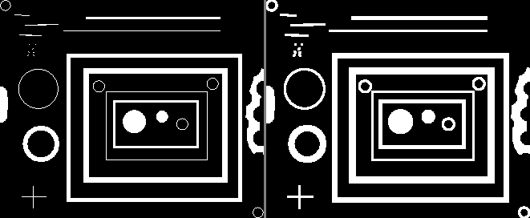
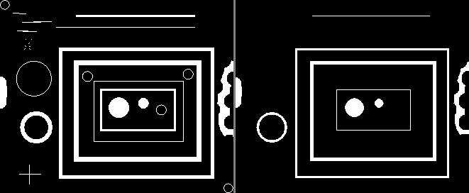
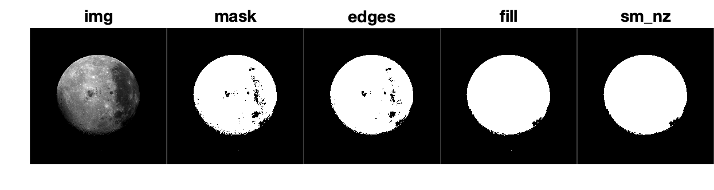

# Segmentation Clean-up

!!! abstract "For cleaning up your stuff"

## Overview

As we saw in the [previous module](ImageSegmentation.md), automatic thresholding can often get us *most* of the way to segmenting a region of interest, but often leaves some part of the region of interest unsegmented.

Fortunately, there are easy ways to clean this up, which is what this module is about.

### Things you should know

- How to use Morphological Operations to clean up the masks

- Calculate quantities, such as area and length, using image masks and simple mathematical operations

- Convert calculated quantities into real-world measurements

- Calculate the region properties of connected components using the Image Region Analyzer tool or the **`regionprops`** function

### Important Terminology

- **Morphological Operations**: Image processing that works on Regions. Examples include removing small regions from an image (noise clean-up) or changing the shapes of the regions by, for example, making them fatter or skinnier.
- **Region Properties**: The properties of said regions. Examples include area, count, roundness, etc.
- **4- or 8 -Connected Neighborhoods**: Refers to the Method of determining whether two pixels are contiguous (touching). Are their sides touching (4-connected, more restrictive)? Or are their corners touching too (8-connected, less restrictive)?

### Stuff you should read

- [Morphological operations](https://www.mathworks.com/help/images/morphological-filtering.html')
- [Types of Morphological Operations](https://www.mathworks.com/help/images/morphological-dilation-and-erosion.html)

### Functions you should know

- [bwmorph](https://www.mathworks.com/help/images/ref/bwmorph.html) - Perform a select set of morphological operations on an image
- [bwareaopen](https://www.mathworks.com/help/images/ref/bwareaopen.html') - Remove small objects from binary image
- [bwareafilt](https://www.mathworks.com/help/images/ref/bwareafilt.html') - Extract objects from binary image by size
- [imfill](https://www.mathworks.com/help/images/ref/imfill.html') - Fill image regions and holes

## Morphological Operations

Once we have created a mask, it is often useful to clean up the mask using Morphological Operations. As the name implies, morphological operations operate on the shape of a mask. These operations can change the shape of a mask or, in some cases, remove the mask entirely.

These operations depend on the concept of "touching" or "connected pixels." So, what does it mean to say that pixels are "connected"? Consider the following two diagrams:

![Connected Neighborhoods illustration][img_conn_neigh]{width=450px}

[img_conn_neigh]: images/connected_neighborhoods.png

>**Pixel Connectivity.**  **Left Panel**. In a 4-connected neighborhood, only pixels that share an edge (horizontally or vertically) are considered touching. In this definition, the Red pixels touch the white pixel, while the gray pixels do not.  A 4-connected neighborhood is a more stringent definition of touching. **Right Panel**. In an **8-connected neighborhood**, pixels that touch an edge or a corner are considered touching. In the above figure, all of the red pixels are considered to be touching the white pixel. This is the default setting.

A collection of touching pixels is known by many names: connected components, blobs, objects, or even regions. And you can have more than one blob per image mask, which are known as non-contiguous blobs.

### Basic Morphological Operations

The image processing toolbox offers many functions that manipulate connected-components based on their size, shape, or location.

These operations work using a Structuring Element, which is like a mini-mask with a specified shape like a disk or a diamond

Morphological Operations on masks can be summarized as follows

- **Dilate**: Expand the mask and shrink holes in the mask
- **Erode**: Shrink the mask and expand holes in the mask
- **Open**: Erosion followed by dilation.  Remove masks objects smaller than the structuring element
- **Close**: Dilation followed by erosion. This removes holes in the mask smaller than the structuring element

For example, the most basic operations make masks thicker (aka "dilate"):

{ width="550"}

>**Left Panel.** Original Mask. **Right Panel.** Dilated Mask

…or thinner (aka "erosion")

{ width="550"}

>**Left Panel.** Original Mask. **Right Panel.** Eroded Mask

Common matlab functions that we will use include:

- **`bwareaopen`** - used to clean up small pixel clusters.
- **`bwmorph`** - a general morphologic operations tool
- **`bwareafilt`** - filter out connected-components by size
- **`imfill`** - When used with the 'holes' input, fills any gaps (or holes) in the connected components
- **`imclearborder`** - remove connected components that touch the edges of the image

### Morph Ops Example

To clean up the mask of our moon, we could use the following morphological operations:

```matlab linenums="1" title="Threshold Moon Image and Clean-up"
p.img = moon2; % copy moon variable
p.mask = imbinarize(p.img,'adaptive','Sensitivity',1); % threshold moon

% morphological operations
p.edges  = bwmorph(p.mask,'close'); % seal the edges
p.fill = imfill(p.edges,'holes'); % fill any holes
p.sm_nz = bwareaopen(p.fill,100); % remove any small noise

% display the results
figure(visible="on");
tiledlayout("horizontal","TileSpacing","none","Padding","tight");

s = ["img" "mask" "edges" "fill" "sm_nz"]; % setsorder of display

% FOR LOOP
for n=s % runs for each field in p
    nexttile % create a new tile
    imshow(p.(n)) % display current field in p in the current tile
    title(n,Interpreter="none") % title with fieldname
end
```

{ width="550"}

>Here we display the incremental steps in the Segmentation and Mask Clean-up process. To organize all of the incrementally changing masks, we package everything in structure, *`p`*, which  then allows us to easily create a FOR LOOP that displaying all of the images. **img.** The original image. **mask.** The thresholded image (a binary image) generated using **`imbinarize`**. **edges.** The mask after **`bwmorph`** with a 'close' second input. **fill.** The mask after **`imfill`**. **ms_nz.** The mask after a **`bwareaopen**.

Notice in the code that for each the morphological operation, we input the output from the previous step. So, we are in effect daisy chain morphological operations. This is a very common procedure as each morphological operation typically only affects one aspect of the mask.
