# Texture Segmentation

!!! abstract "When color gives up, texture takes over"

## Overview

Texture is a defining characteristic of many images: think of properties like *smooth* and *rough*. If you treat pixel intensity as a surface—higher intensities as taller, lower intensities as shorter—then a rough region has more hills and valleys than a smooth one. We can measure that variation directly, using statistics like standard deviation, range, or entropy, and a region's texture can be just as useful a segmentation cue as its color. In fact, texture segmentation shines in exactly the cases where [color segmentation](ImageColorSegmentation.md) falls apart: camouflage, stripes, and anything where the object and background share the same colors but not the same roughness.

This module is broken down into the following sections:

### Things you should know

- Visualize an image's intensities as a 3D surface to build intuition for "texture"
- Explain why enhancing an image (e.g. with **`imadjust`**) can amplify noise along with signal
- Use the peak signal-to-noise ratio (**`psnr`**) to compare a filtered image to its original
- Use a line profile and a moving standard deviation to quantify texture along a single row of pixels
- Explain the difference between a range filter, a standard deviation filter, and an entropy filter
- Choose an appropriate neighborhood size and shape for a texture filter
- Build a complete texture-based segmentation pipeline: filter, binarize, clean, and overlay

### Key Terminology you should know

- **Texture**: the local variation in pixel intensity within a neighborhood
- **Neighborhood**: the block of pixels around a given pixel that a filter examines
- **Range filter**: replaces each pixel with the range (max − min) of its neighborhood
- **Standard deviation filter**: replaces each pixel with the standard deviation of its neighborhood
- **Entropy filter**: replaces each pixel with the entropy (a measure of randomness) of its neighborhood
- **Signal-to-noise ratio (SNR)**: a measure of how much a processed image has drifted from its original signal

### Key Functions

- [stdfilt](https://www.mathworks.com/help/images/ref/stdfilt.html): Local standard deviation of an image
- [rangefilt](https://www.mathworks.com/help/images/ref/rangefilt.html): Local range of an image
- [entropyfilt](https://www.mathworks.com/help/images/ref/entropyfilt.html): Local entropy of an image
- [psnr](https://www.mathworks.com/help/images/ref/psnr.html): Peak signal-to-noise ratio between two images
- [movstd](https://www.mathworks.com/help/matlab/ref/movstd.html): Moving standard deviation

---

## Visualizing Texture

We can think of texture as the surface of an image. Consider this single fluorescent spot:

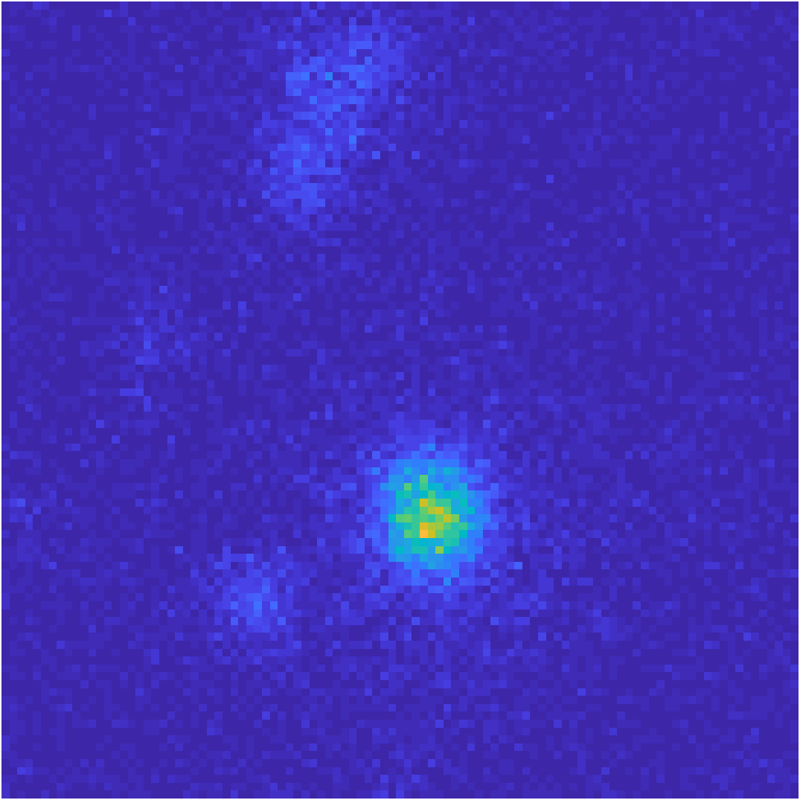{ width="350"}

Using **`meshgrid`** and **`surf`**, we can plot intensity as height, turning the image into a 3D landscape:

```matlab linenums="1" title="Plot intensity as a 3D surface"
[X,Y] = meshgrid(1:size(sted_crop,2), 1:size(sted_crop,1));
surf(X,Y,sted_crop,'EdgeAlpha',0.25);
axis image
xlabel('x position'); ylabel('y position'); zlabel("pixel intensity")
```

What happens to that landscape when we enhance the image with **`imadjust`**?

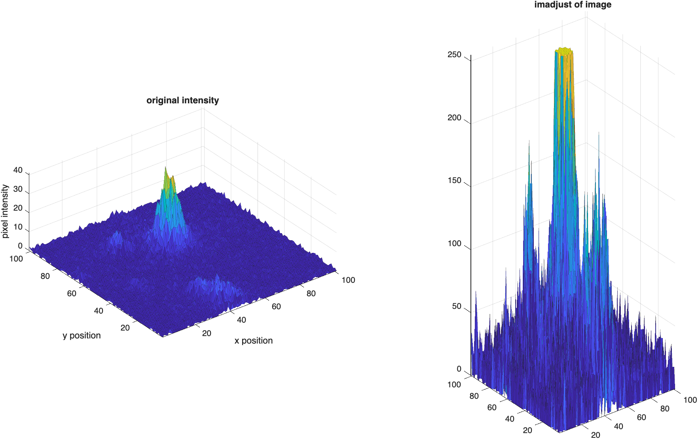{ width="650"}

>After **`imadjust`**, the bright spot has grown into a much taller peak—but so has the noise floor surrounding it, which was previously flat. Stretching the histogram increased the intensity (and therefore the "height") of *every* pixel, including the noise, and some of those noise pixels have now saturated at 255. Use **`imadjust`** wisely: it enhances signal and noise indiscriminately.

### Comparing Spatial Filters

How do different smoothing filters affect this surface? We compare an average filter, a median filter, and a Gaussian filter, and use **`psnr`** (peak signal-to-noise ratio) to measure how far each one has drifted from the original:

```matlab linenums="1" title="Compare smoothing filters in 3D"
avg_filt = fspecial("average",[3 3]);
sted_avg = imfilter(sted_crop,avg_filt,"symmetric");
sted_med = medfilt3(sted_crop);
sted_gau = imgaussfilt(sted_crop,1);

imgs = {sted_avg, sted_med, sted_gau};
ttls = ["average","median","gaussian"];

for n = 1:3
    [~,snr] = psnr(imgs{n},sted_crop);
    nexttile
    surf(X,Y,imgs{n},'EdgeAlpha',0.25)
    title(sprintf('%s, snr = %1.2f', ttls(n), snr))
end
```

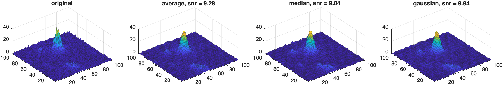{ width="650"}

>The Gaussian filter edges out the other two (SNR 9.94 vs. 9.28 and 9.04), though all three noticeably round off the peak.

The Gaussian filter's **`sigma`** controls how aggressively it smooths. A larger sigma means more smoothing—and, predictably, a bigger departure from the original image:

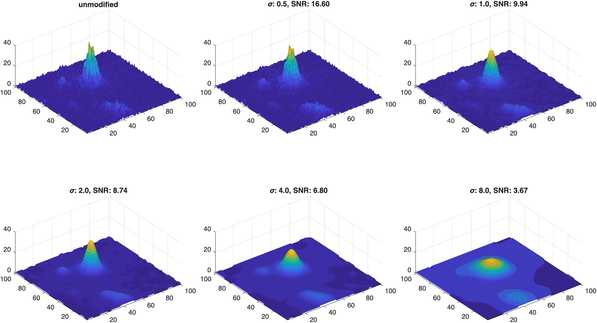{ width="650"}

>SNR drops steadily as sigma grows (16.60 → 9.94 → 8.74 → 6.80 → 3.67). Smoothing is always a trade: more blur removes more noise, but it also erases more real signal. There's no free lunch—only a choice of how much of each you're willing to give up.

## Quantifying Texture

Consider these two patches of bark:

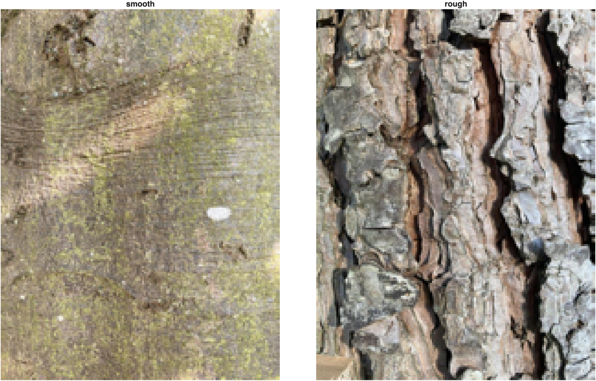{ width="450"}

Plotting each as a 3D surface doesn't tell us much on its own—both look like a tangle of peaks and valleys at this scale:

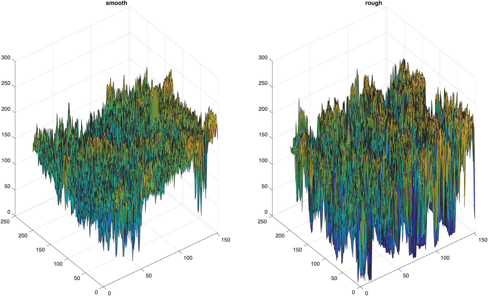{ width="650"}

>This is a case where plotting every pixel's intensity as height is too much information to interpret at a glance. We need a simpler way to compare the two.

### Line Profiles

A **line profile**—the intensity values along a single row—simplifies the comparison a lot:

```matlab linenums="1" title="Extract and plot a line profile"
img1g = im2gray(img1); % smooth bark
img2g = im2gray(img2); % rough bark

lp1 = img1g(101,:); % row 101, all columns
lp2 = img2g(101,:);

plot(lp1,'c'); hold on
plot(lp2,'m')
legend('smooth','rough')
```

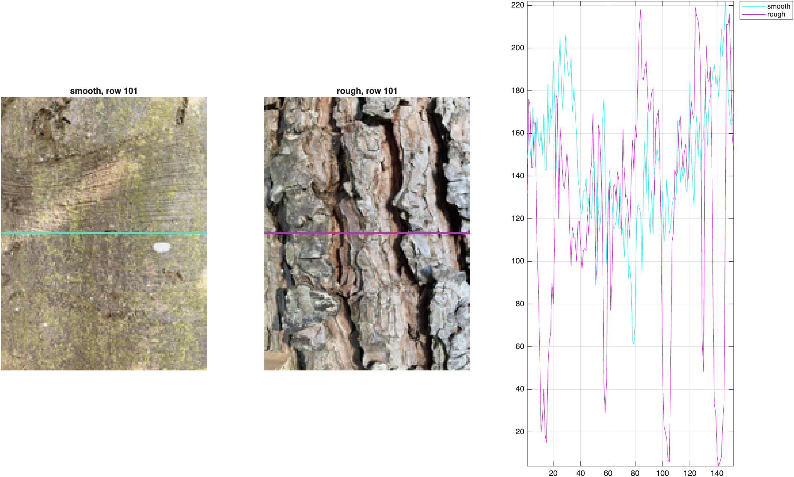{ width="650"}

>The rough bark's profile (magenta) swings much more dramatically—plunging into the dark gaps between bark plates and spiking back up—while the smooth bark's profile (cyan) stays in a tighter band.

### Moving Standard Deviation

**`movstd`** calculates a standard deviation over a sliding window, turning the line profile itself into a texture signal:

```matlab linenums="1" title="Moving standard deviation of each profile"
lp1STD = movstd(single(lp1),5); % window of 5 elements
lp2STD = movstd(single(lp2),5);

plot(lp1STD,'c'); hold on
plot(lp2STD,'m')
ylabel('Moving Standard deviation')
```

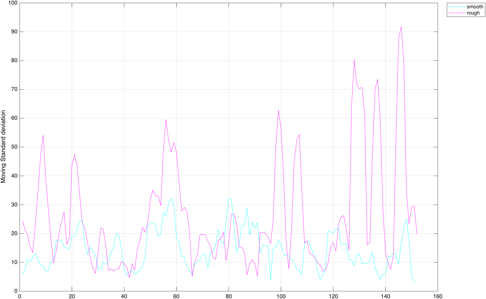{ width="650"}

```matlab title="result"
mean std smooth: 14.32
mean std rough:  26.57
```

>The rough bark's moving standard deviation is nearly double the smooth bark's, on average—and it spikes far higher at the deep bark fissures. This gives us a single number that captures "how textured" a region is.

### Types of Texture Filters

Instead of computing this one row at a time, we can run the same idea over an entire 2D neighborhood around *every* pixel. There are three common texture filters:

- **Range filter** (**`rangefilt`**): replaces each pixel with the range of its neighborhood
- **Standard deviation filter** (**`stdfilt`**): replaces each pixel with the standard deviation of its neighborhood
- **Entropy filter** (**`entropyfilt`**): replaces each pixel with the entropy (a measure of randomness) of its neighborhood

Each one looks at a neighborhood around a pixel and reduces it to a single number describing the texture there.

## Example: Flatfish

Consider this photo of a flatfish resting on sand:

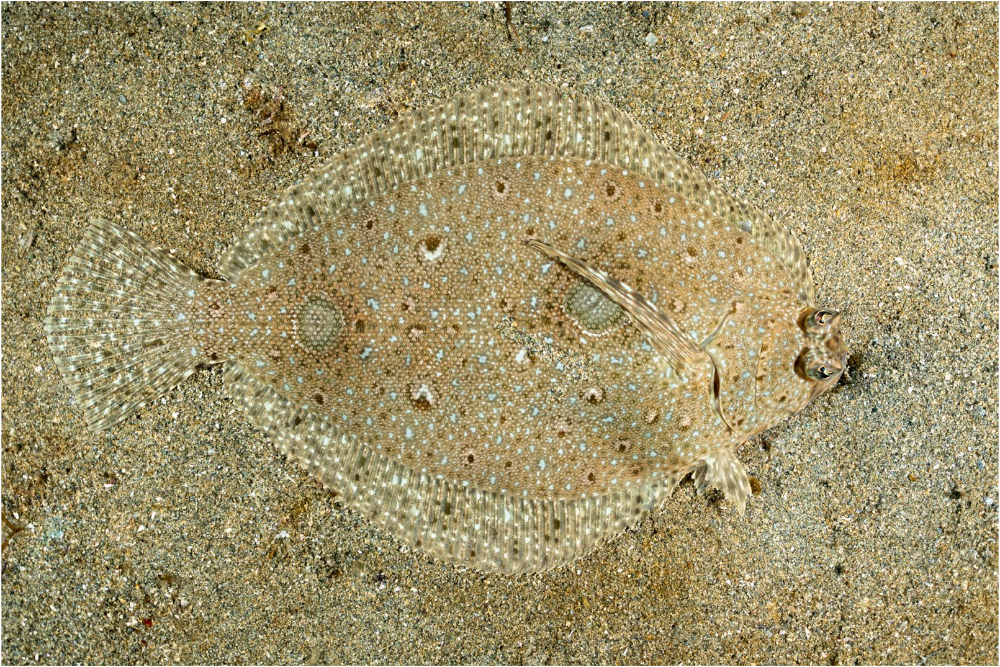{ width="550"}

This would be difficult to segment by color—the fish is camouflaged to match its surroundings. But the fish's speckled pattern looks a little coarser than the sand's. Is there a difference in texture? Let's try all three filters on the grayscale image and compare:

```matlab linenums="1" title="Compare texture filters on the flatfish"
p.gray = im2gray(p.rgb);
p.std = rescale(stdfilt(p.gray));   % stdfilt returns double, so rescale to 0-1
p.rng = rangefilt(p.gray);          % already returns the same class, no rescale needed
p.ent = rescale(entropyfilt(p.gray));

mmShowStruct(p,"fn2display",["rgb" "std" "rng" "ent"])
```

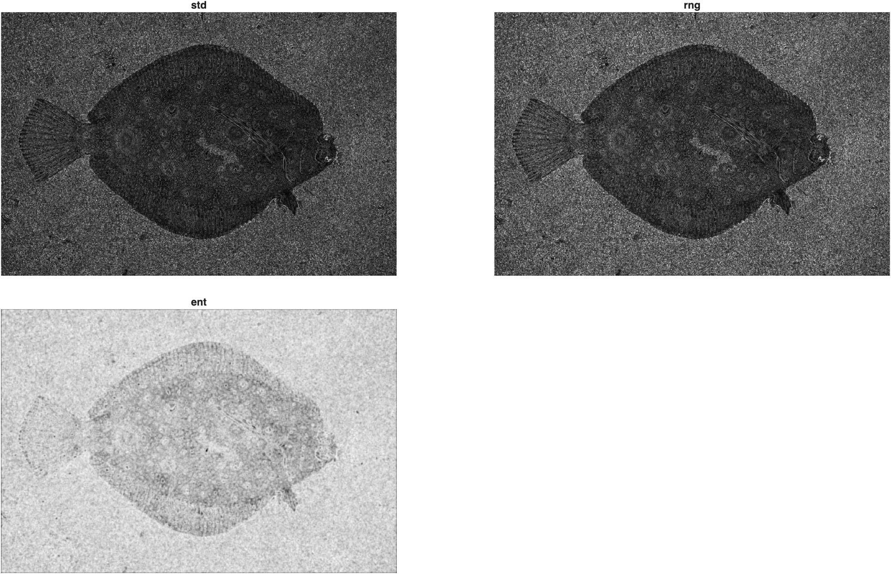{ width="650"}

>All three filters silhouette the fish clearly against the sand—its scattered texture pattern is coarser than the sand's fine, uniform grain. The standard deviation and range filters produce almost identical results here; entropy is a bit lower-contrast but still shows the outline.

### Binarizing and Cleaning the Mask

Since the fish reads as *darker* than the background in the std-filtered image, we complement it first so the fish becomes the foreground:

```matlab linenums="1" title="Binarize the standard deviation filter"
p.complement = imcomplement(p.std);
p.mask = imbinarize(p.complement);
```

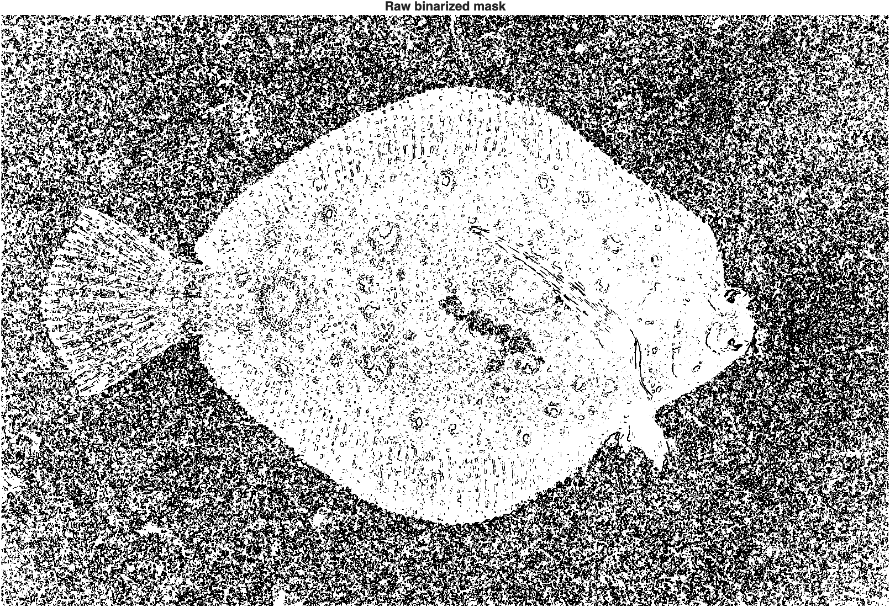{ width="550"}

>A little messy—the background sand still has enough fine-grained texture variation to generate a lot of salt-and-pepper noise.

Let's try smoothing the std-filtered image before binarizing, with two different filters:

```matlab linenums="1" title="Smooth before binarizing: median vs. Gaussian"
p.stdMed = medfilt2(p.std);
maskMed = imbinarize(imcomplement(p.stdMed));

p.stdGau = imgaussfilt(p.std,3);
maskGau = imbinarize(imcomplement(p.stdGau));
```

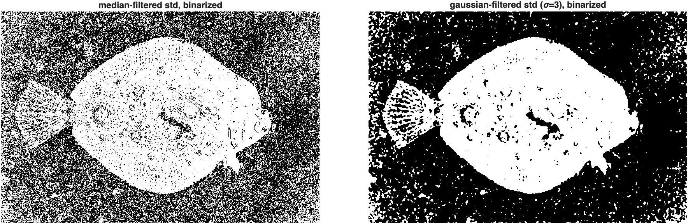{ width="650"}

>At first glance, the median-filtered mask (left) looks like the clear winner—the background is nearly spotless. But that's deceptive: a 3×3 median filter treats *any* small cluster of bright pixels as noise to be erased, and that includes the fine texture speckles that make up the fish's own pattern, not just the real background noise. The Gaussian-filtered mask (right) looks noisier at this stage, but a Gaussian blur doesn't selectively delete small bright regions—it smooths them together with their neighbors, which preserves the overall "this area is textured" signal.

The difference becomes obvious once we run both through identical cleanup steps:

```matlab linenums="1" title="Clean both candidate masks the same way"
maskMedClean = imclearborder(maskMed);
maskMedClean = imfill(maskMedClean,'holes');
maskMedClean = bwareaopen(maskMedClean,3000);

maskGauClean = imclearborder(maskGau);
maskGauClean = imfill(maskGauClean,'holes');
maskGauClean = bwareaopen(maskGauClean,3000);

fprintf('median path area: %d\n', sum(maskMedClean(:)));
fprintf('gaussian path area: %d\n', sum(maskGauClean(:)));
```

```matlab title="result"
median path area: 11687
gaussian path area: 629302
```

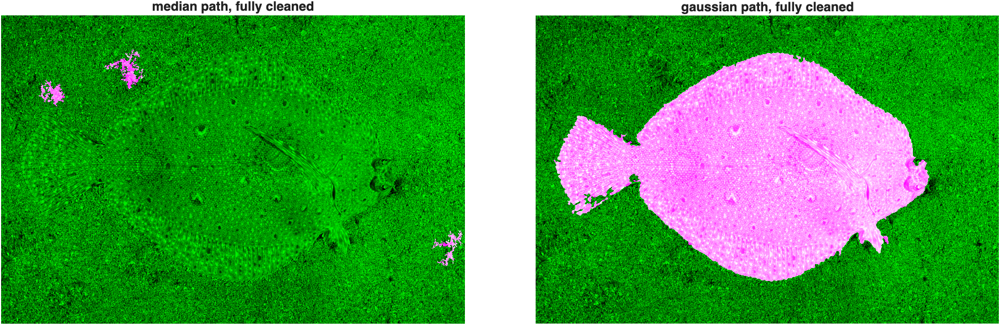{ width="650"}

>The median path collapses to a few tiny fragments (barely 12,000 pixels total)—nearly the entire fish was erased along with the noise. The Gaussian path survives cleanup as a single, solid, accurate silhouette of the fish (over 600,000 pixels). The lesson: a filter that looks cleaner isn't necessarily preserving the right signal. Always check what survives the *full* pipeline, not just the next step.

Continuing with the Gaussian-filtered mask:

```matlab linenums="1" title="Final cleanup"
p.mask = imbinarize(imcomplement(imgaussfilt(p.std,3)));
p.mask = imclearborder(p.mask); % clear border
p.mask = imfill(p.mask,'holes'); % fill holes
p.mask = bwareaopen(p.mask,3000); % clean up small noise
```

We can visualize the result either by burning a solid color into the mask region, or by drawing just its outline:

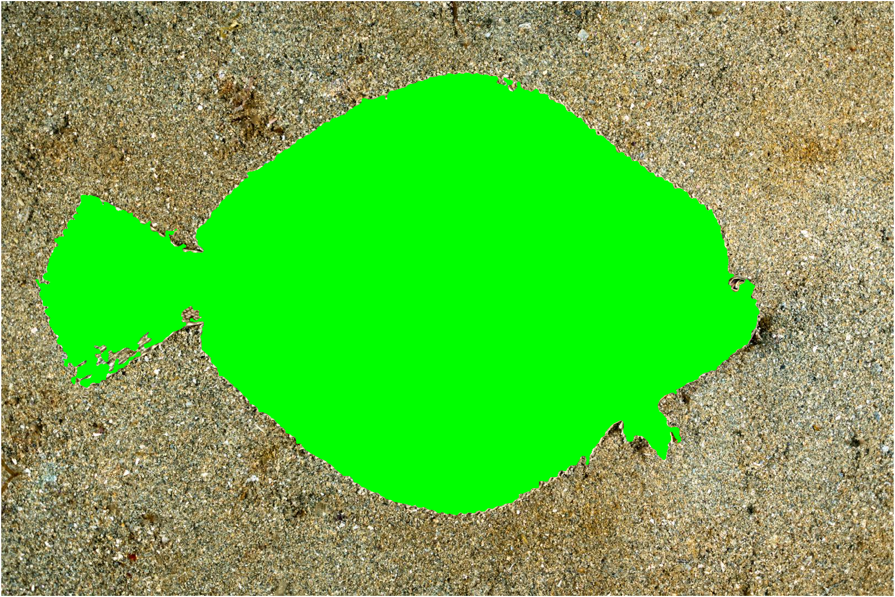{ width="550"}

```matlab linenums="1" title="Outline instead of a solid burn"
outline = boundarymask(p.mask);
mmShowBurnImage(p.rgb, outline, color='magenta')
```

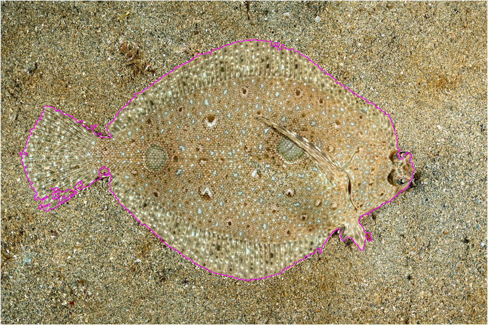{ width="550"}

>Pretty, pretty good—the outline tracks the fish's body closely, including the thin tail fin.

## Example: Zebras

An area with stripes has pixels with both very small and very large intensities nearby—a kind of texture that a **range filter** is well-suited to detect:

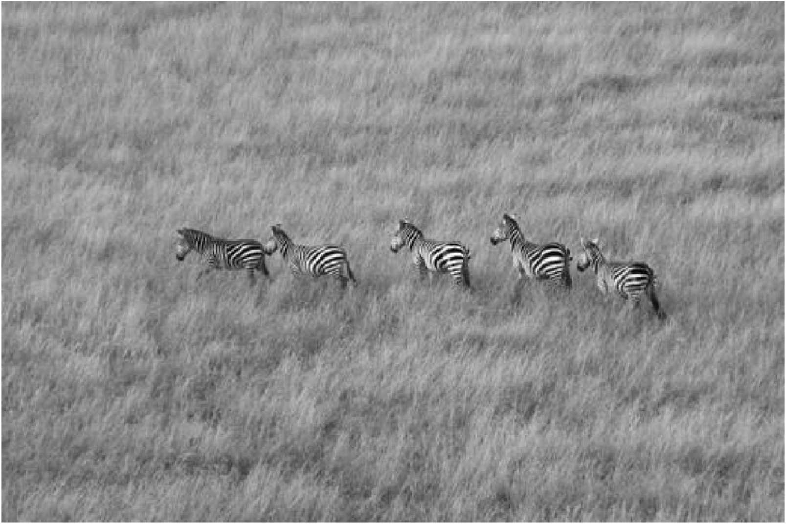{ width="550"}

The size of the filter's neighborhood matters a great deal. The default is 3-by-3:

```matlab linenums="1" title="Range filter with three neighborhood sizes"
p.rng3 = rangefilt(p.gray);          % default 3x3
p.rng7 = rangefilt(p.gray, true(7));
p.rng15 = rangefilt(p.gray, true(15));
```

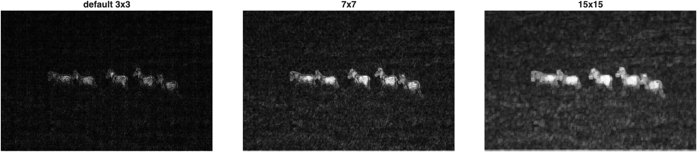{ width="650"}

>The default 3×3 neighborhood is too small: it fits entirely within a single stripe in places, so those pixels register no variation at all—notice the dark gaps inside the zebras. A 15×15 neighborhood is too large: entire zebras blow out into solid, clunky blobs that would oversegment the image. The 7×7 neighborhood is the sweet spot, cleanly tracing each animal's body.

Binarizing the 7×7 result gives a solid, if imperfect, zebra mask:

```matlab linenums="1" title="Binarize the 7x7 range filter"
p.mask = imbinarize(p.rng7);
```

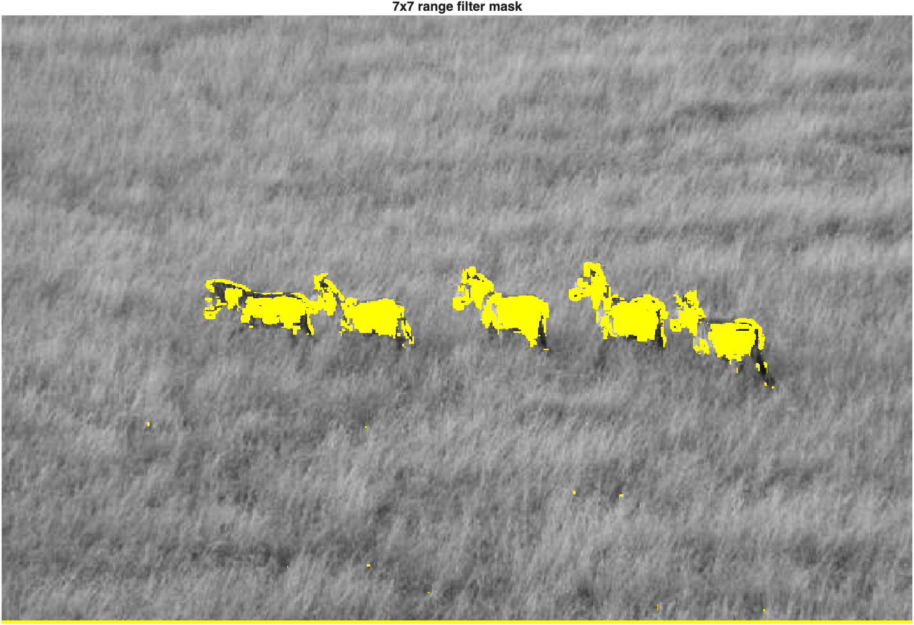{ width="650"}

>The zebras are captured well, but notice the bright line of false positives running along the very bottom edge of the image, plus a few scattered specks in the grass. **`imclearborder`** would clean up the edge artifact; **`bwareaopen`** would handle the stray specks.

### Custom Neighborhood Shapes

A neighborhood doesn't have to be a square. You can build any shape with **`true`** and logical indexing:

```matlab linenums="1" title="Rectangular and X-shaped neighborhoods"
nHoodRect = true(7,15);           % wide rectangle
p.maskRect = imbinarize(rangefilt(p.gray, nHoodRect));

nHoodX = true(3);                 % 3x3, corners and center only
nHoodX([2 4 6 8]) = false;
p.maskX = imbinarize(rangefilt(p.gray, nHoodX));
```

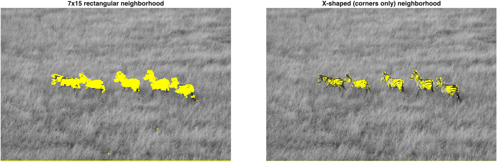{ width="650"}

>The wide rectangular neighborhood (matched to the zebras' horizontal stripe orientation) produces fuller, blockier bodies. The X-shaped neighborhood—which only samples the four corners and center of a 3×3 block—traces the individual stripes in finer detail instead of filling in solid blobs. Neighborhood shape, not just size, changes what a texture filter actually responds to.

## Example: Snow Ferret

This is about as hard a camouflage case as it gets—white fur against white snow:

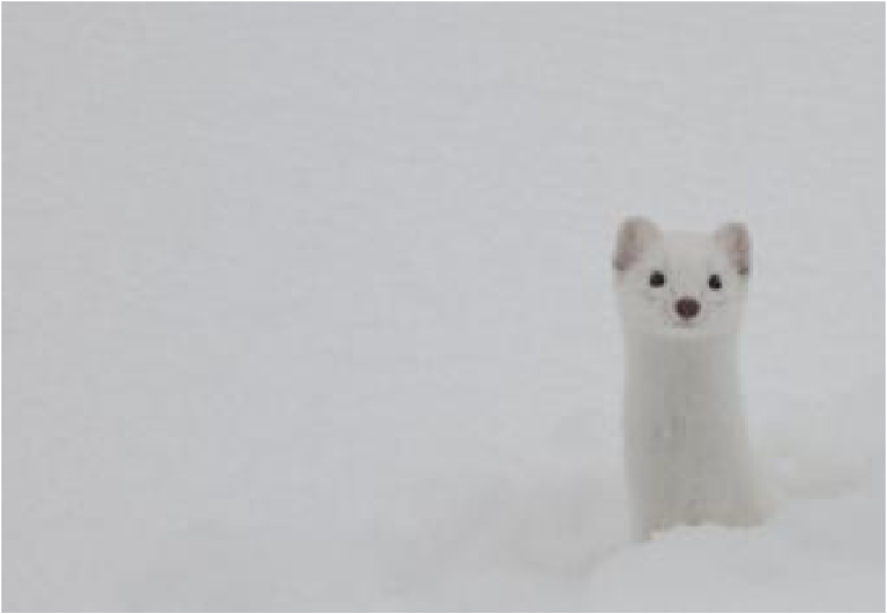{ width="450"}

Applying all three filters with a larger, 19×19 neighborhood:

```matlab linenums="1" title="Compare texture filters with a 19x19 neighborhood"
p.gray = im2gray(p.rgb);
p.std = rescale(stdfilt(p.gray,true(19)));
p.rng = rangefilt(p.gray, true(19));
p.ent = rescale(entropyfilt(p.gray,true(19)));

mmShowStruct(p)
```

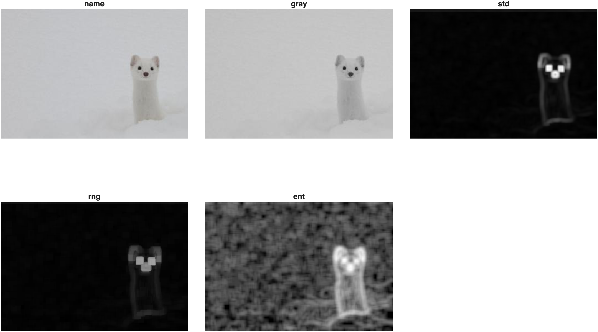{ width="650"}

>This time, standard deviation and range only pick out the ferret's high-contrast facial features (eyes, nose, ear edges)—the body itself is too uniformly white to register on either filter. The **entropy filter**, however, captures the ferret's entire body, not just its face: even subtle texture differences between fur and snow register as a difference in local randomness.

Following the entropy filter with a median filter, binarizing, and cleaning up:

```matlab linenums="1" title="Segment the ferret from its entropy map"
p.entf = medfilt2(p.ent,[7 7]);
p.mask = imbinarize(p.entf);
p.mask = bwareaopen(p.mask, 1000);
p.mask = imfill(p.mask, 'holes');

imshowpair(p.rgb,p.mask,'blend')
```

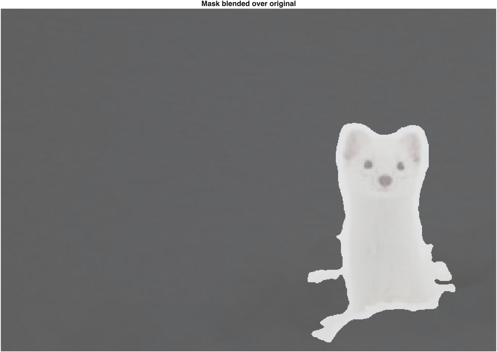{ width="550"}

>A clean, accurate silhouette of the ferret, recovered entirely from texture—no color information was involved at any step.

### A Course Function to Review Textures

Since generating and comparing all three texture filters is such a common first step, the course function **`mmGetTextureFilters`** automates it:

```matlab linenums="1" title="Generate all three texture filters at once"
p.name = "snow.png";
p.rgb = imread(p.name);

p = mmGetTextureFilters(p,true(7)); % adds gray, std, rng, and ent fields
mmShowStruct(p)
```

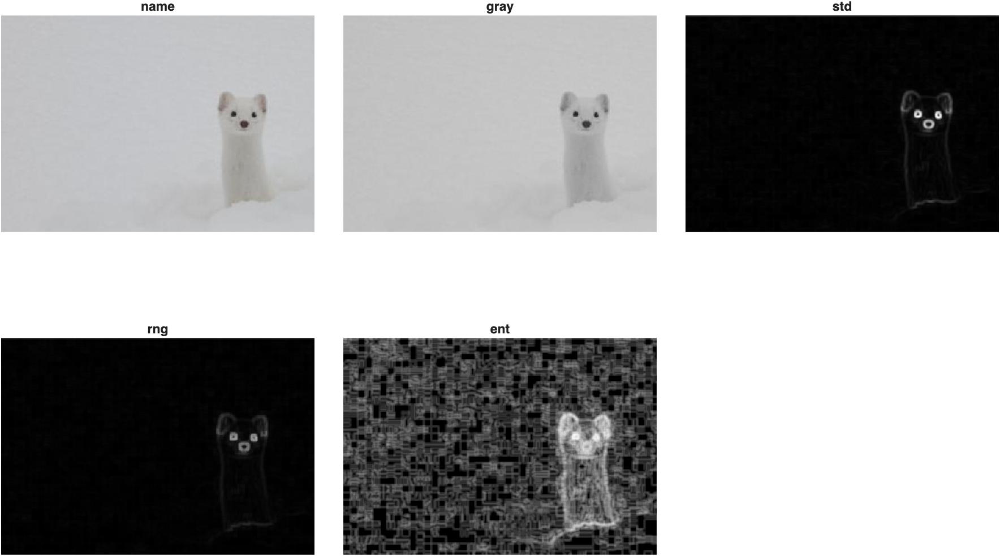{ width="650"}

>With the smaller 7×7 neighborhood (instead of the 19×19 used above), the entropy map takes on a blockier, more quilted appearance—the same "entropy reveals the ferret's whole body" pattern is still there, just coarser.

## Challenge

??? question "Would the entropy filter work better than the range filter on the zebras?"

    === "Question"

        The range filter did a nice job finding the zebras earlier. Entropy found the whole snow ferret when range and standard deviation could only find its face. Would entropy do an even better job on the zebra image? Try an entropy filter on the zebras with a 7×7 neighborhood, binarize it, and compare to the range filter result.

    === "Answer"

        ```matlab linenums="1" title="Try the entropy filter on the zebras"
        p.ent7 = rescale(entropyfilt(p.gray, true(7)));
        p.maskEnt = imbinarize(p.ent7);
        ```

        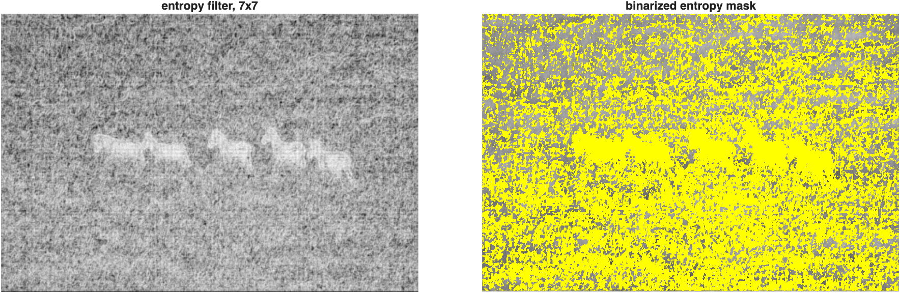{ width="650"}

        Entropy actually does *worse* here—the zebras barely stand out from the grass in the entropy map, and binarizing produces a mess with no clean separation. The grass is full of fine, irregular blades pointing every which way: visually busy, but genuinely **random**, which is exactly what high entropy measures. The zebra stripes, by contrast, are **highly ordered**—regularly alternating black and white—which drives up the *range* at each pixel without necessarily driving up randomness. There's no universally "best" texture filter: range looks for big swings between light and dark, standard deviation looks for overall spread, and entropy looks for disorder. Picking the right one means understanding what kind of texture distinguishes your object from its background in the first place.

Congratulations, you have made it to the end! 🦓
