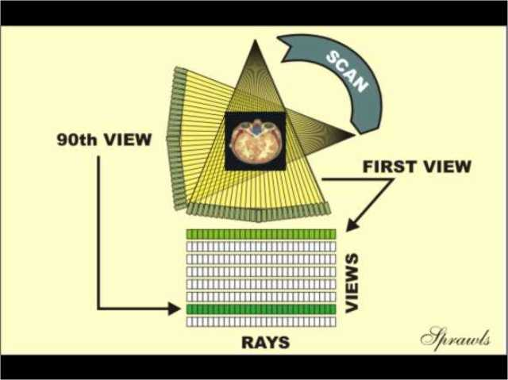
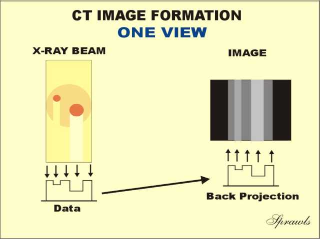
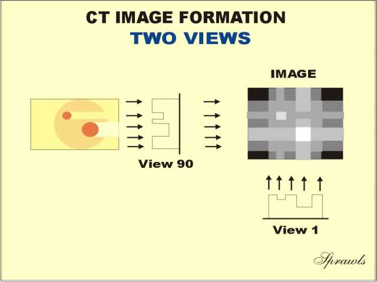
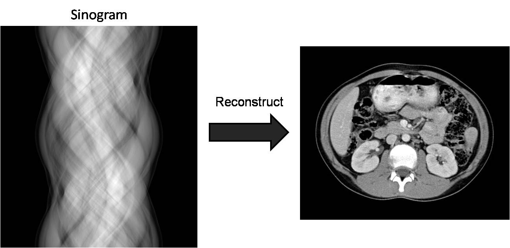
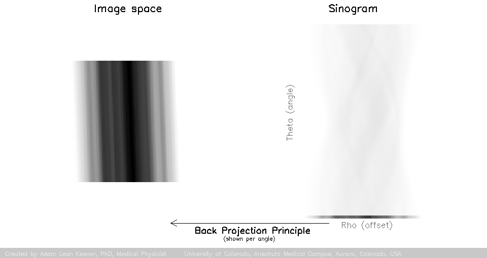

# Computed Tomography Overview

## Important Terminology

| Term                         | Definition                                                   |
| ---------------------------- | ------------------------------------------------------------ |
| **Tomography**               | Creating a virtual cross section through a human body or other solid object using any kind of penetrating wave  (typically X-rays or ultrasound) |
| **CT**                       | Computed Tomography or  Computed Axial Tomography (CAT scan): the process of using multiple X-ray images taken across multiple angles to produce tomographic slices. Computations are used to generate the tomographic slices |
| **Radon Transformation**     | Used to compute the linear projections of an image matrix along specified directions. |
| **Sinogram**                 | A visual representation of the raw data obtained in a computed axial tomography (CT) scan |
| **Filtered Back projection** | The process of deblurring and reconstructing a 2D image from the sinogram captured during the CT scanning process |

{width=250px}
> **Illustration of a tomograph**. S1 and S2 are the tomographic cross-sections. P is the projection

## Important Resources

- [Basic CT intro - Sprawls CT tutorial](http://www.sprawls.org/resources/CTIMG/module.htm#1)

- [More detailed discussion of Tomography and CT](http://tomroelandts.com/articles/tomography-part-1-projections)

- [Wikiradiography](http://www.wikiradiography.net)

## CT Sinogram

CT captures radon transform data which is often called a sinogram because the Radon transform of an off-center point source is a sinusoid. Each horizontal line of a sinogram is a (1D) projection of that (2D) slice in that direction. 

{ width="450"}

For each angle, a projection (or line integral) is captured. This line integral represents the sum of the *density* of the object in a given direction. Therefore, brightness corresponds with the sum of the radiographic density of objects being scanned

To visualize the scanned cross-section, the data must be computationally reconstructed into an image from the sonogram. This process is known as a **back projection** (or inverse radon transformation).

{ width="450"}

{ width="450"}

{ width="450"}
> Final 2D recreation of the object from the sinogram  

<!-- { width="450"}
CT Scans typically employ a filtered background projection to correct for blurring. 
{ width="450"} -->

## Hounsfield units

The **Hounsfield unit** is a dimensionless unit used in computed tomography (CT) to measure the radiodensity of a tissue. The units are calibrated so that air is -1000 and water is 0, using the following formula:

\(HU=\frac{(\mu _{material}-\mu _{water})}{\mu _{water}}\times 1000\)

Where:

- \(\mu _{material}\) is the linear attenuation coefficient of the tissue being measured.
- \(\mu _{water}\) is the linear attenuation coefficient of distilled water. 

Values typically range from -1000 to 1000. Higher Hounsfield values correspond to denser materials, making them appear brighter on a CT scan, while lower values appear darker. HU values are widely used in clinical practice for tissue differentiation, helping radiologists distinguish between different types of tissue and pathology.

The following is a table HU for common tissues and substances:

| Substance              | HU                |  
| :--------------------- | :---------------: |  
| Air                    | −1000             |
| Lung                   | −500              |
| Fat                    | −100 to −50       |
| Water                  | 0                 |
| CSF                    | 15                |
| Kidney                 | 30                |
| Blood                  | +30 to +45        |
| Muscle                 | +10 to +40        |
| Grey matter            | +37 to +45        |
| White matter           | +20 to +30        |
| Liver                  | +40 to +60        |
| Soft Tissue, Contrast  | +100 to +300      |
| Bone (cancellous)      | +700              |
| Bone (cortical)        | +3000             |
