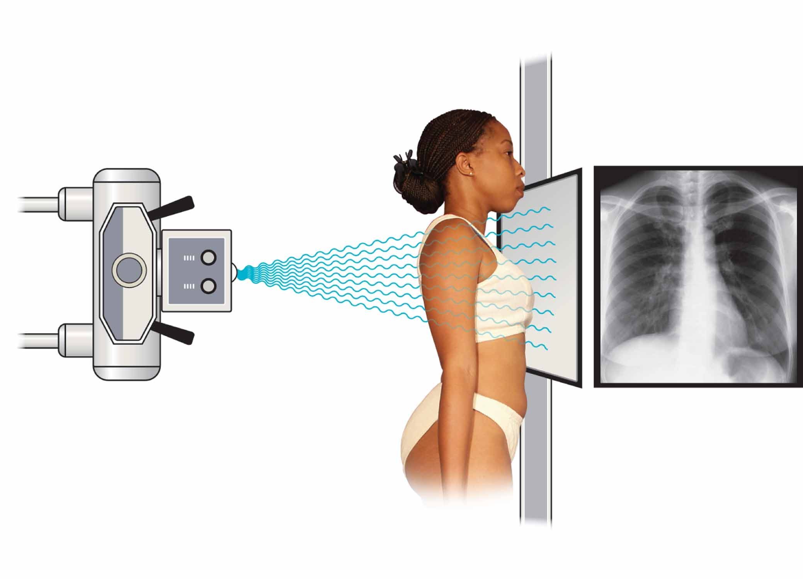
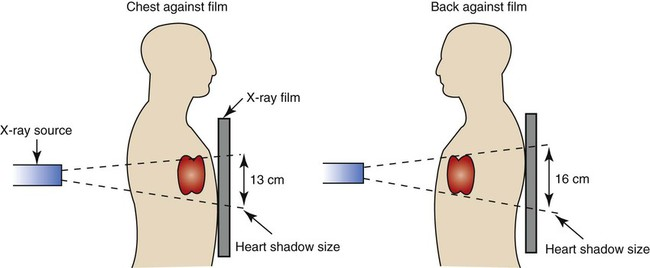
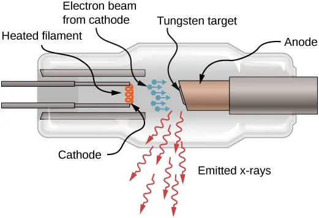
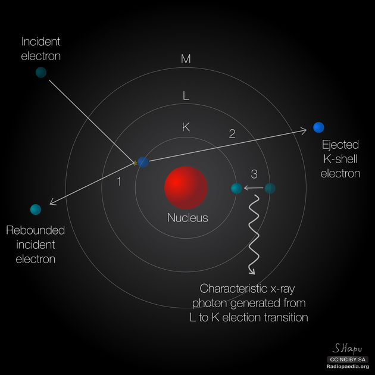
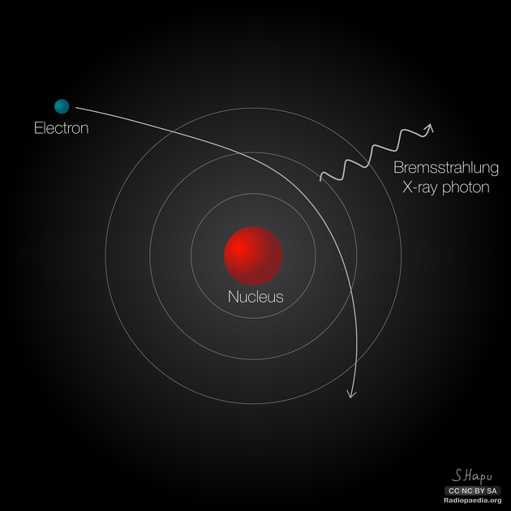
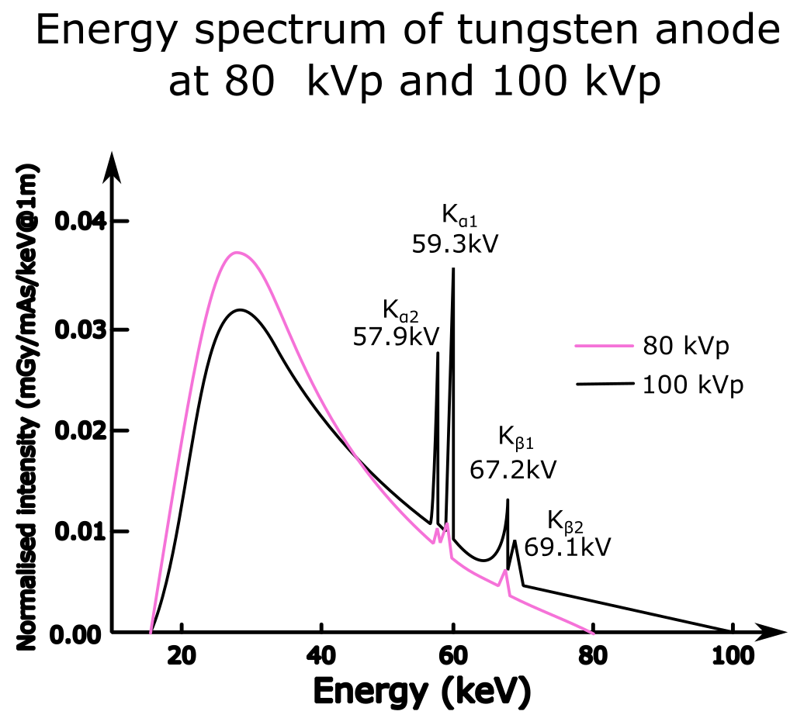
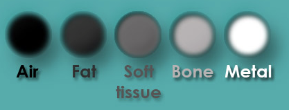
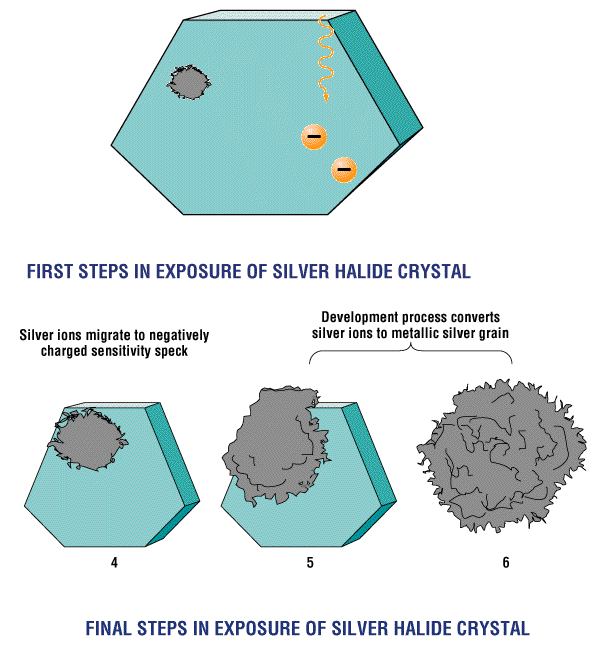
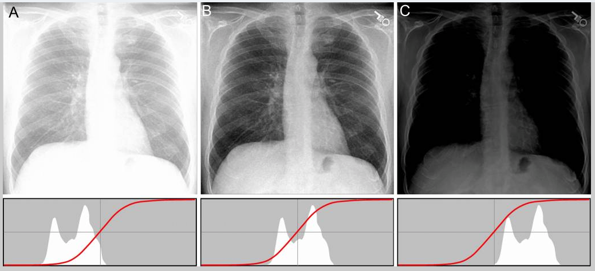
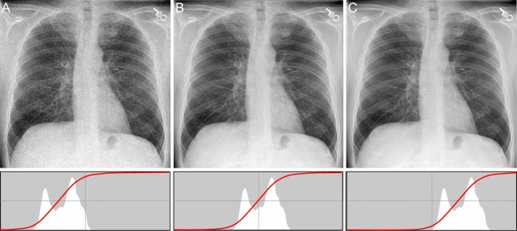

# Radiography

Radiography uses X-rays or electromagnetic radiation to generate internal images of the body, typically for medical examination. Or sizing shoes...

{ width="350"}

## Useful Links

- [Radiology Master Class](https://www.radiologymasterclass.co.uk)
  - [Basics of X-ray Physics](https://www.radiologymasterclass.co.uk/tutorials/physics/x-ray_physics_introduction)  

  - [Chest X-ray anatomy](https://www.radiologymasterclass.co.uk/tutorials/chest/chest_home_anatomy/chest_anatomy_start)  

  - [Abdominal X-ray](https://www.radiologymasterclass.co.uk/tutorials/abdo/abdomen_x-ray/anatomy_introduction)  

- [Radiopaedia](https://radiopaedia.org/?lang=us) - Radiology Reference
- [Sprawls.org](http://www.sprawls.org/resources/DIGPROCESS/module.htm#beginning) - Learning Module of Digital Image Processing of Radiographic Images

## Radiographs - the very basics

Radiographs are images created using X-rays. X-rays are a form of electromagnetic radiation, with the same properties as visible light, but differing in wavelength:

![Electromagnetic spectrum showing wavelength and photon energy of X-rays and gamma rays][XREM]{width=500px}

[XREM]: images/EMR-spectrum.png

### Radiographs are Projections

Similar to your shadow generated by the sun, a radiograph is a 2D projection of a 3D volume.

{ width="450"}

So, the way you are positioned between the X-ray tube and the detector affects how the radiograph will look. Just like the position of the sun affects your shadow.

{ width="450"}

### Generating X-rays

X-rays are generated using an [X-ray tube](https://openstax.org/books/university-physics-volume-3/pages/8-5-atomic-spectra-and-x-rays). No external radioactive material is involved.

{ width="450"}

To generate X-rays, a small increase in the **filament voltage** results in a large increase in tube current, which accelerates high-speed electrons from the very high-temperature filament **negative cathode** within a vacuum, towards a positive **tungsten target anode**. This anode rotates to dissipate heat generated. X-rays are generated within the tungsten anode and an **X-ray beam** is directed towards the patient.

X-rays are generated by the interaction of electrons around the tungsten atoms that make up the anode.

#### Characteristic X-ray generation

Sometimes, these electrons crash into each other and cause an X-ray photon to be released in the process. This is known as Characteristic X-ray generation. 

{ width="450"}

When a high energy electron collides with an inner shell electron both are ejected from the tungsten atom leaving a 'hole' in the inner layer. This is filled by an outer shell electron with a loss of energy emitted as an X-ray photon.

#### Bremsstrahlung/Braking X-Ray Generation

Most of the time, the electrons emitted by the cathode simply wiz by the nucleus.

{ width="450"}

When an electron passes near the nucleus it is slowed and its path is deflected. Energy lost is emitted as a bremsstrahlung X-ray photon. Bremsstrahlung = Braking Approximately 80% of the population of X-rays within the X-ray beam consists of X-rays generated in this way.

#### X-Ray Spectrum

{ width="450"}

The above image shows the spectrum produced by X-ray tube. The continuous spectrum indicates the bremsstrahlung x-rays, while the peaks indicate the characteristic x-rays. Case courtesy of Raymond Chieng (Case [rID: 176014](https://radiopaedia.org/cases/176014?lang=us))

### Creating Images from X-rays

Similar to light images, the intensity values found in a **radiograph** (an image created from x-rays) represent the amount of X-rays that reach the X-ray detector (e.g. film, cassette, digitizer, etc). But in contrast to light images, the look-up table in a radiograph is typically inverted. That is, the brightest areas in the radiograph represent the regions that received the fewest amount of X-rays, while darkest areas represent areas that received the most X-rays.

#### Attenuation

Depending on their energy, X-rays passing through a body can either freely pass through, be absorbed, or be scattered. This interaction with the matter in a body is measured by the [Attenuation Coefficient](https://radiopaedia.org/articles/attenuation-coefficient?lang=us), which is a measure of how much the x-ray is weakened by the material it is passing through. Because different tissues in a body attenuate x-rays differently, a radiograph is in effect a grayscale map of x-ray attenuation.

This is also known as x-ray tissue densities, and there are [5 main densities](https://www.radiologymasterclass.co.uk/tutorials/physics/x-ray_physics_densities)

{ width="450"}

Low density material such as air is represented as black on the final radiograph. Very dense material such as metal or contrast material is represented as white. Bodily tissues are varying degrees of grey, depending on density, and thickness. So, in a radiograph, bone and metal tends to be brighter than.

These tissue density standards are based on the historic properties of x-ray film, which used silver halide ions to detect x-rays. X-ray Film is naturally transparent, but exposure to X-ray energy makes film more opaque. When these films were placed on light table, the transparent areas (the areas where the x-rays were mostly blocked, like bone) appeared brighter.

## Intensity Conventions

Bone blocks the most X-rays but is given a high intensity (appears bright) on the radiograph, which may seem counterintuitive if you are unfamiliar with radiology conventions. These conventions are based on the properties of film development: bone appears white and air appears black on radiographs because bone blocks X-rays (preserving film transparency) while air allows X-rays to expose the film (making it darker).

!!! abstract "Film Development of yore"

    { width="450"}

    - Radiology Film before exposure is transparent

    - Exposure to X-ray energy breaks bonds between silver and halides

    - Silver-ions are then free to be removed (via chemical washes), leaving behind large silver particles

### Radiology Grayscale Conventions based on properties of film on a light table

- Optical Density is logarithmically proportional to Silver particles (more silver, more dense to light)

- Bone blocks radiation, so fewer silver ions are released and less silver is deposited; this results in bone-shadows being more transparent on the film.

On a light table:

- Bone appears white because light can shine through the clear areas where the bone preserved the transparent nature of the film.

- Air is black because x-ray easily passes through air and exposes more of the film, creating more silver grains in that area, and increasing the opacity.

### Proper Windowing of an X-ray image

The windowing (or gray-level mapping) greatly affects the contrast of an x-ray.

{ width="450"}

>**X-rays and their corresponding histograms**. A is overexposed, B is just right, and C is underexposed. Notice how the histograms below the images shift with the exposure. Also notice that the exposure is the opposite from what we are used to seeing. Underexposed is "brighter" than overexposed. Adapted from [The standardized exposure index for digital radiography.](http://www.ncbi.nlm.nih.gov/pmc/articles/PMC3076558/)

We can adjust the exposure of the images through proper windowing:

{ width="450"}

>Here the windowing (or gray-level mapping) of the images, as indicated by the position of the red lines, improves the image contrast.
