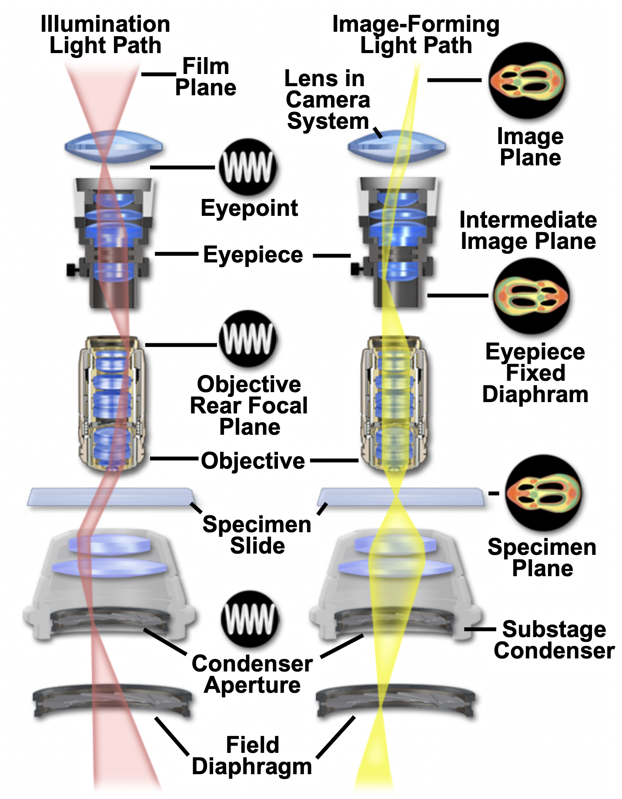

# Digital Microscopy

Adapted from [Nikon's MicroscopeU Source for Microscopy Education](https://www.microscopyu.com)

## Modern Microscope Configurations

Modern microscopes are complex (and quite pricey).

{ width="450"}
>Adapted from [The Microscope Optical Train, MicroscopyU](https://www.microscopyu.com/microscopy-basics/components)

### Microscope Lens

The main innovation in these modern microscopes are a trio of lenses:

- **Objective Lens**: The lens closest to the specimen (or object) being imaged. This lens projects the image to infinity *(and beyond)*.
- **Tube Lens**: This lens focuses parallel ray bundles and produces an intermediately magnified image.
- **Eyepiece**: The lens closest to the eye. This lens also acts as an additional magnifier.

{ width="450"}

>As shown above, the lens configuration has an Infinity "afocal" space between the objective and the tube lens. This creates Infinity-Corrected Microscope Conjugate Field Planes, which basically means that there is a parallel light beam running through the middle of the system. This set-up allows additional components, such as beam splitter or a prism, to be added to the light path.  Light focused by the objective produces an image at I(3) (the intermediate image) that is further magnified by the eyepiece to produce an image on the retina at I(4). Adapted from [Infinity Microscopes](https://www.microscopyu.com/tutorials/infinitymicroscope).

Because of this modular setup, a modern microscope has the ability to magnify up to 1000X.

## Objective Lens

Microscope objectives are the lens closest to the specimen (the object). They are probably one of the most important components of an optical microscope. They form the primary image and basically determine the quality of images that can be produced. Objectives also determine the magnification of a particular specimen and the achievable resolution. The many glass elements of an objective help correct for primary optical aberrations, such as chromatic aberrations or curvature of field.

{ width="450"}

>Shown here is a 60x oil immersion with a Numeric Aperture of 1.4. It has corrections for Curvature of Field (Plan) and Chromatic Aberrations (Apo), aka apochromat. And, the lens is capable of Differential Interference Contrast (DIC). It has all these properties and capabilities because of the 15 optical elements cemented together into multiple groups. Even though there is more than one lens in an objective, they are collectively referred to as the objective lens. [Intro to Microscope Objectives](https://www.microscopyu.com/microscopy-basics/introduction-to-microscope-objectives)

### Curvature of Field

{ width="450"}

>When visible light is focused through a curved lens, the image plane produced by the lens will be a curved Petzval surface. This is why eyeballs are balls (i.e. have curved surfaces). Plan Objective lenses correct for this curvature. Adapted from [Curvature of Field, MicroscopeU.](https://www.microscopyu.com/tutorials/curvatureoffield)

### Chromatic Aberrations

{ width="450"}

>Simple lenses refract different wavelengths of light at slightly different angles (dispersion). Effectively, this means that different colors of light are not brought into common focus. A specialized achromat doublet lens helps correct for this aberration and focuses light of two different wavelengths to the same location (just the blue and red light, in this example). There are also Apochromatic lenses (not shown) that can correct the chromatic aberrations from 3 wavelengths of light (Blue, Red, and Green). Adapted from [Chromatic Aberrations, MicroscopeU.](https://www.microscopyu.com/tutorials/chromatic)

### Resolution

- [Resolution](https://www.microscopyu.com/microscopy-basics/resolution)
- [The Diffraction Barrier](https://www.microscopyu.com/techniques/super-resolution/the-diffraction-barrier-in-optical-microscopy)

The resolution of an optical microscope is defined as the shortest distance between two points on a specimen that can still be distinguished by the observer or camera system as separate entities. Point sources of light generate blurry Airy disks, as shown below. In this example, resolution is defined by the ability to distinguish two airy disks as separate ("Resolution Limit") and not blurred together ("Unresolved").

{ width="450"}

>When imaging a point source of light, diffraction causes it to appear as a blurred spot known as an Airy disk, which has a bright center surrounded by fading rings.

**Rayleigh Criterion:** Two point sources observed in the microscope are regarded as being resolved when the principal diffraction maximum (the central spot of the Airy disk) from one of the point sources overlaps with the first minimum (dark region surrounding the central spot) of the Airy disk from the other point source.

### Numeric Aperture (NA)

An objective lens’s ability to gather light and resolve detail. Numerical Aperture is a value (often symbolized by the abbreviation NA) originally defined by Abbe for microscope objectives and condensers. It is given by the simple expression:

$$NA=n*sin(\alpha)$$

>In this equation, $n$ represents the refractive index of the medium between the objective front lens and the specimen, and $\alpha$ is the one-half angular aperture of the objective.

{ width="450"}

>Lenses with a larger NA can gather light from a wider angle of view, but a shallower depth of field. Adapted from [NA - MicroscopyU, Nikon](https://www.microscopyu.com/microscopy-basics/numerical-aperture)

## Brightfield Imaging

[Optical Microscopy](https://www.microscopyu.com/microscopy-basics/conjugate-planes-in-optical-microscopy).

In brightfield imaging, you transmit the light through the specimen.

### Conjugate Planes

In Brightfield microscopes, both the illumination light path and the Image-forming Light path are carefully focused using a series of lenses to form [conjugate planes](https://www.microscopyu.com/microscopy-basics/conjugate-planes-in-optical-microscopy). Two planes are conjugate if an object placed in one plane is perfectly focused in the other, meaning they are interchangeable.

{ width="450"}

## Fluorescence Imaging

*aka Photoluminescence*

Fluorescence is light created by light. That is, the release of light (emission) is caused by the absorption of light in a fluorescent molecule. The light being absorbed has a shorter wavelength (and higher energy), while the light being emitted has a longer wavelength (and lower energy).  For example, blue light absorption causes green light emission. This phenomenon is summarized by the Jablonski Energy Diagram, shown below.

{ width="450"}

>A Jablonkski diagram starts with an electron in a ground state. Absorption of a higher energy photon causes an electron to jump to a higher energy (and vibrational) state. That's right, its an electron dance party. Eventually, the electron gets tired and returns to the Ground State. This loss of energy cause a photon of lower energy to be emitted. Phosphorescence is a similar phenomenon, but the dance party lasts longer.  Adapted from [Molecular Expressions](https://micro.magnet.fsu.edu/primer/java/jablonski/lightandcolor/index.html)

### Fluorescence Microscopy

- [Fluorescence Techniques](https://www.microscopyu.com/techniques/fluorescence)
- [Intro to Fluorescence Microscopy](https://www.microscopyu.com/techniques/fluorescence/introduction-to-fluorescence-microscopy)

In fluorescence microscopy, you irradiate the specimen with a specific band of wavelength and then image the much weaker emitted fluorescence. As shown below, the transmitted and emitted light pass through the objective lens.

{ width="450"}

>**Cutaway diagram of a modern epi-fluorescence microscope** equipped for both transmitted and reflected fluorescence microscopy. The vertical illuminator in the center of the diagram has the light source positioned at one end (labeled the episcopic lamphouse) and the filter cube turret at the other.

Broad spectrum light from the Lamp house (typically a mercury bulb) is directed to the Filter Cube, which contains an excitation filter, a dichroic mirror, and a barrier filter. The excitation filter allows only the desired wavelengths of light to pass. The dichroic mirror reflects these wavelengths of light (the transmitted light) into the objective lens and onto the specimen. Emitted fluorescence from the specimen is directed back through the objective lens and the dichroic mirror, but this mirror is transmissive to the emitted, higher-wavelength. The emitted light then passes through the barrier filter to ensure that only the desired wavelength of light are imaged  by the digital camera.

{ width="450"}

>**Filter Cube** excitation filter, dichromatic mirror, and barrier filter are incorporated into an optical block (often referred to as a cube). Modern fluorescence microscopes are capable of accommodating between four and six fluorescence cubes (usually on a revolving turret or through a slider mechanism; see Microscope Diagram) and permit the user to easily attach replacement aftermarket excitation and barrier filters, and dichromatic mirrors.

**Stokes Shift** is the difference in the absorption and emission spectral profile of the fluorophore. A wider Stokes shift is preferable for good imaging.

{ width="450"}

### Confocal Microscopy

- [Confocal Techniques](https://www.microscopyu.com/techniques/confocal)

Confocal microscopy uses similar concepts as epifluorescence, but adds lasers for more power transmitted light, introduces a pinhole into the light path to eliminate out of focus light, and uses a photomultiplier to capture the focused point of light. Since only one point of light is imaged, the confocal microscope must raster (scan across) the image to capture the intended region of interest. Confocal images also capture along the z-axis, so confocal images are usually 3D.

{ width="450"}

> The principal light pathways in a basic confocal microscope configuration.

### Super Resolution

- [Super Resolution Techniques](https://www.microscopyu.com/techniques/super-resolution)

Super resolution refers to any light microscopy image that circumvents the diffraction limit (200 nm) and can achieve improved lateral (x-y) resolution down to tens of nanometers.

Examples include:

- STED
- STORM
- SIM
