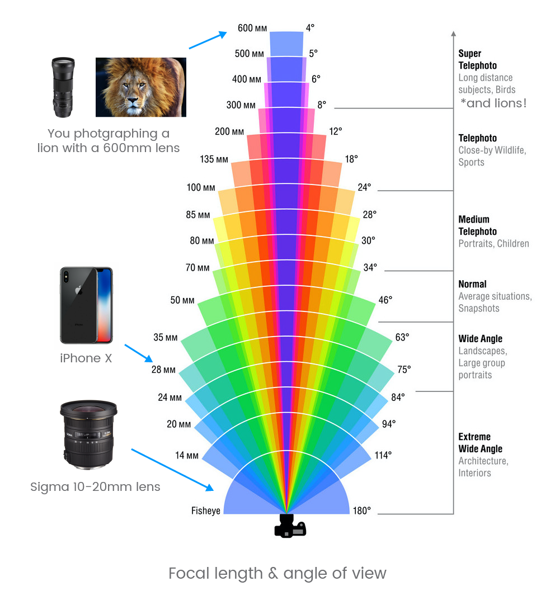

# Digital Photography

 By <a href="//commons.wikimedia.org/wiki/User:Astrocog" title="User:Astrocog">Astrocog</a> - Own work, <a href="https://creativecommons.org/licenses/by-sa/3.0" title="Creative Commons Attribution-Share Alike 3.0">CC BY-SA 3.0</a>, <a href="https://commons.wikimedia.org/w/index.php?curid=29334470">Link</a>

## Useful Resources

[:material-web: Cambridge in Color (CIC)](https://www.cambridgeincolour.com/learn-photography-concepts.htm){target="_blank" .md-button}

[:material-web:  Expert Photography (EP)](https://expertphotography.com/a-beginners-guide-to-photography/){target="_blank" .md-button}

## Human Vision is not Digital Photography

:material-web: [CIC: Cameras vs. the Human Eye](https://www.cambridgeincolour.com/tutorials/cameras-vs-human-eye.htm){target="_blank"}

Humans do not capture photos to see.

!!! note "Human vision"

    - Integrates visual information with multimodal inputs
    - Reconstructs Visual objects using Higher Order processing
      - This reconstruction involve including memory from past events.
    - Constantly moving (fixations and saccades)
    - dynamically adjusts based on subject matter
    - Alternately focused on objects at various distances
    - Can dynamically compensate across vast ranges of brightness (High dynamic range)

### Camera vs Human vision

The Main things to consider are

1. Angle of View
2. Resolution and Detail
3. Sensitivity and Dynamic Range

#### Angle of View

In cameras, the angle of view of the lens can create distortions (such as the relative heights of objects in an image) that we don't have in our vision because we reconstruct visual information into a mental 3D image. Have you have taken a picture of a mountains off in the distance and they look much smaller than your mental image of the same mountain range? Or taken a picture of a monstrous moon at the horizon and it looks tiny? Angle of View.  

{ width="450"}

#### Resolution and Detail

Only our central vision has high resolution at 20/20. Away from the center, our resolution drops off dramatically. At just 20˚ off center, resolution drops off by one-tenth. Our minds don't record single glances as images pixel by pixel. Instead, to develop a detailed mental picture of a scene, we rapidly focus on multiple regions in the scene in rapid succession, building what seems us to be a detailed mental image of the scene, but in fact represents our biases, prioritized by interest.

{ width="450"}

#### Sensitivity and Dynamic Range

Human vision has huge dynamic range (due to the dual Rod and Cone system in our retinas) and the fact that our visions is jumping around (fixations and sacades) all time. Our eyes are especially sensitive in low-light conditions (Rods are very sensitive to photons). We have [the equivalent of 30 stops](https://jameslorentson.com/blog/2018/9/5/we-see-more-than-our-cameras-do) in our vision (cameras can have up to 14 stops).

{ width="450"}

## Image Sensors

- [:material-web: Canon: Image sensors explained](https://www.canon-europe.com/pro/infobank/image-sensors-explained/){target="_blank"}
- [:material-web: EP: Image Sensors](https://expertphotography.com/camera-sensor-size/){target="_blank"}
- [:material-web: CIC: Camera Sensors](https://www.cambridgeincolour.com/tutorials/camera-sensors.htm){target="_blank"}

Image sensors contain millions of light receptors, or photosites, which convert the light energy into an electrical charge. The magnitude of the charge is proportional to the intensity of the light: the more light that hits a particular photosite, the stronger the electrical charge it produces.

{ width="550"}

### Color Filter arrays

- [:material-web: Wiki:Color Filter Arrays](https://en.wikipedia.org/wiki/Color_filter_array){target="_blank"}
- [:material-web: CIC: Camera Sensors](https://www.cambridgeincolour.com/tutorials/camera-sensors.htm){target="_blank"}

To capture color information, image sensors have a mosaic of tiny colored filters placed over the photosites. These filters restrict which colors (wavelengths) of light are detected by each photosite.

{ width="450"}

>A Bayer filter pattern restricting the colors of light dectected by certain photosites. For example, the top left photosite detects only blue light, while the bottom right site detects red light. Adapted from [Interiot](https://commons.wikimedia.org/w/index.php?curid=2884833).

The raw image data captured by the image sensor is then converted to a full-color, 3-channel image by a demosaicing algorithm that interpolates the amount of color received at each photosite.

### Dynamic Range

:material-web: [CiC - Dynamic Range](https://www.cambridgeincolour.com/tutorials/dynamic-range.htm)

Dynamic range (DR) is the ratio between the largest and smallest measurable values of a specific quantity, or in the case of a camera, pure white vs black.  Usually photographs don't contain just black and white. So, this measurement is more relevant to the sensitivity of the photosites in the image sensor — the total number of detectable photons vs the minimum detectable number photons (usually more than just 1 photon).

An image sensor with a wide dynamic range is able to capture images with better contrast, especially in the darker or brighter regions. More expensive cameras typically have image sensors with a wider DR.

{ width="450"}

### Bit Depth

:material-web: [CiC - Bit Depth](https://www.cambridgeincolour.com/tutorials/bit-depth.htm){target="_blank"}

Bit depth is the other side of the coin to Dynamic Range. Whereas DR is the ratio between the largest and smallest measurable value, bit depth is the number of steps that the DR is chopped up into.

One useful analogy is that DR is the height of the staircase, while bit depth is the number of steps.

{ width="450"} 

## Camera Lenses

:material-web:  [CIC - Camera Lenses](https://www.cambridgeincolour.com/tutorials/camera-lenses.htm){target="_blank"}

{ width="450"}

>Cross section (cut) of SLR camera. A single camera lens typically comprises multiple lenses.

Camera Lenses are very complex, but the critical property of a lens are its **focal length** and **aperture**.

### Focal length

Focal length determines the magnification power and angle of view.

- **Shorter focal lengths** provide a wider angle of view, but subjects appear smaller (less magnification).
- **Longer focal lengths** offer a narrower field of view, and make subjects look larger (increased magnification). They also have a narrower depth of field.

{ width="650"}

>[Adpated from Elements Property](https://elementsproperty.co.uk/property-photography/what-do-the-numbers-on-a-camera-lens-mean/)

## Exposure

- [CIC: Camera Exposure](https://www.cambridgeincolour.com/tutorials/camera-exposure.htm){target="_blank"}
  - [Depth of Field](https://www.cambridgeincolour.com/tutorials/depth-of-field.htm){target="_blank"}
  - [Tones and Contrast](https://www.cambridgeincolour.com/tutorials/histograms1.htm){target="_blank"}
- [EP: Exposure](https://expertphotography.com/a-beginners-guide-to-photography/#exposure){target="_blank"}

A photograph's exposure determines how light or dark an image will appear when it's been captured by your camera.

There are 3 camera settings that determine exposure:

1. Aperture
2. ISO
3. Shutter Speed

Collectively, these are known as the exposure triangle.

{ width="450"}

{ width="450"}