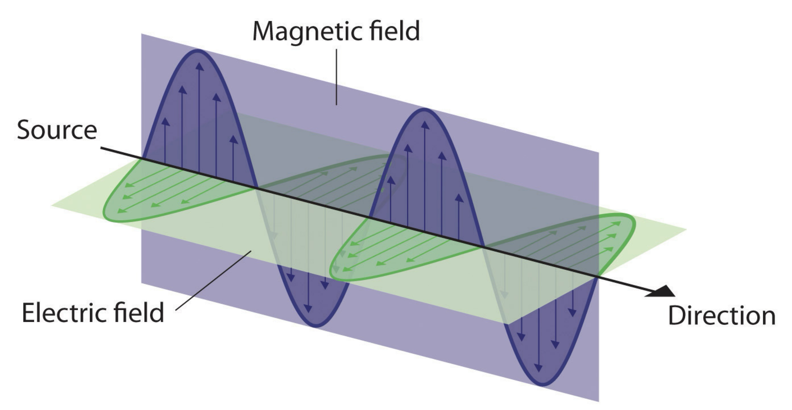
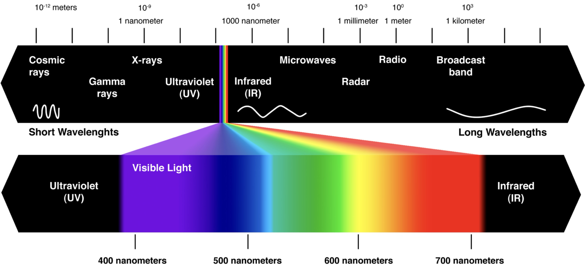
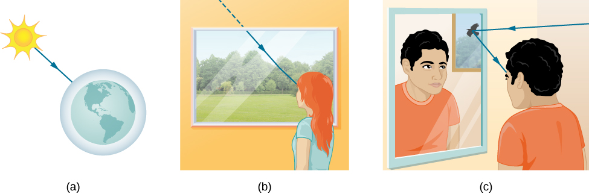
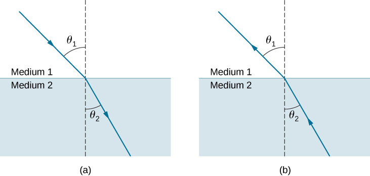
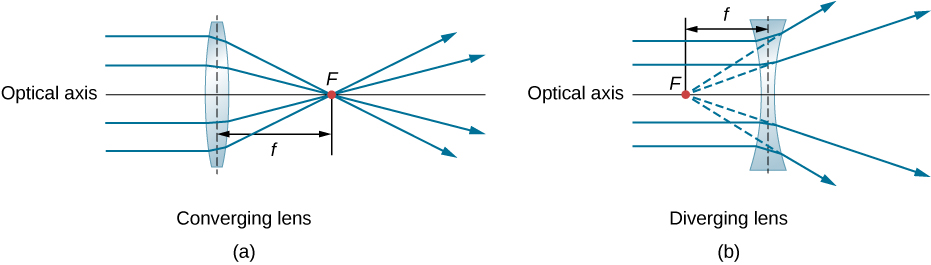
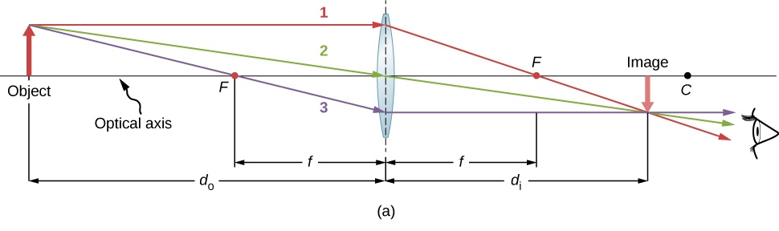
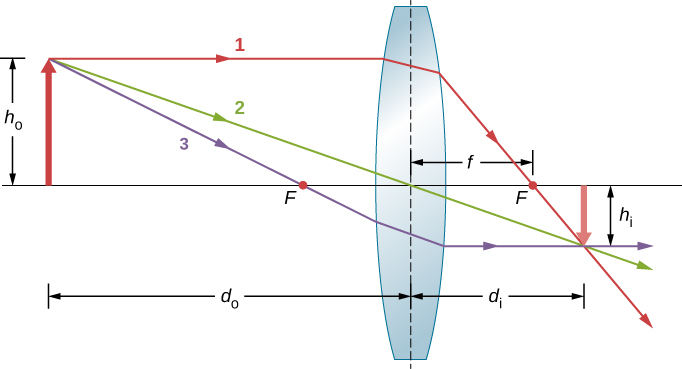
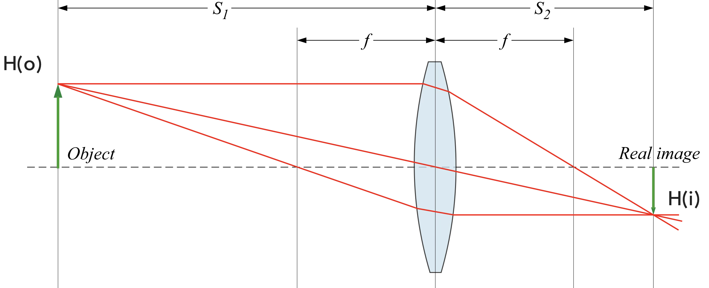

# Electromagnetic Radiation (EMR) and Light

## Online resources

:material-web: **Libretext Physics Online Textbook**

- [Electromagentic Waves](https://phys.libretexts.org/Bookshelves/University_Physics/University_Physics_(OpenStax)/University_Physics_II_-_Thermodynamics_Electricity_and_Magnetism_(OpenStax)/16%3A_Electromagnetic_Waves/16.03%3A_Plane_Electromagnetic_Waves)
- [Propagation of Light](https://phys.libretexts.org/Bookshelves/University_Physics/University_Physics_(OpenStax)/University_Physics_III_-_Optics_and_Modern_Physics_(OpenStax)/01%3A_The_Nature_of_Light/1.02%3A_The_Propagation_of_Light)
- [Thin Lenses](https://phys.libretexts.org/Bookshelves/University_Physics/University_Physics_(OpenStax)/University_Physics_III_-_Optics_and_Modern_Physics_(OpenStax)/02%3A_Geometric_Optics_and_Image_Formation/2.05%3A_Thin_Lenses)

## Electromagnetic Radiation

!!! abstract "Electromagnetic Radiation (EMR)"

    A type of Radiant Energy released by certain electromagnetic processes, like the sun.

The Sun is the most familiar source of electromagnetic radiation.

### Wave / Particle Duality

An electromagnetic wave consists of an electric field, defined as usual in terms of the force per charge on a stationary charge, and a magnetic field, defined in terms of the force per charge on a moving charge. The electromagnetic field is assumed to be a function of only the x-coordinate and time. The y-component of the electric field is then written as  𝐸𝑦(𝑥,𝑡) , the z-component of the magnetic field as  𝐵𝑧(𝑥,𝑡) , etc.

EMR travels as a wave.

{ width="450"}

- Two perpendicular waveforms: magnetic and electrical.
- The Frequency of the Wave is Proportional to Energy

EMR also travels as a Particle:

<iframe width="450" height="338" src="https://www.youtube.com/embed/Xmq_FJd1oUQ" title="Quantum Physics made simple - Wave-Particle Duality Animation" frameborder="0" allow="accelerometer; autoplay; clipboard-write; encrypted-media; gyroscope; picture-in-picture; web-share" referrerpolicy="strict-origin-when-cross-origin" allowfullscreen></iframe>

And is generally all around weird:

<iframe width="769" height="433" src="https://www.youtube.com/embed/Q_h4IoPJXZw" title="What is the Wave/Particle Duality? Part 1" frameborder="0" allow="accelerometer; autoplay; clipboard-write; encrypted-media; gyroscope; picture-in-picture; web-share" referrerpolicy="strict-origin-when-cross-origin" allowfullscreen></iframe>

<iframe width="769" height="432" src="https://www.youtube.com/embed/_riIY-v2Ym8" title="The Wave/Particle Duality - Part 2" frameborder="0" allow="accelerometer; autoplay; clipboard-write; encrypted-media; gyroscope; picture-in-picture; web-share" referrerpolicy="strict-origin-when-cross-origin" allowfullscreen></iframe>

## Light

Light is a sliver of the electromagnetic Spectrum.

{ width="650"}

Since EMR can be described by its wave properties, and wavelength is proportional to energy, you can define a region of the spectrum by wavelength

Light ranges from 400 nanometers to 700 nanometers in wavelength. So, the only difference between light and X-rays is the wavelength of the radiation.

### The Ray Model of Light

When light interacts with an object several times larger than its wavelength (like a human eye), it travels in straight lines and acts like a ray. Its wave characteristics are not pronounced in such situations, so you can totally think of light traveling like a laser beam. There are three ways in which light can travel from a source to another location. It can come directly from the source through empty space, such as from the Sun to Earth. Or light can travel through various media, such as air and glass, to the observer. Light can also arrive after being reflected, such as by a mirror. In all of these cases, we can model the path of light as a straight line called a ray.

{ width="550"}

>**Three methods for light to travel from a source to another location.** (a) Light reaches the upper atmosphere of Earth, traveling through empty space directly from the source. (b) Light can reach a person by traveling through media like air and glass. (c) Light can also reflect from an object like a mirror. In the situations shown here, light interacts with objects large enough that it travels in straight lines, like a ray.

When light encounters and interacts with materials, it changes direction. Since light moves in a straight line, like a laser, it's path can be described by simple trigonometry (geometric optics). Two laws govern how light changes direction when it interacts with matter. These are the [law of reflection](https://phys.libretexts.org/Bookshelves/University_Physics/University_Physics_(OpenStax)/University_Physics_III_-_Optics_and_Modern_Physics_(OpenStax)/01%3A_The_Nature_of_Light/1.03%3A_The_Law_of_Reflection){target="_blank"}, for situations in which light bounces off matter, and **the law of refraction**, for situations in which light passes through matter.

### Refraction

When light encounters a new medium (e.g. from air to glass), it bends. This bend is known as **refraction**, and its the same angle going backwards and forwards.

{ width="450"}

> **The change in direction of a light ray depends on how the index of refraction changes when it crosses from one medium to another.** In the situations shown here, the index of refraction is greater in medium 2 than in medium 1. (a) A ray of light moves closer to the perpendicular when entering a medium with a higher index of refraction. (b) A ray of light moves away from the perpendicular when entering a medium with a lower index of refraction.

Refraction depends on how fast light travels. We all know that the speed of light in a vacuum $c$ is $3.00×108m/s$. This is the fastest known speed in the universe. What we may not remember is that light travels slower when it passes through matter. This is because light interacts with atoms in a material. The speed of light depends strongly on the type of material, since its interaction varies with different atoms, crystal lattices, and other substructures. 

The **index of refraction** is a constant used to describe the speed of light in a given material. We define this index, $n$, as follows:

$$n=\frac{c}{v}$$

So, the index of refraction ($n$) is just  a ratio of the speed of light in a vacuum ($c$) to the speed of light in matter ($v$). The higher the index, the lower the light is traveling in the medium, and the greater the bend in the light. For example, light travels nearly half as fast in a diamond ($n=2$), which makes the light bend more and is what makes diamonds all sparkly. Zircon has an $n = 1.5$, so, less bend and less sparkle. And air has an $n = 1.000293$, so barely any reduction in speed and hardly any bend. But its there, if you look for it.

The exact mathematical relationship is the **law of refraction**, or Snell’s law, after the Dutch mathematician Willebrord Snell (1591–1626), who discovered it in 1621. The law of refraction is stated in equation form as

$$n_1 \, \sin \, θ_1=n_2 \, \sin \, θ_2.$$

Here $n_1$ and $n_2$  are the indices of refraction for media 1 and 2, and  $\theta_1$  and  $\theta_2$  are the angles between the rays and the perpendicular in media 1 and 2. The incoming ray is called the **incident ray**, the outgoing ray is called the **refracted ray**, and the associated angles are the incident angle and the refracted angle, respectively.

### Lenses

Lenses use refraction and a spherical shape to bend light. There are lots of different lenses, but we are going to focus on [thin lenses](https://en.wikipedia.org/wiki/Thin_lens){target="_blank"}, which have a thickness that is negligible compared to the radii of curvature of the lens surfaces. So, no crystal balls or anything like that. Thin lenses can be roughly categorized into Converging and Diverging lenses:

{ width="650"}

>**Rays of light entering (a) a converging lens and (b) a diverging lens, parallel to its axis, converge at its focal point F.** The distance from the center of the lens to the focal point is the lens’s focal length $f$. Note that the light rays are bent upon entering and exiting the lens, with the overall effect being to bend the rays toward the optical axis.

Notice the relationship between the focal point and the lens. In a converging lens, parallel rays of light converge onto the focal length.

### Ray Tracing

Ray tracing is the technique of determining (tracing) the paths taken by light rays as they pass through a lens.

{ width="650"}

>**Example Ray Tracing Diagram.** Thin lenses have the same focal lengths on either side. Parallel light rays entering a converging lens from the right cross at its focal point on the left. **Ray 1 (red):** A ray entering a converging lens parallel to the optical axis passes through the focal point on the other side of the lens. **Ray 2 (green):** A ray passing through the center of a converging lens is not deviated. **Ray 3 (purple):** A ray that passes through the focal point exits the lens parallel to the optical axis .

Ray Tracing can determine the location of the image based on the focal length of the lens and the position of the object in relation to the lens.

{ width="450"}

>**Ray tracing can be used to locate the image formed by a lens.** Rays originating from the same point on the object are traced—the three chosen rays each follow one of the rules for ray tracing, so that their paths are easy to determine. The image is located at the point where the rays cross. In this case, a real image—one that can be projected on a screen—is formed.

The **thin lens equation** describes this relationship:

$$\frac{1}{d_o}+\frac{1}{d_i}=\frac{1}{f}$$

where $d_o$ is the distance of the object from the lens, $d_i$ is the distance of the image from the lens, and $f$ is the focal length of the lens. Notice that the image is inverted in relation to the optical axis.

### Magnification

<!-- { width="550"} -->

Similarly, we can determine the height of the image (magnification) using ray tracing. Magnification is defined as:

$$m\equiv\frac{h_i}{h_o} = -\frac{d_i}{d_o}$$

where $h_i$ is the height of the image and $h_o$ is the height of the object. The negative sign indicates that the image height is inverted in relation to the object height. 