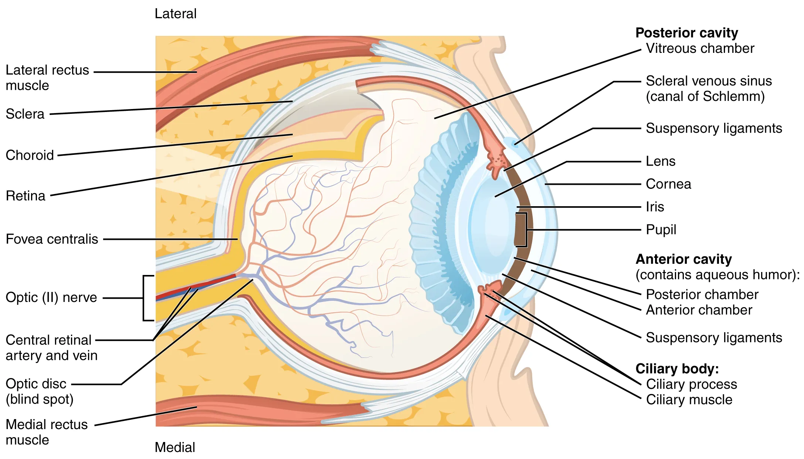

# Human Vision

Adapted from [Openstax Anatomy and Physiology](https://openstax.org/books/anatomy-and-physiology/pages/14-1-sensory-perception)

**Vision** is the special sense of sight that is based on the transduction of light stimuli received through the eyes.

## Structure of the Eye

The eyes are located within either orbit in the skull. The bony orbits surround the eyeballs, protecting them and anchoring the soft tissues of the eye ([Figure 14.13](https://openstax.org/books/anatomy-and-physiology/pages/14-1-sensory-perception#fig-ch14_01_12)). The eyelids, with lashes at their leading edges, help to protect the eye from abrasions by blocking particles that may land on the surface of the eye. The inner surface of each lid is a thin membrane known as the **palpebral conjunctiva**. The conjunctiva extends over the white areas of the eye (the sclera), connecting the eyelids to the eyeball. Tears are produced by the **lacrimal gland**, located just inside the orbit, superior and lateral to the eyeball. Tears produced by this gland flow through the **lacrimal duct** to the medial corner of the eye, where the tears flow over the conjunctiva, washing away foreign particles.

{ width="650"}

>**Figure 14.13. The Eye in the Orbit**. The eye is located within the orbit and surrounded by soft tissues that protect and support its function. The orbit is surrounded by cranial bones of the skull.

The eye itself is a hollow sphere composed of three layers of tissue. The outermost layer is the **fibrous tunic**, which includes the white **sclera** and clear **cornea**. The sclera accounts for five sixths of the surface of the eye, most of which is not visible, though humans are unique compared with many other species in having so much of the “white of the eye” visible ([Figure 14.15](https://openstax.org/books/anatomy-and-physiology/pages/14-1-sensory-perception#fig-ch14_01_14)). The transparent cornea covers the anterior tip of the eye and allows light to enter the eye. The middle layer of the eye is the **vascular tunic**, which is mostly composed of the choroid, ciliary body, and iris. The **choroid** is a layer of highly vascularized connective tissue that provides a blood supply to the eyeball. The choroid is posterior to the **ciliary body**, a muscular structure that is attached to the **lens** by suspensory ligaments, or **zonule fibers**. These two structures bend the lens, allowing it to focus light on the back of the eye. Overlaying the ciliary body, and visible in the anterior eye, is the **iris**—the colored part of the eye. The iris is a smooth muscle that opens or closes the **pupil**, which is the hole at the center of the eye that allows light to enter. The iris constricts the pupil in response to bright light and dilates the pupil in response to dim light. The innermost layer of the eye is the **neural tunic**, or **retina**, which contains the nervous tissue responsible for photoreception.

The eye is also divided into two cavities: the anterior cavity and the posterior cavity. The anterior cavity is the space between the cornea and lens, including the iris and ciliary body. It is filled with a watery fluid called the **aqueous humor**. The posterior cavity is the space behind the lens that extends to the posterior side of the interior eyeball, where the retina is located. The posterior cavity is filled with a more viscous fluid called the **vitreous humor**.

{ width="650"}

>**Figure** **14.15. Structure of the Eye.** The sphere of the eye can be divided into anterior and posterior chambers. The wall of the eye is composed of three layers: the fibrous tunic, vascular tunic, and neural tunic. Within the neural tunic is the retina, with three layers of cells and two synaptic layers in between. The center of the retina has a small indentation known as the fovea.

### Retina

The retina is composed of several layers and contains specialized cells for the initial processing of visual stimuli. The **photoreceptors** (rods and cones) change their membrane potential when stimulated by light energy. The change in membrane potential alters the amount of neurotransmitter that the photoreceptor cells release onto **bipolar cells** in the **outer synaptic layer**. It is the bipolar cell in the retina that connects a photoreceptor to a **retinal ganglion cell (RGC)** in the **inner synaptic layer**. There, **amacrine cells** additionally contribute to retinal processing before an action potential is produced by the RGC. The axons of RGCs, which lie at the innermost layer of the retina, collect at the **optic disc** and leave the eye as the **optic nerve** (see [Figure 14.15](https://openstax.org/books/anatomy-and-physiology/pages/14-1-sensory-perception#fig-ch14_01_14)). Because these axons pass through the retina, there are no photoreceptors at the very back of the eye, where the optic nerve begins. This creates a “blind spot” in the retina, and a corresponding blind spot in our visual field.

Note that the photoreceptors in the retina (rods and cones) are located behind the axons, RGCs, bipolar cells, and retinal blood vessels. A significant amount of light is absorbed by these structures before the light reaches the photoreceptor cells. However, at the exact center of the retina is a small area known as the **fovea**. At the fovea, the retina lacks the supporting cells and blood vessels, and only contains photoreceptors. Therefore, **visual acuity**, or the sharpness of vision, is greatest at the fovea. This is because the fovea is where the least amount of incoming light is absorbed by other retinal structures (see [Figure 14.15](https://openstax.org/books/anatomy-and-physiology/pages/14-1-sensory-perception#fig-ch14_01_14)). As one moves in either direction from this central point of the retina, visual acuity drops significantly. In addition, each photoreceptor cell of the fovea is connected to a single RGC. Therefore, this RGC does not have to integrate inputs from multiple photoreceptors, which reduces the accuracy of visual transduction. Toward the edges of the retina, several photoreceptors converge on RGCs (through the bipolar cells) up to a ratio of 50 to 1. The difference in visual acuity between the fovea and peripheral retina is easily evidenced by looking directly at a word in the middle of this paragraph. The visual stimulus in the middle of the field of view falls on the fovea and is in the sharpest focus. Without moving your eyes off that word, notice that words at the beginning or end of the paragraph are not in focus. The images in your peripheral vision are focused by the peripheral retina, and have vague, blurry edges and words that are not as clearly identified. As a result, a large part of the neural function of the eyes is concerned with moving the eyes and head so that important visual stimuli are centered on the fovea.

### Transduction

Light falling on the retina causes chemical changes to pigment molecules in the photoreceptors, ultimately leading to a change in the activity of the RGCs. Photoreceptor cells have two parts, the **inner segment** and the **outer segment** ([Figure 14.16](https://openstax.org/books/anatomy-and-physiology/pages/14-1-sensory-perception#fig-ch14_01_15)). The inner segment contains the nucleus and other common organelles of a cell, whereas the outer segment is a specialized region in which photoreception takes place. There are two types of photoreceptors—rods and cones—which differ in the shape of their outer segment. The rod-shaped outer segments of the **rod photoreceptor** contain a stack of membrane-bound discs that contain the photosensitive pigment **rhodopsin**. The cone-shaped outer segments of the **cone photoreceptor** contain their photosensitive pigments in infoldings of the cell membrane. There are three cone photopigments, called **opsins**, which are each sensitive to a particular wavelength of light. The wavelength of visible light determines its color. The pigments in human eyes are specialized in perceiving three different primary colors: red, green, and blue.

{ width="550"}

>**Figure** **14.16. Organization of the Retina.** (a) All photoreceptors have inner segments containing the nucleus and other important organelles and outer segments with membrane arrays containing the photosensitive opsin molecules. Rod outer segments are long columnar shapes with stacks of membrane-bound discs that contain the rhodopsin pigment. Cone outer segments are short, tapered shapes with folds of membrane in place of the discs in the rods. (b) Tissue of the retina shows a dense layer of nuclei of the rods and cones. LM × 800. (Micrograph provided by the Regents of University of Michigan Medical School © 2012)

At the molecular level, visual stimuli cause changes in the photopigment molecule that lead to changes in membrane potential of the photoreceptor cell. A single unit of light is called a **photon**, which is described in physics as a packet of energy with properties of both a particle and a wave. The energy of a photon is represented by its wavelength, with each wavelength of visible light corresponding to a particular color. Visible light is electromagnetic radiation with a wavelength between 380 and 720 nm. Wavelengths of electromagnetic radiation longer than 720 nm fall into the infrared range, whereas wavelengths shorter than 380 nm fall into the ultraviolet range. Light with a wavelength of 380 nm is blue whereas light with a wavelength of 720 nm is dark red. All other colors fall between red and blue at various points along the wavelength scale.

Opsin pigments are actually transmembrane proteins that contain a cofactor known as **retinal**. Retinal is a hydrocarbon molecule related to vitamin A. When a photon hits retinal, the long hydrocarbon chain of the molecule is biochemically altered. Specifically, photons cause some of the double-bonded carbons within the chain to switch from a *cis* to a *trans* conformation. This process is called **photoisomerization**. Before interacting with a photon, retinal’s flexible double-bonded carbons are in the *cis* conformation. This molecule is referred to as 11-*cis*-retinal. A photon interacting with the molecule causes the flexible double-bonded carbons to change to the *trans*- conformation, forming all-*trans*-retinal, which has a straight hydrocarbon chain ([Figure 14.17](https://openstax.org/books/anatomy-and-physiology/pages/14-1-sensory-perception#fig-ch14_01_16)).

The shape change of retinal in the photoreceptors initiates visual transduction in the retina. Activation of retinal and the opsin proteins result in activation of a G protein. The G protein changes the membrane potential of the photoreceptor cell, which then releases less neurotransmitter into the outer synaptic layer of the retina. Until the retinal molecule is changed back to the 11-*cis*-retinal shape, the opsin cannot respond to light energy, which is called bleaching. When a large group of photopigments is bleached, the retina will send information as if opposing visual information is being perceived. After a bright flash of light, afterimages are usually seen in negative. The photoisomerization is reversed by a series of enzymatic changes so that the retinal responds to more light energy.

{ width="550"}

>**Figure 14.17. Retinal Isomers**. The retinal molecule has two isomers, (a) one before a photon interacts with it and (b) one that is altered through photoisomerization.

The opsins are sensitive to limited wavelengths of light. Rhodopsin, the photopigment in rods, is most sensitive to light at a wavelength of 498 nm. The three color opsins have peak sensitivities of 564 nm, 534 nm, and 420 nm corresponding roughly to the primary colors of red, green, and blue ([Figure 14.18](https://openstax.org/books/anatomy-and-physiology/pages/14-1-sensory-perception#fig-ch14_01_17)). The absorbance of rhodopsin in the rods is much more sensitive than in the cone opsins; specifically, rods are sensitive to vision in low light conditions, and cones are sensitive to brighter conditions. In normal sunlight, rhodopsin will be constantly bleached while the cones are active. In a darkened room, there is not enough light to activate cone opsins, and vision is entirely dependent on rods. Rods are so sensitive to light that a single photon can result in an action potential from a rod’s corresponding RGC.

The three types of cone opsins, being sensitive to different wavelengths of light, provide us with color vision. By comparing the activity of the three different cones, the brain can extract color information from visual stimuli. For example, a bright blue light that has a wavelength of approximately 450 nm would activate the “red” cones minimally, the “green” cones marginally, and the “blue” cones predominantly. The relative activation of the three different cones is calculated by the brain, which perceives the color as blue. However, cones cannot react to low-intensity light, and rods do not sense the color of light. Therefore, our low-light vision is—in essence—in grayscale. In other words, in a dark room, everything appears as a shade of gray. If you think that you can see colors in the dark, it is most likely because your brain knows what color something is and is relying on that memory.

{ width="650"}

>**Figure 14.18. Comparison of Color Sensitivity of Photopigments.** Comparing the peak sensitivity and absorbance spectra of the four photopigments suggests that they are most sensitive to particular wavelengths.

## Physics of the Eye

Adapted from [Libretexts Physics III - Optics](https://phys.libretexts.org/Bookshelves/University_Physics/University_Physics_(OpenStax)/University_Physics_III_-_Optics_and_Modern_Physics_(OpenStax)/02%3A_Geometric_Optics_and_Image_Formation/2.06%3A_The_Eye)

The eye is remarkable in how it forms images and in the richness of detail and color it can detect. However, our eyes often need some correction to reach what is called “normal” vision. Actually, normal vision should be called “ideal” vision because nearly one-half of the human population requires some sort of eyesight correction, so requiring glasses is by no means “abnormal.” Image formation by our eyes and common vision correction can be analyzed with the optics discussed earlier in this chapter.

Figure 2.6.1 shows the basic anatomy of the eye. The cornea and lens form a system that, to a good approximation, **acts as a single thin lens**. For clear vision, a real image must be projected onto the light-sensitive retina, which lies a fixed distance from the lens. The flexible lens of the eye allows it to adjust the radius of curvature of the lens to produce an image on the retina for objects at different distances. The center of the image falls on the fovea, which has the greatest density of light receptors and the greatest acuity (sharpness) in the visual field. The variable opening (i.e., the pupil) of the eye, along with chemical adaptation, allows the eye to detect light intensities from the lowest observable to $10^{10}$ times greater (without damage). This is an incredible range of detection. Processing of visual nerve impulses begins with interconnections in the retina and continues in the brain. The optic nerve conveys the signals received by the eye to the brain.

{ width="450"}

>**Figure  2.6.1**. The cornea and lens of the eye act together to form a real image on the light-sensing retina, which has its densest concentration of receptors in the fovea and a blind spot over the optic nerve. The radius of curvature of the lens of an eye is adjustable to form an image on the retina for different object distances. Layers of tissues with varying indices of refraction in the lens are shown here. However, they have been omitted from other pictures for clarity.

The **indices of refraction** in the eye are crucial to its ability to form images. Table  2.6.1  lists the indices of refraction relevant to the eye. The biggest change in the index of refraction, which is where the light rays are most bent, occurs at the air-cornea interface rather than at the aqueous humor-lens interface. The ray diagram in Figure  2.6.2  shows image formation by the cornea and lens of the eye. The cornea, which is itself a converging lens with a focal length of approximately 2.3 cm, provides most of the focusing power of the eye. The lens, which is a converging lens with a focal length of about 6.4 cm, provides the finer focus needed to produce a clear image on the retina. The cornea and lens can be treated as a single thin lens, even though the light rays pass through several layers of material (such as cornea, aqueous humor, several layers in the lens, and vitreous humor), changing direction at each interface. The image formed is much like the one produced by a single convex lens (i.e., a real, inverted image). Although images formed in the eye are inverted, the brain inverts them once more to make them seem upright.

**Table  2.6.1 : Refractive Indices Relevant to the Eye.**

|    Material    | Index of Refraction |
| :------------: | :-----------------: |
|     Water      |        1.33         |
|      Air       |         1.0         |
|     Cornea     |        1.38         |
| Aqueous humor  |        1.34         |
|      Lens      |        1.41*        |
| Vitreous humor |        1.34         |

>*This is an average value. The actual index of refraction varies throughout the lens and is greatest in center of the lens.

{ width="550"}

>**Figure  2.6.2**. In the human eye, an image forms on the retina. Rays from the top and bottom of the object are traced to show how a real, inverted image is produced on the retina. The distance to the object is not to scale.

As noted, the image must fall precisely on the retina to produce clear vision—that is, the image distance di must equal the lens-to-retina distance. Because the lens-to-retina distance does not change, the image distance di must be the same for objects at all distances. The ciliary muscles adjust the shape of the eye lens for focusing on nearby or far objects. By changing the shape of the eye lens, the eye changes the focal length of the lens. This mechanism of the eye is called **accommodation**.

The nearest point an object can be placed so that the eye can form a clear image on the retina is called the **near point of the eye**. Similarly, the **far point** is the farthest distance at which an object is clearly visible. A person with normal vision can see objects clearly at distances ranging from 25 cm to essentially infinity. The near point increases with age, becoming several meters for some older people. In this text, we consider the near point to be 25 cm.

### Lens Equations

Imaging with concave lenses

{ width="650"}

>**Formation of a real image with a concave lens**. $d_o$ - distance of object from lens. $d_i$ - distance of the image from the lens. $f$ - focal length of the lens.

The Thin Lens equation relates the distance of the object and the image from the lens to the focal length of the lens, as follows:

$$\frac{1}{f}=\frac{1}{d_o} + \frac{1}{d_i}$$

We can use the thin-lens equation to quantitatively examine image formation by the eye. First, we define the **optical power**(1) of a lens as
{ .annotate}

1. Power is inverse of the focal length of a lens, with the focal length expressed in meters. The optical power P of a lens is expressed in units of diopters D;

$$P = \frac{1}{f}$$

with the focal length **f** given in meters. The units of optical power are called **diopters** (D). That is, $1D=\frac{1}{m}$ (or $1m^{−1}$). Optometrists prescribe common eyeglasses and contact lenses in units of diopters. With this definition of optical power, we can rewrite the thin-lens equations as

$$P=\frac{1}{d_o}+\frac{1}{d_i}$$

Working with optical power is convenient because, for two or more lenses close together, the effective optical power of the lens system is approximately the sum of the optical power of the individual lenses:

$$P_{total} = P_{lens1}+P_{lens2}+P_{lens3}+P_{lens*}$$

!!! example "Effective Focal Length of the Eye"

    The cornea and eye lens have focal lengths of 2.3 and 6.4 cm, respectively. Find the net focal length and optical power of the eye.

    **Strategy**

    The optical powers of the closely spaced lenses add up, so $P_{eye}= P_{cornea}+P_{lens}$

    **Solution**
    
    Writing the equation for power in terms of the focal lengths gives:

    $$\frac{1}{f_{eye}}=\frac{1}{f_{cornea}}+\frac{1}{f_{lens}}=\frac{1}{2.3cm}+\frac{1}{6.4cm}=0.59103$$

    So, the **focal length** of the eye (cornea and lens together) is $f_{eye}=1.69cm$.

    The **optical power** of the eye is

    $$P_{eye} = \frac{1}{f_{eye}}=\frac{1}{0.0169m}= 59D$$

For clear vision, the image distance $d_i$ must equal the lens-to-retina distance. Normal vision is possible for objects at distances $d_o=25 cm$ (~10 inches) to infinity. The following example shows how to calculate the image distance for an object placed at the near point of the eye.

!!! example "Example  2.6.2 : Image of an object placed at the near point"

    The net focal length of a particular human eye is 1.7 cm. An object is placed at the near point of the eye. How far behind the lens is a focused image formed?

    **Strategy**

    The near point is 25 cm from the eye, so the object distance is $d_o=25 cm$. We determine the image distance from the lens equation:

    $$\frac{1}{d_i} = \frac{1}{f} - \frac{1}{d_o}$$

    **Solution**

    $$d_i = (\frac{1}{f} - \frac{1}{d_o})^{-1}
    = (\frac{1}{1.7cm}-\frac{1}{25cm})^{-1}
    =1.8 cm$$

    Therefore, the image is formed 1.8 cm behind the lens.

    **Significance**

    You can determine magnification simply based on the image and object distances from the lens, as follows:

    $$M = -\frac{d_i}{d_o}$$

    >The negative sign indicates that the image is inverted. 
    
    So, using this magnification formula, we find that
    
    $$m=-\frac{1.8cm}{25cm}=-0.073$$ 
    
    Since $m<0$, the image is inverted in orientation with respect to the object. From the absolute value of $m$ we see that the image is much smaller than the object; in fact, it is only ~7% of the size of the object.

### Vision Correction

The need for some type of vision correction is very common. Typical vision defects are easy to understand with geometric optics, and some are simple to correct. Figure  2.6.3  illustrates two common vision defects. Nearsightedness, or **myopia**, is the ability to see near objects, whereas distant objects are blurry. The eye over converges the nearly parallel rays from a distant object, and the rays cross in front of the retina. More divergent rays from a close object are converged on the retina for a clear image. The distance to the farthest object that can be seen clearly is called the far point of the eye (normally the far point is at infinity). Farsightedness, or **hyperopia**, is the ability to see far objects clearly, whereas near objects are blurry. A farsighted eye does not sufficiently converge the rays from a near object to make the rays meet on the retina.

{ width="650"}

>**Figure  2.6.3**. (a) The nearsighted (myopic) eye converges rays from a distant object in front of the retina, so they have diverged when they strike the retina, producing a blurry image. An eye lens that is too powerful can cause nearsightedness, or the eye may be too long. (b) The farsighted (hyperopic) eye is unable to converge the rays from a close object on the retina, producing blurry near-field vision. An eye lens with insufficient optical power or an eye that is too short can cause farsightedness.

#### Nearsighted correction

Since the nearsighted eye over converges light rays, the correction for nearsightedness consists of placing a diverging eyeglass lens in front of the eye, as shown in Figure  2.6.4. This reduces the optical power of an eye that is too powerful (recall that the focal length of a diverging lens is negative, so its optical power is negative). Another way to understand this correction is that a diverging lens will cause the incoming rays to diverge more to compensate for the excessive convergence caused by the lens system of the eye. The image produced by the diverging eyeglass lens serves as the (optical) object for the eye, and because the eye cannot focus on objects beyond its far point, the diverging lens must form an image of distant (physical) objects at a point that is closer than the far point.

{ width="450"}

>**Figure  2.6.4**. Correction of nearsightedness requires a diverging lens that compensates for over convergence by the eye. The diverging lens produces an image closer to the eye than the physical object. This image serves as the optical object for the eye, and the nearsighted person can see it clearly because it is closer than their far point.

#### Farsighted correction

Correcting farsightedness consists simply of using the opposite type of lens as for nearsightedness (i.e., a converging lens), as shown in Figure  2.6.5. Such a lens will produce an image of physical objects that are closer than the near point at a distance that is between the near point and the far point, so that the person can see the image clearly. To determine the optical power needed for correction, you must therefore know the person’s near point, as explained in Example  2.6.4 .

{ width="450"}

>**Figure  2.6.5**. Correction of farsightedness uses a converging lens that compensates for the under convergence by the eye. The converging lens produces an image farther from the eye than the object, so that the farsighted person can see it clearly.
