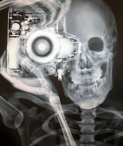
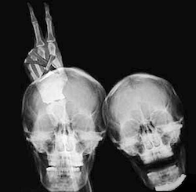

# Welcome to Muddling Through Medical Imaging

*A beginner’s guide to barely understanding programming concepts so that you can tell your friends that you know coding.*

These days, "everything's computer", so you might as well start learning this fandangled computer stuff. This is your Guide to learning the basics (and I mean *basics*) of:

- Computer Programming
- Image Processing
- Machine Learning
- Manipulating Medical Image Datasets

## Software

After using this guide, you will be barely proficient in using

- [MATLAB](https://www.mathworks.com)
- [FIJI](https://fiji.sc)
- [3D Slicer](https://www.slicer.org)

## Author

Ernesto Salcedo is an Assistant Professor at the University of Colorado School of Medicine. He is a Sensory Neuroscientist and teaches in the Modern Human Anatomy Program.

    Ernesto Salcedo, PhD
    Modern Human Anatomy
    University of Colorado School of Medicine
    2024
    

