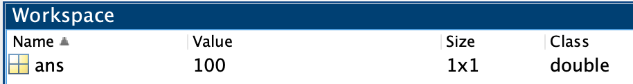
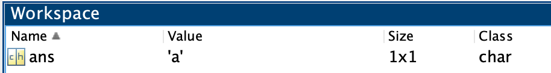
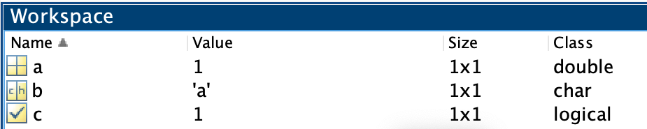
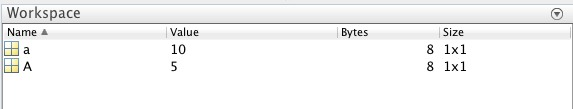

# Array Assignment

!!! abstract "*Adding basic data to variables.*"

## Overview

In this module, we cover the basics of assigning fundamental data types to variables.

### Special Characters Used

- `=` - **Equal Sign**. A.k.a, the Assignment operator. Used to assign data to a variable.
- `[ ]` - **Square Brackets**. Used to concatenate (or group) numbers or logical values into one variable
- `' '` - **Single Quotes**. Used to indicate Characters or concatenate multiple characters together.

### Functions discussed in this Module

- [size](https://www.mathworks.com/help/matlab/ref/size.html){target="_blank"}
- [ismatrix][mlb-ref-ismatrix]{target="_blank"}
- [namelengthmax](https://www.mathworks.com/help/matlab/ref/namelengthmax.html){target="_blank"}
- [exist][mlb-ref-exist]{target="_blank"}

[mlb-ref-ismatrix]:https://www.mathworks.com/help/matlab/ref/ismatrix.html
[mlb-ref-exist]: http://www.mathworks.com/help/matlab/ref/exist.html

## Basic Data types

Remember, for our intents and purposes, there are only three types of data:

- Numbers
- Characters
- Booleans

To indicate what data you want, you use the following syntax:

- For Numbers, you simply enter a number, like `12`
- For Characters, you surround the characters that you want with single-quotes, like `'a'`
- For Booleans, you use the function **`true`** or **`false`**

## Assigning Data to MATLAB

The easiest way to assign data to a variable in MATLAB is to simply type the data you want in the command window.

Type 100 in the command window and hit return, as follows:

```matlab linenums="1"
100
```

When you do this, you get the following result:

```matlab title="result"
ans =

   100
```

Notice what MATLAB did here. Since you just entered some data, MATLAB created a variable, *`ans`* and assigned the data to that variable. Inspect the workspace. There is now a row that contains information on the variable *`ans`*

{ width="400"}

Notice that the class of the variable is listed as **double**, which is the default numeric class. We'll get into why "double" in a later module, but, just so you know, there are like ten different numeric classes. Don't worry, it will make sense later. 

Great, easy enough, but what happens when we enter a new piece of data? Type the character array `'a'` in the command window and hit return. Remember to use the single quotes to indicate that you want a character array.

```matlab linenums="1"
'a'
```

```matlab title="result"
ans =

    'a'
```
Now we have the value 'a' assigned to *`ans`*. We didn't get a new variable, we just overwrote the previous contents of *`ans`*. If you review the Workspace, you will see that the `100` is nowhere to be found.

{ width="400"}

## Assigning Data to Variables

To do anything serious in  MATLAB, you are going to need more than one variable. Luckily, MATLAB provides the ability for you to name your own variables.

To do so, you use the following [syntax](http://en.wikipedia.org/wiki/Syntax_(programming_languages)){target="_blank"}

`name_of_variable = value_of_variable`

Assignment Conventions:
- the variable receiving the data is always on the left side of the equal sign.
- The data to be assigned is always on the right side of the equation.
- If the variable doesn't exist,  MATLAB creates one (of the appropriate class)

Type the following in the Command Window:

```matlab linenums="1"
a = 1
b = 'a'
c = true
```

…These three lines of code create the three different variables with three different data types. Notice that the character array is colored pink.

Review the properties of these variables in the workspace:

<!--```matlab title="whos"
  Name      Size            Bytes  Class      Attributes

  a         1x1                 8  double               
  b         1x1                 2  char                 
  c         1x1                 1  logical              
```-->

!!! note "Review the Workspace"
    { width="450"}

    - Each variable is listed in a different row.
    - Each row shows the name of the variable and its contents and gives you some information about the variable, such as the array size and class (data type).
    - There are different yellow icons for the different variable classes.
    - The variable classes are listed as "double", "char", and "logical".
    - The variable sizes are all listed as `1x1`. This means that each variable has only one element of data.

### Concatenation

Concatenation means to package multiple elements into one variable. Often, we want to add more than one value to a variable, packaged in separate elements. To concatenate numbers or logical values, we use the special character Square Brackets (`[ ]`), as follows:

!!! example "Example: Concatenating Numbers or Logicals"

    ```matlab linenums="1"
    d = [1 2] % concatenate numbers
    e = [true false true] % concatenate logicals
    ```

    ```matlab title="result"
    d =

        1     2


    e =

    1×3 logical array

    1   0   1
    ```

    Here, the variable *`d`* has two elements with the values 1 and 2, while the variable *`e`* has three elements with the logical values 1, 0, and 1.

To concatenate characters, we use the single quotes, as follows

!!! example "Example: Concatenating Characters with Single Quotes"

    ```matlab linenums="1"
    f = 'zx' % concatenating two characters
    g = '$?_%' % concatenating four characters
    ```

    ```matlab
    f =

    'zx'

    g =

        '$?_%'
    ```
    Here, the variable *`f`* has two elements with the values `z` and `x`, while the variable *`g`* has four elements with the values `$`,`?`, `_`, and `%`

#### Challenge: Concatenation

=== "Question"
    Concatenate the values `11`,`12`,and `15` and assign to the variable *`d2`*
    
=== "Answer"

    ```matlab linenums="1"
    d2 = [11 12 15]
    ```

    ```matlab
    d2 =

    11    12    13
    ```

### Copying data

You can copy the value from one variable to another by using the following convention:

```matlab
new_variable = old_variable
```

Notice that we have two different variable names on either side of the assignment operator (`=`). The variable name to the left of the `equal sign` *receives* the data that is extracted from the variable name on the right side of the `equal sign`. Data always moves from right to left. 

!!! example "Example: Copying Data from a variable"

    Type the following in the command window:

    ```matlab linenums="1"
    h = g
    ```
    
    ```matlab title="result"
    h =
    
         '$?_%'
    ```
    
    The variable *`h`* is created and receives the data extracted from the  variable *`g`* (which was created in the previous example).

### Recursive Assignment

Sometimes we want to add new elements to a variable that already exists. To do this, we use **Recursive assignment**, which simply means that we include the same variable name on both sides of the assignment operator.

!!! tip
    Remember the convention: Data is always extracted from the variable name to the right of the `equal sign` and added to the variable name that is to the left of the `equal sign`.

For example, the variable *`h`* currently contains the following characters: `$?_%` — a well known expletive in the comic book world. But, we forgot to include the most important part: the exclamation point at the end. No worries, we can add a character to *`h`* as follows:

```matlab linenums="1" title="Add exclamation point to end"
h = [h '!'] % h on both sides of assignment operator
```

Notice  we include the variable name *`h`* on the right side of the equal sign. With the square brackets, we indicate to concatenate the contents of *`h`* with the character `!`. And we get…

```matlab title="result"
h =

    '$?_%!'
```

…the full expletive. The `!` character was added after data extracted from *`h`* and then all of the data was added back to *`h`*. Now, *`h`* has five elements, with `!` as the final element.

If we want to expand on our expletive by adding a character to the first position of *`h`*, we would use the following syntax:

```matlab
h = ['@' h] 
```

```matlab
h =

    '@$?_%!'
```

…Here, the `@` character is added before all of the data extracted from *`h`*. Now *`h`* is a 1x6 character array and you can really let them have it.

#### Challenge: Copying and Recursive assignment

=== "Question"
    Show the syntax to:

    1. Copy the contents of *`h`* to *`h2`*
    2. Use recursive assignment to add the characters `a` and `z` to first and last element of *`h2`*
=== "Answer"

    ```matlab linenums="1"
    h2 = h
    h2 = ['a' h2 'z']
    ```

    ```matlab title="result"
    h2 =

    'a@$?_%!z'
    ```

## Determining the number of elements in a variable

So, how do we keep track of the size of our variables. One way is to check the workspace (or use the function **`whos`**):

```matlab title="whos"
  Name      Size            Bytes  Class      Attributes

  a         1x1                 8  double               
  b         1x1                 2  char                 
  c         1x1                 1  logical              
  d         1x2                16  double               
  e         1x3                 3  logical              
  f         1x2                 4  char                 
  g         1x4                 8  char                 
  h         1x6                12  char      
```

As you can see, we generated a lot of data in a very little amount of time. The column "Size" indicates the dimensions of each variable.

??? question "Why are the variables with just one element, like `a`,`b`, and `c`, listed as having a size `1x1`? Why not list the size as `1`?"

    Remember, all MATLAB numeric variables are matrices by default. While *vectors* and *matrices* technically have different definitions, MATLAB treats them all as if they are matrices. Importantly, MATLAB cannot differentiate between a vector (1 row or 1 column) and a matrix (at least one row and one column). You need to use a function, like **[size][mlb-ref-size]**, to differentiate the two.

!!! info "Function: **size**"

    The function **[size](https://www.mathworks.com/help/matlab/ref/double.size.html){target="_blank"}** returns the array dimension size of a variable (so you can get the values programmatically instead of having to refer to the workspace)

    ```matlab linenums="1"
    size(b)
    ```

    ```matlab title="result"
    ans =
            1     1
    ```

    This result indicates that *`b`* is a matrix with the dimensions of 1 row and 1 column. Notice that the output is assigned to the variable *ans*.

The function **[ismatrix][mlb-ref-ismatrix]** reports whether a variable is a 2D matrix. A variable with more than 2 dimensions returns a zero. This will be important when we deal with image stacks and RGB images that have three or more dimensions.

#### Challenge: Size

=== "Question"
    What will the following syntax return?

    ```matlab linenums="1"
    size(g)
    ```

    hint, review the **`whos`** output
=== "Answer"

    ```matlab title="result"
    ans =

        1     4
    ```
    …One row, Four columns

## Variable Names Rules

### Capitalization matters

MATLAB is case-sensitive, which means a capital letter creates a different variable name than a lowercase letter. Consider the following:

!!! example "Example: Assigning A and a"

    ```matlab linenums="1"
    A = 5
    a = 10
    ```

    …In this syntax, the equal sign `=`  means 'assign', as in 'assign the value 10 to the variable a.'

Notice that the workspace has been populated with two new variables, `A` and `a`. This is because MATLAB is case-sensitive and those two letters are treated as completely different names.

Here, I use the function **`whos`** to display the contents of the workspace in text form:

```matlab title="whos"
  Name      Size            Bytes  Class     Attributes

  A         1x1                 8  double              
  a         1x1                 8  double              
```

<!---->

### Valid Array Names

You can't just willy-nilly name your variable whatever you want. MATLAB has [rules](https://www.mathworks.com/help/matlab/matlab_prog/variable-names.html){target="_blank"} that you must follow.

Valid MATLAB variable names must start with a letter, followed by letters, digits, or underscores. They can have NO SPACES or weird characters like exclamation or hashtag. Also, MATLAB is case-sensitive; recall that *`A`* and *`a`* were treated as different variable names.

### Using Complex Variable Names

Let's create a new, more complex name for a variable. Type the following in the command window:

```matlab linenums="1"
monkey_brains_2 = 45
```

```matlab title="result"
monkey_brains_2 =

    45
```

In the workspace, there is now a variable called *`monkey_brains_2`* with an assigned value of `45`. By using a combination of letters, numbers, and underscores, it is fairly easy to come up with a diverse range of variable names.

??? question "How long can your variable name be?"

    The function **[namelengthmax](https://www.mathworks.com/help/matlab/ref/namelengthmax.html){target="_blank"}** returns the maximum length a variable name can be:

    ```matlab linenums="1"
    namelengthmax
    ```

    ```matlab title="result"
    ans = 
	    63
    ```
    The result 63 indicates the longest number of characters that your variable name can have—not that you will ever want a variable name that long, but it's possible. This value varies depending on the operating system.

### Avoiding Naming Conflicts

When coming up with variable names, you should try to avoid names that are already reserved by MATLAB.

!!! info "Function: exist "

    The MATLAB function **[exist][mlb-ref-exist]** tells you if a variable name is already being used. The basic syntax is to type `exist` followed by a space and then the name in which you are interested in testing

    ```matlab linenums="1"
    exist function % is the word function already being used?
    ```

    ```matlab title="result"
    ans =
	 5
    ```
    Any result greater than zero means that the name is reserved. So, a result of 5 here means that the word **`function`** is a reserved name used by MATLAB. In contrast, when you type:

    ```matlab linenums="1"
    exist monkey_brains_4
    ```

    ```matlab title="result"
    ans = 
	0
    ```
    The output from *`exist`* here is 0 (or false) means that the name *`monkey_brains_4`* is not currently being used by MATLAB and is free for the taking.

### Challenge: Function exist

=== "Question"

    What will be the result if you type `exist monkey_brain_2` in the command window?

=== "Answer"

    ```matlab linenums="1"
    exist monkey_brain_2
    ```

    ```matlab title="result"
    ans = 

        1
    ```

    The result `1` indicates that the variable 'monkey_brain_2' already exists (we created it in a previous step).
