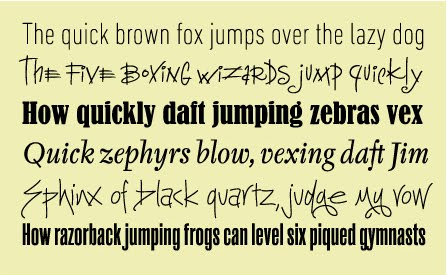

# Character Arrays

!!! abstract "*for letters and stuff*"

## Overview

They say words are little more than horizontal vectors of characters. Well, I don't know if they *actually* say that, but I say that, and you should probably know that because, from the perspective of a computer, that is basically what they are.

In this module, we will learn about character  arrays, which are useful for storing information such as names or other such unique identifiers.

![][letterpress]

[letterpress]:images/letterpress-printing.jpg

## Syntax Overview

| Syntax | Special Character | Meaning |
| ----- | :---: | --- |
| x='a' | ' ' | assign the character a to the variable *x* |
| x='cat' | ' ' | assign the characters 'c', 'a', and 't' to *x* |

### Learning Objectives

* Define a Character Array.
* Be able to assign values to character arrays using paired single quotes
* Be able to use the function [sprintf] to format character arrays
* Be able to use functions discussed in this module like [sort] and [unique] to parse characters in a character array
* Be able to use regular expressions to find and replace characters in character arrays

### Special MATLAB Characters

* `' '` - paired single quotes (the straight kind) are used to concatenate characters into a character array

* `[ ]`- square brackets are used to concatenate character arrays
  
### Important Terminology

- **Character Arrays**: An array of characters (letters, spaces, punctuation, etc). Sometimes called a string.

- [ASCII](http://en.wikipedia.org/wiki/Ascii): the American Standard Code for Information Interchange. A numeric code to indicate different characters.

### Useful Mathworks Documentation

- [Character Strings](http://www.mathworks.com/help/matlab/learn_matlab/character-strings.html)
- [Text in String and Character Arrays](https://www.mathworks.com/help/matlab/matlab_prog/represent-text-with-character-and-string-arrays.html#)

### Important MATLAB Functions You should know

* [char][doc-char] - Convert to a character array
* [ischar](https://www.mathworks.com/help/matlab/ref/ischar.html): is the array a character array?
* [upper](https://www.mathworks.com/help/matlab/ref/upper.html) and [lower](https://www.mathworks.com/help/matlab/ref/lower.html) - Change case of letters
* [isletter](https://www.mathworks.com/help/matlab/ref/isletter.html) and [isspace](https://www.mathworks.com/help/matlab/ref/isspace.html) - returns a logical array that masks letters or spaces in a character array
* [sprintf][doc-sprintf] - Format data into character array
* [regexp][doc-regexp] - Regular expression (super find function)
* [regexprep][doc-regexprep] - Replace text using regular expression

[doc-char]: http://www.mathworks.com/help/matlab/ref/char.html
[doc-sprintf]: http://www.mathworks.com/help/matlab/ref/sprintf.html
[doc-sort]: http://www.mathworks.com/help/matlab/ref/sort.html
[doc-unique]: http://www.mathworks.com/help/matlab/ref/unique.html
[doc-regexp]: http://www.mathworks.com/help/matlab/ref/regexp.html
[doc-regexprep]: http://www.mathworks.com/help/matlab/ref/regexprep.html



___

## Assignment and syntax

Each element in a character array contains a single letter or other such character (as opposed to a numeric or logical value). When creating a character array, MATLAB assumes that you probably don't want to separate each character by a space, so the syntax for creating a character array is different from creating a numeric array. Instead of using the paired square brackets, you use a pair of single quotes (`' '`) and you do not include any spaces in between the characters. In fact, the `space` character is a type of character known as a whitespace character. For example, the following is a very simple character array:

```matlab linenums="1"
ch = 'hello'
```

!!! note "Syntax Coloring"

    In the  MATLAB editor, characters in character arrays are colored purple.

Anything you can type on a computer keyboard can be stored as a character array. Spaces are characters. Punctuation Marks are characters. Even numbers can be character arrays:

```matlab linenums="1"
n = '1'
```

``` title="result"
n =

    '1'
```

This can cause problems if you are not careful and accidentally try to do math with character arrays. MATLAB will display character array outputs in single quotes, as shown above `'1'` and color the character purple.  However, it is always a good idea to check the class using **`whos`** or check the **workspace**. Make sure you know the class of your array or you may get an unexpected result.

```matlab linenums="1"
whos n
```

```matlab title="result"
n = 

1

Name      Size            Bytes  Class    Attributes

  n         1x1                 2  char               
```

### Inspecting character arrays in the Variable Editor
If you double-click on the variable name of a character array in the workspace to bring up the  "Variable Editor",  all letters of the array appear to be contained in a single element, as shown in the following image:

>![variable editor][im_ch]

…But, this is not the case. Just as in a numeric variable, each element in a character array contains a single character. This is even indicated right above the box: "1X5 char"

The **[`whos`](http://www.mathworks.com/help/matlab/ref/whos.html)** function, which is a text version of the workspace, can further clarify the properties of *`ch`*:

```matlab title="whos Function" linenums="1"
  whos('ch')
```

``` title="whos output"
   Name      Size            Bytes  Class    Attributes
     ch         1x5                10  char               
```

  …As you can see, *`ch`* is a vector array with one row and 5 columns that contains the letters `h`,`e`,`l`,`l`, and `o` in the first five elements of the array. Also note that it has a '*char*' class (character array class), and it requires 10 Bytes of memory. This means that a character array requires 2 Bytes of memory allocation (or is 16-bit) per element.

<!--Question: How many different characters can you have with 2 bytes of memory?-->

[im_ch]:images/char_hello.png

## Indexing

Character Arrays can be indexed using parentheses, just like numeric arrays.

=== "First Element"

    ```matlab hl_lines="1"
    ch(1)
    ans = 
        'h'
    ```
    This syntax returns the first element in a character array, which contains the letter `h`:
=== "Last Element"

    ```matlab hl_lines="1"
    ch(end)
    
    ans = 
        'o'
    ```

    and this syntax returns the last element in the array, which contains the letter `o`:

## Concatenation

You can use the paired square brackets to concatenate *char* arrays, just as you would concatenate numeric arrays. We can easily concatenate two character arrays using the following syntax:

```matlab title="concatenate two character arrays" linenums="1"
c1 = 'together';
c2 = 'again';
ct = [c1 c2] % square brackets concatenate the contents of c1 and c2
```

```matlab title="result"
ct =

    'togetheragain'
```

!!! note 

    The concatenation of character arrays takes no regard to grammar or spacing. The result is literally the two character arrays, smashed together.


To include a space between concatenated *char* arrays, you need to specify the space, as follows:

```matlab title="add space character and concatenate" linenums="1"
sp = ' ' % create space character
ct2 = [c1 sp c2] % concatenate all three character arrays
```

```matlab title="result"
ct2 =

'together again' % Now there is a space between the two words
```

___

## Character Matrices

What happens if you try to place two different words in separate rows of a character array using semicolon syntax?

```matlab
['hello'; 'goodbye']
```

!!! failure "Error"
    Dimensions of arrays being concatenated are not consistent

The syntax fails because 'hello' has 5 characters, while 'goodbye' has 7. And as we remember from the Numeric Array section, we have to have an equal number of filled columns for each row in a column. You can't have any empty elements 

So, how do you create character arrays with more than one row of characters? Just like in a numeric matrix, you need an equal number of columns for every character in a character array. If there are not enough characters in a given word, you can **pad** that word with spaces.  

To properly concatenate the two words 'hello' and 'goodbye' into one matrix, you need to pad 'hello' with 2 trailing spaces, as follows:

```matlab title="Space Padded character arrays" linenums="1"
['hello  '; 'goodbye']
```

```matlab title="result"
ans =

  2×7 char array

    'hello  '
    'goodbye' % Now we have a proper character matrix
```

!!! note
    Even though the spaces are not visible, they are occupying elements in the matrix.

You don't have to pad with spaces--you can use any character:

```matlab title="Asterisks-Padded Character Array" linenums="1"
['hello**'; 'goodbye']
```

```matlab title="result"
ans =

  2×7 char array

    'hello**'
    'goodbye' % this matrix is padded with asterisks
```

### The char Function

If you don't want to worry about padding your character arrays, you can use the function **`char`** to automatically add the proper number of trailing spaces for you. Just plug in the character arrays that you want concatenated, and the function will do the rest

```matlab title="char function" linenums="1"
p = char('hello', 'goodbye','farewell')
```

```matlab title="result"
p =

  3×8 char array

    'hello   '
    'goodbye '
    'farewell'
```

!!! note

    Here, the function **`char`** automatically creates a `3X7` character array, padding both 'hello' and 'goodbye' with spaces at the end to match the length of 'farewell'.


<!--Everything Is Not Always What It seems...

By the way, character arrays are not displayed like numeric arrays in the Variable Editor. That is, you don't get a spreadsheet view of each character distributed across separate elements. Instead, you get a display similar to what you might see in the command window: 

![][var_editor_p]

[var_editor_p]: images/char_array_var_editor.png

<p></p>

These character matrices can be indexed like a numeric  arrays are very much organized like numeric arrays in that each element holds a single piece of information. In this case, that piece of information is a single character.
-->

### Indexing Character Matrices

Remember, in character arrays, each element contains one character.

![<p></p>][img-char-p-matrix]

[img-char-p-matrix]:images/char-matrix-p-greetings.png


So, when indexing elements out of a character matrix, you get one character back. Consider the following examples of indexing *`p`*.

```matlab title="Index 2nd row, 2nd column in p" linenums="1"
p(2,2) 
```

```matlab title="result"
ans = 'o' % you get the second 'o' in 'goodbye'
```

```matlab title="Index 1st row, 3rd column in p" linenums="1"
p(1,3)
```

```matlab title="result"
ans =  'l' % you get the first 'l' in 'hello'
```

=== "Challenge"

    How would you index out the 'w' in 'farewell' from *`p`*?
=== "Answer"

    ```matlab linenums="1"
     p(3,5)

      ans =

        'w'
    ```

    You need to index the third row, fifth column.

=== "Challenge 2"

    What does the following syntax return?

    ```matlab linenums="1"
      p(1,end)
    ```

=== "Answer 2"

    ```matlab linenums="1"
     p(1,end)

        ans =

        ' '
    ```

    This syntax returns a *space*.

___

## Character Array Generation

You can generate a sequential series of characters as you would a series of incremental numbers by using the colon operator. The following syntax generates a character array that contains all of the lowercase letters from 'a' to 'z', in alphabetical order.

```matlab linenums="1"
lower_letters = 'a' : 'z'
```

```matlab title="result"
lower_letters =

'abcdefghijklmnopqrstuvwxyz'
```

If you want every other letter, you could use the following syntax (just like with numeric arrays):

```matlab linenums="1"
letter_subset = 'a':2:'z'
```

```matlab title="result"
letter_subset =

'acegikmoqsuwy'
```

___

## Character Array Functions

The following functions are very useful for character arrays.

### Case functions

The functions **upper** and **lower** change the case of a letter:

```matlab linenums="1" title="result" Change Case
ch = 'a':'f'
CH = upper(ch) % change to uppercase
ch2 = lower(CH) % change to lowercase
```

```matlab title="result"
ch =

    'abcdef'

CH =

    'ABCDEF'

ch2 =

    'abcdef'
```

### is* functions

is* functions return logical array that mask certain aspects of an array

- **isletter**: which elements contain letters (a-z, A-Z)
- **isspace**: which elements contain spaces?

Consider the following character array

```matlab linenums="1"
ch = ['a':'c' ' ' '1':'c' ' !@#']
```

```matlab
ch =

    'abc 123 !@#'
```

The function **isletter** returns a logical array masks the letters

```matlab linenums="1" title="Mask Letters"
laL = isletter(ch)
```

```matlab title="result"
laL =

  1×11 logical array

   1   1   1   0   0   0   0   0   0   0   0
```

…Just the first three characters are letters

The function **isspace** masks the spaces

```matlab linenums="1" title="Mask Spaces"
laS = isspace(ch)
```

```matlab
laS =

  1×11 logical array

   0   0   0   1   0   0   0   1   0   0   0
```

…The spaces are after the letter c and after the number 3.

### sprintf

The **[sprintf][doc-sprintf]** function allows you to add data to a character array, sort of like creating a template for form letter where you add the data when you create the letter.

To use **`sprintf`**, you first create a character array that has placeholders in them. These placeholders are prefaced by the `%` symbol. Some common placeholders include:

* %s - character array
* %d - number
* %f - floating point number

The basic syntax for **`sprintf`** is as follows:

```matlab
formatted_char_array = sprintf(char_2_format,data)
```

Consider the following example.

```matlab title="sprintf function" linenums="1"
input_array = 'The value of pi is %d' % a character array with placeholders
output_array = sprintf(input_array,pi) % second input is a function that returns the value for pi
```

For **`sprintf`**, the first input is the character array, and the second (and subsequent inputs) are the data that you want to add to the character array. 

```matlab title="result"
output_array = 
'The value of pi is 3.141593e+00'
```

>In this example, *`input_array`* is the character array to be formatted. It has one placeholder: `%d`. This placeholder is replaced by the data found in the second input of **`sprintf`**, which in this case is the value of *<code>&pi;</code>*. The value of *<code>&pi;</code>* is returned by the MATLAB function [**pi**](http://www.mathworks.com/help/matlab/ref/pi.html). The use of the placeholder `%d` here returns the value of pi in the default format of MATLAB.

If you would like to change the way *<code>&pi;</code>* is displayed, such as the number of significant digits displayed or the field width, you can use the `%f` placeholder preceded by some formatting operators, as shown in this image:

![sprintf formatting fig][img_sprintf]

[img_sprintf]: images/sprintf_formatting.png

```matlab title="sprintf function formatting a number to 10 significant digits" linenums="1"
input_array = 'pi to the 10th significant digit is: %1.10f' % here the .10 indicates the precision
output_array = sprintf(input_array,pi) % again, the second input the value for pi
```

```matlab title="result"
output_array =
'pi to the 10th significant digit is: 3.1415926536'
```

#### Escape Characters

Sometimes you want to include a line return or a tab in your formatted string. There are special character combinations that allow you to do this. They are often preceded by the backslash. Here are a few:

- **\n** - new line
- **\t** - tab
- **''** - single quotation

The one I use the most is \n, which allows me to create a string with multiple lines. 

#### More Placeholders, More data

In **`sprintf`**, the number of inputs depends on the number of placeholders that you have added to the input character array. 

For example, The following character array has four placeholders (3 `%d`'s and 1 `%s`'s); therefore, you need **four** inputs  after the input character array, as shown here:

```matlab linenums="1"
input_array = 'The product of %d %s %d equals %d'; % four placeholders
x = 2;
y = 3;
result = sprintf(input_array, x, 'times', y, x*y) % (1)
```

1. Four inputs after the char array: `x, 'times', y, x*y`

```matlab title="result"
result =
The product of 2 times 3 equals 6
```

!!! note

    Notice that the last input into **`sprintf`** is actually the product of the two variables, `x` and `y`.

### fprintf

Similar to the [sprintf] function, [fprintf] can format data into strings.  In addition, [fprintf] can then output those strings to the command window (or even to files).

[fprintf]: http://www.mathworks.com/help/matlab/ref/fprintf.html
[sprintf]: http://www.mathworks.com/help/matlab/ref/sprintf.html
___

=== "Challenge"

    What would you change in the previous example to get the following output?

    ```matlab title="result"
        result =
          The sum of 2 plus 3 equals 5
    ```
=== "Answer"

    ```matlab linenums="1"
    input_array = 'The sum of %d %s %d equals %d'
    x = 2
    y = 3
    result = sprintf(input_array, x, 'plus', y, x+y)
    ```

    and this syntax returns the last element in the array, which contains the letter `o`:

___

## Regular Expressions

*Now we're getting into the really complicated stuff. Don't sweat it if you don't understand this section right away.*

Regular Expressions are like a super-charged search function. They are used widely—not just in MATLAB. Using regular expressions (sometimes called GREP), you can find things like all words in a paragraph that are capitalized but are not preceded by a period. Or, suppose you have a list of people’s names that you want to alphabetize. If the list is arranged first name first, but you want to alphabetize by last names, a simple grep pattern can be used to put the names in the proper order for sorting.

The function **`regexp`** is MATLAB's version of this an incredibly powerful search function.  **`regexp`** uses specified character patterns (call regular expressions) to find these snippets of strings and performs some sort of operation on those characters / snippets.

For example, consider the following character array:

```matlab
>>s = 'together at last';
```

We can use **`regexp`** to return the indices of all the spaces using this syntax:

```matlab
idx = regexp(s,' ')
```
```matlab
idx =
     9    12
```
In this call, the second input into **`regexp`** is simply a space (' ') and is the regular expression we would like to match. The variable *`idx`* contains the indices for the spaces found in the variable *`s`*.

We can use these indices as word locators because 1+*`idx`* are the locations of the start of the words `at` and `last`. We can use that information to change the characters in those locations, as follows:

```matlab
>>s(idx+1) = upper(s(idx+1))

s =
together At Last
```
We can capitalize the first word in the character array as follows:

```matlab
>>s(1) = upper(s(1))

s =
Together At Last
```
We can use a variant of **`regexp`**, the function **`regexprep`**, to *replace* the spaces with the indicated character array, as follows:

```matlab
>>t = regexprep(s,' ','_')

Together_At_Last
```
Notice that **`regexprep`** accepts three inputs. The second input (`' '`) is the regular expression to match. The third input is the character (`'_'`) used to replace the regular expression. In effect, we have replaced all of the spaces with the underscore character. 

We can eliminate the spaces entirely using an empty pair of single quotes as the third input, as follows:

```matlab
>>u = regexprep(s,' ', '')

u =
TogetherAtLast
```

As you can see regular expressions are an incredibly powerful way to manipulate strings. However, sometimes they can be difficult to use because the search strings are not intuitive.


___

**MODULE Complete.**
Congrats, you made it to the end. High Five. :fontawesome-regular-hand: