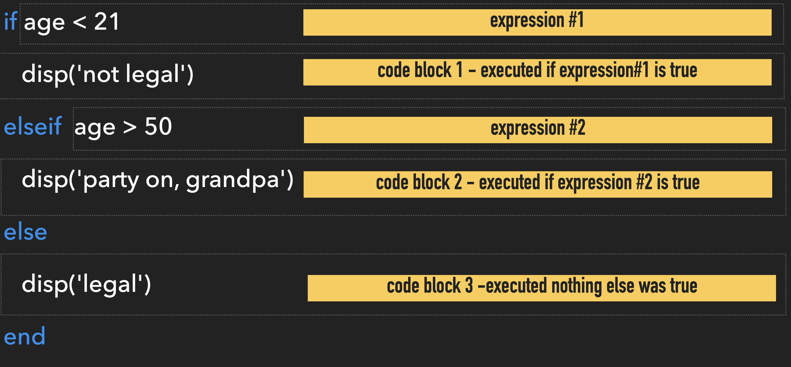

# Control Flow

*for Making Decisions or Repeating Stuff*

![][L-img-water-flow]

[L-img-water-flow]: images/traffic_jam.png

## Overview

*If, then, else, when?*

Control flow is the flow chart of computer programming. Control Flow allow you to create scripts or functions that execute or repeat upon meeting certain conditions. Think of a music player. When you click "Play", the Music plays. That is a type of control flow known as a "conditional statement." Similarly, when you select the "Repeat" function, the same song will play over and over. That is another type of control flow called a loop. We'll talk about that too.

### Somewhat Useful MATLAB Documentation

- [Loops and Conditional Statements](https://www.mathworks.com/help/matlab/control-flow.html'){target="_blank"}

- [if, elseif, else](https://www.mathworks.com/help/matlab/ref/if.html'){target="_blank"}

- [for loops](https://www.mathworks.com/help/matlab/ref/for.html'){target="_blank"}

- [while loops](https://www.mathworks.com/help/matlab/ref/while.html'){target="_blank"}

- [switch, case, otherwise](https://www.mathworks.com/help/matlab/ref/switch.html'){target="_blank"}

### Keywords you should know

- for
- while
- if
- else
- case
- otherwise
- [end](https://www.mathworks.com/help/matlab/ref/end.html'){target="_blank"}
- [return](https://www.mathworks.com/help/matlab/ref/return.html'){target="_blank"}
- [continue](https://www.mathworks.com/help/matlab/ref/continue.html'){target="_blank"}
- [break](https://www.mathworks.com/help/matlab/ref/break.html'){target="_blank"}

### Terminology you should know

- **Control Flow:** the process of creating conditional statements or looping statements.

- **Conditional Statement:** A statement used determine which block of code to execute at run time

- **Looping Statement:** A statement designed to repeatedly execute a block of code

---

## Conditional Statements

![XKCD flow chart cartoon][L-img-xkcd]

[L-img-xkcd]: images/xkcd_flow_charts.png "Flow Charts"

[xkcd 518](https://xkcd.com/518){target="_blank"}

When programming, you often want the computer to respond differently depending on the input. **Conditional statements** are like programmatic flow charts that analyze values of specified variables to determine which block of code should be executed. This is useful for handling unknown situations.

A conditional statement typically contains a series of **expressions** that resolve to either `true` or `false`. Each expression is followed by the block of code to be executed if the expression resolves to TRUE. So, for conditional statements to properly work, only ONE expression should resolve to TRUE on a given run of the statement.  

<!--Say hypothetically  you have designed a facial recognition algorithm for your robot servant and you would like your robot servant to greet you and your family members by your proper names. Furthermore, say you have recently embezzled a large amount of money from a large crime family and you have been forced into hiding. So, you would like your robot servant/sentinel to announce "Intruder Alert!", whenever encountering any person not recognized by the facial recognition algorithm, and to then initiate defensive measures.

Here is a pseudo-code version of a conditional statement that could manage these responses:-->

<!-- 
```text
IF MASTER RECOGNIZED
	greet MASTER as "Mr. Smith"
OR MISTRESS RECOGNIZED
	greet MISTRESS as "Mrs. Smith"
OR CHILD RECOGNIZED
    greet CHILD as "Young Master."
OTHERWISE
	attack INTRUDER
```
-->
<!-- 
In this example, the expressions are shown in ALL CAPS, while the executable blocks are in lower case. Notice that, depending on the expression, only one of the executable blocks will execute. The expressions are evaluated sequentially, so first it would check if "MASTER RECOGNIZED". If the master was recognized, it would then execute the ensuing statement, which in this case would be to greet the Master as "Mr. Smith". If the MASTER wasn't recognized, then the next expression would be evaluated ("MISTRESS RECOGNIZED"). If none of the expressions evaluated `true`, then the final statement would be executed: "ATTACK" -->

<!-- For example, consider taking attendance in a class. If a student is present, they should be marked "Present". If the student is absent, they should be marked "Absent". Attendance is often taken by the instructor reading the names of the students in the class. If the student is present, then they respond "Here."

 This might be problematic if the student is present, but instead says "yeah" or "present". A better way to organize this conditional statement might be as follows:

In this pseudocode example, *`student`* is only set to "absent" if there is no response. So, what you test for in a conditional statement expression is very important to make sure you get the result you want.  -->

### IF ELSE statements

IF, ELSE statements are the simplest and most straight forward of the conditional statements. They are used to create  programmatic flow charts.

!!! abstract "Anatomy of an IF ELSE STATEMENT"

    This is what an IF ELSE statement looks like:

    >**if** *expression 1*
    >
    >>CODE BLOCK 1
    >
    >**elseif** *expression 2*
    >
    >> CODE BLOCK 2
    >
    >**else**
    >
    >>CODE BLOCK 3
    >
    >**end**

    - **Required keywords:** `if` and `end`. 
    - **Optional keywords:** `else` and `elseif`. `else` must be the last keyword before `end`/
    - **Expression:** a statement that can resolve to a `0` or non-zero (e.g. a logical operation). Expressions immediately follow the keywords `if` and `elseif`. `else` and `end` do not have expressions.
    - **Code block:** the line(s) of code that follow a key word line (except `end`). The code that is run if the immediately preceding expression resolves to a non-zero value. If none of the expressions resolve to a non-zero value, then the code block after the `else` line is run.
    - **Evaluation order:** each expression is evaluated sequentially starting from the `if` line. Once an expression resolves to a non-zero value, the subsequent code block is executed and the IF ELSE statement is exited (no other expression is even checked)
   
    
Consider the following example:

{ width="650"}

- NOTE: the variable *`age`* should be set before the IF ELSE statement
- Code Block 1 will only execute if the value of *`age`* is less than 21
- Code Block 2 will execute if *`age`* is greater than 50
- Otherwise, Code Block 3 will execute (for any age between 21 and 50)

??? question "Challenge 1: The case of the missing else"

    === "Question"
        
        IF ELSE statements don't actually require an else statement

        Here, we have a statement that checks whether the variable *`RESPONSE`* contains the string `"Here"`. (like a simplistic Taking Attendance Algorithm).(1)
        { .annotate }

        1. Not shown here is the assignment of a value to *`RESPONSE`*, which typically occurs before the IF ELSE statement.

        ```matlab linenums="1" title="Simple Attendance Algorithm"
        if RESPONSE == "Here"
            student = "present"
        end
        ```

        If *`RESPONSE`* does contain `"Here"`, then variable *`student`* gets assigned the value `"present"`. If not, nothing happens. 

        **CHALLENGE:** add an `else` statement so that if *`RESPONSE`* contains anything other than `"Here"`, *`student`* is set to `"absent"`.
    
    === "Answer"

        ```matlab linenums="1" title="The Attendance Code"
        if RESPONSE == "Here"
            student = "present"
        else
            student = "absent"
        end
        ```

        In this IF ELSE statement, if *`RESPONSE`* is anything other than "Here", *`student`* is set to `"absent"`. 

??? question "Challenge 2: When Present is not Here"

    === "Question"

        In the previous challenge, we only test if *`RESPONSE`* is equal to `"Here"`. This works great, if the response from the student is exactly "Here". But what if the student is not an automaton and responds with an alternate response, like "Yup", "Yo", or even "present"? The conditional statement would return a `FALSE` and the student would be marked absent. 
        
        Perhaps it would be more accurate to only mark the student "absent" if there is no response (Bueller? Bueller? Bueller?) and "present" if there is any response at all.
        
        How would you modify the above IF ELSE statement so that when *`RESULT`* is set to `""`, *`student`* is set to `"absent"`, and when *`RESULT`* has any other value,  *`student`* is set to "present"?

    === "Answer"
    
        ```matlab linenums="1" title="Updated IF ELSE statement"
        IF RESPONSE == ""
            student = "absent"
        ELSE
            student = "present"
        END
        ```
        Here, when *`RESPONSE`* is empty, *`student`* is set to "absent". If  *`RESPONSE`* contains anything,  *`student`* is set to "present". 

#### Organizing Multiple ELSE IFs

It is important to remember that in an IF ELSE statement, each expression is evaluated sequentially. Once an expression evaluates to TRUE (or a non-zero number), all subsequent expressions are ignored. So, when you are creating an IF ELSE statement, it is critical to think about the order of the expressions to make sure each expression gets it's fair shake.

The following example contains multiple expressions to test the property of a number stored in *`x`*. Here we make extensive use the [**`mod`**](https://www.mathworks.com/help/matlab/ref/double.mod.html){target="_blank"} function, which returns the remainder after division (modulo operation). This is a very useful function to help identify even or odd numbers , or even perfect squares and powers of two (1).
{ .annotate}

1. For example, `mod(x,2)` returns the remainder after dividing by 2. So, this expression returns a `1` if `x` is odd, and a `0` if `x` is even. Similarly, `mod(x,1)` is useful for identifying whole numbers. In this case, it returns a 0 if *`x`* is a whole number, and a fractional number otherwise. Remember, expressions in IF ELSE must resolve to zero or a non-zero number.
   
Here is some terminology and facts to recall as you review the following code:

- **Prime Number**: a number divisible only by itself and 1. `1` is not a prime number, but `2` is. The rest of the prime numbers are odd numbers.
- **Perfect square**: a number that when you take the square root, you get a whole number. e.g. $\sqrt 4 = 2$, so `4` is a perfect square.
- **Power of 2**: a number in the form $2^n$. e.g. $2^3=8$ so `8` is a power of 2.

```matlab linenums="1" title="IF ELSE with Multiple expressions"
x = 19
if isprime(x) % tests whether a number is prime (1)
    str = 'a prime number';
elseif ~mod(sqrt(x),1) % tests for a perfect square (2)
    str = 'a perfect square'
elseif ~mod(log2(x),1) % tests for a power of 2 (3)
    str = 'a power of 2'
else
    str =  'none of the above';
end

fprintf('%d is %s\n', x, str) % fprintf outputs directly to the command window
```

1. The function [**isprime**](https://www.mathworks.com/help/matlab/ref/isprime.html){target="_blank"} tests whether the number is prime.
2. `~mod(sqrt(x),1)` - A perfect square should be a whole number after taking the square root. So, in this syntax, we take the square root of the inputted number, *x*, and then ask if there is any remainder after dividing by 1. If the square root is not a whole number (like `1.4142`), then we would get a remainder (like `0.4142`). Whole numbers will return a zero after division by 1 (no remainder). So,  we apply a logical NOT (`~`) to the output to make this expression resolve to true when we do get a whole number.
3. `~mod(log2(x),1)` - A number that is a power of 2 should return a whole number when plugged into **`log2`**. `mod(x,1)` returns 0 for whole numbers, so we apply a logical NOT to the output.

So, for the value `19`, the `isprime(x)` expression would resolve to true, and *`str`* would be set to 'a prime number' because 19 is a prime number. No other expressions would be tested.

For the value `9`, the first expression would resolve to FALSE (`9` is not prime), but the second expression would resolve to TRUE, and *`str`* would be set to 'a perfect square` (1). The third expression would be ignored.
{ .annotate }

1. `9` is of course a perfect square: `3 x 3`

??? question annotate "Challenge: The trouble with 16"

    === "Question"

        Is 16 a perfect square? (1)
        { .annotate }

        1. Yes. $4 * 4=16$

        Is 16 a power of 2? (1)
        { .annotate }

        1. Yes. $2^4=16$
        
        So, what is *`str`* set to after running the above IF ELSE statement?
    
    === "Answer"

        Even though 16 is both a Perfect Square and a Power of 2, *`str`* will be set to `'a perfect square'` since that is the first expression encountered that resolves to true. The third expression testing for Powers of 2 will be ignored in this case.

??? question "Challenge: Odds or Evens"

    === "Question"
        Review the IF ELSE Statement above and add the following functionality:

        1. Reports if the Number is 'odd, but not prime or a perfect square'
        2. Reports if the number is even

        Remember that `mod(x,2)` returns a `1` if the number is odd.


    === "Answer"

        ```matlab
        if isprime(x) % tests whether a number is prime
            str = 'a prime number';
        elseif ~mod(sqrt(x),1) % tests for perfect squares
            str = 'a perfect square';
        elseif ~mod(log2(x),1) % tests for powers of2
            str = 'a power of 2!';
        elseif mod(x,2) % tests for odd numbers 
            str = 'odd';
        else % assumes number is even
            str =  'even';
        end
        fprintf('%d is %s\n', x, str) % fprintf outputs directly to the command window
        ```

        3. Notice the expression to test for 'odd' is after the other expressions. So this will only be reported once testing for the other properties have been exhausted. Remember, `1` is a power of 2 — $2^0=1$.
        4. Note that we don't have to test whether the number is even. We just assume once all of the other expressions resolve to false, that the number is even, so we place that after the **`else`** keyword.

---

## SWITCH CASE

You use SWITCH, CASE statmements when you just want to match the variable contents to a specific value, like 'red'. In fact,  *SWITCH, CASE* statements are best used when you have an exact value you want matched, such as a word or a number.

!!! abstract "Anatomy of a SWITCH CASE statement"

    SWITCH CASE statements use the `switch` and `case` key words. These Conditional Statements execute depending on the value of the indicated  *variable*. If the value in *variable* matches the value in one of the CASE lines, then corresponding block of code is executed. If there are multiple matches, only the first match is executed. If there is no match, the code block following the **otherwise** keyword is executed. The **otherwise** keyword is optional, and if not included, and there is not match, the SWITCH CASE statement simply exits and runs no code blocks.

    >**switch** *variable*
    >>**case** *value 1*
    >>>CODE BLOCK 1
    >>
    >>**case** *value 2*
    >>>CODE BLOCK 2
    >>
    >>**case** *value 3*
    >>>CODE BLOCK 3
    >>
    >>**otherwise**
    >>>CODE BLOCK 4
    >
    >**end**

    - The *variable* is indicated immediately after the `switch` keyword. This tells the statement to inspect the contents of variable. 
    
    - The potential *values* are listed after each `case` keyword.
    - If the *value* matches the content of the *variable*, the block of code immediately following the *value*  is executed.
    - Only one CODE BLOCK is executed per run.   

Consider the following example

```matlab linenums="1" title="Example: Switch, Case"
x = 'red' % set x to the char array 'red'

switch x
    case 'red'
        str = 'Roses are red';
    case 'green'
        str = 'Stems are green';
    case 'blue' 
        str = 'Violets are blue';
    case 7
        str = 'Seven is a number'
    otherwise
        str = 'try again'
end

fprintf('%s', str) % output string to command window
```

Since the variable  *`x`* was assigned the character array 'red', before the SWITCH CASE statement, only the code on line 5 will run: `Roses are red')`. If you change *`x`* to 'green', 'blue', or 7, then that corresponding line of code will run (lines 7 and 11, respectively). If you change *`x`* to *anything* else, like 'moon' or 4, then the *otherwise* code block `display('try again')` will run (line 13). IMMPORTANT: SWITCH CASE statements are case-sensitive. So, you if you change *`x`* to 'Red', the *otherwise* code block will execute.

??? question "Challenge: You're on the case"

    === "Challenge"

        Add two additional cases to the SWITCH CASE statement that do the following

        1. For 'magenta', set the variable *`str`* to 'Magenta is Magnificent'
        2. For either 'orange' or 'yellow' (case statements can be cell arrays to indicate multiple options), set *`str`* to 'Orange you glad you chose yellow (or orange)'

        Additional Changes:

        - Remove the case for 7
        - Use the function **`inputdlg`** to request a string from the user. Assign the output from the function to *`x`*
        - Use the function **`lower`** on *`x`* so all characters in the string are lowercase.

    === "Answer"

        ```matlab linenums="1" title="Example: Switch, Case"
        x = inputdlg('Enter a color') % get input from User, returns a cell array

        switch lower(x{:}) % notice the indexing of x
            case 'red'
                str = 'Roses are red';
            case 'green'
                str = 'Stems are green';
            case 'blue' 
                str = 'Violets are blue';
            case 'magenta'
                str = 'Magenta is Magnificent'
            case {'orange' 'yellow'} % notice the cell array - allows for multiple options
                str = 'Orange you glad you chose yellow (or orange)'
            otherwise
                str = 'try again'
        end

        fprintf('%s', str) % output string to command window
        ```
    Here we use **`inputdlg`** to request a string from the user. Notice that we enter a prompt string to tel the user what to enter: `Enter a color`. 
    
    **`inputdlg`** returns a cell array, so we need to extract the contents of the cell using the curly brackets: `x{:}`. The contents from the x are then run through **`lower`** to change all characters to lowercase. Since **`inputdlg`** captures string arrays by default, we needed to remove the case for 7. If we wanted to have cases for numbers, we would need more complicated syntax, and we don't want that.  

    For Orange or Yellow, we use a cell array for the case value: `{'orange' 'yellow'}`. This case will run for either 'orange' or 'yellow'.

    Finally the function **`fprintf`** displays the string in the command window. We could have just as easily used **`display`**: `disp(str`)

## Loops

**Looping Statements** are used to repeatedly execute the same code block over and over while modifying the values of certain variables. Computers are really good at repeating tasks over and over, sometimes to a fault.

### FOR LOOPS

FOR LOOPS are used to repeatedly execute a CODE BLOCK for a predetermined number of times.

!!! abstract "Anatomy of a FOR LOOP"

    A FOR LOOP statement is bracketed by the `for` and `end` keywords. In between is the block of code that is run repeatedly.
    
    > **for** *index = values*
    >
    >>CODE BLOCK
    >
    > **end**

    1. Notice immediately following the the `for` keyword is an initializing statement that resembles a variable assignment
    2. This *initializing statement* determines how many times the LOOP will run
    3. The number of times that the loop will run equals the number of columns in *values*.
    4. On each iteration of the loop, the *index* will pull a value from a subsequent column in *values*. So, *index* will have a different value on each iteration. 
  
For example, consider the following:

```matlab linenums="1" title="FOR LOOP"
for i = 1:10
	fprintf('The value of i is %d\n',i)
end
```

These 3 lines set up the entire *for loop* statement.

- **Line 1** contains the the *initializing statement* (right after the `for` keyword). This *initializing statement* creates a horizontal vector `i` containing the integers 1 through 10. Since there are 10 *horizontal* elements, the FOR LOOP will run 10 times.
- **Line 2** contains the executed line of code:
  > `fprintf('The value of i is %d',n)`
- In **Line 2**, the variable *`i`* refers to current element in the vector set-up in in the *initializing statement*. So, on the first loop, *`i`* equals 1. On the second loop, *`i`* equals 2, etc.

After the above FOR LOOP is complete, you should see the following output in the command window:

```matlab title="Output after FOR LOOP"
The value of i is 1
The value of i is 2
The value of i is 3
The value of i is 4
The value of i is 5
The value of i is 6
The value of i is 7
The value of i is 8
The value of i is 9
The value of i is 10
```

...This output is the result of executing the **`fprintf`** function over and over again while only changing the value of *`i`* on each iteration.

!!! note "Important Notes About For Loops"

      - **FOR LOOPS** will loop the number of times equal to the number of columns in the array of the *initializing statement* (not the maximum value in the array)

      - You can use any variable name in the *initializing statement* (*n* and *i* are popular variable names for **FOR LOOPS**), or you could even use a vector array that has already been created

      - The **FOR LOOP** initializing array does not have to start with the value 1

---

### Challenge - For Loop

=== "QUESTION"

    How many times will the following **FOR LOOP** loop?

    ```matlab linenums="1"
    for m = 2:2:10
        fprintf('The value of m is %d\n',m)
    end
    ```

    - Also, what will be displayed in the command window after execution of the FOR LOOP is complete?

=== "Answer"

    - This **FOR LOOP** loop will loop **5 times**
    - The following will be displayed:
    
    ```matlab title="result"
    The value of m is 2
    The value of m is 4
    The value of m is 6
    The value of m is 8
    The value of m is 10
    ```

---

### Preallocation

FOR LOOPS are often used to fill arrays in some sequential fashion, such as element-by-element or row-by-row. When doing this, you should always *[preallocate](http://www.mathworks.com/help/matlab/math/resizing-and-reshaping-matrices.html#f1-88760){target="_blank"}* the array, meaning that you should create an empty array that already contains the number of elements that you want to end up with. Then, during the execution of the loop, you simply fill each element of the array with the data that you want. If you know how big your final array is going to be, preallocation is easily accomplished using the function **[zeros](http://www.mathworks.com/help/matlab/ref/zeros.html){target="_blank"},** which creates an array filled with zeros.  If you don't preallocate, MATLAB has to create a copy of the variable on each iteration of the loop which takes more time and uses more memory.

For  example, the following creates an array *i* with 10 zeros

```matlab linenums="1"
i = zeros(1,10)
```

```matlab title="result"
i =
    0     0     0     0     0     0     0     0     0     0
```

You can fill the elements of *i* using a **FOR LOOP** as follows:

```matlab linenums="1"
for n = 1:10
 i(n) = n*10
end
```

On each iteration of the loop, you fill one element and get an output that looks like the following

```matlab title="Filling an array using a FOR LOOP"
i =
    10     0     0     0     0     0     0     0     0     0 % iteration 1
i =
    10    20     0     0     0     0     0     0     0     0 % iteration 2
i =
    10    20    30     0     0     0     0     0     0     0 % iteration 3
i =
    10    20    30    40     0     0     0     0     0     0 % iteration 4
i =
    10    20    30    40    50     0     0     0     0     0 % iteration 5
i =
    10    20    30    40    50    60     0     0     0     0 % iteration 6
i =
    10    20    30    40    50    60    70     0     0     0 % iteration 7
i =
    10    20    30    40    50    60    70    80     0     0 % iteration 8
i =
    10    20    30    40    50    60    70    80    90     0 % iteration 9
i =
    10    20    30    40    50    60    70    80    90   100 % iteration 10
```

…As you can see in the Command Window output, each run of the FOR LOOP adds a multiple of *`n`* into the nth element of *`i`*. Notice how the zeros are being replaced with the data.

### Vectorization

The term **vectorization** refers to the creation an array simply by using the MATLAB syntax of array creation (without the use of a FOR LOOP). Indeed, it is often possible to create an array without needing a FOR LOOP in MATLAB. This is known as vectorizing a FOR LOOP. You should always try to vectorize your code whenever possible as the vectorized form of the code can run faster than the FOR LOOP form.

For example,

```matlab
j = [1:10] * 10

j =
    10    20    30    40    50    60    70    80    90   100
```

…accomplishes the same thing as the previous loop, but uses only one line of code and no looping.

### Combining Conditional Statements and FOR LOOPS

Control Flow statements are often used in combination. Consider the following:

```matlab linenums="1" title="a FOR LOOP containing an IF ELSE statement"
for x = 1:10
    if mod(x,2) % test for odd numbers
        eo = 'odd';
    else % if not odd, its even
        eo = 'even';
    end
    
    fprintf('\nThe number %d is %s\n',x,eo)
end
```

…This FOR LOOP runs 10 times. On each iteration, the IF, ELSE conditional statement checks whether the current value of `x` is odd or even and sets the value of `eo` accordingly. The function **`fprint`** prints the result to the command window as follows

```matlab title="result"
The number 1 is odd
The number 2 is even
The number 3 is odd
The number 4 is even
The number 5 is odd
The number 6 is even
The number 7 is odd
The number 8 is even
The number 9 is odd
The number 10 is even
```

---

## WHILE LOOPS

WHILE LOOPS are used to repeatedly execute a block of code until a condition is met.

!!! annotation "Anatomy of a WHILE LOOP"
    
    WHILE LOOPS are bracketed by the **while** and **end** keywords. The **while** keyword is followed by an *expression* that resolves to `true` or `false`

    >**while** *expression*
    >
    >>CODE BLOCK
    > 
    >**end**

WHILE LOOPs loop indefinitely until the *expression* resolves to `false`. On each iteration of the WHILE LOOP, the *expression* is evaluated. If the expression evaluates to `true`, then the looping continues.  So, the variable being evaluated in the expression must change in the block of code for the looping to ever stop. This also means that if you are not careful with your code and the *expression* never resolves to `false`, the WHILE LOOP will NEVER STOP LOOPING!

!!! tip "Breaking out of Stuck WHILE LOOPS"
    Sometimes while loops can be trapped in an unbreakable loop (usually due to shoddy programming). To force a break out from a **while loop**, enter  `Ctrl-C`.

Consider the following:

```matlab linenums="1" title="Example: WHILE LOOP"
n = 1
while n<10
    disp(n)
    n = n+1;
end
```

This loop simply displays the value of *n* each time the loop iterates. And then increments the value of *`n`* by 1. Notice that the code inside the loop does not execute once the value of *n* reaches 10. Once *n*=10, the expression `n<10` resolves to FALSE and the loop stops executing (and doesn't execute the code after the WHILE line).

### Challenge - While LOOP 1

=== "Question"

    How would you change the above example to make the WHILE LOOP stop iterating after the value of *`n`* reaches 20?

=== "Answer"

    You change the expression to `n<20`

    ```matlab linenums="1"
    n = 1
    while n<20
        disp(n)
        n = n+1;
    end
    ```

---

So, why bother with WHILE loops? The code above could easily be accomplished using a FOR LOOP. The main reason that you use a WHILE is for situations when you don't know beforehand when the repeating code should stop executing.

Consider the following code which the simulates the sequential rolling of a die until a 5 is rolled

```matlab linenums="1" title="Example: WHILE LOOP"
die = 1; % initial value of die is set to 1
while die ~=7
    fprintf('You rolled a %d. Try again.\n',die) % report the die value
    die = randi(6,1,1); % randomnly assign a new value to the die (1-6)
end
fprintf('You rolled a %d. Nice Job!',die);
```

When you are rolling an actual die, there is no way to guess when you are going to roll a 5. You just have to roll until you get a 5.

In this example, we use the function [**randi**](https://www.mathworks.com/help/matlab/ref/randi.html){target="_blank"} to randomly return an integer between 1 and 6. Each time the WHILE LOOP iterates, **randi** returns a different integer. The WHILE LOOP will continue to iterate until *die* is randomly set to the value `5`.

Here is the output I got the last time that I ran the code:

```matlab title="WHILE LOOP output"
You rolled a 1. Try again.
You rolled a 1. Try again.
You rolled a 2. Try again.
You rolled a 1. Try again.
You rolled a 1. Try again.
You rolled a 5. Nice Job!
```

Notice that I needed two calls for **`fprint`**: one for inside the LOOP to report the current value of *die*, prior to changing its value, and one outside of the LOOP to report the final value of the die.

If you run this code in MATLAB, you will very likely get a different output. Try it now!

### Challenge - While LOOP 2

=== "Question"
    What would you change in the code above so that the WHILE LOOP stops iterating after "rolling" a 3 instead of a 5?

=== "Answer"
    You would Change the conditional expression to:

    `while die ~=3`

    as follows

    ```matlab linenums="1"
    die = 1; % assign die value of 1
    while die ~=3 % <== Change the 5 to a 3 here
        fprintf('You rolled a %d. Try again.\n',die) % report the die value
        die = randi(6,1,1); % randomly assign a new value to the die (1-6)
    end
    fprintf('You rolled a %d. Nice Job!',die);
    ```

---

### A More Advanced WHILE LOOP Example

Warning. This example involves math.

To further explore WHILE LOOPS, let's consider the following the illuminating example:

>You receive an allowance of `$20` per week, `$6` of which you immediately spend on candy and soda. This is a non-negotiable expense. Recently, all your friends got hoverboards, and you want one too. But hoverboards currently cost `$100`, and you only have `$20` in your bank account. Worse, due to the surge in popularity, hoverboard prices have been steadily increasing in price by roughly `3%` each week. You want to know how many weeks it will take to save up for a hoverboard, assuming your allowance and candy and soda expenses remain constant.

Manually, you could solve this problem by calculating your weekly net income ($14), adding that amount to your bank account, and then comparing the amount in your bank account to the current price of the hoverboard. Remember, the hoverboard price increases each week, so you will have to recalculate the current price of the hoverboard. If your bank account is less than the amount of the hoverboard, then you recalculate the bank  balance and hoverboard price until you have more money in your bank account than the updated price of the hoverboard. To determine how long this will take, you count the number of times you had to repeat the recalculation process (saved), which is equivalent to the number of weeks until you're cruising on your sweet, sweet hoverboard.

A WHILE LOOP can automate the recalculation process as follows:

```matlab linenums="1"
week = 0; % starting at week zero
bank_account = 20; % current bank balance 
candy_soda_expense = 6; % non-negotiable weekly expenses
allowance = 20; % weekly income
hoverboard = 100; % starting price of the hoverboard

while bank_account < hoverboard % iterate while bank account is less than hoverboard price
    bank_account = bank_account - candy_soda_expense + allowance; % recalculate weekly bank balance
    hoverboard = hoverboard + hoverboard * 0.03; % price increases by 3% each week
    week = week + 1; % iterates the week count
end

fprintf('The number of weeks to save up for a hoverboard is %d.\nThe price of the hoverboard will be %1.2f.\nYou will have %1.2f in your bank account\n', week, hoverboard, bank_account)

```

…Prior to the start of the loop, we preallocate several variables that will be used inside the loop.

- *`bank_account`*: keeps track of your current bank balance, starts at $20
- *`hoverboard`*: keeps track of the increasing price of hoverboards, starts at $100
- *`candy_soda_expense`*: your weekly expense, $6 on candy and soda
- *`allowance`*: your weekly income, $20/week
- *`week`*: a variable used to track the number of weeks.

At the start of the loop, the WHILE relative *expresssion* `bank_account < hoverboard` is evaluated. If bank_account is below hoverboard, the relative operation returns a `TRUE`, and the LOOP starts. Inside of the loop are the steps need to recalculate the balance in your bank account and the price of hoverboard. On each iteration of the loop, the value of *`bank_account`* and *`hoverboard`* are recalculated and *`week`* increases by 1. If, `bank_account < hoverboard`, then the WHILE loop continues to iterate. When `bank_account < hoverboard` is NOT TRUE, the WHILE LOOP code block is skipped and then the line after the WHILE LOOP executes (the line with the function **`fprint`**), which prints the results to the command window.  

And as we can see below, the result is:

```matlab title="Final Result"
The number of weeks to save up for a hoverboard is 8.
At this time, the price of the hoverboard will be 126.68
and you will have 132.00 in your bank account.
```

### Challenge - WHILE LOOPS 3

=== "QUESTION"

    How many weeks would it take if:

    -  you eliminate your Candy and Soda expense? (and everything else was at the original setting)?
    -  You allowance was only $15?
    -  The starting price of a Hoverboard was $150?
    -  You already had $100 in your bank account?

    …When answering the above questions, assume that all other variables are reverted back to their original defaults

=== "Answer"
    How many weeks would it take if: (Remember, answer each question assuming all other variables are reverted back to their original defaults).

    To answer these questions, you simply change the starting values of the variables prior to the start of the WHILE LOOP. Don't change anything inside the loop. Be sure to change all the variables back to the default values, before adjusting the value of any 1 variable. 

    -  ...your Candy and Soda expense was $0 (and everything else was at the original setting)?
    > 5 weeks
    -  ...your allowance was $15?
    > 16 weeks
    -  ...hoverboards cost $150?
    > 16 weeks
    -  ...your starting bank_account amount was $100
    > 0 weeks. The WHILE LOOP doesn't even start because 100 is NOT less than 100.