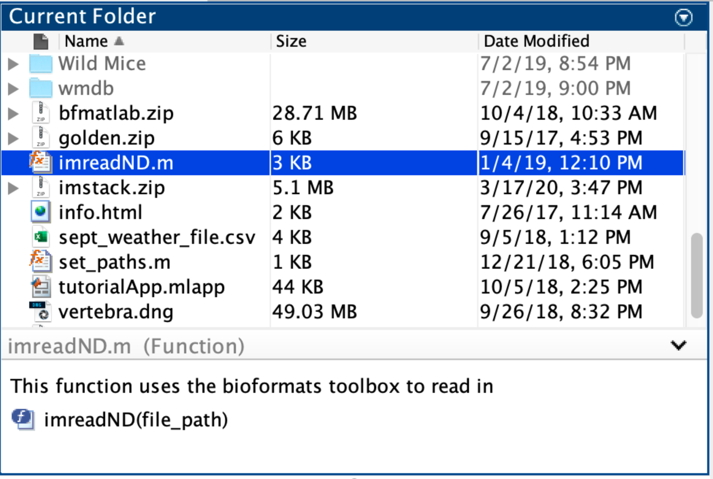
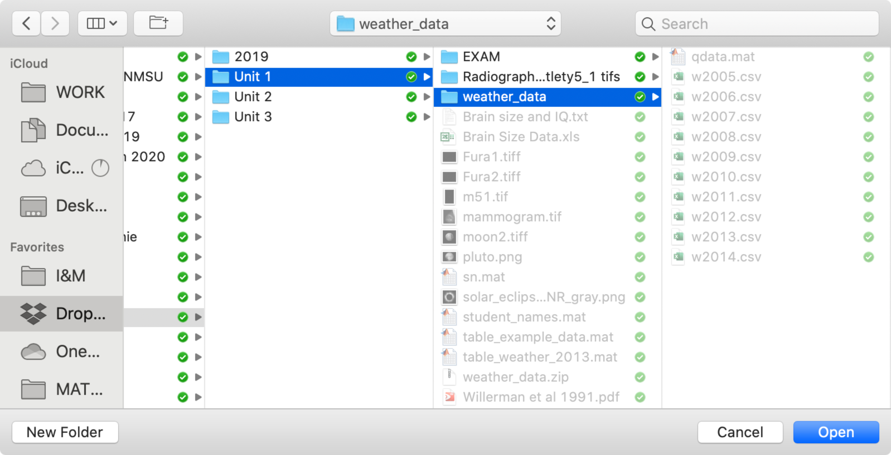
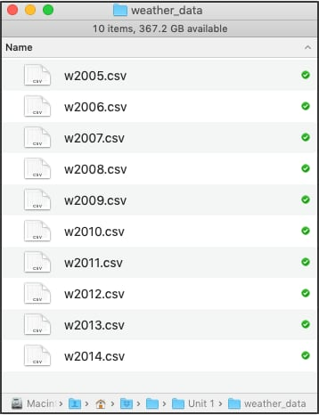
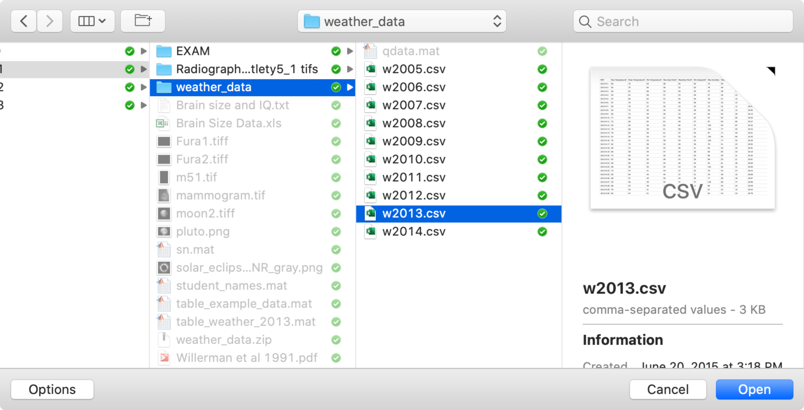

# Files and Folders

!!! abstract "*how to find stuff on your computer*"

{ width="250"}

## Overview

Often, you will need to import data into MATLAB and that data will often be stored in the form of a file somewhere on your computer. The good news is that MATLAB knows how to find and handle the files on your computer.

In this module, we will learn how to access files from MATLAB using path strings and built-in MATLAB dialog windows. Fortunately, path strings are little more than gussied up character arrays, so this should be relatively straightforward.

### Terminology you should know

- **Directory**: a folder on your computer
- **Path**: a character array that contains the unique location of a file or folder on a computer
- **File Separator**: a character (usually a `\` or `/`) that indicates a new folder in a path string
- **Wildcard character**: a character that substitutes for any other character or character range in a path string. In MATLAB, this character is an asterisk (*).

### Stuff you should know

After this module, you should be able to:

- Discriminate between path strings from different operating systems based on the file separator used

- Tell whether the path string points to a folder or to a file

- Explain the difference between an "absolute" and a "relative" path

- Create your own path strings, including paths to files and folders

- Use all of the Functions listed in this module

### Important Functions

- [cd](https://www.mathworks.com/help/matlab/ref/cd.html) - change current folder
- [dir](https://www.mathworks.com/help/matlab/ref/dir.html) - List folder contents
- [fileparts](https://www.mathworks.com/help/matlab/ref/fileparts.html) - Parts of file name and path
- [filesep](https://www.mathworks.com/help/matlab/ref/filesep.html) - File separator for current platform
- [fullfile](https://www.mathworks.com/help/matlab/ref/fullfile.html) - Builds a full path from path parts
- [numel](https://www.mathworks.com/help/matlab/ref/numel.html) - number of array elements
- [pwd](https://www.mathworks.com/help/matlab/ref/pwd.html) - returns a path to the current folder
- [uigetfile](https://www.mathworks.com/help/matlab/ref/uigetfile.html) - Open **File** selection dialog box
- [uigetdir](https://www.mathworks.com/help/matlab/ref/uigetdir.html) - Open **Folder** selection dialog box
- [userpath](https://www.mathworks.com/help/matlab/ref/userpath.html) - returns the user path
- [readtable](https://www.mathworks.com/help/matlab/ref/readtable.html) - reads in data from a spreadsheet file

## The MATLAB Current Folder

When you launch MATLAB, it automatically opens a folder on your hard drive. This folder is known as the "Current Folder" and there is a window in MATLAB (titled "Current Folder") that shows the contents of this folder.

{ width="450"}

!!! info "Current Folder Path"
    You can find a representation of the location of the "Current Folder" on your hard drive just below the Ribbon Tool Strip in the Address field of MATLAB:
    
    { width="350"}

    …Here, the address shows the location of the MATLAB folder on my computer, which is the default folder that MATLAB opens.

You can change the "Current Folder" by clicking on the "Browse for Folder" icon  ![][L-img-browse-dir] that is to the left of the address bar.

!!! note "Directory vs Folder"
    In this module, we will be using the term "folder," when referring to folders on your computer. But the term "directory" is equivalent and often used interchangeably. So, if you start seeing a discussion of directories, that means folders…

### Now You try: Review Current Folder

1. Click on the Browse for Folder icon  ![][L-img-browse-dir] 
2. Select your Documents folder
3. Review the address bar. You should see something like this: {width=250px}
4. Review the contents of the "Current Folder". You should documents that look specific to your computer.
5. Navigate back to the MATLAB folder (it should be in your documents folder).

[L-img-browse-dir]: images/toolstrip_browse_directory.png

---

## The Path String

{ width="200"}

A path string is a character array that contains the unique location of a file or folder. This array represents a flattened directory tree hierarchy in which the outermost folder or drive is found on the far left of the array and the innermost folder or file is found on the far right of the array.

The function **`pwd`** returns the current folder path. This is the path that is displayed in the address bar.

```matlab linenums="1" title="pwd returns the current path"
pwd
```

``` matlab title="result"
ans =

'/Users/ernesto/Documents/MATLAB' % current folder path
```

…As you can see, the output path from **`pwd`** is a character array which represents the location of the current folder.

The function **`userpath`** returns the path of the default folder that MATLAB opens (a.k.a the user folder)

```matlab linenums="1" title="Get default Current Folder"
userpath
```

```matlab title="result"
ans =

    '/Users/ernesto/Documents/MATLAB'
```

…this just happens to be the same path that is returned by **`pwd`**, because you haven't changed the current folder yet.

!!! note "NOTE: Folder vs File paths"

    A path to a folder vs a path to a file look nearly identical. Both start with a series a folder names. The only way to differentiate between the two is to look at the last name in the string. If the name contains an extension (a period, followed by a series of characters, like .txt), then it is likely a file. If there is no extension, then it is likely a folder.

### The File Separator

The file separator is the character that separates individual folder and file names in a path string. This character differs between MAC and PC.

You can use the function **`filesep`** to return the correct slash for your operating system:

```matlab linenums="1"
filesep
```

```matlab title="result"
ans =

/ % forward slash on macOS systems
```

### Mac vs PC File separators

On a Mac (and unix), folders and files are separated  by a forward slash (`/'). On PCs, they are separated by a backward slash ("\\") and drives are indicated by a colon (`:`) or a double backward slash (`\\`).

Consider the following representation of a folder hierarchy:

```title="Folder tree hierarchy representation"
Users
 |-- ernesto
 |   |-- Documents
 |   |   |-- MATLAB
```

<!--![][L-img-file-path]-->

In the above representation, the top name is the top folder and each folder below that is a folder inside the folder above it. So, in this example, the "MATLAB" folder is in the "Documents" folder, which is in the "ernesto" folder, which is in the "Users" folder.

To represent this hierarchy on a Mac you use a one-line character array (vector) and separate the folders using forward slashes:

```title="macOS path"
'/Users/ernesto/Documents/MATLAB'
```
<!--1. On Macs, the root folder is signified simply by the forward slash (`/`). You don't type `root`.
-->

This character array points to the MATLAB folder in the above tree hierarch which is found in the `Documents` folder, which is in the `ernesto` folder in the `Users` folder

On a PC, you use back slashes (`\`) as file separators, so a similar folder hierarchy on a PC might be saved as the following path string:

```title="PC path"
'C:\Users\Ernesto\Documents\MATLAB'
```

This above path points to the MATLAB folder in the Documents folder in the Ernesto folder in the Users folder on the C Drive.

[L-img-file-path]: images/file_path.png

!!! note "Absolute vs Relative Paths"

    - An **absolute** path contains the full path information from the hard drive on down to the folder of interest. For example, the path `'/Users/ernesto/Documents/MATLAB'` points to the folder "MATLAB", which is in the "Documents" folder, which is in the "ernesto" folder, which is in the "Users" folder, which is on the main hard drive or root folder (which is represented by the first file separator, '/'). You can use an absolute file path to find a file from anywhere on your computer.
    - A **relative** path is *relative* to the "Current Folder" in MATLAB. For example, in my MATLAB folder, there is a folder called "Wild Mice" (see above). A relative path to this folder would simply be `'Wild Mice'`. In this case, MATLAB assumes the top folder to be the MATLAB folder. In side the "Wild Mice" folder is a folder called "wmdb". The relative path to this folder is `'Wild Mice/wmdb`.

    It is usually best to use absolute paths, but sometimes relative paths are useful or even unavoidable.

## Copying File Paths

One of the easiest ways to create a file path is to simply copy the path.

You can find the path to the "Current Folder" by clicking on the blue folder in the address bar:

{ width="350"}

This will convert the display to a string that is already conveniently highlighted and can be copied using standard PC operations (e.g. control-c)

[L-img-path-string]: images/address-bar-path-string.png

### Try It Now: Assign current folder path to a variable

Assign the Current the folder path to a new variable *mycurrentfolder* using the following steps:

1. Copy the address from the address bar
2. In the command window, create a variable called `mycurrentfolder`
3. Assign to this variable the string you just copied. Don't forget the single quotes

You should enter something like this:

```matlab linenums="1"
mycurrentfolder = '/Users/ernesto/Documents/MATLAB'
```

and get something like this:

```matlab title="result"
mycurrentfolder =

    '/Users/ernesto/Documents/MATLAB'
```
… This is a path string, plain and simple. Notice that it is identical to the output from **`pwd`**.

### Copying Paths from your computer

Both Mac and PC allow you to copy file paths to files using their system file browsers. You then simply paste the path as a character array in MATLAB and then assign to a variable, as we did above.

To do this:

- In the Mac Finder, [option-right-click on a file](https://www.macobserver.com/tips/quick-tip/macos-copying-file-pathnames/) and select the menu item to capture item as a "pathname."

- In the Windows File Explorer, **shift-right-click** on a file and select the "copy as path" menu-item

When creating file paths in MATLAB, don't forget that paths need to be character arrays, so they need be bracketed by single quotes:

```matlab linenums="1"
file_path = '/Users/ernesto/Documents/MATLAB/my_cool_file.txt'
```

---

## Prompting Users to Select Files or Folders

When running code, you often need your file paths to be generated programmatically (not copied and pasted manually). This is especially important as different computers will have different folder names and hierarchies, and different operating systems use different file separators (forward vs backward slashes).

Luckily there are many different functions that you can use to generate these paths for you. One way to do this is to use the System File Browser to select and open a file on a computer.

In MATLAB, we use two main functions to bring up the file browser:

2. **`uigetdir`**: For selecting folders
3. **`uigetfile`**: For selecting files

Both functions work fairly similar in that they bring up the system file browser dialog, which allows the user to select a file or a folder. Once the User selects "OK", the function saves the name of the file or the folder and the path to separate variables.

### Generating Folder paths using the File Browser

To get the path to a folder using the system file browser, we use the function **`uigetdir`**, as follows:

```matlab linenums="1" title="Get Folder Path"
weather_folder = uigetdir(pwd,'Find the Weather Folder')
```

After a call to **uigetdir,** you will get a file browser, like so:

{ width="550"}

…Notice that you are unable to select any files (here, all of the files are grayed-out). 

If you choose a folder with the system browser and select "Open", then the function will assign the folder path to the indicated variable.

In this example, we selected the "weather_data" folder (it's highlighted in blue) and then we  clicked on the "Open" button. After doing so, we get a result like this:

```matlab title="result"
weather_folder =
    '/Users/ernesto/Documents/Unit 1/weather_data'
```

…The variable `weather_folder` contains the path to the folder that was selected. Notice that the appropriate file separators (forward slashes in this case) are incorporated into the path

### Generating File paths using the File browser

If we want to generate a path to a file using the file browser, then we use the function
 **`uigetfile`**.

Consider our "weather_data" folder again:

<figure markdown="span">
    { width="300" align=left}
    <figcaption>Folder containing 10 files</figcaption>
</figure>

There are 10 `*.csv` files (1) in this 'weather_data' folder. We can use the function **`uigetfile`** to bring up the system file browser and prompt the user to navigate to this Weather Data folder and select one of the files.
{ .annotate }

1.  :man_raising_hand: A `*.csv` file is a spreadsheet format (comma separated values).


```matlab linenums="1" title="Use uigetfile to Prompt user to select a file"
[Filename, Pathname] = uigetfile('*.csv')
```

This code will brings up the system specific file browser and allow the user to select a file. The input `'*.csv'` indicates that the dialog window should only display or highlight `*.csv` files. The asterisk in this string is a wildcard character that means "any file name". The output variables  *`Filename`* and *`Pathname`* are assigned only after the user selects a file and clicks on open.  

After we execute the **`uigetfile`** function, we get the system file browser dialog window:

<figure markdown="span">
    { width="550"}
    <figcaption>**uigetfile** system file browser (on a Mac)</figcaption>
</figure>

If we select the "w2013.csv" file and then click on the "Open" button, the **`uigetfile`** function assigns the file name and path to the variables *`Filename`* and *`Pathname`*.

```matlab title="Variable Assignment after uigetfile function execution"
Filename =

    'w2013.csv'

Pathname =

    '/Users/ernesto/Documents/Unit 1/weather_data/'
```

…Notice that the function actually returns the path as two parts: the filename (replete with extension) and the folder path.

!!! warning "Warning: File not opened after **uigetfile**"
    After running **`uigetfile`**, **the file itself is NOT opened**. We are just collecting the filename and the path of the file as character arrays.  To actually load the data from a file, you would need to run a function specific to the file type. For example, the function **`readtable`** reads spreadsheet files, while the function **`imread`** reads image files. Both of these functions take a file path as their input.

**Note**: The output from uigetfile is set to ZERO if you select Cancel. If you cancel the dialog box, the output variables (*`Filename`* and *`Pathname`*) will be set to ZERO. This is useful for control flow statements, as zeros resolve to a `FALSE`. For example, you could follow a **uigetfile** call with an IF ELSE statement, as follows:

```matlab linenums="1" title="Using uigetfile outputs in in a control flow"
if Filename % if any text in filename, execute
    load(Filename)
else
    display('load canceled')
end
```

## Functions that Merge or Breakup Paths

### Generating a Full File Path using fullfile

After we use **`uigetfile`**, we get the file path in two parts: the filename and the path to the file. How do we merge the data into a full path? One way might be to use our concatenating skills to concatenate the different strings. But you will have make sure to use the right file separators at the right locations.

An easier way to do to merge two pieces of information into a file path is to use the function **`fullfile`**. For example, we can take the outputs from **`uigetfile`**, *`Filename`* and *`Pathname`*, and stitch them into a proper full path, as follows

```matlab linenums="1" title="Build-a-Path using fullfile"
full_file_path = fullfile(Pathname, Filename)
```

```matlab title="result"
full_file_path =

    '/Users/ernesto/Documents/Unit 1/weather_data/w2013.csv'
```

…Voila! *`full_file_path`* contains the full path  to the 'w2013.csv' file with the proper file separators

### Breaking down a Path for its parts

Sometimes you want to take a full path and break it down into the folder path and the file name.

The function  **`fileparts`** does exactly this: it breaks down the path of a file into its "parts", such as the full folder path and the file name. This function accepts a path string as an input and returns the full path of the folder and the name of the file, as follows:

```matlab linenums="1" title="Breaking down a full path"
file_path = '/Users/ernesto/Documents/MATLAB/my_cool_file.txt'; % create a full path
[path, folder_name] = fileparts(file_path) % break down that path into its constituent parts
```

```matlab title="result"
path =

/Users/ernesto/Documents/MATLAB


folder =

my_cool_file
```

…The variable *`path`* contains the full path string to the folder while *`folder`* contains the name of the current folder.

#### Getting the extension part

Notice in the above example, that filename does not contain the extension. If you would like the extension, then you simply need to add another output to **`fileparts`**, as follows:

```matlab linenums="1" title="Get the extension too"
[path, folder_name, ext] = fileparts(file_path)
```

```matlab title="result"
path =

    '/Users/ernesto/Documents/MATLAB'

folder_name =

    'my_cool_file'

ext =

    '.txt'
```

#### Getting just the folder name part

Remember, not all paths point to a file. A folder path just points to a folder. If you want the name of that folder, you can use **`fileparts`** as follows:

```matlab linenums="1" title="Get Folder Name"
[folder_path, folder_name] = fileparts(pwd)
```

```matlab title="result"
folder_path =

    '/Users/ernesto/Documents'

folder_name =

    'MATLAB'
```

…In this code, we input the function **`pwd`**, which returns the folder path to the current folder. In this example, this path is '/Users/ernesto/Documents/MATLAB'. So, **`fileparts`** returns the path to the folder containing the MATLAB folder (`'folder_path'`) and the name of the current folder (`'MATLAB'`)

!!! example "Example: Using a Folder Name in a Control Flow Sequence"
    Getting just parts of a path string is useful for programmatic situations where you just need the folder or file name. Consider the following control flow statement, which tests whether the current directory is the MATLAB folder using the **`strcmp`** function

    ```matlab linenums="1"
    if strcmp(folder_name, 'MATLAB')
        display('Great! You are in the right folder.')
    else
        display('Whoops, you are not in the MATLAB folder. Please Navigate to the MATLAB folder')
    end
    ```
    …In this example, since folder_name contains 'MATLAB', then the first code block will be executed.

## Functions that do Folder Stuff

Once you have identified a folder, and have its path, there are several functions that you can use to explore the contents of the folder.

### Change the Current Folder (cd)

The function **`cd`** programmatically changes the current directory. The input is a folder path. In this example,  we will use *`weather_folder`*, which we previous set to be '/Users/ernesto/Documents/Unit 1/weather_data'.

```matlab linenums="1" title="Change Directory"
cd(weather_folder)
```

…After executing this function, the current folder will now be 'weather_data'. You can check this result by inspecting the MATLAB address bar:

{ width="550"}

### Getting information on a File

The function **`dir`** returns information on a file or on the contents of a folder. 

To get information on a file, you input a file path, as follows

```matlab linenums="1" title="Getting info on a file"
contents = dir('/Users/ernesto/Documents/Unit 1/weather_data/w2013.csv')
```

```matlab title="result"
contents = 

       name: 'w2013.csv'
       date: '20-Jun-2015 15:18:28'
      bytes: 3256
      isdir: 0
    datenum: 7.3614e+05
```

…Here the function **`dir`** returns a structure,*`contents`*, which contains information on the file 'w2013.csv'.

The structure array *`contents`* has 5 fields:

- **name** - the name of the file

- **date** - the modification date of the file

- **bytes** - the size of the file

- **isdir** - logical array that contains TRUE if the item is a folder

- **datenum** - A Modification date as serial date number

!!! note "**dir** *knows* the current folder"
    If the MATLAB current folder contains the file you want information about, then you can simply enter the name of the file. Since we already set the 'weather_data' folder as the current folder using the function **cd**, we can just input file name into **dir**, as follows::
    
    ```matlab linenums="1"
    contents = dir('w2013.csv')
    ```
    ```matlab title="result"
    contents = 

        name: 'w2013.csv'
        date: '20-Jun-2015 15:18:28'
        bytes: 3256
        isdir: 0
        datenum: 7.3614e+05
    ```

To access the data in *contents*, you use *dot notation* as you normally would with a structure:

```matlab linenums="1"
contents.name
ans =

w2013.csv
```

…Here we get the file name as a character array.

### Getting Info on All Folder Content

Sometimes, you want information about all of the contents inside a folder. The function **`dir`** can do that too. Just input a folder path:  

```matlab linenums="1" title="Get Info on Folder content"
contents = dir('/Users/ernesto/Documents/Unit 1/weather_data')
```

Or, since we are already in the 'weather_data' folder, we can just enter the function name without an input:

```matlab linenums="1"
contents = dir
```

Either way we get the following result:

```matlab title="result"
contents = 

  14×1 struct array with fields:

    name
    folder
    date
    bytes
    isdir
    datenum
```

…Notice that we get a 14X1 structure array. This means that the function **`dir`** found 14 items in the 'weather_data' folder. However, not everything it finds is an actual file.

#### Extracting data about a file or folder from the *`contents`* structure array

Since, the variable *`contents`* is simply a structure array, we can index it like we would any structure array.

For example, to return the **fifth element** in the structure array, you index as normal:

```matlab linenums="1" title="Index the 5th element in the structure"
contents(5)
```

```matlab title="result"
ans = 

       name: 'w2009.csv'
       date: '20-Jun-2015 15:18:30'
      bytes: 3163
      isdir: 0
    datenum: 7.3614e+05
```

…The result is a 1X1 structure array with details about the fifth file.

Similarly, to extract the name of the 6th file, you combine indexing and *dot notation* as follows:

```matlab linenums="1" title="Index name of 6th file"
contents(6).name
```

```matlab title="result"
ans =

w2010.csv
```

…The result here is a character array (the content inside the *name* field in the 6th element of the structure array).

#### Extracting data across multiple elements in the *`contents`* structure

Sometimes, you need to get information across multiple elements in the structure array---like the names of the contents in the folder.

You're instinct might be to simply use dot notation, as follows

```matlab linenums="1" title="Dot Notation of a Structure"
contents.name
```

```matlab title="result"
ans =

    '.'


ans =

    '..'


ans =

    '.MATLABDriveTag'


ans =

    'w2005.csv'
... % and so on
```

…The problem with this approach is that you just get a comma-separated list, with the individual spit out one after the other.

Instead, it's usually better to concatenate this data into a cell array, using the following syntax:

```matlab linenums="1" title="Concatenate content names in a cell array"
{contents.name}'
```

This syntax concatenates the output into a cell array, transposes it, and then displays it in the command window, as follows:

```matlab title="Names of the content in the folder"
ans =

    {'.'              }
    {'..'             }
    {'.DS_Store'      }
    {'.MATLABDriveTag'}
    {'w2005.csv'      }
    {'w2006.csv'      }
    {'w2007.csv'      }
    {'w2008.csv'      }
    {'w2009.csv'      }
    {'w2010.csv'      }
    {'w2011.csv'      }
    {'w2012.csv'      }
    {'w2013.csv'      }
    {'w2014.csv'      }
```

Now that we can see all of the names of the content, notice that only the last 10 elements refer to an actual file (a .csv file). The rest of the elements are information on hidden files (files whose file names start with a period) and two navigation names: '.' and '..', which refer to the current directory and the directory above it, respectively (1).
{ .annotate}

1. Don't worry about these navigation names too much. They are a confusing to use.

### Using the Wildcard character in dir

Since we typically don't want to deal with directory navigation tools or hidden files, it is usually better practice to specify what information you want **`dir`** to return.

The simplest way to do this is to indicate the file extension for the files that you want **`dir`** to find. However, if you just entered '.csv' then **`dir`** would look for a file called '.csv', which would actually be a hidden file and you probably wouldn't get any results.

What you really want **`dir`** to search for is any file name then *ends* with a '.csv'. To do this, you use the asterisk in the file name.The function **`dir`** interprets the asterisk in a file name as a wildcard character. Whenever you include an asterisk, that means 'any character or characters'.

For example, to find all the files in the current folder that end with a `.csv`, use the following syntax.

```matlab linenums="1" title="Get info on files with the .csv extenstion "
contents = dir('*.csv')
```

```matlab title="result"
contents = 

10x1 struct array with fields:

    name
    date
    bytes
    isdir
    datenum
```

Now we get a 10X1 structure array. This means that there are 10 files with the `.csv` extension in the "Current Folder". The function **`dir`** ignores all of the hidden files and directories

---

## Loading Files

Up to this point, we have been just creating file paths, which are just character arrays that contain the location, or address, of a file on your comptuer. We have not actually loaded any of the data from that file into MATLAB.

To load the data, we need specialized functions that can handle the data. There are many different functions to load different types of data. But the two functions that we will use the most are:

- **`readtable`**: For spreadsheet files — loads spreadsheet data
- **`imread`**: For images — loads the image data

These functions typically take a file path as an input.

### Example: Load a Spreadsheet File

In this example, we will load one of the '.csv' spreadsheet files from the weather folder that we have been exploring in this module. The function **`readtable`** reads in spreadsheet data and outputs a table variable. For an input, the function requires a file path to a spreadsheet file.  To construct a full file path to one of the spreadsheet files, we will use **`fullfile`** to properly stitch together the path and file name.  With the *`contents`* structure and the *`weather_data`* variable, we have all the information we need. We just need to pick one of the files, which we can do through indexing:

```matlab linenums="1" title="Loading spreadsheet data into MATLAB"
full_file_path = fullfile(weather_folder, contents(3).name);
T = readtable(full_file_path)
```

…Here, since we indexed the 3rd element of *`contents`*, we will read the 3rd file, which happens to be 'w2007.csv'.

### Load Multiple files

Recall that the number of *elements* in the structure *`contents`* indicates the number of files found in the indicated folder.

If we want to read all of the spreadsheet files from the weather folder, we can greatly simplify the process using our old friend, the FOR LOOP:

```matlab linenums="1"
T  = table; % create an empty table
file_count = numel(contents); % number of elements in contents
warning('off','MATLAB:table:ModifiedAndSavedVarnames') % suppress annoying warnings from readtable

for n = 1:file_count
   file_path =  fullfile(weather_folder, contents(n).name) % the file name changes on each iteration
   t = readtable(file_path);
   T = [T; t]; % stack the new data below the old data
end
warning('on','MATLAB:table:ModifiedAndSavedVarnames') % turn annoying warning from readtable back on
```

…Let's unpack this syntax a little further

1. In the first line, we create an empty table variable *`T`*. We need to create this variable outside of the loop since we will be adding to it inside of the loop
2. We use **`numel`** to count the number of elements in the structure array *`content`*, which is equal to the number of .csv files in *`weather_folder`*.
2. In the *initializing statement* of the FOR LOOP, we create an array *`n`* that has same number of elements as there are files in the folder
3. On each iteration of the loop, we:

>a) create a new file path to one of the spreadsheet files
>b) read in that spreadsheet file and then
>c) concatenate the results with the table *`T`*

And we're done: a quick and easy way to read in all of the files from a selected folder. Note, this only works because the data in the spreadsheet files all have the same number of columns with the same column headers.

 So, it is always a good idea when capturing data to organize it in a very consistent and precise fashion. Also notice that the table variable, *`T`*, incrementally grows in size with each call of the for loop. While this works satisfactorily for a small dataset, you run the risk of running into memory problems for  very large datasets if you do not preallocate the table. Better coding practice would be to first preallocate the table variable with empty rows. For that, you would need to know how much data is in each file and plan accordingly.

---

**END**
