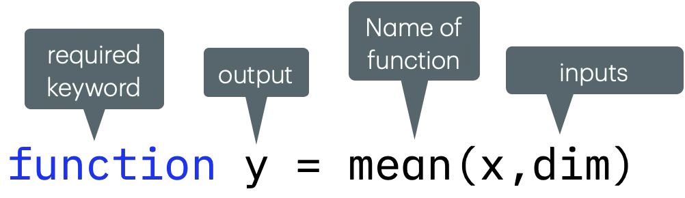

# Functions

!!! abstract "*For doing stuff*"

## Stuff You Should Know

* That a function does stuff with variables
* That there are a lot of functions
* How to find built-in MATLAB functions
* How to call functions using the proper syntax.

## Useful-ish MATLAB Documentation

* [Calling Functions](http://www.mathworks.com/help/matlab/learn_matlab/calling-functions.html){target="_blank"}

## So, What is a Function?

A function takes the data from a variable and does stuff. Think of a function as a list of instructions typically designed to manipulate the inputted data in some fashion. If you want to get fancy, you can call it a [sub-routine](https://en.wikipedia.org/wiki/Subroutine){target="_blank"} or an algorithm. Often, these programming instructions are hidden from the user, so you can often think of a function a little like a black box.

![Function as a Black Box][img_black_box]

[img_black_box]:images/black_box.png

The MATLAB syntax used to call a function looks like this:

```matlab
output = name_of_function(input_variable)
```

You typically find the function on the right side of the equal sign. This is because a function typically (but not always) returns data that you can then stash into a variable. 

## Getting Help on Functions

MATLAB has thousands of built-in functions to perform almost any basic task you can think of. So, sometimes the hardest part is:

1. Finding the right function to do exactly what you are looking for
2. Writing the proper syntax to call that function.

The MATLAB built-in documentation is a great place to start. You can find the available MATLAB functions and the proper syntax for calling those functions using the built-in documentation.

If you can't find it in the MATLAB documentation, then you can search the internet for MATLAB functions. There are a lot out there on MATLAB. When in doubt, *Google*. I typically preface my Google searches as follows:

```matlab
google matlab "thing I want to do"
```

…but not necessarily with those double quotes.

Of course, now that we are living in the future, MATLAB comes with an AI called  [MATLAB Copilot](https://www.mathworks.com/products/matlab-copilot.html){target="_blank"}. This is included with the Site License and should automatically be added to your MATLAB installation. Use this AI to help create code and troubleshoot errors. Your student CU Anschutz credentials also give you access to the latest version of ChatGPT through  [Microsoft Copilot](https://copilot.microsoft.com).

## Anatomy of a MATLAB Function

*Peering into the box.*

A function is just a packaged series of commands. Often functions are stored as individual files. Sometimes they are included in the Live Scripts.

The first line in a function sets the name, the inputs, and the outputs of the function. Notice how this first line also models how to call the function — all the text following the keyword **function** can be used as the syntax to call the function.

{ width="450"}

1. **Keyword:** the first word in the first line must be **function** - this keyword indicates that you are creating a function
3. **Name of Function:** Following the names of the outputs, is the equal sign, and then the name of the function. In this case, the name is **`mean`**.
4. **Arguments** The collective inputs and outputs of a function
   1. **Input names** are found inside the parentheses, following the name of the function. Each input should be separated by a comma. In this case, there are two inputs, `(x,dim)`
   2. **Output names** follow the keyword **function**. In this case, there is just one output, *`y`*. If there were more outputs, they would be packaged in square brackets. e.g. `[y,z]`
5. **CODE:** After the first line, you have the all the code of the function including comments
6. **Last Line** The final line of the function should be the keyword **end**.

### Opening Functions

Perhaps the easiest way to understand functions is to review some of them for yourself. You can open any MATLAB function using the **`open`** command.  MATLAB function files typically have the same name as the function, but with the `*.m` extension. For example, you can open the **`mean`** function as follows:

```matlab linenums="1" title="Open the Mean Function file"
open mean.m
```

…This will open the file in the editor. If you do so, you will see the function has quite a bit of code and may be difficult to understand. Notice that the first few lines in function is basically a series of comments to help explain how to use the function. This is good coding practice

An easier function to review may be one of the functions included with the MtM documentation, such as the **`mmGetChannelMap`** function

```matlab
open mmGetChannelMap.m
```

This simple function returns a color map for red, blue, or green. It has a single input, *`ch`*, and a single output, *`cm`*. Since I have posted these on github, you can also review the code [here](https://github.com/salcedoe/MtMtools/blob/1e7828920012a154d6023d1ac7404029b4d8a265/MtMtoolbox/mmGetChannelMap.m).

### Function workspace

Functions have their own workspace. So, any variables created in a function, stay in that function — they don't appear in the general workspace.

For example, if you call **`mmGetChannelMap`** in the command window:

```matlab
cm = mmGetChannelMap('red')
```

… you create only one variable, *`cm`*, a 256X3 numeric array.

The other variables you find in the function, *`ch`* and *`la`*, do not appear in your workspace. They only exist in the function and once the function is completed, they are gone.
