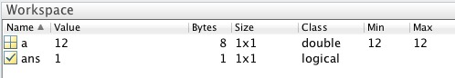

# Logical Arrays

!!! abstract "*For comparing stuff, finding stuff, and making decisions*"

## An Introduction to Logical Arrays

Heads or Tails? True or False? Logical Arrays are the Deciders of the variable classes. Logical Arrays are used to control program flow (e.g. IF ELSE statements). They are also useful as binary masks for digital images, so you can identify or process just a small part of the image.

A logical (or **BOOLEAN** (1)) data type is a data type that can have ONLY one of two possible values: **`true`** or **`false`**.
{ .annotate }

1. Why is a logical array also called a boolean? [George Boole](https://en.wikipedia.org/wiki/George_Boole) basically invented Logical Algebra, upon which all information science is based.

In MATLAB, a **logical array** has all of the properties of a normal array (it can be indexed and manipulated in exactly the same fashion),  but each element can only have one of two values: `0` or `1`, where `0` means `false` and `1` means `true`.

!!! note "Fun Fact"

     {width="35" align="left"}

     The power symbol is simply a one intersecting a zero. In this case, one means "on" and zero means "off". Read more exciting information about the power symbol [here](http://digg.com/video/power-symbol-design).

---

## Module Overview

This module is broken down into the following major sections:

1. [Creating Logical Arrays](#creating-logical-arrays)
2. [Creating Logical Arrays Using Relational Operations](#creating-logical-arrays-using-relational-operations)
3. [Combining Logical Arrays using Logical Operations](#combining-logical-arrays-using-logical-operations)
4. [Indexing with Logical Arrays](#indexing-with-logical-arrays)
5. [Functions That Return Logical Arrays](#functions-that-return-logical-arrays)

### Syntax Examples

| Syntax |  Meaning |
| ----- | --- |
| true | returns a logical 1 |
| false | returns a logical 0|
| logical | typecasts a variable to a logical class |
| x > 3 |  *x* is greater than 3|
| y <= 12 | *y* is less than or equal to 12 |
| z ~= 12 | *z* does not equal 12 |
| LA1 & LA2 | combine LA1 and LA2 (two logical arrays) using a LOGICAL AND |
| LA1 \| LA2 | combine LA1 and LA2 (two logical arrays) using a LOGICAL OR |
| xor(LA1,LA2) | combine LA1 and LA2 using logical XOR |

### Special Characters

#### Relational Functions

Used to create logical arrays based on relational operators

| Special Character | Meaning |
| :----------- | :----------- |
|**>**  |  is greater than |
|**>=** |  is greater than or equal to |
|**<**  | is less than |
|**<=** |  is less than or equal to |
|**==** |  is equal to |
|**~=** |  is not equal to |

#### Logical Operations

Used to combine logical functions based on logical operations such as

| **Special Character** | **Meaning** |
| :----------- | :----------- |
| **&** | logical AND |
| **\|** | logical OR |
| **~** | logical NOT |

---

### Important Terminology

- **BOOLEAN:** a data type that can have only two possible values
- **Relational Operations:** operations that compare the numeric values in arrays and return logical arrays
- [**Logical Operations**](https://www.mathworks.com/help/matlab/logical-operations.html){target="_blank"}: operations that work on logical arrays to return logical arrays (kind of like logical arithmetic)
- [**Logical Indexing**](https://www.mathworks.com/help/matlab/math/array-indexing.html){target="_blank"}: using a logical array as an index
- [**Logic Gates**](http://www.wikiwand.com/en/Logic_gate){target="_blank"}: A function that compares one or more logical inputs and produces a single logical output.

### Relevant MATLAB Documentation

- [Array Comparison with Relations Operations](https://www.mathworks.com/help/matlab/matlab_prog/array-comparison-with-relational-operators.html){target="_blank"}
- [Relational Operations](https://www.mathworks.com/help/matlab/relational-operators.html)
- [**Logical Operations**](https://www.mathworks.com/help/matlab/logical-operations.html)

### Important MATLAB Functions

- [**true**](https://www.mathworks.com/help/matlab/ref/true.html){target="_blank"}: returns a Logical `1`.
- [**false**](https://www.mathworks.com/help/matlab/ref/false.html){target="_blank"}: returns a Logical `0`.
- [**logical**](https://www.mathworks.com/help/matlab/ref/logical.html){target="_blank"}: converts numerical values to a logical array. All non-zero values in the array are converted to logical `1`'s
- [**strcmp**](https://www.mathworks.com/help/matlab/ref/strcmp.html){target="_blank"}: compare strings and returns a logical `1` if the strings are EXACTLY the same
- [**is\* functions**](https://www.mathworks.com/help/matlab/ref/true.html){target="_blank"}: a series of functions that detect states (e.g. is it a letter, a space?, a number?). Each function returns a logical array based on the outcome.
- [**all**](https://www.mathworks.com/help/matlab/ref/all.html){target="_blank"}: function that determines if all array elements are nonzero or true
- [**any**](https://www.mathworks.com/help/matlab/ref/all.html){target="_blank"}: function that determines if any array elements are nonzero

### Learning Objectives

- Define Boolean

- Use the functions **`true`**, **`false`**, and **`logical`** to create logical arrays

- Use Relational Operations to generate logical arrays

- Use Logical Operators to combine logical arrays

- Use logical arrays to index arrays

- use **`is*`** functions to detect states and create logical arrays to parse arrays

- Use **`strcmp`** on character arrays
  
<!--[strcmp]: http://www.mathworks.com/help/matlab/ref/strcmp.html

[false]: http://www.mathworks.com/help/matlab/ref/false.html 

[true]: http://www.mathworks.com/help/matlab/ref/true.html 

[logical]:http://www.mathworks.com/help/matlab/ref/logical.html

[is\*]:http://www.mathworks.com/help/matlab/ref/is.html -->

---

## Creating Logical Arrays

### Explicit Generation

You can explicitly create a logical array using the functions **`true`** or **`false`**. And just like numeric arrays, you can concatenate these values using the square brackets

```matlab linenums="1"
L = true
M = false
N = [true false]
```

```matlab title="result"
L =
    logical
    1

M =
    logical
    0

N =
    1×2 logical array
    1   0
```

!!! note "Note the Convention"
     In MATLAB, `trues` and `falses` are indicated by a logical `1` or `0`, respectively

We can further inspect our new logical arrays by examining their properties in the workspace.

!!! abstract "inspect property of the new logical variable"

     Recall that the function **`whos`** returns the properties of the variables that are in the workspace

     ```matlab linenums="1"
     whos
     ```

     ```matlab title="output"
         Name      Size            Bytes  Class      Attributes
          L         1x1                 1  logical              
          M         1x1                 1  logical              
          N         1x2                 2  logical              
     ```

     The output from **`who`** shows that both *`L`* and *`M`* are 1X1 logical arrays that each take up 1 byte of memory, while N is a `1x2` logical array that consumes 2 bytes of memory. 

### The functions true and false accept inputs

**`true`** and **`false`** are MATLAB functions that accept inputs. The first input indicates the number of rows and the second input indicates the number of columns that you want. If you enter just one input, the function assumes you want a square matrix (i.e. the same number of rows and columns). This is easy to forget and sometimes you'll create huge matrices by accident, so keep that in mind.

!!! example "Use logical functions to create a logical matrix"

     ```matlab title="Create Square Matrix of trues" linenums="1"
     t = true(3)
     ```
     
     ```matlab title="Create a 3x4 matrix of falses" linenums="1"
     f = false(3,4)
     ```

     ```matlab title="result"
     t =
          3×3 logical array
          1   1   1
          1   1   1
          1   1   1
     
     f =
          3×4 logical array
          0     0     0     0
          0     0     0     0
          0     0     0     0
     ```

=== "Challenge"

     What syntax do you need to create a `2x1` logical array of trues?
=== "Answer"

     ```matlab linenums="1" title="Create a 2x1 logical array"
     t = true(2,1)
     ```

     ```matlab title="result"
     t =
          2×1 logical array
          1
          1
     ```

### Conversion to Logical Array

You can also create logical arrays by converting perfectly good numeric arrays into logical ones using the function **`logical`**. This is known as **type casting**. (1)
{ .annotate }

1. because your changing (or casting) the variable type from one type to another.

!!! example "Convert a Numeric Array into a Logical array"

     ```matlab linenums="1"
     N = [0 1 2 3] % create a 1x4 numeric vector
     L = logical(n) % convert to a 1x4 logical vector
     ```
     
     ```matlab title="result"
     N =
          0   1   2   3

     L =
          1×4 logical array
          0   1   1   1
     ```

     Notice that **`logical`** converts any non-zero number to `true` and any zeros to `false`.  

In the above example, we actually created a new logical array, *`L`* that is the same size and shape as the numeric array *`N`*. This allows us to compare the elements across the two arrays. In this example, wherever there is a number that is not `0` in *`N`*, we find a logical `1` in *`L`*. We can use that for stuff. We'll get to that later.

### Challenge: Creating Logical Arrays

=== "Question 1"

    Show the syntax to explicitly create the logical array `1 1 0 1` and assign to the variable *m*.
   
=== "Answer 1"

    Explicitly create the logical array `1 1 0 1` and assign to the variable *m*.

    ```matlab linenums="1"
    m = [true true false true]
    ```

    ```matlab title="result"
    m =
        1×4 logical array
        1   1   0   1
    ```

=== "Question 2"

    Use the function **`true`** to create a 2x1 array of logical ones and assign to *`L`*.
   
=== "Answer 2"

     Create a 2x1 array of logical ones and assign to *`L`*

     ```matlab linenums="1"
     L = true(2,1)
     ```

     ```matlab title="result"
     L =
          2×1 logical array
          1
          1
     ```
=== "Question 3"

    How many logical ones will you get from the following syntax?
    
    ```matlab linenums="1"
     logical([-1 0 1 2 3 0 5])
    ```
   
=== "Answer 3"

    ```matlab linenums="1"
    logical([-1 0 1 2 3 0 5])
    ```

    ```matlab title="result"
     ans =
           1×7 logical array
           1   0   1   1   1   0   1
    ```

     Five logical ones and two logical zeros

---

## Creating Logical Arrays Using Relational Operations

Life is full of comparisons. *Does that guy have more money than me? Is she taller than me? I think these are the same.* Relational operations help make these comparisons but with numbers. Relational operations are typically performed on numeric arrays, using the relational operators that we all learned back in grade school.

| Special Character | Meaning |
| :----------- | :----------- |
|**>**  |  is greater than |
|**>=** |  is greater than or equal to |
|**<**  | is less than |
|**<=** |  is less than or equal to |
|**==** |  is equal to |
|**~=** |  is not equal to |

Relational operations return logical arrays.

Notice that the syntax is both familiar and somewhat confusing. For example, the following statement assigns the value `12` to a variable named *`a`*:

```matlab title="Numeric Assignment" linenums="1"
a = 12
```

Whereas this statement uses the Relation Operation of 'is equal to' `==` to compare the contents of the variable *`a`* with the value `12`:

```matlab title="Relational Operation" linenums="1"
a == 12 
```

If the contents of *`a`* equals `12`, then the relation operation will return a logical `1`, otherwise the operation returns a logical `0.

Since we already assigned the value `12` to *`a`*, we get a `1`:

```matlab title="result of a==12"
ans =
      logical
      1
```

And, since there is no explicit assignment in the second statement, the logical `1` is assigned to the variable *`ans`*.

!!! abstract annotate "Workspace"
     Review the properties of *`ans`* in the workspace (1)

     ```matlab title="whos"
          Name      Size            Bytes  Class      Attributes
          a         1x1                 8  double               
          ans       1x1                 1  logical              
     ```

     Notice that the *logical* class requires only 1 byte per element of storage (see the Memory and Numeric Classes for more information on bits and bytes).

1. Reminder - the function **`whos`** returns the content of the workspace

<!---->

### Relational Operation Assignment

We can assign the result of a relational operation to a variable using the following somewhat convoluted syntax:

!!! example "Relational Operation Assignment"

     ```matlab linenums="1"
     b = a == 25 % b equals 'a is equal to 25'
     ```

     ```matlab title="result"
     b =
          logical
          0
     ```

     In this case, we are assigning the result of the Relational Operation (is *`a`* is equal 25?) to a new variable *`b`*.  Notice in the workspace that *`b`* is now a logical data type and that it has the value of `0` (or `false`).

We can similarly compare an array of values.

!!! example "Example: Relational operation on arrays"

     Here we create a numeric array of 10 values(*`a`*). Then we create a logical array using the relational operation 'is greater than' (*`b`*).

     ```matlab linenums="1"
     a = 1:10
     b = a>5 % a is greater than 5
     ```

     ```matlab title="result"
     b =
         1×10 logical array
         0   0   0   0   0   1   1   1   1   1
     ```

     Notice that *`a`* is a numeric vector, while *`b`* is a logical array with the same dimensions as *`a`* but with `1`'s wherever *`a`* is greater than 5 and `0` 's everywhere else.

Or consider this relational operation of a matrix:

!!! example "Example: Relational Operations on a Matrix"

     ```matlab linenums="1"
     c = [1 2 3; 4 5 6]
     d = c > 3
     ```

     ```matlab title="result"
     c =
          1  2  3
          4  5  6

     d = 
          0  0  0
          1  1  1
     ```

     Here we create a numeric array *`c`* and a logical array, *`d`*, which has the same dimensions as *`c`,* but has `1`'s wherever *`c`* has a value greater than `3`. As you can see, using logical arrays allows us to quickly identify which values in *`c`* are greater than `3`.

!!! info "The term 'masking'"
     In the above examples, we create logical arrays that are the same size as a reference numeric array. In the logical array, there are logical `1`s for elements that return true  when the relational operation was satisfied (e.g. when the values in *`c`* were greater than 5). These logical `1`s are said to **mask** the elements in the numeric array that satisfy the relational operation. So, I will often say something like "create a logical array that *masks* the values greater than 5 in the numeric array *`c`*." What I mean is "create a logical array which has logical `1`s where the elements in *`c`* are greater than `5`." It's just a little shorter to use the term mask.

---

### Challenge: Relational Operations

=== "Question 1"

     Recall that the variable *`a`* contains the value `12`.

     What happens when you enter the following command in the command window?

     ```matlab linenums="1"
     a == 13
     ```

     Does the value of *`a`* change?

=== "Answer 1"

     You get a logical `0` because 13 does not equal 12. 

    ```matlab title="result"
    
    ans = 
        '0'
    ```

    *`a`* does not change, because you did not assign anything new to *`a`*.

=== "Question 2"

     Assign to the variable *`b`* the relation operation: *`a`* is less than 20. 
     
     What does *`b`* contain after the operation?

=== "Answer 2"

     Assign to *`b`* *`a`* is less than 20:

     ```matlab linenums="1" title="assignment"
     b = a < 20
     ```

     ```matlab title="result"
     b =
         logical
         1     
     ```
     *`b`* contains a logical `1` (meaning true) because 12 is less than 20. 

---

## Combining Logical Arrays using Logical Operations

As in life, sometimes you need more than one input to make a decision. Maybe you want a unanimous decision (all trues). Or maybe you want something a little more ambiguous: if just one of these is true, then we'll go with it.

Logical operations allow you to combine two logical arrays into a single logical array. These operations are like boolean math: you take two booleans, and get one boolean back. What you get back depends on the logical operation you use.

 Consider the following two arrays (array 1 and array 2):

!!! info "Logical Operations"

     { width="450"}
     { width="450"}

     Use:

     - **AND** for unanimous decisions: the elements in the output array contain a `true` only where a `1` is found in BOTH of the corresponding elements in the input arrays
    
     - **OR** to split the difference: the elements in the output array contain a `1` if a `1` can be found in *either* (or both) of the corresponding elements in the input arrays
    
     - **XOR** when you want one and only one true: the output contains a `1` only when the corresponding elements contain one `1` and one false

### Logical Operators

Use the following [operators](https://www.mathworks.com/help/matlab/matlab_prog/matlab-operators-and-special-characters.html){target="_blank"} to perform logical operations

| Symbol | Logical operation |  
| :----------- | :----------- |
|**&** | logical AND |
|**\|** | logical OR |
|**xor** | Logical exclusive OR |
|**~** | logical NOT |

### Logical Operations Examples

#### First, Create the Arrays

To understand how logical operations work, let's create the following three matrices: *`N`*, *`L`*, and *`M`*:

<!--![matrices illustration][L-img-LMN]-->

**Matrix**  *`N`* is a numeric vector containing the numeric values from 1 to 9.

```matlab linenums="1" title="N"
N = 1:9
```

```matlab title="result"
N =
     1     2     3     4     5     6     7     8     9
```

**Matrix** *`L`* is a logical array that has  `1` (or `1`'s) at the indices in matrix *`N`* where the value is greater than 4:

```matlab linenums="1" title="L"
L = N>4
```

```matlab title="result"
L =
    1×9 logical array
    0   0   0   0   1   1   1   1   1
```

Compare the corresponding elements in *`N`* and *`L`*. Notice there there are logical `1`s in *`L`* wherever the numeric values in *`N`* are greater than  4. And logical `0`s everywhere else

**Matrix** *`M`* is a logical array that masks the elements in *`N`* which contain an odd number.

```matlab title="M"
M =
    1×9 logical array
    1   0   1   0   1   0   1   0   1
```

??? info "How to find Odd numbers using the function mod"
     We can create the matrix *`M`* using the function **`mod`**, which calculates the remainder after dividing each element in *`N`* by factor. The syntax looks like the following:

     ```matlab linenums="1"
     M = mod(N,2) % return remainder after division by 2
     ```

     With this syntax, we divide each element in *`N`* by 2. As we all learned in elementary school, dividing odd integers by 2 returns a remainder of 1, which is what we get:

     ```matlab title="result"
     M =
          1     0     1     0     1     0     1     0     1
     ```

     Notice that this returns a numeric array. Those `1`s are the remainders after dividing by 2.
     
     To create a logical array, we need to go one further step, which is to convert (or typecast) the numeric array into a logical array, as follows:

     ```matlab linenums="1"
     M = logical(M)
     ```

     ```matlab
     M =
          1×9 logical array
          1   0   1   0   1   0   1   0   1
     ```
     
     And now we have a logical array with logical `1`s wherever an odd number is found in *`N`*.

#### Example 1: Logical AND

The logical **AND** operation returns `1` for coinciding trues and returns `0` for anything else.

!!! example "Logical AND"
     The following `AND` relational operation creates a new logical array with `1` at indices corresponding to the elements in `N` which are **both greater than 4 AND are odd**:

     ```matlab linenums="1" title="L AND M"
     L&M
     ```

     ```matlab title="result"
     ans =
           1×9 logical array
           0   0   0   0   1   0   1   0   1
     ```

     Notice that the result has a `1` **only** where there is `1` in both *`L`* and *`M`*. These `1`'s correspond to the values 5, 7, and 9 in *`N`*: the only values that meet the criteria of being **both** greater than 4 and odd. The logical array is said to *mask* those values in *`N`*

---

#### Example 2: Logical OR

The logical **OR** operation is less discerning than **AND**: Any `1` returns a `1`.

!!! example "Logical OR"
     The following syntax creates a new logical array with `1` at indices corresponding to the elements in *`N`* that are **either** greater than 4 or odd:

     ```matlab linenums="1" title="L OR M"
     L|M
     ```
     
     ```matlab title="result"
     ans =
           1×9 logical array
           1   0   1   0   1   1   1   1   1
     ```

     Here, the result has a logical `1` wherever there was a `1` found in either `L` or `M`. It has a `false` in the elements corresponding to 2 and 4 in *`N`.*  So, 2 and 4 are neither greater than 4 or odd… The rest of the numbers are at least one or the other or both.

---

#### Example 3: Logical NOT

This operation is simple to understand: just invert the logic.

!!! example "Logical NOT"

     ```matlab linenums="1" title="NOT M"
     ~M
     ```

     ```matlab title="result"
     ans =
           1×9 logical array
           0   1   0   1   0   1   0   1   0
     ```

     Notice the use of the `tilde` special character. The resulting array has the inverse logical of *`M`.* `1` is `false` and `false` is `1`. UP is DOWN. CATS are DOGS. etc. Also notice that the `1`s now correspond to the **even** numbers in *`N`*.

---

#### Example 4: Logical XOR

The operation **exclusive or** is a little more confusing to understand. But the concept is relatively straightforward: You only get a logical `1` if you have exactly one logical `1` and one logical `0`. Anything else returns a logical `0`.

!!! example "XOR"

     There is no special character for **`xor`**. You have to use the function.

     ```matlab linenums="1"
     xor(L,M)
     ```

     ```matlab title="result"
     ans =
           1×9 logical array
           1   0   1   0   0   1   0   1   0
     ```

     The resulting logical array masks the odd numbers below 4 and the even numbers above 4: `1, 3, 6, 8`

---

### Challenge: Logical Operations

=== "Question"

     1. What syntax would you use to create a logical array that masks the even numbers in *`N`* that are less than 8? Assign the result to *`O`*
    
    ```matlab title="Contents of N"
    N =
        1     2     3     4     5     6     7     8     9
    ```

=== "Answer"

     Use the following logical operation

     ```matlab linenums="1"
     O = N < 8 & ~M;
     ```
     Here we have two logical arrays that we combine using logical AND: N less than 8 AND NOT *`M`*.

     ```matlab title="result"
     O =
          1×9 logical array
          0   1   0   1   0   1   0   0   0
     ```

     The result masks the even numbers less than 8.

---

## Indexing with Logical Arrays

One of the superpowers of a logical array is its ability to be used as an index.

!!! example "Example: Logical Indexing"

      Here we create a numeric matrix, *`c`* and a logical array *`d`* that masks the values in *`c`* greater than `3`.

     ```matlab linenums="1"
     c = [1 2 3; 4 5 6] % create numeric array
     d = c > 3 % masks values greater than 3
     ```

     If we index *`c`* with *`d`* …

     ```matlab linenums="1"
     c(d) % use d as an index for c
     ```

     … we get the values from *`c`* that are greater than `3`:

     ```matlab title="result"
     ans = 
          4
          5
          6
     ```

As you can see, logical indexing returns the values in *`c`* that correspond to the locations in *`d`* where there are logical `1`'s. Importantly, the logical array  (*`d`*) has to have the same size as the array that you are trying to index  (*`c`*).

!!! abstract "Logical Indexing Illustration"

     {width="500"}
     {width="500"}

     With this syntax, we are essentially saying "return all values in c that share the same indices as the 1's in d." Notice that the result has the same class type (*double*) as the array is being indexed (*`c`*). MATLAB spits out a vertical vector because the resulting numeric array has fewer elements than the original array and MATLAB doesn't know how to organize the elements.

### Examples using Logical Indexing

#### 1: Logical indexing using Numeric Comparisons

Recall the variables *`N`*, *`L`*, and *`M`* that we generated in the previous section.

| | | | | | | | | | |
| :-- | :-- | :-- | :-- | :-- | :-- | :-- | :-- | :-- | :-- |
| **N** | 1 | 2 | 3 | 4 | 5 | 6 | 7 | 8 | 9 |
| **L** | 0 | 0 | 0 | 0 | 1 | 1 | 1 | 1 | 1 |
| **M** | 1 | 0 | 1 | 0 | 1 | 0 | 1 | 0 | 1 |

<!-- ![matrices illustration][L-img-LMN]

[L-img-LMN]: images/logical-indexing-LMN.png -->

We can use *`L`* and *`M`* to index  *`N`*, as follows:

!!! example "Index N with L"

     ```matlab linenums="1"
     N(L)
     ```

     ```matlab title="result"
     ans =
           5     6     7     8     9
     ```

     you get all the values in *`N`* that are greater than `4`. Notice that these are the numbers in *`M`* that correspond to the elements in *`L`* that contain a `1`.

!!! example "Index *`N`* with *`M`*"

     ```matlab linenums="1"
     N(M)
     ```

     ```matlab title="result"
     ans =
           1     3     5     7     9
     ```
     
     Here you get all the odd numbers in *`N`,* which again are the numbers in *`M`* that correspond to the elements in *`N`* which contain a `1`.

#### 2: Logical indexing from combined Logical arrays

If we want to get fancy, we can combine Logical operations and indexing, as follows:

!!! example "Index *`N`* using *`L`* AND *`M`*"

     ```matlab linenums="1"
     N(L&M)
     ```

     ```matlab title="result"
     ans =
           5     7     9
     ```

     And you get the odd numbers greater than 4.

!!! example "Index *`N`* using *`L`* OR *`M`*"

     ```matlab linenums="1"
     N(L|M)
     ```

     ```matlab title="result"
     ans =
           1     3     5     6     7     8     9
     ```

     Here we get all odd numbers and values over four

!!! example "Index *`N`* using the XOR of *`L`* and *`M`*"

     ```matlab linenums="1"
     N(xor(L,M))
     ```

     ```matlab title="result"
     ans =
           1     3     6     8
     ```

     Here we get the ODD numbers below 4 and even numbers above 4. Or put another way: you get all the values in *`N`* except where *`L`* and *`M`* overlap.

---

### Challenge: Logical Indexing

=== "Question"
     How would you logically index *`N`* with *`M`* to return all of the even numbers?

=== "Answer"

     You index with *NOT* `M`, as follows

     ```matlab linenums="1"
     N(~M)
     ```

     ```matlab title="result"
     ans =
           2     4     6     8
     ```

     All even numbers returned

---

## Functions That Return Logical Arrays

MATLAB has many functions that you can use to compare or analyze the contents of a variable.

The following are a few examples of such functions:

### is* Functions

As in: Is it a numeric array? A character array? MATLAB has many functions designed to detect the class or state of an array.  These functions return logical arrays based on the state of the array.

Examples include:

* **iscell**: is the variable a cell?
* **ischar**: is the variable a character array?
* **isnumeric**: is the variable a numeric array?
* **isletter**: which elements in a character array are letters?
* **isempty**: is the array empty (devoid of data)?

---

### is* Function Examples

!!! example "Example: **ischar**"

     Consider *`ch`*:

     ```matlab linenums="1"
     ch = '1':'Z'
     ```

     ```matlab title="result"
     ch =
     '123456789:;<=>?@ABCDEFGHIJKLMNOPQRSTUVWXYZ'
     ```

     The function **ischar** reports whether *ch* is a character array or not

     ```matlab linenums="1"
     ischar(ch)
     ```

     ```matlab title="result"
     ans =
           logical
           1
     ```

     *`ch`* is a character array, so you get a logical 1 (or true)

Now, compare the output from **isletter** on the same character array, *ch*.

!!! example "Example: **isletter**"

      The function **`isletter`** returns a logical array containing `1` wherever there is a letter in the input variable (as opposed to a digit or whitespace character). 

     ```matlab linenums="1"
     il = isletter(ch)
     ```

     ```matlab title="result"
     il =
          1×42 logical array
          0   0   0   0   0   0   0   0   0   0   0   0   0   0   0   0   1   1   1   1   1   1   1   1   1   1   1   1   1   1   1   1   1   1   1   1   1   1   1   1   1   1
     ```

     So, instead of getting just one true or false, we get a true or false for every element in *ch*. Here, *`il`* contains `1`'s only where letters can be found in *`ch`*.

     If you index *`ch`* with *`il`*...:

     ```matlab linenums="1" title="index ch with il"
     ch(il)
     ```

     ```matlab title="result"
     ans =
          'ABCDEFGHIJKLMNOPQRSTUVWXYZ'
     ```

     …you get the letters from *`ch`* and nothing else.

Sometimes you want to know whether any data has been added to a variable. 

!!! example "Example: **isempty**"

     The function **`isempty`** checks the contents of the elements in an array:

     ```matlab linenums="1"
     a = []
     isempty(a)
     ```

     ```matlab title="result"
     ans =
           logical
           1
     ```

     …We get a true because *a* is an empty variable.

!!! example "Example: **strcmp**"

     The function *[strcmp]{target="_blank"}* determines whether two character arrays are identical.

     The following example should illustrate why CANVAS can be so bad at grading open responses such as "Fill in the Blank "questions.

     Consider these two character arrays:

     ```matlab linenums="1"
     correct_answer = 'Every good boy does fine'
     student_answer = 'Every  good boy  does fine'
     ```

     Are these two character arrays identical? Let's test it:

     ```matlab linenums="1"
     the_same = strcmp(correct_answer, student_answer)
     ```

     ```matlab title="result"
     the_same = 
                0
     ```

     Why did strcmp return a zero? Because the spaces in the two character arrays did not line up, so all of the letters in the array did not precisely line up.

How do we make **`strcmp`** work for the previous example? As we found out, uneven spacing can make the function return a logical `0` even though all of the letters match. If we just want to test whether the letters match, then we should remove all of the spaces. We can easily do this as follows.

!!! example "Example: strcmp without the spaces"

    We can determine if the letters match in the two  previous character arrays using the following steps:

    1. Identify all the spaces using *isspace* which returns a logical array with 1s where the spaces are

    2. Using the syntax `char_array(logic_array) = []`  to eliminate the spaces

    3. Compare the new character arrays using *strcmp*

    ```matlab linenums="1"
    cala = isspace(correct_answer) % logical array masking the spaces in correct_answer
    sala = isspace(student_answer) % logical array masking the spaces in student_answer

    correct_answer(cala) = [] % eliminate spaces in correct_answer
    student_answer(sala) = [] % eliminate spaces in student_answer
    ```

    ```matlab title="result"
    correct_answer = 
                     'Everygoodboydoesfine'
    student_answer = 
                     'Everygoodboydoesfine'
    ```

    …All that remains are the letters.

    Now when we compare the character arrays…

    ```matlab linenums="1"
    strcmp(correct_answer, student_answer) % compare the letters using strcmp
    ```

    ```matlab title="result"
    ans = 1
    ```

    …We ge a 1, or true, indicating that the two character arrays are the same.

    [strcmp]: http://www.mathworks.com/help/matlab/ref/strcmp.html

### Challenge: is* functions

=== "Question"

     What do you think the following returns?

     1. `isnumeric('apple')` logical `1` or `0`?
     2. `isempty('Empty')` logical `1` or `0`?
     3. `ischar('1234')` logical `1` or `0`?

=== "Answer"

     ```matlab linenums="1"
     isnumeric('apple')
     ```

     ```matlab title="result"
     ans =
           logical
           0
     ```

     'apple' is not a numeric array.

     ```matlab linenums="1"
     isempty('Empty')
     ```

     ```matlab title="result"
     ans =
           logical
           0
     ```

     'Empty' is not empty -- it is character array with five characters.

     ```matlab linenums="1"
     ischar('1234')
     ```

     ```matlab title="result"
     ans =
           logical
           0
     ```

     `'1234'` is a character array because of the single quotes. 

---

## Final Example: Putting it all together for Pangrams

Pangrams are sentences that contain all of the letters of the alphabet at least once. Let's use MATLAB to determine whether a sentence is a pangram or not. To do this, we simply need to find all of the unique letters in a sentence and count them. If they add up to 26, then we have a pangram.

To accomplish this, we will use several MATLAB functions, including:

- **isspace:** logical array that masks the spaces
- **unique:** return all of the unique characters in a character array
- **numel:** returns the number of elements in an array

Here we prototype an algorithm (or series of programming steps) to test whether a sentence is a pangram or not.

So, consider the following sentence, which we will store in the variable *`sentence`*:

```matlab linenums="1"
sentence = 'The quick brown fox jumps over the lazy dog'
```

Does the above sentence contain all of the letters of the alphabet (also known as a pangram)?

To count the letters, we need to remove the spaces. And to remove the spaces, we first need to find them.

```matlab linenums="1" title="1. Mask spaces"
space_la = isspace(sentence) % mask spaces in sentence
```

```matlab title="result"
space_la =
           1×43 logical array
           0   0   0   1   0   0   0   0   0   1   0   0   0   0   0   1   0   0   0   1   0   0   0   0   0   1   0   0   0   0   1   0   0   0   1   0   0   0   0   1   0   0   0
```

…*`space_la`* is a logical array that masks(1) the spaces in *`sentence`*.
{ .annotate}

1. the logical `1`s in *`space_la`* correspond to the elements in *`sentence`* that contains spaces.

So, now we can use *`space_la`* as a logical index to remove spaces. Remember, the empty brackets syntax can remove elements from a variable, as follows:

```matlab linenums="1" title="2. Remove spaces using logical indexing"
sentence(space_la) = []; % Remove spaces from sentence
```

```matlab title="result: spaces removed"
sentence =
           'Thequickbrownfoxjumpsoverthelazydog'
```

…*`sentence`* now contains no spaces.

To count the number of letters, we can use the function **`numel`**, which returns the number of elements in an array:

```matlab linenums="1" title="3. Count letters"
letter_count = numel(sentence) % returns the number of elements in sentence
```

```matlab title="result"
letter_count =
               35
```

…35? We have too many letters because certain letters are repeated.

To find just the unique letters, we can use the function **`unique`**, which returns the unique elements in an array, as follows:

```matlab linenums="1" title="4. Get Unique letters"
uniq_letters = unique(sentence) % return unique letters from sentence
```

```matlab title="result"
uniq_letters =
               'Tabcdefghijklmnopqrstuvwxyz'
```

…*`uniq_letters`* contains unique instances of each letter.

Let's count the number of elements using **`numel`**:

```matlab linenums="1" title="5. Count Unique Letters"
letter_count = numel(uniq_letters) % returns number of elements in uniq_letters
```

```matlab title="result"
letter_count =
                27
```

…27? How can there be more than 26 unique letters. Ah, yes. Capital T and lowercase t are considered to be different letters since MATLAB is case-sensitive. We need to find all the unique lowercase letters.

So, we first need to convert all letters in *`uniq_letters`* to lowercase using the function **`lower`**:

```matlab linenums="1" title="6. Convert to lowercase"
lower_letters = lower(uniq_letters) % coverts all letters to lowercase
```

```matlab title="result"
lower_letters = 
                'tabcdefghijklmnopqrstuvwxyz'
```

Then find the unique letters in that array...

```matlab linenums="1" title="7. Find Unique Lowercase Letters"
uniq_lower_letters = unique(lower_letters); % unique letters in lower_letters
```

```matlab title="result"
uniq_lower_letters =
                     'abcdefghijklmnopqrstuvwxyz'
```

And then count the number of elements in *uniq_lower_letters*...

```matlab linenums="1" title="8. Count Unique Lowercase letters"
letter_count = numel(uniq_lower_letters) % number of elements in uniq_lower_letters
```

```matlab title="result"
letter_count =
                26
```

Finally, we can then test whether the sentence is a pangram by using the relational operation: "Does the count equal 26":

```matlab linenums="1" title="9. Is it a Pangram?"
la_pangram = letter_count == 26
```

```matlab title="result: yes, a pangram"
la_pangram =
             logical
             1
```

…Since *`letter_count`* does equal 26, meaning there are 26 unique lowercase letters, the result, stored in *`la_pangram`*,  is true.

### Packaging the Pangram Algorithm

So that's how it goes when you are prototyping an algorithm. You need to test each step to make sure that it makes sense. Once you have all the steps that you need, then you can create a more compact set of instructions, like the following:

!!! success "Pangram Algorithm"
     ```matlab linenums="1"
     sentence = 'The quick brown fox jumps over the lazy dog' % assign sentence
     space_la = isspace(sentence) % mask the spaces in sentence
     sentence(space_la) = []; % Remove spaces from sentence
     lower_letters =lower(sentence) % covert all letters to lowercase
     uniq_lower_letters = unique(lower_letters); % unique letters in lower_letters
     letter_count = numel(uniq_lower_letters) % number of elements in uniq_lower_letters
     la_pangram = letter_count == 26 % is letter count equal to 26?
     ```
     Notice for each step that we create a variable and then input that variable into the function in the next line.

     Also notice that our algorithm has fewer steps than the prototype, because we didn't call the **`unique`** function twice. We only need to call it once. And we didn't count the letters until the very end. 

**MODULE COMPLETE** Good job. You made it.