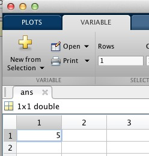
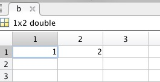
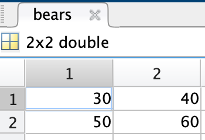
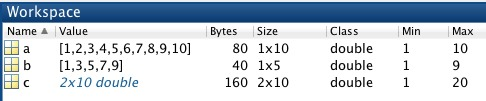
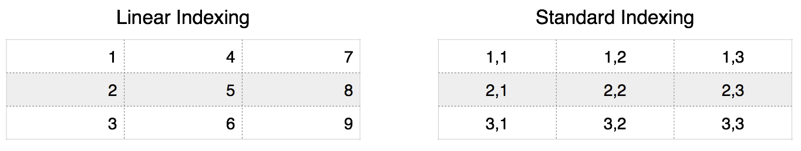
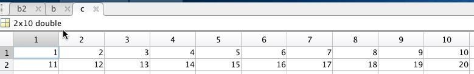

# Numeric Arrays

!!! abstract "*for dealing with numbers*"

Numeric arrays contain numbers (as opposed to characters or booleans).

![Business-Dog-holding-phone][lets-talk-numbers]

[lets-talk-numbers]: images/Lets-talk-numbers.jpg

## Syntax Overview

| Syntax | Special Character | Meaning |
| ----- | :---: | --- |
|n = 5 | = | assign the value 5 to the variable *n*|
|n = [1 3 4 5] | [ ] | Concatenates numeric values into the row vector *n* |
|n = [1; 3; 4 5] | ; | Semicolon means the new line. Concatenate into column vector |
|n = 1:10 | : | Create a row vector with the values 1 through 10 |
|n = 2:2:8 | : | Create a row vector of even numbers from 2 to 8 |
|n(2) | ( ) | Index the second element from the variable *n* |
|n(1, 3) | ( ) | Index first row, third column |
|m = n' | ' | Transpose (swap row and column indices) |
|n = [ ] | [ ] | Delete all elements from *n* |

### Relevant Mathworks Documentation

* [Matrices and Arrays](http://www.mathworks.com/help/matlab/learn_matlab/matrices-and-arrays.html){target="_blank"}

* [Array Indexing](http://www.mathworks.com/help/matlab/learn_matlab/array-indexing.html){target="_blank"}
* [Operators and Special Characters](https://www.mathworks.com/help/matlab/matlab_prog/matlab-operators-and-special-characters.html){target="_blank"}

## Storing Numbers

When you want to store a number in a variable, you need to create a numeric array. This is very easy to do in MATLAB.

!!! example "Assigning the value 5"

     Simply type the number 5 in the command window:

    ```matlab
    5
    ```

    ```matlab title="result"
    ans = 
	    5
    ```

Notice that when you type the number `5` in the command window, MATLAB automatically creates a variable called *`ans`* and places that variable in the workspace.

!!! warning annotate "Technical Term Alert"

    A variable with just a single value (numeric or otherwise) is commonly referred to as a **SCALAR**. (1)

1. **Technical Annoyance**. Technically, all MATLAB variables are matrices. So, even though our new variable with the value 5 in it can be called a scalar, it is stored in MATLAB as 2D matrix.

If you double-click on *`ans`* in the workspace, you will open up a new window called the **Variable Editor**.



In the Variable Editor, you can explore the contents of any variable in the workspace. Notice that variable *`ans`* looks like a spreadsheet (because its data structure is a 2D array). Also, notice that the number `5` was automatically placed in the top left corner of this matrix. This position has an index of `1` or `(1,1)`.

!!! warning
    *`ans`* is a reserved name in MATLAB. DO NOT name any of your variables *`ans`* or you will get an unexpected result or an error. Consider what happens when you type another number in the command window:

    ```matlab
    10
    ```

    ```matlab title="result"
    ans =
	     10
    ```

    Notice how the value for *`ans`* has been replaced with the number `10`, simply by typing `10` in the command window. The `5` is gone.

---

## Assigning Arrays

### Creating a numeric vector

Since the basic MATLAB data structure is a matrix, it is quite easy to assign an array of numbers to a numeric variable. To do so, use the following syntax.

`name_of_variable = [array of numbers]`

In this syntax, the square brackets ( `[ ]` \) are used to concatenate a collection of numbers into an array.

 For example, type the following in the command window:

```matlab linenums="1" title="Concatentating numeric values"
b = [1 2]
```

You should now see a variable called *`b`* in the workspace. Double-click on this variable to open up the variable editor:

{ width="250"}

The value `1` is stored in the top left corner position, or index `(1,1)`, The value `2` is stored one element over in index `(1,2)`.

---

### Creating a numeric matrix

To add a second row to an array, you use the semicolon `;`. The semicolon indicates a line break in a matrix. For example, type the following in the command window:

!!! example "Use the Semicolon to create a new row in an matrix"
    
    ```matlab linenums="1"
    bears = [30 40; 50 60]
    ```

    ```matlab title="result"
    bears =
        30    40
        50    60
    ```

Inspecting the *`bears`* variable reveals the following matrix with two rows of data…

{ width="150"}

…with numbers in the standard index positions of `(1,1)`, `(1,2)`, `(2,1)`, and `(2,3)`.

!!! tip "Fun Fact: special characters can mean more than one thing"
    The semi-colon is also used to indicate the end of a programming line and suppresses output to the command window. This is called overloading a function, kind of like we are overloading you with all these fun little arcane factoids. We'll get to using semi-colons at the end of a line in a later module.

---

## Quickly Generating Arrays

The colon character `:`  can be used to automatically generate an increasing or decreasing series of numbers, as follows:

```matlab linenums="1" title="The colon can be used to create a range of numbers"
a = 1:10
b = 1:2:10
c = [1:10 ; 11:20]
```

After executing the above lines in the command window, you should see the following variables in the workspace:



>The variable *`a`* is filled with numbers 1 through 10. The variable *`b`* has only odd numbers up to 10. The command `1:2:10` indicates to skip every other number. Also note that *`c`*  has two rows (Size: 2 X 10). To create *`c`*, we had to use the concatenating square brackets and a semi-colon. The semi-colon indicates "new row" in the array.

---

!!! warning "Don't forget your square brackets!"

    What happens if you don't use the square brackets when assigning data to a variable? Consider the following:

    === "Challenge"

        What values do you think *`c`* will end up after this line of code? Try it now in the command window

        ```matlab linenums="1"
        c = 1:10; 11:20
        ```
        Review the workspace. Does the variable *`c`* have the expected values? What about the variable *ans*?

    === "Answer"
        
        ```matlab linenums="1"
        c = 1:10; 11:20
        ```

        ```matlab title="result"
        ans =

            11    12    13    14    15    16    17    18    19    20
        ```

        The result is the assignment of values to *two* different variables. The values 1 through 10 are assigned to the variable *`c`* while the values 11 through 20 are assigned to the variable *`ans`*. *Why `ans`*? Because no explicit variable was indicated in the second line of code. Without the square brackets, the semi-colon means  "new line of code", which is the same as if you typed two separate lines of code in the command window, like this:
        
        ```matlab linenums="1"
        c = 1:10
        11:20 
        ```
        
        This is why programming is hard. Notice that we didn't get an error, we just got something unexpected. You always have to be very careful with your syntax or you might get an unexpected result...

### Series functions

There are many functions that can create a series of numbers.

For example, the function **`ones`** accepts inputs to indicate how many ones it should create

```matlab linenums="1" title="Create Array of Ones"
c = ones(1,10)
```

The inputs into **`ones`** indicates the following: 1) The first input is the number of rows. 2) the second input is the number of columns.

```matlab title="result"
c =

     1     1     1     1     1     1     1     1     1     1
```

Similarly, the function **`zeros`** creates a series of zeros.

```matlab title="Stack a bunch of zeros"
d = zeros(10,1)
```

…Notice how the inputs into **`zeros`** are similar to the inputs into **`ones`**: The first input is the number of rows and the second input is the number of columns

```matlab title="result"
d =

   0
   0
   0
   0
   0
   0
   0
   0
   0
   0
```

The function **repmat** creates an array that repeats the inputted data. Here we take the array `1 2` and repeat it 10 times across the rows. The third input, `1`, indicates no repeating across columns (Just one column of data).

```matlab linenums="1" title="Repeat Array"
e = repmat(1:2,10, 1)
```

```matlab title="result"
e =

     1     2
     1     2
     1     2
     1     2
     1     2
     1     2
     1     2
     1     2
     1     2
     1     2
```

#### Challenge: Series Functions

??? question "What do you the think would happen if we changed the 3rd input in **repmat** to 2?"

    ```matlab linenums="1" title="Repeat Array"
    e = repmat(1:2,10, 2)
    ```

    ```matlab
    e =

        1     2     1     2
        1     2     1     2
        1     2     1     2
        1     2     1     2
        1     2     1     2
        1     2     1     2
        1     2     1     2
        1     2     1     2
        1     2     1     2
        1     2     1     2
    ```

    You would get an extra set of columns containing the repeated array `1 2`

---

## Indexing Arrays

To [index](https://www.mathworks.com/help/matlab/math/array-indexing.html){target="_blank"} a numeric variable, you simply use the parentheses `( )` after the name of the variable. The following shows the equivalent indexing that you can use in MATLAB: linear or standard indexing.

{ width="600" }

### Linear indexing

Linear indexing in MATLAB uses the **[COLUMN MAJOR](http://www.wikiwand.com/en/Row-major_order){target="_blank"}** indexing scheme, in which elements are numbered first by row, then by column.

`name_of_variable(linear_index)`

### Standard indexing

Standard indexing requires an index for each dimension. For matrices, the first index ALWAYS refers to the row and the second ALWAYS refers to the column

`name_of_variable(row_index, column_index)`

!!! note "Indices in MATLAB always start at 1"

    You cannot have an index of zero. That is, zero cannot be used as an index for either method. There is no Zeroth element, zeroth row, or zeroth column. This differs from other computer programming languages, such as java or python, which start at zero.

### Comparing Linear to Standard indexing

#### Vector Indexing

To compare the two indexing methods, let's use the variable *`b`*, which we previously assigned the following values:

```matlab title="b"
ans =
     1     3     5     7     9
```

!!! abstract "Indexing Comparison"
    **Standard indexing**

    ```matlab title="First Row, Second Column"
    b(1,2)
    ```

    ```matlab title="result"
    ans = 
        3
    ```

    **Linear Indexing equivalent**

    ```matlab linenums="1" title="2nd Element"
    b(2)
    ```
    …notice we just use one number here.

    ```matlab title="result"
    ans = 
        3
    ```
    …and we get the same element out

#### Matrix Indexing

Things become a little more complicated when variables are 2D matrices. Recall that linear indexing is column-major. This means that each element in the matrix is indexed first by row and then by column. So, if you have more than one row of data in your matrix, you may get unexpected results if you are not careful.

For example, again consider the variable *`bears`*, which has two rows and two columns:

{ width="150"}

Linearly, the third index refers to the third element counting columnwise:

```matlab title="Linear Indexing: Third Element" linenums="1"
bears(3)
```

```matlab title="result"
ans = 
    40
```

The equivalent standard index is:

```matlab title="Standard Index Equivalent: 1st row, 2nd col"
bears(1,2)
```

```matlab title="result"
ans = 
    40
```

Both methods access the same element in *`bears`*.

#### Range Indexing

You can also use a combination of indexing and the colon special character to access a range of indices in a matrix.

Consider the variable *`c`*:



!!! abstract "Standard Indexing using the colon operator"

    Using **standard indexing**, you can index elements 2 through 4  from the second row in the variable *`c`* using the following syntax:

    ```matlab title="Indexing c: Second Row, Columns 2-4" linenums="1"
    c(2,2:4)
    ```

    ```matlab title="result"
    ans = 
        12    13   14
    ```

    Remember, for standard indexing the first number in the number pair always indicates row, while the second number (or numbers) indicates columns.

    If you want all the elements from the second row of a variable, you would use the colon alone, as in this syntax:

    ```matlab title="Indexing c: Second row, All columns" linenums="1"
    c(2,:)
    ```

    ```matlab title="result"
    ans =
        11    12    13    14    15    16    17    18    19    20
    ```

    Notice that we have placed a colon in the column position. `(2,:)` means 'second row, all' columns.

!!! abstract "Linear Indexing using the Colon Operator"
    
    Consider the following:
    
    ```matlab title="Linear Indexing: elements 4 through 8" linenums="1"
    c(4:8)
    ```
    Even though there are two numbers inside the parentheses, they are separated by a colon, not a comma. So, MATLAB interprets this syntax to mean "use Linear Indexing" to get the elements 4 through 8.

    ```matlab title="result"
    ans =
        12     3    13     4    14
    ```

    …and we get the contents from elements 4-8.

Notice that when we use linear indexing on a matrix, we get a strange collection of elements from the variable, in no particular order. To understand why we got the results that we got, we need to map the **linear indices 4-8** to the **standard indices**. Remember, linear indexing is column-major, so, the indices in variable *`c`* map as follows:

| Linear	| Row	| Column	|  
| :-----------:	| :------:	| :--------:	|  
| 4	| 2	| 2	|  
| 5	| 1	| 3	|  
| 6	| 2	| 3	|  
| 7	| 1	| 4	|  
| 8	| 2	| 1	|  

 As we can see, we are pulling numbers from different rows, which is why they are returned out of numerical order. Also, even though values 3 and 4 were found in row 1, while values 12, 13, and 14 were  found in row 2, we still got a `1x5` vector, instead of a matrix. This is because MATLAB doesn't know how to organize the elements, since we accessed an odd number of elements—matrices can only be formed with an even number of elements. So MATLAB just spits out the numbers in a vector, in the sequence that it accessed them.

!!! tip "TIP: Only use Linear Indexing for Vectors"
    For the most part, only use linear indices when you have a vector (a single row or column of data). That way, you can avoid any unexpected results.

!!! note
    There is another major type of indexing, called **logical indexing.** Please refer to the content page on Logical Arrays for more information.

---

#### Challenge: Indexing

As we have seen, the colon can be used to mean "range", as in 1 to 10, or "all", when used alone, as in "all columns".

!!! question "Challenge: Indexing with the colon"

    === "Question"

        So, what do you think the following syntax means?

        ```matlab linenums="1"
        c(:)
        ```

        What result will you get? Try it now in the command window. 

    === "Answer"
        You get a column vector of all the elements.

        ```matlab linenums="1"
        c(:)
        ```
        
        ```matlab title="result"
        c(:)
        ans =

            1
            11
            2
            12
            3
            13
            4
            14
            5
            15
            6
            16
            7
            17
            8
            18
            9
            19
            10
            20
        ```

        Since you are using just one colon, you are using linear indexing. So, in this context, you are requesting "all elements". And you get all of the elements from *`c`*, in linear index order, which, as we have already discussed is column-major (first count down the rows and then across columns).

!!! tip

    Indexing with a single colon is very useful when you are trying to quickly reshape a matrix into a vector. We will use this syntax often, especially to simplify mathematical calculations.

!!! question "Bonus Challenge"

    === "Question"
        What do you think this syntax returns?

        ```matlab linenums="1"
        c(:,:)
        ```
         Try it now. Can you think of a simpler syntax to use instead?

    === "Answer"

        ```matlab title="c(:,:)"
        ans =

         1     2     3     4     5     6     7     8     9    10
         11    12    13    14    15    16    17    18    19    20
        ```
        You simply get the contents of the variable, in matrix form. You could get a similar result by just entering `c` in the command window.

---

## Deleting Elements from an Array

### Empty an Entire Array

You can empty an array by assigning to the array an empty pair of square brackets. Consider the following:

!!! example "Example: Delete all elements"

    First, let's create a numeric array, *`a`*, and fill it with some numbers.

    ```matlab linenums="1" title="Assign the values 1 through 10 to a"
    a = 1:10
    ```

    ```matlab title="result"
    a =
        1     2     3     4     5     6     7     8     9    10
    ```
    …*`a`* is a perfectly nice numeric array containing the values 1 through 10.

    But if we then assign to *`a`* the empty brackets…

    ```matlab title="Assign the Empty Brackets to a" linenums="1"
    a = []
    ```
    ```matlab title="result"
    a =
        []
    ```

    *`a`* is left an empty husk of its former self (with no elements or value). 

    We can test this by using the function **size** on *`a`*
    
    ```matlab title="Get size of a" linenums="1"
    size(a)
    ```

    ```matlab title="result"
    ans =

        0     0
    ```
    …we get `0 0`, which means "No Rows, "No Cols". Like I said, empty.
        
    But even though it's empty, the variable remains in the workspace, ready to be re-injected with vigor and vitality (and some data) when needed. 

If you would like to initialize an array but leave it empty, you simply assign the empty brackets on initialization:

```matlab linenums="1"
i = []
```

After this command, MATLAB can recognize the variable *`i`* and fill it with content using the proper syntax.

---

### Elemental deletions

Sometimes you want a little more surgical precision in your deletions. You can delete a selection of elements from an array using a combination of indexing and the empty brackets.

To delete one element, just index one element, as follows:

!!! example "Example: Delete One Element"

    Recall that the variable *`b`* is a `1x5` vector containing the odd numbers from 1 to 9:

    ```matlab title="b"
    ans =
        1     3     5     7     9
    ```

    If we assign the empty brackets to the third element…

    ```matlab title="Delete Element 3" linenums="1"
    b(3) = []
    ```

    ```matlab title="result"
        b =
        1     3     7     9
    ```

    …The third element, containing the value 5, is \*poof\* *gone*. *`b`* is now a `1x4` vector

What if we tried to delete one element from a matrix? What would happen to our matrix?

!!! example "Example: Deleting an Element from a Matrix"

    Consider the following matrix:

    ```matlab title="matrix d" linenums="1"
    d = [1 2 3; 4 5 6; 7 8 9]
    ```

    ```matlab title="result"
    d =

     1     2     3
     4     5     6
     7     8     9
    ```
    If we delete the second element…

    ```matlab title="Delete Element 2" linenums="1"
    d(2) = []
    ```

    ```matlab title="result is a vector"
    d =

     1     7     2     5     8     3     6     9
    ```
    … `d` is now a vector because we ended up with an uneven number of elements and  MATLAB could not organize these elements into a matrix. Notice that the order of the elements were returned in column-major order from the original matrix (minus the value `4`).

If we want to delete an entire column from a matrix, we use a combination of the square brackets and indexing, as follows:

!!! example "Example: Delete Row from variable"

    Recall that the variable *`c`* is a `2x10` matrix containing the following:

    ```matlab title="c"
    c =

        1     2     3     4     5     6     7     8     9    10
        11    12    13    14    15    16    17    18    19    20
    ```

    We can delete the fourth column from *`c`* using the following syntax:

    ```matlab title="Delete all rows, 4th column" linenums="1"
    c(:,4) = []
    ```

    ```matlab title="result"
    c =
        1     2     3     5     6     7     8     9    10
        11    12    13    15    16    17    18    19    20
    ```

    …The 4th column containing the values `4; 14` has been removed from *`c`* so that it is now a `2x9` matrix 

---

### Challenge: Deleting elements

!!! question "Challenge: Delete row"

    === "Question"

        How would you delete the first row in the variable *`c`*?
    
    === "Answer"

        ```matlab linenums="1"
        c(1,:) = [];
        ```

        ```matlab title="result"
        c =

        11    12    13    15    16    17    18    19    20
        ```

        *`c`* is now a `1x9` vector

---

## Transposing Arrays

Transposing interchanges the row and column index for each element. You transpose a matrix in MATLAB using the apostrophe `'` using the following syntax:

`name_of_variable'`

!!! example

    Recall the contents of variable *`a`*
   
    ```matlab title="Variable a"
    a =

     1     2     3     4     5     6     7     8     9    10
    ```
    *`a`* is a row vector. 

    If we add a single quote after the variable name, we get…
    
    ```matlab title="a transposed"
    >>a'
    ans =
        1
        2
        3
        4
        5
        6
        7
        8
        9
        10
    ```
    … a column vector

**Congrats! You've made it to the end.**

---

<!--Links

[MATLAB_var_names]: http://www.mathworks.com/help/matlab/matlab_prog/variable-names.html

[MATLAB_data_type]: http://www.mathworks.com/help/matlab/data-types_data-types.html

[MATLAB_numeric_type]: http://www.mathworks.com/help/matlab/numeric-types.html

[MATLAB_index]: http://www.mathworks.com/help/matlab/math/matrix-indexing.html

[MATLAB_relational_operators]: http://www.mathworks.com/help/matlab/ref/relationaloperators.html

[MATLAB_sum]: http://www.mathworks.com/help/matlab/ref/sum.html

[wiki_data_structure]: http://en.wikipedia.org/wiki/Data_structure

[wiki_variables]: http://en.wikipedia.org/wiki/Variable_(computer_science)

[wiki_array]: http://en.wikipedia.org/wiki/Array_data_structure

[wiki_algorithm]: http://en.wikipedia.org/wiki/Algorithm-->