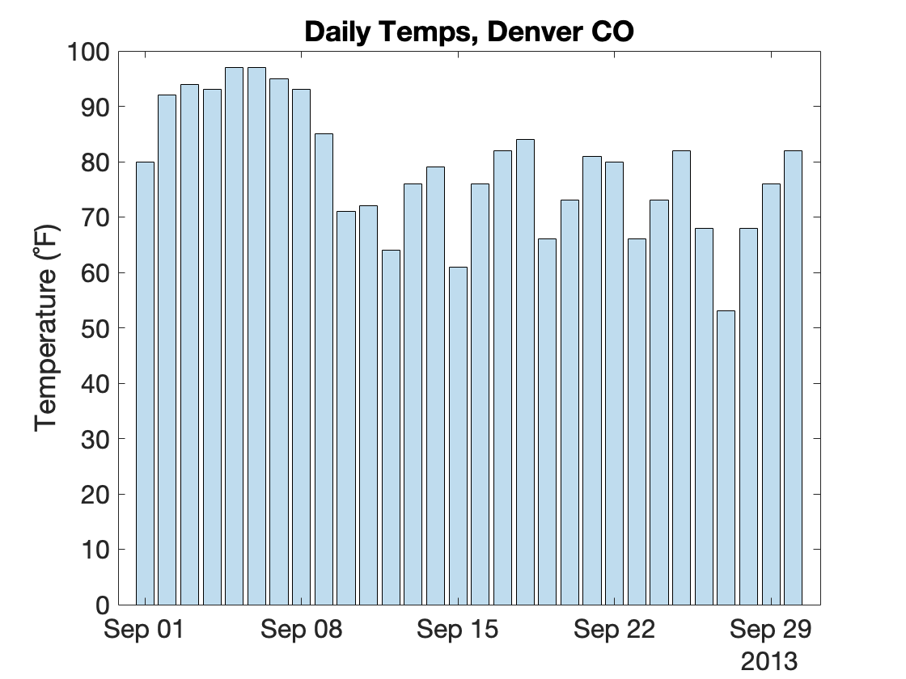
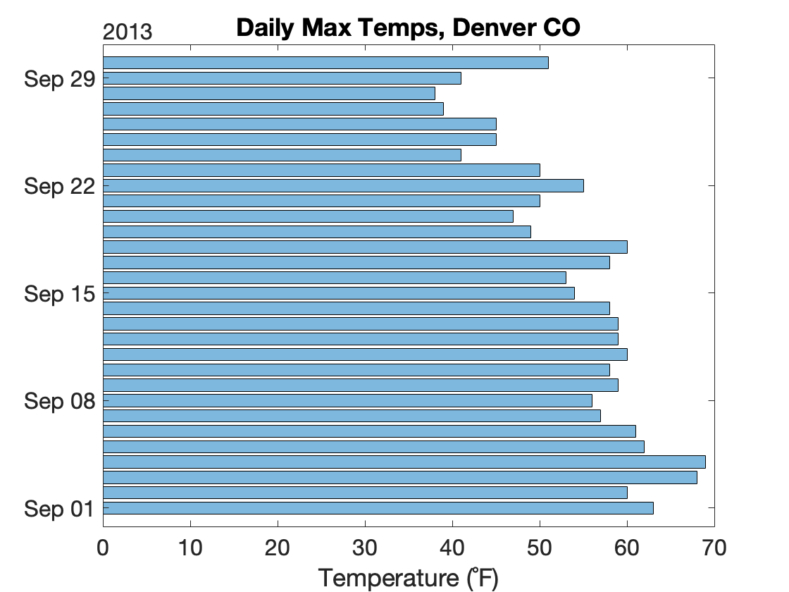
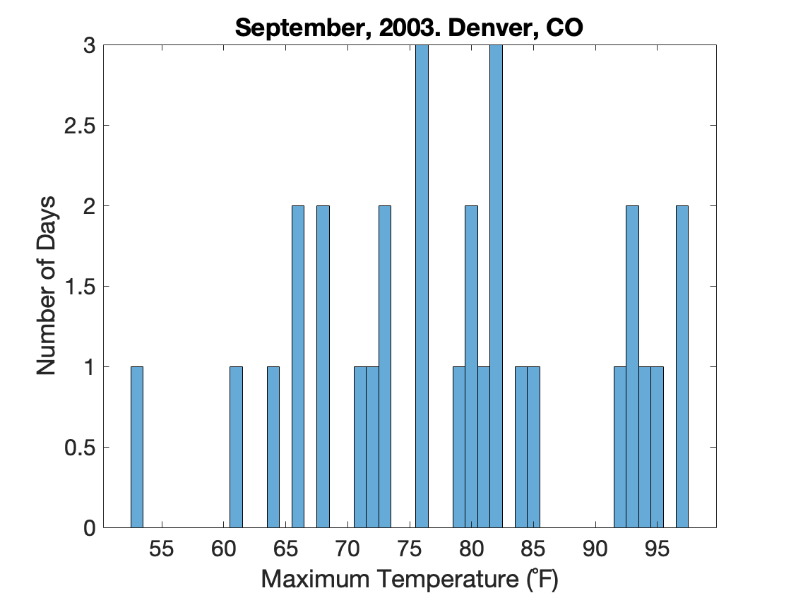
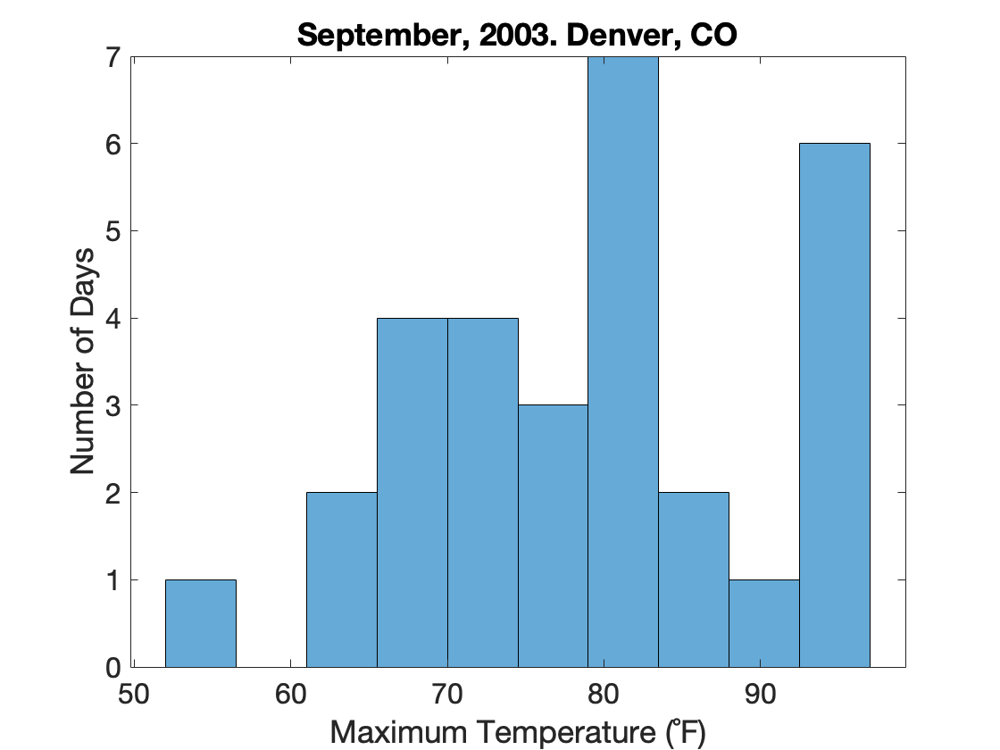
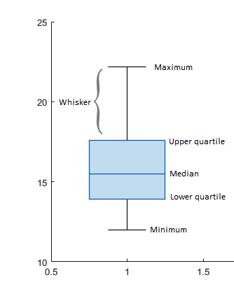
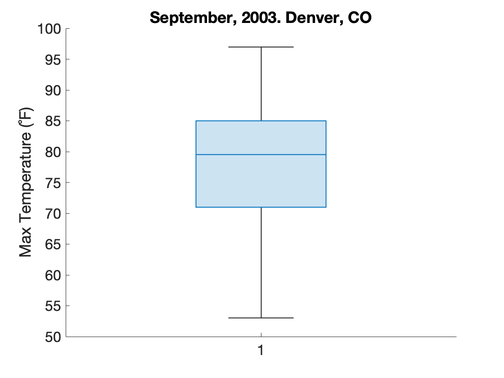

# Basic Plotting

Once you have a figure with an axis (see previous section), you can then add a plot to that axis. MATLAB has extensive plotting capabilities, including bar, scatter, and line plots.

## Overview

### Functions You Should know

- [**`plot`**](https://www.mathworks.com/help/matlab/ref/plot.html)

- [**`scatter`**](https://www.mathworks.com/help/matlab/ref/scatter.html)

- [**`bar`**](https://www.mathworks.com/help/matlab/ref/bar.html)
  
- [**`histogram`**](https://www.mathworks.com/help/matlab/ref/matlab.graphics.chart.primitive.histogram.html)
- [**`boxchart`**](https://www.mathworks.com/help/matlab/ref/boxchart.html)

- [**`title`**](https://www.mathworks.com/help/matlab/ref/title.html)

- [**`xlim`**](https://www.mathworks.com/help/matlab/ref/xlim.html) and [**`ylim`**](https://www.mathworks.com/help/matlab/ref/ylim.html)

- [**`xlabel`**](https://www.mathworks.com/help/matlab/ref/xlabel.html) and  [**`ylabel`**](https://www.mathworks.com/help/matlab/ref/ylabel.html)

### Useful Reference

The following site is an excellent resource for comparing types of plots and determining when and how you should use them:

- [Story Telling with Data][SWD]

[SWD]: https://www.storytellingwithdata.com/chart-guide  

Not sure whether you should use a bar chart or a box plot? Check out these articles:

- [Bar charts and box plots](https://www.nature.com/articles/nmeth.2807.pdf): this article in Neuron nicely summarizes when you should use a bar plot and when you should use a box plot. 
- [Box Plots v Bar Plots](https://pagepiccinini.com/2016/02/23/boxplots-vs-barplots/): this author falls strongly in the box plot camp

Interested in learning more about Beeswarm charts? Read these articles:
- [Box plot Alternatives](https://www.datascienceblog.net/post/data-visualization/boxplot_alternatives/)
- [Better Data Visualization Using Beeswarm Charts](https://towardsdatascience.com/better-data-visualization-using-beeswarm-chart-bb46a229c56b)

## Plots Tab

The simplest way to explore MATLAB's plotting capabilities is through the  "Plots" tab in the ribbon interface.

![Plots Tab][matlab_plots]{width=600px}

[matlab_plots]: images/plots-tab.png

!!! note
    To actually select an option in the Plots Tab, you will need to first select a variable in the workspace that is capable of being plotted as the selected plot type (e.g. a vector of numbers).

## Sample data

In this module, we will use a spreadsheet file that contains historical weather information from Denver in September, 2013. The following import this weather data directly into a table variable:

```matlab linenums="1" title="Load Weather Data"
url = "https://saldenest.s3-us-west-2.amazonaws.com/anat6205_resources/UNIT_1/w2013.csv";
T = readtable(url)
```

>you should end up with a table variable, *`T`*

*`T`* is a 30X23 table variable. Each row in the table contains the data from a given day in September 2013, while each column contains a different metric like Max or Min Temperature.

We can see the names of all the Column Headers in the table (remember, these are called variables in the table) by access the VariableNames field in the Table Properties, as follows:

```matlab linenums="1"
T.Properties.VariableNames'
```

```matlab title="result"
ans =

  23×1 cell array

    {'MDT'                   }
    {'MaxTemperatureF'       }
    {'MeanTemperatureF'      }
    {'MinTemperatureF'       }
    {'MaxDewPointF'          }
    ...
```

So, we have a lot of data to work with. Let's get cracking!

## Function Call Commonalities

In this module, we focus on the following plotting functions:  

- **Line Plots**: Used to track changes over short or long periods time. Use line plots for smaller changes and bar plots for larger changes
- **Scatter Plots**: - Also known as an X-Y plot. Used to determine the relationship between two different things (think correlations).
- **Bar Plots**: Used to graph categorical data or data sorted into groups.
Keep the following in mind as you work through these examples.
- **Hisgtograms**: Used to plot the distribution of a set of observations
- **Box charts**: Used to plot the summary statistics for a set of observations

The following are some similarities that can be seen across these functions:

- The first input into these functions will typically be a vector of data. For the Bar and Line plots, we will be inputting the Y values. If you input only one vector of data, then x-values are assumed to simply increment by one.

- If you input two vectors of data, the first vector will be treated as the X-data and the second vector the Y-data.

- After the data inputs, the rest of the inputs typically deal with the appearance of the plot (such as line thick, bar color, or marker appearance).

- Line specifications are character shorthand for specifying how the plot should look like. For example, `'r--'` means plot a red, dashed line. Review the documentation for more information

## Line Plots

Use Line plots (or line graphs) when you want to show value changing over time, or when you want to compare how several things change over time relative to each other. The key phrase “over time,” is your best clue to consider using a line graph for your data ([SWD](https://www.storytellingwithdata.com)).

To create a line graph in MATLAB, we use the function **`plot`**. There are several ways to call **`plot`**. Here are a few examples.

### Example 1: Line Graph with just a y- input

The change in daily temperature over the course of a month meets the criteria for a line graph rather nicely. In our table, *`T`*, we have a column called "MaxTemperatureF", which is simply the maximum temperature recorded on a given day. Recall that each row in the table represents a different day.

Create a line graph using the function **`plot`** as follows:

```matlab linenums="1" title="Line Plot - one input"
y = T.MaxTemperatureF;
plot(y)
```

…In this function call, **`plot`** assumes that you are inputting the y-values, so it automatically provides the x-values (basically a vector matching the length of the input vector comprised of increasing integers starting at one). Notice that we did not first execute the functions **`figure`** and **`axes`**. We could have, but instead, we had MATLAB do it automatically. If there is no existing axis or figure, the MATLAB plotting functions will simply create one. But be careful—if a plot already exists, MATLAB will simply overwrite the old plot with the new one, which may or may not be what you want.

You can then add plot labels as follows:

```matlab linenums="1" title="Add Plot Labels"
xlabel('Day') % labels the x-axis
ylabel('Max Temperature (˚F)') % labels the y-axis
title('Denver, Sept 2013') % adds an axis title
```

And the end result should look like this:

![Line Graph max temp][lineplot-maxtemp]{width=400px}
>Here we plot a Line Graph of Maximum Daily Temperatures in Denver, 2013.

[lineplot-maxtemp]: images/lineplot-max-temps.png

### Example 2: Line Graph with both x- and y- inputs

Our table *`T`* has a column called "MDT" which is simply the date of each day.  If we input two vectors into the function **`plot`**, these vectors are treated as X and Y inputs. Inputs beyond the first two inputs are treated as line specifications.

Here we input the date as the X-data and the Minimum Daily temperature as the Y-data.

```matlab linenums="1" title="Line Plot - multiple inputs"
figure % create a new blank window
x = T.MDT; % the date
y = T.MinTemperatureF; % the minimum temp
hp = plot(x, y, 'm:', 'LineWidth',2); % X-, Y-, and line spec inputs
xlabel('Day') % labels the x-axis
ylabel('Minimum Temperature (˚F)') % labels the y-axis
title('Denver 2013') % adds an axis title
```

![Line Plot Min TempsThe][lineplot-mintemp]{width=400px}

[lineplot-mintemp]:images/lineplot-date+min-temps.png

>Notice in this plot how the date information from the "MDT" column is automatically displayed in a highly readable format on the x-axis. Also notice that line specification 'm:' indicated that function should plot a magenta, dotted line, while the paired input of "LineWidth", 2, indicated how thick the line should be (thicker than the default). Since we created a plot in the previous section, we call the function **`figure`** here to create a new window (and not overwrite the old plot)

The function **`plot`** returns a handle to the line graph, assigned here to the variable *`hp`*. You can explore the properties of this object by simply typing *`hp`* into the command window:

```matlab linenums="1"
hp
```

```matlab title="Line Plot Handle Properties"
hp = 

  Line with properties:

              Color: [1 0 1]
          LineStyle: ':'
          LineWidth: 2
             Marker: 'none'
         MarkerSize: 6
    MarkerFaceColor: 'none'
              XData: [1×30 datetime]
              YData: [1×30 double]
              ZData: [1×0 double]

  Show all properties
```

…Notice the LineWidth property is set to 2 and the "Color" is set to [1 0 1], which is "magenta". You can change the property of the line graph by manipulating these fields. Try it out now. Add the following line after the plot function call and re-run the code block

```matlab linenums="1" title="Modify Plot Properties"
hp.Color = 'blue'
```

…what happens?(1)
{ .annotate}

1. The line turns blue

### Example 3: Multiple Plot Lines

Multiple Line plots can be created in one function call simply by entering the x- and y- data in series. In this example, we input both the maximum and minimum temperatures.

```matlab linenums="1" title="Plot Multiple Lines"
figure % create a new blank window

x = T.MDT;
y1 = T.MinTemperatureF;
y2 = T.MaxTemperatureF;

hp = plot(x,y1,x,y2); % sequential x and y inputs

xlabel('Day') % labels the x-axis
ylabel('Temperature (˚F)') % labels the y-axis
title('Denver 2013') % adds an axis title
legend('minimum','maximum')
```

Notice that we input `x` twice into **`plot`**. First, as the `x` for T.MinTemperatureF line and then as the `x` for T.MaxTemperatureF line. Also notice the function call to **`legend`**, which allows us to add a legend to the plot.

![Line Plot Max and Min Temps][img_lineplot]{width=400px}

[img_lineplot]:images/lineplot-multi-temps.png

### Line Plot Challenge

=== "Challenge 1"

    Use the property inspector to manually change the line plot so that it looks like this:

    ![][img_line_scatter_overlay]{width=400px}

    [img_line_scatter_overlay]: images/lineplot-manual-adjustment.png

    Hint: Look under the "Markers" and "Color And Styling" tabs in the property inspector

=== "Challenge 2"

    Challenge - Format the Line Plot Programmatically

    Review the MATLAB documentation for  <a href="MATLAB:web(fullfile(docroot, 'matlab/ref/plot.html'))">**plot**</a> and use a single call to **plot** to display the following:

    ![Plot with 3 lines][img_line_3lines]{width=400px}

    [img_line_3lines]:images/lineplot-challenge-3lines.png 

    Notice that we are adding a third line of data. You can find this data in table *`T`* T.MeanTemperatureF field. Don't forget to change the figure color to white. You will need to call following functions:

    * figure
    * plot
    * xlabel
    * ylabel
    * legend

    In that order. And you will need to add a line specifications for each plot.

=== "Answer 2"

    ```matlab linenums="1"
    figure % create a new blank window
    hp = plot(T.MDT, T.MinTemperatureF,'-sq', T.MDT,T.MaxTemperatureF, '-o', T.MDT, T.MeanTemperatureF,'--'); % X-, Y-, and line spec inputs
    % hp.Color = 'blue';
    xlabel('Day') % labels the x-axis
    ylabel('Temperature (˚F)') % labels the y-axis
    title('Denver 2013') % adds an axis title
    legend('minimum','maximum','mean')
    ```

    … Notice that the line specifications for each line immediate follow the x and y coordinates.

---

## Bar Plots

Bar plots are great for reporting the counts of something. You typically use bar plots to graph categorical data or data sorted into groups.

We use the function **`bar`** to create a bar plot. Here we plot the daily maximum temperatures in September:

```matlab linenums="1" title="Bar Plot"
figure;
x = T.MDT; % dates
y = T.MaxTemperatureF; % maximum temperatures

% create bar plot
bar(x,y,FaceAlpha=0.5); % FaceAlpha determines the transparency

% label y-axis and title
ylabel("Temperature (˚F)")
title("Daily Max Temps, Denver CO")
```

{ width="400"}

>In this plot, there are 30 bars, one for each day of the month. We increased the transparency of the bar color (using the FaceAlpha property) for aesthetic reasons—full opaqueness (FaceAlpha=1) creates very dark blue bars. MATLAB automatically recognizes the date info in the MDT column, and nicely formats the x-axis with the dates. Notice how you can easily track the temperature trends throughout the month: our eyes are very good at comparing lengths when objects are aligned ([SWD])

If you want a horizontal bar plot, you need to use the function **`barh`**. Everything else is mostly same.

```matlab linenums="1" title="Horizontal Bar Plot"
barh(x,y,FaceAlpha=0.5);
xlabel("Temperature (˚F)") % label x-axis (instead of y-axis)
title("Daily Max Temps, Denver CO")
```

{ width="400"}

## Distribution Plots

Distribution plots are used to plot the frequencies of a set of observations.

### Histograms

Histograms are used to plot the frequency distribution of a data set. These are different from bar plots, which are used to plot different categories of observations ([see above](#bar-plots)). When you create a histogram, you group the data into bins and then plot the bins.

For example, we can use a histogram to plot the distribution of the Maximum Temperatures in September.

```matlab linenums="1" title="Histogram of Max Temps"
x=T.MaxTemperatureF;
histogram(x)
title('September, 2003. Denver, CO') % add a title
ylabel('Number of Days'); % label the y-axis
xlabel('Maximum Temperature (˚F)'); % label the x-axis
```

{ width="450"}

>Here, instead of plotting every single temperature for every day, like we did with the bar plot, we bin the data into 1-degree bins, and then plot the bins (this is all handled by the **`histogram`** function). So, in this plot, 3 temperatures fell between 75.5 and 76.5. So, we got one bar spanning 75.5-76.5 with a height of 3. The histogram also gives us a nice overview of the temperature distributions. For example, we can see there was only one day with a temperature below 55˚F and relatively few days above 95˚C.

Sometimes, the default bin selection used by **`histogram`** produces a plot that is a little sparse or doesn't quite represent the distribution as it should. You can manually set the numbers of bins used in the histogram by adding a second input to the function as follows:

```matlab linenums="1" title="Histogram of Max Temps"
x=T.MaxTemperatureF;
histogram(x,10) %  use 10 bins
title('September, 2003. Denver, CO') % add a title
ylabel('Number of Days'); % label the y-axis
xlabel('Maximum Temperature (˚F)'); % label the x-axis
```

{ width="450"}

…Here is the exact same data but using a histogram with just 10 bars (more of the temperature data have been binned together). In this histogram, you can see a little more shape to the distribution of temps.(1)
{ .annotate }

1. Be careful when changing the number of bins that you use in a histogram. The proper number of bins used in a histogram is an arcane subject and there are many papers on the matter that are well beyond the scope of this module. Suffice it to say, you can risk misrepresenting the data if you use a number of bins that does not truly accurate represent the distribution of the data (e.g. overly binned so the the true shape of the distribution is hidden).

### Box Plots

Box plots are a visual representation of the summary statistics for a set of observations. These plots have indicators that show statistics like the median (line in box), the interquartile range (the box), and the data range (the whiskers). You also have outliers (circles), which are data points that are 1.5 x the interquartile range.

{ width="250"}

The function **`boxchart`** creates box plots (1).
{ .annotate }

1. There is also a function called [**`boxplot`**](https://www.mathworks.com/help/stats/boxplot.html) that comes with the [Statistics and Machine Learning Toolbox](https://www.mathworks.com/products/statistics.html). Its plots are not quite as pretty, but you can have more control over the different aspects of the plot.

```matlab linenums="1" title="Box Plot of Max Temperatures"
boxchart(x)
ylabel('Max Temperature (˚F)') % label the y-axis
title('September, 2003. Denver, CO') % add a title
```

{ width="450"}

>This plot represents the exact same data seen in the histogram above, but plotted as summary statistics along the y-axis. The box, which represents the interquartile range of data (or the middle half of the data), ranges from 70˚-85˚ F. So we know that the middle half of the maximum temperatures fall in this range. The line inside the box is the median. So, we know that half of all maximum temperatures are above and the other half are below 80˚F. And the whiskers represent the range. So, as we saw in the histograms above, the range of maximum temperatures fall between 53˚F and 97˚F.

## Scatter Plots

We use a scatter plot to visualize the relationship between two numerical variables. The shape of the plot can give you some indication as to the nature of that relationship. For example, a scatter plot in which the dots are higher on the right side of the plot vs the left side of the plot typically indicates that the two variables are positively correlated (When the x is high, the y is high).

For example, we can use a scatter plot to visualize the relationship between minimum and maximum temperatures in a day, as follows:

```matlab linenums="1" title="Scatter Plot"
figure

% get data
x = T.MinTemperatureF;
y = T.MaxTemperatureF;

%plot 
hs = scatter(x, y, 50, 'black', 'filled'); % Marker Size 50, black, filled
hs.MarkerFaceAlpha = 0.5; % change transparency of markers to 0.5

% axis formatting
xlabel('Minimum Temperature (˚F)',"FontSize",14) % add an x-label
ylabel('Maximum Temperature (˚F)', "FontSize",14) % add a y-label
title('Denver - September 2013') % Add title
```

…Here, we use the function **`scatter`** to generate a scatter plot. Unlike the **`bar`** or **`line`** functions, the **`scatter`** function requires that the first two inputs are x and y vectors.  After these inputs,  **`scatter`** allows for formatting specifications such as

- size of dots is 50
- color of dots is black
- dots are filled (a solid color,  not just outlines of circles)
  
The order of these formatting inputs is critical, which you can review in the [**scatter**](https://www.mathworks.com/help/matlab/ref/scatter.html') documentation. If you assign an output from **`scatter`**, you get a handle, *`hs`* which allows you to modify the properties of the markers plotted. Here, we use *`hs`* to make the dots more transparent.

And we get a scatter plot that looks like this:

![Scatter Plot Max v Min Temp][img_scatterplot]{width=450px}

[img_scatterplot]:images/scatter-max-v-min-temps.png

>Overall, the rising trend of the plot, with the dots higher on the right side, suggests that the two series are positively correlated, which makes sense for daily temperatures. Temperatures in any given day are usually highly correlated: if it's warm during the day, it will usually be warmer at night (unless a cold front comes sweeping in).
