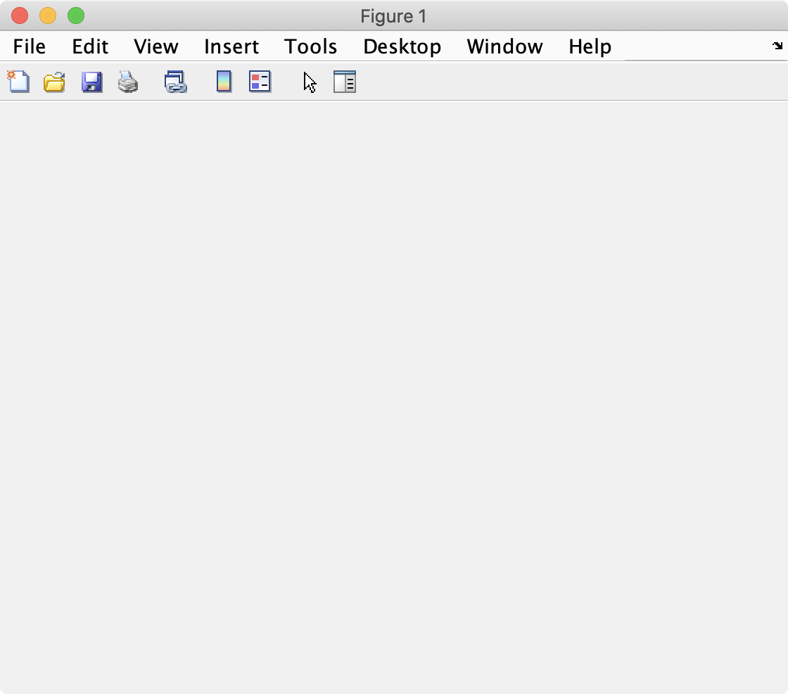
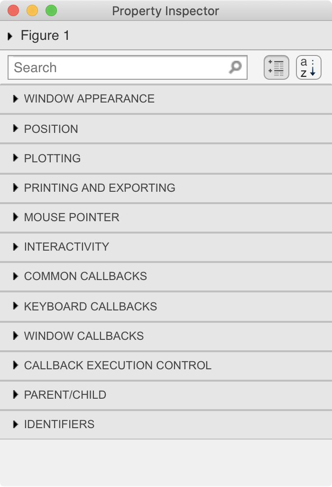
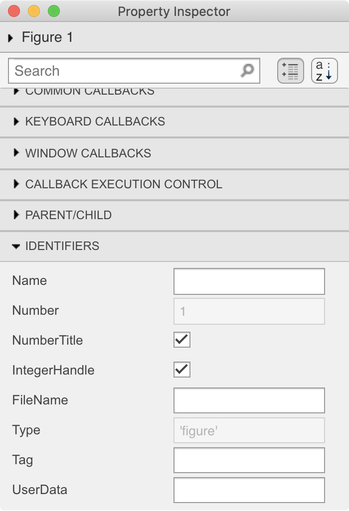
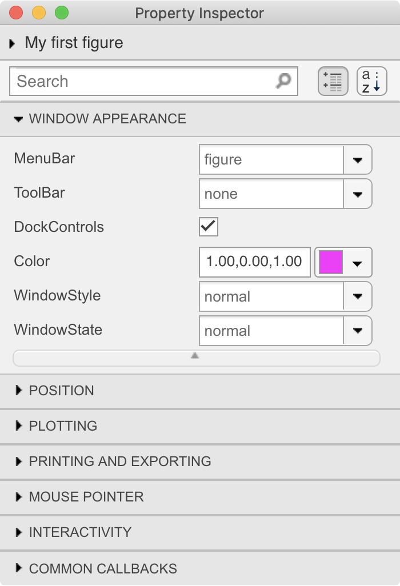
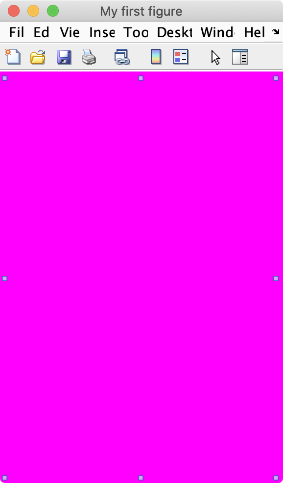

# Basic Components of a Plot

!!! annotation "*For Visualizing Your Data*"

![Line Plot][img_line_annotated]

[img_line_annotated]: images/lineplot_annotated.png

## Overview

In this module, we discuss the basic components needed to create a plot. Specifically, we will learn about empty MATLAB windows, called figures, and empty axes (where the plots are added) called **axes**.

### Things you should know

After this module you should be able to:

- Create a blank figure and add a blank axis to the figure
- Access and modify a figure or axis's properties using the 'Edit' menu
- Access and modify a figure's properties using the relevant handle and either *dot notation* or the **`set`** and **`get`** functions
- Tile multiple axes into the same figure
- Know all the listed important terminology and be able to use the listed important functions

### Functions you should know

You should know what these functions do and how to use them

- [**figure**](https://www.mathworks.com/help/matlab/ref/figure.html')

- [**axes**](https://www.mathworks.com/help/matlab/ref/axes.html')

- [**tiledLayout**](https://www.mathworks.com/help/matlab/ref/bar.html')

- [**nexttile**](https://www.mathworks.com/help/matlab/ref/nexttile.html')

### Relevant MATLAB documentation and other links

- [Graphics](https://www.mathworks.com/help/matlab/graphics.html?s_tid=CRUX_lftnav')

- [Graphics Objects](https://www.mathworks.com/help/matlab/graphics-objects.html')

- [Graphic Object Handles](https://www.mathworks.com/help/matlab/creating_plots/currently-active-figure-and-axes.html')

- [Graphic Object Properties](https://www.mathworks.com/help/matlab/graphics-object-properties.html?s_tid=CRUX_lftnav')

- [Axis Toolbar](https://www.mathworks.com/help/matlab/creating_plots/interactively-explore-plotted-data.html'): Interactively Explore Plotted Data

- [Mathworks Blog: Creating Pretty Graphs](http://blogs.mathworks.com/loren/2007/12/11/making-pretty-graphs/)

### Terminology you should know

You should be able to define the following terms and use them to discuss MATLAB figures and plotting:

- **[Graphic Object][graphic object]**: MATLAB components used to visualize data

- **Root**: The basic foundation on top of which everything else is run. You create the root object when you launch MATLAB

- **Figure**: a programmable window to which you can add graphic objects such as axes or ui objects (like buttons)

- **Axes**: an object to which you can add plots or images

- **Handle**: an object identifier. Every figure, axis, and control element has a handle

- **Properties**: the name, color, size, location, etc. of a graphic object

[graphic object]: http://www.mathworks.com/help/matlab/graphics-objects.html

## Figures

In MATLAB, a **figure** is a blank window that you can add stuff to. Think of a figure as a [tabula rasa](http://en.wikipedia.org/wiki/Tabula_rasa) onto which you can add other things, like plots, or images, or even buttons.

### Figure Creation

To create a new figure in MATLAB, simply type the command **`figure`** in the command window

```matlab linenums="1" title="Create a Figure"
figure
```

… and then you should see an empty window that looks like this:

{ width="350"}

…Notice that your new figure comes preloaded with a lot of built-in functionality like a menubar and toolbar. You may or may not need this functionality, but it can be easily turned off.

### Figure Properties

You can explore the properties of your new figure by selecting the "Edit:Figure Properties..." menu item. This command will bring up the "Property Inspector" window:

{width="250"}

>As you can see, the properties window has a series of collapsible tabs

Let's explore these tabs by opening the "Identifiers" tab:

{width="250"}

>Here we find a series of properties related to the identification of the figure window

We can rename our new figure by entering "My first figure" in the Name field.

{width="250"}

>Notice how the title bar of the figure changes to include our new figure name, and the Figure number

If you want to remove the "Figure 1:" part of the title, simple click off the NumberTitle Check box.

{ width="250"}

If you prefer your windows in hot pink you change the color by clicking on the "Window Appearance" tab and modifying the "Color" property:

{ width="250"}

>Here we used the dropdown menu to select Magenta, which has a color value of `1, 0, 1`.

And now our figure is hot pink:

{ width="250"}

>*Much* better.

You can also hide the default toolbar by setting the "ToolBar" setting to "none". Or, if you don't want a menubar, set the "MenuBar" setting to "none". Almost any property of the figure can be adjusted in this fashion.

In fact, the Property Inspector is a great way to inspect which properties can (or cannot) be adjusted, and what values they accept. You just need play around with the settings to get a feel for what's possible, most of which is likely beyond the scope of this course.

You can read a full description of all the Figure Properties [here](https://www.mathworks.com/help/matlab/ref/matlab.ui.figure-properties.html').

[img-undock]: images/undock_icon.png

### Programming Figure Properties

The Properties Inspector is what is known as a GUI (a graphics user interface), which simply means that you interact with the inspector using your mouse and clicking on buttons—like how most software works. However, since MATLAB is a programming language, anything that you can accomplish with a click of a button, you can also accomplish using MATLAB code. Coding the properties of a figure to your specifications allows you to quickly recreate the settings of a figure in exactly the same way every time.

You can programmatically change the properties of a figure in two ways:

1. Through the **`figure`** function call
2. Through the figure's handle.

The first method assumes that you know the exact properties you want to set when creating the figure.

### Figure Function Calls

Consider the following function call:

```matlab linenums="1"
figure('Name','My Second Great Figure', 'Color', 'Red')
```

![red figure][img-fig-red]{width="300"}

>Here we set the title of the figure to "My Second Great Figure" and the background color to red by inputting paired inputs in the function call. 

[img-fig-red]: images/figure-window-red.png

### Figure Handles

Once you have created the figure, you can access all of its properties through its figure handle. A figure handle is an identifier that is specific to an figure.

Here we use a call to the **`figure`** function with no inputs to create a *default* figure and we assign the output from **`figure`** to *`fh`*.

```matlab linenums="1"
fh = figure
```

…*`fh`* is the figure handle. Its icon is a cube (![][img-obj-icon]) and its class is "Matlab.ui.Figure", which basically means a graphical object.  (1)
{ .annotate}

1. An Object is a computer element that can have both storage and functions. So, like a variable with some functions attached. Objects that have plots or images in them are called Graphic Objects.

If you display *`fh`* in the command window, you will see a short list of its properties, including its name (no name) and color (a light gray).

[img-obj-icon]: images/object-icon.png

```matlab title="result"
fh = 

  Figure (3) with properties:

      Number: 3
        Name: ''
       Color: [0.9400 0.9400 0.9400]
    Position: [1000 918 560 420]
       Units: 'pixels'

  Show all properties
```

…A click on the "Show all properties" prints out the full list of the figure properties to the command window, which matches the list of properties that you can find in the [Properties Inspector](#figure-properties).

The figure handle can be used to set the properties of a figure using the *dot notation* syntax as follows:

```matlab
fh.Color = 'black'
```

…The background color of the figure changes to black. 

Or change the name of your figure using this syntax:

```matlab
fh.Name = 'My third awesome figure!'
``` 

To turn off the automatic figure numbering, type:

```matlab
fh.NumberTitle = 'off'
```

![Figure with Black Background][img-fig-window-black]{width="400"}

[img-fig-window-black]: images/figure-window-black.png

!!! tip "Pro-Tip"
    Enter tab after typing *`fh.`* and you will get a scrollable pop-up menu listing all of the handle's fields

    ![Tab Fields Popup][img-handle-fields]{width="200"}

    …Type a few letters of the field you want to access and you can narrow down the selections to the field of interest. Select the property name you would like to access and hit ENTER. MATLAB will automatically complete typing the name for you.

[img-handle-fields]:images/handle-fields-popup.png

## Adding Stuff to figures

As previously discussed, figures are blank windows onto which you can add stuff. This stuff is added as a layer onto the figure. For example, you can add a blank axes to a blank figure. And then a line plot to the axes. The figure, the axes, and the line plot are all considered different graphic objects added to different layers of the figure. This layering systme is also known as the Parent-Child relationship between objects.

### Parents and Children

The Parent-child relationship describes the layering system in MATLAB. Children are added to parents. So, all graphic objects, including figures, have a parent-child relationship. For example, any new graphic object added to a figure is known as a child to that figure.

Inversely, a figure is the parent to any and all graphic objects added to it. Think of children as layers added to the parent. The following organizational chart illustrates this relationship:

![][img_obj_chart]{width=125px}

[img_obj_chart]:images/figure-parent-child.png

>Parent-Child Relationships. In this diagram, every object (represented here as a rectangle) is a child of the object above it. And inversely, every object is the parent to the object below it.

## Axes

Axes serve as placeholders for plots. Axes cannot stand alone. They have to be added to figures. As such, axes are known as "children" of figures.

You can add an empty axes to a figure by simply calling the **`axes`** function after calling the **figure** function, as follows:

```matlab linenums="1" title="Adding an axes to a new figure"
fh = figure; 
ah = axes
```

And you get a figure with an axes

![Figure with Axes][img-fig-window-axes]{width="400"}

[img-fig-window-axes]: images/figure-window-axes.png

>As you can see here, the axis has and x- and a y-axis. It even has limits for each axis (they both range from 0 to 1). The axis is smaller than the figure and it's default background is white (as opposed to the gray background of the figure).

The variable *`ah`*  contains the axis handle to the axis.

```matlab title="Axes handle"
ah = 

  Axes with properties:

             XLim: [0 1]
             YLim: [0 1]
           XScale: 'linear'
           YScale: 'linear'
    GridLineStyle: '-'
         Position: [0.1300 0.1100 0.7750 0.8150]
            Units: 'normalized'

  Show all properties
```

>You can click "Show all properties" in the  MATLAB command window and  MATLAB will print all of the axes properties to the Command Window.

Notice that one of the properties of the axis is called 'Parent.' This property stores the handle to the parent figure. You can access the properties of the Parent figure using double dot notation, as follows:

```matlab linenums="1" title="Change Figure background"
ah.Parent.Color = 'white'
```

>This changes the background of the figure to white and is the same as typing: `fh.Color = 'White'`

You can also remove the axis from the figure by deleting its handle using the function **`delete`**

```matlab linenums="1" title="Remove axes from figure"
delete(ah)
```

>Notice that after this command, only the axis disappears, not the figure.

### Axes Property Functions

Axis property functions are helper functions that label the axes. The most common functions we will use in this tutorial are the following:

- [**title**](https://www.mathworks.com/help/matlab/ref/title.html'): Add title to axes

- [**xlim**](https://www.mathworks.com/help/matlab/ref/xlim.html') and [**ylim**](https://www.mathworks.com/help/matlab/ref/ylim.html'): set x- and y-axis limits

- [**xlabel**](https://www.mathworks.com/help/matlab/ref/xlabel.html') and  [**ylabel**](https://www.mathworks.com/help/matlab/ref/ylabel.html'): add X- and Y- labels to axes

- [**legend**](https://www.mathworks.com/help/matlab/ref/legend.html'): Add legend to axes

### Axes Toolbar

If you hover over an axis, you should see a pop-up toolbar that looks like this:

![Axes toolbar][img-axis-toolbar]

[img-axis-toolbar]: images/axes-toolbar.png

…If you don't see the toolbar, make sure Plot Edit mode is turned off by clicking on the White Selection arrow.

This toolbar has several functions, including:

- ![Save Icon][img-axes-save]{width="35"}: **Save** and **Copy**

- ![Data Brush Icon][img-axes-databrush]{width="25"}: **Data Brushing**: allows you to replace or copy specific datapoint, like outliers

- ![Data Tip Icon][img-axes-datatip]{width=30px}: **Data Tips**: allows you to explore specific data points (shown in figure above, the x,y data points)

- ![Pan Icon][img-axes-pan]{width=30px} - **Pan**: move the plot around (when zoomed in)

- ![Zoom Icons][img-axes-zoom]{width=60px}: **Zoom**: zoom in and out

- ![Home icon][img-axes-restore]{width=30px} - **Restore**: resets view back to original

[img-axes-save]: images/axes-toolbar-save.png
[img-axes-databrush]:images/axes-toolbar-databrush.png
[img-axes-datatip]:images/axes-toolbar-datatip.png
[img-axes-pan]: images/axes-toolbar-pan.png
[img-axes-restore]:images/axes-toolbar-restore.png
[img-axes-zoom]: images/axes-toolbar-zoom.png

### Saving Plots from Axes toolbar

To save your plot, click on the save icon in the axes toolbar or go the File menu in the figure's menubar and select "Save as..."

For emailing or to embed the plot into digital presentations, choose the .PNG format, which helps reduce file size. For printing, choose the .SVG or .PDF format. These formats allow the plot to be modified using other software, such as  Adobe Photoshop or Illustrator, to change the color of the bars or the fonts. This format also provides a greater resolution range. However, not all imaging packages can open an .svg file and sometimes some complex raster images do not reproduce properly.

### Copying plots from Axes Toolbar

In the axes toolbar, you have two choices for copying plots:

- **Copy as image**: Preserves resolution of figure on the screen (probably won't be able to zoom into the image without revealing rasterized pixels). Great option for dropping the figure into a powerpoint. Most universal format - can probably paste into most software. Best option for images.

- **Copy as vector graphic**. Like a PDF format. Allows nearly infinite zooming. Can edit the graphic in vector editing software, like Adobe Illustrator. Great for printing. Best option for Plots and graphs.

!!! tip "I am Groot"
    You can set figure defaults for all figures during a coding session by setting the properties for `groot` - the graphic root object. You do this using the following code.

    ```matlab linenums="1" title="Set default values for figures"
    set(groot, 'defaultAxesFontSize', 16, 'defaultFigureColor','w');
    ```

    This code sets the default figure color to white and the default axes font size to 16.

    This command needs to be run each time you restart MATLAB. 

### Tiled Layouts

Sometimes, you want more than one axis per figure. The functions **`tiledlayout`** and **`nexttile`** allow you to add multiple axes to a single figure in tiled positions.

The syntax is fairly straightforward. In the simplest syntax, you simply call **`nexttile`** each time you want to add a new axis to a figure window. Here, we will add two axes, as follows:

```matlab linenums="1" title="Adding Tiled Axes"
figure
nexttile
nexttile
```

And we get a figure with two axes.

![Figure with 2 axes][img-tiled2]

[img-tiled2]:images/figure-2tiledwindow.png

With another call to **`nexttile`**…

```matlab linenums="1" title="Adding another Tiled Axes"
nexttile
```

…We add another axes to the figure:

![Figure with 3 Axes][img-tiled3]

>Notice that the layout of the axes is automatically reconfigured to a 2X2 layout. This is automatic layout system is known as the 'flow' layout. MATLAB tries to keep a 4:3 ratio of axes on a figure with a 'flow' layout.

[img-tiled3]:images/figure-3tiledwindow.png

### Controlling the Tiled layout

If we want the axes all in one row, then we would use the **`tiledlayout`** function and explicitly input the layout we want, as follows:

```matlab linenums="1" title="Example: tiledlayout"
figure
tiledlayout(1,3)
nexttile
nexttile
nexttile
```

![Figure and Axes using tiledlayout][img]{width=600px}
>An input of (1,3) into **`tiledlayout`** means 1 row, 3 columns

[img]:images/figure-tiled-1row.png

### Subplot

*To be discontinued... (eventually)*

Prior to the release of **`nexttile`** and **`tiledlayout`**, the function **`subplot`** accomplished  the same goal of **`nexttile`**: plotting multiple axes in one figure.

However, the syntax is a little more convoluted. First you needed to decide beforehand how many rows and tiles you want. Then, instead of simply calling **`subplot`**, you need to explicitly set the position the axes each time you would like to add a new axis to the figure, using the following syntax:

```matlab linenums="1" title="SUBPLOT set-up"
subplot(ROWS,COLUMNS,INDEX) 
```

…where *`ROWS`* equals the number of rows of axes that you want to add to the figure, *`COLUMNS`* equals the number of columns that you want to add, and *`INDEX`* indicates the location of the axis (in a ROW major order). Unlike the flow layout that you can use with **`nexttile`**, subplot requires everything to be predetermined and organized before you start plotting.

For example, to create a 2X2 matrix of axes in a figure, you would run the following commands:

```matlab linenums="1" title="Example: 2X2 Tiled Axes using SUBPLOT"
fh = figure
sph(1) = subplot (2,2,1) % Top Left Corner
title ('Position One')
sph(2) = subplot (2,2,2) % Top Right Corner
title ('Position Two')
sph(3) = subplot (2,2,3) % Bottom Left Corner
title('Position Three')
sph(4) = subplot (2,2,4) % Bottom Right Corner
title('Position Four')
```

…Notice that the first two inputs into each call to **`subplot`** are exactly the same: 2,2. These inputs indicate that there are should be 2 rows and 2 columns. The third input is the only input that changes, and it increases from 1 to 4. Also notice that the indexing here is ROW-MAJOR, for some reason, instead of COLUMN-MAJOR as is found in all other MATLAB indexing. This means that consecutive axes are beside each other across the rows first, then down across the columns. 

After you run the above code, you should see the following:

![][2x2fig]{width=400px}

>Again, the axes are empty because we didn't add any data.  Similar to the **`nexttile`** function, we add the plotting functions after we call **`subplot`**.

[2x2fig]:images/subplot-empty-2x2-titled.png

!!! note "Tiled Layout Take-Away"

    There are two functions you can used to tile your axes: **`nexttile`** and **`subplot`**. The syntax for **`nexttile`** is easier and, in combination with **`tiledlayout`**, more powerful. For example, you can more easily control the spacing of the axes using **`tiledlayout`**. The function **`subplot`** is the older function. As such, it is more compatible with more functions. But, it is not as powerful as **`nexttile`** and doesn't have modern features like the flow layout or compact spacing.

    So, the main takeaway here is that you should use **`nexttile`** unless you are getting weird results. Then try **`subplot`**.

**Fin.** Congratulations. This module has ended. In the next module, we will discuss how to add plots to axes.