# Advanced Plotting: Overlays and Tiling

!!! abstract "One plot is great. Multiple plots is even greater"

Often, you want to have have multiple plots added to the same axes or you want multiple axes added to the same figure. In this module, we'll talk about how to do this.

## Functions you Should know

- [**`hold`**](https://www.mathworks.com/help/matlab/ref/hold.html) - Retain current plot when adding new plots
- [**`nexttile`**](https://www.mathworks.com/help/matlab/ref/nexttile.html): add tiled axes to a figure
- [**`tiledlayout`**](https://www.mathworks.com/help/matlab/ref/tiledlayout.html): set the layout of the tiled axes in a tiled figure
- [**`bar`**](https://www.mathworks.com/help/matlab/ref/bar.html): create a bar plot
- [**`scatter`**](https://www.mathworks.com/help/matlab/ref/scatter.html): create a scatter plot
- [**`histogram`**](https://www.mathworks.com/help/matlab/ref/matlab.graphics.chart.primitive.histogram.html): create a histogram
- [**`boxchart`**](https://www.mathworks.com/help/matlab/ref/boxchart.html): create a box plot
- [**`title`**](https://www.mathworks.com/help/matlab/ref/title.html): add a title to the axes
- [**`xlim`**](https://www.mathworks.com/help/matlab/ref/xlim.html) and [**ylim**](https://www.mathworks.com/help/matlab/ref/ylim.html): set the x and y limits
- [**`xlabel`**](https://www.mathworks.com/help/matlab/ref/xlabel.html) and  [**ylabel**](https://www.mathworks.com/help/matlab/ref/ylabel.html): label the x and y axes
- [**`legend`**](https://www.mathworks.com/help/matlab/ref/legend.html): add legend to axes

## The power of hold

In MATLAB, plotting is destructive, by default . This means that calls to new plotting functions will overwrite any previous plots in the current axes. So, for example, if you execute the following…

```matlab linenums="1"
plot(x)
plot(y)
```

…you would be left with only the plot of *`y`*—the plot of *`x`* will be wiped out of existence.

If, instead, you want to add multiple plots to the same axes, which is a thing people totally do, you need to call the function **`hold`**.

Calling **`hold`** is very easy. You just enter following:

```matlab linenums="1" title="The function hold"
plot(x) % create first plot
hold on % turn hold on
plot(y) % add the y plot
```

If you want to go back to destruction, and stop overlaying graphs, enter the following:

```matlab linenums="1"
hold off % turn hold off
```

…and the hold will be turned off.

Ok, let's overlay some plots!

## Mix and Match

The nice thing about **`hold`** is that you can overlay different plotting functions.

### Load Weather Data

For this example, we will load the same weather data from 2013 that we used in the [previous module (Plotting Basics)](PlottingBasics.md).

```matlab linenums="1" title="Load Weather Data"
url = "https://saldenest.s3-us-west-2.amazonaws.com/anat6205_resources/UNIT_1/w2013.csv";
T = readtable(url)
```

Recall that this table contains historical weather information from Denver in September, 2013. We can plot the maximum temperatures as a box plot using the following syntax, as we did in the [previous module](PlottingBasics.md)

```matlab linenums="1" title="Bar Plot of Weather Data"
figure(Visible="on")
x = T.MDT; % dates
y = T.MaxTemperatureF; % maximum temperatures

% create bar plot
bar(x,y,FaceAlpha=0.75); % FaceAlpha determines the transparency

% label y-axis and title
ylabel("Temperature (˚F)")
title("Daily Temps, Denver CO")
```

{ width="400"}

We can then easily overlay the minimum temperatures as a box plot by adding the following lines of code:

```matlab
hold on % turn overlay on
y = T.MinTemperatureF; % grab the minimum temps and set to y
hb = bar(x,y,FaceAlpha=0.75); % bar plot minimum temps
```

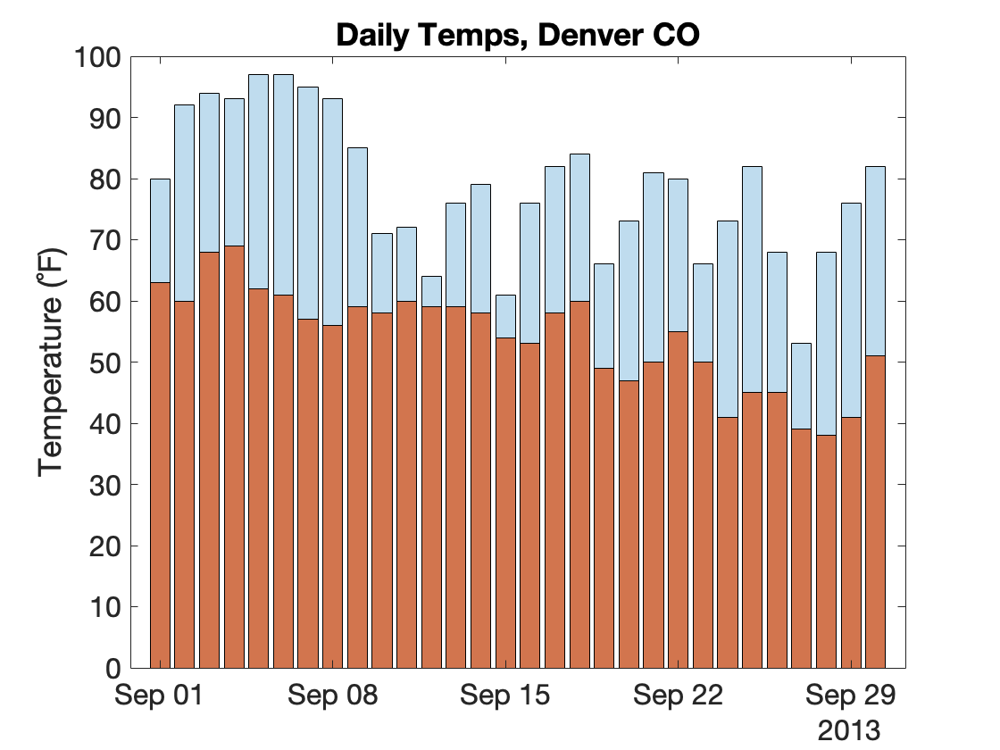{ width="400"}

>Since we are overlaying the second bar plot atop the bar plot already plotted, we don't have to relabel the y-axis and add the title. They are already there.

Finally, we can add a trend line of the mean temperatures using the **`plot`** function

```matlab
y = T.MeanTemperatureF;
plot(x,y,'k--',LineWidth=2) % plot dashed line
legend("Max","Mean","Mean",fontsize=10) % add legend
```

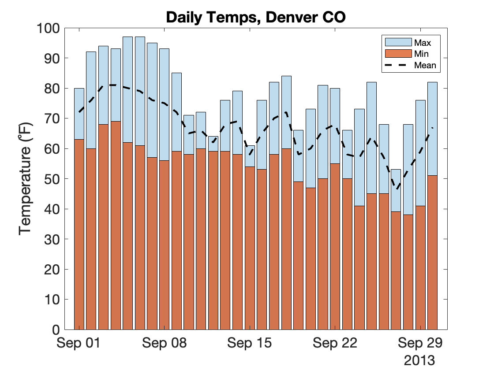{ width="350"}

>Here we don't have to turn **`hold`** on. It stays on once set. We make the line black and dashed using the format specification `'k--'` at the 3rd input. We add the legend using the **`legend`** function and manually input the names for the legend.

And we finish with an information dense plot of maximum, minimum and mean temperatures in Denver, CO in the fall of 2013.

## Overlaying Histograms

### Load even More Data

For the next few examples, we will load ten years worth of Denver weather data. I have stored this data in a .CSV file (spreadsheet) in a remote file on an Amazon Server. To load this file, run the following in MATLAB

```matlab linenums="1" title="Import Table"
url="https://saldenest.s3-us-west-2.amazonaws.com/anat6205_resources/UNIT_1/weather_data_merged.csv"
T =readtable(url)
```

…This should load a 300X23 table into the table variable, *T*. Remember, each row in this table represents one day's worth of weather data. So, 300 rows would be 10 years of September data. Each column is a variable (or measurement), like Max or Min Temperature (for the day).

### Plotting the Histogram

As we saw in the previous module, histograms are used to display the distributions of frequency. For example, here is a histogram of the Minimum Temperatures in September over 10 years:

```matlab linenums="1" title="Histogram of Minimum Temperatures"
figure;
x = T.MinTemperatureF;
histogram(x,30) % use 30 bins
xlabel('Temp (˚F)')
ylabel('Count per bin')
title('Distribution of September Temps over 10 years')
```

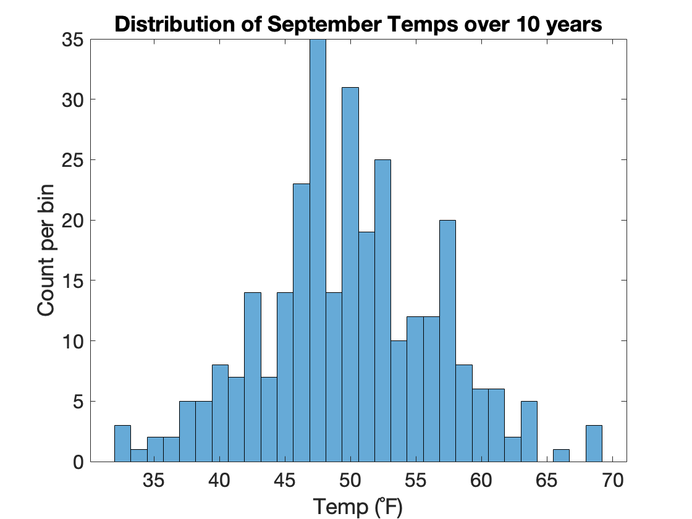{ width=400px}

>As we can see, a lot of low temps from 45-55˚C, and less low temps at 35˚C or 70˚C.

For comparison, let's add the maximum temperatures.

```matlab linenums="1" title="Overlay Maximum Temperatures"
hold on % turn on overlay
histogram(T.MaxTemperatureF,30)
legend("Min","Max") % add a plot legend
```

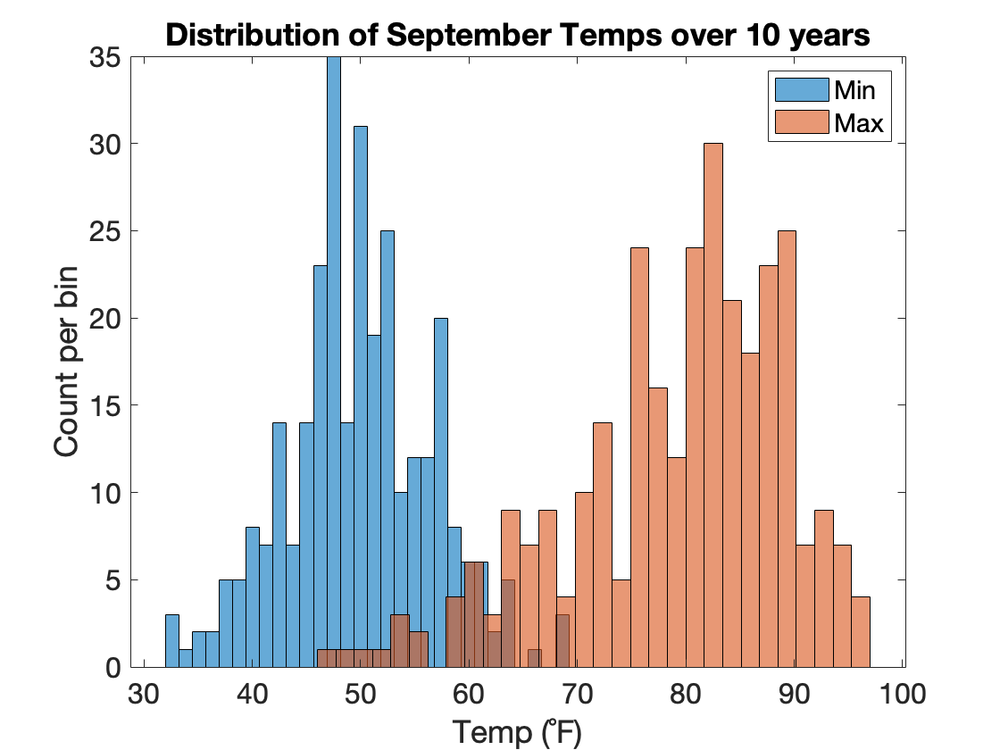{ width="400"}

>And now we have overlaid the maximum temperatures over 10 years.

As you review the plot, notice that:

- MATLAB automatically rescaled the axis to fit the maximum data and changed the color of the overlaid histogram.
- We did not call the **`figure`** function again or **`title`**, **`ylabel`**, or **`xlabel`**. The figure, title, x-, and y-labels all stayed the same.
- We used the function **`legend`** to add a color legend to the plot.
- We used the same number of bins (30) in both histogram calls. This is important to ensure the plotted distributions look similar.

### Histogram challenge

??? question "How would you add the distribution of mean temperatures ('MeanTempF') to the axes above?"

    You can do this with one line of code:

    ```matlab
    histogram(T.MeanTemperatureF,30,DisplayName="mean")
    ```

    - Notice that we didn't need to call `hold on` again. Once it's on, it's on.
    - Also notice the third input into the function `DisplayName = "mean"`. This input is used to update the legend with an informative name (otherwise you would get something uninformative, like `data3`).
  
    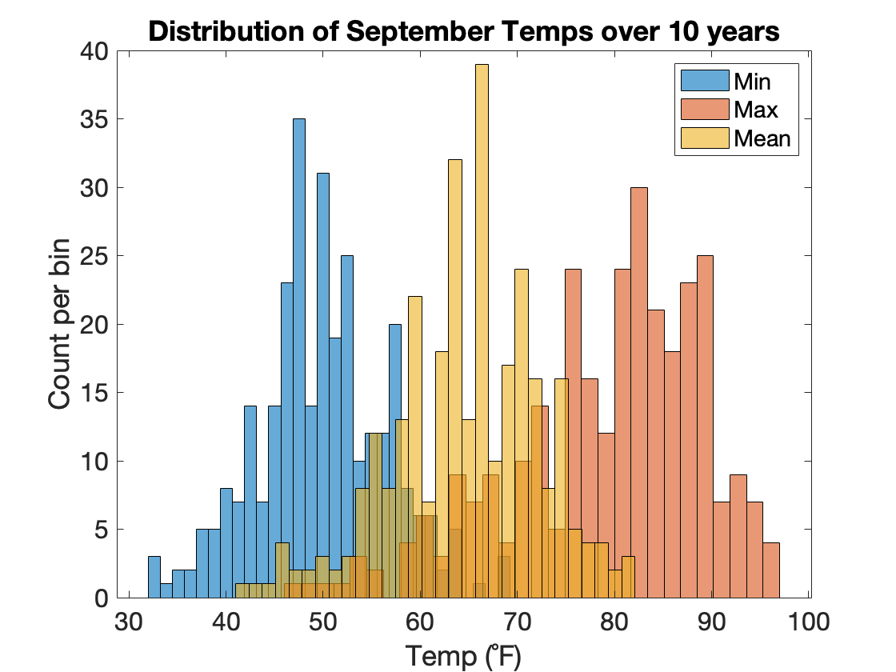{ width="400"}

## Swarm + Box Chart

Box plots visually summarize the statistics of a given dataset (median, range, and interquartile range), while Swarm Charts plot ALL the data points, typically in a shape that infers the summary statistics. Combining both charts is a great way to synergize the plots' respective advantages.

We can do so using the following syntax:

```matlab linenums="1" title="Swarm Box Chart overlay"
figure
hold on % hold can be turned on at any point in the syntax 

x = [ones(height(T),1); ones(height(T),1)+1]; % stack 1's atop of 2's
x = categorical(x, [1, 2], ["Min","Max"]); % typecast to categorical: Min=1, Max=2
y = [T.MinTemperatureF; T.MaxTemperatureF]; % stack min temps stacked on top of max temps into a column vector

swarmchart(x,y,...
"XJitterWidth",0.5,... % reduce jitter displacement along the x-axis
"MarkerFaceAlpha",0.1,... % marker face transparency
"MarkerFaceColor",'k',...% marker face color
"MarkerEdgeColor","k",...
"MarkerEdgeAlpha",0.15)

boxchart(x,y,'Notch',"on") % box plot
ylabel('Temp (˚F)')
```

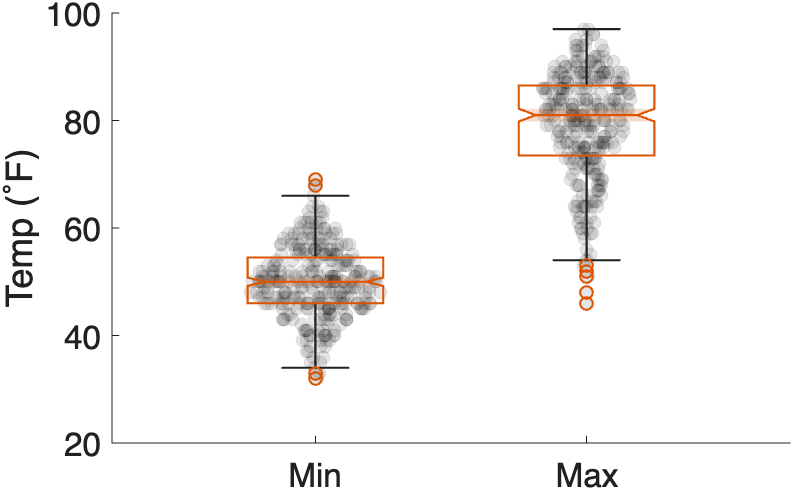{ width="450"}

>Now we can really get a sense of the distribution of the data across ten years.

The course function **`mmBoxSwarm`** simplifies creating these plots. The following syntax recreates the figure above.

```matlab
hc = mmBoxSwarm(x,y,...
XJitterWidth=0.5,...
MarkerFaceColor='k',...
MarkerFaceAlpha=0.1,...
Notch='on')
```

So, with just one function call, you easily overlay box plots and swarm charts.

## Overlaying Scatter Plots

Recall that a scatter plot allows you to visualize the relationship between two variables.

For example, the following shows the relationship between maximum and minimum temperatures on a given day in September over 10 years:

```matlab linenums="1" title="Scatter Plot of Min vs Max temps"
figure
x = T.MinTemperatureF;
y = T.MaxTemperatureF;
hs = scatter(x, y,[],'blue','filled',MarkerFaceAlpha=0.25); % default size, blue, filled, transparency of 0.25
xlabel('Min Temp(˚F)')
ylabel('Max Temp (˚F)')
title('Minimum vs Maximum temps in September')
```

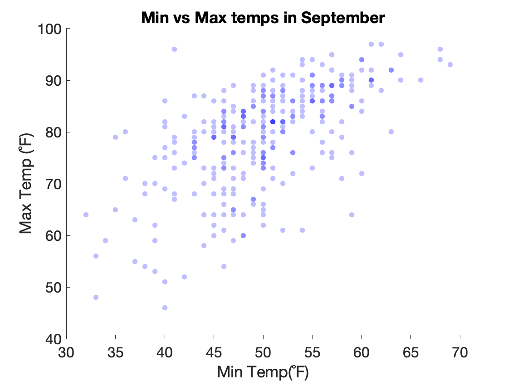{ width="400"}

>Note, since we turned on the transparency of the dots, we get different shaded dots. The darker shaded blue dots indicate that there is more than one dot at that location.

The rising trend of the scatter plot  suggests the temperatures are correlated. But are they correlated?

### Overlaying a Regression Line

The term correlation in statistics indicates an association between two variables. We can calculate the correlation between the two variables using the function **`corr`**, as follows:

```matlab linenums="1" title="Correlation between Min and Max Temps"
c = corr(x,y)
```

```matlab title="result"
c =

      0.61158
```

…And we get a correlation of 0.61. Since the value is positive, then our data is positively correlated. Since the value is greater than 0.5 but less than 0.7, our data can be considered "mildly correlated".

As our data is mildly correlated, we can calculate the linear regression of the data.  Linear regression is a mathematical model that we can use to predict one variable from the other. For example, we could use the linear regression to predict what the maximum temperature would be given a minimum temperature. It might not be a great prediction (since the data is only mildly correlated), but its a start. And once we calculate the linear regression we can plot a visualization of the model as a line overlaid on the scatter plot.

We calculate the linear regression and then plot it, as follows:

```matlab linenums="1" title="Calculate Linear Regression"
% calculate linear regression
p = polyfit(x,y,1); % simple linear regression
f = polyval(p,x); % calculate Max temps based on min temps from line

% add regression line to plot
hold on % turn on hold
plot(x,f,'--k',"LineWidth",1)
legend({'temperatures','linear fit'},"Location","best") % add legend
title('Night and Day', sprintf('Correlation = %1.2f',c)) % add a subtitle by adding a second input to title
```

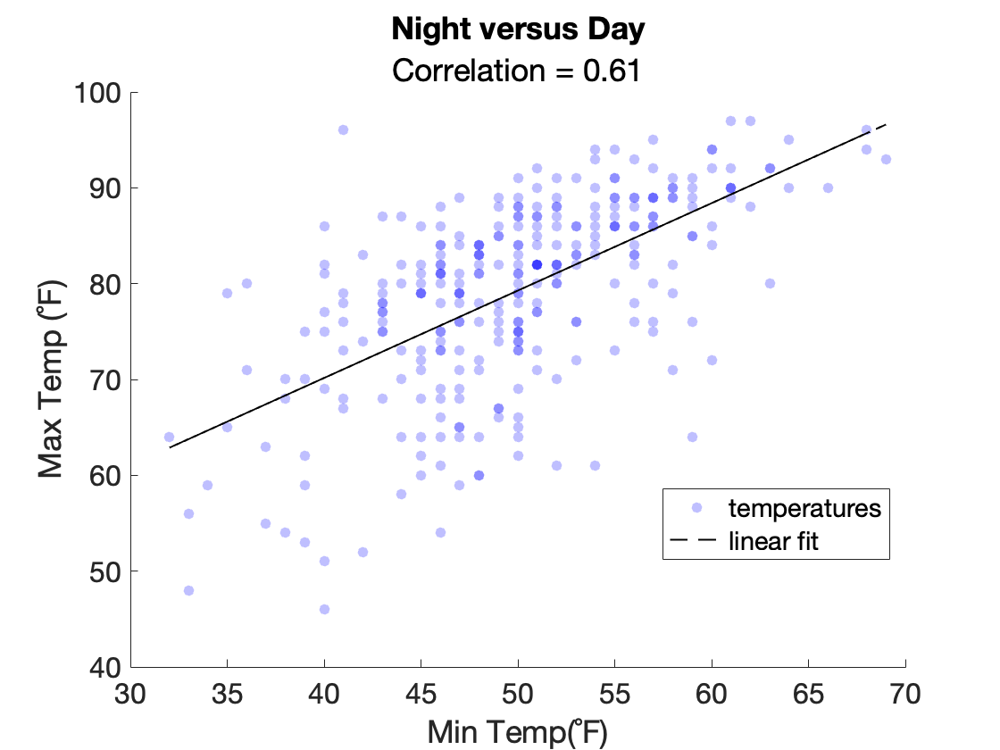{ width="400"}

>To add the regression line, we used the **plot** function. We had to turn hold on to make sure the plot function didn't overwrite the scatter plot. 

Notice that the regression line goes through the middle of the cloud and trends upwards. Dots that are closest to the line are best predicted by the model. Dots further away from the line are less well predicted. Warmer temperatures seem to be better predicted than cooler temperatures.

## Overlaying Multiple Scatter Plots

We can of course overlay multiple scatter plots. Here we'll add the Minimum Temperatures vs Mean Temperatures to our previous scatter plot. We'll also change the color of the second scatter plot so we can differentiate the two

```matlab
x = T.MinTemperatureF;
y = T.MaxTemperatureF;
hs = scatter(x, y,[],'blue','filled',MarkerFaceAlpha=0.25); % default size, blue, filled, transparency of 0.25
xlabel('Min Temp(˚F)')
ylabel('Max Temp (˚F)')


hold on % turn hold on

y = T.MeanTemperatureF; % set y to mean temps
scatter(x,y,[],'green','filled',MarkerFaceAlpha=0.25) % plot the min vs mean values
ylabel('Temp (˚F)') % relabel the y-axis to just 'Temp'
legend('Max','Mean',location="best") % add a legend to the axes
title('Temp Correlation - September') % update title
```

…Again, between the **scatter** function calles, we turn hold on. 

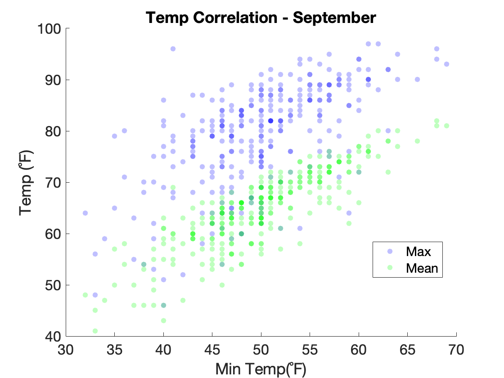{ width="400"}

>Now we have a new scatter plot (green) overlaid atop the previous scatter plot (blue). The new scatter plot represents the mean temps. These values have a similar relationship to the minimum temps as the maximum temperatures (mildly correlated).

## Tiled Layouts

Sometimes, you want to add several different axes to the same figure. The functions **`nexttile`** and **`subplot`** can do this for you.


To add plots, we simply enter the commands after each **`nexttile`** call.

Here we add the plots from above into three different tiles in the same figure

```matlab linenums="1" title="Flow Tiled Layout"
figure % create figure

% set x and y
x = T.MinTemperatureF;
y = T.MaxTemperatureF;

nexttile % create first tile
hs = scatter(x, y,[],'blue','filled',MarkerFaceAlpha=0.25); % default size, blue, filled, transparency of 0.25
xlabel('Min Temp(˚F)')
ylabel('Max Temp (˚F)')
title('Scatter')

nexttile % create second tile
histogram(x,30) % use 30 bins for Min temp
xlabel('Temp (˚F)')
ylabel('Count per bin')
title('Histogram')
hold on % turn on overlay
histogram(y,30) % Max Temp

nexttile % create third tile
y = [T.MinTemperatureF   T.MaxTemperatureF]; % create new two-column matrix of data
boxchart(y) % plot data as box plots
xticklabels({'Min' 'Max'}) % change the tick label from a number to a label
ylabel('Temperature (˚F)') % add a label to the y-axis
title('BoxChart')
```

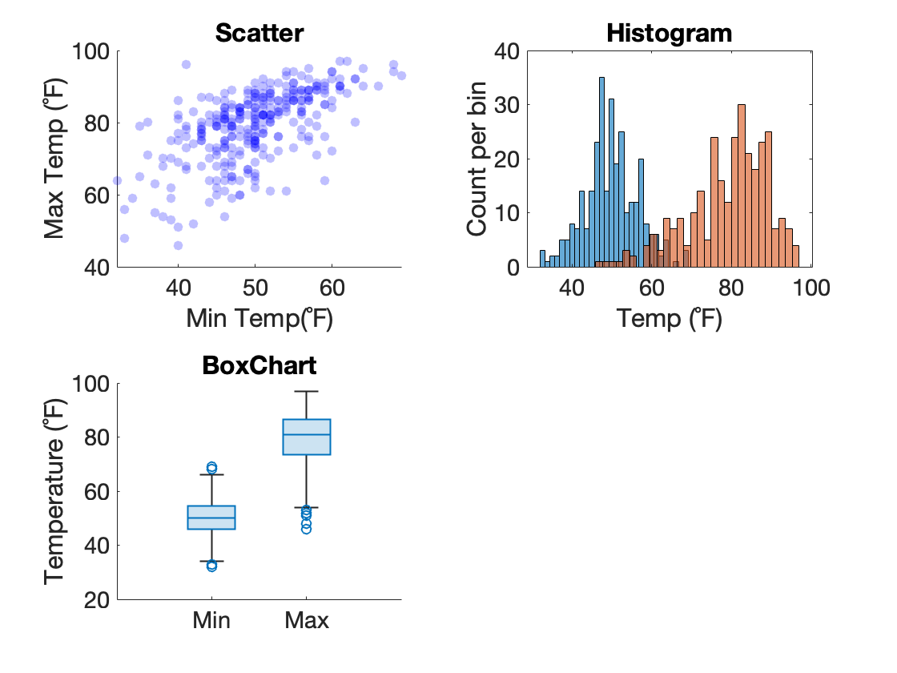{ width="400"}

>Here, after each **`nexttile`** function call, we simply insert the code from the previous examples above. **`nexttile`** automatically manages placing the tiles in the figure.

### tiledlayout

By default, **`nexttile`** plot tiles in an ever expanding grid of tiles, the organization of which depends on the dimensions of the figure. This is known as the "flow" layout. If you want more control of the organization of the tiles, you use the function **`tiledlayout`**, as follows:

```matlab linenums="1" title="Horizontal Tiled Layout"
figure % create figure
tiledlayout('horizontal') % set layout to 'horizontal'

% set x and y
x = T.MinTemperatureF;
y = T.MaxTemperatureF;

nexttile % first tile
% ⋮ the rest of the code is the same as above 
```

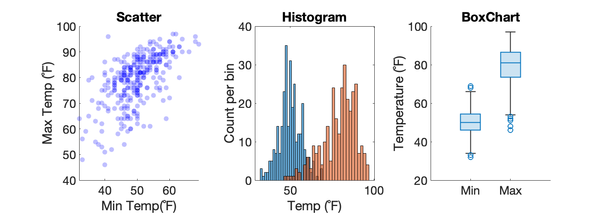{ width="600"}

>Notice that we add a function call to **`tiledlayout`** right after **`figure`**. And we only call **`tilelayout`** once. The rest of the code is the same, but now our tiles are organized horizontally.

If you want a vertical organization, then you would input 'vertical' into **`tilelayout`**. If you want to explicitly set the number of rows and columns, you would input the rows and columns, as follows:

```matlab linenums="1"
figure
tiledlayout(1,3) % 1 row, three columns
```

### subplot

**`subplot`** is the older, more fussy function used to divide a figure up into tiles. When you use **`subplot`**, you have to decide beforehand how many tiles you want and in what configuration. You should use **`nexttile`** unless you absolutely have to use **`subplot`**.

A function call to **`subplot`** looks like the following

```matlab linenums="1"
figure
subplot(1,3,1) % 1 row, 3 columns, 1st position
```

…This adds one tile at the first position in a 1X3 layout

To recreate the [above plot](#tiled-layouts) using subplot, we would use the following code:

```matlab linenums="1" title="subplot 1X3 Tiled Layout"
figure % create figure

% set x and y
x = T.MinTemperatureF;
y = T.MaxTemperatureF;

subplot(1,3,1) % create first tile, set first position
hs = scatter(x, y,[],'blue','filled',MarkerFaceAlpha=0.25); % default size, blue, filled, transparency of 0.25
xlabel('Min Temp(˚F)')
ylabel('Max Temp (˚F)')
title('Scatter')

subplot(1,3,2) % create second tile, set second position
histogram(x,30) % use 30 bins for Min temp
xlabel('Temp (˚F)')
ylabel('Count per bin')
title('Histogram')
hold on % turn on overlay
histogram(y,30) % Max Temp

subplot(1,3,2) % create third tile, set third position
y = [T.MinTemperatureF   T.MaxTemperatureF]; % create new two-column matrix of data
boxchart(y) % plot data as box plots
xticklabels({'Min' 'Max'}) % change the tick label from a number to a label
ylabel('Temperature (˚F)') % add a label to the y-axis
title('BoxChart')
```

…notice for each call to subplot, the first two inputs (1,3) are the same. These set the number of tiles and layout: 1 row, 3 columns. Only the third input changes. This sets the position, indicating where to create the tile (first, second, or third position, in this case).

!!! note "A note on position in subplot"
    Unlike index, position in subplot runs from left to right (row major). So, if you had a 3X3 layout of tiles, the first three position would be the top of tiles.

#### subplot Challenge

Consider the following call to **`subplot`**

```matlab linenums="1"
subplot(2,3,3)
```

??? question "What would be the tile layout? Where would the tile be created (row, col)?"
    This function call to **`subplot(2,3,3)`** would create a layout of 2 rows and 3 columns. The tile would be created in the second row, first column.
