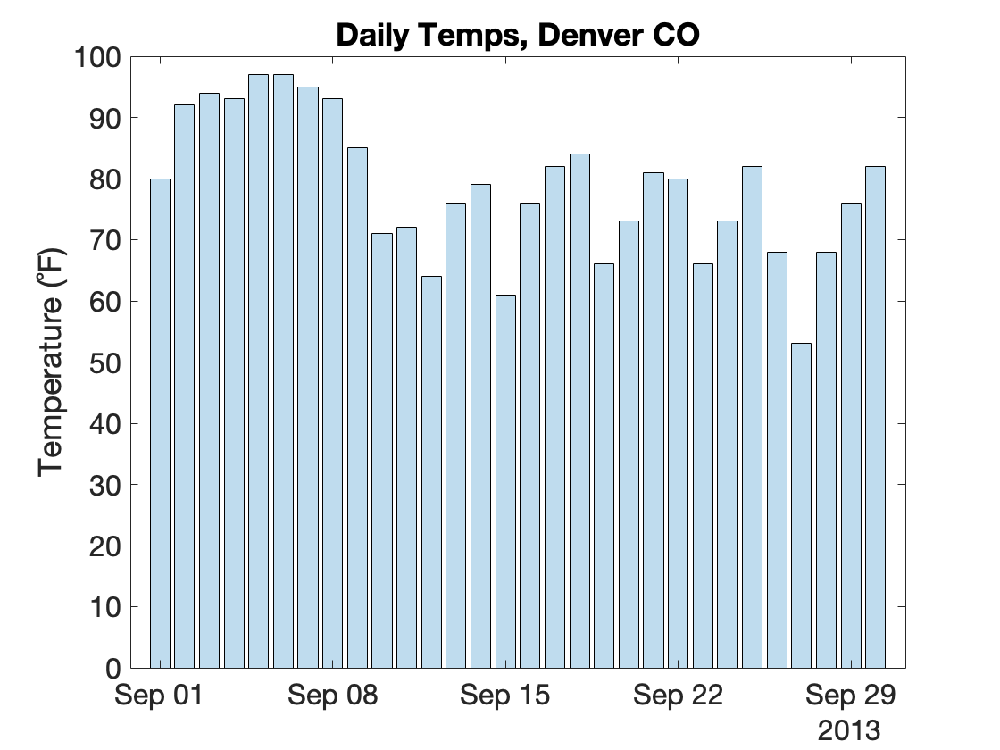

# Advanced Plotting: Overlays,Transparencies, and Tiling

!!! abstract "One plot is great. Multiple plots is even greater"

Often, you want to have have multiple plots added to the same axes or you want multiple axes added to the same figure. In this module, we'll talk about how to do this.

## Functions you Should know

- [**`hold`**](https://www.mathworks.com/help/matlab/ref/hold.html) - Retain current plot when adding new plots
- [**`nexttile`**](https://www.mathworks.com/help/matlab/ref/nexttile.html): add tiled axes to a figure
- [**`tiledlayout`**](https://www.mathworks.com/help/matlab/ref/tiledlayout.html): set the layout of the tiled axes in a tiled figure
- [**`bar`**](https://www.mathworks.com/help/matlab/ref/bar.html): create a bar plot
- [**`scatter`**](https://www.mathworks.com/help/matlab/ref/scatter.html): create a scatter plot
- [**`histogram`**](https://www.mathworks.com/help/matlab/ref/matlab.graphics.chart.primitive.histogram.html): create a histogram
- [**`boxchart`**](https://www.mathworks.com/help/matlab/ref/boxchart.html): create a box plot
- [**`title`**](https://www.mathworks.com/help/matlab/ref/title.html): add a title to the axes
- [**`xlim`**](https://www.mathworks.com/help/matlab/ref/xlim.html) and [**ylim**](https://www.mathworks.com/help/matlab/ref/ylim.html): set the x and y limits
- [**`xlabel`**](https://www.mathworks.com/help/matlab/ref/xlabel.html) and  [**ylabel**](https://www.mathworks.com/help/matlab/ref/ylabel.html): label the x and y axes
- [**`legend`**](https://www.mathworks.com/help/matlab/ref/legend.html): add legend to axes

## The power of hold

In MATLAB, plotting is destructive, by default . This means that calls to new plotting functions will overwrite any previous plots in the current axes. So, for example, if you execute the following…

```matlab linenums="1"
plot(x)
plot(y)
```

…you would be left with only the plot of *`y`*—the plot of *`x`* will be wiped out of existence.

If, instead, you want to add multiple plots to the same axes, which is a thing people totally do, you need to call the function **`hold`**.

Calling **`hold`** is very easy. You just enter following:

```matlab linenums="1" title="The function hold"
plot(x) % create first plot
hold on % turn hold on
plot(y) % add the y plot
```

If you want to go back to destruction, and stop overlaying graphs, enter the following:

```matlab linenums="1"
hold off % turn hold off
```

…and the hold will be turned off.

Ok, let's overlay some plots!

## Mix and Match

The nice thing about **`hold`** is that you can overlay different plotting functions.

### Load Weather Data

For this example, we will load the same weather data from 2013 that we used in the [previous module (Plotting Basics)](PlottingBasics.md).

```matlab linenums="1" title="Load Weather Data"
url = "https://saldenest.s3-us-west-2.amazonaws.com/anat6205_resources/UNIT_1/w2013.csv";
T = readtable(url)
```

Recall that this table contains historical weather information from Denver in September, 2013. We can plot the maximum temperatures as a box plot using the following syntax, as we did in the [previous module](PlottingBasics.md)

```matlab linenums="1" title="Bar Plot of Weather Data"
figure(Visible="on")
x = T.MDT; % dates
y = T.MaxTemperatureF; % maximum temperatures

% create bar plot
bar(x,y,FaceAlpha=0.75); % FaceAlpha determines the transparency

% label y-axis and title
ylabel("Temperature (˚F)")
title("Daily Temps, Denver CO")
```

{ width="400"}

We can then easily overlay the minimum temperatures as a box plot by adding the following lines of code:

```matlab
hold on % turn overlay on
y = T.MinTemperatureF; % grab the minimum temps and set to y
hb = bar(x,y,FaceAlpha=0.75); % bar plot minimum temps
```

{ width="400"}

>Since we are overlaying the second bar plot atop the bar plot already plotted, we don't have to relabel the y-axis and add the title. They are already there.

Finally, we can add a trend line of the mean temperatures using the **`plot`** function

```matlab
y = T.MeanTemperatureF;
plot(x,y,'k--',LineWidth=2) % plot dashed line
legend("Max","Mean","Mean",fontsize=10) % add legend
```

{ width="350"}

>Here we don't have to turn **`hold`** on. It stays on once set. We make the line black and dashed using the format specification `'k--'` at the 3rd input. We add the legend using the **`legend`** function and manually input the names for the legend.

And we finish with an information dense plot of maximum, minimum and mean temperatures in Denver, CO in the fall of 2013.

## Overlaying Histograms

### Load even More Data

For the next few examples, we will load ten years worth of Denver weather data. I have stored this data in a .CSV file (spreadsheet) in a remote file on an Amazon Server. To load this file, run the following in MATLAB

```matlab linenums="1" title="Import Table"
url="https://saldenest.s3-us-west-2.amazonaws.com/anat6205_resources/UNIT_1/weather_data_merged.csv"
T =readtable(url)
```

…This should load a 300X23 table into the table variable, *T*. Remember, each row in this table represents one day's worth of weather data. So, 300 rows would be 10 years of September data. Each column is a variable (or measurement), like Max or Min Temperature (for the day).

### Plotting the Histogram

As we saw in the previous module, histograms are used to display the distributions of frequency. For example, here is a histogram of the Minimum Temperatures in September over 10 years:

```matlab linenums="1" title="Histogram of Minimum Temperatures"
figure;
x = T.MinTemperatureF;
histogram(x,30) % use 30 bins
xlabel('Temp (˚F)')
ylabel('Count per bin')
title('Distribution of September Temps over 10 years')
```

{ width=400px}

>As we can see, a lot of low temps from 45-55˚C, and less low temps at 35˚C or 70˚C.

For comparison, let's add the maximum temperatures.

```matlab linenums="1" title="Overlay Maximum Temperatures"
hold on % turn on overlay
histogram(T.MaxTemperatureF,30)
legend("Min","Max") % add a plot legend
```

{ width="400"}

>And now we have overlaid the maximum temperatures over 10 years.

As you review the plot, notice that:

- MATLAB automatically rescaled the axis to fit the maximum data and changed the color of the overlaid histogram.
- We did not call the **`figure`** function again or **`title`**, **`ylabel`**, or **`xlabel`**. The figure, title, x-, and y-labels all stayed the same.
- We used the function **`legend`** to add a color legend to the plot.
- We used the same number of bins (30) in both histogram calls. This is important to ensure the plotted distributions look similar.

### Histogram challenge

??? question "How would you add the distribution of mean temperatures ('MeanTempF') to the axes above?"

    You can do this with one line of code:

    ```matlab
    histogram(T.MeanTemperatureF,30,DisplayName="mean")
    ```

    - Notice that we didn't need to call `hold on` again. Once it's on, it's on.
    - Also notice the third input into the function `DisplayName = "mean"`. This input is used to update the legend with an informative name (otherwise you would get something uninformative, like `data3`).
  
    { width="400"}

## Multiple Box Plots

Adding multiple box plots to the same axes works a little differently. Multiple Box PLots are typically presented side by side. One way to do this is to input a matrix (with multiple columns) into the **`boxchart`**. Each column of the matrix is added to the plot as a separate box plot. This of course only works if you have the same number of data points for each column, as we have in our table.

Let's plot the Min and Max Temperatures as box plots in the same figure:

```matlab linenums="1" title="Multiple Box Plots in same Axes"
figure % create a new figure
y = [T.MinTemperatureF   T.MaxTemperatureF]; % create two-column matrix of data
boxchart(y) % plot data as box plots
xticklabels({'Min' 'Max'}) % change the tick label from a number to a label
ylabel('Temperature (˚F)') % add a label to the y-axis
```

{ width="400"}

>Here we show the box plots of the Minimum and Maximum temperatures. The boxes indicate the interquartile range, while the line inside the box indicates the median. The whiskers indicate the range of data, while the circles indicate outlier data.

??? question "How would you add a box of mean temperatures ('MeanTempF') to the axes above?"

    You would need to modify the y-input:

    ```matlab
    y = [T.MinTemperatureF T.MeanTemperatureF T.MaxTemperatureF]; % create three-column matrix of data
    boxchart(y) % plot data as box plots
    xticklabels({'Min' 'Mean' 'Max'}) % add 'Mean' as a tick label
    ylabel('Temperature (˚F)') % add a label to the y-axis
    ```

    - Notice that we had to re-run all of the code
    - Also notice that we had to update *`y`* and the **`xticklabels`**
  
    { width="400"}

## Overlaying Scatter Plots

Recall that a scatter plot allows you to visualize the relationship between two variables.

For example, the following shows the relationship between maximum and minimum temperatures on a given day in September over 10 years:

```matlab linenums="1" title="Scatter Plot of Min vs Max temps"
figure
x = T.MinTemperatureF;
y = T.MaxTemperatureF;
hs = scatter(x, y,[],'blue','filled',MarkerFaceAlpha=0.25); % default size, blue, filled, transparency of 0.25
xlabel('Min Temp(˚F)')
ylabel('Max Temp (˚F)')
title('Minimum vs Maximum temps in September')
```

{ width="400"}

>Note, since we turned on the transparency of the dots, we get different shaded dots. The darker shaded blue dots indicate that there is more than one dot at that location.

The rising trend of the scatter plot  suggests the temperatures are correlated.

For comparison, lets plot Minimum Temperatures vs Mean Temperatures.  But, if we just called **`scatter`** again, we would overwrite the previous scatter plot. So first, we set **`hold`** to `'on'` and then we call **`scatter`**, as follows:

```matlab
hold on % turn hold on
y = T.MeanTemperatureF; % set y to mean temps
scatter(x,y,[],'green','filled',MarkerFaceAlpha=0.25) % plot the min vs mean values
ylabel('Temp (˚F)') % relabel the y-axis to just 'Temp'
legend('Max','Mean',location="best") % add a legend to the axes
title('Temp Correlation - September') % update title
```

{ width="400"}

>Now we have a new scatter plot (green) overlaid atop the previous scatter plot (blue). The new scatter plot represents the mean temps. These values have a similar relationship to the minimum temps as the maximum temperatures (mildly correlated).

## Tiled Layouts

### nexttile

Sometimes, you want to add several different axes to the same figure.

The function **`nexttile`** simplifies the process. It is very easy to use **`nexttile`**.

```matlab linenums="1" title="nexttile - One tile"
figure
nexttile
```

{ width="250"}

This is just like calling **`axes`**.

If we call **`nexttile`** two more times…

```matlab linenums="1" title="nexttile - Three tiles"
nexttile
nexttile
```

{ width="250"}

…We get two more axes added to the figure, nicely organized.

To add plots, we simply enter the commands after each **`nexttile`** call.

Here we add the plots from above into three different tiles in the same figure

```matlab linenums="1" title="Flow Tiled Layout"
figure % create figure

% set x and y
x = T.MinTemperatureF;
y = T.MaxTemperatureF;

nexttile % create first tile
hs = scatter(x, y,[],'blue','filled',MarkerFaceAlpha=0.25); % default size, blue, filled, transparency of 0.25
xlabel('Min Temp(˚F)')
ylabel('Max Temp (˚F)')
title('Scatter')

nexttile % create second tile
histogram(x,30) % use 30 bins for Min temp
xlabel('Temp (˚F)')
ylabel('Count per bin')
title('Histogram')
hold on % turn on overlay
histogram(y,30) % Max Temp

nexttile % create third tile
y = [T.MinTemperatureF   T.MaxTemperatureF]; % create new two-column matrix of data
boxchart(y) % plot data as box plots
xticklabels({'Min' 'Max'}) % change the tick label from a number to a label
ylabel('Temperature (˚F)') % add a label to the y-axis
title('BoxChart')
```

{ width="400"}

>Here, after each **`nexttile`** function call, we simply insert the code from the previous examples above. **`nexttile`** automatically manages placing the tiles in the figure.

### tiledlayout

By default, **`nexttile`** plot tiles in an ever expanding grid of tiles, the organization of which depends on the dimensions of the figure. This is known as the "flow" layout. If you want more control of the organization of the tiles, you use the function **`tiledlayout`**, as follows:

```matlab linenums="1" title="Horizontal Tiled Layout"
figure % create figure
tiledlayout('horizontal') % set layout to 'horizontal'

% set x and y
x = T.MinTemperatureF;
y = T.MaxTemperatureF;

nexttile % first tile
% ⋮ the rest of the code is the same as above 
```

{ width="600"}

>Notice that we add a function call to **`tiledlayout`** right after **`figure`**. And we only call **`tilelayout`** once. The rest of the code is the same, but now our tiles are organized horizontally.

If you want a vertical organization, then you would input 'vertical' into **`tilelayout`**. If you want to explicitly set the number of rows and columns, you would input the rows and columns, as follows:

```matlab linenums="1"
figure
tiledlayout(1,3) % 1 row, three columns
```