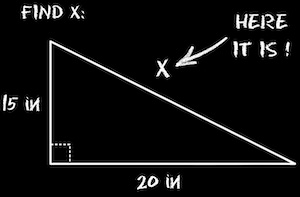
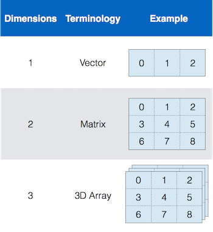

# Variables

!!! abstract "*for storing data*"

## Module Overview

Ok, so we're going to be storing data as we muddle through programming. But where are we going to store this data?

In Variables.

Variables are what we will use to store  data. And files. But mostly variables. So, most of what you will be doing as you learn programming is adding data to variables and then doing stuff with that data (see the Function Overview).

In this module, we explore the properties of variables.

### Stuff You Should Know

After completing this **Module**, you should be able to:

* Define Data structure and array

* Describe the difference between a Matrix, an Array, and a Vector

* Explain variable Indexing and compare the difference between linear and standard indexing

* Define Data Type and list the fundamental MATLAB classes

### Useful-ish MATLAB Documentation

- [Create and Edit Variables](https://www.mathworks.com/help/matlab/matlab_env/create-and-edit-variables.html)

### Terms You Should Know

* [Variable][wiki_variables]: a named location where you can store data.  

* [Data Structure][wiki_data_structure]: a particular way of storing and organizing data in a variable

* [Data Type][wiki_data_type]: a variable classification that determines the types of values that are allowed to be stored in the variable

* [Array][wiki_array]: a simple type of data structure consisting of a collection of *elements* (values or variables). Each element can be identified by an index.

* Index. An addressing system used to pull data out of an array. The main types of indexes include Standard, Linear, and Logical Indexing.

* Vector: A one-dimensional array of numbers (a single row or column of numbers)

* Matrix:  A two-dimensional, rectangular array of numbers. The basic format of a MATLAB Variable. All MATLAB variables are arrays (think spreadsheet)

* [Syntax][wiki_syntax]: the precise coding language of a computer program.

[wiki_data_structure]: http://en.wikipedia.org/wiki/Data_structure

[wiki_variables]: http://en.wikipedia.org/wiki/Variable_(computer_science)

[wiki_array]: http://en.wikipedia.org/wiki/Array_data_structure

[wiki_syntax]: http://en.wikipedia.org/wiki/Syntax_(programming_languages)

[wiki_data_type]: https://en.wikipedia.org/wiki/Data_type

## So, What is a Variable?

<!--
<figure markdown="span">
  { width="300" }
  <figcaption>In math, a variable is a symbol that represents a quantity in a mathematical expression.</figcaption>
</figure>
-->

{ width="250"}

In computer programming, [variables][wiki_variables] are storage locations where you can store stuff (data). As we discussed earlier, this data can be numbers, letters, words, or even a whole set of instructions designed to deal with other stored data.

Variables have names, such as 'A' or 'apple', and their stored data can be changed (hence the term "variable").

Variables are fundamental components of programming. When we program, we mostly create or assign data to variables and then manipulate the data using step-by-step procedures (known as algorithms or functions).

The MATLAB syntax used to store data in a variable looks like this:

```matlab
variable_name = data
```

Notice that the variable name is located on the LEFT side of the equal sign and the data is located on the RIGHT side of the equal sign. Data flows from RIGHT to LEFT.

## What Is a Data Structure?

A data structure describes how the data is organized in a variable.

There are many different **[data structures][wiki_data_structure]**, but the main one that we will deal with is the array.

### Arrays

The simplest data structure is an array. Think of an array as a series of little boxes 📦 📦 📦. Each of these boxes is known as an ***element***. And all of the little boxes in an array are organized so that they have a specific location (box 1, box 2, box 3). This location is called its **index**. So, *box 1* has *index 1*, *box 2* has index 2, etc.

Arrays of different sizes have different names:

* **Scalar:** an array with just one element (and one value)
* **Vector:** a row or column of elements
* **Matrix:** a two-dimensional, rectangularly shaped array capable of storing multiple elements of data in an easily accessible format. This is the fundamental MATLAB data structure (See [Creating Matrices](http://www.mathworks.com/help/matlab/math/creating-and-concatenating-matrices.html?searchHighlight=creating+and+concatenating+matrices)). Think of what a spreadsheet looks like, and you have an idea of what a matrix is. All of the data that you enter into MATLAB is stored in the form of this multidimensional type of array. MATLAB puts the MAT in matrices.

<!---->



## What Is Indexing?

Indexing is an address system that points to elements in an array and allows you to access the data contained within.

In a matrix, each element can be referenced by its [index][MATLAB_index]. To make things a little more exciting, MATLAB uses multiple, different indexing systems. Here, we describe two of these indexing systems: **standard** or **linear indexing**.

![Indexing Systems][indexing_scheme]

[indexing_scheme]: images/indexing_schemes.png

On the left is the **[linear indexing][MATLAB_index]** system, which uses **[COLUMN MAJOR](http://www.wikiwand.com/en/Row-major_order)** indexing. In column-major order, each element is numbered down each column first, before moving to the next column. So, to refer to the element in row 2, column 2, you simply use the index number 5. On the right is the **[standard indexing][MATLAB_index]** system, which has the following syntax: (row, column). In this scheme, the left number indicates the row and the right number indicates the column. To refer to the element in row 2, column 2, you would use the following syntax: (2,2). These two indexing schemes can be used interchangeably in MATLAB.

[MATLAB_index]: http://www.mathworks.com/help/matlab/math/matrix-indexing.html

The MATLAB syntax for indexing looks like this

```matlab
variable_name(row,col) % standard indexing
variable_name(index) % linear indexing
```

This syntax returns the data contained in the elements of the array. You can think of this a little like the array of mailboxes you can find at your local post office. Each mailbox has a number on it, and the numbers are typically arrayed in some sort of sequential order. Opening one mailbox to access the contents is equivalent to indexing an element in this example.

## What is a Data Type?

As discussed on the Data Overview page, we will primarily be storing three basic data types: Numbers, letters, and booleans. Also as previously discussed, computers are kind of dumb. And, to store these basic data types, you have to explicitly tell the software, "Hey, I need to store a number (or a character or a logical)." The way that we tell the software that we want to store one of these data types is through syntax. See the [Array Assignment page](ArrayAssignmentOverview.md) for more details on the basic syntax we will use to indicate data type.

To store these different data types, you need specialized variables. This specialization is known as a **`class`**. Each class has rules on what it can be used to store. For example, there is a class that can only store numbers, another that can only store characters and another that can only store booleans. These basic classes are labeled as:

- numeric
- character
- logical

There are more classes (technically, there are [17 different classes](https://www.mathworks.com/help/matlab/matlab_prog/fundamental-matlab-classes.html)), but we are going to start with these basic classes.

A data type simply indicates what kind of data that variable can store, like Numbers, Characters, or True or Falses? In MATLAB, just to be tricky, a data type is also known as a [Data Class][fund_data_class].

These classes have reserved names, as shown in this diagram:

![Data Class Types][img_fund_class]

[img_fund_class]: images/matlab_fundamental_classes.png

In this course, we will learn about the following [MATLAB classes][fund_data_class]:

| Class Name | Intended Use |  
| :----------- | :-----------|  
| [numeric](https://www.mathworks.com/help/matlab/numeric-types.html?s_tid=CRUX_lftnav)| numbers|  
| [char](http://www.mathworks.com/help/matlab/ref/char.html)| characters|  
| [string](https://www.mathworks.com/help/matlab/ref/string.html)| strings (eg words)|  
| [cell](http://www.mathworks.com/help/matlab/ref/cell.html)| complex content|  
| [struct](http://www.mathworks.com/help/matlab/ref/struct.html)| hierarchal data|  
| [logical](http://www.mathworks.com/help/matlab/ref/logical.html)| boolean (true / false) data|  
| [table](http://www.mathworks.com/help/matlab/ref/table.html)| Complex Spreadsheet type data|  

To make things even worse, the *numeric* class actually comprises several subclasses with cryptic names like *double* or *uint16*. These numeric subclasses are used to store different *kinds* of numbers, like Whole Numbers (integers) vs Numbers With Decimal Points (Floating-Point Numbers).

Here are some words you probably don't understand yet:

* **Floating-Point Number Classes**: single, double (the default numeric class)

* **Integer Classes:**  int8, uint8, int16, uint16, int32, uint32, int64, uint64

Don't worry, we'll get to what this all means in later modules, but basically, a variable's numeric class affects the minimum and maximum numbers that can be stored in that variable. It also determines whether the number can have a negative value, or just be positive.

[fund_data_class]: http://www.mathworks.com/help/matlab/matlab_prog/fundamental-matlab-classes.html
