# Exploring the MATLAB desktop

!!! abstract "A quick overview of the MATLAB desktop"

## Command Window

The command window is the area in MATLAB where you can type  MATLAB code and have it immediately execute. Try it now.

Enter the following in the command window:

```matlab linenums="1"
a = 1
```

After you hit enter, you get a response from MATLAB, as follows

```matlab title="result"
a =

     1
```

…This tells you what MATLAB did. This assigns the value `1` to the variable *`a`*.  

## Workspace

The workspace helps you keep track of the variables you have assigned, in a table format. In the previous example, we created the variable *`a`*. This variable is now listed in the workspace.

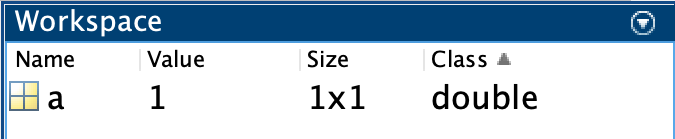{width=400px}

Notice:

- There is one row in the Workspace
- There is information like the name of the variable (a), its value, the size, number of bytes, and class

To modify what is shown in the workspace, you can add or remove columns in the table by clicking on the upside triangle in the Workspace header to bring up the  contextual menu. Under the "Choose Columns" submenu, select the following:

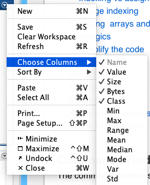

## Variable Editor

Double-clicking on a variable in the workspace brings up the Variable Editor. Here, you can edit or copy variable content as if you were using a spreadsheet editor

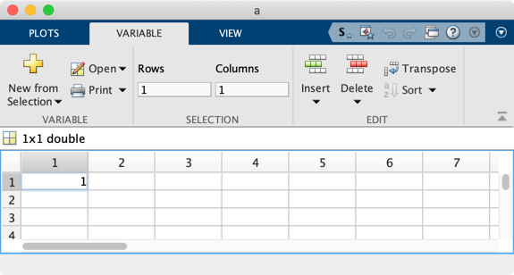

## Ribbon Interface

MATLAB has a context-sensitive toolbar called the ribbon interface

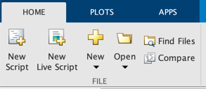

- We will often refer to this interface.
- Notice in the image above that we have the Home tab selected

## Current Folder

At launch, MATLAB opens a folder on your hard drive. You can see a reference to this folder just below the ribbon strip, in the address bar:


- Here, this  indicates the MATLAB drive.
- You may see something along the lines of ~/Documents/Folder which points to a location on your hard drive

### MATLAB Drive

We will use the MATLAB Drive to store course files.

The Current Folder Window displays the contents of the current folder

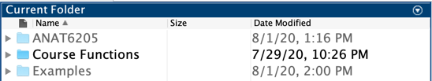

- You can change which columns are shown in this window by clicking on the upside down triangle to bring up the contextual menu
- Notice as you navigate to other folders, the contents displayed changes

## Documentation

You can bring up the MATLAB documentation in several ways.

1. You can enter a search term in the search bar (top right corner)


2. Or You can click on the ? icon (which you can find next to the search bar or in the Home tab in the ribbon strip)

3. Or, you can type doc in the command window

```matlab linenums="1" title="Get Help"
doc
```

<!--### Course Documentation

If you installed MATLAB drive correctly, and you added the Course Functions folder to the file path, you should find the Course Documentation on the home page of the Documentation, under supplemental software

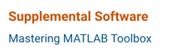

Click on that link will allow to browse the course documentation. If you search, you can restrict your search to the course documentation.

You can also search the course documentation. Try it now.

Or, you could try running this code

```matlab
web(fullfile(docroot, '3ptoolbox/masteringmatlabtoolbox/doc/CourseOverview.html'))
```

-  notice the link contains the term '3ptoolbox' : this means third\-party toolbox -->

## Important Preferences

The following settings that can improve the performance of MATLAB for certain tasks, especially later in the semester. Let's set them now, before we forget.

### Java Heap Memory

1. Click on the Home Tab 
2. Select the preferences icon: 
3. Under General: Java Heap memory, drag the slider all the way to the right

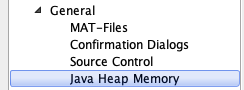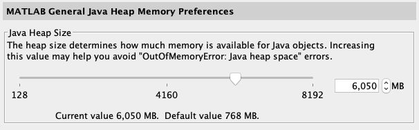

### Image Processing Toolbox settings

Use these settings

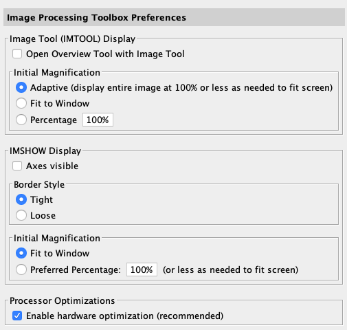

## Live Scripts

MATLAB [live scripts](https://www.mathworks.com/help/matlab/matlab_prog/what-is-a-live-script-or-function.html) are interactive documents that combine MATLAB code with formatted text. These scripts are organized into sections called Code Sections. Each Section runs independently from the other Sections. You select a section by simply clicking inside that block. Once selected, the section is outlined by blue (as opposed to light gray).

## Code blocks

Code blocks contain lines of MATLAB code, such as the following.

```matlab linenums="1"
clearvars
clc
disp('cleared')
```

## Output location

After you execute the code in a section, you should see some output as you would in the command window. The location of this output can either be below the code block or to the right of the code block. This position is controlled by the pair of buttons on the top right side of the live script that looks like this:

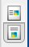

If you hover over these buttons, you will see a tooltip string that states its function: "Show outputs on right" or "Show outputs inline".

## Display Line Numbers

Under the **View** tab, you can select to display Line Numbers and Datatips. Do so now.

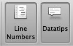

## Code Pause

In your script,  each line of code in the code block will have a line number. If you click on the number, it will become highlighted in blue as shown here:


This will freeze code execution at that location and interfere with your coding.   If you have accidentally highlighted a number blue, simply click on the number again and the blue highlight will disappear, unfreezing execution of the code.

## Debugging controls

If you have a line number highlighted and execute the code block, you will enter debugging mode, which means that you manually have to advance the execution yourself.

In the Live Editor tool strip, there are three buttons you can press: Continue, Step, Stop


- Continue or Step will execute the paused  line of code 
- Clicking on the Stop Icon will stop the code without executing the paused line.  

## Comments

Sometimes you want to add a comment along with your code. The special character % indicates the start of a comment. Comments appear as green text

```matlab
a = 1 % This is a comment
```

…notice that the comment is not executed.

## Clear all

Clear your workspace and the command window by executing following commands:

```matlab linenums="1"
clearvars
clc 
```

Your variables are now gone! Don't worry, we'll make more.

## Games and Stuff

Ok, break time. The following commands bring up hidden easter eggs in MATLAB. Try them all by copying and pasting the following commands in the command line.

```matlab title="Play Sliding Puzzle" linenums="1"
fifteen
```

```matlab title="Play Mine Sweeper" linenums="1"
xpbombs
```

```matlab linenums="1" title="Plot a 3D Knot"
knot
```

!!! example "Plot a Heart"
    Copy and paste all three lines into the command line:

    ```matlab linenums="1"
    x=[-2:.001:2],y=(sqrt(cos(x)).*cos(200*x)+sqrt(abs(x))-0.7).*(4-x.*x).^0.01
    figure;
    plot(x,y);
    ```

!!! example "Answers to Life's most pressing question"
    ```matlab linenums="1"
    why
    ```
    Be sure to run this command multiple times.
    