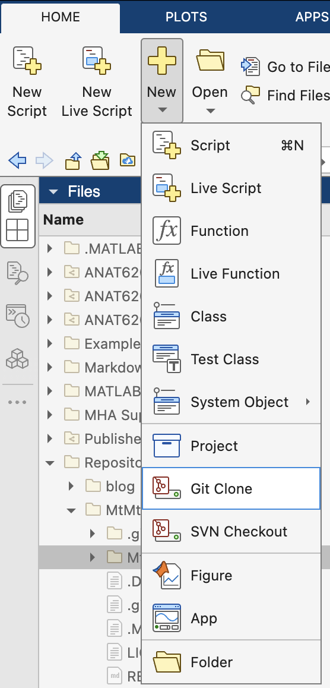
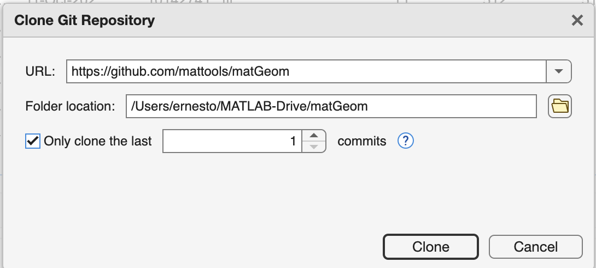
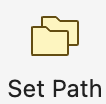
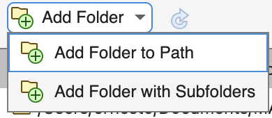
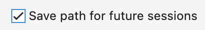

# Github Repositories

Github is an online sharing and collaboration tool for software and other files. We'll use it primarily as a site where you can download additional toolboxes for MATLAB. A GitHub **repository**, or repo, is an online folder, typically with many subfolders and files. Different software is stored in different repos. These repos are synced with the developers' computers, so they always contain the latest version of the software. It's not just software files; for example, the files that make up this MTM documentation site are all stored in this [GitHub repository](https://github.com/salcedoe/MtMdocs).

## Github repositories we'll be using

The following are all add-on toolboxes for MATLAB:

- [MtMtoolbox](https://github.com/salcedoe/MtMtools/tree/main/toolbox) - A companion set of functions and scripts for use with the MtM documentation
- [matGeom](https://github.com/mattools/matGeom) - a library for geometry processing / geometric computing with MATLAB in 2D and 3D
- bfmatlab - [Bio-formats](https://www.openmicroscopy.org/bio-formats/) toolbox to open Proprietary Microscope Image Formats and metadata. This toolbox is included in the MtMtools repository.

## Installation (cloning)

We will add clones (copies) of these repositories to our MATLAB drive using the following steps.

### Easy Clone MTM Tools

The MtM Tools repository comes with an easy-install button:

- The link will open the repository in MATLAB online
- Make sure that you are logged into your online Mathworks Account
- Clone the Repository when asked
- Notice that the MtMtools repo contains a copy of the [bfmatlab](https://github.com/ome/bioformats/releases)  toolbox

### Add matGeom using MATLAB

Do this step for the matGeom repo.

1. Fire up MATLAB  
2. In the Home tab, Select "New:Git Clone"  
3. Enter the URL of the repo in the pop-up dialog: `https://github.com/mattools/matGeom`
4. Make sure the Folder Location is in the MATLAB drive.
5. Only clone the last `1` commit. This ensures that you download only the latest version of the toolbox, saving time and storage space. In MATLAB, you can specify this option in the "Clone" dialog by selecting the "Advanced Options" and setting the "Depth" to `1`.
6. Click on "Clone"  
7. The matGeom folder should appear in the MATLAB Drive  

{ width="250"} { width="450"}

## Add Toolboxes to MATLAB Search Path

For MATLAB to actually use these toolboxes, we need to tell MATLAB about them, which means add the folder paths to the MATLAB search path.

1. In the MATLAB Home tab, click on the 'Set Path' icon in the Home tab  { width="45"}
2. In the "Set Path" Dialog, select the "Add Folder to Path" from the "Add Folder" menu
   { width="200"}
3. Select the toolbox folder
   1. repeat steps 2-3 for all toolboxes (folders listed below)
4. At the bottom of the set path dialog, ensure the "Save path for future sessions" checkbox is selected
   { width="200"}
5. Click "Ok"

Toolbox folders to add to the Search Path

- **MtM tools**: `MtMtools/MtMtoolbox`
- **bfmatlab** `MtMtools/bfmatlab`
- **matGeom**: `matGeom/matGeom`
