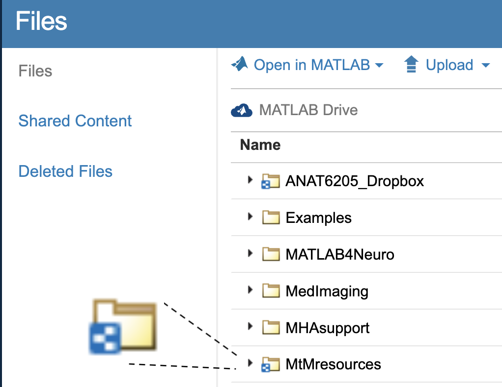
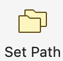
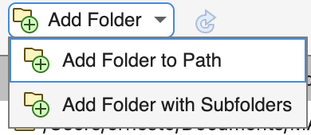

# Installing MATLAB

The University of Colorado has a [site license][Site_license] for MATLAB. Follow the instructions for installing MATLAB using the CU Anschutz site license [here][Site_license]. Be sure to use the instructions **specific to students** and be sure to use your CU Anschutz email.

!!! note "If you're not at CU Anschutz"

    If you are not a student at CU Anschutz, check if your university offers a site license for MATLAB. Alternatively, Mathworks offers a free [online version of MATLAB](https://www.mathworks.com/products/matlab-online.html). This free version should work for most of the example code documented on this site. MATLAB also offers [reasonably priced](https://www.mathworks.com/pricing-licensing.html?prodcode=ML&intendeduse=student) licenses for students or for home use.

[Site_license]: https://olucdenver.sharepoint.com/matlab/Pages/default.aspx

## Important Caveats Before Installing

You **do not** need to install **all** of the MATLAB toolboxes included with the site license. Installing them all will consume a lot of storage on your computer. If you are interested in saving space on your computer, only install the following:

- MATLAB (LATEST VERSION - should have the current year's date in the name)
- [Computer Vision Toolbox](https://www.mathworks.com/products/computer-vision.html)
- [Image Processing Toolbox](https://www.mathworks.com/help/images/index.html)
- [Medical Imaging Toolbox](https://www.mathworks.com/help/medical-imaging/index.html)
- [Parallel Computing Toolbox](https://www.mathworks.com/products/parallel-computing.html)
- [Statistics and Machine Learning Toolbox](https://www.mathworks.com/products/statistics.html)

If you don't care about space on your computer, then feel free to install everything.

If you have previously installed MATLAB on your computer, upgrade it to the latest version. Each iteration improves upon the previous version and this course is continually updated to take advantage of the latest improvements. Upgrading typically means installing a whole new version on your computer (and leaving the old version intact). Feel free to delete the old version once the new version is installed and is working.

If you have already run the installer and did not install one of these toolboxes or if you installed too many toolboxes, you can add (or remove) toolboxes using the Add-on Manager from within MATLAB. To launch the Add-on manager, navigate to the MATLAB home tab and click on the Add-Ons icon (3 colored stacked cubes).

## Installing the MATLAB Drive Connector

MATLAB Drive is a free cloud drive similar to Dropbox or Google Drive, but optimized to share MATLAB scripts and functions. Follow the instructions [here](https://www.mathworks.com/products/matlab-drive.html) to install the MATLAB Drive Connector app on your computer. Once installed, there will be a local folder on your computer called MATLAB Drive, which will sync with the Mathworks Cloud servers.

The MATLAB Connector is an additional application that you install on your computer. The main job of this application is to sync an online folder to a folder on your computer. Syncing can sometimes take time, especially if there are a lot of files that need to be copied. You can keep track of the sync status by bringing up the MATLAB Connector window. Depending on whether you have a Mac or a PC, there should be a little icon (with the MATLAB logo on it) that you can click on in the menu bar (or Windows taskbar) that shows you the current sync status.

If you encounter issues with syncing, ensure that your internet connection is stable, and try restarting the MATLAB Connector application. If the problem persists, consult the [MATLAB Drive troubleshooting guide](https://www.mathworks.com/help/matlabdrive/ug/troubleshooting.html).

 { width="450"}

- The Globe icon will open your web browser and take you to the online site
- The Folder icon will take you to the local location on your computer where the files are synced
- The gear icon brings up some preferences

## Add Shared MATLAB Folders

Now that you have installed MATLAB Drive, you will want to add the shared course folder to your drive. This folder, called **MtMresources**, contains example data files and images. Click on this [shared folder link](https://drive.mathworks.com/sharing/36f2e302-384d-4c4e-aa98-8e853c1051c0){target="_blank"} to add the folder to your MATLAB drive.

!!! note "Unit Folders"

    Any reference to "unit" folders in the documentation is referencing this shared folder. For example the "unit1" data folder is found in `matlabdrive/MtMresources/data/unit1`. The course function `mmSetUnitDataFolder` sets the current folder to indicated unit number. For example `mmSetUnitDataFolder(3)` sets the current folder to the unit3 data folder.

<!-- You should have received an invitation to the shared MATLAB Drive folders. In the email, there should be a link that brings you to your MATLAB drive. If you have not received an email, please check your junk folder or contact the course director. -->

You can find the shared MATLAB folders in the online version of MATLAB Drive, provided that you have logged in with your university account. To view pending invitations in MATLAB Drive online, click Shared Content on the left side of the page.

{ width="650"}

Click on **"Add Shortcut"**. This will create a shortcut to the shared folder, and the contents will stay in sync with the contents in the original folder. The files found in these folders are read-only. If you would like to modify the files, you will have to make a copy of the files and store them somewhere else on your computer or in another folder on the MATLAB drive.

!!! warning "Did you do it right?"
    Click over to the files tab in MATLAB drive
    
    { width="450"}

    You should see a list of folders in your drive. In the above example, there are four folders that have a simple yellow folder icon, and two folders that have an icon with a small, square, blue-and-white badge overlay. This badge indicates that the folder is being shared as a shortcut, and the contents will automatically update with any updates to the original folder.

    Make sure that your MtMresources folder icon has the blue-and-white badge. Otherwise, try again.

### Review MATLAB Drive

Review the contents of `MtMresources` folder in your MATLAB drive.

The folder should contain three sub-folders, as follows:

```text
├── MtMresources
│   ├── data
│   │   ├── unit1
│   │   ├── unit2
│   │   ├── unit3
│   │   └── unit4
│   ├── scripts
│   └── toolbox
```

- **data:** contains all the data, like spreadsheets and images, that we will be inspecting throughout the course. Notice there is a folder for each Unit in the course.
- **scripts:** will contain the completed scripts that we work on in class
- **toolbox:** contains the course functions used in the course

## Add Toolboxes to the MATLAB Search Path

!!! abstract "What's a Path?"
    A path is like an address that tells the computer where to find a file or folder.

The MATLAB search path is a collection of paths that tells MATLAB where on your computer to look for files and functions.

To use the MtMresources functions found in the toolbox folder, we need to tell MATLAB where these functions are located. That means adding the folder to the MATLAB search path. To do so, use the following steps:

1. In the MATLAB Home tab, click on the "Set Path" icon  { width="45"}
2. In the "Set Path" Dialog, select "Add Folder to Path" from the "Add Folder" menu
   { width="200"}
3. Select the toolbox folder:  `MtMresources/toolbox`
4. At the bottom of the set path dialog, ensure the "Save path for future sessions" checkbox is selected
   { width="200"}
5. Click "Ok"
