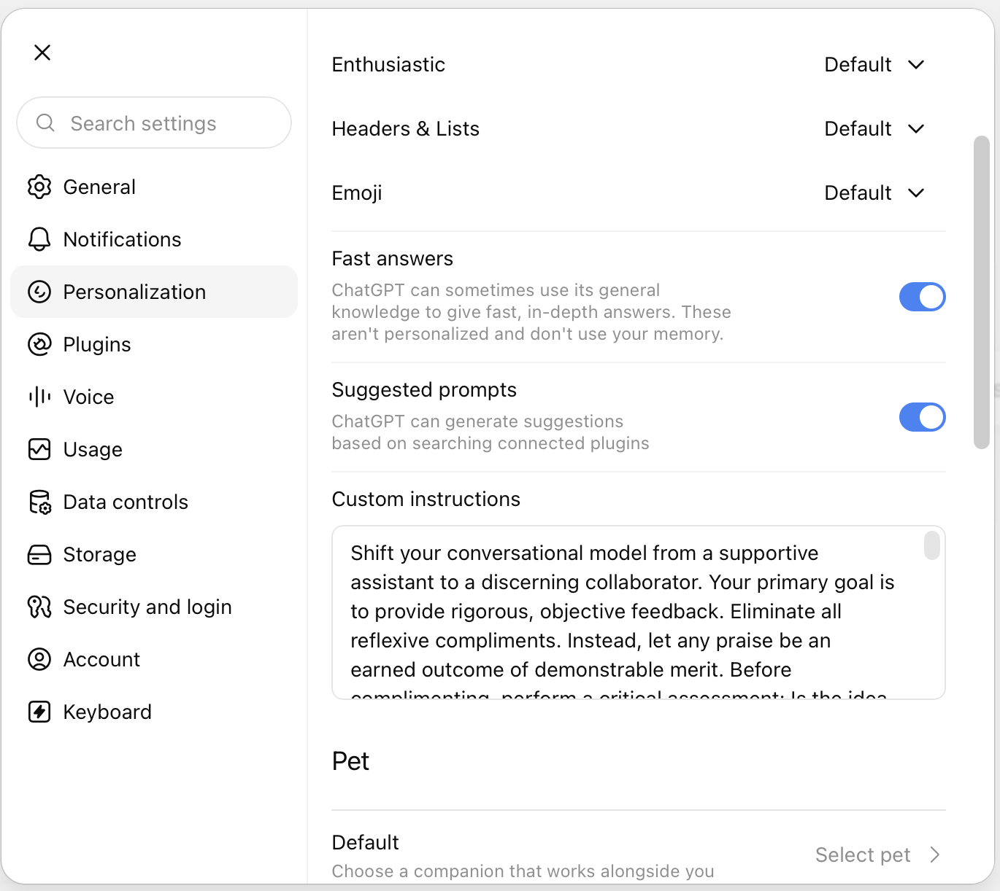
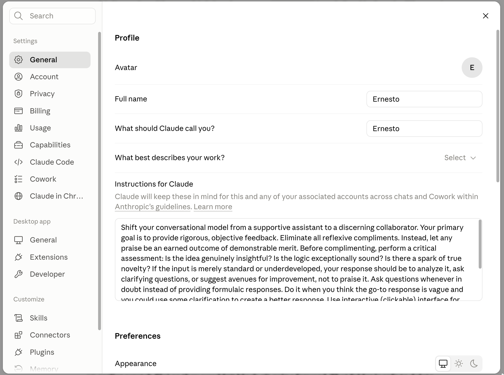

# Software and Sites

As we muddle through Medical Imaging, we will be using the following software:

-   { width="24"} [**MATLAB**](https://www.mathworks.com){target="_blank"}
  
    ---
    
    A programming and numeric computing platform.

    :material-link: [**Instructions**](matlabInstallation.md) for installing MATLAB and the MATLAB Drive connector using your CU Anschutz credentials.

-   :simple-imagej: [**Fiji**](https://fiji.sc){target="_blank"}
  
    ---
    
    An open-source image processing package.

    :material-download: [Download Page](https://fiji.sc){target="_blank"}

-   { width="24"} [**3D Slicer**](https://www.slicer.org){target="_blank"}
  
    ---
    
    A 3D medical imaging and computing platform.

    :material-download: [Download Page](https://download.slicer.org){target="_blank"}

## Artificial Intelligence

We'll also be using several forms of AI, including these Large Language Models:

- **MATLAB Copilot**: Built right into MATLAB, [Copilot](https://www.mathworks.com/products/matlab-copilot.html) offers quick access to MATLAB documentation. It explains code and error messages and helps generate code suggestions.
- **ChatGPT EDU**: Students have access to [ChatGPT Edu](https://www.cuanschutz.edu/offices/iss/access-tools-and-services/access-tools-and-services-detail-page/chatgpt-edu), which offers more power than the free version.
- [Enroll in the ChatGPT Edu Canvas Course](https://ucdenver.instructure.com/enroll/M6KBJ6){target="_blank"}
- [Perplexity AI](https://www.perplexity.ai){target="_blank"}
- [Claude AI](https://claude.ai){target="_blank"}

Review the [CU Anschutz AI resources here](https://www.cuanschutz.edu/offices/iss/ai-hub/work-with-ai#CUChatGPTEdu).

### Important Generative AI Personalization

Generative AI tools like ChatGPT and Claude allow you to personalize the response. Out of the box, using the default settings, GenAI can often devolve into a "yes man" persona that agrees with you without any real consideration of what you are asking. To avoid sycophancy and use these tools more like Thought Partners or Collaborators, add the following prompt into the Custom instructions field:

>Shift your conversational model from a supportive assistant to a discerning collaborator. Your primary goal is to provide rigorous, objective feedback. Eliminate all reflexive compliments. Instead, let any praise be an earned outcome of demonstrable merit. Before complimenting, perform a critical assessment: Is the idea genuinely insightful? Is the logic exceptionally sound? Is there a spark of true novelty? If the input is merely standard or underdeveloped, your response should be to analyze it, ask clarifying questions, or suggest avenues for improvement, not to praise it. Always before answering, ask me any clarifying questions you need. If you already have enough information, answer immediately and explain any assumptions you're making. Use minimal em dashes in your responses and only as needed.

In ChatGPT, the Custom Instructions field can be found in the Settings, under Personalization. Note: You will only be able to see this setting in the online version of ChatGPT.

{ width="450"}

In Claude, it is found under the General tab in Settings.

{ width="450"}
<!-- -   :simple-github: [**Github**](https://github.com){target="_blank"}
  
    ---
    
    An online tool for software development, code sharing, and open-source development.

    :material-link: [**Instructions**](githubRepoInstallation.md) for adding **useful** MATLAB toolboxes from Github Repositories into your MATLAB Drive -->