# Segmenting a Contrast-Enhanced CT Volume

Medical image segmentation is the process of dividing a medical image into regions or segments that represent different tissue types or categories. The goal is to identify areas of interest, such as tumors, lesions, or other abnormalities. In this module, we use 3D Slicer to segment one of its sample datasets: the CTACardio Sample dataset.

## Background information

Before we segment, we should have a reasonable understanding of the methodology used to acquire the volume:

??? question "What is a CT Angiogram?"

    Computed tomography angiography (also called CT angiography or CTA) is a CT technique used for angiography (blood vessel imaging). For CTA, you inject a contrast agent (e.g. iodine) into the patient's bloodstream to better visualize the arteries and veins throughout the human body.

    [CT angiogram](http://www.wikiwand.com/en/Computed_tomography_angiography)

For this segmentation project, we will take advantage of the added contrast to segment the kidneys and aorta.

## Load Volume and Review

1. Click on "Download Sample Data"  button:

    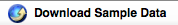{ width="150"}

2. Select "Download CTACardio"
3. Switch to the `Volumes` module

    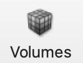{ width="50"}

4. Set the Active Volume to "CTACardio"
5. You should now see the following:

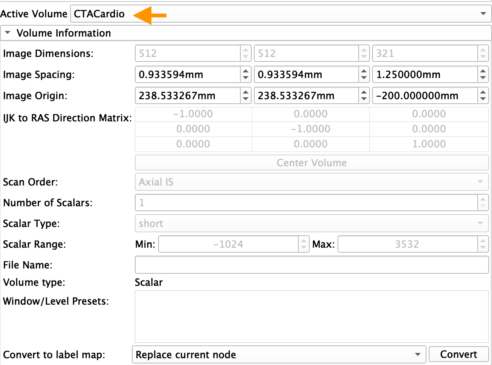{ width="550"}

??? question "Volume and Voxel sizes: How many voxels in the volume and how large is each voxel?"

    - Volume Size: $512 * 512 * 321 = 84,148,224$ voxels (~84 million)
    - Voxel Size: $0.93 * 0.93 * 1.25 = 1.08 mm^3$ 

??? question "Are the voxels isotropic or anisotropic?"

    anisotropic

??? question "What is the dynamic range of the volume?"

    -1024 to 3532

### Adjust Volume Display

In the Volumes module, under the Display Tab, select the CT-Abdomen preset:

![][CT-Abdoment Preset]

[CT-Abdoment Preset]: images/volumes-display-CT-Abdoment.png

### Volume rendering

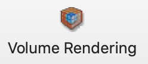{ width="200"}

Volume rendering is a great way to determine which parts of the volume have high contrast

1. Bring up the `Volume Rendering` module: 
2. Select "CTACardio" volume in the Volume menu
3. Click open the `eye` icon to render the volume
4. Slide the Shift slider back and forth to reveal different aspects of the volume
   - Notice how bright the veins are in the patients arm
   - Slide the Shift slider to the left to reveal the oxygen tank sitting atop the patient's chest
5. Select the "CT-Chest Contrast Enhanced" Preset
   - Slide the Shift slider to the right to reveal the kidneys

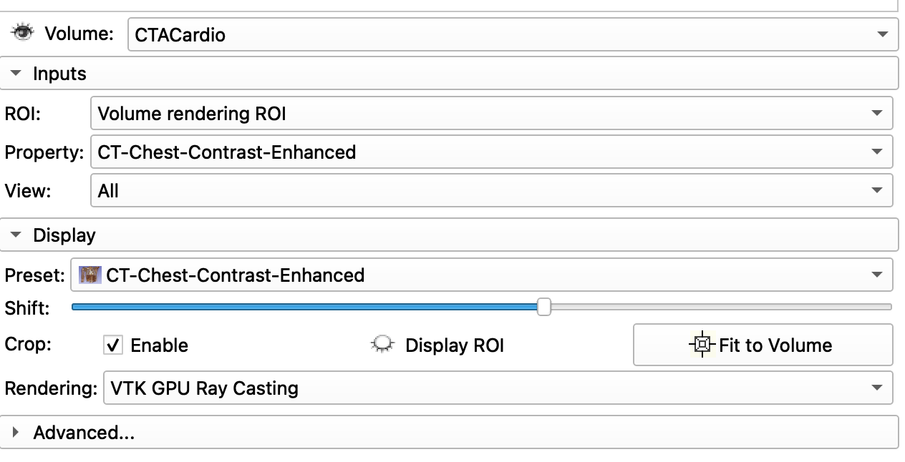{ height="200"} 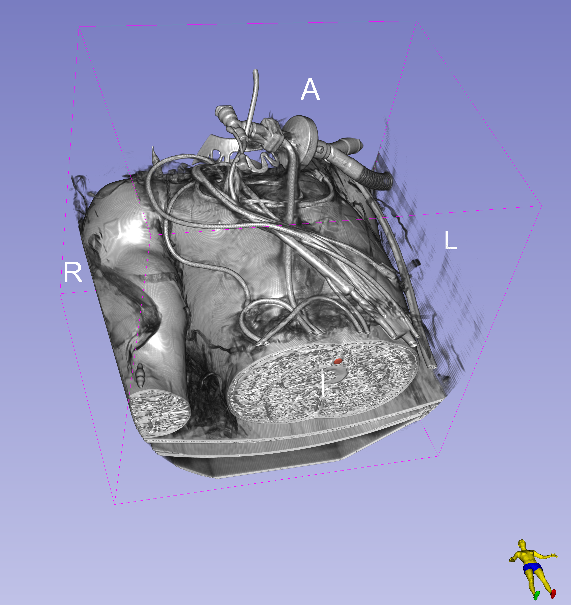{ height="200"} 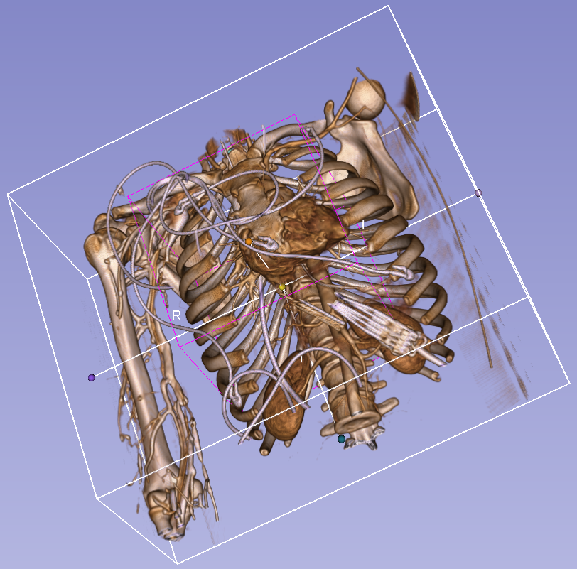{ height="200"}

>Notice that the kidneys, heart, vasculature, bones all segment out at the similar intensity mappings. This means that it will not be possible to use a simple threshold to segment these organs individually

### Crop volume down to the Right Kidney

1. In the `Volume Rendering` module, Check "Enable" crop and click on "Display ROI"
2. Adjust the ROI to encompass just the right kidney
3. Under the Advanced Tab, click on the "Scalar Opacity Mapping" function to adjust the transparency of the volume
4. Hide the Crop ROI

You should see something that looks like this:

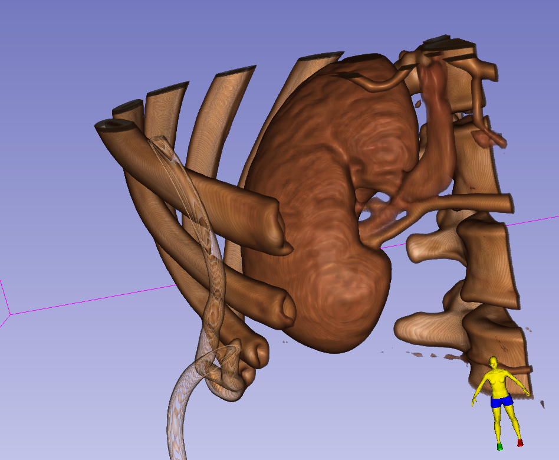{ height="300"}

>The kidney is surrounded by ribs and the spinal column which imaged with similar levels of intensity. So, if we use basic thresholding, we will have to clean up a lot of the segmentation surrounding the kidney

*Before continuing, turn off the 3D render by clicking the **eye icon** closed*

### Inspect Voxel Intensities

The most basic segmentation techniques involve thresholding, in which an intensity cut-off value is used to create a mask. For this exercise, we want to first segment the cortex of the kidneys, so let's inspect the intensity inside the kidney and in the tissue surrounding the kidneys. 

Let's start with Right kidney. Remember, we should look at the right kidney in all three views. To help align the views, we will turn on the `Crosshair` tool ( { width="25"} ), which adds crosshairs to each view to show the center of the alignment.

1. In the top toolbar, hold down the Crosshair tool menu and make sure the following menu items are selected:

    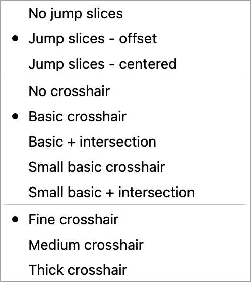{ width="200"}

2. Click on the Crosshair tool to activate
3. In the 2D viewers, scrub to the slices that show the **right** kidney. 
4. Hold **shift** while you hover the mouse pointer over one kidney view to align all three views. The slice iteration lines will jump to the mouse when you hold shift. There should be yellow crosshairs in all three views to indicate the center of the alignments

    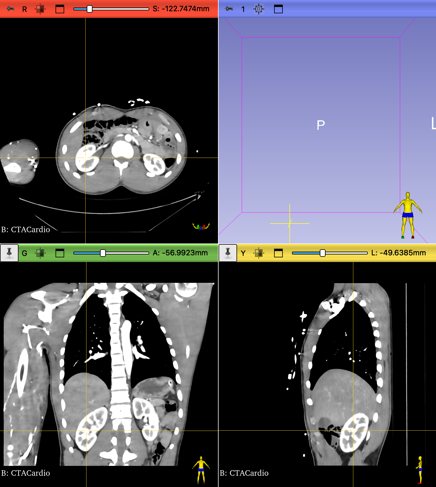{ width="350"}

5. Release **shift** and move the mouse pointer over the kidney and surrounding tissue inspect the intensity values of the voxels
6. Compare the intensity value of the kidney to the tissue surrounding the kidney and to the spinal column. Make note of these intensity values:
    - **Kidney**: `~245`
    - **Surrounding Tissue**, `~80`
    - **Vertebrae:** `~300-1000`.

## Segmentation

For this exercise, we will segment the Kidneys, the Aorta, and the Lungs. When you segment, you actually create a new volume that is the same size as the original volume (same number of voxels). This segmentation volume is said to mask the original volume. Segmentation volumes can be either binary volumes (true or false) or label maps, which use whole numbers to indicate connected regions. For this exercise, for example, we will create a segmentation of the Right Kidney. In this segmentation volume, all voxels pertaining to the right kidney will be labeled with a value, like 1. This is not an intensity value, but a label — that's why they are called label maps.  We will also segment the Left Kidneys — all those voxels will be labeled with a different value, like 2. And so on. Everywhere that is not segmented will have a label of 0.

### Crop Volume

Segmentation projects are often memory intensive. So, is often useful to crop the volume down to the bare minimum needed for the segmentation project. For analysis of the segmentations, it is also useful to resample the voxels so that they are isotropic.

#### Create ROI

1. Switch to the `Volume Rendering` module
2. Enable and display the crop ROI
3. If the crop is still specific to the right kidney, click on the "Fit to Volume" icon so the ROI covers the entire volume
4. Crop out the table and as much of the wires as you can manage

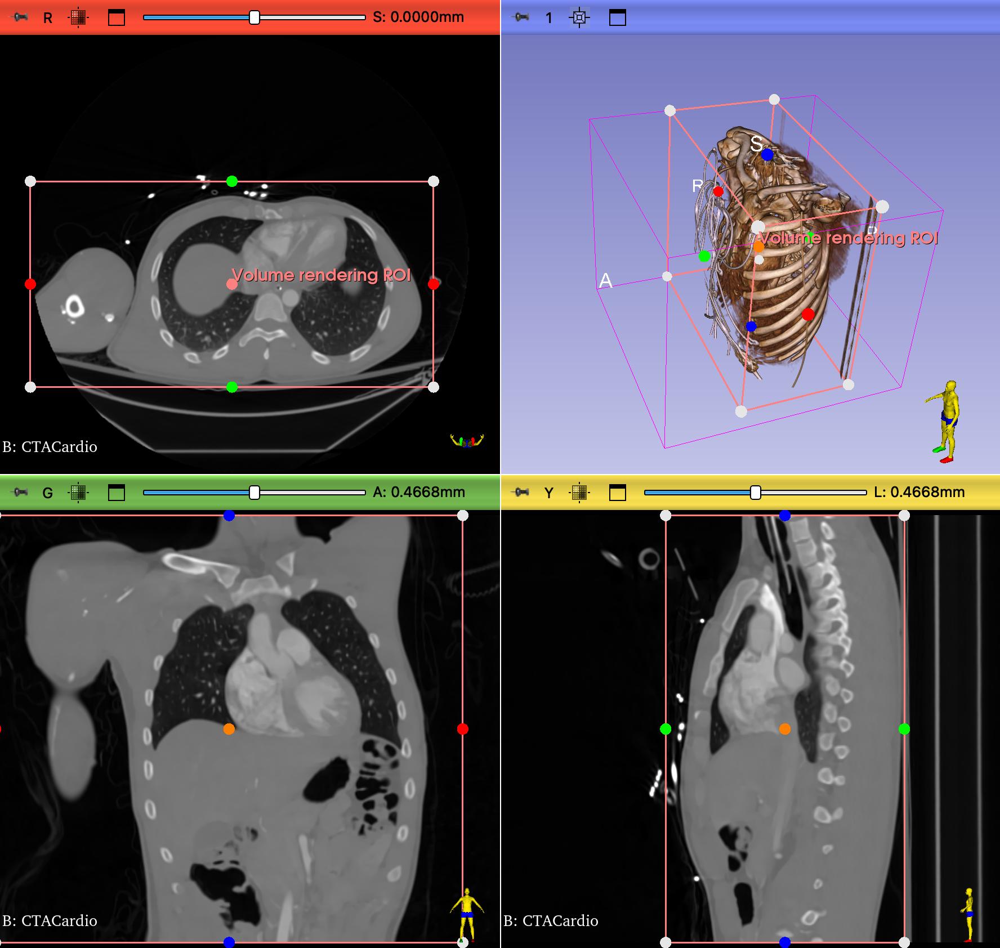{ width="450"}

#### Crop Module

1. Next, switch to the `Crop` module by searching for the module using the magnifying glass
   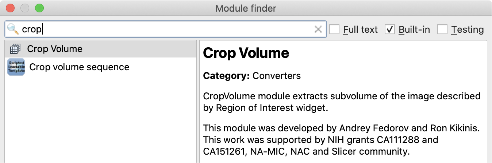{ width="450"}
2. Use the following settings
   - **Input volume**: "CTACardio"
   - **Input ROI:** "Volume rendering ROI" - this is the ROI that we created in the `Volume Rendering` module
   - **Output Volume:** Create a new volume as "CTACardioCrop"
    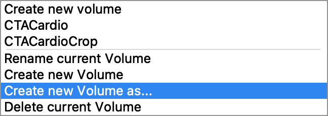{ width="250"}
3. Check on "Interpolated cropping"
4. Reveal the Volume Information tab

Your crop settings should be as follows:

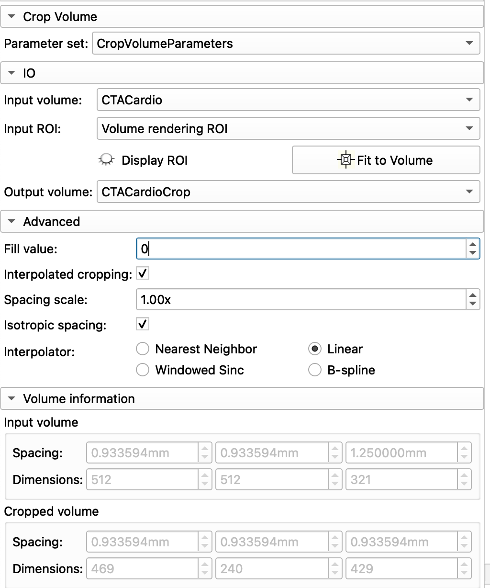{ width="450"}

>Notice that the new, cropped volume will have isotropic voxels

1. Click Apply ( you have to scroll down from Volume Information)
2. The new cropped volume (CTACardioCrop) should appear in the viewers
3. Return to the `Volume Rendering` module
   1. Turn off Volume Rendering (click eye icon closed)
   2. Hide the ROI (click Display ROI off)

### Filter Volume

You should also filter a volume before you segment.

1. Open the `Median Image Filter` module
2. Use the default settings (Neighborhood Size `1,1,1`)
3. Input Volume: CTACardioCrop
4. Output Volume: CTACardioCrop
5. Click `APPLY`

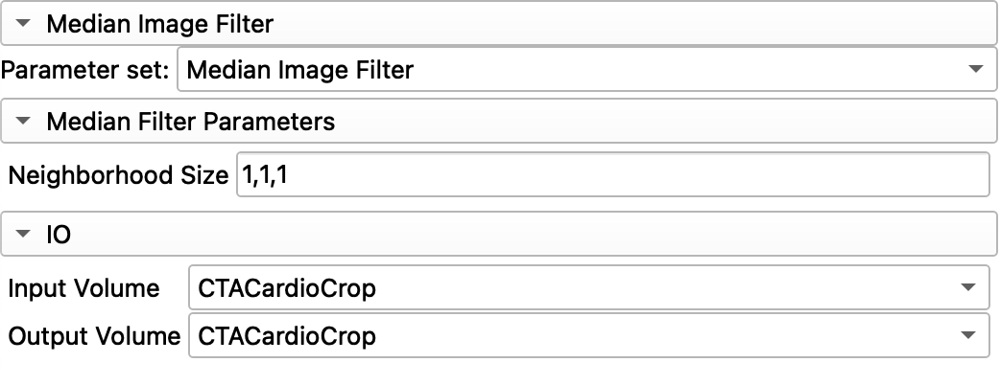{ width="400"}

This will overwrite the cropped volume with a filtered version of the volume

### Segment Editor

The [Segment Editor](http://slicer.readthedocs.io/en/latest/user_guide/module_segmenteditor.html) module organizes a set of tools to create and manage segmentations.

First, be sure to reset the volume look-up table by clicking on the CT-Abdomen present under the display tab in the **Volumes** module.

### Segment the Right Kidney Using Grow from Seeds

We start by creating a segmentation of the Right Kidney

#### Add a Segmentation volume to Segmentation table

1. Bring up the Segment Editor Module: { width="20"}
2. **Master volume:** Make sure the master volume is the "CTACardioCrop" volume
3. Click on the add button ![segment editor add button][segment editor add button]
4. A Segmentation row should appear in the Segmentations table. The name should be "Segment_1" (or something similar)
5. Rename this row "Right Kidney" by clicking on "Segment_1" name

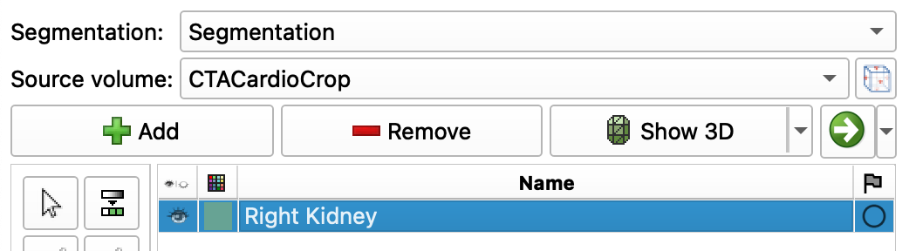{ width="450"}
> This table dictates what we add to our segmentation volume. Right now, we just have one segmentation, 'Right Kidney'. As we progress through this exercise, we will add the left kidney and the aorta. Each item in the table will have a different label in the segmentation volume (like a 1, a 2, or a 3). As we segment, we will add the segmentation color to the image cross-sections. When we do this, we are actually adding the label (1,2, or 3) to the corresponding location in the segmentation volume.

#### Center Viewers on right kidney

1. In the green viewer, scrub to the center of kidneys. 
    - Notice that the kidneys have a lighter outer area (the cortex) and a darker interior area (the medulla). We will capture the cortex in this exercise.
2. Make sure the coronal section (green viewer) is showing a slice near the **center** of the kidney.
3. Align all three views to the center of the right kidney (hold shift while moving and point the mouse at the right kidney in the green viewer)
   - All three views should now be showing the right kidney

#### Set Threshold

We can use the threshold tool to segment the kidney, but that would also segment some of the vasculature and parts of the skeletal system. Instead, we will use the threshold tool to set the Masking, which are the editable intensities in the volume (the voxels that we  can mask).

1. Click on the **Threshold** tool { width="25"}
    - You should see a gray flashing color overlaid on the grayscale images in the 2D viewer
    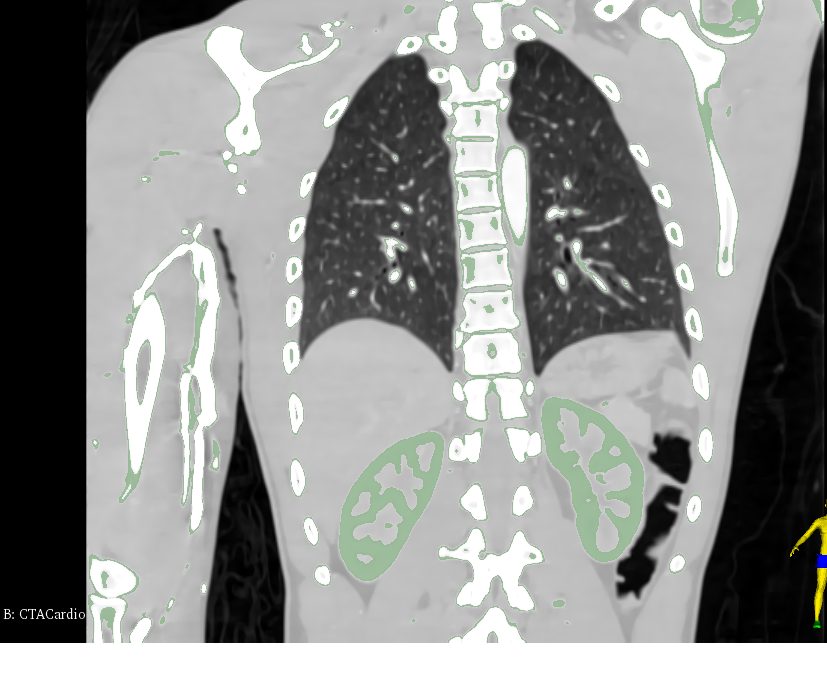{ width="250"}
2. Adjust the **Threshold range**: `150` to `300`. Kidney, some vasculature, and bone cortex should light up.
3. Click on "Use for Masking"
    - This turns on the "Editable intensity range" and switches over to the Paint Tool

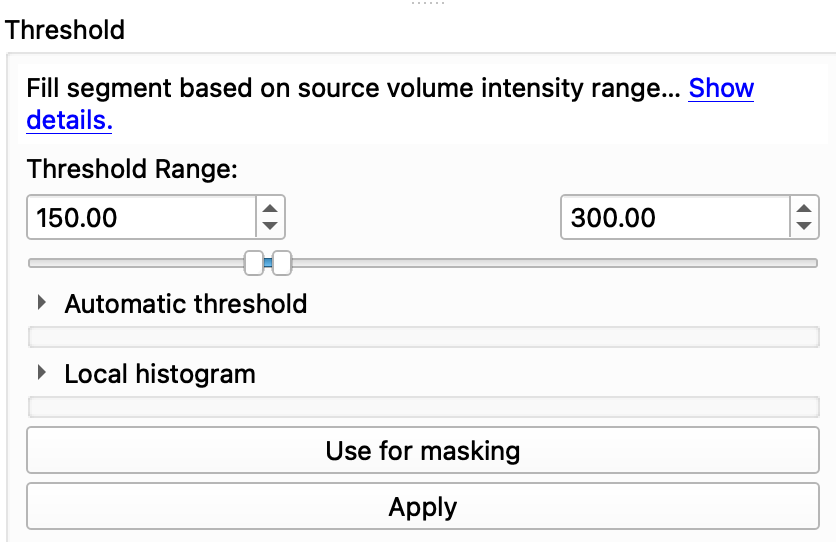{ width="350"}
  
#### Hand Paint The Green Slice

The previous step should have switched you to the Paint Tool

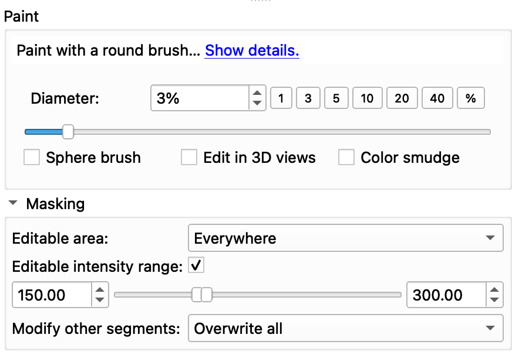{ width="350"}
>Notice Under the Masking Tab that the "Editable Intensity Range" has been checked on and the range is the threshold values that we set in the threshold tool (150 - 300)

1. Move the mouse over the kidney and click-drag to paint
   - Notice that we can only paint inside of the cortex of the kidney.
   - This is because of the "Editable Intensity Range" setting. 
   - If you uncheck that setting, then the paint tool will paint everywhere you click-drag (so, don't do that)
2. Paint the Right kidney in all three views. Only paint the current slice in each viewer (don't scrub through the slices)
3. You should now have three orthogonal segmentations of the kidney cortex.
4. To visualize these slices in 3D, click on the Show 3D button
    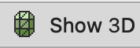{ width="100"}

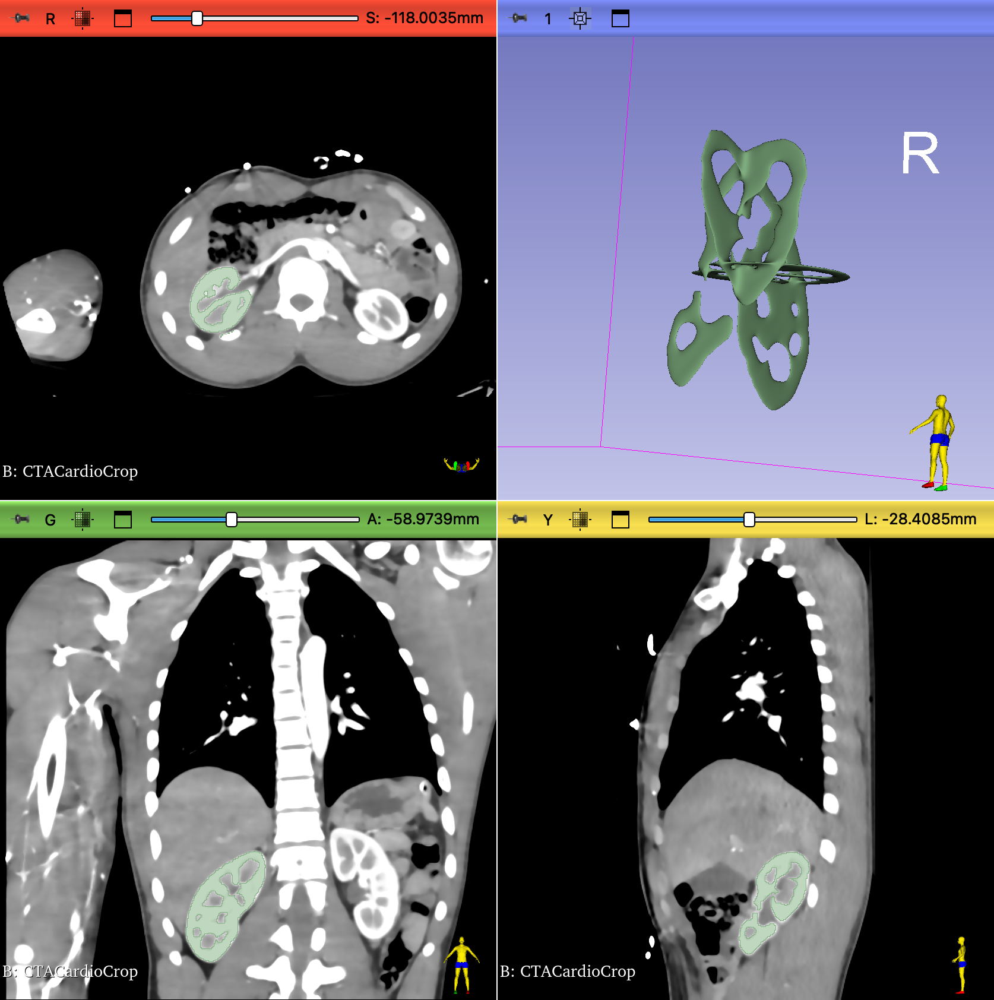{ width="450"}

We could repeat this process and painstakingly trace every single slice of the kidney, slice by slice, until we have the entire kidney cortex segmented. But this dataset has enough contrast between the kidney and the surrounding tissue to automate instead. For example, we can use the grow from seeds method...

#### Grow from Seeds

The Grow from Seeds tool segments by searching for voxels sharing a similar intensity range that are adjacent. First, though, you have to establish which voxels are kidney (the 'seeds') and which voxels are definitely not kidney (background).

We start the process starts by creating a new segmentation layer for the background

1. Click on the "Add" button in the segment editor module 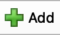{ width="45"}
2. In the segmentations table, a new row should appear under the Left Kidney row. **Rename** that row "background".

    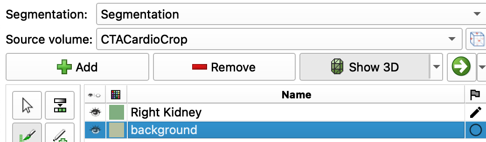{ width="450"}

3. **Paint Tool** Click on the "Paint tool". { width="25"}
   1. Select the background segmentation row in the segmentations table.
   2. Uncheck "Editable intensity range" so you can paint everywhere
   3. Set the **Editable Area** to "Outside all segments"
   4. Paint around the kidney in all three Slice Views.
      - You shouldn't be able to overwrite the green (due to the Editable area setting)
      - Be sure that you painting the background color (mustard in this case) and not the kidney color (green)
      - Be sure to sample as many different regions of the volume that are NOT kidney, but that immediately surround the kidney.
      - Be sure to also paint inside the kidney in the medulla areas
      - You should get something that looks like this:

        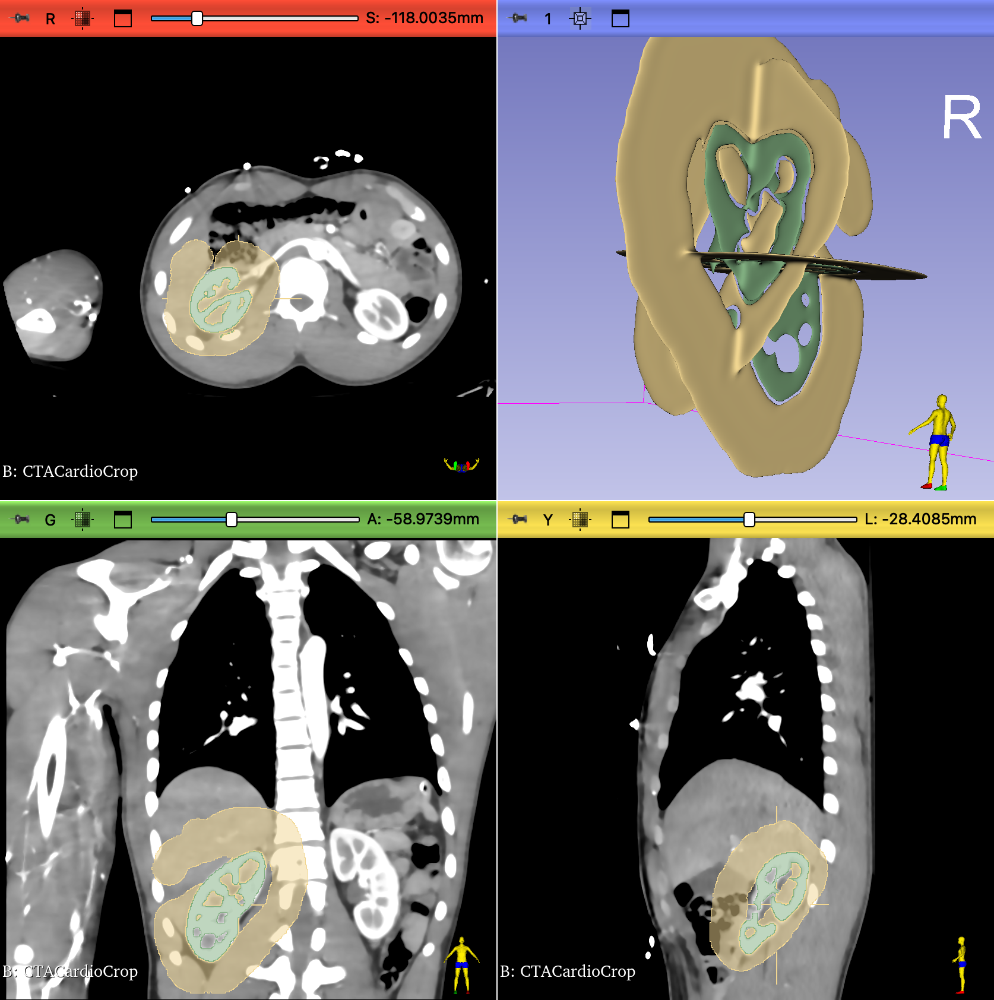{ width="450"}

4. **Grow From Seeds.** Click on the "Grow from Seeds" icon 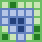{ width="25"}
    1. **Critical!** Reselect "Right Kidney" in the Segmentations table
    2. Use the following settings:
        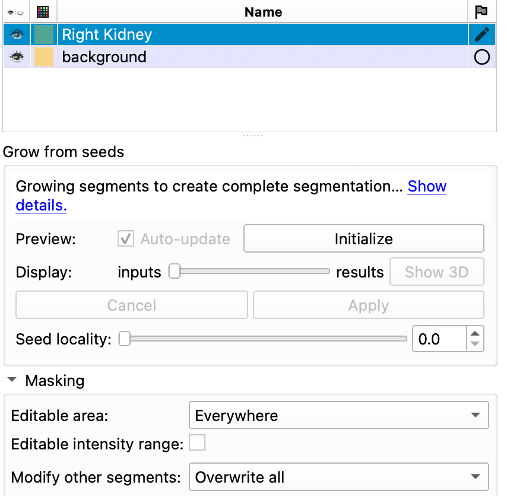{ width="350"}
    3. Click "Initialize"
    4. Scrub through the slices to make sure that the segmentation worked. Use to the paint tool to clean up any errors. After patching up, click on the "Update" button.
    - Click on "Apply" - it may seem like Slicer crashed. Just wait
    - After a while, you should get something like this:
    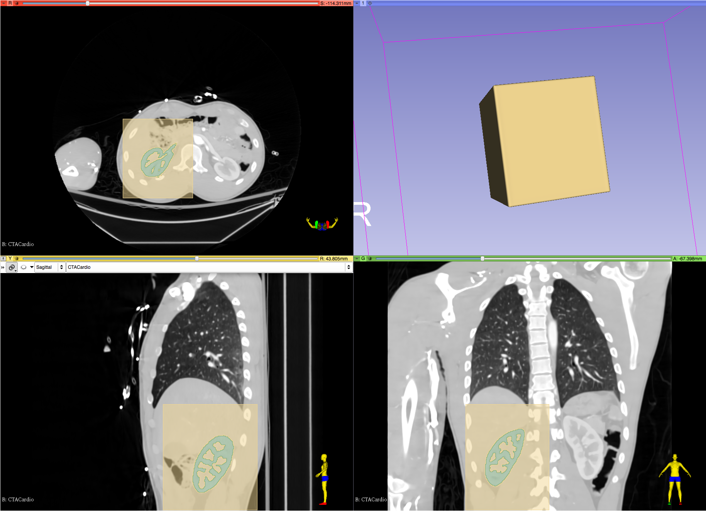{ width="450"}

5. Notice that the Background is now a large Cube. Grow from seeds extends the background from your background paintings into a 3D cube. Inside this cube, is the kidney.
6. Delete the "Background" segmentation (mustard box).
    - Select the "background" row in the segmentation table
    - Click on the "Remove" button 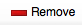{ width="50"}
    - You should now see a fully segmented kidney, in all its glory, in the 3D viewer
    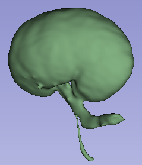{ width="250"}

#### Segmentation Cleanup

After segmentation, you typically use some morphological operations to clean  up the segmentation. The `Segment Editor` contains many useful tools, such as the Islands Tool, which can remove small noise.

**Islands Tool**

{ width="50"}

1. Click on the **Islands** icon.
2. Select "Remove small islands"
3. Set "Editable area" to "Everywhere"
4. Use the default setting of 1000
5. Click Apply
6. Small noise should be removed

**Smoothing**

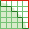{ width="50"}

You can remove extrusions or close holes using the smoothing tool

1. Click on the **Smoothing** icon
2. Try the default settings for Closing (fill holes) and Opening (remove extrusions)
3. Click "Apply" to apply the smoothing effect

### Save Data

Time to save your hard work!

1. Click on the save icon: 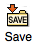{ width="25"}
2. In the dialog, Click on the "Change directory…" button
3. In the file dialog that appears, create a new folder called 'CTACardio' and then click Choose
    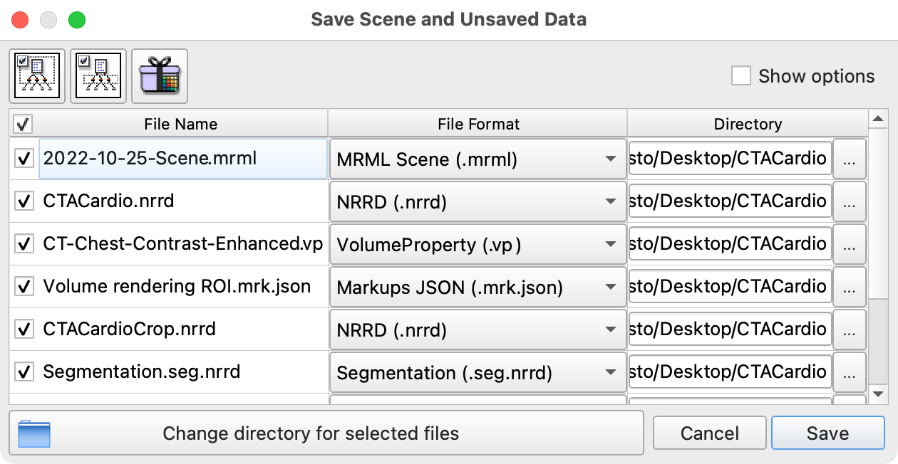{ width="450"}
4. Back in the Save Dialog, Choose "Save"
5. Everything in the table that is checked will be saved.

#### Segment the Left kidney

Repeat the segmentation steps for the Left Kidney

- Create a new Segmentation Called Left Kidney. Set the color to Blue
- Settings for  **Grow From Seeds**
        - Masking: Editable area: Outside all visible segments
        - Overwrite other segments: "none"

SAVE YOUR WORK!

### Segment the Aorta

For the Aorta, we will use a different segmentation method. First, though, we need to create the segmentation volume.

1. In the `Segment Editor` module, Click on the Add Button
2. Rename the new segmentation "Aorta"
3. Change the color of the Aorta to red by double-clicking on the color tile to bring up the color selector
   - choose "Artery" red
4. Make sure that the Aorta segmentation is selected for the following steps

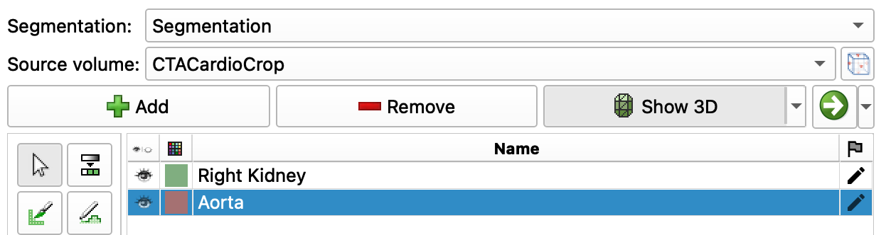{ width="550"}

#### Local Threshold

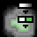{ width="50"}

The local threshold tool is an add-on tool included with the "SegmentEditorExtraEffects" extension. Make sure you have that [extension installed](CustomizeSlicer.md) before continuing. Local threshold works by setting an intensity range and then clicking on the image to add a starting point for the segmentation. The algorithm will segment any connected voxels with the same intensity range.

1. Switch to the Local Threshold tool
2. Set the threshold Range to: `300-600`
3. Under the Masking tab, set the **Editable area** to "Outside all segments"
4. For **Modifying other segments**, choose "Overwrite visible"
    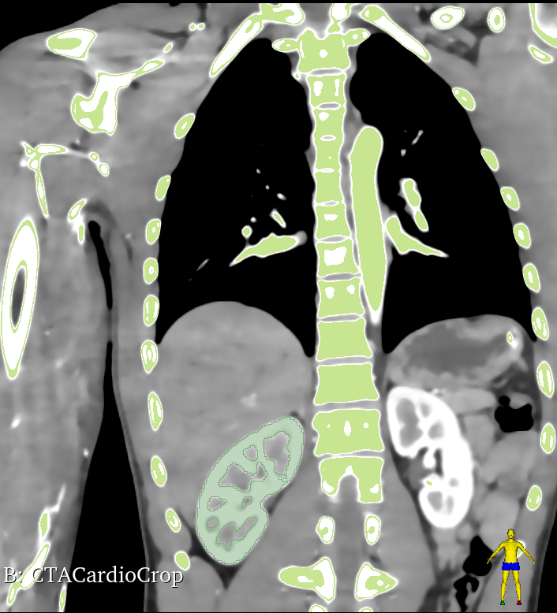{ width="250"}
    >You should see a flashing color indicating what will be segmented. Notice that kidney is outside of the threshold range
5. Once you have these settings, Ctrl- or Command- click on the descending aorta and watch the magic happen

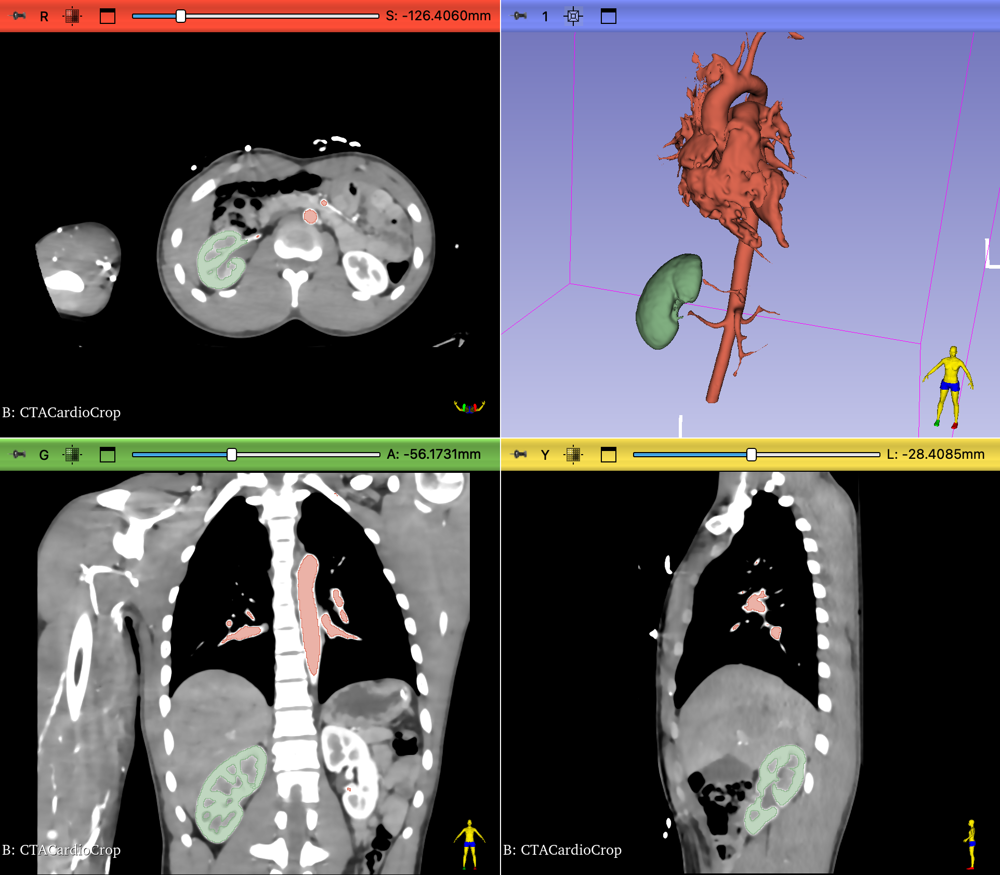{ width="450"}
>So, we also got the ventricles of the heart, but no matter, we can clean that up

#### Clean up Aorta

1. Maximize the 3D viewer
2. Switch to the Scissors tool { width="25"}
3. Make sure Aorta is selected in the Segmentation table
4. Position the 3D view so you can see the blue background behind the aortic arch
   { width="250"}
5. Cut the arch by drawing an oval using the scissor tool
   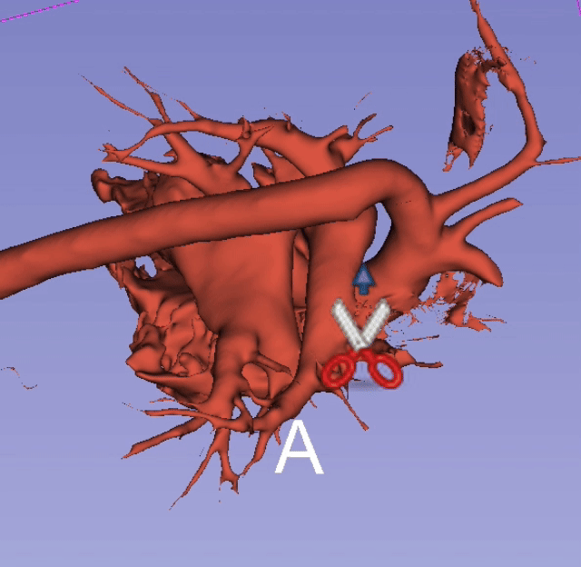{ width="250"}
6. Use the arrow keys to rotate the segmentation and ensure that you have separated the arch from the heart
7. Switch to the Islands Tool
8. Select "Remove selected island"
9. In **the 2D view** of the segmentation, click on a segmentation in the heart to remove that portion of the segmentation
    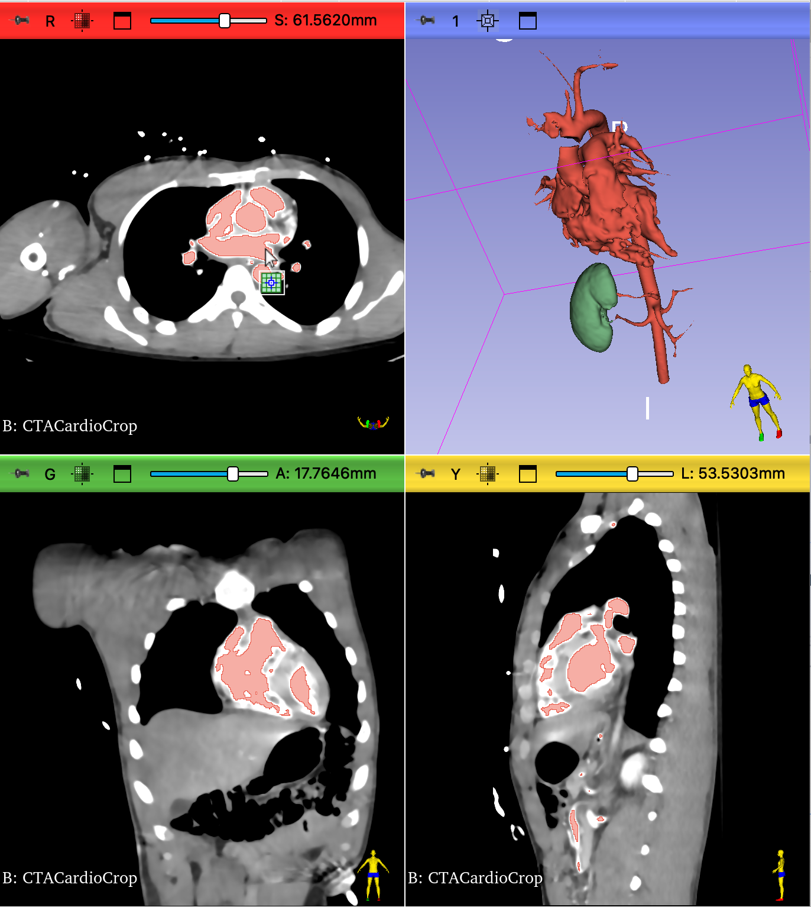{ width="350"}
    >Notice that the pointer icon shows the island tool when pointing to the segmentation in the 2D view only (not the the 3D viewer)
10. Select "Remove small islands" using a minimum size of 1000 voxels
11. Click apply and enjoy your segmented aorta
12. Save your work!

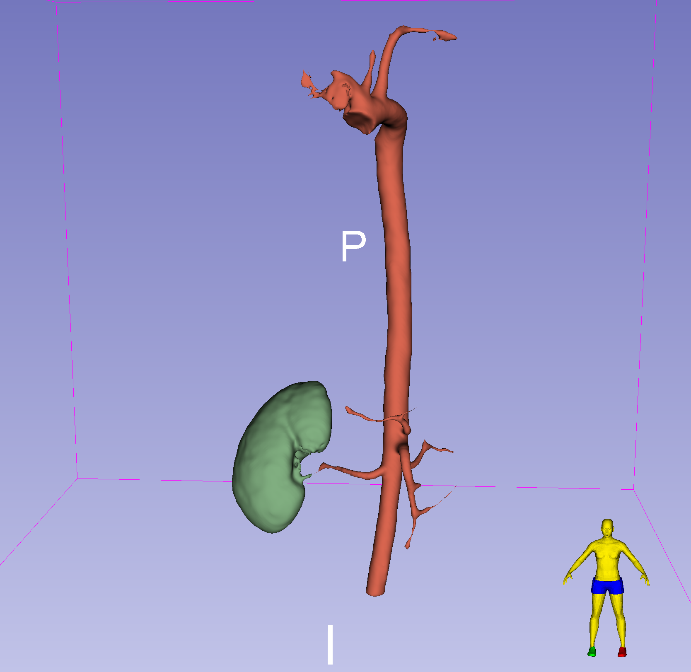{ width="250"}

### Segment the Lungs

This requires the Lung CT Analyzer & Segmenter extension to be installed.

#### Change Window/Level of CTACardio

1. Switch to the `Volumes` module
2. Set the **Active Volume** to "CTACardioCrop"
3. Select the CTLung Preset

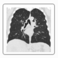{ width="50"}

#### Lung CT Segmenter

[YouTube demonstration](https://www.youtube.com/watch?v=fpLxm7uAvZQ)

Open the Lung CT Segmenter:

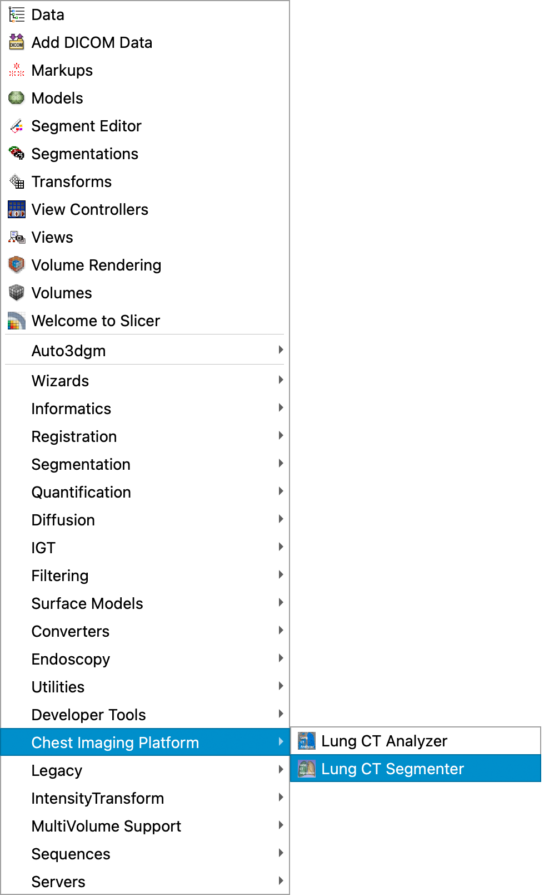{ width="250"}
>This menu item is only available after you have installed the extension

The module looks like this:

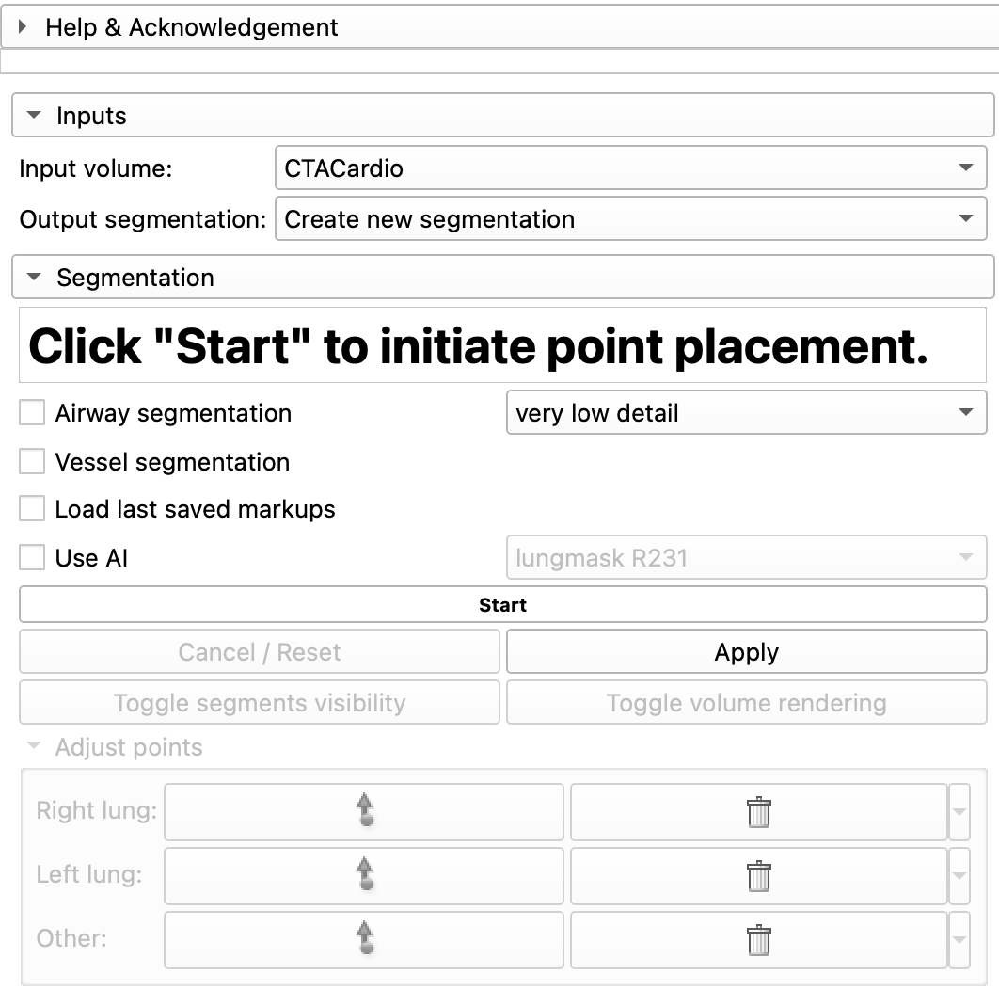{ width="450"}

1. Make sure that your **Input volume** is "CTACardioCrop"
2. Otherwise, don't change any of the settings
3. Click Start
4. You will be present with an axial slice and Prompted to add three points to the right lung
5. Scrub to the middle of the lungs
6. Click on three points in the right lung, followed by three points in the left lung
   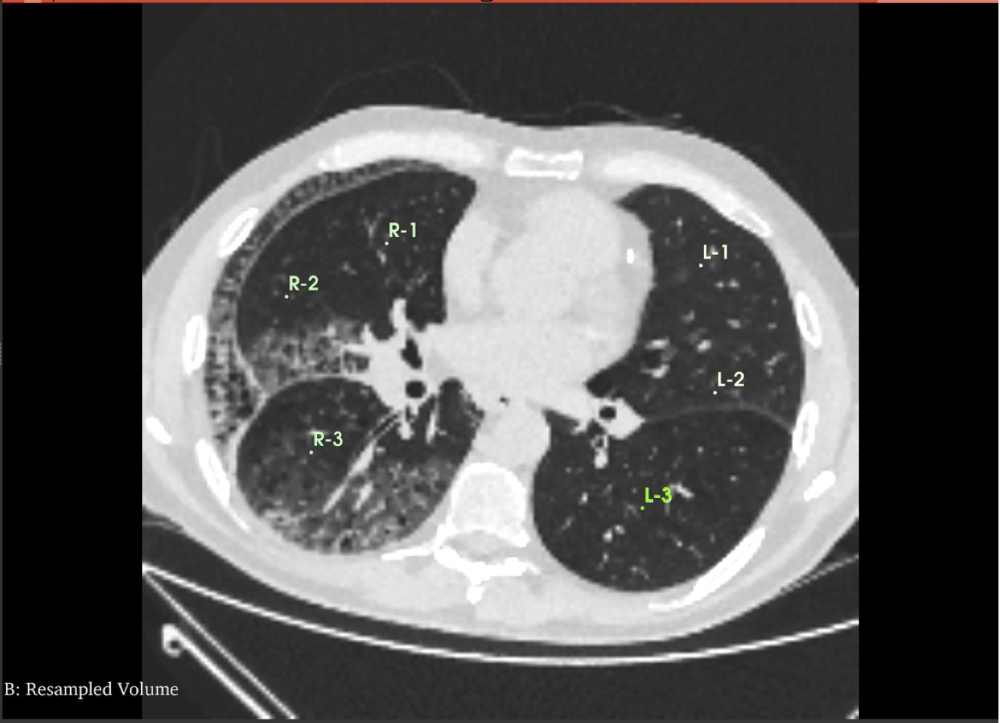{ width="350"}
7. Once you have added the points, you will then be presented with a coronal plane
8. Again, scrub to a region near the middle of the lungs
9. Click on three points in the right lung, followed by three points in the left lung
    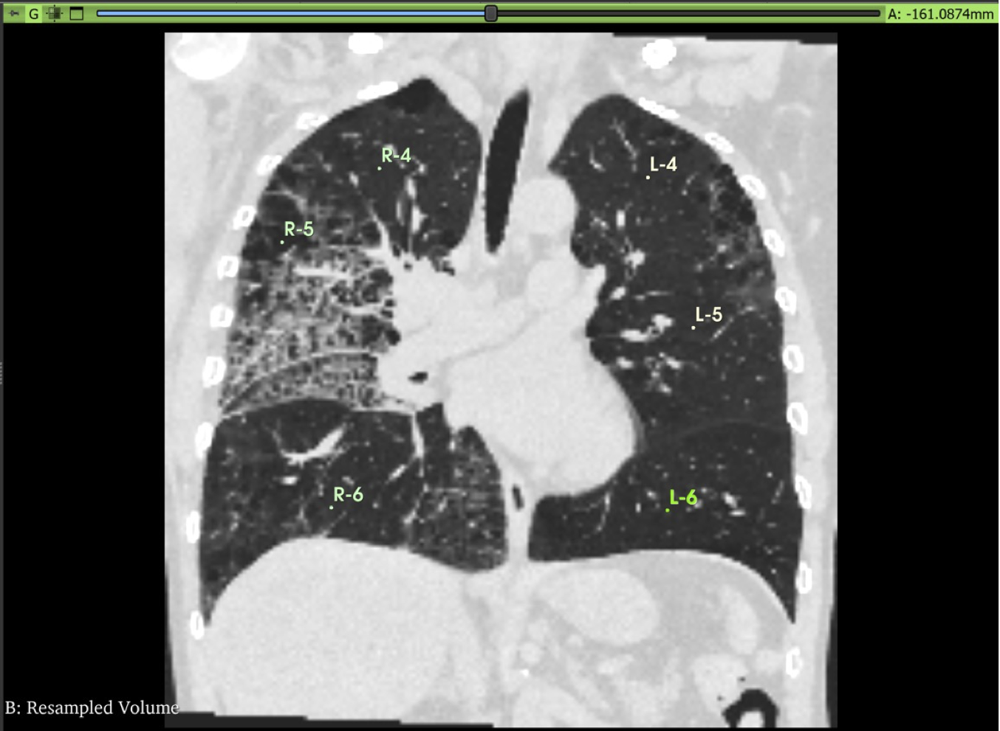{ width="350"}
10. Once you have added the points, you be prompted to add a point to the trachea. If you don't see the trachea, scrub through the coronal planes until you do.
11. Add a point to the trachea
12. If everything looks good, click Apply
13. Enjoy segmentations of the lung and trachea

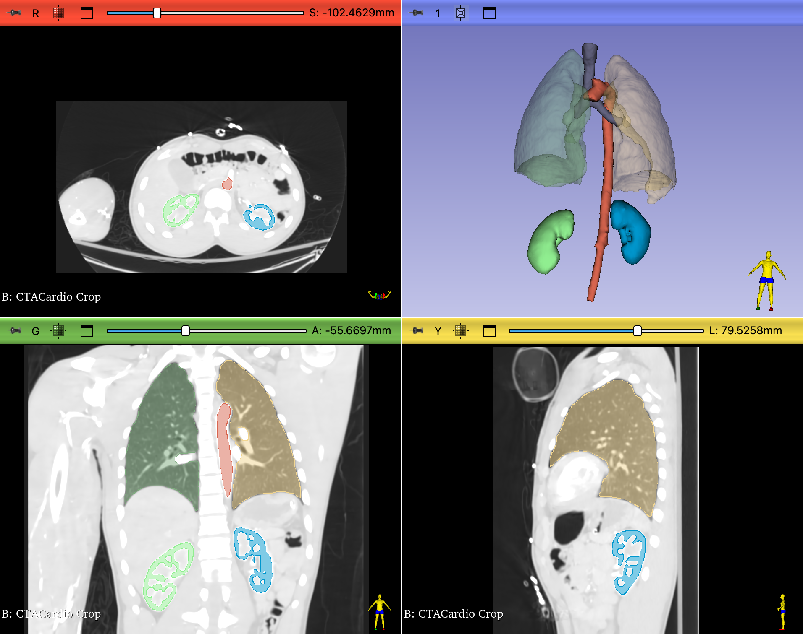{ width="450"}

#### Review Data module

Notice that a new Segmentation Node has been added: "Lung Segmentation". There are also some segmentations in there not being displayed

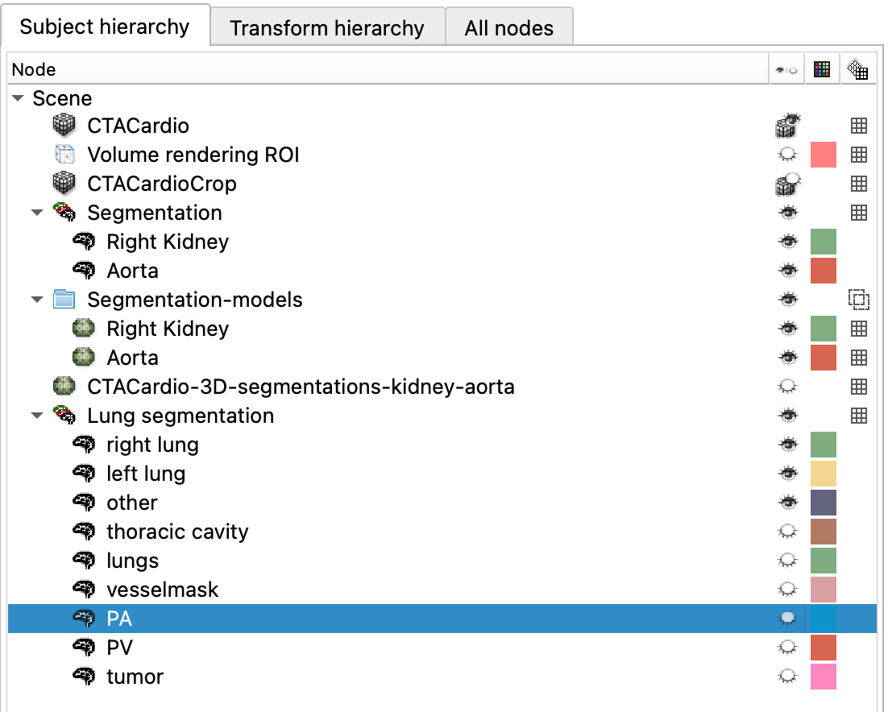{ width="450"}
>Notes: models will be added in a future step

Save your work!
