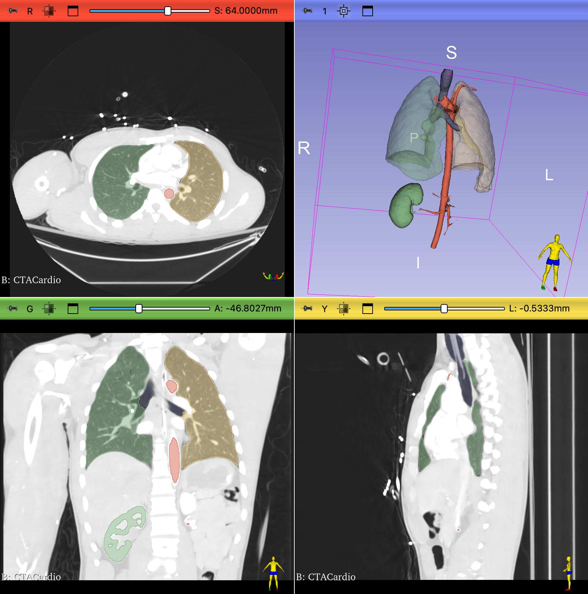

# Segmenting a Contrast-Enhanced CT Volume

Medical image segmentation is the process of dividing a medical image into regions or segments that represent different tissue types or categories. The goal is to identify areas of interest, such as tumors, lesions, or other abnormalities. In this module, will we use 3D Slicer to segment the Kidneys,  Aorta, and Lungs in the CTACardio Sample dataset.

## Extensions Required

1. Lung CT Analyzer & Segmenter
2. SegmentEditorExtraEffects

## Background information

Before we segment, we should have a reasonable understanding of the methodology used to acquire the volume:

??? question "What is a CT Angiogram?"

    Computed tomography angiography (also called CT angiography or CTA) is a CT technique used for angiography (blood vessel imaging). For CTA, you inject a contrast agent (e.g. iodine) into the patient's bloodstream to better visualize the arteries and veins throughout the human body.

    [CT angiogram](http://www.wikiwand.com/en/Computed_tomography_angiography)

For this segmentation project, we will take advantage of the added contrast to segment the kidneys and aorta.

## Load Volume and Review

1. Click on "Download Sample Data"  button:

    { width="150"}

2. Select "Download CTACardio"
3. Switch to the `Volumes` module

    { width="50"}

4. Set the Active Volume to "CTACardio"

!!! abstract "Volume Information for CTACardio"

    { width="550"}

??? question "Volume and Voxel sizes: How many voxels in the volume and how large is each voxel?"

    - Volume Size: $512 * 512 * 321 = 84,148,224$ voxels (~84 million)
    - Voxel Size: $0.93 * 0.93 * 1.25 = 1.08 mm^3$ 

??? question "Are the voxels isotropic or anisotropic?"

    anisotropic

??? question "What is the dynamic range of the volume?"

    -1024 to 3532

### Adjust Volume Display

In the Volumes module, under the Display Tab, select the CT-Abdomen preset:

![][CT-Abdoment Preset]

[CT-Abdoment Preset]: images/volumes-display-CT-Abdoment.png

### Volume rendering

{ width="200"}

Volume rendering is a great way to determine which parts of the volume have high contrast

1. Bring up the `Volume Rendering` module.
2. Select "CTACardio" volume in the Volume menu
3. Click open the `eye` icon to render the volume

!!! abstract "Volume Rendering Controls for CTACardio"

    { width="450"}

#### Adjust Rendering

1. Slide the Shift slider back and forth to reveal different aspects of the volume
   - Notice how bright the veins are in the patients arm
   - Slide the Shift slider to the left to reveal the oxygen tank sitting atop the patient's chest
2. Select the "CT-Chest Contrast Enhanced" Preset
   - Slide the Shift slider to the right to reveal the kidneys

{ width="250"}

{ width="250"}

>Notice that the kidneys, heart, vasculature, bones all segment out at the similar intensity mappings. This means that it will not be possible to use a simple threshold to segment these organs individually

??? abstract "Optional: Crop volume down to the Right Kidney"

    Adjust the ROI to capture just the right kidney:

        1. In the `Volume Rendering` module, Check "Enable" crop and click on "Display ROI"
        2. Adjust the ROI to encompass just the right kidney
        3. Under the Advanced Tab, click on the "Scalar Opacity Mapping" function to adjust the transparency of the volume
        4. Hide the Crop ROI

    You should see something that looks like this:
        
    { width="250"}

        The kidney is surrounded by ribs and the spinal column which imaged with similar levels of intensity. So, if we use basic thresholding, we will need to clean up a lot of the segmentation surrounding the kidney

*Before continuing, turn off the 3D render by clicking the **eye icon** closed*

### Inspect Voxel Intensities

The most basic segmentation techniques involve thresholding, in which an intensity cut-off value is used to create a mask. For this exercise, we want to first segment the cortex of the kidneys, so let's inspect the intensity inside the kidney and in the tissue surrounding the kidneys.

Let's start with Right kidney. Remember, we should look at the right kidney in all three views. To help align the views, we will turn on the `Crosshair` tool ( { width="25"} ), which adds crosshairs to each view to show the center of the alignment.

1. In the top toolbar, hold down the Crosshair tool menu and make sure the following menu items are selected:

    { width="200"}

2. Click on the Crosshair tool to activate
3. In the 2D viewers, scrub to the slices that show the **right** kidney. 
4. Hold **shift** while you hover the mouse pointer over one kidney view to align all three views. The slice iteration lines will jump to the mouse when you hold shift. There should be yellow crosshairs in all three views to indicate the center of the alignments

    { width="350"}

5. Release **shift** and move the mouse pointer over the kidney and surrounding tissue inspect the intensity values of the voxels
6. Compare the intensity value of the kidney to the tissue surrounding the kidney and to the spinal column. Make note of these intensity values:
    - **Kidney**: `~245`
    - **Surrounding Tissue**, `~80`
    - **Vertebrae:** `~300-1000`.

## Preprocess Volume

### Crop Volume

Segmentation projects are often memory intensive. So, is often useful to crop the volume down to the bare minimum needed for the segmentation project. For analysis of the segmentations, it is also useful to resample the voxels so that they are isotropic.

#### Create ROI

1. Switch to the `Volume Rendering` module
2. Enable and display the crop ROI
3. If the crop is still specific to the right kidney, click on the "Fit to Volume" icon so the ROI covers the entire volume
4. Crop out the table and as much of the wires as you can manage

{ width="450"}

#### Crop Module

Switch to the `Crop` module by searching for the module using the magnifying glass

{ width="450"}

In the crop module, use the following settings:

{ width="450"}

- **Input volume**: "CTACardio"
- **Input ROI:** "Volume rendering ROI" - this is the ROI that we created in the `Volume Rendering` module
- **Output Volume:** Create a new volume as "CTACardioCrop"
>{ width="250"}
- Check on "Interpolated cropping"
- Reveal the Volume Information tab

Notice that the new, cropped volume will have isotropic voxels.

Click **Apply** to crop (scroll down from Volume Information if you don't see the Apply button). The new cropped volume (CTACardioCrop) should appear in the viewers.

If the Cropped volume is not displayed, select it in all the slice viewers:

{ width="550"}

!!! abstracts "Steps before continuing"

    Return to the `Volume Rendering` module

    1. Turn off Volume Rendering (click eye icon closed)
    2. Hide the ROI (click Display ROI off)

    Return to the `Volume` module

    3. Set the `Volume` to 'CTACardio Crop`
    4. Select the 'CT-Abdomen' preset under the `Display` tab

You should now see the following in the Slice Viewers:

{ width="450"}
>4UP View of CTACardio Crop. No 3D Render, no Crop ROI.

### Filter Volume

*Optional*.

You can also filter a volume before you segment.

!!! abstract "Median Filter Settings"

    1. Open the `Median Image Filter` module
    2. Use the default settings (Neighborhood Size `1,1,1`)
    3. Input Volume: CTACardioCrop
    4. Output Volume: CTACardioCrop
    5. Click `APPLY`

    { width="400"}

These settings will overwrite the cropped volume with a filtered version of the volume.

## Segment Editor

When you segment in Slicer, you create a new Segmentation Volume (or label map) that has the same number of voxels as the original volume. This segmentation volume contains whole numbers to indicate the segmentations. For example, after the following steps, all voxels pertaining to the right kidney will be labeled with a value, like 1. This is not an intensity value, but a label — that's why they can also be called label maps. We will also segment the left kidney — all those voxels will be labeled with a different value, like 2. Voxels not segmented will have a label of 0.

The [Segment Editor](http://slicer.readthedocs.io/en/latest/user_guide/module_segmenteditor.html) module creates and manages segmentations.

Bring up the **Segment Editor Module**: { width="20"}

The Editor has three main parts:

1. The Segmentation Settings region at the top, where you create the Segmentation Volume and select the Source Volume
2. The Segmentation Table, where you create the Segment Labels
3. The Toolbar, which has the icons for all the Segment Editor Tools

### Segmentation Settings

At the top of the Segment editor, create the following settings:

1. Set the `Segmentation` by selecting 'Rename the Current Segmentation' and adding your last name to the segmentation, as follow: 'LastName Segmentation'
2. Set the `Source Volume` to 'CTACardio Crop'

### Add Segmentations to the Segmentation table

1. Click the Add button { width="45"}
2. A Segmentation row should appear in the Segmentations table. The name should be "Segment_1" (or something similar)

{ width="450"}

>This table organizes the Segmentation Labels. Currently, we just have one Named Label: "Segment_1". And its selected. So, any segmentation you add using the Segment Editor tools will have the label of "Segment_1". We are going to use this label as a placeholder label, so let's move onto the next step.

### Segment the Kidneys using the Threshold Tool

The threshold tool segments the volume based on a Threshold Range (or Intensity Range). You set the low and high end of the range, and the tool will segment all voxels that fall in that intensity range with the selected label (i.e. "Segment_1"). Here,  we take advantage of the fact that contrast has been added to the patient, which makes the Kidneys very bright in comparison to the surrounding tissue.

{ width="45"}

Bring up the threshold tool by clicking on its icon in the toolbar (top row of toolbar). This will bring up the Threshold Tool. There should now be a flashing green color in Slice Viewers

{ width="250"}
>The flashing color indicates which voxels would be segmented if you applied the threshold.

Next, adjust the `Threshold Range` to range from `190` to `300`

{ width="350"}

Click **Apply**.

1. The editor will jump back to the Segmentation Table View
2. Click on the 'Show 3D' button: { width="60"}

You should now see the following in the 3D view:

{ width="450"}

>The initial threshold result is a bit messy, but we can easily clean it up. The important thing is that we have clearly and fully segmented both kidneys.

#### Clean up Segmentation using the Islands Tool

First we will remove a lot of the segmentation noise using the "Remove Small Islands" command, which removes any connected components smaller that the indicated value.

!!! abstract "Remove Small Islands"

    Bring up the Island Tool by clicking on its icon: { width="24"}

    1. Select "Remove small islands"
    2. Set `Minimum size` to `2000 voxels`
    3. Click **Apply**

Now both Kidneys are clearly separate segmentations.

#### Change the Label Values for both Kidneys

For this step, we add new labels to the Segmentation Labels table and then switch the labels of each kidney.

!!! abstract "Add Kidney Labels to table"

    { width="45"}

    1. Click the Add button and add a new Label for the **Left Kidney**
    3. Click the Add button and add a new Label for the **Right Kidney**

    The segmentation colors should be different from "Segment_1" — so, not green.

    { width="450"}

!!! abstract "Change the Label for the Left Kidney"

    1. Select the Left Kidney label so that it is highlighted in the Segmentation Table, as shown above
    2. In the Islands Tool, select "Add selected island"
    3. In one of the Slice viewers, click on the Left Kidney
        1. Make sure you click on the correct one!
        2. Hint, review the Data Probe before you click.
        3. This will not work in the 3D viewer
    4. The Label for the Left Kidney should change

**Repeat the Process for the Right Kidney.**

Verify that you have successfully changed the labels by hovering over the kidney segmentations in the viewer and review the information the Data probe.

If everything works, select Segment_1 label in the Table and click on **Remove**. You should now have two segmented kidneys and nothing else.

{ width="450"}

#### Segmentation Cleanup

We can perform morphological operations on our segmentations using the Islands and Smoothing Tools.

!!! abstract "Smoothing"

    { width="48"}

    You can remove extrusions or close holes using the smoothing tool

    1. Click on the **Smoothing** icon
    2. `Smoothing Method`: "Gaussian"
    3. `Standard Deviation`: "1.00mm"
    4. **Apply**

### Save Data

Time to save your hard work!

1. Click on the save icon: { width="25"}
2. In the dialog, Click on the "Change directory…" button
3. In the file dialog that appears, create a new folder called 'CTACardio' and then click Choose
>{ width="450"}
4. Back in the Save Dialog, Choose "Save"
5. Everything in the table that is checked will be saved.

### Segment the Aorta

For the Aorta, we will use a different segmentation method. First, though, we need to create the segmentation volume.

1. In the `Segment Editor` module, Click on the Add Button
2. Rename the new segmentation "Aorta"
3. Change the color of the Aorta to red by double-clicking on the color tile to bring up the color selector
   - choose "Artery" red
4. Make sure that the Aorta segmentation is selected for the following steps

{ width="550"}

#### Local Threshold

{ width="50"}

The local threshold tool is an add-on tool included with the "SegmentEditorExtraEffects" extension. Make sure you have that [extension installed](CustomizeSlicer.md) before continuing. Local threshold works by setting an intensity range and then clicking on the image to add a starting point for the segmentation. The algorithm will segment any connected voxels with the same intensity range.

!!! abstract "Local Threshold tool settings"

    1. Switch to the Local Threshold tool
    2. Set the threshold Range to: `300-600`
    3. Under the Masking tab, set the **Editable area** to "Outside all segments"
    4. For **Modifying other segments**, choose "Overwrite visible"

There should be a color flashing in the 2D viewers. This color indicates what will be segmented

{ width="250"}

!!! abstract "Applying Local Threshhold"

    Once you have these settings, **Ctrl- or Command-click** on the descending aorta and watch the magic happen.

You should now have an Aorta in your 3D view:

{ width="450"}

>We also got the ventricles of the heart, but no matter, we can clean that up

#### Clean up Aorta using the Scissors tool

The Scissors tool allows you to cut out segmentation you don't want. 

1. Maximize the 3D viewer
2. Switch to the Scissors tool { width="25"}
3. Make sure Aorta is selected in the Segmentation table
4. Position the 3D view so you can see the blue background behind the aortic arch
>{ width="250"}
5. Cut the arch by drawing an oval using the scissor tool
>{ width="250"}
6. Use the arrow keys to rotate the segmentation and ensure that you have separated the arch from the heart
7. Switch to the Islands Tool
8. Select "Remove selected island"
9. In **the 2D view** of the segmentation, click on a segmentation in the heart to remove that portion of the segmentation
>{ width="350"}
>
>Notice that the pointer icon shows the island tool when pointing to the segmentation in the 2D view only (not the the 3D viewer)
10. Select "Remove small islands" using a minimum size of 1000 voxels
11. Click apply and enjoy your segmented aorta
12. Save your work!

Final Segmented Aorta (and Right Kidney):

{ width="250"}

### Segment the Lungs

This requires the Lung CT Analyzer & Segmenter extension to be installed.

#### Change Window/Level of CTACardio

1. Switch to the `Volumes` module
2. Set the **Active Volume** to "CTACardioCrop"
3. Select the CTLung Preset

{ width="50"}

#### Lung CT Segmenter

[YouTube demonstration](https://www.youtube.com/watch?v=fpLxm7uAvZQ)

Open the Lung CT Segmenter:

{ width="250"}
>This menu item is only available after you have installed the extension

!!! abstract "Lung CT Segmenter Module"

    { width="450"}

1. Make sure that your **Input volume** is "CTACardioCrop"
2. Otherwise, don't change any of the settings
3. Click Start
4. You will be present with an axial slice and Prompted to add three points to the right lung
5. Scrub to the middle of the lungs
6. Click on three points in the right lung, followed by three points in the left lung
>{ width="350"}
7. Once you have added the points, you will then be presented with a coronal plane
8. Again, scrub to a region near the middle of the lungs
9. Click on three points in the right lung, followed by three points in the left lung
>{ width="350"}
10. Once you have added the points, you be prompted to add a point to the trachea. If you don't see the trachea, scrub through the coronal planes until you do.
11. Add a point to the trachea
12. If everything looks good, click Apply
13. Enjoy segmentations of the lung and trachea

!!! example "Final Lung Segmentations"

    { width="450"}

#### Review Data module

Notice that a new Segmentation Node has been added: "Lung Segmentation". There are also some segmentations in there not being displayed

{ width="450"}
>Notes: models will be added in a future step

Save your work!
