# Exploring CT Datasets

In this module, we explore one of the sample CT (computed tomographic) datasets included with Slicer

## Overview

!!! abstract "Module Learning Objectives"

    After completing this module, you should be able to

    1. Use Slicer
    2. Load sample datasets
    3. Scrub through image slices in a volumetric dataset
    4. Display orthogonal planes in the 3D Viewer
    5. Inspect the voxel information of the dataset and change the display properties of the volume
    6. Generate Volume Renders of the Dataset
    7. Change the Layout of the Viewers
    8. Take Screenshots

## Display a CT dataset

Slicer includes many sample datasets, which you can find in the Sample Data Module:

1. Switch to the Welcome to Slicer Module

2. Click on "Download Sample Data" (OR  go to **File:Download Sample Data**)

    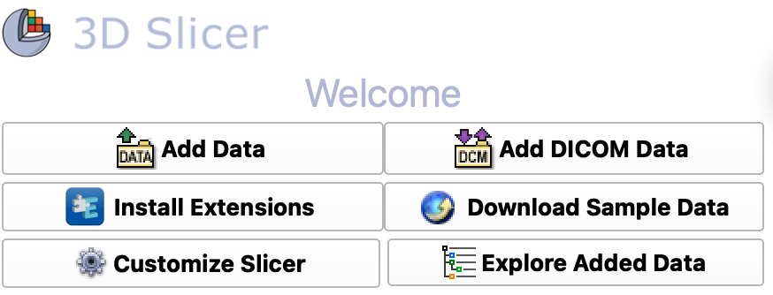{ width="400"}

3. Select "CTChest"

4. Wait... Slicer will download the volume to your computer.

5. After some time, you should see CT cross-sections in the 2D Viewers.

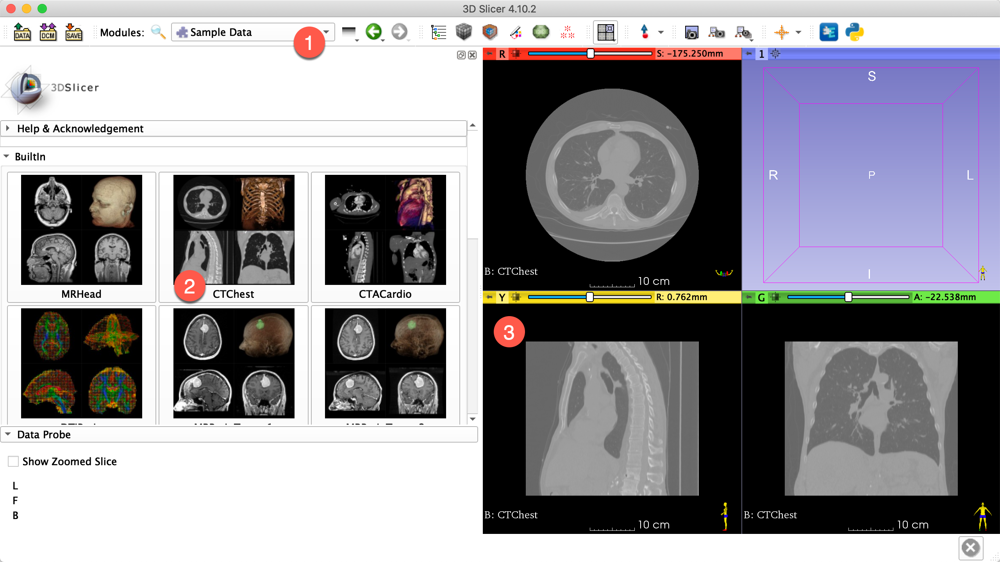{ width="450"}

??? question "Which panel shows the original data as it was capture and which panels show the Multiplanar reconstructions"

    CT data is captured along the axial plane, which is shown in the Red Viewer (Coronal Slices). You can tell because this data set is circular (actually columnar). The other two viewers display the [MPRs](http://www.wikiradiography.net/page/Multiplanar+Reconstruction+(MPR)).

### Layout Menu

The organization of the viewers can be set in the Layout menu, found in the toolbar:

![four up layout view menu][four_up]

Select the "Four-Up" view from the toolbar if you currently don't have that layout.

[four_up]:images/layout-menu-4up.png

### Data Module

The `Data` module keeps track of the volumes that you have loaded into Slicer. To open the `Data` module, click on the data icon:

{ width="50"}

In the Data Module, you should now see CTChest listed in the Node Table, under the Subject hierarchy tab.

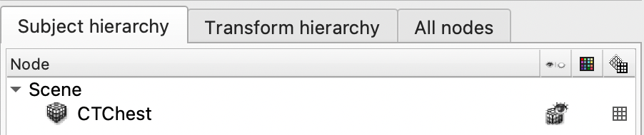{ width="350"}

You can hide the volume by clicking on the little cube with the eye icon on it. Make sure to un-hide the volume before continuing.

To remove the volume from Slicer, right-click on the "CTChest" and select "Delete". Don't do this, but if you did, simply re-download the volume.

## Navigation and Control

To explore the dataset, you will want to scroll through the slices, zoom in, or drag th image around.

!!! note "The following are specific to each viewer. So, move the mouse over one of the viewers before attempting."

### Scrubbing

Scrubbing means to scroll through the individual images that make up an image volume. You can scrub through all of the viewers.

- **Scrubbing by Scrolling.** Using your mouse or trackpad, scroll up and down over one of the 2D image views stacks to scrub through the images
- **Scrubbing by Arrow Keys.** The arrow keys work (useful for fine scrubbing) Click on one of the image datasets and then click on the up or down arrows.Left/Right or Up/Down?

### Pan and Zoom

Panning is used to move the images around. Zooming enlarges the image

- **Panning.** Hold down the shift button and drag. The slice moves around in the window

- **Zooming.** Hold down the command (mac) or control (windows) button and drag. The slice zooms in and out

### Fit to Window

If you mess things up, you can return the volume back to the default location by clicking on the "Fit to Window" icon in the Viewer's top toolbar menu.

{ width="30"}
>"Fit to Window" icon for the green viewer.

### Slice Alignment

You can align the location of all three viewers, by **holding down the shift button** as you move the mouse around one of the viewers. Notice how the other views become synchronized to the location to which the mouse is pointing.

## Data Probe

The data probe returns information about the image under the mouse arrow head, so  move the cursor over one of the images. Here is an example of what you might see if you over the mouse arrow over the red panel:

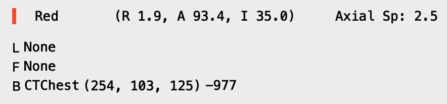{ width="350"}

??? question "What does this information mean?"

    It is the Coordinate and Intensity Information about the voxel beneath the arrow head

    In the above example,

    - "Red" means red panel
    - (R 1.9, A 93.4, I, 35) Anatomical coordinate information in RAS space. So, in this case, Right, Anterior, and Inferior. 
    - B CTChest (254, 103, 125) -977 indicates the image Coordinate information with intensity data, as follows: (X,Y,Z) I

??? question "What intensity value is bone? Air? tissue?"

    Since this is CT data, the intensity values should be calibrated to Hounsfield Units. Air should be -1000, Bone should be greater than 500. Tissue should be somewhere between 0 and 100.  

??? question "What does RAS mean?"

    It's an anatomical coordinate system: RAS (Right, Anterior, Superior). Other systems use LPS (Left, Posterior, Superior)

??? question "What do L, F, and B stand for?"

    These are layer indicators in Slicer

    - **L**: label (i.e. segmentations)
    - **F**: foreground
    - **B**: background

    Volumes by default are loaded into the background, so in this example our data is loaded into the background layer. The information shown is the image coordinate system (and intensity) of the CTChest volume.

For more information, review the [Slicer Coordinate Systems](https://www.slicer.org/wiki/Coordinate_systems) documentation.

## Volume Module

The Volume module contains information about the active volume.

- Select the "Volumes" module: ![][volumes_module_button]

[volumes_module_button]:images/volumes_module_button.png

- Set the active volume to CTChest (if its not already that)

There should only be one volume to choose in the active volume menu. If there are more than one volume, than you have inadvertently loaded multiple volumes. Be sure to select the correct volume "CTChest"

### Volume Information Tab

1. Open the "Volume Information" Tab (if it's not opened):

    { width="150"}

    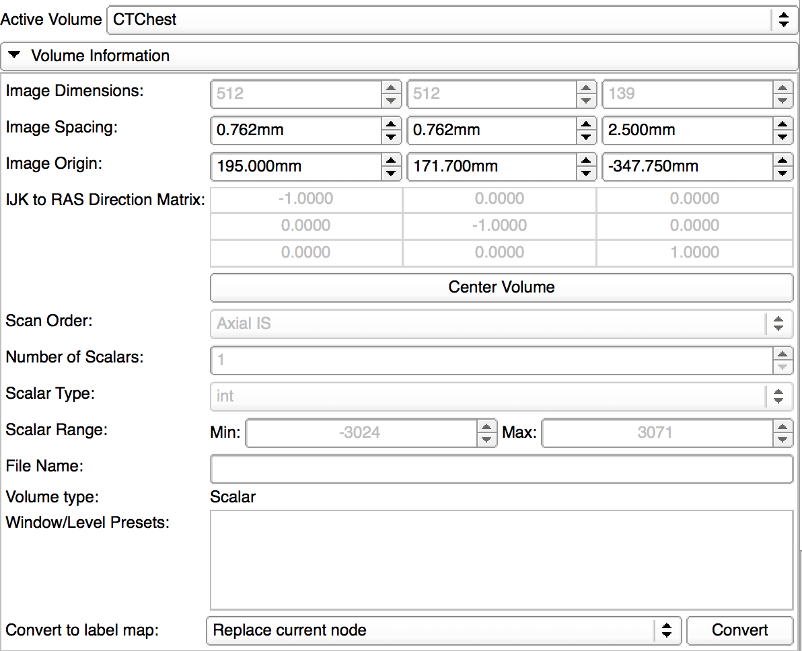{ width="450"}

??? question "What is the size of the image stack?"

    512 x 512 x 139 (X, Y, Z)

??? question "What is the dimension of a voxel in the X-Y Dimension? In the Z?"

    0.762 X 0.762 mm height and width
    2.5 mm depth

??? question "Are the voxels [isotropic](http://www.wikiwand.com/en/Isotropy) or [anisotropic](http://www.wikiwand.com/en/Anisotropy)?"

    anisotropic

??? question "Compare the resolution of the images in the red panel vs the Green and Yellow panels? Do you notice any difference in the resolution? If so, why do you think this is?"

    In the axial view (red viewer), we are see the XY side of the voxel. These are packed more close together, so the resolution appears higher. In the other two viewers, we are seeing multiplanar reconstrutions (MPR) of the voxels, so the XZ or YZ sides, which are spaced further apart, since the voxels are anisotropic.

??? question "What is the range of intensity values for this dataset? What is the likely bit depth of this stack?"

    The Scalar Range tells you the intensity range, so -3024 to 3071. This is likely a 16-bit image, since the range has more than 6000 different values.

### Display

We can adjust the contrast or change the Lookup table using the controls in the Display tab.

Click on the triangle icon besides the Name "Display" to reveal the display controls

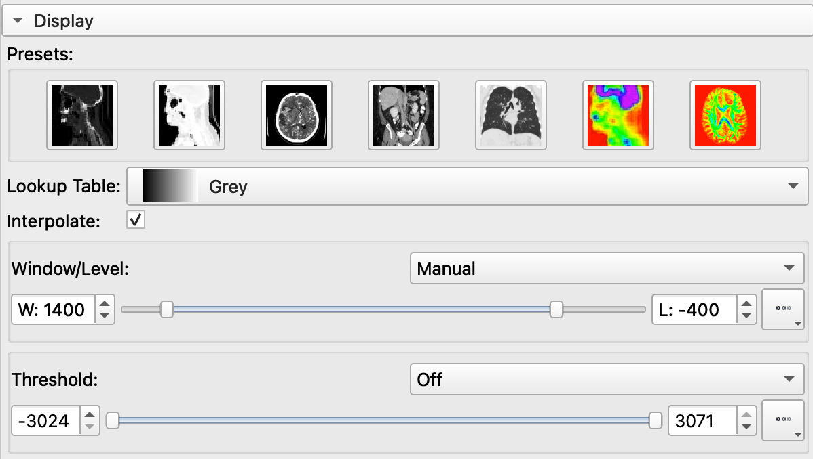{ width="450"}

Window/Level is the main way that radiologists adjust the contrast in CT (and X-rays). In the display tab, you can see a series of seven icons that represent different Window/Level presets:

- Click on these presets sequentially to see how they affect the image display
- Notice how the Window/Level slider changes with each preset

You can also adjust the Lookup table. Try different LUTs for the LULz.

#### Histogram

To better understand the Window/Level settings, reveal the histogram display by clicking on the triangle icon next the Histogram Header:

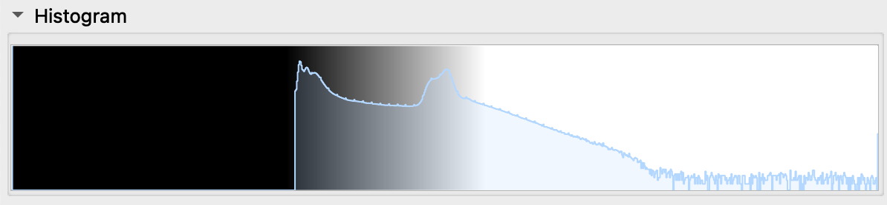{ width="450"}

>Here you see the plot of the image histogram (blue line). There is also a black-white gradient overlaid on the blue. This gradient indicates the Window/Level settings.
  
    - Change the Window/Level Presets and notice what happens to the gradient
    - Drag the Window/Level sliders back and forth and notice what happens to the gradient and the image display

In summary, the Window/Level doesn't change the image histogram, it changes the mapping of the lookup table (changing what is displayed as black and what is displayed as white, and what is displayed as gray in between). Level sets the black and white levels. Window determines the distance between the black and white levels (and the intensities that are shown as gray).

#### Mouse Control of Window / Level

You can also control the Window/Level settings using the mouse and dragging on the image

1. First, click on the Window/Level Tool in the toolbar

    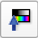{ width="50"}

2. The click-and-drag on the image in one of the viewers.

    - Dragging up and down adjusts the levels
    - Dragging left and right adjusts the window sizes
3. When you are done, deselect the Window/Level tool by clicking on the White Arrow tool, so you can get back to scrubbing through the images.

##### Selection Mode

If instead you would like to set the window / level based on the pixel intensity of a certain region of the image, you switch to "Select region" or "Select region - centered" mode, hold down on the triangle icon next to the  Adjust Window Level icon to bring up the context menu:

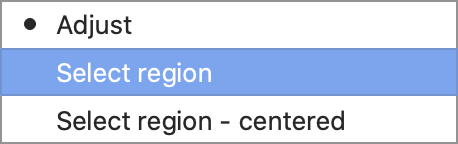{ width="250"}

Once the "Select region" menu item is selected, then you can draw a rectangular region on the volume slice and the W/L settings will automatically be adjusted.

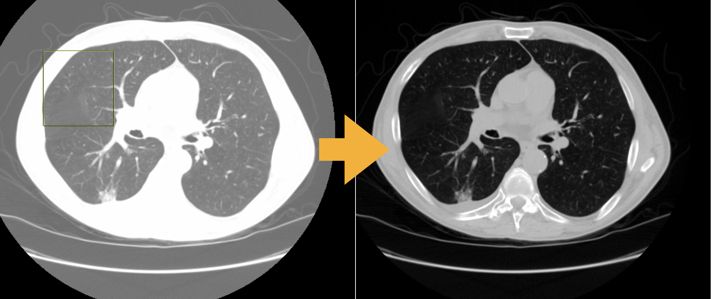{ width="250"}

To exit the Window/leveling mode, click on the white arrow button next the adjustment button in the toolbar: 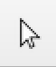{ width="20"}

## Display Slices in 3D

{ width="550"}

You can display the 2D slices in the 3D viewer as follows:

1. Click on the pushpin icon located on the far left of the red viewer controller to bring up the red viewer menu:

    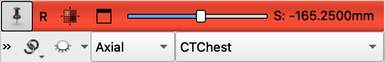{ width="250"}

2. In the viewer menu, click on the eye icon ("Toggle Slice visibility in 3D view").

    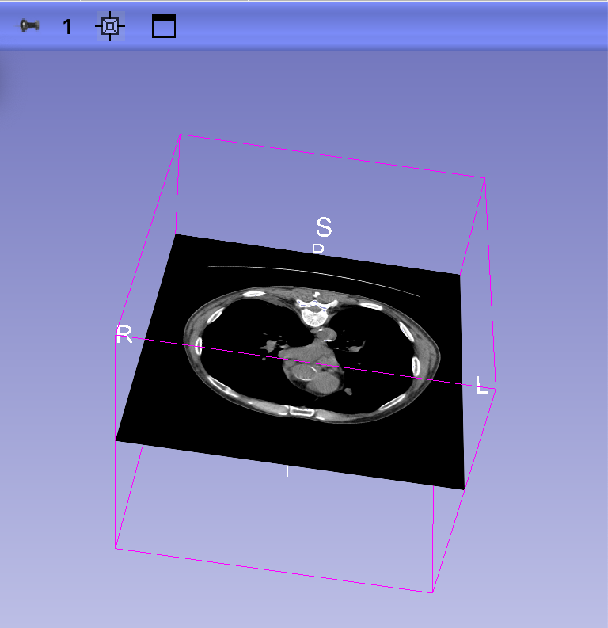{ width="250"}

    - You should now see a slice floating in space in the 3D viewer.
    - Drag around the 3D viewer to reorient the slice in space
    - Scrub through the image slices in the Red Viewer. Notice that the position of the 3D slice changes in 3D space

3. Repeat the process for all three viewer menus (click on the eye for all three viewers)

    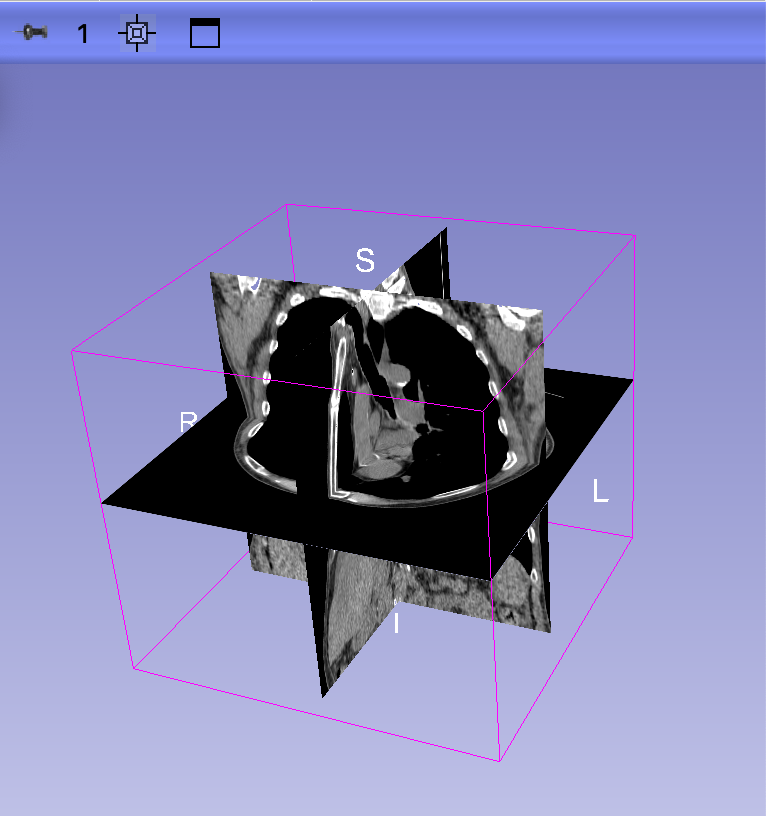{ width="300"}

    - enjoy three orthogonal slices in 3D
    - Tip: Try adjusting the Left Threshold slider in the Volumes Module. What happens?
  
  Basic controls of 3D Viewer
    - **Rotate:** drag on 3D view
    - **Pan:** shift-drag on 3D view to reposition the slices
    - **Zoom:** scroll on the 3D view or  (or click on + or -) - to zoom in and out
    - **Recenter:** click on the "Fit to Window" icon
  
  Slices are linked between the 2D and 3D views
    - Scrub around 2D slice viewers to reposition the slices in 3D space.
    - Or drag the Slice Viewer sliders. That's fun too.
    - Click on the "Fit to window" icon to reposition slice back to center
  
### Make Global changes to the Slice views

   1. In the Red Viewer menu, click on the chain link icon to link the chain.
   2. Click on the Eye Icon to close the eye and hide all three slices from the 3D viewer (the chain link icon links the views across the 3 viewers)
  
### Add Orientation Markers

To track the orientation of the volume in the viewers, you can add a little human orientation marker, like this guy:

{ width="50"}

To do so:

1. Click on the **Push Pin** icon to bring up the **view controls**  

2. Click on the `>>` button to show more options

    - Notice that CTChest is shown in the Background (B) Layer.

    - Notice that there are no other volumes currently being shown, since we have only loaded one volume
3. Click on the "Orientation Marker Options" (axes icon)
4. Select "Small" "Human"
5. You should now see the following **little guy** in the corner of the slice viewers
6. Hide the "more controls" by clicking on the "<<" button

!!! tip "Adjust Settings to add little human and remove slice edges"

    If you want these orientation markers to be added on launch of Slicer, you can set the default the Slicer Settings. You can also remove those annoying Slice Edge views
    
    Review the [Customize Slicer Page](CustomizeSlicer.md) for more detailed information on hwo to do this

### Adjust 3D Slice display

By default, each orthogonal slice in the 3D viewer is displayed as a rectangular plane. If there is extraneous information in the plane (like area where data was not generated), you can remove that area using the threshold setting in the Volumes Module

1. Switch the Volumes module

    ![][volumes_module_button]

2. In the display tab, slide the left threshold slider to the right

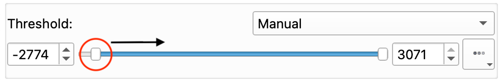{ width="350"}

- the axial plane in the 3D viewer is now a circular (displaying only the data that was captured)

    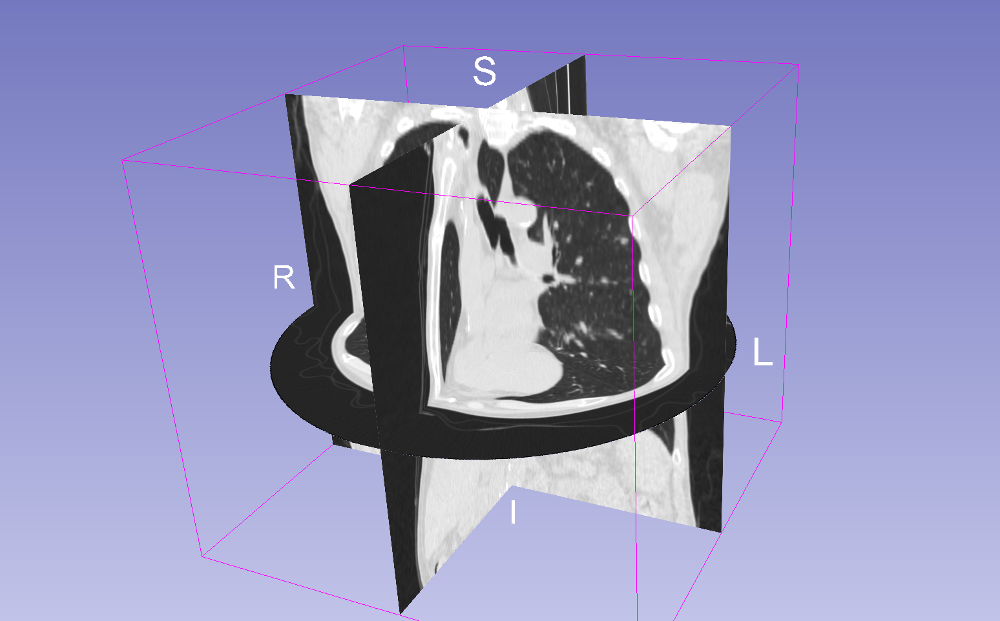{ width="250"}

- if you keep sliding to the right, you can remove much of what is displayed as black in the orthogonal planes

### 3D View Controls

In the 3D viewer menu (blue), click on the push-pin to reveal the 3D view controls

![][img_3d_controller]{width=600px}

1. Change the Viewpoint direction
2. **Zoom by Plus and Minus keys.** Click on the Plus and Minus keys to zoom in and out of the 3D view

[img_3d_controller]: https://github.com/Slicer/Slicer/releases/download/docs-resources/user_interface_3d_view_controls.png

!!! note "Be sure to hide the orthogonal planes from the 3D viewer (as described above) before continuing."

## Volume Rendering

The Volume rendering module displays the whole volume in the 3D viewer (not just a slice). Volume rendering modifies voxel transparencies to reveal internal structures. For example, the default setting often sets any air voxels (Hounsfield unit = -1000) transparent, so you can see what was imaged in the machine. So, in Volume Rendering, you are visualizing the data volume, with varying transparency settings for different voxel intensities so you can see "inside."

Let's visualize the CTChest using Volume Rendering.

1. Switch to the Volume Rendering module by selecting it in the Module Menu (in the toolbar) or by clicking on the Volume Rendering toolbar button:

    { width="100"}

2. Review the Volume Rendering Module
3. Set the Volume to CTChest
4. Click on the eye icon next to Volume:CTChest to open the eye
        ![][ctchest_vol_render]{width=350px}

5. The volume should now be rendered in the 3D Viewer

    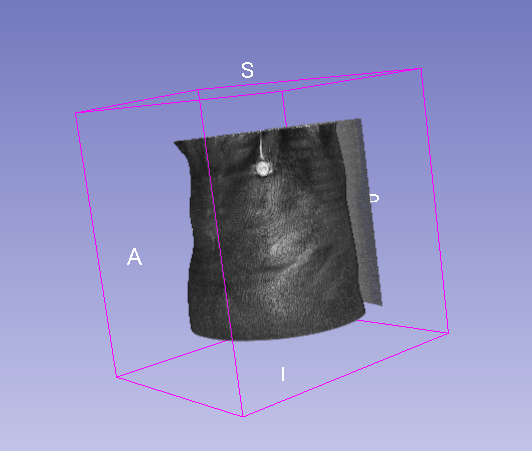{ width="250"}

    - Drag the shift slider left and right to modify the transparency of the voxels

[ctchest_vol_render]: images/CTChest-vol-rendering-module.png

### Display Presets

Slicer includes several volume render presets (similar to Window/Level settings) to optimize uncovering certain anatomical structures, like bones.

1. Try all of the different presets in the Preset menus
2. Compare VTK CPU Ray Casting and GPU Ray Casting

#### Advanced Tab

In the Techniques Tab under the Advanced Tab, you can tweak what the rendering looks like. Tread carefully here...

- Quality Control - Adaptive
- Advanced Rendering Properties - Composite with shading
  - Notice you can switch to MIPs. Keep "Composite with shading"

### Crop the Render

You can crop the render to see inside structures. To do so

1. Select the "CT-Cropped-Volume-Bone" preset
2. In the Crop row of the Display tab: Check on Enable Crop and click on the eye icon next to "Display ROI"
3. A colored cube should now surround your volume
4. Resize the cube by pulling on the colored handles. You can also adjust these handles in the 2D viewers

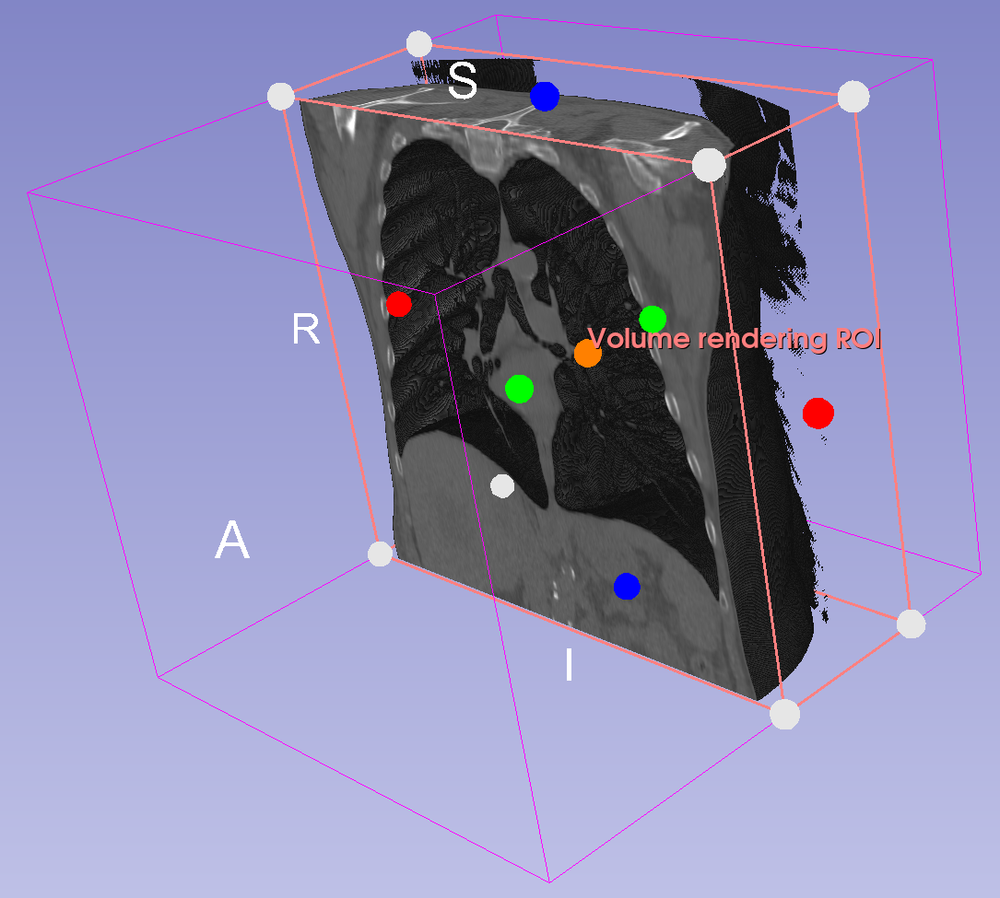{ width="350"}

- Try other presets

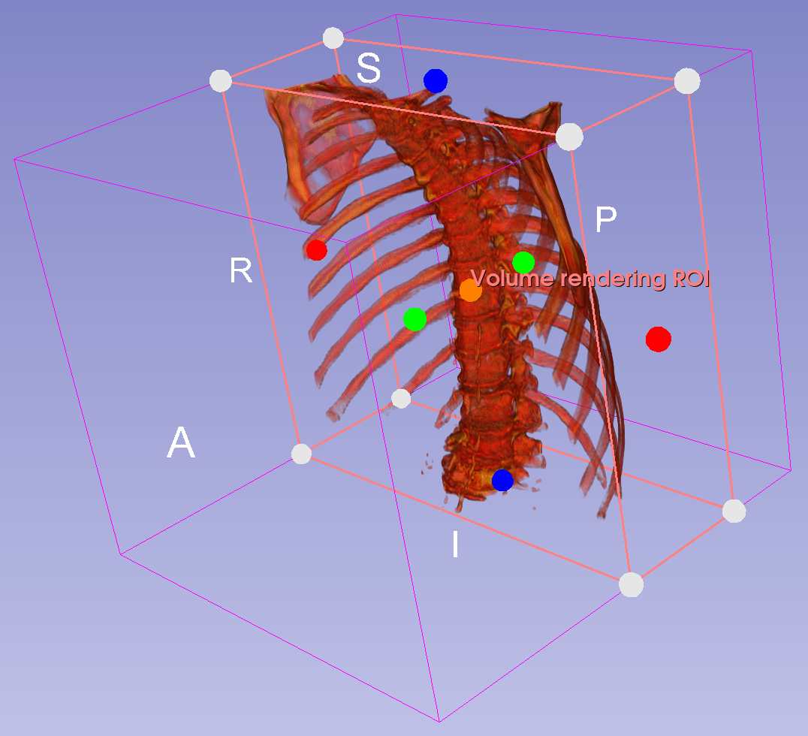{ width="350"}  

### Orthogonal Slices

We can add the orthogonal slices back to the 3D Viewer to show the render intersecting with the cross-section

1. Return to the Slice Viewer Controller for the axial plane.
2. Click on the "Show in 3D" eye icon to show the red plane orthogonal slice.
3. Enjoy a 3D Render with an orthogonal Slice

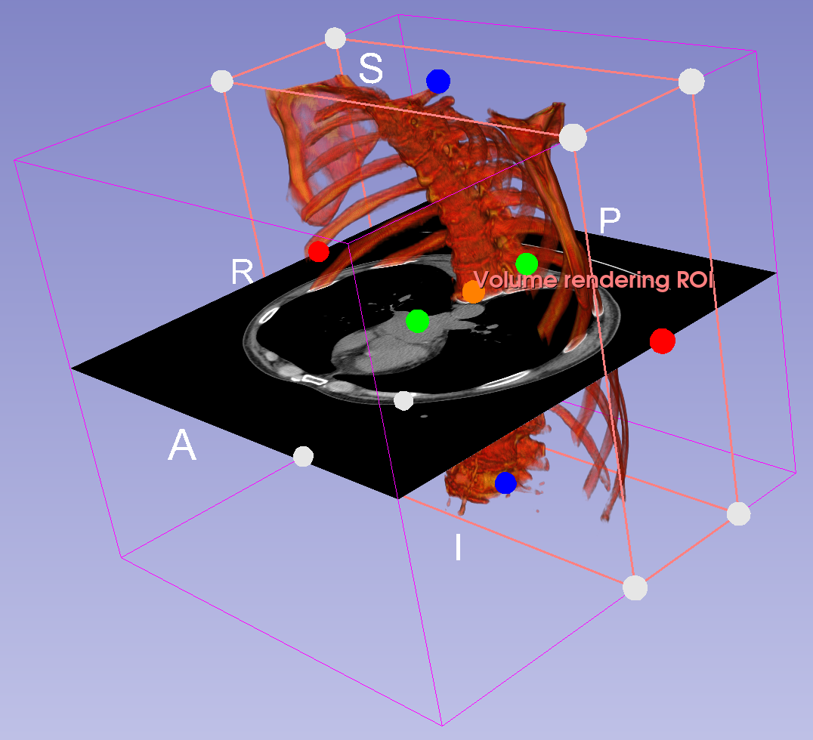{ width="350"}

* What happens to the slice in the 3D window as you scroll over the view axial viewing pane?

## Screenshot - capture

Slicer includes tools to create images from the slice and 3D viewer. You have more control over the resolution and format of these images if you use the Slicer tool vs your own screen capture software.

To capture a screenshot:

1. Click on the Screenshot button

    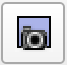{ width="30"}

2. Name your screen shot "CTChest"

3. Select "Full Layout" and click ok

## Save your Work

Saving in Slicer is a bit overwrought. To save, click on the save button in the toolbar.

{ width="30"}

You will then be presented with a save dialog:

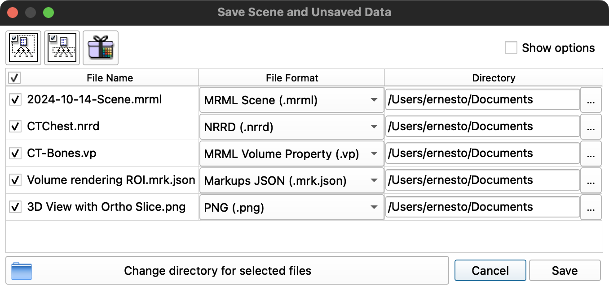{ width="450"}

Notice there are several different file types to save:

| Type     | Description                                                  |
| -------- | ------------------------------------------------------------ |
| **MRML** | a Scene file, which preserves the current view in slicer     |
| **NRRD** | a volume format specific to Slicer                           |
| **VP**   | a special format to store the display properties of the Volume render |
| **JSON** | a structure format to store the ROIs                         |
| **PNG**  | the snapshot we took        |

So, each time you work with a volume in Slicer, you generate a lot of files, and these files should be packaged together.

!!! warning "Create a new folder for each new Slicer Project"

    Notice the default location to save your files is at the top level of the Documents folder. **Do not save your files here!** It will make a mess of your Slicer projects by dumping all your files into one big disorganized pile. Since Slicer generates the same default file names for new projects, you also run the risk of overwriting old projects. Instead, you should create a new folder for each slicer project that you work on.

We are working on the CTChest volume, so let's create a new folder called CTChest.

1. Make sure that all of the files are checked on the left-hand side.
2. Click on the on the "Change directory for selected files" button.  
3. A File Dialog will appear.
4. Create a new folder called CTChest. Place it on your desktop
5. Select this folder
6. Click OK.
7. Now the Slicer Save dialog should look like the following:

    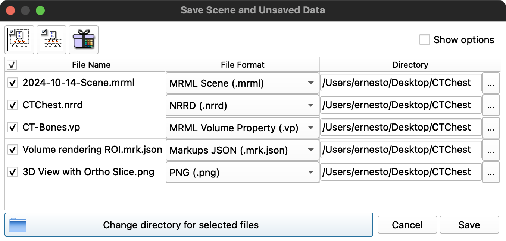{ width="450"}

   - Now all of the files will now be saved in the CTChest Folder on the Desktop

8. Click Save.
