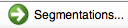
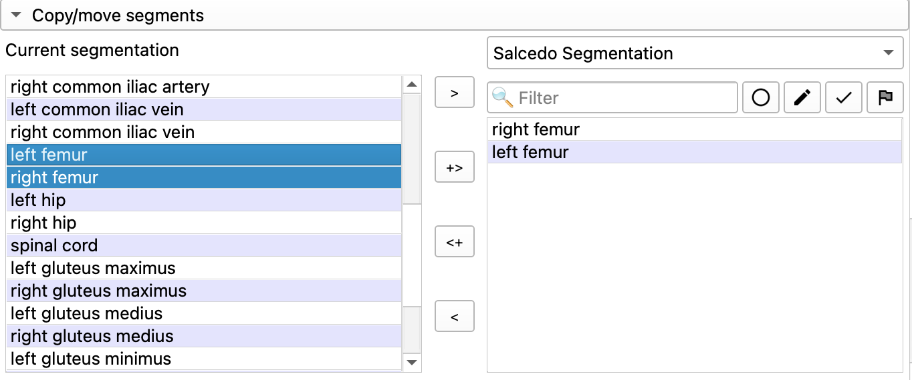
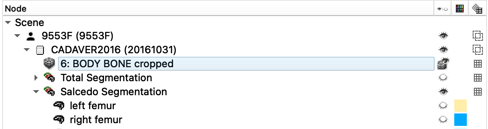
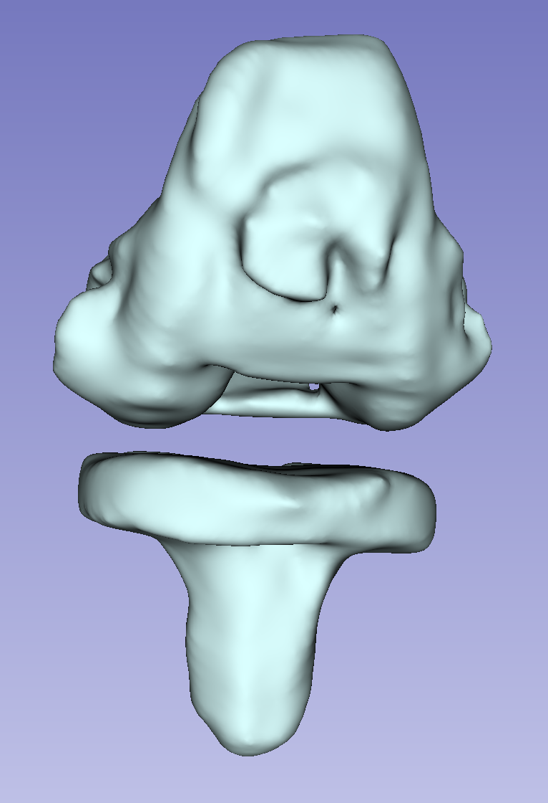
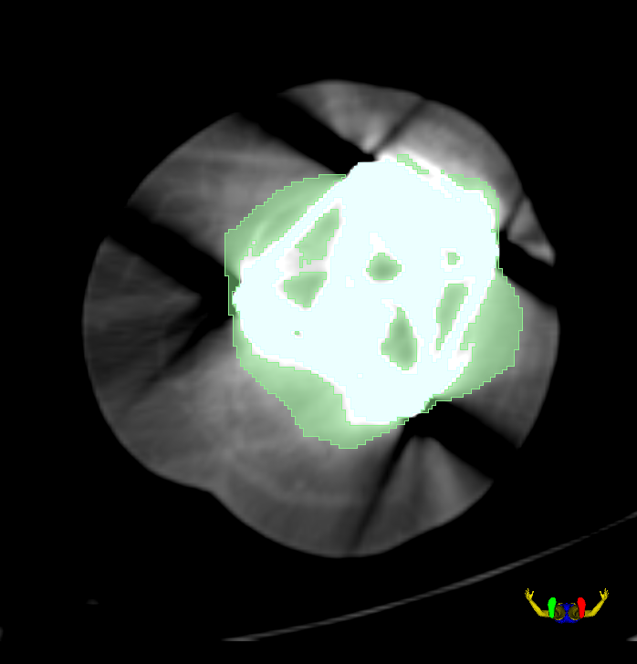
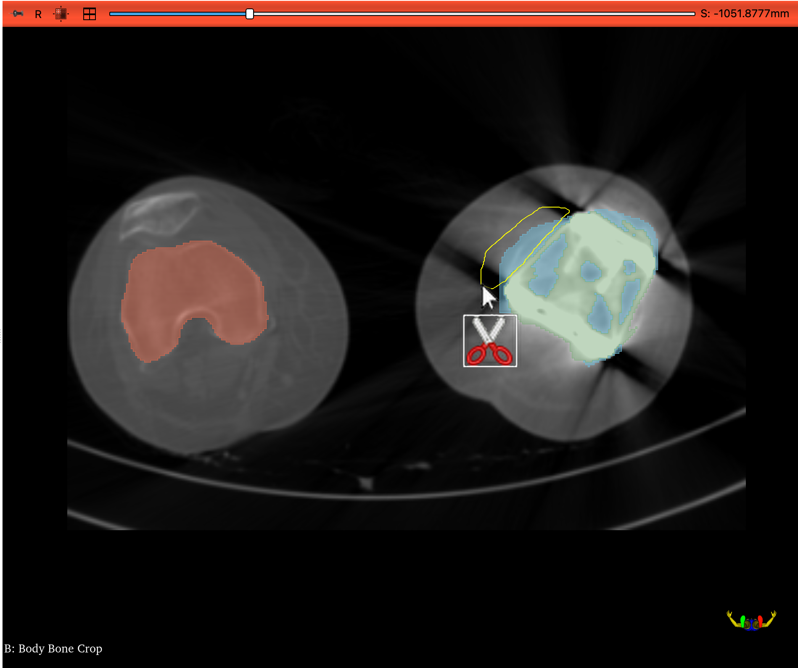
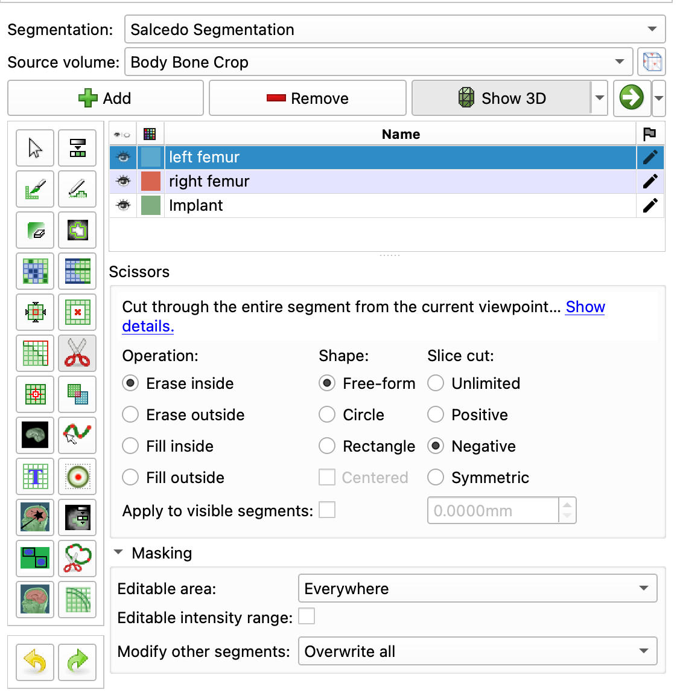
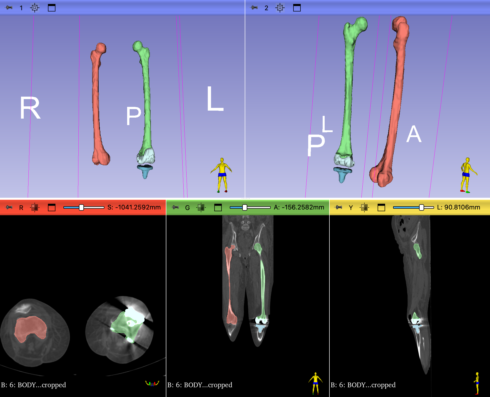

# Femur Segmentation

In this module, we will segment the Pelvis, Femurs, and Knee implants from the 9553F DICOM dataset.

## LOAD DICOM Volume

Load the 9553F Body Bone dataset into Slicer. If you haven't done so already, you'll need to [import the DICOM dataset](ImportDICOMDataset.md) first.

{ width="450"}
> Note: you won't see the 3D render until you follow [Volume Rendering](#volume-rendering) steps below. If the volume looks messed up in the 2D viewers (a weirdly shaped head), review the [Import DICOM datasets documentation](ImportDICOMDataset.md) to fix the problem.

## Volumes Module

{ width="50"}

Bring up the Volumes Module and review the Volumes Information tab.

!!! abstract "Volumes Information"

    { width="450"}
    
    - This volume has `512 x 512 x 473` voxels (124 million voxels)
    - The volume also anisotropic voxels with dimensions of `0.98mm x 0.98mm x 3.5mm`

When segmenting, it helps to adjust the contrast so that the target anatomy (e.g. the femur) is brighter than the rest of the tissue.

!!! abstract "Set Volumes LUT Preset"

    Under the Display tab, Select the CT Bone Window Level Preset.

    { width="50"} 

    Your volume should have the contrast shown in the right column (CT Bone LUT). 
        
    { width="450"}
    
    Notice how using this LUT deemphasizes the tissue (almost black) while highlighting the bone (almost bright white).

## Volume Rendering

{ width="150"}

Volume Rendering is useful for exploring a volume and quickly rendering anatomical structures. This is NOT a substitute for segmentation. Volume rendering is mostly for display purposes only. For example, there is nothing to export from a volume rendering. That being said, it is often useful to quickly render anatomical structures before segmenting.

Switch to the Volume Rendering Module and select the 'Body Bone' volume from the pop up menu of the `Volume` setting

{ width="450"}

!!! example "Revealing internal structures using Volume Rendering"

    In the Display tab
    
    1. Adjust the **Shift** slider to reveal a render of the cadaver
    2. `Preset`: Select the 'CT-AAA' to reveal a render of the cadaver's skeletal system
   
    The goal is to reveal the following:

    { width="450"}

    >Notice how the femur heads and lower flanges are darker than the rest of the femur. This indicates a level of bone degeneration that would be expected in an older female with a knee replacement.

!!! tip "Bonus Render: Reveal implant"

    Slide the Shift slider to the right to reveal the implant in the left knee. There are two parts to the implant: one in the femur and one in the tibia.
    
    { width="450"}

Before continuing, select the`CT-AAA` to again render the skeletal system. Notice how the implants create a spiky distortion in the CT scan around the knee

### Create a precise ROI for cropping

Cropping the volume is a critical step for segmentation. It helps reduce the memory load (and avoid crashes) by eliminating parts of the volume that are not relevant to your project. We can create an ROI in the **Volume Rendering** module, but then the ROI has to be manually drawn.

For this exercise, we instead want to create an ROI with precise coordinates. This will allow us to compare our segmentations in a future exercise. To create a precise ROI, we need the Markup tools.

#### Load ROI

1. Click on the **Add DATA** button
2. Select `Choose Files to Add`
3. Navigate to the MATLAB drive (Unit 3/data) and select "PelvisFemurROI.mrk.json"
4. Click **OK**.

??? abstract "Manually Create ROI"

    If you don't have access to the file, manually create the ROI as follows:

    1. Switch to the **Markups** module
    2. Click on the ROI icon to create a new ROI { width="45"}
    3. Rename the ROI "PelvisFemurROI"
    4. Enter the following settings:

    { width="450"}

#### Render ROI

1. Switch back to the **Volume Rendering** module
   1. Set **ROI** to your new "PelvisFemurROI"
   2. Enable Crop - the skeleton should be cropped down to the femur and pelvis
   3. Turn off Volume Rendering
   4. Turn off **Display ROI**

{ width="450"}

### Crop Volume

Now we use our ROI to crop the volume. Switch to the **Crop Volume** module and enter the following settings:

!!! abstract "Crop Volume Settings"

    { width="450"}

    **IO tab**

    - Input Volume: `BODY BONE`
    - Input ROI: `PelvisFemurRoi`
    - Output volume: select "Create new volume as..." and enter "BODY BONE crop"
    
    **Advanced tab:** Be sure to check "Interpolated cropping" and "Isotropic space". Set the `Spacing Scale` to `1.10x` and select "B-spline".
    
    **Volume Information tab:** `Input Volume` indicates the dimensions of the original Body Bone volume. `Cropped volume` indicates the dimensions of the volume to be created. Notice how we will get fewer rows and columns, but more z-slices

When you have set all of the settings, click "Apply".
   - This might take a bit, so don't panic if you get the spinning disk of death.
   - This may also end anticlimactically - nothing may seem to happen.

??? tip "ABOUT ISOTROPIC SPACING and the Spacing Scale setting"
    What isotropic spacing actually does is up- or downsample the 3D volume. Basically, you are adding or subtracting rows, columns, or slices. Subtracting rows and columns means that you are downsampling, which should ultimately create a smaller volume, which in turns saves memory (and hopefully avoids crashing Slicer). Ultimately, you want the total volume loaded into Slicer to take only 1/10 the amount of RAM that is available on your system. For 3D processing, you rarely benefit from having high in-plane resolution if distance between planes is large. For example, a volume of `2500 x 2500 x 500` (with spacing of `0.1x0.1x0.5`) will give you approximately same quality 3D reconstructions as a volume of `500 x 500 x 500` (with spacing of `0.5x0.5x0.5`). This means we rarely want to upsample and instead should use a larger Spacing scale setting to downsample the volume (even larger than shown here). See the discussion here: [Is there a way to reduce the CPU usage and reduce the amount of RAM used? - #3 by goetzf - Support - 3D Slicer Community](https://discourse.slicer.org/t/is-there-a-way-to-reduce-the-cpu-usage-and-reduce-the-amount-of-ram-used/3181/3)

### Data Review

{ width="50"}

Review the Data module, which displays a hierarchy of the loaded volumes and other relevant data

{ width="450"}

You should see the new `BODY BONE crop` volume in this list.

1. **Display Crop Volume:** To display the new crop volume, click on the eye-cube icon in the `BODY BONE crop` row. This should display this volume in the slice viewers and hide the other volume.
2. **Delete Original Volume:** Right-Click on the original "6 BODY BONE" volume and select "delete".
    - We won't need this volume any more and deleting it will help save on computer memory (and avoid slicer crashes).
    - Also, we can always reload the volume from the DICOM dataset if needed.
3. **Hide the PelvisFemurRoi** by clicking on the corresponding eye-icon.
4. In the **Volumes** module, turn on the CT-bone preset for the `BODY BONE crop` volume

### Save Your Data

Now would be a good time to save your data. Remember, you need to create a new folder to save this project. You can call it something like "CTFemur"

??? tip "Saving Tips and Reminders"

    **How to create a New Folder**. 

    Notice in the directory column that each file has a default path. We want to change the folder paths for all of these files so that they are stored in the same new folder. To do so, do the following:

    - Ensure that all of the files are checked. 
    - Click on the "Change directory for selected files" 
    - In the dialog the pops-up, navigate to the location where you want to create your folder. The Documents folder is a good place to start (Macs should avoid saving stuff on the desktop as it can slow down your computer.).
    - Create a new folder in that location
    - Call this folder "CTFemur" or something similar. And select OK. 

    **Save everything**

    - Every file should now have the same path in the directory column 
    - Every file should be checked in the check column.
    - Click on the Save Button. 

## Segmentation

To segment, we are going to use the Total Segmentator Extension. Make sure that you have [the extension installed](CustomizeSlicer.md) before proceeding.

### Total Segmentator

Open the **Total Segmentator Module** (Segmentation:Total Segmentator) and use the following settings:

#### Inputs

- `Input Volume`: BODY BONE crop (**Important**: make sure you select the cropped volume)
- `Segmentation task`: total
- `Fast`: checked on

#### Outputs

- `Segmentation`: Create New Segmentation

Click **APPLY** and wait.

Eventually, you will see a series of colorful segmentations added to the 2D slice viewers.

### Creating a New Segmentation Volume and copying segments

The segmentations created by Total Segmentator will serve as our base segmentations. But as we'll soon see, these segmentations are not entirely accurate. So, in this next step, we copy the segments generated by Total Segmentator to a new segmentation node.

#### Create a new segmentation node

{ width="24"}

Switch to the Segment Editor module.  You should see the TotalSegmentator segmentation. This node is likely called something like "Body Bone Crop Segmentation."

1. From the `Segmentation` pop-up menu, rename the segmentation "Total Segmentation"
2. The node should be renamed
3. Again from  the `Segmentation` pop-up menu, select "Create New Segmentation as…"
4. Create a new Segmentation called  "YourLastName Segmentation" (e.g. Salcedo Segmentation)

#### Copy Segments

{ width="150"}

Switch to the segmentations module by clicking on the green arrow icon in the Segment Editor module (or choosing Segmentations from the Modules Menu).

In the node window at the top, select the Total Segmentation node.

You should now see a list of all the segmentations that are part of that node (like "right kidney" or "left kidney"). Scroll down to the "Copy/Move Segments" panel.

To copy the femur segments, use the following steps:

1. Open the Tab
2. On the left side you should see all the Total Segmentator segments
3. Scroll through the segmentations and find the "left femur" and "right femur"
4. Select both using command- or control-clicking
5. On the right side, select the new segmentation node you created (e.g. Salcedo Segmentation)
6. Click on the `+>` to copy the segments over to your new segmentation node

{ width="450"}
>Copy/move segments panel in the Segmentations Module

### Review Copied Segmentats

Switch to the Data Module.

{ width="24"}

You should now see two Segmentations: one created by the Total Segmentator (and filled with Segmentations), and the one that you just created and that you copied the new segments to

{ width="450"}
> Screen shot of the Data module. Notice that the Total Segmentation has been hidden from view (eye icon closed)

Switch to the Segment Editor, Select your Segmentation (YourLastName Segmentation) and review the two femur segmentations. Notice that they look fairly reasonable but that there are some clear errors. For example the left femur at the knee implant is completely wrong.

### Smooth Cloned Segmentations

Switch to the **Smooth Tool** and smooth the Femurs using the following settings:

{ width="45"}

1. `Smoothing Method`: Gaussian
2. `Standard Deviation`: 2.0mm
3. Check `Apply to visible segments` (Make sure both Femurs are visible)

### Segment Implant

Switch to "Local Threshold" (included with the [SegmentEditorExtraEffects extension](CustomizeSlicer.md/#installing-extensions))

{ width="45"}

1. Create Two New Labels in the Segmentation Table: `femoral implant` and `tibial implant`
2. Hide the Femurs from display
3. `Threshold Range`: 1300-3000
4. Command- or control- click on the implant in the left knee (both the femoral and tibial implants)

Your implants should look like the following:

{ width="250"}

### Clean up Left Femur

The Left Femur segmentation is incorrect at the knee. It looks as if the implant is completely embedded inside the bone, but that is not how total knee implants work. Surgeons replace (saw off) the inferior distal end of the femur and the superior end of the tibia with metal components. The femur shaft is inserted into the implant, and the metal implant is exposed at the knee, separated by a plastic spacer.

{ width="250"} .jpeg){ width="250"}

So, to clean up the segmentation, we need remove any extraneous femoral segmentation at the level of the knee. If you review the left femur segmentation axially through the implant, you can see how the segmentation does not accurately represent the bone at the level of the implant. It just seems to have guessed where bone should have been. But in reality, that bone was cut away to make room for the implant. As you scrub axially through the implant, there should be a point where the actual femur disappears, as shown below:

{ width="450"}

>Left femur segmentation showing the implant in cyan and femur segmentation in green. The femur segmentation does not accurately represent the bone.

To remove this inaccurate segmentation, we are going to cut the segmentation at the level where the actual femur ends. Then we'll remove any femur segmentation inferior to that position.

It's easiest to find the bottom of femur in the Coronal (green) viewer. Hover the mouse at the base of the femur (just above the implant) while holding shift. The axial view should now show the corresponding view, as shown above.

!!! abstract "Slice Cut Femur Segmentation at base of actual femur"

    { width="48"} 

    Then, 
    
    Under masking, Select
    
    Erase the segmentation slice using the following steps:

    1. Switch to the **Erase tool**. 
    2. Select the **"left femur"** segmentation in the segmentation table
    3. Under masking, for `Editable Area`, select "left femur"
    4. Do not check anything else in the Erase details settings
    5. Scrub axially to the position shown in the above image
    6. Position the **erase tool** over the femur segmentation
    7. Increase the diameter of the tool by holding shift and scrubbing the mouse wheel
    8. When the diameter is larger than the Femur Segmentation, click on the slice
    9. The Femur segmentation (green) should disappear

There should now be a very evident break in the segmentation in the Coronal Slice viewer (as shown below):

{ width="450"}
>**Coronal view of Left Knee with Femur and Implant Segmentations. Left.** Femur Slice cut, as detailed above. **Right.** Segmentation removal inferior to slice cut, as detailed below.

!!! abstract "Remove Femur Segmentation inferior to Slice Cut"

    { width="48"}

    Switch to the Islands Tool and remove segmentation inferior to the slice cut as follows:

    1. Select "Remove Selected Island"
    2. In the Coronal Slicer viewer, click on the Femur Segmentation below the slice cut

There are still some remaining femur segmentation that artificially hangs outside the implant

!!! abstract "Final Segmentation Clean up"

    1. Switch to the Scissor tool
    2. Under masking, for `Editable Area`, select "left femur"
    3. Select `Slice cut` to "Negative" — this will help avoid cutting the femur head
    4. Trim any bone overhangs in the 3D view
    5. For trickier clean-up, switch to the Red Viewer and trim there
    6. Trim any femur segmentations that all outside the implant, as shown below.
    7. You may have to scrub through several slices along the implant to completely trim away the bone. 

    { width="450"}

    <!-- { width="450"} -->

## Final Result

{ width="650"}
