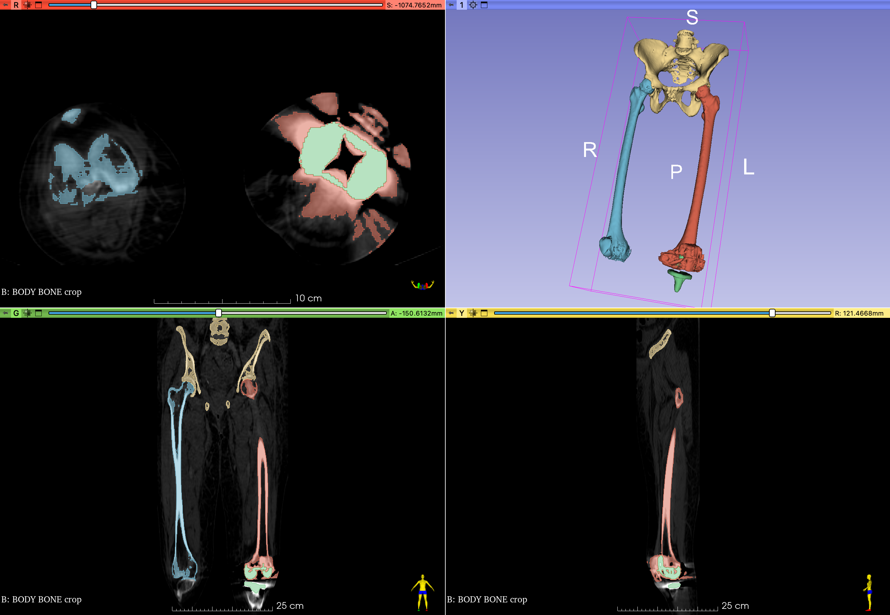

# Femur Segmentation 9553F

In this module, we will segment the Pelvis and Femurs from the 9553F DICOM dataset.

## LOAD DICOM Volume

Load the `9553F Body Bone` dataset into Slicer, as discussed in the [Import DICOM datasets documentation](ImportDICOMDataset.md). Alternatively, you can load the 6 Body Bone NRRD volume from the MATLAB drive.

{ width="450"}
> Note: you won't see the 3D render until you follow [Volume Rendering](#volume-rendering) steps below

## Volumes Module

{ width="50"}

Bring up the Volumes Module and review the Volumes Information tab.

!!! abstract "Volumes Information"

    { width="450"}
    
    - This volume has `512 x 512 x 473` voxels (124 million voxels)
    - The volume also anisotropic voxels with dimensions of `0.98mm x 0.98mm x 3.5mm`

When segmenting, it helps to adjust the contrast so that the target anatomy (e.g. the femur) is brighter than the rest of the tissue.

!!! abstract "Set Volumes LUT Preset"

    Under the Display tab, Select the CT Bone Window Level Preset.

    { width="50"} 

    Your volume should have the contrast shown in the right column (CT Bone LUT). 
        
    { width="450"}
    
    Notice how using this LUT deemphasizes the tissue (almost black) while highlighting the bone (almost bright white).

## Volume Rendering

{ width="150"}

Volume Rendering is useful for exploring a volume and quickly rendering anatomical structures. This is NOT a substitute for segmentation. This is mostly for display purposes only. For example, there is nothing to export from a volume rendering. That being said, it is often useful to quickly render anatomical structures before segmenting.

{ width="450"}

1. Bring up the Volume Rendering Module
2. Select the Body Bone volume from the pop up menu
3. Adjust the **Shift** slider to reveal a render of the cadaver
4. Select the CT-AAA to reveal a render of the cadaver's skeletal system
5. The goal is to reveal the following:

!!! example "Revealing internal structures using Volume Rendering"

    { width="450"}

    Notice how the femur heads and lower flanges are darker than the rest of the femur. This indicates a level of bone degeneration that would be expected in an older female with a knee replacement.

!!! tip "Bonus Render: Reveal implant"

    Slide the Shift slider to the right to reveal the implant in the left knee. There are two parts to the implant: one in the femur and one in the tibia.
    
    { width="450"}

Before continuing, select the`CT-AAA` to again render the skeletal system. Notice how the implants create a spiky distortion in the CT scan around the knee

### Create precise ROI for cropping

Cropping the volume is a critical step in Slicer as it helps reduce the memory load (and avoid crashes) by eliminating parts of the volume that are not relevant to your project. We can create an ROI in the **Volume Rendering** module, but then the ROI has to be manually drawn.

For this exercise, we instead want to create an ROI with precise coordinates. This will allow us to compare our segmentations in a future exercise. To create a precise ROI, we need the Markup tools.

#### Load ROI

1. Click on the **Add DATA** button
2. Select `Choose Files to Add`
3. Navigate to the MATLAB drive (Unit 3/data) and select "PelvisFemurROI.mrk.json"
4. Click **OK**.

??? abstract "Manually Create ROI"

    If you don't have access to the file, manually create the ROI as follows:

    1. Switch to the **Markups** module
    2. Click on the ROI icon to create a new ROI { width="45"}
    3. Rename the ROI "PelvisFemurROI"
    4. Enter the following settings

    { width="450"}

#### Render ROI

1. Switch back to the **Volume Rendering** module
   1. Set **ROI** to your new "PelvisFemurROI"
   2. Enable Crop - the skeleton should be cropped down to the femur and pelvis
   3. Turn off Volume Rendering
   4. Turn off **Display ROI**

{ width="450"}

### Crop Volume

Now we use our ROI to crop the volume. Switch to the **Crop Volume** module and enter the following settings:

!!! abstract "Crop Volume Settings"

    { width="450"}

    **IO tab**

    - Input Volume: `BODY BONE`
    - Input ROI: `PelvisFemurRoi`
    - Output volume: select "Create new volume as..." and enter "BODY BONE crop"
    
    **Advanced tab:** Be sure to check "Interpolated cropping" and "Isotropic space". Set the `Spacing Scale` to `1.10x` and select "B-spline".
    
    **Volume Information tab:** `Input Volume` indicates the dimensions of the original Body Bone volume. `Cropped volume` indicates the dimensions of the volume to be created. Notice how we will get fewer rows and columns, but more z-slices

When you have set all of the settings, click "Apply".
   - This might take a bit, so don't panic if you get the spinning disk of death.
   - This may also end anticlimactically - nothing may seem to happen.

??? tip "ABOUT ISOTROPIC SPACING and the Spacing Scale setting"
    What isotropic spacing actually does is up- or downsample the 3D volume. Basically, you are adding or subtracting rows, columns, or slices. Subtracting rows and columns means that you are downsampling, which should ultimately create a smaller volume, which in turns saves memory (and hopefully avoids crashing Slicer). Ultimately, you want the total volume loaded into Slicer to take only 1/10 the amount of RAM that is available on your system. For 3D processing, you rarely benefit from having high in-plane resolution if distance between planes is large. For example, a volume of `2500 x 2500 x 500` (with spacing of `0.1x0.1x0.5`) will give you approximately same quality 3D reconstructions as a volume of `500 x 500 x 500` (with spacing of `0.5x0.5x0.5`). This means we rarely want to upsample and instead should use a larger Spacing scale setting to downsample the volume (even larger than shown here). See the discussion here: [Is there a way to reduce the CPU usage and reduce the amount of RAM used? - #3 by goetzf - Support - 3D Slicer Community](https://discourse.slicer.org/t/is-there-a-way-to-reduce-the-cpu-usage-and-reduce-the-amount-of-ram-used/3181/3)

### Data Review

{ width="50"}

Review the Data module, which displays a hierarchy of the loaded volumes and other relevant data

{ width="450"}

You should see the new `BODY BONE crop` volume in this list.

1. **Display Crop Volume:** To display the new crop volume, click on the eye-cube icon in the `BODY BONE crop` row. This should display this volume in the slice viewers and hide the other volume. 
2. **Delete Original Volume:** Right-Click on the original "6 BODY BONE" volume and select "delete".
    - We won't need this volume any more and deleting it will help save on computer memory (and avoid slicer crashes).
    - Also, we can always reload the volume from the DICOM dataset if needed.
3. **Hide the PelvisFemurRoi** by clicking on the corresponding eye-icon.
4. In the **Volumes** module, turn on the CT-bone preset for the `BODY BONE crop` volume

### Save Your Data

Now would be a good time to save your data. Remember, you need to create a new folder to save this project. You can call it something like "CTFemur"

??? tip "Saving Tips and Reminders"

    **How to create a New Folder**. 

    Notice in the directory column that each file has a default path. We want to change the folder paths for all of these files so that they are stored in the same new folder. To do so, do the following:

    - Ensure that all of the files are checked. 
    - Click on the "Change directory for selected files" 
    - In the dialog the pops-up, navigate to the location where you want to create your folder. The Documents folder is a good place to start (Macs should avoid saving stuff on the desktop as it can slow down your computer.).
    - Create a new folder in that location
    - Call this folder "CTFemur" or something similar. And select OK. 

    **Save everything**

    - Every file should now have the same path in the directory column 
    - Every file should be checked in the check column.
    - Click on the Save Button. 

## Segment Editor

We are now ready to segment the femurs and pelvis.

{ width="250"}

1. Switch to **Segment editor module**
2. Rename the Segmentation as "Femur Segmentation"
   >{ width="350"}
3. Set the Master volume to "BODY BONE crop"
   >{ width="450"}
4. In the Data Module, there is now new Segmentation node called Femur Segmenation
>{ width="450"}
>
>When you click on Femur Segmentation, BODY BONE crop becomes highlighted in yellow, indicating that the volume is linked to the segmentation

### Add Segmentations to the Segmentation table

1. In the Segment Editor, add a new segmentation by clicking on the add button { width="25"}
2. Rename segmentation to "Skeleton" (double-click on the name to rename)
3. Add two more segmentations called "Femur_Left" and "Femur_Right"
4. Color to taste by double-clicking on the color swatches
   >{width="450"}
   >
   >With this set-up, we create three labels in our segmentation volume: One for skeleton, one for Femur-Right, one for Femur_left.

### Segmentation Strategy

To segment the femurs and pelvis, we will start by thresholding out the skeleton. Since bone has such a high contrast compared to the rest of the tissue, this should be relatively easy to accomplish using the local thresholding tool. Then, we will separate out the bones of interest from the skeleton.

{width="450"}

{width="150"}

1. Select the Skeleton Label in the Segmentation table.
2. Bring up the Threshold Tool
3. Set the **Threshold Range** to:  `137 - 1500`
4. Command- or Control- click on the skeleton in one of the 2D viewers.
   >{ width="250"}
5. To see the skeleton in 3D, click on the **Show 3D** button.
  >{ width="100"}
6. Enjoy a segmentation of the Skeleton.
   >{ width="450"}
   >
   >Notice that our threshold settings exclude the knee implant.

### Segment Right Femur

Now that we have a segmentation for the skeleton, we need to separate out the femurs. To do this, we will use a neat trick that involves painting the femur head in 3D and then changing the segmentation label of the femur using the **Island tools**. Review this video for an overview: [PERKlab - Create Femur Model](https://www.youtube.com/watch?v=0at15gjk-Ns)

#### Set-up editable intensity range and turn on 3D brush

Before painting, we want to restrict where we can paint.

1. Bring up the **Threshold tool** ![img-name][threshold-tool-button]{ width="25"}
2. Set the **Threshold Range** to:  `137 - 1500`
3. Click on the "Use for masking" button.
   - This changes the Masking settings.
   - Notice that the "editable intensity range" is now checked, which forces all segmenting tools to only label voxels that fall within that intensity range
4. Bring up the **Paint Tool** (if not active, already). { width="25"}
    - **Editable Area** should be set to `Everywhere`. Sometimes this gets switched to another setting and can cause confusion when you are unable to paint where you think you should be able to pain.
    - **Modify other segments** should be set to `Overwrite All`. This will allow you to overwrite one label with another, which you may need to do.
    - Ensure the **Editable intensity range** remains `checked`. This will force the Paint tool to only paint voxels that fall within that intensity range, which we set to capture bone intensities.
5. Activate **Sphere Brush** and **Edit in 3D Views**
   >{ width="450"}

[threshold-tool-button]: images/seg-editor-threshold-button.png

#### Segment right femur head

{ width="450"}

1. Select "Femur_Right" in the segmentation table.
2. In the 3D viewer, hold-shift and then hover the mouse pointer over the right femur head to align all viewers to this location
3. In the transverse viewer (Red viewer), scrub to a section that shows the femur head inserted into the pelvis
4. Move the mouse to the center of the femur head
5. Maximize the red slice and zoom in on the femur head
6. Adjust the size of the paintbrush by holding shift while scrolling the mouse
7. The size of the paintbrush should match the largest cross-section of the femur head.
    - You may need to scrub through several slices to find the largest cross-section.
    - Remember, you are using a sphere brush, so you are editing in 3D.
    - That is, you will be painting voxels that are both above and below the current slice. Keep an eye on the 3D view for reference
    >{ width="450"}
8. Once you have your paintbrush in position on the largest cross-section, **click the left mouse button** once.
9. The femur head should now be a different color from the skeleton—as long as you have selected the "Femur_Right" row in the segmentation table

!!! abstract "Right Femur Head separated from Shaft"
    
    { width="450"}
    
    Inspect your work. Make sure that the femur head is cleanly separated from the pelvis.

##### TIME TO SAVE YOUR WORK

- When you click on the Save button, you will get the "Save Scene and Unsaved Data" pop-up dialog
- Only the files that have changed will be checked. 
    - Usually it's the MRML Scence file and the Segmentation.seg.nrrd file. Don't check anything else—they don't need to be updated
- Click on "Save"
- Click on "Yes to ALL"

#### Segment the rest of the Right Femur

Once we have separated the femur head from the pelvis, the rest of the femur segmentation is as simple as a mouse click.

1. Switch to the Island Tool ![][island-tool-button]{ width="24"}
2. Select `Add Selected Island`
3. In the Coronal View (Green Slice Viewer), click on the femur, somewhere in the middle of the shaft
4. The Right Femur should now be labeled as such.

{ width="450"}
>Right Femur labeled in blue. Note, your femur head may have holes in it. This is because the intensity of the femur head has decreased (due to degeneration) so its intensity matches tissue intensity.

[island-tool-button]:images/seg-editor-islands-button.png

### Remove the Tibia and miscellaneous bone

Time to clean up the Right Femur segmentation. In this step, you remove any bone that is labeled Right Femur (blue) but that is not right femur.

#### Scissors Tool

{ width="50"}

The scissors tool can quickly edit your segmentation in the 3D Viewer

- Bring up the Scissors Tool
- Select the Right Femur label in the Segmentation table
- Use the Scissors to capture the Tibia by drawing in the 3D view
- The selected portion of bone should disappear

#### Erase tool

{width="50"}

Use the Erase tool for more detailed erasures in the slice viewers

#### Island Tool

![island tool button][island-tool-button]{ width="50"}

Use the "Keep Largest Island" option to remove any small noise.

#### Smoothing

You can use the Closing Operation in the smoothing tool to close any holes in the femur head. You may need to use a large kernel, like 8 or 12mm. Be sure you don't alter the shape of the femur (remember, undo is your friend here).

REMEMBER TO SAVE YOUR WORK

### Capture the Left Femur

- Select the Femur_Left segmentation in the segmentation table
- Repeat the above processes to capture the left Femur
- Remember to save your work

### Bonus: Capture the Implant

Since the implant is so bright, it is easy to capture using the Threshold Tool.

1. Add a new segmentation to the segmentation table called "Implant". Be sure this segmentation is selected before proceeding. 
2. Hide the other segmentations by clicking on their respective eye icons
3. Scrub to the implant in the Yellow Viewer. Make sure that the implant is visible in all three planes, along with the left femur shaft
4. Bring up the Threshold tool ![img-name][threshold-tool-button]{ width="25"}
5. Under the masking tab, uncheck `Editable Intensity Range`. Make sure that the `Editable Area` is set to "Everywhere" and `Modify other segments` is set to "Overwrite All".
   >**Warning**. These settings will allow you to overwrite the Left Femur segmentation if you are not careful.
6. Change the Threshold range to ~1700-3961. You want just the implant to light up (and not the left femur shaft)
7. Click **Apply**.
8. Enjoy the segmentation of the implant.
9. Reveal the other segmentations by clicking on their respective eye icons
10. Make sure your Left Femur segmentation has not been ruined. There is always undo if you did mess it up.

## Final Result

{ width="450"}
>Your segmentations will likely be full of holes. This is likely due to the level of degeneration found in this skeleton.
